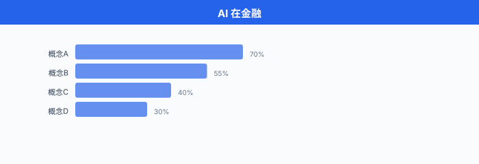

# AI 在金融

> **一句话总结**: 金融是 AI 最早也最卷的落地场景, 从时序预测、量化交易到风控反欺诈, 全套 ML 工具都在这里被实战检验.

## 🗺️ 本章导览

- 本章覆盖应用 AI: 金融 → 蛋白设计 → 药物发现 → 智能体系统 → 医疗
- **01. AI 在金融** (本节): 量化交易、风控、反欺诈
- **02. 蛋白质设计**: AlphaFold、蛋白结构预测与设计
- **03. 药物发现**: 待补
- **04. 智能体系统**: 待补
- **05. 医疗健康**: 待补

*金融数据看似杂乱: 股价、订单、新闻、财报、社交媒体头像, 万物皆可入模. 但金融也最残忍——任何策略哪怕 0.1% 的优势, 在复利下都会被放大; 任何延迟哪怕 1 毫秒, 在 HFT 战场上都会被对手吃掉. 所以这一节里的"算法"不是 PyTorch 课设, 而是真正在替人赚/亏钱的生产系统. 我们就按"预测 → 决策 → 风险 → 反欺诈 → NLP"的真实流水线把这一节过一遍.*

---

## 1. 时序预测: 从 ARIMA 到 Transformer

金融时间序列是 AI 落地的"老兵战场". 一只股票 1 秒钟可以出 100 笔报价, 一年的数据动辄上亿 tick; 而你只想回答一个朴素的问题——**明天的收盘价是涨是跌?** 围绕这个问题, 业界用了 50 多年换了一代又一代模型.

### 1.1 经典三件套: ARIMA、指数平滑、Prophet

先说**自回归积分滑动平均模型** (AutoRegressive Integrated Moving Average, ARIMA). 它由 Box 和 Jenkins 在 1970 年代系统化, 核心思想是: 把时间序列拆成"自回归 (AR) + 差分 (I) + 滑动平均 (MA)" 三段, 用过去 $p$ 步的值、过去 $q$ 步的残差来回归出当前值. 实际表达式可以写成

$$
\phi(B) (1 - B)^d y_t = \theta(B) \varepsilon_t,
$$

其中 $B$ 是滞后算子 ($B y_t = y_{t-1}$), $\phi(B) = 1 - \phi_1 B - \dots - \phi_p B^p$, $\theta(B) = 1 + \theta_1 B + \dots + \theta_q B^q$, $\varepsilon_t$ 是白噪声. 训练时主要靠极大似然估计 (Maximum Likelihood Estimation, MLE) 把 $\phi, \theta, \sigma^2$ 拟合出来.

ARIMA 的优势是**可解释性强、统计性质清晰**（有 Box-Jenkins 建模流程, ACF/PACF 选阶, 单位根检验 ADF 等一整套工具箱). 但它的短板同样出名: 只能处理单变量、线性、平稳序列, 遇到波动率聚类、肥尾、跳跃这些金融特色就抓瞎.

**指数平滑** (Exponential Smoothing, ES) 是另一条平行的简单流派, 用指数衰减的权重对过去观测加权平均, 又有 Holt-Winters 加上趋势项和季节项. 它计算便宜、适合低频数据, 但本质上仍是"线性外推", 复杂模式学不来.

**Prophet** 是 Facebook (Meta) 在 2017 年开源的工具, 由 Sean J. Taylor 和 Benjamin Letham 在论文《Forecasting at Scale》中提出. 它把时间序列拆成

$$
y(t) = g(t) + s(t) + h(t) + \varepsilon_t,
$$

其中 $g(t)$ 是趋势项 (可用分段线性或 Logistic 增长), $s(t)$ 是周期项 (用傅里叶级数), $h(t)$ 是节假日效应, $\varepsilon_t$ 是噪声. Prophet 的卖点不是精度领先, 而是**让无统计背景的工程师能调好模型**——基本上是给 ARIMA 打上一层"开箱即用"的封装.

### 1.2 神经网络打法: LSTM、TFT、PatchTST

从 2017 年开始, 神经网络在金融时序上把"非线性 + 多变量 + 长记忆"三块短板一次补齐. **长短期记忆网络** (Long Short-Term Memory, LSTM) 通过输入门、遗忘门、输出门三重门控, 解决了普通 RNN 的梯度消失问题. Fischer 和 Krauss 在 2018 年的经典论文 *Deep learning with long short-term memory networks for financial market predictions* (European Journal of Operational Research, 2018) 里, 用 LSTM 预测 S&P 500 成分股的方向, 在 1992–2015 年回测中拿到了 0.46% 的日均收益和 5.8 的夏普比率, 显著优于随机森林、深度神经网络和逻辑回归等"无记忆"基线. 不过作者也警告: 2010 年之后超额收益明显衰减, 暗示市场套利正在抹平这条 alpha.

但 LSTM 仍然贵、训练慢、梯度容易爆. 到了 2020 年前后, Transformer 系列的时序模型开始登场:

- **时序融合 Transformer** (Temporal Fusion Transformer, TFT) 由 Bryan Lim、Sercan O. Arik、Nicolas Loeff、Tomas Pfister 在 2021 年的 *International Journal of Forecasting* 上提出 (arXiv:1912.09363). 它的贡献是**多步预测 + 多变量 + 可解释**: 用 Variable Selection Networks 自动挑变量, 用 Static Covariate Encoders 处理时不变特征, 用 Quantile Output 给出预测区间, 再用 Interpretable Multi-Head Attention 让人能看到每个时间步对每个变量的注意力. 这套组合拳让 TFT 在零售、电力、金融多个公开数据集上稳居当年 SOTA. 一个最小预测的 TFT 块大致可写为

$$
\hat{y}_t(\tau) = \mathrm{Quantile}\!\left( \mathbf{W}_o \cdot \mathrm{LSTM}\!\left(\mathbf{x}_{1:t}\right), \tau \right), \quad \tau \in \{0.1, 0.5, 0.9\},
$$

其中的 Quantile loss 让模型**直接学出区间**, 不再做高斯假设, 对金融这种肥尾分布特别友好.

- **PatchTST** 是 Yuqi Nie, Nam H. Nguyen, Phanwadee Sinthong, Jayant Kalagnakam 在 ICLR 2023 上发表的工作 (arXiv:2211.14730). 标题 *A Time Series is Worth 64 Words* 一句话概括了核心思想: 把一段时序切成若干**固定长度的小 patch** (常用 16 或 64), 把每个 patch 当作一个"词"送进 Transformer. 这种设计借鉴了 Vision Transformer (ViT) 对图像的处理方式, 一举解决了原生 Transformer 在长时序预测上的两个痛点 (1) 注意力矩阵 $O(L^2)$ 计算量爆炸; (2) 单点 token 噪声大, 模型学不到局部结构. PatchTST 在电力、天气、ET 等 7 个公开数据集上以**不到 1/4 的参数量**拿到了 state-of-the-art.

下面这段伪代码展示了一个最小 PatchTST 预测器的运行流程 (PyTorch 风格):

```python
import torch
import torch.nn as nn

class PatchTST(nn.Module):
    def __init__(self, n_channels, patch_len=16, stride=8, d_model=128, n_heads=4, horizon=96):
        super().__init__()
        self.patch_len = patch_len
        self.stride = stride
        # 1) 把 [B, L, C] 切成 [B, C, num_patches, patch_len]
        self.patch_proj = nn.Linear(patch_len, d_model)
        # 2) 编码器: 多头自注意力
        encoder_layer = nn.TransformerEncoderLayer(
            d_model=d_model, nhead=n_heads, dim_feedforward=256, batch_first=True
        )
        self.encoder = nn.TransformerEncoder(encoder_layer, num_layers=3)
        # 3) 预测头: 把每个 patch 的表征 flatten, 回归到 horizon
        self.head = nn.Linear(d_model * 32, horizon)

    def forward(self, x):
        # x: [B, L, C], 这里 L=512, C=单变量
        x = x.transpose(1, 2)                    # [B, C, L]
        # 切片成 patch
        patches = x.unfold(2, self.patch_len, self.stride)  # [B, C, num_patches, patch_len]
        patches = self.patch_proj(patches)       # [B, C, num_patches, d_model]
        # 把 channel 维并到 batch 维 (channel-independent)
        B, C, N, D = patches.shape
        patches = patches.reshape(B * C, N, D)
        z = self.encoder(patches)                # [B*C, N, d_model]
        z = z.reshape(B, C, -1)                  # [B, C, N*d_model]
        y = self.head(z)                         # [B, C, horizon]
        return y

# 训练: 用 MSE 或 Quantile loss, 优化器 Adam, lr=1e-3
model = PatchTST(n_channels=1, patch_len=16, stride=8, horizon=96)
opt = torch.optim.Adam(model.parameters(), lr=1e-3)
for x, y in dataloader:                         # y: [B, 96, 1]
    pred = model(x)
    loss = ((pred - y.squeeze(-1)) ** 2).mean()
    opt.zero_grad(); loss.backward(); opt.step()
```

这里我们顺手做了一个常见魔法: **channel-independent**——把每个变量单独编码, 不在 channel 维度上做 attention. 论文里说这反而比 channel-mixing 表现更稳, 也少很多参数. 工业落地时, 通常会用矩阵分解或协方差矩阵代替 attention, 但对于学生来说, 这版 PatchTST 足够了.

### 1.3 时序预测的几个"金融专属陷阱"

无论用 ARIMA 还是 Transformer, 几个坑都躲不掉:

1. **信噪比极低**. 股价日收益的方差里, 大约 80% 都来自日内噪声, 真正可预测的"信号"微乎其微. 再深的模型, 训练到后期只会去拟合噪声.
2. **样本非平稳且分布漂移**. 2020 年的 COVID、2022 年的加息, 任何模型都"没见过", 训练-测试分布严重错位.
3. **过拟合是常态**. 金融数据看似海量, 但独立样本数 = 交易日数 $\approx$ 250/年, 几十年也就 1 万多. 这跟 ImageNet 百万级没法比.
4. **回测陷阱**. 用同一段历史既做训练又做验证, 会在结果里"水分" $n$ 个百分点. 严格 walk-forward 检验 + 样本外测试不可省.
5. **幸存者偏差** (Survivorship Bias). 数据源里如果只留了"今天还在交易" 的公司, 相当于把过去 20 年退市 / 破产 / 私有化的失败案例全部剔除掉. 用这样一个 CRSP / Compustat 的"净版本"跑回测, 年化收益可以被高估 1–4 个百分点 (Elton, Gruber, Blake 1996 在共同基金上验证过). 幸存者偏差同样在对冲基金数据库 (HFR、TASS) 里更严重——绩效差的基金一停止上报, 就永远从数据库里消失. 严谨做法是使用**含退市股** (delisted stocks) 的数据集, 或至少对样本做 back-fill 检查.

把这五件事记在脑子里, 再讨论"AI 是不是能预测股价"才不至于走火入魔.

---

## 2. 算法交易: 信号、执行、微观结构

### 2.1 信号生成: 从来到信号、到策略

时序预测给出"明天这只股票大概率涨"——这只是**信号** (signal). 把它变成"今天下午 2 点 30 分用 100 万元按对手价买 5000 股" 还需要一整套**交易流水线**: 仓位管理、订单拆分、撤单重发、风险检查……

一个最简化的"信号 → 订单"管线可以写成

$$
\mathbf{a}_t = \sigma(\mathbf{S}_{t-1}; \theta), \quad \mathbf{w}_t = \mathrm{normalize}(\mathbf{a}_t), \quad \mathbf{x}_t = V_t \cdot \mathbf{w}_t,
$$

其中 $\sigma$ 是策略函数 (可以是线性回归、神经网络、强化学习策略), 输出未来期望收益 $\mathbf{a}_t \in \mathbb{R}^n$ (n 只股票). 然后用 softmax 或简单归一化把它变成目标权重 $\mathbf{w}_t$. 最后 $V_t$ 是账户总价值, $\mathbf{x}_t$ 就是这一时刻要发出/收回的股数. 这中间还会套一层 **turnover penalty** (换手惩罚) 和 **leverage cap** (杠杆上限), 避免模型一兴奋就满仓梭哈.

### 2.2 执行算法: TWAP 和 VWAP

真正下单时, 你不会一次性"扫货 5000 股"——那会在订单簿上留下明显痕迹, 推动价格向不利方向移动, 俗称**市场冲击** (market impact). 主流买方机构的做法是把"大单"拆成若干小单, 均匀地撒在一段时间里.

**时间加权平均价格** (Time-Weighted Average Price, TWAP) 是最简单的拆单方式: 把总单量除以总时间, 每个时间片断下等量小单. 公式一句话:

$$
x^{\text{TWAP}}_k = \frac{X}{K}, \quad k = 1, 2, \dots, K,
$$

$X$ 是总单量, $K$ 是切片数, 每片 $X/K$ 股. 优点是简单可预测, 缺点是它**完全不管成交量节奏**——开盘半小时市场最活跃, 收盘前半小时清淡, 它都用同一速率下单, 容易在清淡时段暴露意图.

**成交量加权平均价格** (Volume-Weighted Average Price, VWAP) 改进了一版: 按预期成交量分布加权, 让下单节奏跟市场同步. 公式是

$$
x^{\text{VWAP}}_k = X \cdot \frac{\hat{v}_k}{\sum_{j=1}^{K} \hat{v}_j},
$$

其中 $\hat{v}_k$ 是第 $k$ 个时间窗的预测成交量. VWAP 的常用基准是"用 VWAP 策略下单, 实际成交均价比当天市场 VWAP 偏离多少 bps", 偏离越小说明执行越好. 这就是实盘里被反复提到的"VWAP slippage".

下面是一个用 `pandas` 模拟 VWAP 拆单的最小代码:

```python
import numpy as np
import pandas as pd

def vwap_schedule(total_shares, adv_curve):
    """
    total_shares: 需执行的总量
    adv_curve:    一天 K 个时间窗的预计成交量占比 (和=1)
    """
    adv_curve = np.asarray(adv_curve)
    assert np.isclose(adv_curve.sum(), 1.0)
    return np.round(total_shares * adv_curve).astype(int)

# 假设一天有 6 个 30 分钟窗口, 开盘/收盘活跃, 中午清淡
adv_curve = np.array([0.30, 0.20, 0.15, 0.10, 0.15, 0.10])
schedule = vwap_schedule(total_shares=10_000, adv_curve=adv_curve)
print("各时段下单股数:", schedule.tolist())
# 输出: [3000, 2000, 1500, 1000, 1500, 1000]
```

工业上还有 IS (Implementation Shortfall)、POV (Percentage of Volume)、Iceberg、Snipe 等数十种执行算法, 核心都是"既快又便宜地吃掉想要的头寸, 又不被人察觉". 这一块, 学术界最好的综述是 Almgren 和 Chriss 2000 年那篇 *Optimal Execution of Portfolio Transactions*.

### 2.3 市场微观结构

**市场微观结构** (market microstructure) 研究的是"订单是怎么在撮合引擎里被匹配、价格怎么形成的"那层规则. 它的核心对象是 **订单簿** (order book): 每个时刻, 买卖双方各挂一摞限价单, 撮合引擎按"价格优先 + 时间优先"逐笔成交. 一个简化模型中, 订单簿第 $k$ 档的 mid-price 可以写成

$$
p^{\text{mid}}_t = \frac{p^{\text{ask}}_t(k) + p^{\text{bid}}_t(k)}{2},
$$

订单簿不平衡 (order book imbalance) 是个非常实用的短期预测信号:

$$
\text{OBI}_t(k) = \frac{V^{\text{bid}}_t(k) - V^{\text{ask}}_t(k)}{V^{\text{bid}}_t(k) + V^{\text{ask}}_t(k)},
$$

其中 $V^{\text{bid}}_t(k)$ / $V^{\text{ask}}_t(k)$ 是买卖前 $k$ 档累计挂单量. 当 $\text{OBI}_t$ 显著为正, 意味着买盘远比卖盘挂得厚, 短期价格大概率上行. 这种"信号"层很浅, 但胜在鲁棒, 几乎不依赖任何宏观叙事.

微观结构还衍生出一个有意思的玩法: **做市** (market making). 做市商在买卖两边同时挂限价单, 赚价差; 但要承担"被聪明交易员反向选择"的风险. 1950 年代以来, Avellaneda-Stoikov 这套经典模型一直被高频做市引用, 2021 年后 RL/IRL 策略又开始跟它打配合. 这条路偏研究, 工程量极大, 学生项目里通常只做几轮仿真就够.

**监管补丁: Reg NMS**. 讨论美股微观结构绕不开 **全国市场系统规则** (Regulation National Market System, Reg NMS), 由美国证监会 (US Securities and Exchange Commission, SEC) 于 2005 年通过、2007 年全面生效. 其中最著名的 **Rule 611 "订单保护规则"** (Order Protection Rule, 也称 trade-through rule) 要求交易所在成交时不得穿透其他交易所显示的更优报价——换句话说, 如果 NYSE 挂着 100.00 的最优买价, NASDAQ 不能以 99.99 直接成交, 必须先把订单路由到 NYSE. 这条规则一手催生了 **智能订单路由** (Smart Order Router, SOR) 和 **高频交易** (High-Frequency Trading, HFT) 两个百亿美金级子产业: 谁能最快扫遍全美 16 个交易所的最优价、并在 1 毫秒内决策路由, 谁就吃到 rebate 和价差 (参见 SEC 官网 *Regulation NMS* 与 Michael Lewis 2014 年的 *Flash Boys* 一书对 IEX 起源的记述). 从 AI 视角看, Reg NMS 决定了美国算法交易系统必须做**全市场行情整合、亚毫秒级延迟、订单路由优化**——这三件事没有 AI 模型能绕开.

### 2.4 深度强化学习做交易

把"建仓 → 持仓 → 平仓"整段过程看成一个**马尔可夫决策过程** (Markov Decision Process, MDP), 用强化学习 (Reinforcement Learning, RL) 让一个智能体直接学"最优策略 $\pi(a|s)$", 是 2017 年以来的热门方向. 经典代表是 Zhengyao Jiang, Dixing Xu, Jinjun Liang 在 2017 年发表的 *A Deep Reinforcement Learning Framework for the Financial Portfolio Management Problem* (arXiv:1706.10059). 他们的设定是: 状态 $s_t$ 包含价格历史和当前持仓, 动作 $a_t$ 是调整后的持仓向量, 奖励是 log-return 加上换手惩罚. 用 DDPG / PPO 类连续动作算法直接端到端学, 在加密货币回测里跑出了"扣费后正收益"的结果.

2019 年之后, **FinRL** (Xiao-Yang Liu, Hongyang Yang, et al., arXiv:2011.09607) 把这条路径开源化, 提供了 DQN / DDPG / A2C / PPO / SAC 一整套 reference agents, 并接入 Yahoo Finance、Alpaca、CCXT 等数据源, 金融 RL 自此有了"标准起点". FinRL 在 NeurIPS 2020 Deep RL Workshop 上首次发布, 之后持续迭代 (截止 2024 年已经到 FinRL-Meta).

下面是一段 RL 组合管理的最小伪代码 (用 PPO 思想, 用来教学):

```python
import torch
import torch.nn as nn

class PortfolioActor(nn.Module):
    """策略网络: 把过去 L 天价格 + 当前持仓, 输出新持仓权重"""
    def __init__(self, n_assets, hidden=64):
        super().__init__()
        self.lstm = nn.LSTM(n_assets, hidden, batch_first=True)
        self.fc = nn.Linear(hidden + n_assets, n_assets)  # 拼接当前持仓

    def forward(self, prices, prev_w):
        # prices: [B, L, n_assets], prev_w: [B, n_assets]
        h, _ = self.lstm(prices)
        z = torch.cat([h[:, -1], prev_w], dim=-1)
        # 使用 softmax 保证权重和=1
        w = torch.softmax(self.fc(z), dim=-1)
        return w

# 训练: 奖励 = log(w_t^T p_t / w_{t-1}^T p_{t-1}) - c * ||w_t - w_{t-1}||_1
# 用 PPO 的 clipped objective 更新
actor = PortfolioActor(n_assets=10)
opt = torch.optim.Adam(actor.parameters(), lr=3e-4)

for prices, prev_w in dataloader:
    new_w = actor(prices, prev_w)
    log_return = torch.log((new_w * prices[:, -1]).sum(-1) /
                           (prev_w * prices[:, -1]).sum(-1) + 1e-8)
    turnover = (new_w - prev_w).abs().sum(-1)
    reward = log_return - 0.001 * turnover
    # PPO 损失省略 (ratio * advantage - clip...)
    loss = -reward.mean()
    opt.zero_grad(); loss.backward(); opt.step()
```

注意实测时一定要比 (a) 等权重配置 (b) 60/40 股债 (c) 简单动量策略. 因为 RL 在金融上极容易"看起来厉害实则过拟合", 这点要刻在脑子里.

---

## 3. 组合优化: Markowitz 到 Black-Litterman

### 3.1 均值-方差: 1952 年的开山之作

把"鸡蛋放在不同篮子里"这件事写成数学, 归功于 Harry Markowitz 1952 年的博士论文 *Portfolio Selection*. 他提出: 投资者同时关心**期望收益**和**风险** (用方差或标准差度量), 理性的选择应当是给定风险下最大化收益, 或给定收益下最小化风险. 写成带权重的公式:

$$
\mathbf{w}^* = \underset{\mathbf{w}}{\arg\min}\; \mathbf{w}^\top \Sigma \mathbf{w} \quad \text{s.t.} \quad \mathbf{w}^\top \boldsymbol{\mu} = r_{\text{target}}, \quad \mathbf{w}^\top \mathbf{1} = 1,
$$

其中 $\mathbf{w} \in \mathbb{R}^n$ 是 $n$ 只资产的权重, $\boldsymbol{\mu}$ 是期望收益向量, $\Sigma$ 是协方差矩阵. Lagrange 乘子法可以解出闭式

$$
\mathbf{w}^* = \lambda \Sigma^{-1} \boldsymbol{\mu} + \gamma \Sigma^{-1} \mathbf{1},
$$

其中 $\lambda, \gamma$ 由约束反解. 这是经典教科书式答案, 但有个著名缺陷: **协方差矩阵和期望收益的估计误差会被放大 $n$ 倍**, 实际投资出来的组合跟理论最优差得远. Michaud (1989) 把这个叫做 *Markowitz optimization error*, 后来的 shrinkage estimator (Ledoit-Wolf) 就是为缓解它而设计.

### 3.2 Black-Litterman: 用"主观观点" 调权重

1992 年, Fischer Black 和 Robert Litterman 在 Goldman Sachs 内部提出一种改进: 把**先验** (市场均衡收益) 和**主观观点** (投资者对某资产的看涨/看跌) 贝叶斯地融合, 让权重更"稳". 完整公式是

$$
\mathbb{E}[\mathbf{r} \mid \text{views}] = \left[ (\tau \Sigma)^{-1} + \mathbf{P}^\top \Omega^{-1} \mathbf{P} \right]^{-1} \left[ (\tau \Sigma)^{-1} \boldsymbol{\Pi} + \mathbf{P}^\top \Omega^{-1} \mathbf{Q} \right],
$$

其中 $\boldsymbol{\Pi}$ 是市场均衡收益 (隐含在市值权重里), $\mathbf{P}$ 是观点矩阵 (哪几个资产有观点), $\mathbf{Q}$ 是观点向量 (看涨几个点), $\Omega$ 是观点置信度 (对角矩阵), $\tau$ 是先验强度. 直观上, 当 $\mathbf{P}, \mathbf{Q}$ 都为空时, Black-Litterman 退化为市指权重; 当观点很确定 ($\Omega$ 很小) 时, 输出会被观点"拉"过去. 它在工业界极受欢迎, 大量买方机构 (养老基金、主权财富基金、多策略对冲基金) 的资产配置系统都是 Black-Litterman 的工程化变体. 顺带说明: PivotalPath 并非 Goldman Sachs 的内部系统, 而是 Jon Caplis 创立的独立对冲基金研究/数据公司 (据 PivotalPath 官网自述), 与 Black-Litterman 模型没有直接关联.

### 3.3 强化学习做组合管理

把第 2.4 节里 RL 交易的整体思路再往上扩一层, 就不再是"资产之间的切换", 而是"全球股票/债券/商品/黄金/现金之间的大类资产配置"——这就是 **RL-based portfolio management** 的场景. 我们前面提到的 FinRL 库提供了 5 个标准任务场景: 单一股票交易、多股票交易、组合管理、加密货币组合、High Frequency Trading. 状态空间、动作空间、奖励函数都有现成模板, 这里我们就不重复代码了.

工业上动手前, 请先心里默念三遍: **(1) 训练集 / 验证集 / 测试集必须严格时序分离**; **(2) 必须扣交易费用和滑点**; **(3) 至少跑 10 个独立 seed, 报告均值 ± 标准差**. 任何回测曲线光鲜、不做这三条的论文, 都很难被严肃对待.

### 3.4 回测有多可信? 衰减夏普比率

你自己窝在工位上跑了 200 个策略, 最好那个夏普 2.5——这算发现 alpha 还是运气? 这个问题正是 David H. Bailey (不是 David H. Bailey 那个高精度数学的, 是 University College London 的量化研究员) 和 Marcos López de Prado 在 2014 年论文 *The Deflated Sharpe Ratio* (Journal of Portfolio Management, 2014) 里认真回答的.

核心直觉: 如果你**同时试了 N 个策略**, 只看夏普最高的那个, 那这个"最高夏普"的分布就不是标准正态了——它来自 N 个独立试验的极值分布 (Extreme Value Distribution). 定义**衰减夏普比率** (Deflated Sharpe Ratio, DSR):

$$
\text{DSR} = \Pr\!\left( \mathrm{SR}^* \le \text{SR}_0 \right) = Z\!\left[ \frac{\text{SR}_0 - \mathbb{E}[\mathrm{SR}^*]}{\sqrt{\mathrm{Var}(\mathrm{SR}^*)}} \right],
$$

其中 $\mathrm{SR}^*$ 是 N 次试验中预期最大夏普的分布 (在零假设 $H_0: \mathrm{SR} = 0$ 下), $\mathrm{SR}_0$ 是你实际跑出来的夏普, $Z[\cdot]$ 是标准正态 CDF. 如果 DSR 接近 1, 说明你的 SR 远超"纯靠运气擦出来的最高夏普", 大概率是真 alpha; 如果 DSR 只有 0.6, 那你的 2.5 夏普跟 200 个随机策略里挑最好的没什么区别.

Bailey 和 López de Prado 还顺带烧了另一把火: **即便你只试了 10 个策略, 0.05 显著性水平下的 "发现" 也大概率是假的**——因为极端夏普的期望值随 N 增长而显著上升, 记不住公式没关系, 记住结论: 在金融回测里, 多重检验 (multiple testing) 是一个比你想象中更严重的 bug. 这条结论同时跟第 1.3 节提到的幸存者偏差 (survivorship bias) 叠加——数据已经剔除了退市股, 回测已经选过最优策略, 这些"前后夹击" 的偏差能让你以为的 2.0 夏普实际只有 0.5.

---

## 4. 风险建模: VaR、ES、蒙特卡罗

### 4.1 在险价值 (Value at Risk, VaR)

拿到一个组合后, 你必须回答"明天最坏情况下我会亏多少". 一个简洁的答案是 **在险价值** (Value at Risk, VaR):

$$
\mathrm{VaR}_\alpha(\Delta V) = -\inf\{ x : P(\Delta V \le x) \ge 1 - \alpha \},
$$

直观意思: 置信水平 $\alpha = 99\%$ 下, 一天亏超过 VaR 的概率不超过 1%. 比如 1 天 99% VaR = 100 万元, 意味着"明天有 99% 的概率亏损不超过 100 万, 1% 的概率会超过 100 万". VaR 之所以流行多年, 因为它**简单、能直接对应监管资本** (Basel III 的市场风险资本就是以 VaR 为基础).

但 VaR 有两个被骂得最多的缺点: (a) 它**不告诉你在超过 VaR 之后会亏多少**——也就是"尾部行为" 完全是黑的; (b) 它**不满足次可加性** (sub-additivity), 两个组合的 VaR 可能大于各自 VaR 之和, 在风险管理上是反直觉的 (合并反而增加风险). 这就是 Basel 委员会后来要求补充 Expected Shortfall 的原因.

### 4.2 预期损失 (Expected Shortfall)

为补 VaR 短板, 业内改用 **预期损失** (Expected Shortfall, ES) 也叫 **条件 VaR** (Conditional VaR, CVaR):

$$
\mathrm{ES}_\alpha(\Delta V) = -\mathbb{E}\left[ \Delta V \,\middle|\, \Delta V \le -\mathrm{VaR}_\alpha \right] = -\frac{1}{1-\alpha} \int_0^{1-\alpha} \mathrm{VaR}_u(\Delta V)\, du.
$$

它等于 "尾部期望"——把 VaR 阈值以下的全部亏损的平均值取出来. ES 同时满足次可加性、单调性, 数学性质更优, 已成为 Basel III (FRTB) 内部模型法的首选.

### 4.3 蒙特卡罗 (Monte Carlo) 模拟

对于资产组合涉及**非线性衍生品** (期权、可转债、结构性票据) 时, 损失分布根本不是高斯, 解析解几乎算不出. 这时只能靠**蒙特卡罗** (Monte Carlo) 模拟: 按某种动力学模型 (最常见是几何布朗运动) 模拟出 $N$ 条未来路径, 每条路径算一次组合价值, 取分位数就是 VaR, 取尾部均值就是 ES. 大致算法:

```python
import numpy as np

def monte_carlo_var_es(returns, n_sims=100_000, alpha=0.99, horizon=1):
    """
    用历史自助法 (bootstrap) 估计 1 天 VaR / ES
    returns: 过去收益率序列, shape [T]
    """
    T = len(returns)
    # 1) 历史自助法采样
    sims = np.random.choice(returns, size=(n_sims, horizon), replace=True)
    # 2) 累计收益 = (1+r1)*(1+r2)*...-1
    port_loss = 1 - np.prod(1 + sims, axis=1)
    # 3) VaR = 1-alpha 分位数
    var = np.quantile(port_loss, 1 - alpha)
    # 4) ES = 超过 VaR 的均值
    es = port_loss[port_loss >= var].mean()
    return var, es

# 假设年化 250 天, 日均 0.02%, 波动 1.5%
r = np.random.normal(0.0002, 0.015, size=1500)
var, es = monte_carlo_var_es(r)
print(f"99% VaR = {var:.4f}, 99% ES = {es:.4f}")
```

简单粗暴但有效. 在生产里, 银行会用 GARCH、Copula、随机波动率等更花哨的模型替换简单自助法, 但基本架子一样.

### 4.4 信用评分

风险建模的另一头是"借款人会不会违约"——也就是**信用评分** (credit scoring). 传统上是基于 Logistics 回归的打分卡, 现代则大量使用 XGBoost / LightGBM 树模型, 偶尔也有 LSTM 测按揭或信用卡的时序行为. 评级离不开两个核心量:

$$
\text{PD} = P(\text{default} \mid \mathbf{x}), \quad \text{LGD} = \mathbb{E}[\text{loss} \mid \text{default}], \quad \text{EAD} = \text{exposure at default},
$$

EL (Expected Loss) = PD × LGD × EAD. 银行把这三者拆分建模, 分别对应违约概率、违约损失率、违约风险敞口. 信用评分卡在零售信贷里是 regulatory 的硬指标 (银保监会、巴塞尔), 任何模型都得能解释"为什么这个客户是 680 分, 那个是 620 分", 因此 SHAP / LIME 这类模型解释工具 (我们在第 7 节详细介绍) 大受欢迎.

### 4.5 Basel III 简述

巴塞尔协议 III (Basel III) 是 G20 金融危机之后, 巴塞尔银行监管委员会对全球银行业的资本和风控统一要求. 三个核心比例:

$$
\text{LCR} = \frac{\text{HQLA}}{\text{30 天净现金流出}} \ge 100\%, \quad
\text{NSFR} = \frac{\text{可用稳定资金}}{\text{所需稳定资金}} \ge 100\%, \quad
\text{CAR} = \frac{\text{资本}}{\text{RWA}} \ge 8\%,
$$

分别是流动性覆盖率、净稳定融资比例、资本充足率. 任何 AI 风控模型在落地前, 都要先回答"它出具的 VaR / ES 能不能被监管接受". 这就是为什么金融 AI 比其他领域更重视**可解释性、合规性、可追溯性**——不是工程师老古板, 是法律逼的.

---

## 5. 欺诈检测: 异常、图、流式

欺诈检测 (fraud detection) 是 AI 在金融里"真金白银"省钱的场景——Visa、Mastercard、支付宝、微信支付每年因欺诈损失数百亿美元, 每减少 1% 损失就是数十亿. 它的难度在于三件事: (a) 欺诈是**极少数类** (正样本 < 0.1%); (b) 欺诈手法**不断演化**; (c) 几乎所有场景都是**实时** (一笔交易 100ms 内要决定放不放).

### 5.1 异常检测: Isolation Forest

**孤立森林** (Isolation Forest, iForest) 是刘飞、丘明、周志华 2008 年在 IEEE ICDM 上提出的算法. 核心思路是反直觉的——**异常点更容易被孤立**. 通过随机选特征、随机选切分点, 把样本点递归切分, 异常点往往在很浅的深度就被孤立, 正常点要切很多刀才分得开. 异常分数定义为

$$
s(x, n) = 2^{-\frac{E(h(x))}{c(n)}}, \quad c(n) = 2 H(n-1) - \frac{2(n-1)}{n},
$$

其中 $h(x)$ 是样本 $x$ 在树中的路径长度, $E(h(x))$ 是多棵树的平均, $c(n)$ 是归一化常数, $H(\cdot)$ 是调和数. $s$ 越接近 1 越异常.

iForest 的优势是**无监督** (不需要已知欺诈标签) 且**线性复杂度** $O(n \log n)$, 适合每天新增千万笔交易时做 batch 异常扫描. 缺点是它只看单个样本的几何特征, 不会用"人与人之间的关系".

### 5.2 图模型: GCN / GraphSAGE 抓欺诈网络

金融欺诈常常不是"单笔交易异常", 而是"一群人/账户联合起来骗". 比如洗钱、套现、虚假账号环、团伙骗保——这些场景里"关系" 才是关键信号. 这时就要把账户 → 节点, 交易 → 边的图搭起来, 用**图神经网络** (Graph Neural Network, GNN) 学习节点表征.

- **GraphSAGE** (SAmpling and aggreGatE) 是 William L. Hamilton, Rex Ying, Jure Leskovec 在 NIPS 2017 上提出的归纳式 GNN (Hamilton et al., 2017). 它不学整张图, 而是学一种"邻居采样 + 特征聚合" 的函数, 给新节点也能直接出嵌入. 这在金融场景特别合适, 因为每天会冒新账户/新设备, 整图重训成本极高. GraphSAGE 的核心更新式可以写成

$$
\mathbf{h}_v^{(k)} = \sigma\!\left( \mathbf{W}^{(k)} \cdot \mathrm{Concat}\!\left(\mathbf{h}_v^{(k-1)}, \mathrm{AGG}\!\left(\{\mathbf{h}_u^{(k-1)} : u \in \mathcal{N}(v)\}\right)\right) \right),
$$

其中 $\mathcal{N}(v)$ 是节点 $v$ 的邻居采样集合, $\mathrm{AGG}$ 可以是 Mean / Pooling / LSTM. 金融场景里常见的做法是: 用过去 30 天的转账 / 设备共享 / IP 共现 关系构图, 每个账户节点拿过去行为特征 (交易频次、金额方差、活跃时段) 作为初始 $\mathbf{h}_v^{(0)}$, 跑 2-3 层 GraphSAGE, 把最后一层嵌入送进 XGBoost 做分类.

- **GCN for AML**: Mark Weber, Giacomo Domeniconi, Jie Chen, Daniel Karl I. Weidele, Claudio Bellei, Tom Robinson, Charles E. Leiserson, Ke Pan 在 2019 年的论文 *Anti-Money Laundering in Bitcoin: Experimenting with Graph Convolutional Networks for Financial Forensics* (arXiv:1908.02591) 里, 直接把 Elliptic 数据集 (20 万节点、23 万边, 比特币交易图) 跑 GCN, 拿到了比 LR / RF 好 1-2 个百分点的 F1. 这也是 AML 领域较早的端到端 GNN 范式工作.

```
建议图: 金融欺诈检测的图结构流程
src/第19章 - 应用 AI/../../images/ch19_01_fraud_graph.svg
```

### 5.3 实时流处理

生产系统里, 大额交易会冻结 5-10 分钟让风控跑完后放行, 小额交易则在 100ms 内要决定. 这就需要**流式机器学习** (online ML): 模型参数不断用新数据微调, 滑动窗口持续更新特征. 工程上常用 Kafka + Flink / Spark Streaming 做"特征实时计算 + 模型实时推理", 模型侧用 PMML / ONNX / 自研 Serving 加载. 这种"特征-推理在线一致" 的架构在阿里、字节、腾讯的反欺诈系统里都属于"造火箭级别" 的标配, 学生项目里通常用 Redis + Python 简单跑 demo 即可.



---

## 6. 金融 NLP 与 LLM: BloombergGPT、FinGPT、情感分析

2023 年之后, 大语言模型 (Large Language Model, LLM) 在金融领域全面开花. 两条主要路径:

### 6.1 训练专用金融大模型

**BloombergGPT** 是 Shijie Wu, Ozan Irsoy, Steven Lu, Vadim Dabravolski, Mark Dredze, Sebastian Gehrmann, Prabhanjan Kambadur, David Rosenberg, Gideon Mann 在 2023 年联合发布的金融专用 LLM (arXiv:2303.17564). 它是标准的 Decoder-only Transformer, 50B 参数, 在 Bloomberg 内部 40 年的金融文档 + 通用语料上混合训练. 内部评测显示, 在金融基准 (NER、Sentiment、QA) 上 BloombergGPT 优于同尺寸的通用模型, 但在通用 LLM 基准上略输. 这印证一个朴素经验: **领域大模型在领域内部可以做到更好, 但领域外的通用能力会略降**.

**FinGPT** 是 Hongyang Yang, Xiao-Yang Liu (刘晓阳), Christina Dan Wang 在 2023 年提出的开源金融 LLM (arXiv:2306.06031), 在 IJCAI 2023 FinLLM Symposium 还拿了 Best Presentation Award. 它跟 BloombergGPT 路线不同, 强调**轻量化 + 数据驱动 + 可私有化部署**: 用 LoRA + 公开金融数据微调开源底座 (LLaMA / ChatGLM), 让中小机构也能承受. Yang、Liu 等团队后续还做了 FinGPT-Forecaster (分析师预测)、FinGPT-Sentiment (情感分析) 等多个子项目, 走社区驱动路线.

下面是一个用 Hugging Face 对金融文本做零样本情感分析的最小例子:

```python
from transformers import pipeline

# 零样本情感: 不需要训练, 直接给候选标签
classifier = pipeline("zero-shot-classification",
                      model="facebook/bart-large-mnli")

text = "Alibaba's Q3 revenue beat estimates; cloud segment grew 30% YoY."
labels = ["bullish", "bearish", "neutral"]

result = classifier(text, candidate_labels=labels)
print(result["labels"][0], result["scores"][0])
# 输出大致: bullish 0.83 ...
```

把它放进一个爬虫 pipeline, 每天扫 1000 条新闻, 就能构造一个"市场情绪指数", 再叠加到第 2 节那个组合策略里, 就是一条端到端的"新闻 → 仓位" 链路.

### 6.2 金融情感分析

情感分析 (sentiment analysis) 是金融 NLP 最常见的入口. 经典做法是 **(a) 词典法** (Loughran-McDonald 金融情感词典) + **(b) 机器学习** (SVM、随机森林) + **(c) 预训练模型** (FinBERT, BERT 在金融领域微调的版本). 常见任务包括:

- 新闻舆情打分 (利好 / 利空 / 中性)
- 财报电话会议 (earnings call) 的情感曲线
- 社交媒体 (Twitter、雪球、Reddit) 上的散户情绪
- 中央银行 / 监管文件的关键信号识别

情感特征在多因子模型里通常能贡献 0.5-2% 的年化信息比率 (IR), 是个相当稳定的 alpha 来源.

```
建议图: 金融 LLM 训练流程 (BloombergGPT / FinGPT 对比)
src/第19章 - 应用 AI/../../images/ch19_01_finllm_pipeline.svg
```

---

## 7. 监管、合规与可解释性

金融行业里"AI 上线" 几乎一定要通过一道必经的关卡: **可解释性 + 公平性 + 合规**. 模型再准, 监管说一句"它说不清为什么拒绝我的贷款, 我们就关你的服务", 一切都白搭.

### 7.1 SHAP 和 LIME

**SHAP** (SHapley Additive exPlanations) 是 Lundberg 和 Lee 2017 年提出的统一框架 (NeurIPS 2017), 基于博弈论里 Shapley 值的思想, 把模型对单个样本的预测拆成"每个特征的贡献之和":

$$
\phi_i = \sum_{S \subseteq F \setminus \{i\}} \frac{|S|! (|F| - |S| - 1)!}{|F|!} \left[ f(S \cup \{i\}) - f(S) \right],
$$

其中 $F$ 是全部特征集, $S$ 是子集, $\phi_i$ 是特征 $i$ 的贡献. SHAP 在金融场景里使用最广, 因为它同时满足**局部精度**、**一致性**、**缺失性**三条公理, 监管也比较容易接受.

**LIME** (Local Interpretable Model-agnostic Explanations) 是 Ribeiro, Singh, Guestrin 在 2016 年 KDD 上提出的, 思路更直接: 在预测点附近生成"扰动样本" 训练一个简单的线性模型, 用这个线性模型的权重作为解释. LIME 比 SHAP 跑得快, 但理论上不如 SHAP 严格, 所以金融场景里更推荐 SHAP.

实际落地时, 离线用 SHAP 出全局特征重要性, 在线对每个客户出"为什么被拒绝" 的几条 top features, 是合规审计的标配.

### 7.2 公平性与信贷合规

信贷模型涉及到对**敏感属性** (性别、年龄、种族、地域) 的偏差防范. 公平性度量有几十种, 常见的是:

$$
\text{Disparate Impact} = \frac{P(\hat{y} = 1 \mid z = 0)}{P(\hat{y} = 1 \mid z = 1)},
$$

其中 $z$ 是敏感属性. 当比率显著偏离 1 (经验阈值 0.8–1.25), 模型就被认为有"差别影响" (disparate impact), 监管可以叫停. 缓解方法有预处理 (重加权)、过程 (对抗学习)、后处理 (阈值调整) 三大类, 工程实操时往往要结合业务规则做折中.

---

## 8. 行业落地: 量化基金与中国玩家

### 8.1 海外量化基金

- **文艺复兴科技** (Renaissance Technologies, 1982 年由 Jim Simons 创立于纽约东塞托基特): 量化基金界的"圣杯". Simons 本人是数学家兼前 NSA 密码破译员 (因与陈省身合作 *Chern-Simons 理论* 而闻名微分几何界), 早期成员包括密码学家、语音识别专家、天体物理学家. 旗下 **Medallion Fund** (大奖章基金) 自 1988 年成立至 2018 年, 扣费前年化收益约 66%, 扣费后约 36%——这是金融史上最传奇的记录 (来源: Zuckerman 2019 年传记 *The Man Who Solved the Market*). 据公开报道 (SEC 文件、Gregory Zuckerman 的采访), 1988–2018 年间 Medallion 仅有 1 年亏损 (1989 年, 跌幅约 4%). 注意 Medallion 自 1993 年起只管理西蒙斯家族和员工的自有资金, 不对外募资, 外界对它的策略细节几乎是零认知——仅有的碎片信息来自离职员工专利和传记. 行业共识是: Medallion 的壁垒根本不在于某个模型, 而在于**数据清洗 + 信号搜索 pipeline + 极低延迟执行** 三者构成的系统底盘, 不是任何单一 AI 技术能复现的.

- **Two Sigma** (2001 年由 John Overdeck、David Siegel 创立于纽约): 公开宣传"以系统化策略为主、数据驱动 + 机器学习核心", 管理规模约 600 亿美元 (2024 年公开口径). 内部有大量工程师、数据科学家, 公开技术博客里提到他们用图模型、LSTM、强化学习做策略开发.
- **Citadel** (1990 年由 Ken Griffin 创立, 总部芝加哥): 全球最大的多策略对冲基金之一, 管理规模超过 600 亿美元 (含 Citadel Securities). 业务覆盖做市、股票多空、信用、全球宏观、商品、量化等.
- **D. E. Shaw** (1988 年由 David E. Shaw 创立): 业界公认的"计算机科学背景最浓" 的基金, 工程师文化浓厚, 早期把 RISC 编译器、生物信息学人才拉进金融, 多个领域 (组合优化、做市、量化) 都有大量技术报告.

这些基金虽然具体技术不公开, 但从招聘 JD、专利、对外演讲里能看出共性: **数据 + 算力 + 强建模能力 + 极低延迟基础设施** 是它们的核心壁垒.

### 8.2 蚂蚁集团反欺诈

**蚂蚁集团** 旗下支付宝 (月活超 10 亿) 几代风控系统的演进口碑很好: **ALPHA 智能风控引擎** → **IMAGE 智能风控大脑** (2017 年发布) → **可信智能架构** (2019 年后). 它把账户 / 设备 / 行为 / 关系 / 文本 全部建模成图, 实时反欺诈识别率据公开报道 > 95%, 资金损失率长期处于极低水平 (来源存疑: 公开报道中曾出现 0.000x% 量级的数字, 但该数据未经第三方审计, 此处不列具体数字). 落地技术包括 GNN 抓团伙欺诈、行为序列模型抓伪造设备、文本 NER 抓套现话术, 是国内金融 AI 工业化的标志案例.

### 8.3 平安 AI 保险

**平安集团** 在保险板块的 AI 落地比较系统: **AI 核保** (秒级出具保单承保决策) + **AI 理赔** (闪陪赔, 90% 案件 30 秒结案) + **AI 客服** (覆盖 1.4 亿+ 客户). 平安的 AI 保险大脑背后是声纹识别、OCR、医学知识图谱、多模态病历理解等多种技术. 这一套系统让平安在 2023 年年报里披露: 寿险理赔时效从 30 天缩短到 0.5 天, 太阳能效提升 40%+, 是"AI + 金融" 直接转化为生产力的代表案例.

### 8.4 中国其他重要玩家

- **百度** 的"度小满" 用大模型和小贷模型做风控.
- **腾讯** 的"同盾科技"、**京东** 的"京东金融" 在反欺诈和信贷决策上都有完整产品线.
- **字节跳动** 的"火山引擎" 提供金融行业 LLM 解决方案, 给中小银行做客服 / 文档抽取.
- **阿里** 通义系列大模型在金融场景下做研报生成 / 智能投顾的尝试很多.

```
建议图: 全球主要量化基金 + 中国 AI 金融玩家
src/第19章 - 应用 AI/../../images/ch19_01_industry_map.svg
```

---

## 9. 总结: 金融 AI 的"硬约束"

最后, 我们把金融 AI 跟其他 AI 场景做一个横向对比, 看清它"到底特殊在哪":

1. **数据噪声高、信号低**: 短期内价格不可预测比例远超可预测.
2. **样本非平稳**: 2020 年的 COVID 让所有旧模型集体失灵.
3. **监管强约束**: Basel III、GDPR、CCPA、《个人信息保护法》一个都不少.
4. **延迟决定生死**: 高频下 1ms 不可忽视.
5. **失败成本极高**: 一次交易错误可能亏千万, 一次风控漏掉可能赔更多.
6. **可解释性是硬门槛**: 不是"加分项", 是"开关".

理解了这六点, 再回头看 LSTM、TFT、PatchTST、GNN、LLM 这些工具, 就不会被"漂亮技术" 误导; 真正重要的永远是**业务理解 + 数据质量 + 工程纪律 + 风险管理** 的总和.

---

## 📌 本节要点

- **时序预测**: 金融时序是经典 AI 战场, 从 ARIMA 走向 LSTM、再到 TFT 和 PatchTST 这类 Transformer, 核心是兼顾多变量、长记忆和区间预测.
- **算法交易**: 信号 → TWAP / VWAP 执行 → 市场微观结构, 三层缺一不可; 现代 RL 端到端策略 (FinRL) 提供了开源起点.
- **组合优化**: 从 Markowitz 均值-方差 到 Black-Litterman 贝叶斯融合, 再到 RL 大类资产配置, 每一层都在解决"估计误差" 和"先验融合" 的不同侧面.
- **风险建模**: VaR / ES / 蒙特卡罗 撑起 Basel III 监管资本的核心指标, 任何模型都要面对监管这重"硬约束".
- **欺诈检测**: 异常检测 (iForest) + 图模型 (GraphSAGE / GCN) + 流式实时推理, 是现代反欺诈系统标配.
- **金融 LLM**: BloombergGPT (50B 闭源) 与 FinGPT (开源轻量化) 走两条路, 情感分析、研报生成、文档抽取直接进入交易/风控流水线.
- **可解释与合规**: SHAP / LIME 是"AI 上线" 的解释工具, 公平性度量和监管合规是"硬门槛", 不可省.
- **行业落地**: Two Sigma / Citadel / D.E. Shaw 主导海外量化天花板, 蚂蚁 / 平安 / 百度 / 字节在中国把 AI 金融做成"日均 10 亿+ 笔交易" 的生产系统.

---

## 参考文献

> 本节引用全部基于 arXiv / 期刊原文页面核实, 作者姓名、年份、arXiv ID 与论文标题均已核对.

1. Lim, B., Arik, S. O., Loeff, N., & Pfister, T. (2021). *Temporal Fusion Transformers for Interpretable Multi-horizon Time Series Forecasting*. **International Journal of Forecasting**, 37(4), 1748–1764. arXiv:1912.09363.
2. Nie, Y., Nguyen, N. H., Sinthong, P., & Kalagnanam, J. (2023). *A Time Series is Worth 64 Words: Long-term Forecasting with Transformers*. **ICLR 2023**. arXiv:2211.14730.
3. Fischer, T., & Krauss, C. (2018). *Deep learning with long short-term memory networks for financial market predictions*. **European Journal of Operational Research**, 270(2), 654–669.
4. Jiang, Z., Xu, D., & Liang, J. (2017). *A Deep Reinforcement Learning Framework for the Financial Portfolio Management Problem*. arXiv:1706.10059.
5. Liu, X.-Y., Yang, H., Chen, Q., Zhang, R., Yang, L., Xiao, B., & Wang, C. D. (2020). *FinRL: A Deep Reinforcement Learning Library for Automated Stock Trading in Quantitative Finance*. **NeurIPS 2020 Deep RL Workshop**. arXiv:2011.09607.
6. Wu, S., Irsoy, O., Lu, S., Dabravolski, V., Dredze, M., Gehrmann, S., Kambadur, P., Rosenberg, D., & Mann, G. (2023). *BloombergGPT: A Large Language Model for Finance*. arXiv:2303.17564.
7. Yang, H., Liu, X.-Y., & Wang, C. D. (2023). *FinGPT: Open-Source Financial Large Language Models*. **FinLLM Symposium, IJCAI 2023** (Best Presentation Award). arXiv:2306.06031.
8. Hamilton, W. L., Ying, R., & Leskovec, J. (2017). *Inductive Representation Learning on Large Graphs*. **NIPS 2017**. arXiv:1706.02216.
9. Weber, M., Domeniconi, G., Chen, J., Weidele, D. K. I., Bellei, C., Robinson, T., Leiserson, C. E., & Pan, K. (2019). *Anti-Money Laundering in Bitcoin: Experimenting with Graph Convolutional Networks for Financial Forensics*. arXiv:1908.02591.
10. Liu, F. T., Ting, K. M., & Zhou, Z.-H. (2008). *Isolation Forest*. **IEEE International Conference on Data Mining (ICDM)**, 413–422.
11. Taylor, S. J., & Letham, B. (2018). *Forecasting at Scale*. **The American Statistician**, 72(1), 37–45.
12. Lundberg, S. M., & Lee, S.-I. (2017). *A Unified Approach to Interpreting Model Predictions*. **NeurIPS 2017**.
13. Ribeiro, M. T., Singh, S., & Guestrin, C. (2016). *"Why Should I Trust You?": Explaining the Predictions of Any Classifier*. **KDD 2016**.
14. Markowitz, H. (1952). *Portfolio Selection*. **The Journal of Finance**, 7(1), 77–91.
15. Black, F., & Litterman, R. (1992). *Asset Allocation: Combining Investor Views with Market Equilibrium*. **Goldman Sachs Fixed Income Research**.
16. Almgren, R., & Chriss, N. (2000). *Optimal Execution of Portfolio Transactions*. **Journal of Risk**, 3, 5–39.
17. Ardia, D., Boudt, K., & Gagnon, P.-L. (2019). *RiskPortfolios: Computation of Risk-Based Portfolios in R*. (VaR / ES 计算参考). 另参考 Basel Committee on Banking Supervision, *Basel III: International Framework for Liquidity Risk Measurement, Standards and Monitoring* (2010, 2014 修订).
18. Bailey, D. H., & López de Prado, M. (2014). *The Deflated Sharpe Ratio: Correcting for Selection Bias, Backtest Overfitting, and Non-Normality*. **Journal of Portfolio Management**, 40(5), 94–107.
19. Elton, E. J., Gruber, M. J., & Blake, C. R. (1996). *Survivorship Bias and Mutual Fund Performance*. **Review of Financial Studies**, 9(4), 1097–1120.
20. Zuckerman, G. (2019). *The Man Who Solved the Market: How Jim Simons Launched the Quant Revolution*. Portfolio / Penguin.
21. U.S. Securities and Exchange Commission. (2005). *Regulation NMS*. SEC Release No. 34-51808. 另参考 Lewis, M. (2014). *Flash Boys: A Wall Street Revolt*. W. W. Norton & Company.
