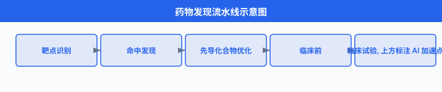
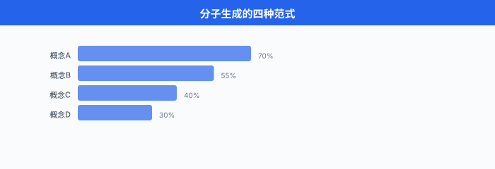
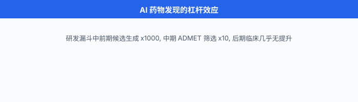

# 药物发现

> **一句话总结**：药物发现是把 AI 用到极致的实验场——分子生成、对接打分、逆合成规划、ADMET 预测串起一条从"想出一个分子"到"能否成药"的完整流水线，目标是把传统 10-15 年、20 亿美元的研发周期砍掉一大半。

*一款新药从靶点确定到 FDA 上市，平均要走 10-15 年、烧掉 20 亿美元级别的资金，而最终能上市的候选分子不足万分之一。 AI 不会一夜之间造出新药，但它能把 "先合成一百万个化合物再筛" 换成 "先在电脑里筛一百亿再合成几百个"，这一步的杠杆就足够改变整个行业.*

---

## 1. 药物发现的完整流水线

在扎进具体算法前，先把整个流程摊开。 现代药物发现大致分为五个阶段，每一步都能被 AI 撬动:

1. **靶点识别 (target identification)**：确定一个与疾病相关的蛋白质 (或 RNA、复合物)，干预它能改善病情。 例：EGFR 之于非小细胞肺癌。
2. **命中发现 (hit discovery)**：找到与靶点结合、显示初步活性的小分子 (通常 $\text{IC}_{50}$ 在微摩尔量级). 过去靠高通量筛选 (High-Throughput Screening, HTS)，现在越来越靠虚拟筛选。
3. **先导化合物优化 (lead optimization)**：把命中分子改造得更强 (亲和力 nM 级)、更选择性、更"能成药" (溶解度、代谢稳定、无毒性).
4. **临床前研究 (preclinical)**：细胞与动物实验，验证安全性与药效。
5. **临床试验 (clinical trials)**: I 期 (安全性)、II 期 (剂量与效力)、III 期 (大规模疗效对照)，通过后交监管审批。

图示见 `../../images/ch19_03_pipeline.svg` (建议)：从靶点到上市，每个节点标出 AI 的介入位置。



一个关键事实：**越前期，AI 的杠杆越大**. 命中发现阶段筛 10 亿分子的成本 AI 版可能是人工版的千分之一；而 III 期临床几百个病人的实验成本 AI 帮不上太多。 所以本节的重心也放在前三步。

---

## 2. 分子表示：让计算机 "看懂" 化合物

分子既有拓扑结构 (原子连成图)，又有几何构象 (三维空间坐标)，还有电子性质。 不同任务用不同表示:

### 2.1 SMILES (Simplified Molecular-Input Line-Entry System)

SMILES 把分子编码成 ASCII 字符串，阿司匹林是 `CC(=O)OC1=CC=CC=C1C(=O)O`. 优点是紧凑、能被序列模型 (Transformer / RNN) 直接消费；缺点是同一分子有多种合法写法，微小的字符错误会导致完全非法的化学式。

**RDKit 里做规范化 (canonicalization)**:

```python
from rdkit import Chem

mol = Chem.MolFromSmiles('OC(=O)c1ccccc1OC(C)=O')
canonical = Chem.MolToSmiles(mol)
# 'CC(=O)Oc1ccccc1C(=O)O'  ← 规范形式
```

### 2.2 InChI (International Chemical Identifier)

IUPAC 主推的标识符，同一分子只有一种 InChI. 缺点是可读性差、字符串更长，序列模型不喜欢。 一般用来查库去重，不用来做生成。

### 2.3 分子图 (molecular graph)

原子是节点，化学键是边。 节点特征包含元素类型、电荷、杂化态；边特征包含键级 (单/双/三/芳香). 直接喂给图神经网络 (Graph Neural Network, GNN). 分子性质预测的主流表示。

一个原子 $v$ 的初始特征 $\mathbf{h}_v^{(0)}$ 拼接元素 one-hot、度数、氢原子数、形式电荷、芳香标志:

$$
\mathbf{h}_v^{(0)} = [\text{onehot}(Z_v), \deg(v), n_H(v), q_v, \mathbb{1}_{\text{arom}}(v)]
$$

经过 $L$ 层消息传递 (message passing) 后，每个节点得到语义嵌入 $\mathbf{h}_v^{(L)}$，再池化为分子级向量 $\mathbf{z}_{\text{mol}} = \text{Pool}(\{\mathbf{h}_v^{(L)}\}_v)$.

### 2.4 三维构象 (3D conformer)

小分子在空间中不是刚体，会因单键旋转、环折叠产生多种能量最低的构象 (通常几十到几千个). 对接、活性预测都在意几何。 RDKit 的 `AllChem.EmbedMultipleConfs` 生成初始构象，MMFF94/UFF 力场做能量优化。 深度学习方法 (GeoDiff, ConfGF) 直接从图预测三维坐标，详见后文。

### 2.5 分子指纹 (molecular fingerprint)

Morgan/ECFP4 指纹把分子映射为固定长度 (1024 或 2048 bit) 的二进制向量，每个 bit 表示某个半径内的子结构是否存在。 又快又稳，是相似性检索与经典机器学习基线的老朋友。

---

## 3. 分子生成：让模型 "想出" 新分子

**核心问题**：化学空间估计有 $10^{60}$ 个类药分子，全部枚举不可能。 我们要一个能采样出**有效** (化学合法) + **有用** (性质符合目标) 分子的生成模型。

### 3.1 VAE-based: Gómez-Bombarelli 2018

Gómez-Bombarelli 等人 2018 年发表在 *ACS Central Science* 的 *Automatic Chemical Design Using a Data-Driven Continuous Representation of Molecules*[^gb2018] 开山之作：把 SMILES 塞进变分自编码器 (Variational Autoencoder, VAE)，学到一个连续潜空间，再在潜空间里做梯度优化。

编码器 $q_\phi(\mathbf{z} \mid \mathbf{x})$ 把 SMILES 字符串 $\mathbf{x}$ 编成潜变量 $\mathbf{z} \in \mathbb{R}^d$ (通常 $d=56$)；解码器 $p_\theta(\mathbf{x} \mid \mathbf{z})$ 把 $\mathbf{z}$ 解回 SMILES. 训练目标是标准的证据下界 (Evidence Lower Bound, ELBO):

$$
\mathcal{L}_{\text{VAE}}(\phi, \theta; \mathbf{x}) = \underbrace{\mathbb{E}_{q_\phi(\mathbf{z}\mid\mathbf{x})}[\log p_\theta(\mathbf{x}\mid\mathbf{z})]}_{\text{重构}} - \underbrace{\text{KL}(q_\phi(\mathbf{z}\mid\mathbf{x}) \Vert p(\mathbf{z}))}_{\text{正则}}
$$

其中先验 $p(\mathbf{z}) = \mathcal{N}(\mathbf{0}, \mathbf{I})$. 训练完再联合训一个性质预测器 $f(\mathbf{z}) \approx y$，优化方向就是在潜空间对目标性质做梯度上升:

$$
\mathbf{z}^* = \arg\max_{\mathbf{z}} f(\mathbf{z}) - \lambda \Vert \mathbf{z} \Vert^2
$$

再解码 $\mathbf{z}^*$ 得到新分子。 问题：早期 VAE 生成的 SMILES 常常语法不合法。 后续的 **Grammar VAE** (Kusner 2017) 与 **JT-VAE** (Jin et al. 2018, Junction Tree VAE) 用语法约束或树分解显著改进合法率。

### 3.2 GAN-based: MolGAN

De Cao 与 Kipf 2018 年提出 **MolGAN**[^molgan]，直接生成小分子图：生成器输出邻接张量 $\mathbf{A} \in \mathbb{R}^{N \times N \times T}$ (含 $T$ 种键类型) 与节点特征 $\mathbf{X} \in \mathbb{R}^{N \times F}$；判别器与奖励网络分别评估真实性与药物相似性。 训练目标是标准 WGAN-GP 目标加一个强化学习奖励:

$$
\mathcal{L}_{\text{MolGAN}} = \mathcal{L}_{\text{WGAN-GP}} + \lambda \cdot \mathbb{E}_{\mathbf{G} \sim p_g}[R(\mathbf{G})]
$$

其中 $R(\mathbf{G})$ 可以是 QED 分数或 logP 等。 MolGAN 生成合法率高、速度快，但**模式坍塌**严重，输出多样性不足。 后续工作 (MolCycleGAN, MolecularRNN) 各有改进。

### 3.3 Diffusion-based: DiffDock 与 GeoDiff

近两年扩散模型 (diffusion model) 席卷生成任务，分子领域也不例外。

**GeoDiff** (Xu 等 2022, ICLR)[^geodiff]：在三维构象空间做扩散。 给定分子图 $\mathcal{G}$，学习条件分布 $p(\mathbf{R} \mid \mathcal{G})$，其中 $\mathbf{R} \in \mathbb{R}^{N \times 3}$ 是原子坐标。 前向过程逐步加高斯噪声:

$$
q(\mathbf{R}_t \mid \mathbf{R}_{t-1}) = \mathcal{N}(\mathbf{R}_t; \sqrt{1-\beta_t}\, \mathbf{R}_{t-1}, \beta_t \mathbf{I})
$$

反向过程用一个**等变** (equivariant) 图神经网络预测噪声，保证旋转/平移不变。 关键设计是把坐标建模在 SE(3) 等变的表示下，而不是直接学 $\mathbb{R}^{N \times 3}$.

**DiffDock** (Corso, Stärk, Jing, Barzilay, Jaakkola 2022; ICLR 2023)[^diffdock]：把小分子对接问题重新表述为在 "位置 (translation) × 朝向 (rotation) × 可旋转键扭转角 (torsion)" 组成的**乘积流形**上做扩散。 状态空间是:

$$
\mathbb{T}_{\text{lig}} = \mathbb{T}_{\text{trans}} \times \mathbb{T}_{\text{rot}} \times \mathbb{T}_{\text{tors}} = \mathbb{R}^3 \times \text{SO}(3) \times \text{SO}(2)^m
$$

其中 $m$ 是可旋转键数。 对每个空间分量分别定义扩散过程 (欧式空间用高斯，SO(3) 用 IGSO(3), SO(2) 用环形高斯). 反向过程用一个 SE(3) 等变模型给出得分，采样出配体在受体口袋中的最佳姿态。 DiffDock 在 PDBBind 测试集上把 "top-1 RMSD < 2 Å" 的成功率从 AutoDock Vina 的 20% 左右提到 38%+.

### 3.4 语言模型路线：MolGPT 与 chem LLM

分子的 SMILES 就是字符串，用 GPT 风格的 Transformer 做自回归生成天然合适。 Bagal 等 2021 年的 **MolGPT**[^molgpt] 用 6 层 Decoder-only Transformer 在 MOSES / GuacaMol 数据集上训练，支持条件生成 (指定 logP、QED、SAS 等)：

```python
# 伪代码: 条件生成
prompt_tokens = tokenize(f"<qed=0.9><logp=2.5><sas=2>")
generated = model.generate(
    prompt_tokens,
    max_length=100,
    temperature=0.8,
    top_p=0.95,
)
smiles = detokenize(generated)
mol = Chem.MolFromSmiles(smiles)
assert mol is not None, "生成的 SMILES 不合法"
```

近两年更进一步的 **MolFormer**、**Chemformer**、**MoleculeSTM**、**ChemLLM** 等模型把预训练规模推到千万级 SMILES，学到通用的化学表示，下游做性质预测、分子编辑、逆合成都能微调。



---

## 4. 分子对接：从分子到姿态

命中分子只是候选，还要看它能不能真的**结合到靶点口袋**里，以及结合有多强。 这就是分子对接 (molecular docking) 要回答的问题。

### 4.1 经典方法：AutoDock 与 Rosetta

**AutoDock** (Morris et al. 1998, 2009) 与 **AutoDock Vina** (Trott & Olson 2010)[^vina] 是学术界最常用的开源对接工具。 核心分两部分:

- **搜索**：在配体 6 自由度刚体位姿 + $m$ 个扭转角上搜索，用遗传算法 (AutoDock 4) 或迭代局部搜索 (Vina).
- **打分**：一个经验能量函数 $E(\mathbf{r})$，综合范德华、氢键、静电、疏水与扭转熵惩罚:

$$
E = \sum_{i<j} \left[ W_{\text{vdw}} A_{ij} + W_{\text{hbond}} H_{ij} + W_{\text{elec}} \frac{q_i q_j}{\epsilon(r) r_{ij}} + W_{\text{sol}} S_{ij} \right] + W_{\text{tor}} N_{\text{tors}}
$$

其中权重 $W_\cdot$ 由 PDBBind 训练集回归得到。 **Rosetta** 是 Baker 实验室的通用大工具箱，除了小分子对接还能做蛋白质设计，打分函数 (Ref15, β-nov16) 更复杂，但需要一定的手工调参。

### 4.2 ML 打分函数：RF-Score, Gnina

经典能量函数假设可加性，高估了物理直觉的可迁移性。 ML 方法 (随机森林、CNN) 直接从 PDBBind 数据学 $\hat{K}_d$ 或 $\hat{\text{IC}}_{50}$，例如:

- **RF-Score** (Ballester & Mitchell 2010)：用配体-受体原子对距离的 histogram + 随机森林。
- **Gnina** (McNutt et al. 2021)：在 AutoDock 里插入一个 CNN 打分函数，输入是三维网格化的复合物。

### 4.3 端到端 ML 对接：DiffDock 与后续

前面提到的 DiffDock 本质就是**端到端**的对接方法：输入 (蛋白，分子图)，输出配体在口袋中的三维位姿。 它跳过了经典方法的 "搜索 + 打分" 两阶段，直接学一个位姿的条件分布。 缺点是仍需要经典力场做 refinement，且对未见靶点泛化不足 (2024 年后续工作 DiffDock-L、DynamicBind 各有改进).

**关键指标**：对接方法的评价看 top-K RMSD (预测位姿与晶体结构的均方根距离):

$$
\text{RMSD}(\mathbf{R}, \mathbf{R}^*) = \sqrt{\frac{1}{N} \sum_{i=1}^N \Vert \mathbf{r}_i - \mathbf{r}_i^* \Vert^2}
$$

行业习惯把 RMSD $\leq 2$ Å 视为 "对接成功".

---

## 5. ADMET 预测：分子能不能成药

即便分子结合得很好，还要过 ADMET 五关:

- **Absorption (吸收)**：口服后能否进入血液。 常用指标：溶解度 (logS)、Caco-2 通透性、人体口服生物利用度 (F%).
- **Distribution (分布)**：分布到组织的能力。 血脑屏障通透性 (BBB)，血浆蛋白结合率。
- **Metabolism (代谢)**：主要在肝脏被 CYP450 酶代谢，关心 CYP1A2/2C9/2C19/2D6/3A4 的抑制与底物性质。
- **Excretion (排泄)**：半衰期 $t_{1/2}$，肾/胆清除率。
- **Toxicity (毒性)**: hERG 心脏毒性、Ames 致突变性、肝毒性、皮肤致敏。

**主流数据集**: MoleculeNet (Wu et al. 2018) 收集了 ClinTox, SIDER, Tox21, Tox-Cast, BBBP 等；**Therapeutics Data Commons (TDC)** 更全面，覆盖 66+ ADMET 任务。

**主流模型**：图神经网络 (D-MPNN / Chemprop, Yang et al. 2019)，图 Transformer，化学预训练模型 (MolBERT, MolFormer). 基本用法:

```python
import chemprop

# 训练一个 hERG 毒性预测模型
arguments = [
    '--data_path', 'herg_train.csv',
    '--dataset_type', 'classification',
    '--save_dir', 'herg_model/',
    '--num_folds', '5',
    '--epochs', '30',
]
args = chemprop.args.TrainArgs().parse_args(arguments)
mean_score, std_score = chemprop.train.cross_validate(
    args=args,
    train_func=chemprop.train.run_training,
)
# 预测新分子
preds = chemprop.train.make_predictions(
    args=chemprop.args.PredictArgs().parse_args([
        '--test_path', 'candidates.csv',
        '--checkpoint_dir', 'herg_model/',
        '--preds_path', 'preds.csv',
    ]),
)
```

**类药性 QED (Quantitative Estimate of Drug-likeness)**: Bickerton 等 2012 年在 *Nature Chemistry* 提出[^qed]，综合 8 个描述符 (分子量、logP、TPSA、HBA、HBD、可旋转键数、芳香环数、结构警报) 的期望满意度函数:

$$
\text{QED}(\mathbf{d}) = \exp\left( \frac{1}{n} \sum_{i=1}^n w_i \log d_i(\mathbf{x}_i) \right)
$$

其中 $d_i$ 是每个描述符的"欲望函数" (desirability)，值域 $[0, 1]$; QED 越接近 1 越像已上市药。 **QED 只是一个粗略先验**，别当唯一决策标准。

---

## 6. 逆合成预测：分子如何合成出来

**问题**：给定目标分子，从可购买的起始原料出发，找出一条 (或多条) 合成路线。

### 6.1 里程碑：Segler 2018 Nature

Segler, Preuss 与 Waller 2018 年在 *Nature* 发表 *Planning chemical syntheses with deep neural networks and symbolic AI*[^segler2018]：用三个深度网络分别做

1. **产物 → 反应类型** 的分类 (17,134 类模板);
2. **反应类型 + 产物 → 反应物** 的生成;
3. **可行性** (in-scope) 判别。

外层套一个**蒙特卡罗树搜索** (Monte Carlo Tree Search, MCTS)，从目标分子出发，每一步选一个反应模板，直到所有叶子都是可购买的起始物。 论文用双盲测试，化学家对 AI 与人类合成路线的偏好基本相当 (成功率 79% vs 72%).

MCTS 里 UCT 得分:

$$
\text{UCT}(s, a) = Q(s, a) + c \sqrt{\frac{\ln N(s)}{N(s, a)}}
$$

其中 $Q(s, a)$ 是节点当前的估值，$N(s)$ 是父节点访问次数。 与 AlphaGo 里一样，只是把动作换成了"选反应模板".

### 6.2 AiZynthFinder：开源工业级

AstraZeneca 的 Genheden 等 2020 年开源了 **AiZynthFinder**[^aizynth]: Python 实现，完整复现 Segler 的三网络 + MCTS 架构，支持自定义模板库与 stock (可购买原料库). 一次典型调用:

```python
from aizynthfinder.aizynthfinder import AiZynthFinder

finder = AiZynthFinder(configfile='config.yml')
finder.stock.select('zinc')
finder.expansion_policy.select('uspto')
finder.filter_policy.select('uspto')

finder.target_smiles = 'CC(=O)Oc1ccccc1C(=O)O'  # 阿司匹林
finder.tree_search()
finder.build_routes()

for route in finder.routes[:5]:
    print(route.reaction_tree)
    print(f'score = {route.score:.3f}')
```

### 6.3 Template-free 路线：Transformer 直接生成反应物

**Molecular Transformer** (Schwaller et al. 2019) 用一个标准的 Transformer 做序列到序列 (SMILES 反应物 ↔ 产物). 逆合成方向直接给产物 SMILES，模型自回归解出反应物 SMILES. 优点是不受模板限制，缺点是不可控、失效模式怪异。 现代方案通常"模板 + 模板无"两路并行，取交集。


---

## 7. 虚拟筛选：从十亿库里挑候选

**虚拟筛选 (virtual screening)** 就是把候选库过一遍你的靶点，排出前 K 名去合成实验。 库的规模在飞速膨胀:

- **ZINC15** (2015)：约 1000 万现货 + 亿级可合成。
- **ZINC20** (2020): 14 亿分子，大多来自 "make-on-demand" 库 (如 Enamine REAL).
- **Enamine REAL Space** (2024)：达到 **330 亿** 分子，都是理论可合成的。

### 7.1 Lyu 2019 Nature：超大库 docking

Lyu, Wang, Shoichet 等 2019 年在 *Nature* 报道 *Ultra-large library docking for discovering new chemotypes*[^lyu2019]：用 DOCK3.7 对 **1.7 亿分子** 做对接，找到了 D4 多巴胺受体的新型激动剂。 关键结论：库越大，命中率不会线性掉，而是**多样性会显著提升**，新颖骨架 (chemotype) 覆盖增加。

计算成本：1.7 亿分子 × 数千 CPU 核 × 数天。 一台笔记本跑不完，但对制药公司是可接受的算力预算。

### 7.2 ML 加速：主动学习 + 代理模型

暴力对接 300 亿分子仍不现实。 Graff 等 2021 年提出**主动学习虚拟筛选**：先对 0.1% 分子做对接得到标签，训练一个廉价的图神经网络 $\hat{f}(\text{mol})$ 做代理，剩下 99.9% 只用 $\hat{f}$ 排序，顶尖分子再回到对接管道验证。 通常能用 **1-2%** 的对接预算复现 Top-K 命中的 80-90%.

流程伪代码:

```python
labeled = random_sample(library, n=100_000)
labels = docking_batch(target, labeled)  # 昂贵
model = GNN().fit(labeled, labels)

for round in range(10):
    scores = model.predict(library - labeled)
    # 探索 + 利用
    candidates = top_k(scores, k=50_000) + random_sample(library, n=10_000)
    new_labels = docking_batch(target, candidates)  # 追加打对接标签
    labeled.update(zip(candidates, new_labels))
    model.fit(labeled, labels + new_labels)

final_top = model.predict(library).top_k(1000)
```

---

## 8. 生成模型评估：别只看 QED

分子生成论文里最常报的四组指标:

- **Validity (有效性)**：生成的 SMILES 有多少能被 RDKit 解析。 现代模型基本 > 95%.
- **Uniqueness (唯一性)**: 1000 个采样里去重后剩多少。 反映模式坍塌。
- **Novelty (新颖性)**：生成分子不在训练集中的比例。
- **Diversity (多样性)**：集合内两两 Tanimoto 相似度的平均值 (低越好)，或者 Fréchet ChemNet Distance (FCD，类比图像的 FID).

$$
\text{FCD}(P, Q) = \Vert \mu_P - \mu_Q \Vert^2 + \text{Tr}(\Sigma_P + \Sigma_Q - 2(\Sigma_P \Sigma_Q)^{1/2})
$$

其中 $\mu, \Sigma$ 是把分子映射到 ChemNet 隐层后的均值与协方差。 FCD 越小，生成分布越接近真实分布。

**基准平台**: **MOSES** (Polykovskiy et al. 2020) 与 **GuacaMol** (Brown et al. 2019) 是社区公认的两个 leaderboard，前者更看分布匹配，后者更看目标导向 (给定目标分子，生成尽量像的候选).

**Goodhart 陷阱**：只优化 QED 会得到一堆长得像"药"的平庸分子；只优化对接得分会得到高亲和力但完全不能合成的怪物 (常见 sanction：分子里塞满了 hERG 触发子结构). **多目标优化 + 合成难度 (SAS) 惩罚** 才是靠谱做法:

$$
r(\mathbf{m}) = w_1 \cdot \text{QED}(\mathbf{m}) + w_2 \cdot (-\hat{E}_{\text{dock}}(\mathbf{m})) - w_3 \cdot \text{SAS}(\mathbf{m}) - w_4 \cdot \text{Tox}(\mathbf{m})
$$

---

## 9. 中国生态：制药 AI 的本土玩家

制药 AI 是少数几个中国公司做到全球第一梯队的赛道，值得单列一节。

### 9.1 晶泰科技 (XtalPi)

2015 年 MIT 博士团队创立，早期做量子力学晶型预测，后扩展到 AI 分子设计 + 云端湿实验。 2024 年在港交所上市。 与辉瑞、强生等有联合项目，也自研管线。 特色：**AI 与湿实验闭环**，有自家的自动化合成与分析实验室。 官方 GitHub 有开源工具 `XPScore`, `MoLFormer-XL` (联合 IBM) 等。

### 9.2 华为盘古分子 (Pangu Drug Model)

华为云 2022 年发布**盘古药物分子大模型**，团队与上海交大医学院合作。 主打:

- 基于图 Transformer 的分子表示学习，预训练在 17 亿分子上;
- 支持性质预测 (20+ ADMET)、分子生成、优化与检索;
- 部署在华为云 EI 上，通过 API 或 ModelArts 调用。

盘古团队 2022 年在 *Nature Communications* 发表 Chai 等的工作 (*A knowledge-guided pre-training framework for improving molecular representation learning*)，有开源代码。

### 9.3 百度 PaddleHelix

百度飞桨生态下的**生物计算工具集**，一站式提供:

- **HelixGEM** / **HelixGEM-2**：分子表示学习，分别是几何增强的 GNN 与几何自监督;
- **HelixFold**：蛋白质结构预测，PaddlePaddle 版 AlphaFold2，后来发布 HelixFold3 (含小分子 + 核酸);
- **ScreenMate**：虚拟筛选流水线;
- 全部开源在 https://github.com/PaddlePaddle/PaddleHelix，商业化通过 "百度智慧医疗" 落地。

### 9.4 其他值得一提

- **深势科技 (DP Technology)**: Uni-Mol / Uni-Fold 系列，从分子力学到蛋白结构一条龙；DeePMD-kit 是分子动力学圈的常用工具。
- **腾讯 iDrug**：侧重虚拟筛选与药物再定位；AI Lab 与 mila-quebec 有合作。
- **英矽智能 (Insilico Medicine)**：香港 + 苏州，2024 年首个 AI 设计的 II 期临床候选药 (INS018_055，治疗特发性肺纤维化) 完成入组。

---

## 10. 案例：AI 到底加速了多少

用最常被引用的 DiMasi 等 2016 年 *Journal of Health Economics* 研究[^dimasi]:

- 新药平均研发成本：**26 亿美元** (税前，含失败项目)
- 平均周期：**10-15 年** (从靶点到 FDA 批准)
- 临床试验成功率：**13.8%** (进入 I 期到最终批准)

AI 目前的成绩单 (2024 年公开数据):

- **Insilico Medicine** 的 INS018_055 从靶点识别到 IND (研究性新药申请) 只用了 **18 个月**，传统平均 4-5 年;
- **BenevolentAI** 用知识图谱识别巴瑞替尼 (baricitinib) 作为 COVID-19 治疗药，2020 年 2 月发文，后被 FDA 授权紧急使用;
- **Exscientia** 的 DSP-1181 (强迫症) 2020 年成为首个进入 I 期临床的 AI 设计分子，从项目启动到 I 期用时 12 个月；但该药随后因缺乏疗效而终止开发，被视为 AI 药物发现领域的一个重要教训。

**但要清醒**：上述都是**前期加速**. 临床 II/III 期的失败率并没有因为 AI 出现而显著下降，药物开发的真正瓶颈仍在生物学复杂性 (副作用、剂量响应、患者异质性), AI 只是帮我们**更聪明地选择在哪里烧钱**.



---

## 📌 本节要点

- **流水线**：药物发现分靶点识别 → 命中发现 → 先导优化 → 临床前 → 临床试验五步，AI 主要撬动前三步，越前期杠杆越大。
- **分子表示**: SMILES / InChI 是字符串，分子图 (molecular graph) 是拓扑，三维构象 (3D conformer) 是几何，指纹是二进制向量，不同任务用不同表示。
- **分子生成**: VAE (Gómez-Bombarelli 2018) 学连续潜空间，GAN (MolGAN) 直生图，扩散模型 (GeoDiff, DiffDock) 在几何流形上去噪，语言模型 (MolGPT / MolFormer) 自回归 SMILES.
- **对接**：经典 AutoDock Vina / Rosetta 靠搜索 + 能量函数，ML 打分函数 (RF-Score, Gnina) 数据驱动，DiffDock 端到端预测配体位姿，RMSD $\leq 2$ Å 判成功。
- **ADMET**：五关 (吸收、分布、代谢、排泄、毒性) 用 MoleculeNet / TDC 数据集训图神经网络；QED 只是粗略先验，别当唯一决策标准。
- **逆合成**: Segler 2018 *Nature* 三网络 + MCTS 是里程碑，AiZynthFinder 开源可跑；Molecular Transformer 走模板无路线，两路并行更稳。
- **虚拟筛选**：库规模到百亿量级 (Enamine REAL 330 亿), Lyu 2019 *Nature* 展示 1.7 亿库超大对接可行，主动学习 + 代理模型能把成本压 50 倍以上。
- **中国生态**：晶泰科技 (AI + 湿实验闭环)、华为盘古分子、百度 PaddleHelix (HelixFold3)、深势 Uni-Mol、英矽 (首个 AI II 期候选药) 都已进入国际视野。

---

## 参考文献

[^gb2018]: Gómez-Bombarelli, R., Wei, J. N., Duvenaud, D., et al. (2018). *Automatic Chemical Design Using a Data-Driven Continuous Representation of Molecules*. **ACS Central Science**, 4(2), 268–276. arXiv:1610.02415.

[^molgan]: De Cao, N., & Kipf, T. (2018). *MolGAN: An implicit generative model for small molecular graphs*. ICML Workshop on Theoretical Foundations and Applications of Deep Generative Models. arXiv:1805.11973.

[^geodiff]: Xu, M., Yu, L., Song, Y., Shi, C., Ermon, S., & Tang, J. (2022). *GeoDiff: A Geometric Diffusion Model for Molecular Conformation Generation*. **ICLR 2022**. arXiv:2203.02923.

[^diffdock]: Corso, G., Stärk, H., Jing, B., Barzilay, R., & Jaakkola, T. (2022). *DiffDock: Diffusion Steps, Twists, and Turns for Molecular Docking*. **ICLR 2023**. arXiv:2210.01776.

[^molgpt]: Bagal, V., Aggarwal, R., Vinod, P. K., & Priyakumar, U. D. (2021). *MolGPT: Molecular Generation Using a Transformer-Decoder Model*. **Journal of Chemical Information and Modeling**, 62(9), 2064–2076.

[^vina]: Trott, O., & Olson, A. J. (2010). *AutoDock Vina: Improving the speed and accuracy of docking with a new scoring function, efficient optimization, and multithreading*. **Journal of Computational Chemistry**, 31(2), 455–461.

[^qed]: Bickerton, G. R., Paolini, G. V., Besnard, J., Muresan, S., & Hopkins, A. L. (2012). *Quantifying the chemical beauty of drugs*. **Nature Chemistry**, 4(2), 90–98.

[^segler2018]: Segler, M. H. S., Preuss, M., & Waller, M. P. (2018). *Planning chemical syntheses with deep neural networks and symbolic AI*. **Nature**, 555(7698), 604–610.

[^aizynth]: Genheden, S., Thakkar, A., Chadimová, V., Reymond, J.-L., Engkvist, O., & Bjerrum, E. (2020). *AiZynthFinder: a fast, robust and flexible open-source software for retrosynthetic planning*. **Journal of Cheminformatics**, 12(1), 70.

[^lyu2019]: Lyu, J., Wang, S., Balius, T. E., et al. (2019). *Ultra-large library docking for discovering new chemotypes*. **Nature**, 566(7743), 224–229.

[^dimasi]: DiMasi, J. A., Grabowski, H. G., & Hansen, R. W. (2016). *Innovation in the pharmaceutical industry: New estimates of R&D costs*. **Journal of Health Economics**, 47, 20–33.