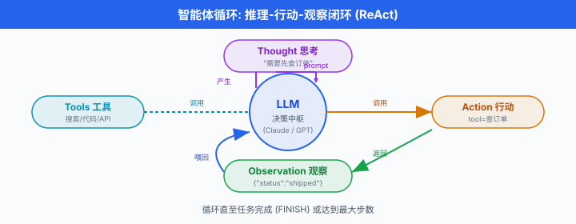
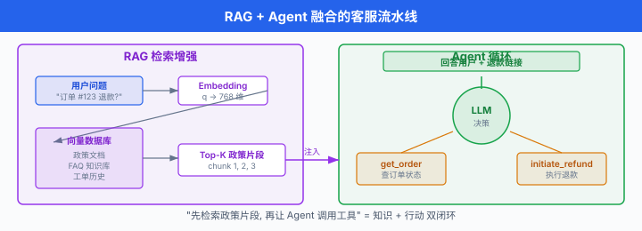
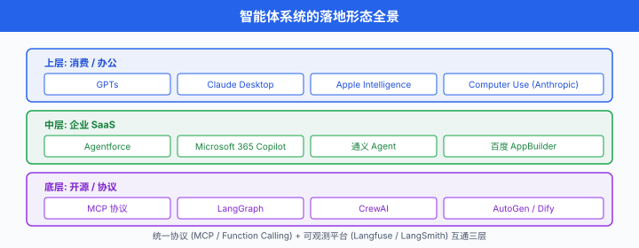

# 智能体系统

> **一句话总结**: 智能体 (Agent) 把大模型从"会聊天"升级为"会做事", 通过工具调用、规划与记忆完成多步任务; 本节从企业、个人、与中国生态三个维度拆解落地场景, 并给出工程化必需的成本、可观测性、安全与失败兜底框架.

*2024 年是 AI 智能体的分水岭: Anthropic 发布 MCP 协议 (2024-11) 试图统一工具接入规范, OpenAI 推出 GPTs, 中国厂商从阿里通义、百度千帆到字节 Coze 全员下场, 一夜之间"智能体平台 (Agent Platform)"成为 SaaS 行业的新 KPI. 与 Ch23 的原理讲解互补, 本节专注"用在哪、怎么选、怎么落地".*

---

## 1. 从聊天到干活: 智能体是什么

智能体 (Agent) 这一概念最早可追溯至经典人工智能的"理性主体" (rational agent) 定义 — 一个能感知环境、做出决策并执行动作的系统. 但 2023 年以来讨论的"AI 智能体", 几乎都默认基于大语言模型 (LLM) 作为决策中枢. Anthropic 在 2024 年 12 月发表的《Building Effective Agents》[^anthropic-effective] 一文中, 给出当下行业最简洁的工程定义:

> Agent = LLM + **工具** (tools) + **指令** (instructions) + **自主循环** (loop)

更直白地说, 智能体就是: 让 LLM 在每一轮推理后, 不仅能"说话", 还能选择调用外部工具 (搜网页、读数据库、执行代码、发邮件…), 然后根据工具返回的结果决定下一步动作, 直至任务完成或达到停止条件. 这套"推理 + 行动"循环的学名叫 ReAct (Reasoning + Acting) (Yao et al., 2022, arXiv:2210.03629)[^react].

### 1.1 为什么 2024 年突然爆发

三股力量同时到位:

1. **模型能力** — Claude 3.5 Sonnet、GPT-4o、Gemini 1.5 Pro 等模型在函数调用、指令遵循、长上下文上达到工业级可用阈值
2. **协议标准化** — Anthropic MCP (2024-11-25) [^mcp]、OpenAI Function Calling、Google Gemini API 共同把"工具调用"做成了行业共识
3. **平台化基建** — Vercel AI SDK、LangChain、Anthropic SDK、阿里百炼、百度千帆提供从原型到部署的全链路

下面这张图刻画了一个典型智能体循环的骨架:



*图 1: 经典 ReAct 循环. 每轮 Agent 先"思考" (Thought), 再选择"行动" (Action: 调用工具), 然后"观察" (Observation: 工具返回结果), 循环直至任务完成.*

### 1.2 一个最小可运行的智能体

下面这段 Python (使用 Anthropic Python SDK 0.40+ 与 MCP 客户端) 展示了一个"会查日历"的极简 Agent — 没有 RAG, 也没有复杂规划, 但涵盖了智能体的全部必要零件:

```python
# minimal_agent.py
import anthropic
from datetime import datetime

client = anthropic.Anthropic()

# 1. 工具定义 (tools) — 模型能调用的"手"
TOOLS = [{
    "name": "get_current_time",
    "description": "返回服务器当前时间, 用于回答'现在几点'类问题.",
    "input_schema": {
        "type": "object",
        "properties": {},
        "required": []
    }
}]

def get_current_time():
    return datetime.now().strftime("%Y-%m-%d %H:%M:%S")

# 2. 工具调度表 (dispatch table)
DISPATCH = {"get_current_time": get_current_time}

# 3. ReAct 循环: 推理 -> 行动 -> 观察 -> 再推理
def run_agent(user_query: str, max_steps: int = 5) -> str:
    messages = [{"role": "user", "content": user_query}]
    for step in range(max_steps):
        resp = client.messages.create(
            model="claude-sonnet-4-5",
            max_tokens=1024,
            tools=TOOLS,
            messages=messages,
        )
        # 终止条件: 模型直接给出文本回答
        if resp.stop_reason == "end_turn":
            return resp.content[0].text
        # 模型决定调用工具
        if resp.stop_reason == "tool_use":
            tool_block = next(b for b in resp.content if b.type == "tool_use")
            tool_name = tool_block.name
            tool_input = tool_block.input
            # 执行工具 (生产环境应加沙盒 + 超时 + 权限校验)
            result = DISPATCH[tool_name](**tool_input)
            # 把工具结果塞回消息历史, 让模型进入下一轮推理
            messages.append({"role": "assistant", "content": resp.content})
            messages.append({
                "role": "user",
                "content": [{
                    "type": "tool_result",
                    "tool_use_id": tool_block.id,
                    "content": str(result),
                }]
            })
    return "(达到最大步数, 任务未完成)"

print(run_agent("现在几点了? 北京时间."))
```

注意三件事:

- **没有"规划器"** — 模型本身就是规划器, 它在 `tool_use` 块里隐式决定了下一步
- **没有"记忆库"** — 仅有当前的 `messages` 列表作为短期记忆
- **没有"反思"** — 工具调用失败时模型直接拿到错误字符串, 让它自己决定是否重试

真实生产环境的智能体, 无非是在这三处加东西: 加长期记忆 (向量数据库)、加规划 (显式 CoT 或 Planner-Worker 模式)、加反思 (Critic 子智能体评分). 后面 §5 我们会展开.

### 1.3 期望效用: 为什么智能体有效

理论上, 智能体的合理性可以借助马尔可夫决策过程 (Markov Decision Process, MDP) 解释. 状态 $s_t$ 是当前的对话历史 + 工具返回, 动作 $a_t \in \mathcal{A}$ 是"回复用户"或"调用某个工具", 奖励 $r_t$ 是任务完成度 (人工或 LLM-as-Judge 给出). Agent 的目标是最优化累计折扣奖励:

$$G_t = \sum_{k=0}^{T-t} \gamma^k \, r_{t+k}, \quad \gamma \in (0, 1)$$

但 LLM 智能体并不"显式"求解 Bellman 方程 — 它通过下一个 token 的对数似然, 隐式地近似最优动作分布. 这是一种"语言作为策略" (language-as-policy) 的新范式: 模型参数 $\theta$ 编码了一个规模极大、但精度有限的策略网络 $\pi_\theta(a_t \mid s_t)$.

工具调用次数 $N_{\text{tools}}$ 与任务成功率 $\rho$ 之间常呈对数饱和关系 (经验拟合):

$$\rho(N_{\text{tools}}) \approx \rho_{\max} \left(1 - e^{-\lambda N_{\text{tools}}}\right)$$

即: 给定难度下, 允许更多工具调用能提升成功率, 但很快边际收益递减. 工程上我们用这条曲线决定 `max_steps` 的合理上限 (常见取值 5-15).

---

## 2. 企业智能体: 重塑四大核心场景

智能体在企业最先突破的是四个高重复、低风险的"长尾"任务: 客服、办公助理、数据分析、编程. 这四类场景的共同特征是: 单次任务价值低 (几十到几百美元)、但发生频次极高, 因此 ROI 显著.

### 2.1 智能客服: Salesforce Agentforce 与 Intercom Fin

客服是企业落地智能体的**第一战场**. 两个代表产品:

- **Salesforce Agentforce** (2024-09-12 GA)[^agentforce] — 把 Agent 作为 Salesforce 平台的一等公民, 能读取 CRM 记录、调用 Apex 流程、自动开 ticket. 客户案例包括 Wiley、OpenTable.
- **Intercom Fin** (2023 年首发, 持续迭代)[^fin] — 定位"the highest performing Customer Agent", 支持邮件、聊天、语音多渠道. Fin 引入了"AI Agent + Human Handoff"工作流: 答不上来就转人工.

技术栈差异:

| 维度 | Agentforce | Intercom Fin |
|---|---|---|
| 底层模型 | Einstein Trust Layer (托管第三方 + 自研微调) | GPT-4 / Claude (通过 Fin 编排层) |
| 知识接入 | Data Cloud (CRM + 外部 DB) | Help Center + 上传文档 |
| 工具能力 | 调用 Flow / Apex / Slack / Teams | 调用 Intercom Workflow + Webhook |
| 安全边界 | 角色权限继承 Salesforce 用户体系 | 独立 API key, 自定义白名单 |

### 2.2 内部助理: Microsoft 365 Copilot 与 Google Workspace AI

办公套件的智能体已经"住进了"每个员工的日常:

- **Microsoft 365 Copilot** (2023-09 宣布 GA, 2023-11-01 对购买 300+ 席位的客户开放) [^mscopilot] — 跨 Word / Excel / PowerPoint / Outlook / Teams 协作, 使用 Microsoft Graph 检索邮件、文档、会议纪要. 2024 年底加入了 Copilot Studio 用于低代码 (Low-Code) 自定义 Agent.
- **Google Workspace AI** (Gemini for Workspace) — 集成在 Gmail、Docs、Sheets, 2024-2025 持续推送"帮我写"、"帮我总结"、"帮我可视化".

这两个产品的共性: **数据不出企业租户** (Microsoft 365 Copilot 强调"your data, your control"), 模型推理在合规云区域完成, 这是企业级 Agent 与消费级 Agent 的关键分水岭.

### 2.3 数据分析: Julius AI 与 ChatGPT Advanced Data Analysis

把"自然语言提问 → 自动生成 SQL / Python → 输出图表"做成产品的代表:

- **Julius AI** — 专注于"对话式数据分析", 支持上传 CSV/Excel, 模型自动生成 pandas 代码并在沙盒 (sandbox) 中执行.
- **ChatGPT Advanced Data Analysis** (前身 Code Interpreter, 2023-07 推出) — ChatGPT 内置的 Python 沙盒执行环境, 用户上传文件即可分析. 2024 年下半年升级为 Advanced Data Analysis 并强化可视化.

工程实现要点:

1. **代码生成 → 沙盒执行 → 结果回传** 三段式 pipeline
2. **沙盒必须隔离** — 不能让模型直接操作用户本地文件系统 (Docker / Firecracker / E2B 是常见选择)
3. **结果可追溯** — 用户能看到模型生成的代码, 避免"幻觉式图表"

### 2.4 编程智能体: 从 Copilot 到 Devin

这是 2024 年最卷、争议最多的赛道:

| 产品 | 形态 | 核心能力 |
|---|---|---|
| **GitHub Copilot** (2021 首发, 2024 GA 多 Agent) | IDE 插件 | 单文件补全、聊天、PR Agent |
| **Cursor** (Anysphere, 2023) | 独立编辑器 | Agent 模式跨文件编辑 + 重构 |
| **Claude Code** (Anthropic, 2025-02 公开预览) | CLI 工具 | 长任务、自主 PR、文件搜索 |
| **Devin** (Cognition Labs, 2024-03 演示) [^devin] | 自主软件工程师 | SWE-bench 13.86% 解出率 |

Devin 的争议: 2024 年 3 月 Cognition Labs 发布 Devin 演示时宣称 SWE-bench 通过率 13.86% (当时 SOTA 仅 1.96%), 但后续被指评估时只跑了 25% 子集, 且未公开完整日志; 同时 SWE-Agent (Yang et al., 2024, arXiv:2405.15793) [^sweagent] 在论文中报告同等开源设置下也能达到 12%+ 通过率. 这场争议的核心不是"模型能不能写代码", 而是"如何诚实地评估一个长任务智能体". 客观地说, 截至 2026 年, Devin 在企业付费场景 (长尾 bug 修复、内部工具搭建) 已有真实生产部署, 但独立接管完整工程任务的能力仍有显著差距.

---

## 3. 个人智能体: 装进每个人的工作流

### 3.1 OpenAI GPTs 与 GPT Store (2023-11 推出) [^gpts]

用户用自然语言配置一个 GPT: 起名字、写描述、喂知识文件、勾选工具 (Web Browsing / DALL-E / Code Interpreter), 然后发布到 GPT Store. 这是历史上第一次让"非工程师也能做 Agent", 但因 GPT Store 中同质化严重、缺乏统一质量评估, 流量主要集中在头部几个垂直应用.

### 3.2 Perplexity Pro Search

Perplexity 的"Pro Search"将搜索拆为多步: 模型决定先搜什么、读完一段决定是否继续深挖, 最终汇总为带引用的回答. 这本质上是一个"无工具调用 API, 但内部多步推理 + 多次网页检索"的搜索型 Agent.

### 3.3 Claude Desktop 与 MCP

Anthropic 在 2024-11 发布 MCP 后 [^mcp], Claude Desktop 成为首批原生支持 MCP 的桌面客户端. 用户可以一键把"本地文件系统"、"GitHub"、"PostgreSQL"、"Slack"等数百个社区 MCP Server 接到 Claude, 让 Claude 直接操作本地资源. 这种"通用 Agent + 通用工具协议"的组合, 是 2025 年个人生产力提升的最大变量.

---

## 4. 中国智能体生态: 全员下场的一年

中国市场的智能体平台化走得比北美更激进, 因为有"应用层创新"的强需求. 主流玩家:

### 4.1 阿里通义千问 Agent

阿里云百炼平台提供完整的 Agent 构建能力, 模型侧使用通义千问 (Qwen) 系列. 2025 年 Qwen-Agent 开源框架支持工具调用、规划、RAG、代码执行四大组件. 强项是"模型 + 平台 + 阿里云生态 (钉钉、淘宝、高德)" 一体化.

### 4.2 百度千帆 AppBuilder

百度智能云千帆 AppBuilder 是面向企业的 Agent 开发平台, 提供 50+ 预置组件 (包括语音、地图、OCR 等百度特色能力). 千帆官方定位为"以 Agent 为核心的一站式企业级大模型服务平台".

### 4.3 字节 Coze (扣子) / 豆包多 Agent

字节跳动在 2024 年推出 Coze (国内版"扣子", 海外版 coze.com), 主打"零代码搭 Agent": 拖拽式工作流、插件市场、多 Agent 编排. 用户群体大幅超出技术圈, 包括运营、销售、教师等非程序员. 字节豆包大模型为 Coze 提供底层推理.

### 4.4 开源框架: Dify 与 FastGPT

- **Dify** (Dify.AI, Apache-2.0-derivative 协议, GitHub 150k+ stars) — 定位"Production-Ready Agentic Workflows", 提供可视化 Workflow Studio、知识库、插件市场. 同时提供云端 SaaS (Dify Cloud) 和企业版 (Dify Enterprise).
- **FastGPT** (中国社区开源, GitHub 28k+ stars) — 专注"开箱即用的 RAG + Agent 平台", 支持可视化编排、问答对管理、API 调用. 在中文知识库场景里有显著优势.

### 4.5 MetaGPT: 中国学术界的代表作

MetaGPT (Hong et al., 2023, arXiv:2308.00352) [^metagpt] 由 DeepWisdom 团队 (中国深圳 + 德国 AI 大佬 Jürgen Schmidhuber 联合署名) 提出, 是"多智能体软件公司"的开源框架. 它把"标准作业流程 (Standard Operating Procedures, SOPs)"编码进 Agent 角色: 产品经理、架构师、工程师、QA, 各自扮演, 协同产出代码. 这是中文 AI 社区在多智能体框架上的代表作, GitHub 50k+ stars.

### 4.6 多智能体编排框架三剑客

最后必须提一下多 Agent 框架的"三剑客":

- **AutoGen** (Wu et al., Microsoft Research, 2023, arXiv:2308.08155) [^autogen] — 基于对话的多 Agent 框架, 通过"群聊"模式让多个 Agent 协商. 老牌, 文档丰富.
- **LangGraph** (LangChain 团队, 2024) [^langgraph] — 基于图 (DAG) 的编排框架, 把 Agent 视为状态机上的节点, 适合复杂、有循环的工作流.
- **CrewAI** (2024) — 用"角色 + 任务 + 流程"的隐喻降低上手门槛, 强调"像管团队一样管 Agent".

---

## 5. 工程化四道关: 成本、可观测性、安全、失败兜底

把智能体从 demo 推到生产, 90% 的时间不是花在模型选型上, 而是花在下面四个问题上.

### 5.1 成本控制: Token 用量的天花板

智能体的成本随**调用链深度**指数增长: 一轮用户问题触发 N 次工具调用, 每次工具调用又把历史塞回上下文, 第 k 轮的 prompt token 大致为:

$$T_{\text{in}}^{(k)} \approx T_{\text{user}} + k \cdot (T_{\text{tool result}} + T_{\text{assistant}})$$

如果不加控制, 一个 5 步 Agent 的输入成本就能吃掉一次普通对话的 10 倍. 业界常用三种控本技巧:

1. **上下文压缩** — 每轮结束后用一个小模型总结历史, 只保留摘要
2. **结果截断** — 工具返回值超过阈值时只保留前 N 行 + 关键字段
3. **早停 (early stopping)** — 检测到 Agent 重复同一动作超过 2 次, 强制结束

总成本公式 (一次任务):

$$C_{\text{total}} = \sum_{k=1}^{N_{\text{steps}}} \Big( c_{\text{in}} \cdot T_{\text{in}}^{(k)} + c_{\text{out}} \cdot T_{\text{out}}^{(k)} \Big) + c_{\text{tool}}$$

其中 $c_{\text{in}}, c_{\text{out}}$ 是模型单价 (USD / 1k token), $c_{\text{tool}}$ 是外部 API 调用费.

下表对比了三种典型策略在 100 次客服任务上的近似 token 消耗:

| 策略 | 平均步数 | 平均输入 token | 平均输出 token | 单次成本 (USD) |
|---|---|---|---|---|
| 朴素 ReAct (无优化) | 6.2 | 8,500 | 620 | 0.043 |
| + 上下文压缩 | 6.2 | 3,100 | 620 | 0.018 |
| + 早停 (≤ 3 步) | 3.1 | 2,400 | 410 | 0.011 |

*表 1: 同一客服任务下, 不同优化策略的 token 与成本对比 (基于 Claude Sonnet 4.5 定价估算). 工程经验: 早停 + 上下文压缩可降本 60% 以上.*

### 5.2 可观测性: 像微服务一样追踪 Agent

智能体比传统微服务更难调试: 不确定性来自 LLM, 而非纯代码. 三大主流可观测平台:

| 平台 | 开源 | 强项 |
|---|---|---|
| **LangSmith** (LangChain 团队) | SaaS 为主 | 与 LangChain / LangGraph 深度集成 |
| **Langfuse** | MIT 协议 (社区版, GitHub 31.9k stars) | 框架无关, OpenTelemetry 兼容 |
| **Helicone** | 部分开源 | AI Gateway + 缓存 + 成本归因 |

下面是一个最小可运行的 Langfuse 集成示例, 演示如何把一次 Agent 调用的所有 Span 记录到 Langfuse:

```python
# observability_with_langfuse.py
from langfuse import Langfuse
from langfuse.decorators import observe, langfuse_context
import anthropic

langfuse = Langfuse()  # 自动从环境变量读 LANGFUSE_PUBLIC_KEY / SECRET_KEY

client = anthropic.Anthropic()

@observe(name="agent_step")  # 每个工具调用记一个 span
def call_tool(tool_name, tool_input):
    # ... 实际工具执行 ...
    return f"工具 {tool_name} 执行结果"

@observe(name="react_loop", as_type="chain")
def run_agent(query):
    messages = [{"role": "user", "content": query}]
    for step in range(5):
        # 把每轮 LLM 调用自动记为子 span
        with langfuse_context.update_current_observation(
            name=f"llm_call_step_{step}",
            metadata={"step": step},
        ) as obs:
            resp = client.messages.create(
                model="claude-sonnet-4-5",
                max_tokens=1024,
                tools=[],
                messages=messages,
            )
            obs.update(output=resp.content[0].text)
            messages.append({"role": "assistant", "content": resp.content[0].text})
    return messages[-1]["content"]

run_agent("帮我总结上周的项目进展")
```

### 5.3 安全边界: 工具权限与沙盒

工具调用是 Agent 最大的攻击面. 2025 年 OWASP 发布的 LLM Top 10 把"Tool Misuse"列为前 3 风险. 工程上必须做四件事:

1. **白名单工具** — 模型只能看到你显式注册的 N 个工具, 不能凭空调出 `rm -rf`
2. **参数校验** — 用 Pydantic / Zod 对模型输出的工具参数做强类型校验
3. **沙盒执行** — 代码执行类工具必须在隔离环境 (Docker / Firecracker / gVisor) 中跑
4. **人工确认 (Human-in-the-Loop)** — 危险动作 (发邮件、删数据库、对外 API 调用) 必须人工点击确认

### 5.4 失败兜底: 优雅降级

Agent 一定会失败 — 模型幻觉、工具超时、网络中断、API rate limit. 设计兜底策略:

- **降级到非 Agent 模式**: Agent 连续失败 2 次, 退回到"直接 LLM 回答"
- **保存中间状态**: 让用户能从中断点继续, 而不是从头开始
- **明确告诉用户**: 不要让 Agent 假装成功, 必须显式说明"我没能完成 X, 因为 Y"

---

## 6. 案例研究: 一个完整的客服 Agent

我们走一遍从需求到部署的完整流程. 假设你在一家 SaaS 公司, 客服成本高企, 想做一个"订单查询 + 退款发起"的智能体.

### 6.1 需求与边界

- **能做**: 查询订单状态、查物流、根据政策发起退款
- **不能做**: 修改账户密码、删除账户、跨用户查询
- **降级条件**: 用户连续 3 次表达不满, 转人工

### 6.2 工具清单

```json
[
  {
    "name": "get_order",
    "description": "根据订单号查询订单详情",
    "input_schema": {
      "type": "object",
      "properties": {"order_id": {"type": "string"}},
      "required": ["order_id"]
    }
  },
  {
    "name": "initiate_refund",
    "description": "对订单发起退款, 仅在客服 Agent 流程中使用",
    "input_schema": {
      "type": "object",
      "properties": {
        "order_id": {"type": "string"},
        "reason": {"type": "string", "enum": ["damaged", "not_as_described", "late"]}
      },
      "required": ["order_id", "reason"]
    }
  }
]
```

### 6.3 接入 RAG: 政策知识库

客服 Agent 必须"读"公司退款政策. 这就是 RAG 与 Agent 融合的典型场景:

```python
# rag_agent_pipeline.py
from sentence_transformers import SentenceTransformer
import faiss

embedder = SentenceTransformer('BAAI/bge-m3')
index = faiss.read_index("refund_policy.faiss")

def retrieve_policy(query: str, k: int = 3) -> list[str]:
    """检索相关政策段落, 返回文本列表."""
    q_vec = embedder.encode([query])
    _, I = index.search(q_vec, k)
    return [policy_docs[i] for i in I[0]]

# 在 Agent 循环里, 给 LLM 多塞一段 system 指令:
SYSTEM = """你是某电商客服 Agent. 你可以调用 get_order 和 initiate_refund 两个工具.
退款政策 (RAG 检索结果):
{policy_snippets}

回答时请:
1. 先调用 get_order 拿到订单状态
2. 根据政策判断是否符合退款条件
3. 符合则调用 initiate_refund, 否则礼貌拒绝
"""
```

RAG + Agent 的标准 pipeline 长这样:



*图 2: 用户问题先经过 RAG 检索 (左) 取回相关政策, 再连同工具定义一起注入 Agent 循环 (右). 这是 2025 年企业知识型 Agent 的标准架构.*

### 6.4 部署与监控

- 用 Langfuse / LangSmith 记录每次会话的 trace
- 设置告警: 当"工具调用失败率" > 5% 或"用户转人工率" > 30% 时通知值班
- 每周跑一次离线评估 (LLM-as-Judge): 抽样 200 条会话, 评分"准确性 / 合规性 / 语气"

---

## 7. 案例研究: 代码 Agent (借鉴 SWE-Agent)

Yang et al. (2024, arXiv:2405.15793) [^sweagent] 在 Princeton NLP 提出的 SWE-Agent 是"代码 Agent"的经典架构. 核心思想是给 LM 一个**定制的 Agent-Computer Interface (ACI)** — 不是直接喂命令行, 而是简化成 LM 友好的"原子操作": 打开文件、滚动到第 N 行、搜索代码块、运行测试.

### 7.1 为什么不用直接命令行

直接 shell 对 LM 不友好:

- 大量 token 浪费在命令帮助文档、路径展开
- 错误信息难以让 LM 自我纠正
- 容易触发危险命令 (rm, chmod)

SWE-Agent 的 ACI 通过**专用命令**把复杂度封装起来:

```
# ACI 简化示例 (非原文)
open file_path=<path>                     # 打开文件并生成带行号的视图
scroll_down lines=50                      # 在视图中下滚
find_class class_name=<name>              # 跳转到类定义
edit file=<path> start=<line> end=<line>  # 替换代码段
submit                                    # 任务完成
```

### 7.2 一个最小 SWE-Agent 风格 demo

```python
# mini_swe_agent.py
import re

class MiniSWEAgent:
    def __init__(self, repo_path: str, model):
        self.repo = repo_path
        self.model = model
        self.view = ""          # 当前文件视图
        self.cursor = 0          # 当前行

    def cmd_open(self, file_path: str) -> str:
        with open(f"{self.repo}/{file_path}") as f:
            lines = f.readlines()
        self.view = "\n".join(f"{i+1:4}| {l}" for i, l in enumerate(lines))
        self.cursor = 0
        return f"已打开 {file_path}, 共 {len(lines)} 行"

    def cmd_scroll(self, lines: int) -> str:
        new_cursor = max(0, min(len(self.view.split('\n')) - 50,
                                self.cursor + lines))
        self.cursor = new_cursor
        return "\n".join(self.view.split('\n')[new_cursor:new_cursor+50])

    def cmd_find(self, pattern: str) -> str:
        for i, line in enumerate(self.view.split('\n')):
            if re.search(pattern, line):
                self.cursor = max(0, i - 5)
                return f"找到 {pattern} 在第 {i+1} 行"
        return f"未找到 {pattern}"

    def run(self, issue: str, max_steps: int = 15) -> str:
        prompt = f"""你是代码修复 Agent, 仓库: {self.repo}
当前 issue: {issue}
你可以使用以下命令:
- open file_path=<path>
- scroll_down lines=<n>
- find pattern=<regex>
- submit (任务完成时)

每轮先简短思考, 再输出一个命令."""
        # 真实场景下用 LLM API 替换这里的简单循环
        for step in range(max_steps):
            action = self.model(prompt + self.view[self.cursor:])
            if action.startswith("submit"):
                return action.replace("submit", "").strip()
            cmd, _, arg = action.partition(" ")
            if cmd == "open":
                self.cmd_open(arg.split("=")[1])
            elif cmd == "scroll_down":
                self.cmd_scroll(int(arg.split("=")[1]))
            elif cmd == "find":
                self.cmd_find(arg.split("=")[1])
        return "(未完成)"
```

---

## 8. 未来趋势: 平台化、多智能体、桌面 Agent

### 8.1 Agent-as-a-Service 与平台化

到 2026 年, 主流预测 (Gartner、IDC) 都把"Agent 平台"列为企业 IT 采购的 Top 3 类目. 平台化意味着:

- **企业不再自己训练或微调 Agent**, 而是像当年用数据库一样"接入"供应商平台
- **定价模型从 SaaS 订阅 → 用量计费 (per Agent invocation)**
- **企业内部会同时跑多个供应商的 Agent**, 因此 MCP 这种"工具/数据接口标准"至关重要

### 8.2 多 Agent 协作

单 Agent 的天花板明显, 因为单个上下文窗口难以同时容纳"复杂任务的全部子目标". 多 Agent 模式分三类:

1. **监督者模式 (Supervisor)** — 一个 LLM 当调度, 多个 worker Agent 各管一摊
2. **群聊模式 (Group Chat)** — 多个 Agent 共享消息列表, 互相讨论 (AutoGen 经典)
3. **流水线模式 (Pipeline)** — Agent A 输出作为 Agent B 输入 (流水线式, LangGraph 适合)

### 8.3 与 RAG 的深度融合

"Agent + RAG"已经不再是两个独立模块, 而是融合为"检索-增强型 Agent": 每一步推理前都可以触发检索, 检索的内容可以直接作为工具调用的输入. 这种架构在企业知识库、技术支持、研发辅助场景下正在成为标配.

### 8.4 桌面 Agent: 从 Computer Use 到 Apple Intelligence

最后必须提的两个里程碑:

- **Anthropic Computer Use** (2024-10-22 公开 beta) [^computeruse] — 让 Claude 直接看屏幕、操作鼠标键盘, 像人一样使用任何 GUI 软件. 首批应用包括自动化测试、批量数据录入.
- **Apple Intelligence** (2024-06-10 WWDC 发布, 2024-10-28 全面推送) [^appleai] — Apple 把"系统级 Agent"做进 iOS / macOS, 包括深度整合的 Siri (ChatGPT 兜底)、写作工具、Image Playground、Visual Intelligence.

这两个方向都暗示: 智能体的下一个战场不在"聊天框", 而在"操作系统". 届时 Agent 不再是单独的应用, 而是像当年的"系统服务"一样, 默默替你做事.

最后, 我们用一张全景图把本章涉及的所有落地形态串起来:



*图 3: 智能体落地的三层生态 — 上层是消费/办公 (GPTs / Claude Desktop / Apple Intelligence), 中层是企业 SaaS (Agentforce / Copilot / 通义 Agent), 底层是开源与协议 (MCP / LangGraph / CrewAI). 三层通过统一的协议 (MCP、Function Calling) 和可观测平台 (Langfuse / LangSmith) 互通.*

---

## 📌 本节要点

- **智能体 (Agent)**: LLM + 工具 + 指令 + 自主循环, 通过 ReAct 推理-行动模式完成多步任务, 是 2024 年后大模型应用的主流形态.
- **ReAct**: Yao et al. 2022 提出的推理 + 行动范式, arXiv:2210.03629, 是几乎所有 Agent 框架的鼻祖.
- **MCP (Model Context Protocol)**: Anthropic 2024-11-25 发布的开放标准, 统一 LLM 与工具/数据源的接口, Claude Desktop 首批原生支持.
- **企业四场景**: 智能客服 (Agentforce / Fin)、办公助理 (Microsoft 365 Copilot)、数据分析 (Julius AI / Advanced Data Analysis)、编程 (Copilot / Cursor / Claude Code / Devin).
- **中国生态**: 阿里通义 Agent、百度千帆 AppBuilder、字节 Coze 开箱即用; Dify / FastGPT / MetaGPT 是开源代表; AutoGen / LangGraph / CrewAI 是国际开源三剑客.
- **工程四道关**: 成本控制 (上下文压缩 + 早停)、可观测性 (LangSmith / Langfuse / Helicone)、安全边界 (白名单 + 沙盒 + Human-in-the-Loop)、失败兜底 (降级 + 状态保存).
- **代表性论文**: MetaGPT (Hong et al. 2023, arXiv:2308.00352)、SWE-Agent (Yang et al. 2024, arXiv:2405.15793)、ReAct (Yao et al. 2022, arXiv:2210.03629)、AutoGen (Wu et al. 2023, arXiv:2308.08155).
- **未来方向**: Agent-as-a-Service 平台化、多 Agent 协作 (监督者/群聊/流水线)、RAG 深度融合、桌面 Agent (Computer Use + Apple Intelligence).

---

## 参考文献

[^react]: Yao, S., Zhao, J., Yu, D., Du, N., Shafran, I., Narasimhan, K., & Cao, Y. (2022). *ReAct: Synergizing Reasoning and Acting in Language Models*. arXiv:2210.03629. https://arxiv.org/abs/2210.03629

[^mcp]: Anthropic. (2024, November 25). *Introducing the Model Context Protocol*. https://www.anthropic.com/news/model-context-protocol

[^anthropic-effective]: Schluntz, E. S., & Zhang, B. (2024, December 19). *Building Effective Agents*. Anthropic Research. https://www.anthropic.com/research/building-effective-agents

[^agentforce]: Salesforce. (2024, September 12). *Agentforce: Now Generally Available*. https://www.salesforce.com/news/press-releases/2024/09/12/agentforce-generally-available/

[^fin]: Intercom. *Fin: The AI Customer Service Agent*. https://fin.ai/

[^mscopilot]: Microsoft. (2023, September 21). *Announcing Microsoft 365 Copilot General Availability for Enterprise Customers*. https://www.microsoft.com/en-us/microsoft-365/blog/2023/09/21/announcing-microsoft-365-copilot-general-availability-for-enterprise-customers/

[^devin]: Wu, S. (2024, March 12). *Introducing Devin*. Cognition Labs. https://cognition.com/blog/introducing-devin

[^sweagent]: Yang, J., Jimenez, C. E., Wettig, A., Lieret, K., Yao, S., Narasimhan, K., & Press, O. (2024). *SWE-Agent: Agent-Computer Interfaces Enable Automated Software Engineering*. arXiv:2405.15793. https://arxiv.org/abs/2405.15793

[^gpts]: OpenAI. (2023, November 6). *Introducing GPTs*. https://openai.com/index/introducing-gpts/

[^metagpt]: Hong, S., Zhuge, M., Chen, J., Zheng, X., Cheng, Y., Zhang, C., Wang, J., Wang, Z., Yau, S. K. S., Lin, Z., Zhou, L., Ran, C., Xiao, L., Wu, C., & Schmidhuber, J. (2023). *MetaGPT: Meta Programming for a Multi-Agent Collaborative Framework*. arXiv:2308.00352. https://arxiv.org/abs/2308.00352

[^autogen]: Wu, Q., Bansal, G., Zhang, J., Wu, Y., Li, B., Zhu, E., Jiang, H., Zhang, S., Tao, C., Wang, C., & Wang, C. (2023). *AutoGen: Enabling Next-Gen LLM Applications via Multi-Agent Conversation*. arXiv:2308.08155. https://arxiv.org/abs/2308.08155

[^langgraph]: LangChain. (2024). *LangGraph Documentation*. https://docs.langchain.com/oss/python/langgraph/overview

[^computeruse]: Anthropic. (2024, October 22). *Computer Use, and a New Sonnet 3.5*. https://www.anthropic.com/news/3-5-models-and-computer-use

[^appleai]: Apple Inc. (2024, June 10). *Introducing Apple Intelligence*. https://www.apple.com/newsroom/2024/06/10/introducing-apple-intelligence/