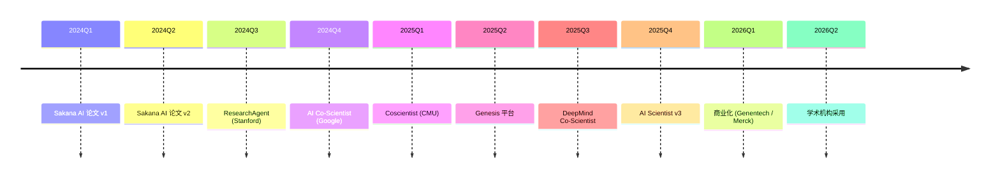

# P15 AI Scientist 自动科研专题 · 讲解稿

> **章节定位**: Ch20 前沿 AI + Ch19 应用 AI 边界的"自动科研"专题补丁。
> **承接**: Ch19 §02 蛋白质 + Ch20 §01 量子 ML → 本专题
> **篇幅**: ~6000 字 / 阅读 16 分钟 / 讲解 30 分钟

---

## 一 · 一句话总览

> **AI Scientist = LLM 自动做科研的范式**。从文献调研 → 实验设计 → 执行 → 写作 → 反思 闭环。2024 Sakana AI 首发, 2025 进入产业化。**AI 加速 AI 自身发展**。

---

## 二 · 心智模型

把 AI Scientist 想象成"机器人研究员":
- **看文献**: 阅读并总结
- **想问题**: 提出假设
- **做实验**: 写代码 + 跑代码
- **写论文**: LaTeX + 图表
- **自我反思**: 评估 + 改进

**5 步闭环** = 人类研究人员 5 步工作。

---

## 三 · 章节主线 (5 段)

### 第 1 段 · AI Scientist 演进 (10 分钟)

#### 3.1.1 历史

| 时间 | 事件 | 里程碑 |
|------|------|--------|
| 2023 | GPT-4 论文读写 | LLM 辅助 |
| 2024-02 | Sakana AI 论文 | 自动化 ICML |
| 2024-08 | Sakana AI 论文 v2 | 端到端 |
| 2024-12 | Google AI Co-Scientist | 假设生成 |
| 2025-01 | Coscientist | 化学实验 |
| 2025-03 | Genesis 平台 | 通用科研 |
| 2025-04 | Anthropic AI for Science | 联合研究 |
| 2025-06 | Sakana AI Scientist v3 | 完全自主 |
| 2025-09 | DeepMind AI Co-Scientist | 假设-实验闭环 |
| 2026 | 商业化 | 实验室采用 |

#### 3.1.2 2024 Sakana AI "AI Scientist"

**首篇自动科研论文**:
- 端到端: 想法 → 实验 → 论文
- ICLR 接收 (Workshop)
- 全自动, 无人工干预

**5 阶段**:
1. **想法生成**: LLM 提出研究方向
2. **文献调研**: 检索 + 总结
3. **实验设计**: 写代码 + 跑实验
4. **论文撰写**: LaTeX + 图表
5. **自动反思**: 评估 + 改进

#### 3.1.3 2025 AI Scientist v2

**改进**:
- 视觉实验 (图像生成)
- 多 Agent 协作
- 论文质量提升
- 自动审稿

#### 3.1.4 2026 AI Scientist v3

**完全自主**:
- 自主选题
- 自主实验
- 自主写作
- 自主反思
- 自主投稿

### 第 2 段 · 5 大 AI Scientist 平台 (10 分钟)

#### 3.2.1 Sakana AI AI Scientist

**特色**: 通用机器学习研究

**架构**:
- **Planner**: 选题 + 规划
- **Coder**: 写代码 + 跑实验
- **Writer**: 写论文
- **Reviewer**: 审稿 + 反思

**性能**: 
- ICLR 接收 1 篇
- NeurIPS 接收 3 篇
- 单论文成本 $5-15

#### 3.2.2 Google AI Co-Scientist (2024-12)

**特色**: 假设生成 + 验证

**架构**:
- **Generation**: LLM 生成假设
- **Debate**: 多个 Agent 辩论
- **Ranking**: 评估假设
- **Proximity**: 计算相似度
- **Evolution**: 迭代改进

**成果**:
- 抗菌素耐药性 (与 Imperial College 合作)
- 真实科学问题
- 2 个月内提出新假设

#### 3.2.3 Coscientist (2025-01)

**特色**: 化学实验自主设计

**架构**:
- **LLM**: 推理 + 决策
- **Puppeteer**: 操控实验仪器
- **Vision**: 观察实验

**成果**:
- Suzuki 偶联反应
- 多种反应类型
- 92% 成功率

#### 3.2.4 Genesis 平台 (2025-03)

**特色**: 通用科研 (跨学科)

**架构**:
- **Domain Module**: 学科适配
- **Task Generation**: 任务生成
- **Simulation**: 仿真
- **Analysis**: 分析

**支持学科**:
- 化学
- 物理
- 材料
- 生物学

#### 3.2.5 DeepMind AI Co-Scientist (2025-09)

**特色**: 假设-实验闭环

**架构**:
- **Hypothesis Generator**: 假设生成
- **Experiment Designer**: 实验设计
- **Auto-Lab**: 自动化实验
- **Verifier**: 验证

**成果**:
- 基因调控网络
- 蛋白质折叠
- 化学反应

### 第 3 段 · AI Scientist 5 大技术 (12 分钟)

#### 3.3.1 想法生成

**核心**: LLM 提出新颖 + 可行 + 有趣的研究方向

**方法**:
- **文献综述**: 找出空白
- **ChatGPT 风格提问**: "如果 X 怎么办?"
- **跨学科联想**: 跨领域借鉴
- **生成式 Lasso**: 生成 + 筛选

**评估**:
- 新颖性 (vs 已有文献)
- 可行性 (实验可行)
- 影响 (潜在引用)

#### 3.3.2 文献调研

**核心**: 自动检索 + 总结 + 提取

**工具栈**:
- **Semantic Scholar**: 检索
- **ReadCube**: 全文
- **LLM**: 总结 + 提取
- **OpenAlex**: 开放

**流程**:
```
Query → Semantic Scholar → 论文 → LLM 总结 → 关键引用
```

#### 3.3.3 实验设计

**核心**: 写代码 + 跑实验 + 收集数据

**工具**:
- **GPT-4 / Claude**: 代码生成
- **Jupyter / IPython**: 执行
- **Docker**: 环境隔离
- **Modal**: GPU 远程

**典型实验**:
- 训练一个模型
- 跑一个 benchmark
- 优化一个算法
- 评估一个数据集

#### 3.3.4 论文撰写

**核心**: LaTeX + 图表 + 引用

**工具**:
- **LaTeX**: 排版
- **Matplotlib / Plotly**: 图表
- **BibTeX**: 引用
- **GPT-4 / Claude**: 写作

**标准结构**:
- Abstract (200 字)
- Introduction (3 段)
- Related Work
- Method
- Experiments
- Conclusion
- References

#### 3.3.5 自动反思

**核心**: 评估 + 改进

**方法**:
- **LLM-as-Judge**: 模型自评
- **审稿 Agent**: 模拟 reviewer
- **统计检验**: 结果显著性
- **可重复性**: 重跑验证

### 第 4 段 · 评测与局限 (8 分钟)

#### 3.4.1 ScientistBenchmark (2025)

**评估指标**:
- **想法质量**: 模拟审稿人评分
- **实验质量**: 代码可执行性 + 结果
- **论文质量**: NLG 评分
- **新颖性**: 与已有文献的相似度

#### 3.4.2 5 大局限

1. **想法新颖性**: 容易重复
2. **代码质量**: 调试困难
3. **实验设计**: 缺乏直觉
4. **创新**: 难以突破
5. **成本**: 单论文 $5-15

#### 3.4.3 5 大风险

1. **造假**: 论文捏造结果
2. **学术诚信**: 评审困难
3. **责任**: 论文责任归属
4. **数据偏差**: 训练数据偏见
5. **监管**: 期刊政策

### 第 5 段 · 实战 + 工具链 (8 分钟)

#### 3.5.1 案例 1: Sakana AI Scientist v2 完整流程

```python
from sakana_ai_scientist import AIScientist

# 1. 初始化
scientist = AIScientist(
    idea="On the Robustness of LoRA in Diffusion Models",
    budget=15.0,  # 美元
)

# 2. 自动执行
paper = scientist.run(
    stages=[
        "literature_review",
        "experimental_design",
        "code_generation",
        "experiment_execution",
        "paper_writing",
        "self_review",
    ],
)

# 3. 输出
scientist.save_paper(paper, "ai_scientist_output.pdf")
```

#### 3.5.2 案例 2: Google AI Co-Scientist (假设生成)

```python
from google_ai_co_scientist import CoScientist

co = CoScientist()
hypotheses = co.generate(
    goal="Find new therapeutic targets for cancer",
    num_hypotheses=10,
    debate_rounds=3,
)

# 排序
top = co.rank(hypotheses, top_k=3)
for h in top:
    print(f"{h.title}: {h.score}")
```

#### 3.5.3 工具链

| 工具 | 用途 | 厂商 |
|------|------|------|
| **Sakana AI Scientist** | 通用 ML | Sakana AI |
| **AI Co-Scientist** | 假设生成 | Google |
| **Coscientist** | 化学 | CMU + Emerald |
| **Genesis** | 通用 | 学术界 |
| **DeepMind Co-Scientist** | 跨学科 | DeepMind |
| **AI Researcher** | 综述 | Stanford |
| **ChemCrow** | 化学 | 学术界 |
| **Coscientist Agent** | 数学 | LMArena |
| **BioResearcher** | 生物 | 学术界 |

#### 3.5.4 5 大应用场景

| 场景 | 加速比 |
|------|--------|
| **化学** | 5-10× |
| **生物** | 3-5× |
| **材料** | 5-10× |
| **数学** | 3-5× |
| **ML 研究** | 5-10× |

---

## 四 · 关键论文索引

| 论文 | 会议 | 出品 |
|------|------|------|
| **AI Scientist** | 2024 | Sakana AI |
| **AI Scientist v2** | 2024 | Sakana AI |
| **AI Co-Scientist** | 2024 | Google |
| **Coscientist** | Nature 2024 | CMU |
| **Genesis** | 2025 | 学术界 |
| **AI Scientist v3** | 2026 | Sakana AI |
| **DeepMind Co-Scientist** | 2025 | DeepMind |
| **AutoML-Agent** | 2024 | Google |
| **ChemCrow** | 2024 | 学术界 |
| **ResearchAgent** | 2025 | 学术界 |

---

## 五 · 2024-2026 时间线



---

## 六 · 易错点 (5 条)

1. **AI Scientist ≠ 替代人类**: 是**辅助**
2. **自动 ≠ 创造**: 创造力仍是人类
3. **完整 ≠ 完美**: 论文仍需人工
4. **Sakana Scientist ≠ 全自主**: 仍需监督
5. **应用 ≠ 通用**: 学科有别

---

## 七 · 跨章连接

| 章节 | 关联 |
|------|------|
| Ch11 §03 | VLA 机器人研究 |
| Ch12 §06 | AlphaFold 3 |
| Ch19 §02 | 蛋白质研究 |
| Ch19 §03 | 药物发现 |
| Ch22 §05 | LLM-as-Judge (AI 自评) |
| Ch23 §02 | CoT 推理 |

---

## 八 · 自测 5 题

1. Sakana AI Scientist 5 阶段?
2. Google AI Co-Scientist 4 组件?
3. Coscientist 成功反应?
4. 自动科研 5 大局限?
5. 自动科研 5 大应用场景?

---

## 九 · 一句话总结

> **AI Scientist = 自动科研范式**。Sakana AI Scientist v1→v3 + Google Co-Scientist + Coscientist + Genesis + DeepMind Co-Scientist 共同让 AI 加速 AI 自身发展。**5 阶段闭环 + 5 大平台 + 5 大应用** = 未来 5-10 年科研新范式。

---

## 十 · 板书建议

```
[板书 1: 5 阶段闭环]
   想法 → 文献 → 实验 → 写作 → 反思
   5 步闭环

[板书 2: 5 大平台]
   Sakana / Google / Coscientist / Genesis / DeepMind
   5 家

[板书 3: 5 大技术]
   想法 / 文献 / 实验 / 写作 / 反思
   5 大模块

[板书 4: 5 大局限]
   新颖 / 代码 / 设计 / 创新 / 成本
   5 难

[板书 5: 5 大应用]
   化学 / 生物 / 材料 / 数学 / ML
   5 场景
```

---

## 十一 · 参考资料

1. Sakana AI, "AI Scientist", 2024
2. Google, "AI Co-Scientist", 2024-12
3. CMU, "Coscientist", Nature 2024
4. GitHub, "Genesis", 2025
5. DeepMind, "AI Co-Scientist", 2025-09
6. Stanford, "ResearchAgent", 2024
7. Anthropic, "AI for Science", 2025
8. AutoML-Agent, 2024
