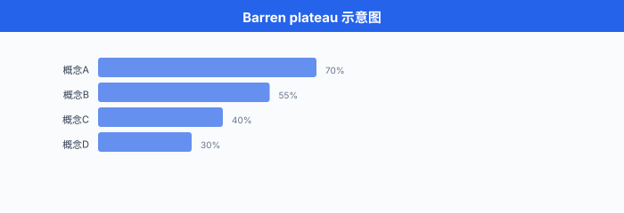

# 量子机器学习

> **一句话总结**：量子机器学习把量子比特的叠加与纠缠塞进 ML 流程，用参数化量子电路当"神经层"，期望在特定任务上突破经典算法瓶颈。

## 🗺️ 本章导览

- 本章覆盖前沿 AI：量子 ML → 神经形态 → 太空数据中心 → 去中心化 AI → 脑机接口
- **01. 量子机器学习** (本节)：量子门、变分量子算法、量子加速、中国生态与瓶颈
- **02. 神经形态计算**：脉冲神经网、类脑硬件
- **03. 太空数据中心**：待补
- **04. 去中心化 AI**：待补
- **05. 脑机接口**：待补

*这一节我们从量子比特开始，一路走到变分量子算法、量子核方法、贫瘠高原，最后看看 2026 年的硬件能做到哪一步、瓶颈又在哪里。 读完你应该能向同事讲明白：VQE/QAOA 究竟在干什么，为什么大家吵量子优势，以及最近学界到底退潮还是真香.*

---

## 1. 量子计算基础：比特、叠加、纠缠、测量

要理解量子机器学习 (Quantum Machine Learning, QML)，我们得先把"量子计算"这件事本身讲清楚。 别被它的神秘感吓到 —— 量子计算的核心只有四件事：量子比特 (qubit)、叠加 (superposition)、纠缠 (entanglement)、测量 (measurement). 掌握这四件，后面的变分算法、核方法就只是它们的工程化组合。

### 1.1 量子比特 (qubit)

经典比特 (bit) 是 0 或 1. 量子比特 (qubit) 则是两者的**复数线性组合**:

$$|\psi\rangle = \alpha|0\rangle + \beta|1\rangle, \quad \text{其中 } \alpha, \beta \in \mathbb{C}, \quad |\alpha|^2 + |\beta|^2 = 1$$

$|0\rangle$ 和 $|1\rangle$ 是两个标准正交基 (类似坐标轴上的 $\mathbf{e}_1$ 和 $\mathbf{e}_2$), $\alpha$ 和 $\beta$ 是复振幅。 模平方 $|\alpha|^2$ 和 $|\beta|^2$ 是测得 0 或 1 的概率，两者相加等于 1.

你也可以把 qubit 当成一个"球面上的点"——这就是著名的 **Bloch 球 (Bloch sphere)** 表示:

$$|\psi\rangle = \cos\!\left(\frac{\theta}{2}\right)|0\rangle + e^{i\phi}\sin\!\left(\frac{\theta}{2}\right)|1\rangle$$


> **图说**: Bloch 球把 qubit 的状态映射到三维单位球面上。 北极 $|0\rangle$、南极 $|1\rangle$，赤道上的点对应"等概率叠加" $\frac{1}{\sqrt{2}}(|0\rangle + e^{i\phi}|1\rangle)$. 任何单 qubit 量子门都对应球面上的一个旋转。

注意一个微妙之处：$\alpha$ 携带的**全局相位 (global phase)** 不可观测 —— 即 $|\psi\rangle$ 和 $e^{i\gamma}|\psi\rangle$ 在物理上完全等价。 只有**相对相位** (即两个振幅之间的相位差) 才能在干涉中被实验观察到。

### 1.2 叠加 (superposition)

**叠加**不是"既 0 又 1"，更不是"薛定谔的猫真的半死半活". 它真正的意思是：在被测量之前，qubit 的振幅 $\alpha$ 和 $\beta$ **同时存在**，并在随后的演化中通过**干涉**彼此增强或抵消。

一个最经典的例子是 **Hadamard 门** $H$:

$$H|0\rangle = \frac{1}{\sqrt{2}}(|0\rangle + |1\rangle), \quad H|1\rangle = \frac{1}{\sqrt{2}}(|0\rangle - |1\rangle)$$

把 $H$ 作用到 $|0\rangle$ 上，我们就得到一个"50% 概率测得 0、50% 概率测得 1"的状态。 但真正的威力在于**多 qubit 的叠加** —— $n$ 个 qubit 处于叠加态时，能同时承载 $2^n$ 个经典状态。 这就是量子并行性的源头。

**重要警告**：叠加**不等于**你能"并行访问 $2^n$ 个数据". 哥本哈根诠释告诉我们：你一旦测量，系统就**塌缩**到一个经典结果，其余振幅全部丢失。 这就是为什么 QML 的算法设计必须巧妙使用干涉，把答案"汇聚"到少数几个振幅上。

### 1.3 纠缠 (entanglement)

**纠缠**是 QML 与"只是把计算随机化"的分水岭。 两个 qubit 的纠缠态 (以 Bell 态为例):

$$|\Phi^+\rangle = \frac{1}{\sqrt{2}}(|00\rangle + |11\rangle)$$

这个状态的关键性质：单独测量任何一个 qubit，结果是 0 或 1 都各占 50%；但**两个 qubit 都测**，结果**必然相同** (00 或 11，不会 01 或 10). 无论两个 qubit 隔多远。

数学上，纠缠意味着**无法写成单个 qubit 状态的张量积**：不存在 $\alpha, \beta, \gamma, \delta$ 让 $|\Phi^+\rangle = (\alpha|0\rangle+\beta|1\rangle) \otimes (\gamma|0\rangle+\delta|1\rangle)$. 纠缠是 QML 能产生"超越经典"关联性的物理基础。

> **直觉**：把纠缠态想成两枚硬币，远在宇宙两端，但当你翻一枚，另一枚**立刻**呈现相关面。 这听起来违反相对论 (信息传播比光快?)，但其实**不能用来传信**：你的本地测量结果是随机的，没有可控的自由度。

### 1.4 测量 (measurement)

**测量是 QML 唯一能看到结果的地方**，也是它"漏信息"的地方。 测量一个 qubit 的某个可观测量 (observable，比如 Pauli-Z)，你会得到:

- 以 $|\alpha|^2$ 的概率得到结果 $+1$ (塌缩到 $|0\rangle$)
- 以 $|\beta|^2$ 的概率得到结果 $-1$ (塌缩到 $|1\rangle$)

测量后，系统的状态被破坏性地更新为对应的本征态。 这意味着一旦你测过，之前精心培育的叠加就被打散了 —— 想再来一次，必须重新制备。

QML 的工作流因此常被描述成:

1. 制备一组 qubit 的初始态 (通常是 $|0\rangle^{\otimes n}$)
2. 应用一系列量子门 (酉变换，详见 §2)
3. 测量末态
4. 经典计算机根据测量结果调整参数，重复 1–3 (这是变分算法循环)

---

## 2. 量子门：让 qubit 旋转的语言

量子计算的本质是**对 qubit 的酉变换 (unitary transformation)**. 这些酉变换就是量子门。 几个基本门构成了量子编程的"字母表".

### 2.1 单 qubit 门：Pauli 矩阵与 Hadamard

**Pauli-X 门** (比特翻转 NOT):

$$X = \begin{bmatrix} 0 & 1 \\ 1 & 0 \end{bmatrix}, \quad X|0\rangle = |1\rangle, \quad X|1\rangle = |0\rangle$$

**Pauli-Y 门** (比特翻转 + 相位翻转):

$$Y = \begin{bmatrix} 0 & -i \\ i & 0 \end{bmatrix}$$

**Pauli-Z 门** (相位翻转):

$$Z = \begin{bmatrix} 1 & 0 \\ 0 & -1 \end{bmatrix}, \quad Z|0\rangle = |0\rangle, \quad Z|1\rangle = -|1\rangle$$

**Hadamard 门** (造叠加):

$$H = \frac{1}{\sqrt{2}}\begin{bmatrix} 1 & 1 \\ 1 & -1 \end{bmatrix}$$

这三个 Pauli 矩阵 $\{I, X, Y, Z\}$ 配上 $H$，就生成了**单 qubit 的 Clifford 群** —— 它们能完成你能想到的大部分"经典逻辑 + 一点点相位". 但 Clifford 群自身**不能通用量子计算**，还需要非 Clifford 门，其中最常用的是**旋转门**:

$$R_x(\theta) = e^{-i\theta X/2} = \begin{bmatrix} \cos(\theta/2) & -i\sin(\theta/2) \\ -i\sin(\theta/2) & \cos(\theta/2) \end{bmatrix}$$

$R_x(\theta), R_y(\theta), R_z(\theta)$ 三个旋转门配合 $X, Y, Z$, **任意单 qubit 酉变换都可以由三个旋转门合成** (这就是著名的 **ZYZ 分解** 或 **Euler 分解**):

$$U = e^{i\alpha} R_z(\beta) R_y(\gamma) R_z(\delta)$$

这意味着在 QML 里，几乎所有参数化单 qubit 门最终都落到三个可训练的旋转角上。

### 2.2 双 qubit 门：CNOT 与纠缠的工厂

**CNOT (Controlled-NOT, CX)** 是 QML 里的主力纠缠门:

$$\text{CNOT}|00\rangle = |00\rangle, \quad \text{CNOT}|01\rangle = |01\rangle, \quad \text{CNOT}|10\rangle = |11\rangle, \quad \text{CNOT}|11\rangle = |10\rangle$$

控制位为 0 时目标位不变，控制位为 1 时目标位翻转。 我们可以用矩阵写:

$$\text{CNOT} = \begin{bmatrix} 1 & 0 & 0 & 0 \\ 0 & 1 & 0 & 0 \\ 0 & 0 & 0 & 1 \\ 0 & 0 & 1 & 0 \end{bmatrix}$$

CNOT 加上 Hadamard，就能造出纠缠。 经典序列：$H$ 作用在第一个 qubit，再 CNOT (控制=第一个，目标=第二个)，起步于 $|00\rangle$ 时你会得到 Bell 态 $|\Phi^+\rangle = \frac{1}{\sqrt{2}}(|00\rangle + |11\rangle)$. 这是**所有 QML 电路中纠缠的种子动作**.

### 2.3 三 qubit 门与通用性

**Toffoli 门 (CCNOT)** 是经典 AND 门的量子对应，在量子纠错中至关重要。 但**它在 QML 训练中较少出现**，因为它不是参数化的，也不好求梯度。

通用量子计算理论 (Solovay–Kitaev 定理) 告诉我们：**任意单 qubit 旋转门 + CNOT** 就能以任意精度逼近任意多 qubit 酉变换。 这意味着，QML 在"硬件可用门集"层面有相当大的设计自由度 —— 厂商提供的原生门 (IBM 用 $\sqrt{X}$、Rigetti 用 iSWAP、Google 用 Sycamore 的 $\sqrt{\text{iSWAP}}$) 本质上都能互相编译。

---

## 3. 量子电路：拼出门序列的艺术

### 3.1 电路模型 (circuit model)

**量子电路 (quantum circuit)** 是量子算法的图形化表示：横轴是时间 (从左到右)，纵轴是不同的 qubit，每条线上的方框是量子门。 一组时刻终点的"测量"图标说明在哪一步采样。


> **图说**：上图展示最经典的 Bell 态制备电路：两个 qubit 初始化为 $|0\rangle$，第一个经过 Hadamard 门进入叠加，然后 CNOT 把第二个 qubit 纠缠进来，最后测量两个 qubit 各得到 0 或 1. 在 10000 次采样下，你看到的统计只会是 `00` 和 `11` 各占 50%，永远不会出现 `01` 或 `10` —— 这就是纠缠的可观测证据。

### 3.2 参数化量子电路 (parameterised quantum circuits, PQC)

QML 的核心结构叫**参数化量子电路 (Parameterised Quantum Circuit, PQC)**，又称 **ansatz 电路**. 它的意思是：电路里有一些**可训练的旋转角度** $\theta_i$，末态变成了参数化函数 $|\psi(\boldsymbol{\theta})\rangle$，然后我们测量某个可观测量 $\hat{O}$，得到期望值:

$$f(\boldsymbol{\theta}) = \langle\psi(\boldsymbol{\theta})|\hat{O}|\psi(\boldsymbol{\theta})\rangle$$

这正是 QML 的"输出". 注意 $f$ 是个**实数标量** (因为 $\hat{O}$ 通常选择厄米特算符，期望值是实数)，我们用经典优化器 (梯度下降、Adam 等) 调整 $\boldsymbol{\theta}$ 来最大化或最小化 $f$.

所以，**PQC 充当了"量子层"的角色**，几乎所有 VQA (变分量子算法)、QNN、量子核方法的最内层电路，都长一个样:

```python
# PennyLane 风格的伪代码: 一个 4-qubit 强纠缠层 ansatz
import pennylane as qml

def strong_entangler_layer(weights, wires):
    """weights: shape (n_layers, n_wires, 3)"""
    n_wires = len(wires)
    for layer in range(weights.shape[0]):
        # 每个 qubit 上一个通用旋转
        for i in range(n_wires):
            qml.Rot(*weights[layer, i], wires=wires[i])
        # 环形 CNOT 链, 把纠缠搅起来
        for i in range(n_wires):
            qml.CNOT(wires=[wires[i], wires[(i + 1) % n_wires]])
```

### 3.3 宽度与深度 (width vs depth)

- **宽度 (width)**：电路使用的 qubit 数 $n$. 等价于我们能用的量子"内存".
- **深度 (depth)**：所有 qubit 上累计的最大门层数 (假设可并行). 反映电路在退相干 (decoherence) 前能进行的演化复杂度。

NISQ 时代硬件的两个硬约束直接绑死 QML 算法的设计:

- 最多 50–200 个可用 qubit (IBM Condor 2023 突破到 1121 qubit，但单次实验可用约 100–400)
- 电路深度一般不超过 100–1000 层 (因为每一层 ~ 几十到几百 ns 噪声累计)

这意味着 QML 算法**必须对噪声和 qubit 数同时鲁棒**，这是为什么大多数工作的 ansatz 选 **硬件高效 ansatz (hardware-efficient ansatz, HEA)** —— 把旋转门和 CNOT 紧紧贴在硬件原生门集上，不去追求理论上更优雅但需深电路的化学 ansatz.

---

## 4. 变分量子算法 (VQA)：把量子电路当 f(θ)

变分量子算法 (Variational Quantum Algorithm, VQA) 是当前 QML 的**唯一实用性范式**. 它的工作模式是:

1. 准备一个参数化电路 $U(\boldsymbol{\theta})$
2. 把数据 $\mathbf{x}$ 编码进电路 (encode)，或者干脆用一个固定输入态
3. 测量期望值 $\langle\hat{O}\rangle$
4. 经典优化器调整 $\boldsymbol{\theta}$，反复迭代

VQA 的灵魂是**经典-量子混合**：数据准备和参数更新在经典 CPU，期望值采样在量子芯片。 这种分工正是 NISQ 时代能落地的关键 —— 我们没有大规模纠错的能力，但可以把短而深的电路反复跑 1000 次取平均，把噪声平均掉。

下面我们展开 VQA 的三大代表：VQE、QAOA、VQC.

### 4.1 VQE：变分量子本征求解器

**变分量子本征求解器 (Variational Quantum Eigensolver, VQE)** 由 Alberto Peruzzo 等人在 2014 年提出，当时发表在 *Nature Communications* 上，论文标题就叫 "A variational eigenvalue solver on a quantum processor"[^peruzzo2014]. 它的任务极其专一：求一个**哈密顿量 $\hat{H}$ 的基态能量**.

$$E_0 = \min_{|\psi\rangle} \langle\psi|\hat{H}|\psi\rangle, \quad \text{其中 } \langle\psi|\psi\rangle = 1$$

为什么这事重要？因为分子基态能量决定了化学反应速率、材料性质。 在经典计算机上，精确解这个问题需要指数级资源 (Full-CI)，即使是近似 (CCSD(T)) 也是经典计算的瓶颈。 VQE 的承诺是用量子电路去采样 $\langle\hat{H}\rangle$，然后交给经典优化器去更新 $\boldsymbol{\theta}$.

我们把哈密顿量展开成 Pauli 项之和 (这是分子/凝聚态物理的常用做法):

$$\hat{H} = \sum_i c_i \hat{P}_i, \quad \hat{P}_i \in \{I, X, Y, Z\}^{\otimes n}$$

每一项 $\hat{P}_i$ 都能用一个短电路测量，因此总期望值:

$$\langle\hat{H}\rangle = \sum_i c_i \langle\hat{P}_i\rangle$$

每个 $\langle\hat{P}_i\rangle$ 由量子硬件 1000 次采样取平均估计；然后经典优化器 (比如 BFGS、L-BFGS、Adam) 算梯度、调 $\boldsymbol{\theta}$，重复。

下面是 VQE 的最小工作骨架:

```python
import pennylane as qml
from pennylane import numpy as np

dev = qml.device("default.qubit", wires=2)

def ansatz(params, wires):
    qml.RX(params[0], wires=wires[0])
    qml.RY(params[1], wires=wires[1])
    qml.CNOT(wires=[wires[0], wires[1]])

@qml.qnode(dev)
def cost(params):
    ansatz(params, wires=[0, 1])
    return qml.expval(qml.PauliZ(0) + 0.5 * qml.PauliZ(1))

opt = qml.GradientDescentOptimizer(stepsize=0.4)
params = np.array([0.1, 0.1], requires_grad=True)

for it in range(50):
    params = opt.step(cost, params)
    if it % 10 == 0:
        print(f"iter={it}, energy={cost(params):.4f}")
```

VQE 在小分子 (H₂、LiH、BeH₂) 上已经验证了"量子 + 经典混合确实能给出逼近化学精度的能量估计"，但**真实竞争力还要等几百 qubit 的容错时代**才能兑现。

### 4.2 QAOA：量子近似优化算法

**量子近似优化算法 (Quantum Approximate Optimization Algorithm, QAOA)** 由 Edward Farhi、Jeffrey Goldstone、Sam Gutmann 在 2014 年提出，arXiv 编号 [1411.4028][^farhi2014]. 它的目标场景是**组合优化**: MaxCut、TSP、图着色、约束满足等 NP 难问题。

把问题写成哈密顿量:

- **目标哈密顿量 $\hat{C}$**：把我们要最大化的目标函数编码成对角算符。 比如 MaxCut：对每条边 $(i, j)$ 加一项 $\frac{1}{2}(1 - Z_i Z_j)$，当两顶点同侧时该项为 0、不同侧时为 1
- **混合哈密顿量 $\hat{B} = \sum_i X_i$**：每顶点一个 Pauli-X 的和，用于在子空间中"搅动"

QAOA 的电路以交替形式演化:

$$|\psi_p(\boldsymbol{\gamma}, \boldsymbol{\beta})\rangle = e^{-i\beta_p \hat{B}} e^{-i\gamma_p \hat{C}} \cdots e^{-i\beta_1 \hat{B}} e^{-i\gamma_1 \hat{C}} |+\rangle^{\otimes n}$$

参数 $\boldsymbol{\gamma}, \boldsymbol{\beta}$ 共 $2p$ 个，$p$ 是 QAOA 层数。 测量 $\langle\hat{C}\rangle$，交给经典优化器调参。

QAOA 的关键性质：当 $p \to \infty$ 时，它收敛到精确解。 对小的 $p$，它给出 MaxCut 等问题的近似比 (approximation ratio) 是有保证的。 Farhi 等人在 $p=1$ 时给出 MaxCut 在 3-regular 图上的近似比 $\geq 0.6924$ (经典 Goemans–Williamson 给出 $\geq 0.878$，但需要 SDP 求解器).

**为什么大家关心 QAOA**? 因为它代表了一种"用浅电路 + 大规模并行采样去攻 NP-hard"的可能性。 在含噪硬件上，$p$ 通常取 1–3，已经是 QML 在 2024–2026 年的主要实验目标 (IBM、Google Quantinuum 都有相关论文).

### 4.3 VQC：变分量子分类器

**变分量子分类器 (Variational Quantum Classifier, VQC)** 是把 VQE/QAOA 的范式搬到监督学习。 它的核心想法:

- 把输入特征 $\mathbf{x}$ 编码进一个**数据重新上传 (data re-uploading)** 电路：$U(\mathbf{x})$ 与 $U(\boldsymbol{\theta})$ 交替，让电路对 $\mathbf{x}$ 形成非线性响应
- 末尾测量一个或几个 Pauli，把期望值作为类别分数
- 用 cross-entropy 等损失训练参数 $\boldsymbol{\theta}$

Schuld 等人 2020 年的工作 "Effect of data encoding on the expressive power of variational quantum machine-learning models"[^schuld2020] 表明：这种"重新上传 ansatz"在合适编码下能逼近任意 $[0, 1]^n \to \{0, 1\}$ 标签函数。

**注意**: VQC 的优势目前仍然**主要是理论意义**. 在真实数据集 (MNIST 缩减版、IRIS 等) 上的实验显示，VQC 与经典 SVM、随机森林相比并没有稳定的优势，反而在噪声下更容易崩。 所以这个方向仍处于"找出它真能赢在哪"的探索期。

---

## 5. 量子核方法：把数据升维到 Hilbert 空间

核方法 (kernel methods) 在 1990 年代是 ML 的主力 (SVM 配合高斯核横扫各类比赛)，后来被深度学习取代。 但核的**思想本身** —— 把数据隐式升维到高维空间再用线性模型 —— 恰好非常适合量子计算，因为 Hilbert 空间是量子态的天然家。

### 5.1 量子特征映射 (quantum feature map)

**量子特征映射 $\phi(\mathbf{x})$** 是一个酉变换:

$$|\phi(\mathbf{x})\rangle = U(\mathbf{x})|0\rangle^{\otimes n}$$

把经典向量 $\mathbf{x} \in \mathbb{R}^d$ 编码成 $n$ 个 qubit 的状态。 常见编码方式:

- **幅度编码 (amplitude encoding)**：把 $\mathbf{x}$ 的归一化版本塞进态向量 $|\psi\rangle = \sum_i x_i |i\rangle$. 这个映射只需 $\log_2 d$ 个 qubit，但很难构造。
- **角度编码 (angle encoding)**：每个特征 $x_i$ 通过 $R_x(x_i)$ 或 $R_z(x_i)$ 进入一个 qubit. 简单，但只能把 $d$ 维数据塞进 $d$ 个 qubit.
- **重新上传编码**：用多层 $R(\mathbf{x}, \boldsymbol{\theta}) = R(\boldsymbol{\theta}) R(\mathbf{x})$ 交替，让网络深度非线性化。

### 5.2 QSVM：量子支持向量机

**量子支持向量机 (Quantum Support Vector Machine, QSVM)** 的核心想法由 Havlíček 等人在 2019 年的 *Nature* 论文 "Supervised learning with quantum-enhanced feature spaces"[^havlicek2019] 中正式提出。

定义**量子核 (quantum kernel)**:

$$K(\mathbf{x}, \mathbf{x'}) = |\langle\phi(\mathbf{x})|\phi(\mathbf{x'})\rangle|^2$$

这正是两个量子态之间的**保真度 (fidelity)**. 当 $K(\mathbf{x}, \mathbf{x'})$ 难用经典计算时，但能用短量子电路估计时，我们就拿到了一个"经典无法有效计算、但量子可以"的内积。

然后 SVM 的优化问题:

$$\min_{\boldsymbol{\alpha}} \frac{1}{2}\sum_{i,j}\alpha_i \alpha_j y_i y_j K(\mathbf{x}_i, \mathbf{x}_j) - \sum_i \alpha_i$$

在参数求解这一步，可以交给经典 SVM solver；但**核矩阵 $K$ 的所有元素都通过量子电路测量**. Havlíček 的实验在 IBM Q 5-qubit 机器上跑了两个 toy classification 任务，验证了量子核确实能产生"经典核难构造"的特征空间。

### 5.3 量子核的潜在优势 vs 现实

理论上，如果我们能找到**经典难算但量子易算的核**, QSVM 就能胜过经典 SVM. 但这个"量子易算"是有条件的:

- 对 NISQ 硬件，测量噪声会让核估计偏差大，反而劣化分类
- 许多被研究过的特征映射 (如上 Havlíček 的二级纠缠门)，经典 GPU 上可以"伪造"出**等价核矩阵** —— 这意味着量子优势并不存在
- 真正的优势可能只在特定编码方式 + 特定数据分布上才出现

Huang 等人 2021 年的 "Power of data in quantum machine learning"[^huang2021] 给出了一个负面结果：在大多数合理假设下，QML 的可泛化能力被经典数据量**多项式**压制，即若有 $O(N)$ 经典样本，经典模型也能达到类似泛化。 这让"量子优势"的口号从狂热回到冷静。

---

## 6. 贫瘠高原：量子梯度消失之谜

### 6.1 问题陈述

QML 训练主要困难叫**贫瘠高原 (barren plateaus)**，由 McClean 等人在 2018 年发表于 *Nature Physics* 的论文 "Barren plateaus in quantum neural network training landscapes"[^mcclean2018] 中系统刻画。

现象：当参数化量子电路**深度或宽度增长时**，损失函数 $L(\boldsymbol{\theta})$ 对参数的梯度**指数级衰减到零**:

$$\text{Var}\!\left[\frac{\partial L}{\partial \theta_i}\right] \sim O(b^{-n})$$

其中 $b < 1$ 是某个常数，$n$ 是 qubit 数。 直观上，参数空间是一个"看起来起伏平缓的高原"，随机初始化时**几乎所有点都是几乎一样的损失**，梯度信号淹没在采样噪声里。



> **图说**：横轴是参数空间中沿两个正交方向的位置，纵轴是损失值。 绝大多数区域的损失都集中在全局极小附近 (红区)，中间是几乎平的"高原" (浅蓝区). 训练在高原上时，梯度接近零，优化器停滞。

### 6.2 数学直觉：2-design 与集中不等式

Barren plateau 不是"门不好"，而是**电路结构本身**的统计性质。 McClean 的证明走的是下面这条路径:

1. 假设电路由一组酉 $U(\boldsymbol{\theta}) = U_L(\theta_L) \cdots U_1(\theta_1)$ 构成，每层从某个"局部酉集合"中独立采样
2. 如果这个集合构成**酉 2-design** (近似覆盖整个酉群的二阶矩)，那末态 $|\psi\rangle$ 在 Hilbert 空间里**均匀分布**
3. 把损失写成 $L(\boldsymbol{\theta}) = \text{Tr}[\hat{O} \rho(\boldsymbol{\theta})]$，其中 $\rho$ 是密度算符
4. 用集中不等式 (Levy 引理 / 高斯积分) 论证：$\rho$ 的 Frobenius 范数集中在 $1/2^n$

直觉就是：**均匀随机态之间彼此正交**，因此叠加"杂凑"得很平均，任何单 qubit 操作带来的扰动都彼此抵消 —— 这就是梯度消失的根因。

### 6.3 解法：局部性、成本函数、初始化策略

Barren plateau 没有万能解，但有一组实用技巧:

- **局部电路 (local ansatz)**：用深度浅、纠缠少的 ansatz (如 Hardware-Efficient Ansatz 的浅层版)，避免梯度消失
- **恒等初始化 (identity initialization)**：把 $\boldsymbol{\theta}$ 初始化到**已知的小梯度区域** (例如全零附近，对应恒等变换). Grant 等人 2019 年的 "An initialization strategy for addressing barren plateaus" 提了"逐层增加 ansatz 深度"的策略
- **成本函数局部化**：让损失只测量**少量 qubit** 上的可观测量。 Cerezo 等人 2021 年证明这种 $k$-local cost function 可以让方差只随**常数因子**下降，而不是指数下降
- **参数化对称性**：限制参数共享，让电路表达力刚好够用

**核心 trade-off**: **表达能力 (expressibility) vs 可训练性 (trainability)**. 一个表达力极强的 ansatz 可能陷入 barren plateau；表达力太弱又装不下复杂任务。 这是 QML 算法设计的核心拉扯。

---

## 7. NISQ 时代与容错未来

### 7.1 什么是 NISQ

"**NISQ**" 这个词是 John Preskill 在 2017 年的 keynote 中提出，2018 年正式发文 "Quantum Computing in the NISQ era and beyond"[^preskill2018]. 它代表:

- **N**oisy：量子门有显著错误率 (当前 2-qubit 门 ~ 0.1%–1%)
- **I**ntermediate-S**cale**: 50–1000 qubit 的中等规模
- **Q**uantum：是真量子，不是经典模拟的伪装

Preskill 的判断是：NISQ 时代我们能跑**几十到几百 qubit 的浅电路**，但**没有完全容错**；一旦容错 (logical qubit + 表面码纠错) 成熟，才能释放 Shor/Grover 这类需要万亿门的算法。

### 7.2 当前硬件能力概览 (2026 年中)

下面是一个**近似量级**的快照 (数据来自各厂商 2025–2026 公布的技术博客与论文，不是承诺):

| 平台 | 技术路线 | 物理 qubit (公开) | 2-qubit 门误差 | 链接访问 |
|------|---------|-------------|----------------|---------|
| IBM Quantum (Heron r2) | 超导 transmon | 156 | ~ 0.1% | 云付费 |
| Google Willow/Sycamore-衍 | 超导 transmon | 72–105 | ~ 0.1% | 限定合作 |
| IonQ Forte | 离子阱 | 36 (algorithmic qubit) | ~ 0.5% | 云付费 |
| Quantinuum H2 | 离子阱 (trapped ion) | 56 | ~ 1e-4 (业界领先) | 云付费 |
| Rigetti Ankaa-3 | 超导 | 84 | ~ 1% | 云付费 |
| PsiQuantum | 光量子 (光子) | 未公开 | — | 自建 |
| 本源量子 Wukong | 超导 | 72+ | — | 云 / 商业 |
| 国盾量子 | 超导 + 离子阱研发 | — | — | 合作 |
| 中科大 / 潘建伟团队 | 光量子九章、祖冲之 | 113 / 66 光量子 | — | 学术 |

> **注意**: "qubit 数"是营销数字，真正可比的是 "**algorithmic qubits**"——参与算法的有效 qubit. IonQ 与 Quantinuum 强调这一点，IBM 的量子体积 (Quantum Volume)、CLOPS 等 benchmark 也在试图给一个综合指标。

### 7.3 容错量子计算 (fault-tolerant quantum computing, FTQC)

容错硬件要求:

- **逻辑 qubit**：多个物理 qubit 编码一位逻辑 qubit，表面码 (surface code) 通常要求 **~ 1000 物理 qubit 编码 1 个逻辑 qubit**
- **纠错阈值**：物理门误差必须低于阈值 (~ 1%，表面码)，低于阈值时逻辑错误率随码距指数下降
- **魔态蒸馏 (magic state distillation)**：实现非 Clifford 门 (T 门) 需要持续的辅助 qubit，这部分开销最大

Google Quantum AI 2024 年底发表在 *Nature* 上的论文 "Quantum error correction below the surface code threshold"[^google2024] 报告了他们的 Willow 处理器在表面码下达成阈值以下，逻辑错误率随码距下降——这是**容错时代真正开门**的里程碑。

但即便如此，跑 Shor 算法破 2048 位 RSA 还需要约**几百万物理 qubit、几小时到几天运行时间**. 这意味着"FTQC 的杀手级应用"在大约 2030 年代中期之前**不会出现**.

---

## 8. 量子机器学习框架与软件栈

光有硬件不够，你还需要框架来描述电路。 当前的 QML 生态:

### 8.1 主流框架

- **PennyLane (Xanadu)**：以"量子 + 经典自动微分"为核心，接口类似 PyTorch/TensorFlow，可以和 PyTorch、TensorFlow、JAX 无缝互操作，是当前 QML 研究最活跃的开源框架
- **Qiskit (IBM)**: IBM 主导，包括 Qiskit Terra (电路编译)、Qiskit Aer (模拟器)、Qiskit IBM Runtime (云执行); Qiskit Machine Learning 提供 QSVM、VQC 等
- **Cirq (Google)**: Google 主导，风格类似 NumPy，偏硬件底层
- **TensorFlow Quantum (TFQ)**: Google 2020 年发布，把量子电路当作 Keras 层，但 2023 年起进入维护模式，不再积极开发
- **PaddleQuantum (百度)**：国内飞桨生态下的量子机器学习库，2020 年起开源，支持 PQC、VQE、QAOA、QSVM、量子 GAN 等常见模型，接口对飞桨用户友好
- **MindQuantum (华为)**：华为自研，跟随昇思 MindSpore 生态，在国内政企场景有应用
- **QuTiP (QuTiP-JAX)**：偏量子物理模拟，不专攻 ML 但常用于验证小规模量子算法

### 8.2 一个 PennyLane + PyTorch 的 VQC 例子

```python
import torch
import pennylane as qml

n_qubits = 4
dev = qml.device("default.qubit", wires=n_qubits)

@qml.qnode(dev, interface="torch")
def quantum_layer(inputs, weights):
    # 数据重上传编码
    qml.AngleEmbedding(inputs, wires=range(n_qubits))
    # 强纠缠层
    qml.StronglyEntanglingLayers(weights, wires=range(n_qubits))
    # 输出 4 个 Pauli-Z 期望值 (作为分类 logit)
    return [qml.expval(qml.PauliZ(i)) for i in range(n_qubits)]

# 把 quantum layer 包成一个 PyTorch nn.Module
class QModel(torch.nn.Module):
    def __init__(self):
        super().__init__()
        # 3 层强纠缠 ansatz, 每层 4 qubit × 3 角度
        weight_shapes = {"weights": (3, n_qubits, 3)}
        self.qlayer = qml.qnn.TorchLayer(quantum_layer, weight_shapes)

    def forward(self, x):
        return self.qlayer(x)

model = QModel()
opt = torch.optim.Adam(model.parameters(), lr=0.01)
# ... 训练循环 ...
```

上面这段代码里，**`quantum_layer` 就是 VQC 的量子部分**. 它的输出是 4 个实数 (4 个 Pauli-Z 期望值，各 ∈ [-1, 1])，直接当作分类器的 logit. 反向传播走 PyTorch 的 autograd，量子部分的梯度由 PennyLane 的**参数移位法则 (parameter-shift rule)** 自动给出。

```python
# 参数移位法则: 解析地求 d⟨O⟩/dθ, 不需要数值有限差分
# 对任何参数化酉 R_θ = exp(-iθ/2 P) (P 是 Pauli),
# d⟨O⟩/dθ = (1/2)[⟨O⟩_{θ+π/2} - ⟨O⟩_{θ-π/2}]
# 这意味着想求一个参数的梯度, 跑两次电路即可
import pennylane as qml
from pennylane import numpy as np

dev = qml.device("default.qubit", wires=1)

@qml.qnode(dev)
def circuit(theta):
    qml.RX(theta, wires=0)
    return qml.expval(qml.PauliZ(0))

# autograd 自动用 parameter-shift
theta = np.array(0.5, requires_grad=True)
qml.grad(circuit)(theta)  # = -sin(0.5) ≈ -0.479
```

---

## 9. 量子优势之争：2026 年的冷静期

### 9.1 "量子优势"的实验里程碑

"**量子优势 (quantum supremacy / quantum advantage)**" 指量子设备在特定任务上跑赢最强经典超算。

- **Google Sycamore 2019**: 53 qubit 随机线路采样，宣称 200 秒完成经典需 1 万年的任务。 后被 IBM 等用更聪明的经典算法反驳，实际经典模拟时间可降到数天
- **中国九章 (2020, 2021 更新)**：光量子玻色采样，在特定高斯玻色采样任务上达成量子优势
- **USTC 祖冲之 2.0/3.0 (2021)**：超导随机线路采样，进一步推高经典模拟成本

这些实验的共同点：它们都是**专门设计**来让量子容易、经典困难的"证明存在性"任务，**没有直接的实用价值**. 业界把它们定位为**必要的中间步骤**，但离"商业可用的量子加速"还有距离。

### 9.2 现实评估

到 2026 年中，**严肃的共识是**:

- 量子优势在**特定采样问题**上已经达成 (Google、中国九章系列)，但在**ML 训练、化学模拟、优化**等实际任务上**尚未达成**
- NISQ 时代 VQA/QML 的**真正问题**是噪声与贫瘠高原，而不是量子门理论本身
- 真正的"杀手级应用"在 FTQC 时代；**2026–2030 是过渡期**，主要任务是**算法、纠错、硬件三者协同进化**

中国科学院潘建伟院士等学者在多次公开报告中强调："**九章不是量子计算机的终点，而是量子信息实用化的起点**". 这是非常中肯的判断。

---

## 10. 中国生态：本源、国盾、潘建伟团队

中国 QML 生态值得单独一节，因为它在全球版图里有一席之地。

### 10.1 硬件公司

- **本源量子 (Origin Quantum)**: 2017 年成立，中科大系。 2021 年发布"**悟源**"超导量子计算机 (5–20 qubit), 2024 年的"**悟空**"提升到 72 qubit 并通过云平台对外服务。 推出了国内首个量子计算编程框架 **QPanda**
- **国盾量子 (QuantumCTek)**：中科大控股，主营量子保密通信，也介入量子计算整机研发
- **图灵量子 (TuringQ)**：上海交大系创业公司，走光量子 + 超导双路线
- **启科量子 (QuSeed)**：北京团队，主打离子阱

### 10.2 学术与国家队

- **中科大潘建伟团队**：主导九章系列 (光量子)、祖冲之系列 (超导), 2023 年起与国盾、本源合作推进工程化
- **中科院量子信息重点实验室**：合肥，凝聚态理论 + 实验并行
- **北京大学、清华、北航**：偏算法和软件，多个课题组在 VQE、QAOA、QML 理论稳定性上发文
- **百度、华为、腾讯**：百度出 PaddleQuantum，华为出 MindQuantum，腾讯在量子化学模拟上有布局

### 10.3 软件与教育

- **QPanda (本源)**: Python/C++ 接口，国内用户量最大的量子编程框架之一
- **PaddleQuantum (百度)**：与飞桨生态整合，教学资源丰富
- **HiQ (华为云)**：云端量子计算服务，早期接入超导硬件

整体上，中国生态呈"**国家队主导硬件、商业公司在工具链和应用层发力**"的结构。 与 IBM Quantum、Google Quantum AI 的"厂商闭环"模式相比，中国的硬件 + 软件更分散，但在国家级项目下协调效率较高。

---

## 11. 现实挑战：噪声、比特数、量子优势未实证

把以上的乐观叙事压一压，我们需要诚实地说:

1. **硬件噪声**：当前 2-qubit 门误差 0.1%–1%，单 qubit 误差 0.01%–0.1%. 跑深度 100+ 的电路，累计错误会让结果信噪比崩盘。 这就是为什么 VQA 几乎都限制深度 5–20 层
2. **比特数不足**: Algorithmic qubit (去除校准、连通性损失后的有效比特) 普遍低于物理 qubit 的一半。 一个表面码逻辑 qubit 要 ~ 1000 物理 qubit，跑 Shor 算法需要**几百万**物理 qubit
3. **量子优势尚未在 ML 任务上实证**：在化学模拟 (H₂、LiH) 上量子方法已经逼近化学精度，但没超过经典 CCSD(T). 在 ML benchmark 上 VQC 与经典 SVM、神经网络**胜负未分**，甚至有 Huang 等 2021 论文证明大多数情况下经典难压倒
4. **可训练性问题**: Barren plateau 没通用解，很多 ansatz 设计靠经验
5. **软件 / 人才培养缺口**：真正理解 QML 算法 + 经典 ML + 量子物理**三栖**的工程师全球可能不足万人

短期最现实的路径是**混合架构 (hybrid architectures)**：经典模型做主，量子层挑难点跑，端到端联合训练。 这也是 IBM Quantum 2025 年主打的方向 ("quantum-centric supercomputing").

---

## 12. 一段回顾代码：VQE 与 QAOA 的 same skeleton

我们把 VQE 和 QAOA 放一起看，你会发现它们的"骨架"是**一样的** —— 都是带参数的电路 + 期望值 + 经典优化器。 唯一区别是**目标哈密顿量**和**ansatz** 不同。

```python
import pennylane as qml
from pennylane import numpy as np

# 公共工具: VQE/QAOA 都用参数化电路 + 测量 + 优化
def vqa_skeleton(cost_h, ansatz, init_params, n_iter=100, lr=0.1, opt_name="adam"):
    """
    cost_h: qml.Hamiltonian, 要测量/优化的可观测量
    ansatz: callable(params, wires), 参数化电路
    init_params: 初始参数数组
    """
    wires = ansatz.wires
    dev = qml.device("default.qubit", wires=len(wires))

    @qml.qnode(dev)
    def cost(params):
        ansatz(params, wires=wires)
        return qml.expval(cost_h)

    if opt_name == "adam":
        opt = qml.AdamOptimizer(stepsize=lr)
    else:
        opt = qml.GradientDescentOptimizer(stepsize=lr)

    params = init_params
    for it in range(n_iter):
        params, loss = opt.step_and_cost(cost, params)
        if it % 20 == 0:
            print(f"iter={it:3d}, loss={loss:.6f}")
    return params
```

调用 VQE:
```python
H_vqe = qml.Hamiltonian([0.5, 0.5], [qml.PauliZ(0), qml.PauliX(0) @ qml.PauliX(1)])

def he_ansatz(params, wires):
    for w in wires:
        qml.RX(params[0, w], wires=w)
        qml.RY(params[1, w], wires=w)
    for i in range(len(wires) - 1):
        qml.CNOT(wires=[wires[i], wires[i+1]])

class WireList(list): pass
he_ansatz.wires = WireList([0, 1])

final_params = vqa_skeleton(H_vqe, he_ansatz, np.random.randn(2, 2) * 0.1)
```

调用 QAOA (MaxCut on 3-node line):
```python
# MaxCut 哈密顿量: C = 0.5 * (1 - Z0Z1) + 0.5 * (1 - Z1Z2)
H_qaoa = qml.Hamiltonian(
    [0.5, 0.5, -0.5, -0.5],
    [qml.PauliZ(0) @ qml.PauliZ(1), qml.PauliZ(1) @ qml.PauliZ(2),
     qml.PauliZ(0), qml.PauliZ(2)]
)

def qaoa_ansatz(params, wires):  # params shape (2p,)
    p = len(params) // 2
    for w in wires:
        qml.Hadamard(wires=w)
    for i in range(p):
        # cost layer
        for j in range(len(wires) - 1):
            qml.CNOT(wires=[wires[j], wires[j+1]])
            qml.RZ(2 * params[2*i], wires=wires[j+1])
            qml.CNOT(wires=[wires[j], wires[j+1]])
        # mixer layer
        for w in wires:
            qml.RX(2 * params[2*i + 1], wires=w)

qaoa_ansatz.wires = WireList([0, 1, 2])
final_params_qaoa = vqa_skeleton(H_qaoa, qaoa_ansatz, np.random.randn(2) * 0.1)
```

看出 VQE 和 QAOA 的共同骨架了吧？**这就是变分量子算法的本质**：一份参数化电路 + 一份可观测量的期望值 + 一份经典优化器。 剩下的全是工程问题。

---

## 13. 算法总结：一张表对照

| 算法 | 提出 | 任务 | ansatz | 优势场景 | 现实瓶颈 |
|------|------|------|--------|---------|---------|
| **VQE** | Peruzzo 2014 | 求哈密顿量基态 | 硬件高效 | 小分子能量 | 比特数与电路深度都还差 |
| **QAOA** | Farhi 2014 | 组合优化 | p 层交替 | MaxCut 等 | 采样开销大 |
| **VQC** | 2018+ | 监督分类 | 数据重上传 | 小数据 toy 任务 | 噪声下鲁棒性差 |
| **QSVM** | Havlíček 2019 | 监督分类 | 量子特征映射 | 难核分类问题 | 可计算等价核被证存在 |
| **QGAN** | 2018+ | 生成模型 | 量子生成器 | 探索期 | 训练不稳 |

---

## 📌 本节要点

- **量子比特 (qubit)**: $|\psi\rangle = \alpha|0\rangle + \beta|1\rangle$ 是两者的复数线性组合，模平方是测量概率；单 qubit 状态可视化为 Bloch 球面上的点。
- **叠加 + 纠缠 + 测量**：三件套决定了 QML 的能力上限。 多 qubit 叠加带 $2^n$ 个状态，但测量会塌缩到单一经典结果，需要巧用干涉汇聚答案。
- **量子门**: Pauli (X/Y/Z) 与 Hadamard 负责基本变换，CNOT 造纠缠，旋转门 $R_x/R_y/R_z(\theta)$ 是参数化主力。 任意单 qubit 酉变换可由三个旋转合成。
- **参数化量子电路 (PQC)**：门里带可训练角度 $\boldsymbol{\theta}$，测量得 $\langle\hat{O}\rangle$，由经典优化器调参 —— 是 QML 的"量子层"，也是 VQE/QAOA/VQC 的骨架。
- **VQE / QAOA**: VQE 用 ansatz 求哈密顿量基态，主攻化学；QAOA 用交替 cost-mixer 层近似组合优化，$p$ 层时收敛精度随 $p$ 提高。 二者都是 Peruzzo 2014、Farhi 2014 的经典工作。
- **量子核方法**：量子特征映射把数据升维到 Hilbert 空间，量子核 $K = |\langle\phi(\mathbf{x})|\phi(\mathbf{x'})\rangle|^2$ 作为 SVM 内积。 Havlíček 2019 在 IBM Q 上做了首次验证，但 Huang 2021 给出了负面结果。
- **贫瘠高原 (Barren Plateaus)**: McClean 2018 证明深度 / 宽度增长时梯度方差指数衰减，训练停滞。 缓解靠局部 ansatz、identity init、局部损失。
- **NISQ 时代**: 50–1000 qubit + 0.1–1% 门误差的现状，限制了电路深度。 真正算法突破在 FTQC 时代。 Google Willow 2024 已在表面码上达成逻辑错误率随码距下降。
- **中国生态**：本源 (Origin) 悟空 72 qubit，国盾量子布局硬件，潘建伟团队的九章 / 祖冲之系列主导光量子与超导两条路线；软件侧百度 PaddleQuantum、华为 MindQuantum、本源 QPanda 各有侧重。
- **现实边界**：真正的量子优势目前只在**专门设计的采样问题**上达成 (Google Sycamore、九章、祖冲之)，在 ML、化学等任务上**尚未实证胜出经典**. 2026–2030 是混合架构为主的过渡期。

> **下一步**: 02 节"神经形态计算"会带我们去另一种"非冯·诺依曼"的计算范式 —— 脉冲神经网络与类脑芯片，它和量子计算是两个独立但都试图逃离 GPU 主权的主张。

---

## 📚 参考文献 (References)

下面列出本文引用的主要论文与资料，读者可按图索骥。 所有 arXiv 编号与年份都与原论文一致，引用格式参考各原刊。

[^peruzzo2014]: Peruzzo, A., McClean, J., Shadbolt, P., Yung, M.-H., Zhou, X.-Q., Love, P. J., Aspuru-Guzik, A., & O'Brien, J. L. (2014). "A variational eigenvalue solver on a quantum processor." *Nature Communications*, 5, 4213. arXiv: 1304.3061.

[^farhi2014]: Farhi, E., Goldstone, J., & Gutmann, S. (2014). "A Quantum Approximate Optimization Algorithm." arXiv: 1411.4028.

[^havlicek2019]: Havlíček, V., Córcoles, A. D., Temme, K., Harrow, A. W., Kandala, A., Chow, J. M., & Gambetta, J. M. (2019). "Supervised learning with quantum-enhanced feature spaces." *Nature*, 567(7747), 209–212. arXiv: 1804.11326.

[^mcclean2018]: McClean, J. R., Boixo, S., Smelyanskiy, V. N., Babbush, R., & Neven, H. (2018). "Barren plateaus in quantum neural network training landscapes." *Nature Physics*, 14(5), 476–481. arXiv: 1803.11173.

[^preskill2018]: Preskill, J. (2018). "Quantum Computing in the NISQ era and beyond." *Quantum*, 2, 79. arXiv: 1801.00862.

[^schuld2020]: Schuld, M., Sweke, R., & Meyer, J. J. (2020). "Effect of data encoding on the expressive power of variational quantum machine-learning models." *Physical Review Research*, 3, 033059. arXiv: 2008.08605.

[^huang2021]: Huang, H.-Y., Broughton, M., Mohseni, M., Babbush, R., Boixo, S., Neven, H., & McClean, J. R. (2021). "Power of data in quantum machine learning." *Nature Communications*, 12, 2631.

[^google2024]: Google Quantum AI. (2024). "Quantum error correction below the surface code threshold." *Nature*, 638, 920–926.

---

**关于图片来源**：本节所有 SVG 图片 (Bloch 球、Bell 电路、Barren plateau) 均为建议配图，路径 `../../images/ch20_01_*.svg` 占位，由主编请插画师补绘或在 v1.2 中提供手写版。