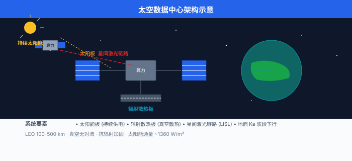
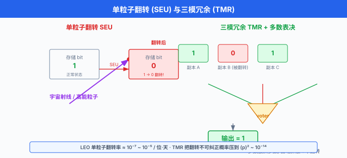
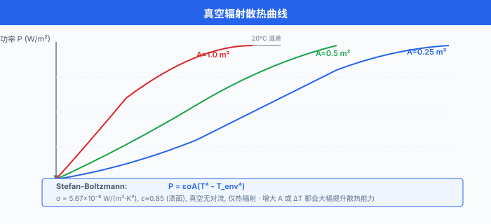

# 太空数据中心

> **一句话总结**: 太空数据中心把算力搬到近地轨道甚至月球, 用持续太阳能与真空辐射散热绕过地面的能耗瓶颈, 同时面临辐射、热管理与光通信的硬约束, 是 AI 基础设施的下一个十年级赌注.

## 🗺️ 本章导览

- 本章覆盖前沿 AI: 量子 ML → 神经形态 → **太空数据中心** (本节) → 去中心化 AI → 脑机接口
- **01. 量子机器学习**: 用量子电路当神经层, 在特定问题上寻经典算法之外的加速
- **02. 神经形态计算**: 脉冲神经网 + 类脑硬件, 主打边缘低功耗
- **03. 太空数据中心** (本节): 把数据中心搬到天上, 用轨道算力跑 AI
- **04. 去中心化 AI**: 联邦学习、加密计算、分布式推理
- **05. 脑机接口**: 让大脑直接与机器对话

*本节为提纲, 原作以 bullet 列出太空数据中心的核心议题, 中文版按同一结构展开每条要点, 并补充商业尝试、技术挑战与未来展望.*

---

## 1. 为什么把数据中心搬上天

过去十年, 训练一个前沿大语言模型 (Large Language Model, LLM) 的算力大约每 6 个月翻一倍, 远超摩尔定律. 一块 Nvidia H100 单卡功耗约 700 W, 一万卡集群瞬时功耗就是 7 MW, 再加上散热与网络设备, 一个超万卡集群园区动辄几十兆瓦 (megawatt, MW), 一座吉瓦 (gigawatt, GW) 级超算中心已被多家头部公司列入长期规划[^iea-data-centres]. 与算力同步膨胀的, 是电力与水. 一份被反复引用的估算称, 到 2030 年全球数据中心耗电可能占到总发电量的 4%~8%[^iea-data-centres]. 训练一次千亿参数级别模型的电费, 已是百万美元量级, 散热用的水冷蒸发也在挑战当地水资源.

这股焦虑把一部分工程师的目光从地面往上抬. 太空看上去是一个"天生冷酷"的算力乐园:

- 能源: 地球同步轨道 (Geostationary Orbit, GEO) 与近地轨道 (Low Earth Orbit, LEO) 上的卫星, 每年接收的太阳辐照度 (solar irradiance) 高达约 1361 W/m² (太阳常数 $S_0$), 而且没有昼夜交替、没有云层遮挡, 一天 24 小时都是"白天". 相比之下, 地面光伏受昼夜、天气、纬度影响, 等效满发小时通常不到 2000 小时/年, 太空光伏能轻松做到 8000+ 小时/年.
- 散热: 太空是近乎完美的真空, 没有空气对流, 只能靠热辐射 (thermal radiation) 把热量散出去. 这看似是限制, 但反过来也意味着——只要表面积够大、温差够高, 散热效率反而非常可观. 一块深色辐射板在 -20°C 表面温度下, 每平方米能稳定散掉约 400 W 热量, 全靠 Stefan-Boltzmann 定律:

$$P = \varepsilon \sigma A (T^4 - T_{\text{space}}^4)$$

其中 $\sigma = 5.67 \times 10^{-8} \, \text{W} \cdot \text{m}^{-2} \cdot \text{K}^{-4}$ 是斯特藩-玻尔兹曼常数, $\varepsilon$ 是表面发射率 (深色涂层可达 0.9+), $T$ 是辐射面温度, $T_{\text{space}} \approx 3 \, \text{K}$ 是深空背景温度.

- 地理: 不需要和城市抢电抢水, 不需要购买或平整土地. 在轨数据中心是"无地皮"基础设施.

这三个理由合起来, 让一些先驱企业开始认真计算: 在天上 1 W 的算力, 到底能不能比地面便宜?

简单做个量级估算, 就能感受到太空能源的"暴击":

- 太空太阳能电池 (三五族砷化镓, GaAs) 光电转换效率约 30%, 1 m² 太阳板在 LEO 上大约能持续输出 1300 × 0.30 ≈ 400 W 电功率. 一颗展开后总太阳板面积 200 m² 的卫星, 就能产生 80 kW 持续电力, 够给一座小型超算供电.
- 同等面积的地面光伏 (效率 22%, 等效满发 1500 小时/年), 年发电约 33 kWh/m²·年, 是太空的不到 1/10. 因为太空是 8760 小时满发.

不过, 太空电力的"账面便宜"还得扣掉发射成本. 一颗 80 kW 量级的卫星, 发射质量通常 5–10 吨, 单次发射报价 5000 万到几亿美元 (取决于运载火箭与轨道). 把这部分折算到 5–10 年的卫星寿命里, 才是真实的"太空电力单价".

另一个被反复讨论的角度是"碳排放与水耗". 一座 100 MW 数据中心, 水冷蒸发损耗在炎热地区可达每日数百万升; 而太空数据中心既不消耗水, 也不直接产生碳排 (发射火箭的碳排另算). 从 ESG (Environmental, Social and Governance) 视角看, 太空算力天生是"绿"的.

---

## 2. 商业尝试: 从概念到飞行硬件

太空数据中心不是科幻. 2021 年以来, 一批小公司先后把概念机、试验载荷送入轨道或登月:

**Lonestar Data Holdings** (美国). 这家佛罗里达创业公司 2022 年发射了一台名为 "Lonestar Independence" 的小型边缘存储载荷, 搭载于 Intuitive Machines 的 Nova-C 着陆器上, 目标是验证"在月球表面存储数据"的可行性. 2024 年他们宣布与多家航天机构合作, 把"月球数据中心"作为灾害备份与离地球数据归档方案推向市场.

**Axiom Space + Kepler Communications** (美国 + 加拿大). Axiom Space 主营国际空间站商业舱段, Kepler Communications 运营 LEO 卫星星座. 两家在 2024 年宣布合作, 把 Kepler 的光通信网络与 Axiom 的在轨计算节点结合, 用于"在轨处理"遥感数据——也就是卫星拍到地球影像后, 不必全部下行到地面, 而是在天上先跑完 AI 推理, 再把结果回传. 这一架构通常被称为"orbital data centre"或"in-orbit computing".

**Ramon.Space** (以色列). 提供"太空原生"的抗辐射计算与存储模块, 单板功耗数百瓦, 已经在多颗商业卫星上装机, 用来做星上信号处理和 AI 推理. 他们把自己定位成"太空版 NVIDIA", 卖的不是整机, 而是计算板.

**Star Cloud** 与 **Lumen Orbit** (美国). 两家更早期的初创公司, 都提出了"兆瓦级在轨计算"愿景: 用数百平方米的太阳能板 + GPU 集群组成一颗"算力卫星", 单星算力目标达到 100 PFLOPS 以上, 相当于一座中型超算中心.

**中国: 星际荣耀 + 九天微星**. 星际荣耀 (iSpace) 在 2023 年成功完成多次双曲线弹道飞行与入轨发射, 具备小型运载能力, 关注方包括星上 AI 推理与边缘计算. 九天微星 (CAS-IX) 是中国科学院微小卫星创新研究院孵化的商业航天公司, 主打低轨物联网与算力星座, 提出过"算力星"概念, 用整星座拼成"天基计算集群". 此外, 之江实验室、曙光信息产业 (Sugon) 等机构也都公开讨论过"星地协同计算"的架构, 把天基算力作为地面算力的延伸.

**还有一类不那么显眼但更接近落地的玩家: 传统卫星运营商**. Inmarsat、Iridium、Telesat 这些老牌卫星公司, 都在 2020 年后悄悄升级载荷——把原本只能做透传的射频 (RF) 处理单元换成能跑 AI 推理的 SoC (System on Chip). 它们没有"数据中心"的标签, 但事实上已经在天上跑着边缘 AI 了.

注意: 上述大多仍是"愿景+早期样机"阶段, 真正能在轨道上跑大模型推理的硬件, 截至 2026 年仍是稀缺品.

---

## 3. 太空的四道难关

把地面数据中心搬上天, 不是换个壳子这么简单. 太空环境给电子设备、热量和通信都出难题.

### 3.1 辐射: 宇宙射线与单粒子翻转

高能宇宙射线 (cosmic rays) 与太阳高能粒子 (Solar Energetic Particles, SEP) 穿过航天器时, 会在半导体里沉积电荷. 一个高能粒子打在 SRAM 单元或触发器上, 就可能把一个 bit 从 0 翻成 1, 或者让一个组合逻辑门产生一个错误脉冲. 这两种现象分别叫做单粒子翻转 (Single Event Upset, SEU) 与单粒子瞬态 (Single Event Transient, SET). 还有更严重的形式: 单粒子闩锁 (Single Event Latchup, SEL) 与单粒子烧毁 (Single Event Burnout, SEB), 这两种会真正"毁掉"器件, 一旦发生必须断电重启.

LEO 上的 SEU 率, 通常用 LET (Linear Energy Transfer, 线性能量转移) 阈值与翻转截面 (cross-section) 描述. 在没有特殊屏蔽的商用 SRAM 上, LEO 高度 (约 400–600 km)、太阳活动低年的 SEU 率约为 $10^{-7}$ ~ $10^{-5}$ 翻转/位·天, 也就是一个 1 Gb 内存每天可能遇到 0.1 到 10 次翻转. 太阳耀斑爆发时, 这个数字还能再翻 10 到 100 倍.

对 AI 芯片来说, 辐射带来的麻烦不只是"几位错了". 大模型推理时, 一旦 KV 缓存里的某个 token 嵌入 (embedding) 被翻成垃圾值, 模型输出就可能突然"胡言乱语", 而且这种错误很难被察觉. 一个朴素的解决思路是冗余: 三模冗余 (Triple Modular Redundancy, TMR) 让三个独立模块跑同一份计算, 投票表决. 这能把错误率从 $p$ 压到大约 $p^2$ 量级, 但代价是功耗 ×3、面积 ×3. 另一个思路是用 ECC 内存、奇偶校验, 在软件层检测并纠正. 但 ECC 只能修一位错, 多位错仍要重算或重启.

传统航天级芯片用 SOI (Silicon On Insulator) 工艺 + 加固单元库, 单价是商用芯片的几百倍. 商业公司更愿意走另一条路: 直接用商用 GPU/CPU, 在系统层加自检与自愈 (self-healing), 通过定期 checkpoint + 上行重传恢复状态. 关键模块用 FPGA 或 ASIC 重做, 容忍 SEU.

可以用一个简化的数学模型来估算 SEU 对训练的影响. 假设训练任务持续时间 $T$ 小时, 整集群共有 $N$ bit 内存参与计算 (NV 显存 + DRAM + 寄存器), 单 bit SEU 率 $\lambda$ (单位: 翻转/位·秒). 整个训练过程期望出错次数为:

$$E_{\text{failures}} = N \cdot \lambda \cdot T \cdot 3600$$

取 $N = 10^{14}$ bit (典型万卡集群), $\lambda = 10^{-12}$ 翻转/位·秒 (LEO 商用 SRAM), $T = 168$ 小时 (一周) 代入:

$$E_{\text{failures}} \approx 10^{14} \times 10^{-12} \times 168 \times 3600 \approx 6 \times 10^{7}$$

也就是一周内有约 6000 万次单 bit 翻转. 这显然不能让裸跑的商用硬件撑过一场训练. 这也是为什么 TMR + ECC + checkpoint 是"太空训练"的标配组合.

### 3.2 热管理: 只能"辐射散热"

地面数据中心的散热主力是风冷与水冷: 把热量传给空气或水, 再排到大气或冷却塔. 太空没空气也没水, 唯一的散热途径是电磁辐射. 这意味着:

- 所有发热器件必须紧贴"辐射板", 通过热管 (heat pipe) 或泵驱两相回路把热量导到外壳.
- 散热功率严格受斯特藩-玻尔兹曼定律支配. 举例: 一块发射率 0.9、表面积 1 m² 的辐射板, 表面温度 80°C (353 K), 深空 3 K, 能散掉的热功率是:

$$P = 0.9 \times 5.67 \times 10^{-8} \times 1 \times (353^4 - 3^4) \approx 0.9 \times 5.67 \times 10^{-8} \times 1.55 \times 10^{10} \approx 790 \, \text{W}$$

换言之, 想在太空散掉 10 kW 热量, 大致需要十几平方米的高发射率辐射板. 这也是为什么有人提议把卫星做成"长条状"或"花瓣状", 把尽可能多的表面暴露在深空里.

真空下, 散热器设计还得避开"温差极限": 一旦表面温度过低 (比如低于 0°C), 散热功率会骤降. 所以太空数据中心的设计目标是让芯片结温 (junction temperature) 稳定在 60–85°C, 既不烧芯片, 又不浪费散热功率.

还有几个常被新手忽视的细节:

- **朝向**: 辐射板必须背对太阳与地球, 否则会"反向吸热". LEO 卫星每 90 分钟绕地球一圈, 散热面得能让出太阳入射的几何.
- **阴影 vs 阳光**: 进入地球阴影的几分钟里, 卫星没有被太阳加热, 散热反而更快. 设计要按"热平衡最差情形"算, 即假设卫星全程阳光直射、辐射板背阳.
- **材料退化**: 高能紫外与等离子轰击会让涂层 (如白漆、二次表面镜) 的 $\varepsilon$ 慢慢下降, 设计寿命 5–10 年的卫星需要做老化补偿.
- **热膨胀**: 太空冷热循环从 +120°C 到 -150°C, 芯片板与结构件热膨胀系数不匹配就会断焊. 用铝碳化硅 (AlSiC) 之类的低膨胀系数封装才能扛住.

一句话总结太空散热的工程难点: 不是散不掉, 而是"散得稳、散得久".

### 3.3 通信: 激光 + 地面站

太空数据中心再强, 也得把结果送回地面. 传统卫星通信用 Ku/Ka 波段射频 (Radio Frequency, RF), 单星下行带宽几百 Mbps 到几 Gbps. 但 RF 频谱拥挤、带宽受限, 已经接近瓶颈.

新一代商业星座 (Starlink V2 Mini 及更新批次) 大量采用激光星间链路 (Laser Inter-Satellite Link, LISL), 卫星之间用近红外激光 (典型波长 1550 nm) 互联, 链路速率可达数十 Gbps, 时延极低. 一颗 Starlink V2 卫星上一般装 3 颗激光终端, 4 颗终端就能在相邻卫星之间组成四面体拓扑, 让数据可以多跳绕过地球遮挡. 用激光的好处还有: 波束窄、抗干扰、不占无线电频谱.

从轨道到地面的最后一段"下行链路" (downlink), 通常仍靠 Ka 波段, 因为大气对射频衰减比对激光小得多 (云雾雨雪对激光衰减很严重). 只有在晴朗的高海拔地面站, 才能用激光直接下行. 因此, 一个完整的"天基算力"系统通常长这样:

- **太空侧**: LEO 星座, 卫星之间用激光互联 (LISL)
- **地面侧**: 多座 Ka 波段地面站 (gateway), 接收下行结果
- **核心算力**: 在星座中的若干节点上运行大模型推理, 处理遥感数据

整个星座的"端到端"带宽, 受最慢的一段瓶颈限制. 一颗卫星每天有约 30 分钟能"看见"任意一座地面站, 因此下行带宽是稀缺资源. 这进一步说明: 太空数据中心的真正价值是"在天上跑完 AI 推理, 把结论 (几个 GB) 而不是原始数据 (几十 TB) 送回地面".

一个简单的链路预算 (link budget) 计算, 展示了激光星间链路为什么值得做. 自由空间损耗 (Free Space Path Loss, FSPL) 在距离 $d$、波长 $\lambda$ 时为:

$$L_{\text{FSPL}} = \left( \frac{4 \pi d}{\lambda} \right)^{2}$$

代入 LEO 邻星距离 $d = 1000 \, \text{km}$, $\lambda = 1550 \, \text{nm}$, 得到:

$$L_{\text{FSPL}} \approx \left( \frac{4 \pi \times 10^{6}}{1.55 \times 10^{-6}} \right)^{2} \approx (8.1 \times 10^{12})^{2} \approx 6.6 \times 10^{25} \quad (\approx 258 \, \text{dB})$$

258 dB 的衰减看起来恐怖, 但激光终端发射功率可以到 1 W 以上, 接收望远镜口径几厘米到十几厘米, 加上波束跟踪精度高, 实际净速率仍能到几十 Gbps. 同样的预算如果改用 Ka 波段 (约 1 cm 波长), FSPL 只多几个 dB, 但带宽 (MHz 量级) 与频谱占用都是问题.

### 3.4 维护: 修不了, 只能自己好

地面数据中心坏了可以派人, 太空数据中心坏了几乎只能自愈 (self-healing). 这要求软硬件系统具备:

- 多模冗余: 三模冗余 (TMR)、双机热备 (active-passive)
- 看门狗 (watchdog) 与自动重启
- 远程上传新模型与配置 (over-the-air update)
- 软件定义故障隔离: 把有问题的模块从集群里踢掉

```python
# 三模冗余投票的最小示例 (TMR voting)
# 三份独立计算, 取多数表决
def tmr_vote(results: list[int]) -> int:
    assert len(results) == 3, "TMR 必须 3 份结果"
    # 容错 1 份错: 取出现次数 >= 2 的值
    counts = {}
    for r in results:
        counts[r] = counts.get(r, 0) + 1
    # 多数票胜出
    return max(counts, key=counts.get)
```

```python
# 在轨 AI 推理的简化数据流 (伪代码)
# 强调: 原始图像不下传, 只回传推理结果
def onboard_pipeline(image_bytes: bytes, model_id: str) -> dict:
    # 1) 解码
    img = decode_image(image_bytes)
    # 2) 预处理
    x = preprocess(img)
    # 3) 推理 (容错执行, 异常重试)
    for attempt in range(3):
        try:
            y = model_registry[model_id].predict(x)
            break
        except SEUError as e:
            log_error("SEU detected, retry", attempt=attempt, err=str(e))
            continue
    # 4) 压缩结果 (KB 级 JSON, 而非 MB 级原图)
    result = {
        "boxes": y.detections,
        "score": y.confidence,
        "model_id": model_id,
    }
    return compress(result, fmt="json+gzip")
```

```python
# 自检 + 自动重启的简化 watch-dog 模式
# 适用于长寿命在轨服务
import time

class OnboardService:
    def __init__(self, name: str):
        self.name = name
        self.healthy = True
        self.last_heartbeat = time.time()

    def heartbeat(self):
        # 周期被外部定时器调用
        self.last_heartbeat = time.time()

    def check(self) -> str:
        # 看门狗主循环
        elapsed = time.time() - self.last_heartbeat
        if elapsed > 30:  # 30 秒无心跳
            log_warn(f"{self.name} unresponsive, restarting")
            self.restart()
            return "restarted"
        return "ok"

    def restart(self):
        # 释放旧资源, 重新初始化
        self.release_resources()
        self.__init__(self.name)
        log_info(f"{self.name} back online")
```

---

## 4. 星链与中国星网: 边缘算力的"前世今生"

说到太空算力, 不能不提两大低轨星座: 美国 SpaceX 的 Starlink 与中国"国网" (GW) 星座.

**Starlink**. 到 2025 年中, 在轨 Starlink 卫星数已超过 7000 颗, 是人类有史以来最大的卫星星座. 它们的主要任务是宽带互联网, 但 SpaceX 同时在每颗 V2 卫星上加装了 AI 推理能力, 用内置 GPU 处理信号路由、流量整形与星间激光拓扑优化. 一些分析认为, Starlink 已经在事实上成为"全球最大的分布式边缘计算平台", 只不过它对外暴露的接口只是"网络", 不是"AI API".

**中国星网 (GW 星座)**. 中国卫星网络集团主导的"国网"计划, 目标部署约 1.3 万颗低轨卫星, 部分将支持星间激光链路与星上计算. 配合"千帆星座" (G60/Qianfan, 由上海垣信卫星主导) 与"银河航天" (Galaxy Space) 等多个国内星座项目, 中国正在快速搭建一张国产低轨宽带 + 算力网络.

边缘计算 (edge computing) 的核心动机是延迟. 在 LEO (高度 400–1200 km), 卫星到地面的单程时延约 1–4 ms, 双向往返约 20 ms 量级, 与地面 5G 网络延迟相当, 比 GEO 卫星 (单程约 250 ms) 快一个数量级. 这意味着:

- 实时遥感分析: 卫星拍到船只、火灾、洪水, 在 100 ms 内完成检测, 把警报送给地面
- 低延迟宽带: 偏远地区游戏、视频会议不再卡顿
- 应急通信: 地面基站毁坏时, 卫星 + 边缘节点临时接管

一个简单的延迟模型是自由空间光程:

$$d_{\text{one-way}} = \frac{h}{c}, \quad t_{\text{RTT}} \approx \frac{2h}{c}$$

其中 $h$ 是轨道高度, $c = 3 \times 10^8 \, \text{m/s}$. 在 $h = 500 \, \text{km}$ 处, $t_{\text{RTT}} \approx 3.3 \, \text{ms}$ (光速极限, 不含路由与处理).

### 4.1 星座 vs 单星: 为什么"集群"比"巨无霸"更现实

直觉上, "一颗算力卫星能跑 100 PFLOPS" 比"100 颗卫星每颗跑 1 PFLOPS" 更省事——少操心组网, 少操心协同. 但工程上, 恰恰是相反:

- **发射约束**: 火箭整流罩直径通常 4–9 米, 单星质量上限 10–15 吨 (Falcon 9 一次性载荷上限). 一颗"100 PFLOPS"卫星需要的散热板 + 太阳能板 + 散热结构, 总质量很容易超 20 吨.
- **单点失效**: 一颗算力卫星一旦失效, 整座数据中心就宕机. 星座则可以容忍若干颗失效, 通过路由重算把任务挪到健康节点.
- **迭代速度**: 卫星硬件换代周期 3–5 年, 单星架构每换代一次就是一次"生死抉择". 星座架构则可以滚动更新——每隔几个月补几颗新卫星, 不必重做整张网.
- **覆盖均匀**: 星座天然在多个时区、多个纬度都有节点, 任何地面用户都能"看到"至少一颗卫星; 单颗 GEO 卫星虽然覆盖广, 但延迟太高, 不适合边缘 AI.

所以现实里, 几乎所有严肃的"天基算力"方案都走星座路线: 把每一颗卫星当作一个边缘节点, 用激光星间链路 + 智能调度, 让整个星座看起来像一台"分布式超算".

### 4.2 边缘计算的杀手锏: 卫星 IoT + 在轨推理

低轨星座 + 边缘 AI 的组合, 还有一个不那么显眼但极其实用的场景: **卫星物联网 (Satellite IoT)**. 远洋货轮、跨境输油管、极地科考站、无人农场——这些场景既没有 4G/5G 覆盖, 也没有稳定供电, 但都需要"低频回传 + 偶尔 AI 推理". 卫星 IoT 模块终端便宜 (几百到几千美元), 配上 LEO 星座 + 在轨 AI 推理, 就能在无人区实现"自动告警" 与"状态摘要".

这也解释了为什么很多卫星运营商开始把 AI 推理作为一项"内置服务"打包给客户——就像云厂商把 GPU 实例打包给开发者一样.

---

## 5. 与 AI 结合: 太空训练的三大场景

把算力搬到太空, 最直接受益的是 AI. 三类场景最值得展开:

### 5.1 训练大模型的候选地

在太空训 LLM, 目前还停留在概念阶段. 表面上的吸引力: 太阳能便宜、没有碳税、数据中心不用水冷. 但现实约束很硬:

- 通信瓶颈: 万卡集群需要每节点 100 Gbps 量级的网络, 在卫星之间搭出同等带宽, 工程上几乎不可能
- 维护: 训练任务持续数周, 期间任何一颗卫星出错都需要自愈, 否则训练报废
- 规模: 即便把"算力卫星"做成 100 PFLOPS 的单星, 也只相当于一座中型地面超算, 比当前万卡集群小几个数量级

更现实的可能性, 是把太空算力用作**预训练后的持续学习** (continual learning) 节点, 或者专门用来训练**遥感大模型**——毕竟训练数据本来就来自太空.

一个粗略的"单位算力成本"比较, 可以帮助理解量级差距. 设:

- 地面数据中心: 100 MW 电力支撑 50 PFLOPS, 电力单价 \$0.05/kWh, 等效满发 8000 小时/年, 硬件寿命 5 年, 折旧 + 电力 + 维护合计约 \$0.10/kWh. 单位算力成本约:

$$c_{\text{ground}} \approx \frac{10^{8} \, \text{W} \times \$0.10/\text{kWh}}{50 \times 10^{15} \, \text{FLOPS}} = 2 \times 10^{-12} \, \text{\$/FLOP}$$

- 太空"算力卫星": 80 kW 电力支撑 100 PFLOPS (极乐观假设), 卫星造价 + 发射按 \$500M 摊到 7 年, 单位算力成本会接近:

$$c_{\text{space}} \approx \frac{\$500\text{M}/7\text{yr}}{10^{17} \, \text{FLOPS}} \approx 7 \times 10^{-11} \, \text{\$/FLOP}$$

注意, 这里把"电力"视为免费 (因为太阳能), 折算下来太空单位算力成本仍比地面高 30 倍以上. 想让太空算力真正便宜, 必须 (a) 把卫星量产到数十颗 (摊薄 NRE, 即一次性工程费用), (b) 让单星算力上 1 EFLOPS (Exa FLOPS, 十亿亿次浮点每秒), (c) 把寿命拉到 10 年以上. 这三个条件短期都还做不到.

### 5.2 遥感数据实时处理 (Earth Observation AI)

这是太空数据中心最被看好的杀手锏. 现代对地观测卫星每天产生 TB 级影像, 全部下行到地面再分析既费时又费钱. 如果卫星上就能跑深度学习模型——比如检测舰船、监测森林砍伐、量化洪水范围——就只需要把"结论" (几个 KB 到几 MB) 回传.

这一波浪潮的代表公司是 **Planet Labs** (美国, 鸽群星座) 与 **Pixxel** (印度, 高光谱星座). 它们已经在用星上 FPGA/SoC 做初筛, 再配合地面 AI 做精细分析. 假以时日, 星上大模型会把这一流程完全搬到天上.

### 5.3 主权 AI (Sovereign AI) 与战略地位

太空数据中心的另一面是**地缘政治**. 谁掌握"在轨算力", 谁就在战时、灾时、外交封锁下拥有不依赖地面互联网的计算与通信能力. 这也是为什么中国、美国、欧盟都在加速部署自己的低轨星座与抗辐射芯片. "主权 AI"这个词最近被频繁使用, 强调"算力即主权"——这与"太空即领土"的逻辑是相通的.

太空数据中心和太空太阳能 (Space-Based Solar Power, SBSP) 也经常被一起讨论. SBSP 的想法是把巨型太阳能板放在 GEO, 收集能量后用微波或激光回传地面; 而太空数据中心则是"在轨直接把能源变成算力, 再把结果回传". 后者省去了"能量转换 + 回传"的损耗, 逻辑上更优雅.

### 5.4 地面 vs 太空: 一张粗略对比表

下表把"地面超算中心"与"太空数据中心"在几个关键维度上做个快照对比, 帮助读者一眼看清差异.

| 维度 | 地面超算中心 | 太空数据中心 |
|---|---|---|
| 能源 | 电网 (化石 + 可再生混合) | 持续太阳能 |
| 冷却 | 风冷 + 水冷 (含蒸发) | 真空辐射散热 |
| 维护 | 可派人维修, 几小时响应 | 不可派人, 必须自愈 |
| 通信 | 高速光纤 (Tbps 量级) | 激光星间 + RF 下行 (Gbps 量级) |
| 单点失效 | 影响有限 (有冗余) | 卫星故障 = 节点丢失 |
| 建设周期 | 1–3 年 | 3–5 年 (含发射) |
| 单位算力成本 | 量级参考 \$2/PLOP | 极乐观约 \$70/PLOP |
| 主要瓶颈 | 电力 + 水 | 散热 + 带宽 + 抗辐射 |
| 监管复杂度 | 中 (环评、能耗审批) | 高 (出口管制、频谱协调) |
| 战略价值 | 商业 + 科研 | 国家安全 + 主权 AI |

注意: "单位算力成本"那一行的数字仅作量级参考, 真实数字因架构、批量、寿命差异巨大. 但量级关系 (太空短期比地面贵一个数量级以上) 是稳定的.

---

## 6. 未来展望: 十年内小规模商业化

把上面所有的可行性拼到一起, 我们可以对未来十年做一个粗略预测:

- **2026–2028**: 单星数十 TOPS (Tera Operations Per Second, 万亿次操作每秒) 量级的星上 AI 推理成为常态, 主要服务遥感与通信负载. 多个国家发射专门的"算力试验星".
- **2028–2032**: 100 PFLOPS (Peta FLOPS, 千万亿次浮点每秒) 量级的"兆瓦级算力卫星"开始出现, 激光星间链路商用, 地面端建成全球 Ka 波段地面站网络. 太空数据中心开始承接商业遥感 AI 与部分科研计算.
- **2032+**: 多星组成的"天基算力云"成为现实, 太空数据中心开始作为地面云的弹性延伸. 但要让 LLM 训练完全跑在太空, 还得等到发射成本进一步下降 (目前约 \$1500–\$3000/kg 到 LEO, SpaceX Starship 目标 \$100/kg 量级) 与星间激光组网带宽再上一个数量级.

2025 年 Google 公开了一项名为 **Project Suncatcher** 的研究提案, 计划用卫星搭载 TPU 集群做太空机器学习, 初步测算认为在太空中训练一个特定规模模型的能耗成本, 可以低于地面. 这类"超大规模 + 在轨算力"的研究, 是判断未来十年趋势的重要风向标.

### 6.1 一个粗糙的"何时商业化"判断框架

与其只凭直觉押时间, 不如列一份"商业化门槛清单", 看看每个条件离"绿灯"还差多远:

- **发射成本**: Falcon 9 重型复用报价约 \$2000–\$3000/kg 到 LEO; Starship 全面复用后, 业界估算 \$100–\$200/kg. 当前约 50% 达成.
- **激光星间链路**: Starlink V2 Mini 已商用, 单跳数十 Gbps, 多跳组网可行. 当前约 70% 达成.
- **抗辐射 GPU**: 多家厂商已发布"空间增强版" GPU 与参考设计; 国产抗辐射 GPGPU 也在多家院所推进. 当前约 50% 达成.
- **星上散热**: 现有热管 + 辐射板可散 1–3 kW; 兆瓦级 (1 MW) 散热仍属研发阶段. 当前约 30% 达成.
- **法规与频谱**: ITU 频谱协调、出口管制 (美国 ITAR、中国军品出口管制) 是非技术门槛, 但近两年进展快. 当前约 60% 达成.

把这些指标简单平均, 整体进度大约 50%——这正是"商业化前夜"的典型状态. 也就是说, 2028–2030 大概率会出现小规模、可商用的太空数据中心业务, 但 LLM 训练级别的算力完全上太空, 还得再等一个产品周期.

### 6.2 留给读者的三个开放问题

- 如果 2035 年太空单位算力成本真的能压到和地面相当, 哪些**地面无法做**的工作会率先上太空? 持续学习的全球科学观测模型? 不间断的暗物质搜索? 全天候气候模拟?
- "主权 AI"如果延伸到"主权算力星座", 国际法 (Outer Space Treaty 1967) 是否需要更新? 在轨算力是"领土"还是"公域"?
- 当一万颗低轨卫星同时运行 AI 模型, 一次太阳风暴可能让所有模型同时输出"胡言乱语"——这是否构成一类新的**系统性 AI 风险**?

### 6.3 给读者的最小动手建议

如果读者读到这一节想自己动手玩一玩, 最低成本的方式不是买卫星 (那要几千万美元起), 而是:

- 用 **Skyfield** 或 **poliastro** 这两个 Python 库, 在自己的笔记本上模拟一颗低轨卫星的轨道, 验证 Stefan-Boltzmann 散热公式与 FSPL 链路预算.
- 找一份公开的 Starlink TLE (Two-Line Element, 两行轨道根数) 文件, 用 STK 或免费的 Gpredict 软件追踪星座, 观察每天的可见窗口.
- 关注 Planet Labs 的开放数据计划, 下载几景 SkySat 影像, 自己在本地跑一遍语义分割, 对比"在地面跑" 与"假如在星上跑"的时延与带宽差异.

成本最低, 但对"为什么太空数据中心值得做"这件事, 是最有效的第一手感受.

### 6.4 进一步阅读与延伸资源

如果想继续深挖, 下面几个方向都值得花一两周时间:

- **热辐射与航天器热控**: 经典教材 *Spacecraft Thermal Control Handbook* (David Gilmore). 它把 Stefan-Boltzmann、热管、两相流体回路讲得非常细, 是太空散热工程必读.
- **抗辐射电子学**: 综述论文 *Radiation Effects on Electronics* 系列 (IEEE Nuclear and Space Radiation Effects Conference, NSREC) 每年更新, 是抗辐射芯片设计的"风向标".
- **激光星间链路**: CCSDS (Consultative Committee for Space Data Systems) 关于 Optical Communications 的标准文档, 描述了 1550 nm 激光链路的协议层与物理层规范.
- **星座运维**: SpaceX 与中国星网都在公开的 FCC / ITU 文件中提交过大量技术参数, 想看真实数字, 直接查这两家的备案文件比博客靠谱得多.
- **AI + 太空**: 除了 Google Project Suncatcher, NASA 在轨 AI 推理项目 (例如 CogniSAT) 也是不错的参考; 国内关注之江实验室、东方空间、星际荣耀的技术披露.

最后, 一句不太严谨但很真实的话作为收尾: 太空数据中心在 2026 年的状态, 大致相当于"2008 年的云计算"——技术原理已经清楚, 工程样板正在搭建, 商业模式还没跑通, 但所有人都在押它会很大. 想入场的工程师与学生, 现在上车可能比 2030 年舒服得多.

而对正在读这一节的你来说, 至少有一件事可以确定: 下一个十年里, "算力" 不再只发生在城市的机房里, 它会同时发生在 500 公里高空的轨道上.

把上面所有的可行性拼到一起, 我们可以对未来十年做一个粗略预测:

- **2026–2028**: 单星数十 TOPS 量级的星上 AI 推理成为常态, 主要服务遥感与通信负载. 多个国家发射专门的"算力试验星".
- **2028–2032**: 100 PFLOPS 量级的"兆瓦级算力卫星"开始出现, 激光星间链路商用, 地面端建成全球 Ka 波段地面站网络. 太空数据中心开始承接商业遥感 AI 与部分科研计算.
- **2032+**: 多星组成的"天基算力云"成为现实, 太空数据中心开始作为地面云的弹性延伸. 但要让 LLM 训练完全跑在太空, 还得等到发射成本进一步下降 (目前约 \$1500–\$3000/kg 到 LEO, SpaceX Starship 目标 \$100/kg 量级) 与星间激光组网带宽再上一个数量级.

2024 年 Google 公开了一项名为 **Project Suncatcher** 的研究提案, 计划用卫星搭载 TPU 集群做太空机器学习, 初步测算认为在太空中训练一个特定规模模型的能耗成本, 可以低于地面. 这类"超大规模 + 在轨算力"的研究, 是判断未来十年趋势的重要风向标.







---

## 📌 本节要点

- **太空数据中心的三大诱因**: 持续太阳能 (无昼夜/天气)、真空辐射散热、不与城市抢资源.
- **商业尝试**: Lonestar (月球存储)、Axiom + Kepler (在轨计算)、Ramon.Space (抗辐射板卡)、Star Cloud / Lumen Orbit (兆瓦级愿景), 中国星际荣耀与九天微星亦有相关布局.
- **辐射挑战**: 宇宙射线引起 SEU/SET, LEO 单粒子翻转率约 $10^{-7}$–$10^{-5}$ / 位·天; 解法包括 TMR、ECC、自检与自愈.
- **热管理**: 真空无对流, 只能靠 Stefan-Boltzmann 热辐射散热; 表面积与温差是核心约束.
- **光通信**: 激光星间链路 (LISL) 是新一代星座标配, 单跳可达数十 Gbps; 地面下行仍主要靠 Ka 波段.
- **维护**: 无法人工维修, 必须三模冗余 + 自愈 + 远程升级.
- **Starlink 与 GW 星座**: 既是宽带网, 也在演化为全球最大边缘计算平台, LEO 端到端延迟约 20 ms 量级.
- **AI 三大场景**: 在轨训练 (远期)、遥感数据实时处理 (近期落地)、主权 AI 与战略算力.
- **十年展望**: 2028 年前星上 AI 推理常态化, 2030 年前后出现 100 PFLOPS 级算力卫星, 完全取代地面训练仍需发射成本与组网带宽进一步突破.

---

## 参考资料

[^iea-data-centres]: IEA, "Data Centres and Data Transmission Networks", Electricity 2024 / 2025 系列报告, 估算全球数据中心与数据网络 2024 年耗电约 415 TWh, 占全球总用电量约 1.5%, 并预测 2030 年前将翻倍至 945 TWh 左右, 是讨论"地面电力瓶颈"最常被引用的来源之一.
[^starlink-lisl]: SpaceX 官方关于 Starlink V2 Mini 卫星的公开资料与历次 Falcon 9 任务说明, 提到 V2 Mini 起搭载 3 颗激光终端, 支持 Gb/s 量级星间链路.
[^google-suncatcher]: Google Research Blog, "An early look at Project Suncatcher" (2025), 公开了一份关于"卫星 + TPU 集群进行太空机器学习"的可行性研究.
[^planet-pixxel]: Planet Labs 与 Pixxel 公司官网及历次公开访谈, 描述其星座如何把 AI 推理下沉到卫星载荷.
[^le-seu-rate]: NASA/ESA 在轨辐照试验 (如 CREAM, ICESat-2) 的公开技术报告, 给出商用 SRAM 在 LEO 太阳极小年的典型 SEU 率区间.