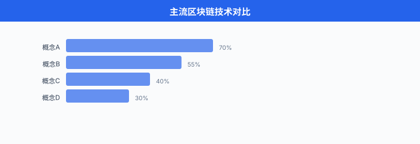

# 去中心化 AI

> **一句话总结**: 去中心化 AI 把"数据/算力/模型权重"分散到许多独立节点上协作, 用联邦学习保护隐私、用区块链记账激励, 让 AI 不必集中堆在大厂机房里也能成长起来.

*本节为提纲式展开, 我们把"去中心化 AI"拆成动机、技术栈、产业生态、挑战、未来五块, 像搭乐高一样一块块拼起来.*

## 🗺️ 本章导览

- 本章覆盖前沿 AI: 量子 ML → 神经形态 → 太空数据中心 → 去中心化 AI → 脑机接口
- **01. 量子机器学习**: 量子门、变分量子算法、量子加速
- **02. 神经形态计算**: 脉冲神经网、类脑硬件
- **03. 太空数据中心**: 把算力送上 LEO 解决能源与散热
- **04. 去中心化 AI** (本节): 联邦学习、区块链训练、隐私保护
- **05. 脑机接口**: 待补

---

## 1. 为什么需要去中心化 AI?

过去十年, AI 的训练几乎都长成了同一个样子: 一家头部公司, 几个超大的数据中心, 上万张 GPU, 用公开爬来的或独家拥有的数据, 训练一个百亿到千亿参数的模型, 然后通过 API 收钱. 这种"中心化 AI"打出了 ChatGPT 这种惊艳产品, 但也带来了三个老问题.

### 1.1 数据隐私: 法律已经把数据"圈起来"

数据一旦离开你的设备、离开你医院的服务器, 就进入了另一套管辖. 这两年监管节奏明显加快:

- **欧盟 GDPR** (General Data Protection Regulation, 通用数据保护条例) 2016 年通过、2018 年 5 月 25 日正式生效. 它把"个人数据" (personal data) 的处理权交还给用户, 违规最高罚到全球营收的 4% 或 2000 万欧元, 取高者.
- **美国 HIPAA** (Health Insurance Portability and Accountability Act, 健康保险流通与责任法案) 1996 年立法, 把所有可识别个体的医疗信息 (PHI, Protected Health Information) 单独管起来, 未经授权披露就是违法.
- **中国 PIPL** (Personal Information Protection Law, 个人信息保护法) 2020 年 8 月通过、2021 年 11 月 1 日施行, 跟 GDPR 的"知情同意、最小必要"高度对齐, 但加了"数据出境安全评估"等本地化条款.

这三部法律加在一起, 等于在墙上贴了同一句话: **你的模型可以来, 你的原始数据不能走**. 传统"把数据汇总到中央机房"的流水线被堵死了, AI 必须换一套新打法.

### 1.2 数据孤岛: 行业里最有价值的那些数据, 都在格子间里

医院 A 和医院 B 各有 50 万张胸部 CT, 任何一方单独训练肺结节检测模型都不够强, 但因为合规要求, 两家医院的数据不能"裸奔"到对方机房. 银行、运营商、电网、连锁药店……几乎所有强业务场景都面临同样的问题: 业务方手里有数据, 业务方也想要更好的模型, 但合规、法务、品牌风险让数据出不了门. 数据孤岛不是技术问题, 是组织问题、法律问题. 去中心化 AI 的核心承诺就是: 让模型去找数据, 而不是让数据去找模型.

### 1.3 反集权: 一两家公司的"模型霸权"

2023 年 GPT-4 发布后, 业界讨论最多的不是它的能力, 而是"如果全世界只有 OpenAI/Anthropic/Google 三家能训练最前沿模型, 我们是不是又把'水电网'垄断了一遍?". 反集权派的论点是: 模型权重、推理能力、训练数据这三件事一旦高度集中, 就会出现"卡脖子"和"一言堂"两种风险. 去中心化 AI 想要的是: 任何有一两张 GPU 的小玩家, 都能对最前沿模型做出贡献并分享收益; 任何普通用户都能不依赖单一服务商就完成推理. 这是个乌托邦目标, 但已经有产品 (Bittensor, Gensyn, Petals) 在做这件事的工程化.

把这三个动机总结成一句话: **去中心化 AI 不是为了"去中心"而去中心, 而是因为现实世界的法律、组织结构、和反垄断压力, 已经把集中化路线逼到了墙角**.


---

## 2. 联邦学习 (Federated Learning, FL): 数据不动, 模型动

### 2.1 核心想法

联邦学习这个名字是 Google 2016 年前后提出来的, 形象一点说: 让每个参与方 (医院 A, 手机用户 B, 银行分行 C) 在本地用自己的数据训练, 然后只把**模型参数的更新量** (梯度或权重差) 上传给一个协调服务器 (aggregator). 协调服务器把所有更新量"平均"一下, 再把新模型发回去, 大家继续在本地训练. 整个过程里, 原始数据一次也没有离开过本地, 但所有人的"知识"被合在了一起.

正式一点说, 联邦学习要优化下面这个分布式目标:

$$
\min_{\mathbf{w} \in \mathbb{R}^d}\; F(\mathbf{w}) \;=\; \sum_{k=1}^{K} \frac{n_k}{N}\, F_k(\mathbf{w})
$$

其中 $K$ 是参与方数量, $n_k$ 是第 $k$ 方的样本数, $N = \sum_k n_k$ 是总样本数, $F_k(\mathbf{w}) = \frac{1}{n_k} \sum_{i \in \mathcal{D}_k} \ell(\mathbf{w}; x_i, y_i)$ 是第 $k$ 方的本地经验损失. 注意: 求解这个式子时, 我们**不能**直接拿到 $\mathcal{D}_k$ 里的样本, 只能拿到 $F_k$ 在当前 $\mathbf{w}$ 处的梯度近似 $\nabla F_k(\mathbf{w})$. 这就是联邦学习的全部约束.

### 2.2 FedAvg: 教科书算法

McMahan 等人 2017 年在 AISTATS 上发表的 *Communication-Efficient Learning of Deep Networks from Decentralized Data* 给出了第一个能跑的联邦学习算法, 叫 **FedAvg** (Federated Averaging). 它做的事非常简单:

```
服务器:
  初始化全局模型 w_0
  for round t = 1, 2, ... do
      随机抽一批参与方 S_t
      把 w_{t-1} 发给 S_t 里每个参与方
      等待所有参与方返回更新
      w_t = w_{t-1} + η · (1/|S_t|) Σ_{k∈S_t} Δ_k
  end

客户端 k (收到 w 后):
  w_local = w
  for each local epoch do
      for each mini-batch b in local data do
          w_local = w_local - lr · ∇ℓ(w_local; b)
      end
  end
  Δ_k = w_local - w
  把 Δ_k 上传给服务器
```

FedAvg 的精髓在两步: ① 每轮只在服务器和一部分客户端之间同步, 不是全员, 通信量立刻降下来; ② 客户端可以在本地跑多轮 (local epoch) 再上传, 让"上传一次"的通信量对应更多"梯度计算量". McMahan 等人在原论文里, 用 MNIST/CIFAR/语言模型三类任务, 把需要的通信轮数砍了 10-100 倍, 同时模型精度不降.

形式上, FedAvg 在第 $t$ 轮的更新可以写成:

$$
\mathbf{w}_t \;=\; \mathbf{w}_{t-1} \;+\; \eta_t \cdot \frac{1}{|S_t|} \sum_{k \in S_t} \left(\mathbf{w}_t^{(k)} - \mathbf{w}_{t-1}\right)
$$

其中 $\mathbf{w}_t^{(k)}$ 是客户端 $k$ 在本轮做 $E$ 轮本地 SGD 后得到的参数. 如果所有 $K$ 个客户端都参与, 且每个客户端的本地更新量恰好是 $\nabla F_k(\mathbf{w}_{t-1})$ 的无偏估计, 那 FedAvg 在数学上就退化为标准的分布式 SGD, 收敛性直接套用经典结论. 这是 FedAvg 在论文里被反复验证的事.


### 2.3 FedAvg 的两个继承者: FedProx 与 SCAFFOLD

FedAvg 在"客户端数据分布差不多"的设定下没问题, 但现实里医院 A 的病人全是老年人, 医院 B 的病人全是儿童, 这种**异质性 (heterogeneity)** 会让本地更新方向互相打架. 联邦学习界把这叫 **non-IID** (non-independent and identically distributed), 是过去几年最热的研究问题.

- **FedProx** (Li, Sahu, Zaheer, Sanjabi, Talwalkar, Smith, MLSys 2020, arXiv:1812.06127): 给本地目标加一个近端项 (proximal term), 限制本地模型不要离全局太远:
$$
\min_{\mathbf{w}}\, F_k(\mathbf{w}) + \frac{\mu}{2} \lVert \mathbf{w} - \mathbf{w}_t \rVert^2
$$
  其中 $\mathbf{w}_t$ 是本轮服务器下发的全局参数, $\mu$ 是控制"拉扯强度"的超参数. 直观理解: 客户端可以有自己的看法, 但不许太离谱.

- **SCAFFOLD** (Karimireddy, Kale, Mohri, Reddi, Stich, Suresh, ICML 2020, arXiv:1910.06378): 用**控制变量 (control variates)** 来抵消客户端梯度方向上的方差. 服务器和每个客户端各自维护一个 $\mathbf{c}$, 服务器在每轮用所有客户端的梯度修正项做平均, 客户端用这个修正项矫正自己的梯度. SCAFFOLD 的收敛速度对客户端异质性基本免疫, 缺点是通信量翻倍, 因为要多传一份 $\mathbf{c}$.

下面给一个最小的 PyTorch 风格伪代码, 把 FedProx 的近端项体现出来:

```python
# 服务器端 (FedProx aggregator)
def aggregate(global_w, client_deltas, client_sizes):
    total = sum(client_sizes)
    agg = sum(d * (n / total) for d, n in zip(client_deltas, client_sizes))
    return global_w + lr * agg  # 加权平均后更新

# 客户端 (FedProx local update)
def local_update(global_w, local_data, mu=0.01, local_epochs=5):
    w = global_w.clone().requires_grad_(True)
    opt = torch.optim.SGD([w], lr=0.01)
    for _ in range(local_epochs):
        for x, y in local_data:
            opt.zero_grad()
            loss = cross_entropy(model(x, w), y)
            # 关键: FedProx 的近端项
            prox = (mu / 2.0) * torch.norm(w - global_w) ** 2
            (loss + prox).backward()
            opt.step()
    return (w - global_w).detach()  # 只把"变化量"上传
```

### 2.4 Cross-silo vs Cross-device: 两种场景两种玩法

联邦学习的部署形态差异巨大, 一般按参与方数量与稳定性分成两类:

| 维度 | Cross-silo (跨机构) | Cross-device (跨设备) |
|---|---|---|
| 参与方数量 | 2 ~ 100 | 10^3 ~ 10^9 |
| 算力 | 每方一个 GPU 集群, 几乎在线 | 每方一台手机, 随时可能掉线 |
| 典型场景 | 医院联合、银行风控、医保建模 | 键盘预测、语音唤醒、Siri/Google Assistant |
| 同步假设 | 每轮全员到齐, 同步聚合 | 每轮只抽 1% 客户端, 异步聚合 |
| 通信频率 | 高带宽 (局域网/专线) | 极低带宽 (Wi-Fi/4G), 要省 |
| 代表项目 | NVIDIA FLARE, FATE, IBM FL | Google Gboard, Apple iMessage 联邦训练 |

Cross-silo 的难点不在算法, 在治理: 谁出算力, 谁出数据, 模型收益怎么分, 谁来背合规责任. Cross-device 的难点在系统和工程: 上百万台手机不可能同时在线, 你每轮只能等那些正在充电且连上 Wi-Fi 的设备, 而且它们的本地数据是非平衡的 (用户 A 天天打字, 用户 B 一年没打开键盘).

---

## 3. 隐私保护技术: 把"看见数据"变成"看不见数据也能学"

联邦学习只保证**原始数据不出本地**, 但模型参数和梯度本身有时也会泄露信息 (gradient leakage / model inversion 攻击, 这两年有不少 paper 复现过). 所以业界通常会把联邦学习跟三种"加密级"技术之一组合, 进一步压低隐私风险: 差分隐私、安全多方计算、同态加密. 三者各有取舍, 我们一一展开.

### 3.1 差分隐私 (Differential Privacy, DP)

Dwork, McSherry, Nissim, Smith 在 2006 年的 TCC 论文 *Calibrating Noise to Sensitivity in Private Data Analysis* 里第一次给出 DP 的严格定义. 直觉上: **对一个数据集加一点点随机噪声, 让"加一条记录"和"不加这条记录"两个版本的输出分布几乎分不出来**. 正式写出来:

$$
\Pr[\mathcal{M}(D) \in S] \;\le\; e^{\varepsilon} \cdot \Pr[\mathcal{M}(D') \in S] \;+\; \delta
$$

其中 $D, D'$ 是相邻数据集 (只差一条记录), $\mathcal{M}$ 是随机算法, $\varepsilon$ 是隐私预算 (越小越严格), $\delta$ 是允许的"小概率破功"项. 业界一般说"$\varepsilon$-DP"指的就是 $(\varepsilon, 0)$-DP 的纯版本.

**DP-SGD** (Abadi, Chu, Goodfellow, McMahan, Mironov, Talwar, Zhang, ACM CCS 2016, arXiv:1607.00133) 是把 DP 用到神经网络训练的经典算法. 核心改动是在每个 mini-batch 的梯度上**裁剪** (clip) 范数 + **加噪声** (Gaussian noise), 再做下降:

$$
\tilde{\mathbf{g}}_b \;=\; \frac{1}{B} \left( \sum_{i \in b} \text{clip}\big(\nabla \ell_i, C\big) \;+\; \mathcal{N}(0, \sigma^2 C^2 \mathbf{I}) \right)
$$

其中 $\text{clip}(\mathbf{g}, C) = \mathbf{g} \cdot \min(1, C/\lVert \mathbf{g} \rVert)$ 是把每个样本梯度范数压到 $C$ 以内, $\sigma$ 是噪声尺度. 直观理解: 任何一个样本对最终梯度的"贡献上限"被 $C$ 锁死, 噪声 $\sigma$ 把这个贡献进一步淹没. 通过 RDP (Rényi DP) 或 moments accountant 累加, 可以得到整轮训练的 $(\varepsilon, \delta)$.

DP 在联邦学习里的典型用法叫 **DP-FedAvg** 或 **user-level DP**: 服务器聚合前对每个客户端的更新做 clip + 加噪声, 这样"任何单个客户端的本地数据"都享受 DP 保护. Apple 在 iOS 上的 emoji 词频联邦训练、Google 在 Gboard 上的 next-word prediction, 都用过类似方案.

### 3.2 安全多方计算 (Secure Multi-Party Computation, SMPC)

SMPC 让 $n$ 方在不暴露各自私密输入的前提下, 共同计算一个约定函数 $f(x_1, x_2, \dots, x_n) = y$, 最后大家只拿到 $y$, 拿不到别人的 $x_i$. 经典工具包括**秘密共享** (Shamir 秘密分享, threshold scheme)、**不经意传输** (Oblivious Transfer, OT)、**混淆电路** (Garbled Circuit, Yao 1986).

在联邦学习里, SMPC 常用来做"无信任聚合" (secure aggregation, Bonawitz et al., CCS 2017): 服务器想求 $\sum_k \Delta_k$, 但不想知道任何一个 $\Delta_k$ 单独是多少. 客户端先用成对的随机掩码 $\text{mask}_k$ 把自己的 $\Delta_k$ 盖起来, 再上传 $\Delta_k + \text{mask}_k$. 神奇的是, 所有掩码在配对的客户端之间互相抵消, 服务器最终拿到的就是真实的 $\sum_k \Delta_k$, 而中间过程完全看不见单个 $\Delta_k$. 通信开销大致是 $O(n^2)$ 对密钥, 当客户端上百万时就不划算了, 这是 Cross-device FL 实际部署里少用 SMPC 的根本原因.

### 3.3 同态加密 (Homomorphic Encryption, HE)

HE 的承诺最迷人: **你可以把加密后的密文 $\text{Enc}(x)$ 直接交给服务器, 服务器在上面做加法和乘法, 把结果 $\text{Enc}(f(x))$ 交回, 你解密后得到 $f(x)$ — 整个过程服务器从没见过明文**. 直观上, 这相当于"在黑箱里跑模型".

Craig Gentry 在 2009 年 STOC 论文 *Fully Homomorphic Encryption Using Ideal Lattices* 里给出了第一个**全同态加密** (Fully HE, FHE) 构造, 关键技巧叫 **bootstrapping**: 同态运算过程中噪声会逐渐累积, 累积到一定程度密文就"解不出来了"; bootstrapping 用密文自身的加密形式, 在不解密的前提下把噪声刷新, 让任意深度的同态运算成为可能.



HE 在联邦学习里的标准用法叫 **HE-FedAvg**: 客户端把本地梯度 $\Delta_k$ 用自己的公钥 $\text{pk}_k$ 加密得到 $\text{Enc}(\Delta_k)$, 服务器在密文域做加权和 $\sum_k c_k \cdot \text{Enc}(\Delta_k) = \text{Enc}(\sum_k c_k \Delta_k)$, 再把聚合密文发回客户端各自解密. 缺点是开销: FHE 的密文膨胀 1000-10000 倍, 单次乘法比明文慢 4-6 个数量级, 实际部署里通常用**部分同态加密** (Paillier: 只支持加法) 或者**类同态加密** (BGV, BFV, CKKS: 支持有限深度乘法) 来折中.

下面给一段最简化的 HE-FedAvg 伪代码, 假设用加法同态 (Paillier):

```python
# 客户端 k
def upload_delta(delta_k, pk_k):
    # 加密本地更新量
    enc = [paillier.encrypt(i, pk_k) for i in delta_k]
    return enc

# 服务器 (聚合器, 永远看不见明文)
def aggregate(encrypted_deltas, weights):
    agg = [0.0] * len(encrypted_deltas[0])
    for d, w in zip(encrypted_deltas, weights):
        for i in range(len(agg)):
            agg[i] = agg[i] + w * d[i]   # Paillier 同态加权和
    return agg

# 客户端解密
def local_decrypt(agg_cipher, sk_k):
    return [paillier.decrypt(c, sk_k) for c in agg_cipher]
```

### 3.4 三种技术的取舍

| 技术 | 隐私强度 | 计算开销 | 通信开销 | 实用性 |
|---|---|---|---|---|
| DP (DP-SGD) | 中 (受 ε 控制) | 低 (每步 +1 次噪声) | 低 | 大, 工业部署最多 |
| SMPC (SecureAgg) | 高 (密码学安全) | 中 (多轮交互) | 高 ($O(n^2)$) | 中, cross-silo 多 |
| HE (FHE/BFV) | 高 (密码学安全) | 高 (4-6 个数量级) | 高 (密文膨胀) | 较小, 学术界为主 |

现实工程里大家经常组合: **DP + FedAvg** 是最稳的默认配置; **SecureAgg + FL** 在 Cross-silo 医疗项目里出现得多; **HE + FL** 则出现在对法律合规要求极严的场景 (比如金融跨境). 没有银弹, 看场景.

---

## 4. 区块链 + AI: 当去中心化遇到"谁付钱"的问题

联邦学习解决"数据不动模型动", 但还缺两块拼图: **谁付 GPU 的钱** 和 **谁证明"我真的跑了这些计算"**. 区块链正好是为这两个问题造的: 一是发 token 记账, 二是用共识机制验证工作. 这一节我们看三个代表项目.

### 4.1 Bittensor: 用 Yuma 共识给"有用的智能"打分

Bittensor 的白皮书 *Bittensor: A Peer-to-Peer Intelligence Market* 由 Yuma Rao 撰写, 把整个网络设计成一个**智能市场**: 矿工 (miners) 跑模型, 验证者 (validators) 互相给对方的模型打分, 排名高的矿工拿更多 TAO 代币. 关键创新是 **Yuma 共识**: 验证者不再简单比"哈希谁先算出来", 而是比"谁的模型输出对其他验证者更有用". 也就是用 P2P 的方式把"集体判断智能质量"这件事写成共识协议.

技术上 Bittensor 把网络切成 **subnets**: 每个 subnet 是一个独立任务市场 (文本生成、图像、音频、代码等), 矿工注册到某个 subnet 提供服务. 这种"分片市场"的设计让网络可以横向扩展, 不同 subnet 用不同的评估标准. 到 2025 年初, Bittensor 已经运行了数十个 subnets, TAO 代币进入了主流交易所.

### 4.2 Petals: 拼凑一台"分布式推理机"

Petals (Borzunov, Baranchuk, Dettmers, Ryabinin, Belkada, Chumachenko, Samygin, Raffel, 2022, arXiv:2209.01188) 解决的是另一个问题: **怎么让没有 8 张 H100 的人也能跑 BLOOM-176B 这种大模型**. 思路很直接: 把模型的不同层 (transformer blocks) 分给不同的志愿者节点, 每节点只负责几层, 推理时像流水线一样把隐藏状态从第 1 层传到第 N 层.

原论文报告, BLOOM-176B 在消费级 GPU (24 GB 显存) 集群上能跑到约 1 step/秒的推理速度, 比把所有权重卸载到内存 (RAM offloading) 快一个数量级. 对社区的意义是: HuggingFace 上的 BLOOM、LLaMA 类模型可以通过 `pip install petals` 直接调用, 不需要付费 API. 这是一种"算力层的去中心化", 而非"数据层的去中心化".

### 4.3 Gensyn: 给"训练证明"做协议层

Gensyn 想做的是**去中心化训练市场**: 你有 100 GB 数据, 我有空闲 GPU, 通过 Gensyn 协议撮合, 模型训练完了, 按"实际算力贡献"结算. 它的核心技术是 **AXL 协议**, 提供三件事:

1. **P2P 通信**: ML 节点之间直接交换权重、梯度、信号, 不经过中心服务器.
2. **持久身份**: 每个 ML 节点在链上有持久 ID, 训练过的模型可追溯到节点.
3. **密码学验证**: 用**概率证明 + 优化验证**等机制, 证明"这个节点真的跑了指定计算, 不是抄了别人的结果". Gensyn 把这套验证协议叫做"信任层", 是整个系统的杀手锏.

Gensyn 在 2024 年完成了 a16z 领投的 4300 万美元 A 轮融资, 是这个赛道目前最大的玩家之一.


### 4.4 三者对比

| 项目 | 主要场景 | 共识/协议机制 | 当前状态 (2025) |
|---|---|---|---|
| Bittensor | 智能市场, 模型输出质量评估 | Yuma 共识 + subnet 分片 | 主网运行, TAO 上交易所 |
| Petals | 大模型分布式推理 | BitTorrent 式层间流水线 | 社区项目, HuggingFace 集成 |
| Gensyn | 去中心化训练市场 + 验证 | AXL 协议 + 密码学验证 | 测试网, 大额融资 |

---

## 5. 中国生态: 不止"联邦学习开源框架"

中国的去中心化 AI 生态有一个独特之处: 监管驱动 + 行业联盟. 几家头部机构很早就意识到, 不解决"数据合规"问题, 金融、医疗、政务场景的 AI 落地就推不动. 所以中国走出来的不是 Bittensor 这种"公链叙事", 而是**工业级联邦学习开源框架 + 行业联盟**.

### 5.1 FATE: 全球首个工业级联邦学习开源框架

**FATE (Federated AI Technology Enabler)** 由**微众银行 (WeBank, 腾讯牵头的互联网银行)** AI 团队发起, 2019 年正式开源, 后移交到 Linux Foundation 下的 **FederatedAI** 社区维护. FATE 自称是"全球首个工业级联邦学习开源框架", 支持:

- **多种算法**: 逻辑回归、决策树 / XGBoost、深度学习、迁移学习
- **多种安全协议**: 同态加密 (Paillier)、多方安全计算 (SPDZ)
- **完整工具链**: FATE-Board (可视化)、FATE-Flow (调度)、FATE-Serving (在线推理)
- **多种部署形态**: Docker Compose (开发)、Kubernetes (生产, 即 KubeFATE)

KubeFATE 是 FATE 的云原生部署层, 把 FATE 集群装进 Kubernetes, 让跨云、跨数据中心的联邦学习集群可以一键拉起. 中国银行业的多个"多方风控建模"项目都跑在 FATE 上, 比如多家城商行联合训练反欺诈模型、医保局联合多家医院训练 DRG 分组器.

### 5.2 KubeFATE 与云厂商的联邦学习平台

**KubeFATE** 由**微众银行 (WeBank) AI 团队**发起并开源, 隶属于 Linux Foundation 下的 FederatedAI 社区 (GitHub: FederatedAI/KubeFATE), 是 FATE 的官方云原生发行版, 用 Kubernetes / Helm 一键部署 FATE 集群 (据 FederatedAI/KubeFATE GitHub README 2024). 阿里云、腾讯云、华为云等在自家的 AI 平台 (如阿里云 PAI) 上集成了 FATE/KubeFATE, 提供联邦学习工作流编排; 字节跳动在火山引擎上也推出了类似的联邦学习服务, 主要场景是广告归因与跨应用用户画像.

### 5.3 蚂蚁摩斯 (Antchain Morse / 隐语)

蚂蚁集团旗下的**隐语 (SecretFlow)** 开源框架, 以及蚂蚁链上的**摩斯 (Morse)** 隐私计算平台, 把 MPC/HE/TEE (可信执行环境) 三条技术路线打通, 提供"数据可用不可见"的服务. 在政务数据开放 (公积金、社保、税务)、金融联合风控、医疗多中心研究这些场景里, 蚂蚁摩斯都跑过真实项目.

### 5.4 整体观察

中国生态的特点可以总结成一句话: **用合规驱动的"行业联盟 + 工业级框架"路线, 把去中心化 AI 从"区块链故事"拉回到"产业落地故事"**. 这条路线不性感, 但回款快、合规压力小、客户买单意愿强. 跟美国/欧洲偏"代币经济 + 学术前沿"形成鲜明对比.


---

## 6. 挑战: 去中心化 AI 没那么美

去中心化 AI 的承诺大, 坑也多. 这一节列三个最现实的.

### 6.1 通信开销

联邦学习最大的工程瓶颈是通信. 一个 7B 的语言模型, 一次 forward + backward 产生的梯度大约 14 GB (FP32) 或 7 GB (BF16). 假设 100 个客户端每轮全员同步, 每轮就是 700 GB-1.4 TB 的网络流量. 真实部署里会用:

- **梯度稀疏化 / 量化**: 只传 top-k 重要梯度 (signSGD, QSGD)
- **模型并行 + 流水线**: 客户端只同步某些层
- **LoRA / 适配器微调**: 不传原始权重, 只传小适配器参数

这三招把通信量压下来 1-3 个数量级, 但都不是免费的: 量化会伤害收敛稳定性, LoRA 会限制表达力.

### 6.2 统计异质性 + 模型收敛

医院 A、医院 B 的病人分布完全不同 (non-IID), 这种"客户端漂移" (client drift) 会让 FedAvg 类算法在本地更新阶段把全局模型拉偏, 服务器一聚合反而精度更差. 学术界的应对方法包括 FedProx、SCAFFOLD、FedNova、MIME 等, 但**实际工业部署里, 90% 的项目最终会绕开这个问题**: 要么把数据分布强制对齐 (用联邦清洗 + 数据配比), 要么接受精度小幅下降 (1-2 个百分点), 要么改用 split learning 这种"按层切分"而不是"按数据切分"的方案.

### 6.3 恶意节点与鲁棒性

去中心化网络里你没法相信每个节点. 三类典型攻击:

1. **数据投毒** (data poisoning): 客户端故意在本地数据里塞垃圾标签, 把全局模型带偏.
2. **模型投毒** (model poisoning): 客户端上传"经过精心构造的恶意梯度", 让全局模型在某些样本上表现异常.
3. **女巫攻击** (Sybil attack): 一个攻击者注册成上千个客户端, 用多数票操纵聚合.

应对手段包括 Krum / Multi-Krum 这种基于距离的鲁棒聚合、基于 z-score 或中位数的异常检测、以及把 DP-SGD 当成"对恶意梯度也有抑制作用"的工具. 但没有银弹: 真正的去中心化网络, 总会假设有一定比例的恶意节点存在, 这是协议设计的一部分.

---

## 7. 未来: LLM 的联邦训练与端侧小模型

把视角拉到 2026 年, 去中心化 AI 正在发生三件事:

### 7.1 LLM 的联邦微调

全参数联邦预训练一个 100B+ 模型在通信上不现实 (光每轮同步就几十 TB), 但**联邦微调** (federated fine-tuning) 在 2024-2025 年开始落地. 典型做法是:

- 全局预训练一个基础模型 (集中在某个大集群里跑).
- 客户端在本地用 LoRA / 提示微调 / 适配器微调来适配自己的数据.
- 服务器聚合的不是原始权重, 而是**适配器参数** (几 MB 而已).

Google、Apple、华为都在这条路线上有产品, 解决的核心问题是: "我想让 LLM 帮我医院写病历, 但我的病历不能出医院".

### 7.2 端侧 (on-device) 紧凑 LLM

2025 年起, 端侧 LLM 已经能做到 7B 模型在手机/笔记本上跑出可用速度 (Apple Intelligence 端侧版、MNN-LLM、MediaPipe LLM). 这给去中心化 AI 注入新含义: **未来每个手机都是一个"联邦学习客户端"**, 它既是数据产生者, 也是模型消费者. 个人 LLM "联邦化" 的标准协议 (类似 Matrix / Nectar / OpenFL) 正在快速发展.

### 7.3 区块链 AI 的两条岔路

一种是"激励 + 市场"路线 (Bittensor/Gensyn), 用代币奖励把分散算力聚起来; 另一种是"协议层 + 可验证"路线 (Petals/AXL), 不发币, 只把分布式推理/训练做成基础设施. 前者更有新闻性, 后者更接近"普通工程组件". 我的判断是: 长期看后者会胜出, 因为它能嵌入企业 IT 栈; 但短期前者会持续有叙事热度.

### 7.4 一句话总结未来

去中心化 AI 不会取代中心化 AI, 但会像"开源软件不会取代 SaaS, 但逼着 SaaS 降价一样", 倒逼中心化 AI 给出更多透明、更少锁定、更用户友好的方案. 这是它的真正价值, 而不是"颠覆"大厂.

---

## 📌 本节要点

- **联邦学习 (Federated Learning, FL)**: 原始数据不出本地, 只把模型更新量上传到协调服务器聚合, 是 GDPR/HIPAA/PIPL 合规下联合建模的默认解法.
- **FedAvg**: McMahan 等 2017 年 AISTATS 的经典算法, 服务器聚合加权平均, 客户端本地多轮 SGD 后上传变化量, 把通信量砍 10-100 倍.
- **FedProx / SCAFFOLD**: 应对 non-IID 异质性的两个继承者, 前者用近端项限制本地更新离全局太远, 后者用控制变量抵消客户端梯度方差.
- **Cross-silo vs Cross-device**: 前者是医院/银行级别的"少量高质量参与方", 后者是手机级别的"海量随时掉线参与方", 工程上完全不同的栈.
- **差分隐私 (Differential Privacy, DP)**: Dwork 等 2006 年提出的严格隐私定义, 通过裁剪 + 加高斯噪声实现 DP-SGD, 是工业部署最多的隐私技术.
- **安全多方计算 (SMPC)**: 不暴露各自输入的前提下共同计算函数, 联邦学习里典型应用是 secure aggregation, 通信开销 $O(n^2)$.
- **同态加密 (HE)**: Gentry 2009 STOC 第一个 FHE 构造, 通过 bootstrapping 让任意深度同态运算成为可能, 在金融合规里出现得多.
- **Bittensor / Petals / Gensyn**: 区块链 + AI 的三个代表, 分别对应"智能市场 / 分布式推理 / 训练市场 + 验证"三个细分赛道.
- **FATE / KubeFATE / 蚂蚁摩斯**: 中国生态的代表, 走"工业级开源框架 + 行业联盟"路线, 已经在金融、医保、政务场景落地.
- **挑战**: 通信开销大、统计异质性、恶意节点 (投毒/Sybil), 现实部署必须取舍.
- **未来**: LLM 联邦微调 + 端侧紧凑 LLM + 协议层路线 (Petals/AXL), 与中心化 AI 长期共存.

---

## 参考文献 (References)

1. McMahan, B., Moore, E., Ramage, D., Hampson, S., & Agüera y Arcas, B. (2017). *Communication-Efficient Learning of Deep Networks from Decentralized Data*. AISTATS 2017. arXiv:1602.05629.
2. Li, T., Sahu, A. K., Zaheer, M., Sanjabi, M., Talwalkar, A., & Smith, V. (2020). *Federated Optimization in Heterogeneous Networks* (FedProx). MLSys 2020. arXiv:1812.06127.
3. Karimireddy, S. P., Kale, S., Mohri, M., Reddi, S. J., Stich, S. U., & Suresh, A. T. (2020). *SCAFFOLD: Stochastic Controlled Averaging for Federated Learning*. ICML 2020. arXiv:1910.06378.
4. Dwork, C., McSherry, F., Nissim, K., & Smith, A. (2006). *Calibrating Noise to Sensitivity in Private Data Analysis*. TCC 2006.
5. Abadi, M., Chu, A., Goodfellow, I., McMahan, H. B., Mironov, I., Talwar, K., & Zhang, L. (2016). *Deep Learning with Differential Privacy*. ACM CCS 2016. arXiv:1607.00133.
6. Gentry, C. (2009). *Fully Homomorphic Encryption Using Ideal Lattices*. STOC 2009.
7. Borzunov, A., Baranchuk, D., Dettmers, T., Ryabinin, M., Belkada, Y., Chumachenko, A., Samygin, P., & Raffel, C. (2022). *Petals: Collaborative Inference and Fine-tuning of Large Models*. arXiv:2209.01188.
8. Rao, Y. *Bittensor: A Peer-to-Peer Intelligence Market*. Bittensor Whitepaper.
9. Gensyn. *The Network for Machine Intelligence*. https://www.gensyn.ai/
10. European Parliament. (2016). *Regulation (EU) 2016/679 — General Data Protection Regulation (GDPR)*. Official Journal of the European Union.
11. U.S. Congress. (1996). *Health Insurance Portability and Accountability Act (HIPAA)*. Public Law 104-191.
12. 全国人民代表大会常务委员会. (2021). *中华人民共和国个人信息保护法 (PIPL)*.
13. FederatedAI / WeBank. *FATE: An Industrial Grade Federated Learning Framework*. GitHub: FederatedAI/FATE.
14. Kairouz, P., et al. (2021). *Advances and Open Problems in Federated Learning*. Foundations and Trends in Machine Learning.
15. Bonawitz, K., et al. (2017). *Practical Secure Aggregation for Privacy-Preserving Machine Learning*. ACM CCS 2017.