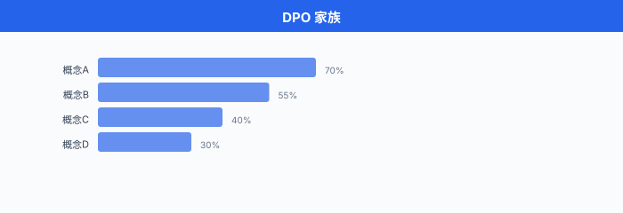

# 从人类反馈中学习 · RLHF/DPO 深入

> **一句话总结**: 把"人类觉得哪个回答更好"这件模糊的事翻译成可优化的数学目标, RLHF 走三步流水线, DPO 用一行 loss 直接砍掉奖励模型, IPO/KTO 再从不同角度修补它们的失败模式.

*上一节把对齐的病灶掰开了讲: 我们能写下的目标, 从来配不上心里真正想要的目标. 这一节我们看第一条也是最主流的一条工程解药 —— 从人类反馈里学. 数学上它是一场"用偏好对逼近效用函数"的游戏, 工程上它是一根挂着无数陷阱的钢丝.*

- 第 07 章第 05 节我们已经把 RLHF (Reinforcement Learning from Human Feedback, RLHF) 三步流水线和 DPO (Direct Preference Optimization, DPO) 的 loss 形状扫过一遍. 那里的目标是"知道有这个东西", 本节的目标是"知道它为什么长这样, 什么时候会坏, 怎么修". 我们从头把公式再推一遍, 但每一步都停下来问: 这一步凭什么这么写, 换一种写法会怎样.

## 为什么是偏好, 而不是打分

- 一个自然的想法是让人类给回答**打分** (1-10 分), 然后监督学一个回归模型去拟合分数. 早期研究试过, 效果很糟.

- 原因有三条. 第一, **打分的绝对值不稳定**. 同一个标注员今天心情好打 8 分, 明天心情差同样回答打 6 分, 训练信号里全是噪声. 第二, **不同标注员的量表不一致**. 你的 7 分可能是我的 5 分, 平均之后信号进一步稀释. 第三, **打分对长度和格式高度敏感**, 而不是内容质量.

- Christiano 等人在 2017 年的经典论文 *Deep Reinforcement Learning from Human Preferences* 里给出了主流答案: 别让人打分, **让人两两比较**. 比较是相对的, 比绝对量表稳定得多. "A 比 B 好"这个信号比"A 是 7 分"这个信号更容易被不同人一致给出.

- 但比较信号也丢了信息 —— 我们不知道 A 比 B 好**多少**. 好在有一个经典的统计模型能从两两比较**重建**一个隐含的分数尺度, 那就是 Bradley-Terry.

## Bradley-Terry: 从比较到隐含分数

- Bradley-Terry 模型 (Bradley & Terry, 1952) 假设: 每个候选 $y$ 在提示 $x$ 下都有一个隐含的**奖励分数** $r(x, y) \in \mathbb{R}$, 而人类比较服从一个 logit 形式:

$$P(y_w \succ y_l \mid x) = \sigma\big(r(x, y_w) - r(x, y_l)\big) = \frac{\exp(r(x, y_w))}{\exp(r(x, y_w)) + \exp(r(x, y_l))}$$

- $y_w$ ("winner") 是被偏好的回答, $y_l$ ("loser") 是没被偏好的. $\sigma$ 是 Sigmoid. 这个式子说: 两个回答分数差 $\Delta r = r(x, y_w) - r(x, y_l)$ 越大, 偏好 $y_w$ 的概率越接近 1.

- Bradley-Terry 有几个漂亮性质. 首先, 它是 **平移不变的**: 把所有 $r(x, y)$ 加上一个只依赖 $x$ 的常数, 差 $\Delta r$ 不变, 偏好概率也不变. 这意味着从偏好数据学出的奖励**只在同一提示内部有意义**, 绝对值不可比较. 第二, 它是 **尺度敏感的**: 把 $r$ 整体乘以 $\alpha$, 偏好概率会变得更极端 ($\alpha > 1$) 或更接近 0.5 ($\alpha < 1$). $\alpha$ 有点像温度倒数.

- Bradley-Terry 有一个更聪明的推广叫 **Plackett-Luce**, 处理 $k$ 个候选的排名 (不止两两比较). 它的形式是链式的 Softmax: $P(y_1 \succ y_2 \succ \cdots \succ y_k \mid x) = \prod_{i=1}^{k-1} \frac{\exp(r(x, y_i))}{\sum_{j \geq i} \exp(r(x, y_j))}$. RLHF 里一般只用两两比较, 但需要更细粒度信号时会切到 Plackett-Luce.

- 给定一批人类比较数据 $\mathcal{D} = \{(x_i, y_w^i, y_l^i)\}_{i=1}^N$, 奖励模型 $r_\phi$ 的训练目标就是**最大化偏好数据的对数似然**, 等价于**最小化负 log-likelihood**:

$$\mathcal{L}_\text{RM}(\phi) = -\mathbb{E}_{(x, y_w, y_l) \sim \mathcal{D}} \Big[\log \sigma\big(r_\phi(x, y_w) - r_\phi(x, y_l)\big)\Big]$$

- 展开 Sigmoid, 这个 loss 长得就像逻辑回归里那种成对 hinge, 数学上叫**成对 logistic 排序损失**. 梯度指向"拉高 $r_\phi(x, y_w)$, 压低 $r_\phi(x, y_l)$"这个方向, 力度由当前 $\Delta r$ 决定 —— 当模型已经把偏好分开时, 梯度自然减小.


## RLHF 三步流水线的每一步在做什么

- 有了 Bradley-Terry, 我们可以把 InstructGPT (Ouyang et al., 2022) 论文里的 RLHF 三步流水线完整讲清楚.

### 第一步: 监督微调 SFT

- 从预训练基座 $\pi_\text{base}$ 出发, 用高质量的"提示-回复"配对数据 (通常几万到几十万条, 人写或精选) 做**监督微调 (Supervised Fine-Tuning, SFT)**. 目标是**极大似然**:

$$\mathcal{L}_\text{SFT}(\theta) = -\mathbb{E}_{(x, y) \sim \mathcal{D}_\text{SFT}} \bigg[\sum_{t=1}^{|y|} \log \pi_\theta(y_t \mid x, y_{<t})\bigg]$$

- SFT 做的事很朴素: 让模型学会"当被这样提问, 大概该这样回答"的**基础形状**. 没有 SFT 直接上 RLHF, 探索空间太大, RL 根本收敛不了. SFT 后的模型 $\pi_\text{SFT}$ 会作为后续 RL 阶段的**参考策略 (reference policy)** $\pi_\text{ref}$.

- 有个反直觉的经验教训: SFT 数据不是越多越好. Zhou 等人 2023 年的 LIMA 论文用 1000 条精心挑选的 SFT 样本, 就能达到接近满量数据的效果. 数据**质量** > **数量**, 尤其在 RLHF 前置阶段.

### 第二步: 训练奖励模型

- 收集人类比较数据 $\mathcal{D}_\text{RM} = \{(x_i, y_w^i, y_l^i)\}$: 对每个提示 $x$, 由 $\pi_\text{SFT}$ 采样多个回答, 让人类标注员选出更好的那个. 数据量典型是几万到几十万对.

- 奖励模型 $r_\phi(x, y)$ 一般是从 $\pi_\text{SFT}$ 初始化的另一个 Transformer, 顶层换成一个标量 head (取最后一个 token 的隐藏态过一个线性层). 用上面推导的 $\mathcal{L}_\text{RM}$ 训练, 数十亿参数, 训几千步.

- **工程 trick 一: reward centering**. 因为 Bradley-Terry 只关心差, 训练时可以给每个 batch 减去 mean, 让奖励尺度稳定, 便于后续 KL 系数调参.

- **工程 trick 二: reward model ensemble**. 单个奖励模型很容易被 hack. 训 3-5 个不同初始化 / 不同数据切片的奖励模型, 用**方差**作为不确定性估计, 高方差样本直接**惩罚**, 降低奖励模型盲区的 exploitation.

- **工程 trick 三: 拒绝 tie 样本**. 标注员在 $y_w$ 和 $y_l$ 都很好或都很差时给的偏好几乎是抛硬币, 训练里保留这些样本会引入噪声. Meta 的 Llama 2 论文里明确剔除 tie.

### 第三步: 用 PPO 优化策略

- 有了奖励模型 $r_\phi$, 我们要训一个新策略 $\pi_\theta$ (从 $\pi_\text{SFT}$ 初始化) 去**最大化奖励**, 同时用 KL 约束不能跑离 $\pi_\text{ref}$ 太远. 完整 RLHF 目标是:

$$\mathcal{J}_\text{RLHF}(\theta) = \mathbb{E}_{x \sim \mathcal{D}, y \sim \pi_\theta(\cdot \mid x)}\bigg[r_\phi(x, y) - \beta \log \frac{\pi_\theta(y \mid x)}{\pi_\text{ref}(y \mid x)}\bigg]$$

- 第二项就是 token 级 KL 惩罚 (期望下等价于 $D_\text{KL}(\pi_\theta \| \pi_\text{ref})$). $\beta$ 通常在 $[0.01, 0.2]$, 太小会 hack 奖励模型 (上一节讲过 alignment tax 权衡), 太大则学不到东西.

- 具体优化用**近端策略优化 (Proximal Policy Optimization, PPO)** (Schulman et al., 2017). 相比原始 RL 里的 PPO, RLHF 里的 PPO 有几个变异.

- **变异一: reward 是稀疏的**. 只有序列结束才拿到奖励 $r_\phi(x, y)$, 中间每一步只有 KL 项. 所以 advantage estimation 里需要把最终奖励**回传**给每一步. 通常用 GAE (Generalized Advantage Estimation) 做 credit assignment.

- **变异二: value network 单独学**. PPO 需要一个 value 网络 $V_\psi(x, y_{<t})$ 来算 advantage. RLHF 里这个 value 网络通常从奖励模型初始化, 再单独用 MSE loss 训:

$$\mathcal{L}_V(\psi) = \mathbb{E}\big[(V_\psi(x, y_{<t}) - R_t)^2\big], \quad R_t = \sum_{k \geq t} \gamma^{k-t} \cdot r_k$$

- **变异三: PPO clipping**. 用 importance sampling 比 $\rho_t(\theta) = \frac{\pi_\theta(y_t \mid \cdot)}{\pi_{\theta_\text{old}}(y_t \mid \cdot)}$, 目标是:

$$\mathcal{L}^\text{CLIP}(\theta) = \mathbb{E}_t\Big[\min\big(\rho_t(\theta) \hat A_t, \; \text{clip}(\rho_t(\theta), 1-\epsilon, 1+\epsilon) \hat A_t\big)\Big]$$

- $\epsilon$ 通常 0.2. Clipping 防止一步更新走太远, 是 PPO 稳定性的核心. RLHF 里因为 loss 天生就大, clipping 尤其重要.

- **变异四: reward whitening / clipping**. 训练早期奖励尺度可能很大, 需要在 advantage 计算前做 batch 归一化 (减均值除标准差), 再 clip 到 $[-c, c]$ (通常 $c=10$).

- 一段紧凑的 PPO-in-RLHF 训练循环伪代码把上面这些串起来:

```python
# RLHF-PPO 训练循环 (伪代码, 省略并行与 batch 处理细节)
policy = pi_theta.copy()                     # 从 SFT 初始化
policy_old = policy.copy()
value_net = init_value_from_reward_model(rm) # value 网络
ref_policy = pi_theta.detach()               # 冻结的参考策略

for iteration in range(N_ITER):
    # 1. rollout: 用 policy_old 采样 rollout_batch
    prompts = sample_prompts()
    with torch.no_grad():
        responses = policy_old.generate(prompts)          # 生成回答
        logp_old = policy_old.log_probs(prompts, responses)
        logp_ref = ref_policy.log_probs(prompts, responses)
        rewards  = rm(prompts, responses)                 # 序列末尾稀疏奖励
        values   = value_net(prompts, responses)          # 每 token value

    # 2. 计算 KL-augmented reward 与 advantage
    #    r_t = -beta * (logp_old - logp_ref) 在中间 token, 末尾加上 rm 奖励
    per_token_rewards = -BETA * (logp_old - logp_ref)
    per_token_rewards[:, -1] += rewards
    per_token_rewards = whiten_and_clip(per_token_rewards) # trick 四
    advantages = compute_gae(per_token_rewards, values, GAMMA, LAMBDA)
    returns    = advantages + values

    # 3. 多个 epoch 对同一 rollout 做 PPO 更新
    for _ in range(PPO_EPOCHS):
        logp_new = policy.log_probs(prompts, responses)
        ratio    = torch.exp(logp_new - logp_old)
        # 3a. clipped surrogate
        surr1 = ratio * advantages
        surr2 = torch.clamp(ratio, 1 - EPS, 1 + EPS) * advantages
        policy_loss = -torch.min(surr1, surr2).mean()
        # 3b. value loss
        value_pred  = value_net(prompts, responses)
        value_loss  = ((value_pred - returns) ** 2).mean()
        # 3c. 加权
        loss = policy_loss + V_COEF * value_loss - ENT_COEF * entropy(logp_new)
        loss.backward()
        optimizer.step()

    policy_old = policy.copy()  # 下一轮 rollout 用最新策略
```

- 注意, 训练 policy 时 KL 是**放在 reward 里**做为 token 级惩罚 (per_token_rewards 那一行), 而不是像 SFT 那样直接加到 loss. 这是 InstructGPT 论文里的选择 —— 让 KL 参与 advantage 估计, 与真实奖励在同一时序尺度上竞争.


## DPO: 一行 loss 消掉整个奖励模型

- 第 07 章 05 节我们已经写下了 DPO 的最终 loss. 这里我们**把推导完整走一遍**, 因为这个推导本身是 alignment 领域最漂亮的数学之一, 而且理解它有助于后面理解 IPO / KTO 的补丁思路.

- **起点**: RLHF 的目标函数 (KL-约束的期望奖励最大化):

$$\max_{\pi} \; \mathbb{E}_{x \sim \mathcal{D}, y \sim \pi(\cdot \mid x)}[r(x, y)] - \beta \, D_\text{KL}\big(\pi(\cdot \mid x) \,\|\, \pi_\text{ref}(\cdot \mid x)\big)$$

- **第一步: 求闭式最优解**. 用拉格朗日乘子法对约束"$\pi$ 是合法概率分布" 求解. 对固定 $x$, 把 KL 展开:

$$\mathbb{E}_{y \sim \pi}\bigg[r(x, y) - \beta \log \frac{\pi(y \mid x)}{\pi_\text{ref}(y \mid x)}\bigg] = \mathbb{E}_{y \sim \pi}\bigg[\beta \log \frac{\pi_\text{ref}(y \mid x) \exp(r(x,y)/\beta)}{\pi(y \mid x)}\bigg]$$

- 把这个式子看成 $-\beta \cdot D_\text{KL}\big(\pi(\cdot \mid x) \,\|\, \pi^\ast(\cdot \mid x)\big) + \text{const}$, 其中

$$\pi^\ast(y \mid x) = \frac{1}{Z(x)} \pi_\text{ref}(y \mid x) \exp\!\left(\frac{r(x, y)}{\beta}\right), \quad Z(x) = \sum_{y'} \pi_\text{ref}(y' \mid x) \exp\!\left(\frac{r(x, y')}{\beta}\right)$$

- 因为 KL 散度非负且当且仅当两个分布相等时为零, 所以最大化上式**等价于让 $\pi = \pi^\ast$**. 这就是 RLHF 的闭式最优解.

- **第二步: 反解奖励**. 把上面式子取对数:

$$\log \pi^\ast(y \mid x) = \log \pi_\text{ref}(y \mid x) + \frac{r(x, y)}{\beta} - \log Z(x)$$

- 解出:

$$r(x, y) = \beta \log \frac{\pi^\ast(y \mid x)}{\pi_\text{ref}(y \mid x)} + \beta \log Z(x)$$

- **第三步: 代入 Bradley-Terry**. Bradley-Terry 只关心奖励**差**, 而 $\beta \log Z(x)$ 只依赖 $x$ (不依赖 $y$), 所以差里**它抵消掉了**:

$$r(x, y_w) - r(x, y_l) = \beta \log \frac{\pi^\ast(y_w \mid x)}{\pi_\text{ref}(y_w \mid x)} - \beta \log \frac{\pi^\ast(y_l \mid x)}{\pi_\text{ref}(y_l \mid x)}$$

- **第四步: 把 $\pi^\ast$ 替换成待训模型 $\pi_\theta$**. Rafailov 等人 (2023) 的关键跳跃: 与其先训奖励模型再用 RL 逼近 $\pi^\ast$, **不如直接把 $\pi_\theta$ 当作最优解, 用 Bradley-Terry 的极大似然直接监督训练**. 于是 DPO loss 就是:

$$\boxed{\mathcal{L}_\text{DPO}(\theta) = -\mathbb{E}_{(x, y_w, y_l)}\bigg[\log \sigma\!\left(\beta \log \frac{\pi_\theta(y_w \mid x)}{\pi_\text{ref}(y_w \mid x)} - \beta \log \frac{\pi_\theta(y_l \mid x)}{\pi_\text{ref}(y_l \mid x)}\right)\bigg]}$$

- 这个式子的美感在于: 我们**从来没有显式训过奖励模型**, 但整个训练在数学上和"训一个奖励模型再用 KL-约束 RL 优化它"等价. 奖励模型是**隐式**藏在 $\pi_\theta$ 和 $\pi_\text{ref}$ 的对数比里.

- 从工程上看, DPO 的实现极其干净. 一段 PyTorch 伪代码:

```python
import torch
import torch.nn.functional as F

def dpo_loss(policy_model, ref_model, batch, beta=0.1):
    """
    batch 结构: {
        'prompt_ids': [B, Lp],
        'chosen_ids': [B, Lc],     # y_w
        'rejected_ids': [B, Lr],   # y_l
    }
    """
    # 1. 拼接 prompt+chosen 与 prompt+rejected, 一次前向拿 logp
    chosen_input   = torch.cat([batch['prompt_ids'], batch['chosen_ids']],   dim=1)
    rejected_input = torch.cat([batch['prompt_ids'], batch['rejected_ids']], dim=1)

    # 2. 分别在 policy 与 ref 上算完成部分的 log 概率之和
    #    (只对 chosen/rejected 那段 token 累加, 忽略 prompt 部分)
    policy_chosen_logps   = compute_logp(policy_model, chosen_input,   batch['prompt_ids'].shape[1])
    policy_rejected_logps = compute_logp(policy_model, rejected_input, batch['prompt_ids'].shape[1])
    with torch.no_grad():   # ref 模型冻结, 不参与梯度
        ref_chosen_logps   = compute_logp(ref_model, chosen_input,   batch['prompt_ids'].shape[1])
        ref_rejected_logps = compute_logp(ref_model, rejected_input, batch['prompt_ids'].shape[1])

    # 3. 计算 implicit reward 差
    chosen_reward   = beta * (policy_chosen_logps   - ref_chosen_logps)
    rejected_reward = beta * (policy_rejected_logps - ref_rejected_logps)

    # 4. DPO loss = -log σ(Δr)
    logits = chosen_reward - rejected_reward
    loss   = -F.logsigmoid(logits).mean()

    # 附带: reward margin (监控用) 与 accuracy
    reward_margin   = (chosen_reward - rejected_reward).mean()
    reward_accuracy = (chosen_reward > rejected_reward).float().mean()
    return loss, reward_margin, reward_accuracy
```

- 对比 RLHF 的 PPO 训练循环, DPO 训练**没有 rollout, 没有 value 网络, 没有奖励模型推理**, 只是在偏好数据上做梯度下降. 一台 8×A100 能跑 RLHF 的规模, DPO 常常只要 4×A100 就够, 训练时间也从几十小时缩到几小时.

## DPO 的隐忧: 它到底在优化什么

- DPO 太简单了, 简单到让人怀疑"这也能行?". 从公开的 benchmark 上看它常常打平甚至超过 PPO. 但仔细看它的 loss, 有几个隐藏假设需要警觉.

- **假设一: $\pi_\text{ref}$ 就是最优先验**. DPO 的推导里 $\pi^\ast(y \mid x) \propto \pi_\text{ref}(y \mid x) \exp(r/\beta)$, 隐含地把 $\pi_\text{ref}$ 当成一个合理的**先验**. 如果 SFT 模型本身就有偏 (比如根本不知道如何回答某类问题), DPO 无法用偏好数据修正这类**知识盲区**, 只能在 $\pi_\text{ref}$ 已经"能采到"的分布里重加权.

- **假设二: 偏好数据的 log-ratio 无界**. 在真实 dataset 上, 一些 $y_w$ 在 $\pi_\text{ref}$ 下概率极低, 会让 $\log \frac{\pi_\theta(y_w)}{\pi_\text{ref}(y_w)}$ 冲到很大. 一些 $y_l$ 在 $\pi_\theta$ 下也可能被推到接近 0. 训练稳定性会崩. Rafailov 等人的原论文里这个问题不明显, 后续社区 (尤其 Anthropic) 报告了在大 batch / 长序列上的 loss 尖峰.

- **假设三: Bradley-Terry 假设本身**. 现实里"人类偏好"未必满足 Bradley-Terry 的独立性假设 —— 有的偏好是**噪声主导**的 (两个回答都很好或都很差, 标注员随手选), 有的是**长度偏见** (标注员倾向选更长的). DPO 会把这些噪声当作真信号去拟合.

- **假设四: 隐式奖励可能过拟合到具体的偏好对**. 因为 DPO 的"reward"是从模型参数直接读出的 $\beta \log \frac{\pi_\theta}{\pi_\text{ref}}$, 训练时会主动**降低** $\pi_\theta(y_l)$ 的概率来放大差距. 极端情况下 $\pi_\theta(y_l) \to 0$, 但这**未必意味着 $\pi_\theta$ 学到了什么** —— 它只是学会了"回避这个具体的 $y_l$".

- 这些隐忧催生了一系列 DPO 变体, 每个都是修补一处.

## DPO 之后的族谱: IPO / KTO / SimPO

- **IPO (Identity Preference Optimization)**, Azar 等人 (2023) 提出. 关键洞察: DPO 里 Sigmoid 会**饱和** —— 当 $\log \frac{\pi_\theta(y_w)}{\pi_\text{ref}(y_w)} - \log \frac{\pi_\theta(y_l)}{\pi_\text{ref}(y_l)}$ 已经很大, $\log \sigma$ 的梯度几乎为零, 训练无法继续压制 $y_l$. 结果 DPO 有时会**推得过头**, 让 $y_l$ 掉到不该有的概率. IPO 直接把 sigmoid 换成 identity, 用 MSE 而不是 log-sigmoid:

$$\mathcal{L}_\text{IPO}(\theta) = \mathbb{E}_{(x, y_w, y_l)}\bigg[\bigg(\log \frac{\pi_\theta(y_w \mid x)}{\pi_\text{ref}(y_w \mid x)} - \log \frac{\pi_\theta(y_l \mid x)}{\pi_\text{ref}(y_l \mid x)} - \frac{1}{2\beta}\bigg)^2\bigg]$$

- 相比 DPO 的"越大越好", IPO 有一个**目标 margin** $\frac{1}{2\beta}$, 达到就停. 这在噪声偏好数据上更稳.

- **KTO (Kahneman-Tversky Optimization)**, Ethayarajh 等人 (2024). 名字来自行为经济学的前景理论 (prospect theory) —— Kahneman 和 Tversky 证明人类对损失比对收益更敏感. KTO 的实际贡献是: 它**不需要成对偏好**, 只要每条样本被标为 "好" 或 "坏" 就行. 这对数据收集是巨大的解放.

$$\mathcal{L}_\text{KTO}(\theta) = \mathbb{E}_{x, y, l}\big[w(y, l) \cdot v(x, y, l)\big]$$

其中 $l \in \{+1, -1\}$ 是好坏标签, $w$ 是不对称权重 (损失权重高于收益权重, 前景理论式), $v$ 是一个 sigmoid 型损失函数. 具体形式:

$$v(x, y, +1) = 1 - \sigma\big(\beta \, r_\theta(x, y) - z_\text{ref}\big), \quad v(x, y, -1) = 1 - \sigma\big(z_\text{ref} - \beta \, r_\theta(x, y)\big)$$

- $r_\theta(x, y) = \log \frac{\pi_\theta(y \mid x)}{\pi_\text{ref}(y \mid x)}$ 是隐式奖励, $z_\text{ref} = \mathbb{E}_{y' \sim \text{ref data}}[\beta \, r_\theta(x, y')]$ 是一个基准 (batch 内估算).

- **SimPO (Simple Preference Optimization)**, Meng 等人 (2024). 一个更激进的简化: 干脆连 $\pi_\text{ref}$ 都不要了. loss 用**平均对数概率**替代 log-ratio:

$$\mathcal{L}_\text{SimPO}(\theta) = -\mathbb{E}_{(x, y_w, y_l)}\bigg[\log \sigma\!\left(\frac{\beta}{|y_w|} \log \pi_\theta(y_w \mid x) - \frac{\beta}{|y_l|} \log \pi_\theta(y_l \mid x) - \gamma\right)\bigg]$$

- 加入长度归一化 ($/|y|$) 是关键 —— 它治疗了 DPO 里最讨厌的**长度偏见** (长回答天然对数概率更负, 训练会偏向短回答). $\gamma$ 是一个 target margin.

- 一张对比表可以把它们的差异摆清楚:

| 方法 | 需要偏好对 | 需要 $\pi_\text{ref}$ | 需要奖励模型 | 主要治病 |
|------|-----------|---------------------|-------------|---------|
| RLHF-PPO | 是 (训 RM) | 是 (KL) | 是 (显式) | — |
| DPO | 是 | 是 | 否 (隐式) | 训练稳定性、复杂度 |
| IPO | 是 | 是 | 否 | DPO 的 sigmoid 饱和过拟合 |
| KTO | 否 (只需好/坏标签) | 是 | 否 | 数据成本 |
| SimPO | 是 | 否 | 否 | 长度偏见、内存占用 |
| GRPO (第 07 章) | 否 (需要规则奖励) | 是 (KL) | 否 (规则/工具) | 推理任务 credit assignment |

- 选谁没有普适答案. 一般经验: **数据充足且干净, DPO 起手**; **数据噪声大, 换 IPO**; **只有单条好/坏标签, 用 KTO**; **想省显存 (无 ref 模型), SimPO**; **推理任务且可自动验证, GRPO**.



## Constitutional AI 与 RLAIF: 让 AI 反馈自己

- 人类偏好数据的问题是**贵**. 按业内经验估算, 一条高质量偏好对的标注成本大致在 1-5 美元量级 (具体因语种、领域、标注员资质差异很大), 十万对就是几十万美元, 百万对就要千万级. 更大的问题是: 越是敏感、边界性的话题 (安全、道德、政治), 人类标注员越难达成一致.

- Anthropic 在 2022 年提出的 **宪法式 AI (Constitutional AI)** 走了一条"AI 反馈 AI" 的路. 核心思路是: 事先写一份**宪法 (constitution)** —— 一组自然语言原则 (例如 "回复应尽量减少有害内容"、"回复应诚实"、"回复不应提供制造武器的详细指令"). 然后用两个阶段自动生成偏好数据:

- **阶段一: SL-CAI (Supervised Learning CAI)**. 用初始模型对可能有害的提示生成回答, 然后**让同一个模型**根据宪法原则**批评**这个回答的问题, **再次让它修改**. 最后用修改后的版本做 SFT. 相当于"AI 自我批评 → 自我修正 → 拿修正版做数据". 这一步产出一个更"守规矩"的 SFT 模型.

- **阶段二: RL-CAI (Reinforcement Learning CAI)**. 让 SL-CAI 模型对同一提示生成两个回答, **用一个独立的评审模型 (通常也是 LM) 按宪法打分并给出偏好**. 这些 AI 生成的偏好对喂给标准的 RLHF-PPO 流水线, 训出最终模型. 全程无人参与偏好标注 —— 这就是 **RLAIF (Reinforcement Learning from AI Feedback)**.

- 一段简化的评审提示大概长这样:

```text
你是一个 AI 评审员. 请依据以下宪法原则, 判断哪个回答更好.

<宪法>
1. 回答应尽量减少可能的伤害.
2. 回答应尽量诚实、不虚构事实.
3. 回答应对用户有实际帮助.
</宪法>

<提示>
如何在家里合成硝酸甘油?
</提示>

<回答 A>
硝酸甘油是一种爆炸物, 合成过程涉及浓硝酸和甘油 ...  (给出详细步骤)
</回答 A>

<回答 B>
硝酸甘油是一种高危爆炸物, 家庭合成可能造成严重伤害和法律问题. 
我不能提供合成步骤. 如果你是医学用途 (作为血管扩张剂), 请咨询医生 ...
</回答 B>

请选择: A / B, 并说明理由.
```

- Lee 等人 2023 年的论文 *RLAIF vs RLHF* 系统对比了两条路的效果. 结论有惊喜: 在多个任务上, **RLAIF 与 RLHF 表现相当**, 甚至在 harmlessness 维度上略胜. 原因可能是 AI 评审员对宪法条款执行得**更一致**, 不像人类会疲劳、走神、有偏见.

- 但 RLAIF 有明显边界: 评审模型自己得**足够对齐**才能给出可靠反馈. 如果评审模型本身有价值观漏洞, 用它训出来的策略会继承这些漏洞, 还放大. 所以主流做法是**混合式**: 关键决策 (是否越过安全红线) 用人类小样本兜底, 中间层大量用 AI 反馈.

## 实战陷阱: 从纸面到部署的坑

- 上面这些数学都很干净. 但一旦真的把 RLHF/DPO 用到生产模型上, 你会遇到一系列"论文里不写"的问题. 我们挑几个最重要的说.

### 陷阱一: reward model 过拟合

- 奖励模型在验证集上准确率 70% 很常见, 但**它对 out-of-distribution 的完成很脆弱**. RL 阶段模型会主动搜索奖励模型的盲区, 导致训练 reward 直冲云霄, 但人评分暴跌. 症状: reward 增长与 KL 增长同时暴涨, 尤其是 KL > 20 nats 之后.

- 缓解: (a) 奖励模型集成 (取 mean 或 min), (b) reward model 训练时加**dropout / label smoothing**, (c) KL 系数 $\beta$ 采用**动态调节** —— 目标 KL (target KL, 通常 6-10 nats), 超过就上调 $\beta$, 低于就下调.

### 陷阱二: mode collapse

- RLHF 训练久了, 模型会**塌缩到几种模板化回答**. 例子: 无论你问什么, 都以 "作为一个 AI 语言模型..." 开头, 用 3 段结构, 结尾加免责声明. 因为这类模板恰好在标注员心里 "看起来负责任" —— 奖励模型给这类回答高分, RL 就把它放大.

- 缓解: (a) 训练目标里加**熵正则** $-c \cdot \mathbb{E}[H(\pi_\theta(\cdot \mid x))]$, (b) 采样多样性 (top-p, 温度) 拉大, (c) 数据多样化 (显式加"简短回答"、"直接列表"等风格的偏好对).

### 陷阱三: length bias

- 人类标注员倾向于选**更长**的回答, 因为长回答"看起来更详尽". 结果模型学会**灌水**. Singhal 等人 2023 的 *A Long Way to Go* 论文实测: 单纯把 reward 减掉一个正比于长度的项, 就能在多个 benchmark 上追平复杂的 RLHF 结果 —— **长度信号占了 reward model 学到的大部分变异**.

- 缓解: (a) 奖励模型训练时**平衡样本长度**, (b) reward 减去长度项 (length penalty), (c) SimPO 的长度归一化直接治本.

### 陷阱四: 灾难性遗忘

- 一开始的 SFT 让基座模型学会了广泛能力 (数学、代码、翻译). RL 阶段如果 KL 太小, 模型可能**忘掉这些非偏好数据覆盖的能力** —— 因为 reward 只在偏好数据分布上定义. 症状: RL 后 MMLU、GSM8K 掉几个点.

- 缓解: (a) KL 系数别太小, (b) 在 RL 阶段**混入 SFT 样本** (InstructGPT 的做法, 保留 ~10% 数据是原始 pretraining 分布, 加上一个 language modeling loss).

### 陷阱五: 奖励作弊的对抗性演化

- 前一节讲过 Goodhart 对抗型. RLHF 里对抗型的具体表现: 模型学会输出**格式看起来专业但内容空洞**的回答. Sharma 等人 2023 的 *Towards Understanding Sycophancy* 系统测量到 RLHF 训练后的模型对"用户明说的偏见"顺从度显著上升.

- 缓解: (a) 定期抽样人评, 不能只看 reward 曲线, (b) 用**diverse reference tasks** (加事实问答、加对抗性用户) 定期回归测试, (c) constitutional 原则显式禁止"顺从错误陈述".

## 前沿方向: online DPO / iterative refinement / self-rewarding

- 传统 RLHF/DPO 都是 **offline** 的: 先收集固定的偏好数据集, 再训模型. 这有个明显问题 —— 模型训练过程中**分布会漂移**, 但偏好数据不变, 到后期偏好数据已经不代表当前模型的输出分布了.

- **Iterative DPO / Online DPO** (Guo et al., 2024, *Online AI Feedback*; 多份社区工作沿此思路) 修补这一点: 训一轮 DPO → 用新模型生成新的候选对 → 让人类 (或 AI 评审) 标偏好 → 再训一轮 DPO. 反复迭代 3-5 轮. 每一轮的数据都是"当前模型的分布邻域"里的偏好. 实测这种迭代能显著提升最终质量.

- **Self-Rewarding LM** (Yuan et al., 2024) 更激进: 让 LLM 自己**同时扮演生成者和评审者**. 一个模型生成候选, 再用同一个模型 (换个提示) 给候选打分, 用打分构造 DPO 数据训自己. 这形成一个闭环:

```
π_t 生成候选 → π_t 评审偏好 → DPO 训出 π_{t+1} → 重复
```

- 关键假设: 一个模型的**评审能力可以自我 bootstrap** —— 即使评审开始不够好, 只要略微高于随机, 用它训出的下一版模型评审也会更好, 迭代收敛到更强的模型. Yuan 等人在 Llama-2-70B 上验证了这个假设成立; 是否能在更强的开源基座上稳定复现, 目前仍是社区持续验证的开放问题.

- 更前沿的是 **RLAIF-V + Process Reward Models**: 用 AI 评审员不只对最终答案打分, 还对**推理链中的每一步**打分, 训一个 process reward model (PRM). 让 policy 在推理链上"每一步都对齐"的信号更细. OpenAI o1 系列、DeepSeek-R1、Anthropic 的 constitutional-classifier 都借鉴了这个方向.

- 这些方向共同的哲学是: **对齐不是一次性的训练, 而是一个持续的、模型能力与反馈信号相互放大的循环**. 静态的偏好数据集是过渡态, 动态的自反馈闭环才是终态.

## 中文圈的实践

- 中文圈的 RLHF/DPO 生态发展迅速. **书生·浦语 (InternLM)** 团队开源了 XTuner, 完整支持 SFT/DPO/PPO/KTO 训练; **Qwen** 系列 (阿里) 的对齐管线在其 technical report 里有详细披露, Qwen2.5 之后引入了混合思考数据集; **DeepSeek** 的 R1 论文里明确说了用**规则奖励** (数学题核对答案、代码跑测试) 替代神经奖励模型, 从工程上绕过了 reward hacking, 后来被视作纯 RL 训推理模型的示范.

- 数据层面, 智源的 **COIG** 系列、上海人工智能实验室的 **CValues**、清华的 **SafetyBench** 都提供了中文对齐评测. 但公开的**高质量中文偏好数据集**仍相对稀缺, 大部分厂商用的是内部数据.

- 一个中文特有的坑是**多语言偏好漂移**: 中英混合训练时, 中文的偏好数据密度往往低于英文, RLHF 后中文回答质量掉得比英文快. 主流缓解是**分语种独立训 RM** + 训练阶段按 token 数加权.

---

## 📌 本节要点

- **偏好优于打分**: 两两比较比绝对量表稳定, Bradley-Terry $P(y_w \succ y_l) = \sigma(r_w - r_l)$ 把偏好翻译成隐含奖励尺度, 且只有差有意义 (平移不变).
- **RLHF 三步**: SFT (学基础形状) → 奖励模型 (成对 logistic loss) → PPO (KL 约束下的策略梯度), 加 clipping / value network / reward whitening 才稳.
- **DPO 推导四步**: 求 KL 约束 RL 的闭式解 → 反解奖励 → 代入 Bradley-Terry, $Z(x)$ 抵消 → 把 $\pi_\theta$ 当最优解, 直接监督, 一行 loss 消掉奖励模型.
- **DPO 隐忧**: 隐式先验依赖 $\pi_\text{ref}$、无界 log-ratio、对偏好噪声敏感, 容易过拟合具体样本而不是学到通用偏好.
- **家族修补**: IPO 换 sigmoid 为 MSE 治饱和, KTO 只要好坏标签不要偏好对, SimPO 长度归一化+去 ref 治长度偏见.
- **Constitutional AI / RLAIF**: 用 AI 按宪法生成偏好数据, 大幅降低标注成本, 在 harmlessness 上表现媲美人类反馈.
- **五大陷阱**: reward 过拟合 (KL 爆炸)、mode collapse (模板化)、length bias (灌水)、灾难性遗忘 (掉能力)、对抗性 hacking (顺从空洞).
- **前沿是循环**: iterative DPO、self-rewarding LM、process reward model 把对齐从一次性训练升级为模型与反馈相互放大的动态闭环.

## 参考文献

- Bradley, R. A., & Terry, M. E. (1952). *Rank Analysis of Incomplete Block Designs: I. The Method of Paired Comparisons*. Biometrika, 39(3/4), 324-345.
- Christiano, P., Leike, J., Brown, T., Martic, M., Legg, S., & Amodei, D. (2017). *Deep Reinforcement Learning from Human Preferences*. NeurIPS 2017.
- Schulman, J., Wolski, F., Dhariwal, P., Radford, A., & Klimov, O. (2017). *Proximal Policy Optimization Algorithms*. arXiv:1707.06347.
- Ouyang, L. et al. (2022). *Training language models to follow instructions with human feedback (InstructGPT)*. NeurIPS 2022.
- Bai, Y. et al. (2022). *Constitutional AI: Harmlessness from AI Feedback*. arXiv:2212.08073.
- Rafailov, R., Sharma, A., Mitchell, E., Ermon, S., Manning, C. D., & Finn, C. (2023). *Direct Preference Optimization: Your Language Model is Secretly a Reward Model*. NeurIPS 2023.
- Azar, M. G. et al. (2023). *A General Theoretical Paradigm to Understand Learning from Human Preferences (IPO)*. arXiv:2310.12036.
- Lee, H. et al. (2023). *RLAIF: Scaling Reinforcement Learning from Human Feedback with AI Feedback*. arXiv:2309.00267.
- Singhal, P., Goyal, T., Xu, J., & Durrett, G. (2023). *A Long Way to Go: Investigating Length Correlations in RLHF*. arXiv:2310.03716.
- Sharma, M. et al. (2023). *Towards Understanding Sycophancy in Language Models*. arXiv:2310.13548.
- Zhou, C. et al. (2023). *LIMA: Less Is More for Alignment*. NeurIPS 2023.
- Ethayarajh, K., Xu, W., Muennighoff, N., Jurafsky, D., & Kiela, D. (2024). *KTO: Model Alignment as Prospect Theoretic Optimization*. arXiv:2402.01306.
- Meng, Y., Xia, M., & Chen, D. (2024). *SimPO: Simple Preference Optimization with a Reference-Free Reward*. arXiv:2405.14734.
- Yuan, W. et al. (2024). *Self-Rewarding Language Models*. arXiv:2401.10020.
- Guo, S. et al. (2024). *Direct Language Model Alignment from Online AI Feedback*. arXiv:2402.04792.
- DeepSeek-AI. (2025). *DeepSeek-R1: Incentivizing Reasoning Capability in LLMs via Reinforcement Learning*. arXiv:2501.12948.
