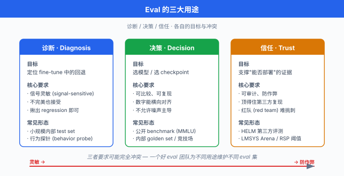
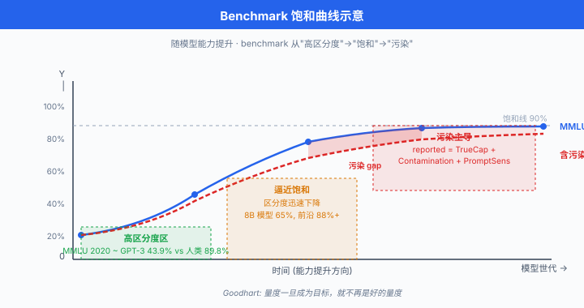

# 为什么 Eval 是 LLM 的圣杯

> **一句话总结**: 大语言模型的评测 (eval) 是训练之外最难、最主观、也最要命的一环 —— 它同时承担诊断、决策与信任三大职能, 却在真值缺失、多维不可通约与 Goodhart 效应的三重夹击下, 永远只能"逼近"而不能"完成".

## 🗺️ 本章导览

- 本章覆盖 LLM 评测方法学: 从传统指标到现代 benchmark 到竞技场
- **01. 为什么 Eval 是 LLM 的圣杯** (本节): 三大用途、eval 难在哪、eval-driven development
- **02. 传统 NLP 指标**: perplexity、BLEU、ROUGE、METEOR、CIDEr 与它们的局限
- **03. 现代 Benchmark 体系**: MMLU、GSM8K、HumanEval、ARC、HellaSwag、BigBench、SWE-Bench
- **04. 竞技场与人类偏好**: LMSYS Arena、ELO、MT-Bench、AlpacaEval
- **05. LLM-as-Judge**: GPT-4 打分、reward model eval、偏差与去偏
- **06. Contamination 与 Benchmark 崩坏**: 数据污染检测、canary、动态 eval
- **07. 前沿方向: Capability & Safety Eval**: HELM、Agent eval、dangerous capability

*上一章讲完对齐、安全与可解释性, 一个自然的问题跟上来: 我们怎么知道自己"对齐"到了? 怎么知道模型比昨天更"安全"? 答案永远绕不过 evaluation. 但 LLM 的 eval 与传统机器学习的评测截然不同 —— 它没有干净的验证集, 没有唯一正确答案, 甚至没有一个能压缩所有维度的单一指标. 这一节把这个"圣杯"式的问题摊开来讲.*

- 想象一下, 你花了 200 万美元、烧了三个月的 8000 张 H100 训完一个 70B 参数的 LLM. loss 曲线漂亮, tokens/sec 达标, checkpoint 都存好了. 老板问你一句: **"这个模型比上一版好吗?"** —— 你怎么回答?
- 传统机器学习你可以回一句"验证集 accuracy 从 91.2 涨到 92.7". 但 LLM 呢? 你想说"它现在写代码更好、聊天更自然、拒答更合理", 老板追问"证据呢", 你只能沉默. 因为**没有一个数字**能同时刻画这些维度; 每一个 benchmark 都有污染疑云, 每一个 human eval 都有标注员偏差, 每一次内部主观测试都逃不过"我觉得挺好"这四个字的陷阱.
- 这就是本章要讲的痛点: **evaluation 是 LLM 时代最大的科学债**. 你训得再好, 若没法证明"好", 一切都是空气.

## Eval 的三大用途: 诊断 · 决策 · 信任

- 在展开难度之前, 先明确一件事: 我们**为什么**做 eval? 主流用途可以归纳为三类, 三者对 eval 的要求截然不同.

- **诊断 (Diagnosis)**: 用于训练与微调过程中的 debug. 比如 SFT (supervised fine-tuning, 有监督微调) 阶段 loss 降下来了, 但模型输出突然满口 emoji —— 你需要一个 eval 定位到"礼貌度过高、专业度过低"这种细颗粒问题. 诊断 eval 追求**信号灵敏**, 哪怕不完美, 只要能揪出回退 (regression) 就行. 常见形态: 小规模内部 test set、单元测试式的行为探针 (behavior probe).

- **决策 (Decision)**: 用于选模型、选 checkpoint、选超参. 你训了 20 个 checkpoint, 需要选一个上线; 或者 GPT-4o 和 Claude Sonnet 之间为业务选一个. 决策 eval 追求**可比较、可复现**, 数字必须能横向对齐. 常见形态: 公开 benchmark (MMLU / GSM8K)、内部 golden set、竞技场对战.

- **信任 (Trust)**: 用于对外宣称能力时的证据. 论文的表格、发布会的 PPT、监管部门的合规报告 —— 这些数字影响的是**是否可以部署**、**谁承担责任**. 信任 eval 追求**可审计、防作弊**, 必须能顶得住第三方复现和红队 (red team) 挑刺. 常见形态: 权威第三方 benchmark (HELM)、独立评测机构 (LMSYS Chatbot Arena)、能力评估协议 (dangerous capability eval).

- 三类用途对同一个 eval 的要求可能完全冲突. 诊断希望灵敏, 但灵敏往往意味着易被过拟合; 决策希望可比, 但公开 benchmark 一旦被广泛复用就必然污染; 信任希望防作弊, 但防作弊往往意味着题目不能公开, 又和"可复现"打架. **一个好的 eval 团队, 会为不同用途维护不同的 eval 集, 而不是幻想用一个 eval 打天下.**



## 为什么 LLM Eval 极难: 五个根源

- 传统机器学习的 eval 之所以不难, 是因为**有干净的 ground truth**. ImageNet 一张图的标签是"金毛犬", 就是"金毛犬"; 情感分类"正面"就是"正面". accuracy、F1、AUC 拿来就能用. 但 LLM 打破了这个前提, 至少在五个维度上.

### 根源一: Ground truth 缺失

- LLM 的核心用途是**开放域生成**. "帮我写一封辞职信"、"总结这篇论文"、"写一段 Rust 代码调用 gRPC" —— 这些任务的**正确答案不唯一**. 甚至"错误"都不好定义: 一封辞职信可以委婉可以直接, 委婉的更礼貌但可能被理解为不坚决, 直接的更清晰但可能显得傲慢. 每个维度都是**连续谱**, 不是离散标签.
- 形式化一点: 设输入 $x$, 输出 $y$. 分类任务的评测是 $\text{Acc} = \mathbb{E}_x [\mathbf{1}\{f(x) = y^\ast(x)\}]$, 其中 $y^\ast$ 是唯一真值. 但 LLM 的评测本质上是
$$\text{Score}(f) = \mathbb{E}_x \big[ Q(f(x), \mathcal{Y}^\ast(x)) \big]$$
- 其中 $\mathcal{Y}^\ast(x)$ 是**可接受输出的集合** (一般无限大), $Q$ 是一个**质量函数**, 本身就得学出来 —— 而学出来的东西就必然有误差和偏见. **没有真值, 就没有客观 accuracy**.

### 根源二: 多维不可通约

- 一个 LLM 的输出至少要在下面这些维度上同时被评估, 而它们**彼此独立、无法压缩成一个数**. 先看偏"内容质量"的一组:
  - **事实性 (factuality)**: 说的东西是不是真的, 没有胡编.
  - **流畅性 (fluency)**: 句子读起来顺不顺, 有没有语法坑.
  - **相关性 (relevance)**: 有没有答到用户真正问的那件事.
  - **有用性 (helpfulness)**: 用户拿到回答后, 问题是不是真的往前推进了.
  - **推理力 (reasoning)**: 遇到多步骤问题时能不能一步步想清楚.

- 再看偏"行为对齐"的一组, 这几维在部署时往往比"聪不聪明"更要命:
  - **安全性 (safety / harmlessness)**: 会不会输出违法、危险、辱骂性的内容.
  - **诚实性 (honesty)**: 不知道就说不知道, 而不是一本正经地瞎说.
  - **指令跟随度 (instruction following)**: 用户让"输出 3 条", 就真的输出 3 条, 不多不少.
  - **格式规范度 (format adherence)**: 让给 JSON 就给合法 JSON, 让写 Markdown 就用正确语法.

- 一个具体的两难: 模型 A 事实性 90 分、有用性 50 分; 模型 B 事实性 70 分、有用性 85 分. 谁更好? 答案取决于**你的使用场景**. 医疗问答显然选 A, 头脑风暴助手可能选 B. 单一 leaderboard 排名, 一旦把多维压缩成标量, 就必然丢掉这种场景敏感的权衡.

### 根源三: 上下文敏感

- 同一段用户输入, 换一个 system prompt (系统提示词), 输出可能天差地别. "You are a helpful assistant" 和 "You are a rigorous scientific reviewer" 会导致模型在同一道题上给出风格、篇幅、置信度截然不同的答案.
- 更麻烦的是: eval 的分数**强依赖于 prompt 模板**. Hendrycks 等人 (2020) 的 MMLU (大规模多任务语言理解, Massive Multitask Language Understanding, MMLU) 论文里, 同一模型换一种 prompt 格式, 分数可以差 5-10 个百分点. Liang 等人 (2022) 的 HELM 报告干脆把 prompt 变体本身作为一个测评维度, 报告"平均 + 方差". **不控制 prompt, 你测的就不是模型能力, 是模型 + prompt 的组合能力**.

### 根源四: 分布外泛化 (Out-of-Distribution, OOD)

- Benchmark 是一批**特定分布**的样本. MMLU 是选择题、GSM8K 是小学数学、HumanEval 是 Python 函数补全. 但真实用户的 query 分布**根本不长这样** —— 现实里有一半 query 是"帮我改一下这段没写完的代码"、"这篇邮件回得客气点"这种半上下文、半闲聊的场景.
- 一个模型在 MMLU 上 90 分, 上线后用户吐槽"废话多、不听指令、瞎编事实". 这不是矛盾, 这是**benchmark 分布 ≠ 使用分布**的必然结果. 用一句更狠的话: **公开 benchmark 是"考试成绩", 真实用户是"实习工作表现", 两者相关但远非同一件事**.

### 根源五: 评测者偏差

- 主观 eval (人类打分或 LLM-as-judge) 会被评测者本身的属性污染. 人类标注员有:
  - **教育背景偏差**: 母语英语的博士生 vs 众包平台的普通标注员, 对"专业性"的打分尺度不同.
  - **疲劳偏差**: 连续标 500 条后, 打分方差显著变大 (Kahneman et al., 2021 的 *Noise* 一书专门讲这个现象).
  - **文化偏差**: 同一段回答, 美国标注员觉得"太啰嗦", 中国标注员可能觉得"够详细".
  - **顺序偏差**: 先看到的选项打分更高 (primacy bias), 或最后看到的更高 (recency bias), 取决于任务设计.
- 用 LLM 当 judge (下一章展开) 更糟糕: LLM 有位置偏差 (position bias, 更青睐第一个选项)、长度偏差 (length bias, 更青睐长回答)、自我偏好偏差 (self-preference bias, GPT-4 判 GPT-4 更宽松) 等一整套系统性 bug. **评测者本身就是一个有偏、有噪声的信道**.

## Eval-Driven Development: 借 TDD 的东风

- 面对上面五个根源, 有没有系统性的开发范式? Anthropic 的实践给出了一个漂亮的答案: **Eval 驱动开发 (Eval-Driven Development)**, 直接类比软件工程的**测试驱动开发 (Test-Driven Development, TDD)**.

- TDD 的核心是**先写测试, 再写代码**. 测试是"意图的可执行说明书", 强迫程序员在动键盘前想清楚要做什么. Eval-Driven Development 把这个哲学搬到 LLM:
  - **先定义 eval, 再训模型**. 想让模型学"更礼貌"? 先构建一个能量化"礼貌度"的 eval 集. 想让模型学"少幻觉"? 先构建一个 hallucination 检测集. **没有 eval 的能力目标, 就是空想**.
  - **每次改动都过一遍 eval 套件**. SFT 换了数据分布 → 跑一次 eval; RLHF 调了 reward model → 跑一次 eval; 后处理加了个 guardrail (护栏) → 跑一次 eval. 任何回退立刻发现, 而不是等用户反馈.
  - **Eval 和模型能力协同进化**. 模型越强, 老 eval 越会饱和 (saturate) 失去区分度, 就要设计更难的 eval. Anthropic 内部有一句话: "eval 团队应该是能追得上研究团队的最强人才".

- 对比只跟 loss 训的传统范式:

| 维度 | Loss 驱动 | Eval 驱动 |
|------|----------|----------|
| 目标 | 最小化 $\mathcal{L}(\theta)$ | 最大化下游 eval 分数 |
| 信号频率 | 每 step 都有 | 每 checkpoint / 每次实验 |
| 语义颗粒度 | 单一标量 | 多维分数, 可拆分 |
| 分布匹配 | 训练集分布 | 使用场景分布 |
| 主要风险 | 过拟合训练集 | eval 集本身污染或狭窄 |

- 形式化对比. 传统训练是求
$$\theta^\ast = \arg\min_\theta \mathcal{L}_\text{train}(\theta)$$
- Eval 驱动则是求
$$\theta^\ast = \arg\max_\theta \sum_{i=1}^{K} w_i \cdot \text{Eval}_i(\theta), \quad \text{s.t. } \mathcal{L}_\text{train}(\theta) < \tau$$
- 这里 $K$ 个 eval $\text{Eval}_i$ 是多目标向量, $w_i$ 是场景权重. train loss 从**目标**降级成**约束** —— 只要 loss 别爆炸就行, 真正决定"好"的是 eval. 这是 LLM 后训练时代与预训练时代的方法论分水岭.

- 但要警告一句: eval 驱动开发也会掉进自己的陷阱, 就是 **Goodhart's Law 在 eval 上的显现** —— 一旦某个 benchmark 被公开且被广泛用作决策依据, 它就会成为优化目标, 从而失去作为"良好度量"的资格. 这个我们下面会展开.

## 主观 vs 客观 Eval 的谱系

- LLM eval 的另一个关键分类是**主观-客观谱系**. 别用二分法, 用谱系:

```
客观 ─────────────────────────────────────────────── 主观
 │                     │                    │           │
[有唯一真值]       [半可执行验证]      [多参考答案]  [纯人类判断]
 MMLU                HumanEval          BLEU/ROUGE    对话质量
 GSM8K               SWE-Bench          summarization  helpfulness
 ARC                 competitive-prog                  creativity
```

- **左端 (客观)**: 有唯一真值或可执行验证. MMLU 选 A/B/C/D, 一目了然; HumanEval 跑 unit test, 通过就是通过, 不通过就是不通过. 优点是**完全可复现**, 缺点是**远离真实用户价值** —— 用户不会问你 "3.14 的平方根乘以 2 是多少", 他会问 "帮我把这段代码重构得更清晰".
- **中段 (半主观)**: 有参考答案但接受多种形式. BLEU 比对翻译输出与人工参考, 允许一定程度的表达差异; summarization 有多个可接受摘要. 这类 eval 靠 n-gram 匹配等启发式, 已经**广受质疑** (下一节详细展开为什么).
- **右端 (主观)**: 只能靠人类或 LLM 打分. 对话质量、创造力、共情能力、指令跟随度 —— 这些没有客观真值, 只有"合格的读者觉得如何". LMSYS Chatbot Arena、MT-Bench 都在这一端.

- **一个关键排序**: 越靠右 (越主观), 越贴近真实价值; 越靠左 (越客观), 越好复现. 你选 eval 时, 要在**信号真实性**和**信号可复现性**之间权衡. 只跑右端你没法给出可信数字, 只跑左端你测的可能不是用户在乎的东西. **正确做法: 左中右各取几个, 交叉验证**.

## Goodhart 在 Eval 上的显现

- 回到上一章的 Goodhart's Law: "任何量度一旦成为目标, 就不再是好的量度". 在 LLM eval 领域, 这条定律显现为一个尖锐现象: **benchmark 一红就成为优化目标, 然后失去区分度**.
- 具体路径: 一个 benchmark 发布 → 论文里被引用, 变成公认 baseline → 各家厂商公开自己的分数 → 训练数据里出现 benchmark 及其变体 (数据污染, contamination) → 模型分数虚高 → benchmark 失去区分能力.
- 举个例子: MMLU 2020 年发布时, GPT-3 (175B) 只有 43.9%, 明显低于人类专家的 89.8%, 区分度极佳. 到 2024 年, 主流开源 8B 模型都能到 65+%, 前沿模型 88%+, 已经**逼近饱和**. 这时候你再报 MMLU 分数, 90.1 和 89.7 的差别可能纯属噪声.
- 更棘手的是**数据污染 (contamination)**. 一个模型的训练数据里如果混进了 MMLU 测试集 (哪怕是 web crawl 意外抓到), 分数就会虚高. 检测污染的方法 (canary string、n-gram 匹配、成员推断) 我们放到本章第 06 节. 这里先记住一个数学直觉:
$$\text{Reported}(\text{model}) \; = \; \underbrace{\text{TrueCapability}}_{\text{我们想测的}} + \underbrace{\text{Contamination}}_{\text{意外记忆}} + \underbrace{\text{PromptSensitivity}}_{\text{格式运气}} + \epsilon$$
- 三个附加项都是**正贡献**, 都会推高分数. 一个漂亮的分数不再是"能力强"的充分证据 —— 只是"能力 + 污染 + 提示词技巧"的加总.
- 从信息论角度: 一个 benchmark 承载的信息量有上限 (它就那么些道题). 优化压力越大, 你越是从 benchmark 里榨取每一比特信息 —— 但**多余的优化压力**只能过拟合 benchmark 特定分布, 不再转化为真实能力提升. Goodhart 的信息论边界在这里同样成立.



## Eval 与 Alignment 的联系

- 上一章讲对齐, 这一章讲 eval, 二者是同一枚硬币的两面. 让我们回到那个 $U_\text{human}$ (人类真实效用) 与 $\hat r$ (代理奖励) 的分裂:
  - 训练时, 我们用 $\hat r$ 去逼近 $U_\text{human}$.
  - 评测时, 我们用 $\text{Eval}$ 去逼近 $U_\text{human}$.
- 换句话说, **eval 就是 alignment 的另一种代理**. 它同样受 Goodhart's Law 摧残, 同样无法完整表达人类真值, 同样在优化压力下暴露漏洞.
- 但 eval 有一个 alignment 没有的独特作用: 它是**部署决策的看门人**. 如果一个模型在 dangerous capability eval (前沿能力评估, 见本章 07 节) 上表现异常, 就应该延迟发布或加护栏. Anthropic 的 Responsible Scaling Policy (RSP, 2023) 明确把 eval 分数与部署门槛绑定 —— **eval 从"科学度量"升级成了"治理机制"**.
- 好的 eval 是 alignment 的**最佳外部信号**. 想知道模型是否 sycophantic (拍马屁)? 构建一个 sycophancy eval (Perez et al., 2022 的 model-written eval 就是这么干的). 想知道模型是否 deceptive (欺骗)? 构建可控的欺骗性 eval. **每一个 alignment 关切, 最终都要落到一个 eval 上**. 不能被 eval 度量的 alignment 目标, 相当于不存在.

## 中文圈的 Eval 生态: C-Eval / SuperCLUE / OpenCompass

- 中文 LLM 圈的 eval 生态在 2023-2024 迅速成型, 主要参考几个坐标:
  - **C-Eval** (上海交通大学 + 清华大学等, 2023): 覆盖 52 学科的中文选择题 benchmark, 类似 MMLU 的中文对应物. 包含 STEM、人文、社会科学、其他 (Other) 四大类, 从初中到博士级别. 一度是国内厂商发布通用能力的必报指标.
  - **SuperCLUE** (CLUE 团队, 2023): 综合中文能力评测, 涵盖对话、推理、代码、安全等多维度. 每季度发布 leaderboard, 影响国内厂商定位.
  - **OpenCompass** (上海 AI 实验室, 2023): 更像一个 eval 平台而非单一 benchmark, 集成了 100+ 数据集与统一评测协议. 官方支持中英文, 是国内最接近 HELM 的开源框架.
- 但中文圈的 eval 也在遭遇**同样的 Goodhart 危机**. 2023 年就有多起争议: 某厂商 C-Eval 分数比 GPT-4 高 15 个百分点, 但同一模型在开放式 chat 上表现明显更弱, 被外界质疑训练数据污染或模式匹配. **一个健康的 eval 生态需要独立第三方与动态 eval**, 而不是"厂商自己发榜自己刷".
- 另一个中文圈特有的挑战: **文化本地化**. 一道 MMLU 里的美国宪法题直译成中文, 对中国用户几乎无意义. 简单的翻译 benchmark 会引入"翻译质量偏差", 让模型分数与真实中文能力脱节. 好的中文 eval 应该有**原生构建**的题目 (C-Eval 的行业知识部分就是这么做的), 而不是全靠翻译.

## 代码实验一: 最简 Eval Loop 骨架

- 让我们看一个 eval loop 的骨架代码. 目的是感受"eval 不是黑魔法", 就是**批量 inference + 批量打分**.

```python
from typing import Callable, List, Dict, Any
import statistics

def run_eval(
    model_fn: Callable[[str], str],
    dataset: List[Dict[str, Any]],
    scorer: Callable[[str, Dict[str, Any]], float],
    name: str = "unnamed_eval",
) -> Dict[str, float]:
    """
    通用 eval loop.
    - model_fn: 一个 prompt -> completion 的函数
    - dataset: 每条 sample 至少有 'input' (prompt) 与打分需要的字段
    - scorer: 打分函数, 输入 (completion, sample) 返回 [0, 1] 分数
    """
    scores = []
    per_sample = []
    for i, sample in enumerate(dataset):
        prompt = sample["input"]
        # 关键: 固定 system prompt 与温度, 保证 eval 可复现
        completion = model_fn(prompt)
        s = scorer(completion, sample)
        scores.append(s)
        per_sample.append({"idx": i, "score": s, "completion": completion})

    return {
        "name": name,
        "n": len(scores),
        "mean": statistics.mean(scores),
        # 报告方差是 eval 的最低职业道德; 无方差的均值是耍流氓
        "stdev": statistics.stdev(scores) if len(scores) > 1 else 0.0,
        # 保留 per-sample 明细, 用于 error analysis
        "samples": per_sample,
    }

# 玩具例子: 简单 exact-match scorer
def exact_match(completion: str, sample: Dict[str, Any]) -> float:
    return 1.0 if completion.strip() == sample["reference"].strip() else 0.0

# 假设有一个 model_fn
def fake_model(prompt: str) -> str:
    return "42"  # 一个只会说 42 的模型

toy_dataset = [
    {"input": "生命的答案是?", "reference": "42"},
    {"input": "1+1=?", "reference": "2"},
]

result = run_eval(fake_model, toy_dataset, exact_match, name="toy_em")
print(f"Eval: {result['name']}, n={result['n']}, "
      f"mean={result['mean']:.3f}, stdev={result['stdev']:.3f}")
# 输出: Eval: toy_em, n=2, mean=0.500, stdev=0.707
```

- 这段代码只有 30 行, 但抓住了 eval 的**四要素**: (1) 数据集, (2) 模型调用, (3) 打分器, (4) 统计汇报 (均值 + 方差). 现代 eval 框架 (LM-Eval-Harness、HELM、OpenCompass) 都是把这四要素**工程化**并追加 prompt 模板管理、批量并行、缓存与结果溯源.
- 重要提醒: **单一均值分数是不够的**. 一个 eval 至少要报告均值 + 方差 + n. 更好一点报告 bootstrap 置信区间. **看到只有一个数字的 leaderboard, 直接怀疑**.

## 代码实验二: Benchmark JSON 结构示例

- 现代 benchmark 通常以 JSON 或 JSONL 存储, 每条样本至少包含: input、reference (若有)、metadata (如学科、难度). 下面是一个 MMLU-style 样本的结构参考:

```python
mmlu_sample = {
    "id": "mmlu_high_school_math_001",
    "input": (
        "The following are multiple choice questions about high school mathematics.\n\n"
        "Question: If f(x) = 2x + 3, what is f(5)?\n"
        "A) 10\n"
        "B) 13\n"
        "C) 15\n"
        "D) 8\n"
        "Answer:"
    ),
    "reference": "B",
    "choices": ["A", "B", "C", "D"],
    "metadata": {
        "subject": "high_school_math",
        "difficulty": "easy",
        "source": "mmlu-v1",
        # canary string 用于污染检测, 见第 06 节
        "canary": "UUID-canary-4c2b1a8e"
    }
}

# 一个 benchmark 的完整 schema 建议至少包含:
benchmark_schema = {
    "name": "MMLU",
    "version": "1.0",
    "n_samples": 14042,
    "prompt_template": "The following are multiple choice questions about {subject}...",
    "eval_config": {
        "temperature": 0.0,      # 客观 eval 一律用贪心
        "max_tokens": 5,
        "stop_sequences": ["\n\n"],
    },
    "scorer": "letter_choice_exact_match",  # 打分器标识
    "metrics_reported": ["mean", "per_subject", "stdev_over_prompts"],
    "known_issues": ["contamination_in_common_crawl", "prompt_sensitivity"],
}
```

- 这个 schema 强调三件事: **prompt 模板必须写下来** (否则不可复现)、**eval config 必须固定** (温度、max tokens、停止符都会影响结果)、**已知问题必须公开** (让读数字的人有心理准备). 这是"负责任 eval"的基础格式.

## 心法: 给读者的 Eval 三条原则

- 讲了这么多难点, 最后给读者三条务实的原则, 走 LLM eval 时贴在墙上:

- **原则一: 别相信任何单一分数**. 一个模型 MMLU 90 分, 只能告诉你它擅长做 MMLU 那种题. 至少同时看 3-5 个正交 eval (推理 / 代码 / 安全 / 对话 / 长文本), 加上人工抽检 20-50 条. 单一数字漂亮不代表整体好.

- **原则二: Track 分数变化的方向, 而非绝对值**. 你在 MMLU 上从 65 涨到 68, 是**你自己**的模型对比自己的进步信号, 值得信. 但你的 68 vs 别人的 71, 差异可能来自 prompt 模板、few-shot 数量、温度设置 —— **横向比较不可轻信**. 纵向 (自己对比自己) 的方向性信号远比绝对值靠谱.

- **原则三: 建立自己的 golden set**. 公开 benchmark 会污染, leaderboard 会饱和, 但**你自己维护的、封闭的、面向业务的 golden set 是核弹级资产**. 200 条精心构建的业务样本 + 明确打分标准, 比 20000 条公开 benchmark 更能保护你的产品决策. Anthropic、OpenAI 内部都有大量 golden set 从不公开, 就是这个道理.

## 本章后续路线图

- 铺垫完基础, 我们在剩下的 6 节里逐步深入:
  - **第 02 节** 回到传统 NLP 指标 —— perplexity、BLEU、ROUGE 这些前 LLM 时代的老兵, 弄清它们**为什么在 LLM 时代不够用**, 但为什么依然要懂.
  - **第 03 节** 现代 benchmark 巨型体系 —— MMLU、GSM8K、HumanEval、SWE-Bench、BigBench 一次讲透, 附带每个 benchmark 的**污染现状**.
  - **第 04 节** 竞技场与人类偏好 —— LMSYS Chatbot Arena、MT-Bench、AlpacaEval 与 ELO 数学.
  - **第 05 节** LLM-as-Judge —— 用 GPT-4 判 GPT-4 的方法论、系统性偏差与去偏技术.
  - **第 06 节** Contamination 与 Benchmark 崩坏 —— 检测方法、canary 机制、动态 eval 的新范式.
  - **第 07 节** 前沿方向 —— HELM 的整体协议、Agent eval、dangerous capability eval, 与治理挂钩.

- 读完全章, 你应该能回答老板那个刁钻问题: "这个模型比上一版好吗?" —— 不是给出一个数字, 而是给出一份**多维度、报方差、标污染、附抽检**的 eval 报告. 那份报告的每一项分数背后, 都有本章某一节讲过的方法论支撑.

---

## 📌 本节要点

- **Eval 三大用途**: 诊断 (debug 训练)、决策 (选模型/checkpoint)、信任 (对外证据); 三者对 eval 的要求相互冲突, 应分别维护不同 eval 集.
- **LLM eval 极难的五个根源**: ground truth 缺失、多维不可通约、上下文/prompt 敏感、分布外泛化、评测者本身有偏.
- **Eval-Driven Development**: 类比 TDD, 先定义 eval 再训模型, 把 loss 从"目标"降级为"约束", 真正的目标是多维 eval 加权和.
- **主观-客观谱系**: 从 MMLU (客观唯一真值) 到 HumanEval (可执行验证) 到 BLEU (多参考) 到人类打分 (纯主观); 越主观越贴近价值, 越客观越好复现, 必须交叉使用.
- **Goodhart 在 eval 上的显现**: 公开 benchmark 会被优化为目标, 走向饱和 + 污染; 漂亮分数 = 真能力 + 意外记忆 + 提示词技巧, 三者难以拆分.
- **Eval 与 Alignment 的关系**: eval 是 alignment 的另一种代理, 也是**部署决策的看门人** (Anthropic RSP 把 eval 分数与发布门槛绑定).
- **中文圈 eval 生态**: C-Eval / SuperCLUE / OpenCompass 是三大坐标; 面临同样的 Goodhart 危机, 且需应对文化本地化挑战.
- **三条实践原则**: 别信单一分数、track 方向而非绝对值、建立自己的封闭 golden set.

## 参考文献

- Hendrycks, D., Burns, C., Basart, S., Zou, A., Mazeika, M., Song, D., & Steinhardt, J. (2020). *Measuring Massive Multitask Language Understanding*. arXiv:2009.03300. (MMLU 原始论文.)
- Liang, P. et al. (2022). *Holistic Evaluation of Language Models (HELM)*. arXiv:2211.09110. (系统性 eval 协议的标杆论文.)
- Chiang, W.-L., Zheng, L., Sheng, Y., Angelopoulos, A. N., Li, T., Li, D., Zhang, H., Zhu, B., Jordan, M. I., Gonzalez, J. E., & Stoica, I. (2024). *Chatbot Arena: An Open Platform for Evaluating LLMs by Human Preference*. arXiv:2403.04132.
- Zheng, L. et al. (2023). *Judging LLM-as-a-Judge with MT-Bench and Chatbot Arena*. NeurIPS 2023 Datasets and Benchmarks Track. arXiv:2306.05685.
- Perez, E. et al. (2022). *Discovering Language Model Behaviors with Model-Written Evaluations*. arXiv:2212.09251. (model-written eval 与 sycophancy 系统测量.)
- Anthropic (2023). *Anthropic's Responsible Scaling Policy (RSP)*. (把 dangerous capability eval 与部署门槛绑定的治理框架.)
- Kaplan, J. et al. (2020). *Scaling Laws for Neural Language Models*. arXiv:2001.08361. (Loss 视角的"越大越好"; 与 eval 视角的差异构成本章张力.)
- Huang, Y. et al. (2023). *C-Eval: A Multi-Level Multi-Discipline Chinese Evaluation Suite for Foundation Models*. arXiv:2305.08322.
- Kahneman, D., Sibony, O., & Sunstein, C. R. (2021). *Noise: A Flaw in Human Judgment*. Little, Brown Spark. (人类判断噪声的系统研究, 与人工 eval 直接相关.)
