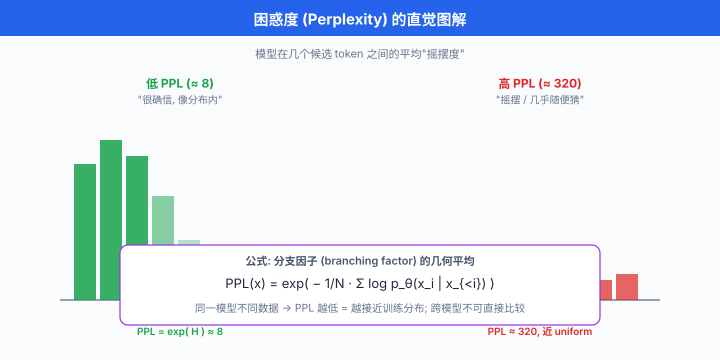
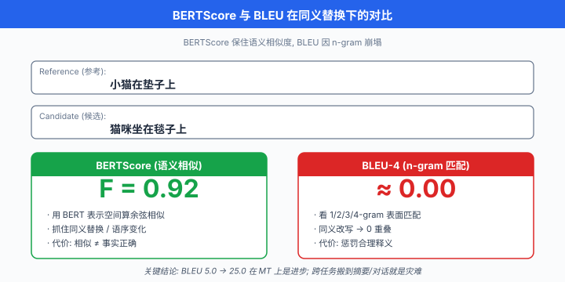

# 传统 NLP 指标

> **一句话总结**: 困惑度 / BLEU / ROUGE / METEOR / CIDEr / BERTScore 是 LLM 之前 NLP 圈打了二十年的老兵, 它们用 n-gram 重叠或 embedding 相似度逼近"生成质量", 在 LLM 时代已经明显力不从心, 但依然是每一份评测报告绕不开的基线.

*BLEU 是 2002 年发明的, 二十年后仍在被引用. 这不是因为它有多完美, 而是因为它便宜、可复现、大家都在用 —— 而"大家都在用"本身, 就是最难撼动的技术惯性. 想真正理解 LLM 时代的 eval 为何转向 LLM-as-Judge, 得先明白这些指标当年解决了什么问题, 又在什么地方栽了跟头.*

- 上一节讲清了 LLM eval 为什么难 —— ground truth 缺失、多维不可通约、上下文敏感、分布外、评测者有偏. 现在我们把镜头拉回到 LLM 之前的 NLP 世界, 看看学界曾经用什么办法凑合评测**开放域生成**. 这些方法有个共同前提: **有一个或多个"参考答案"** (reference), 打分器算模型输出与参考答案的某种相似度.
- 这一节要讲六种传统指标: 困惑度 (perplexity)、BLEU、ROUGE、METEOR、CIDEr/SPICE、BERTScore. 前五种基于 n-gram 或规则, 属于**符号匹配派**; 最后一种基于 embedding, 属于**语义匹配派**. 弄懂它们的数学、局限, 以及**为什么中文用会踩坑**, 是 LLM 时代做 eval 的必修基本功.

## 困惑度 (Perplexity, PPL): 语言模型自己的语言

- 困惑度 (perplexity, PPL) 是**语言模型自评**指标, 不需要参考答案, 只需要一段测试文本. 它衡量的是: **模型对这段文本"有多惊讶"**.

### 数学定义

- 给一段测试文本 $x_1, x_2, \dots, x_N$ (每个 $x_i$ 是一个 token), 语言模型 $P$ 对这段文本的困惑度定义为:

$$\text{PPL}(x_{1:N}) \;=\; \exp\!\left(-\frac{1}{N} \sum_{i=1}^{N} \log P(x_i \mid x_{<i})\right)$$

- 括号里那一坨 $-\frac{1}{N} \sum \log P(x_i \mid x_{<i})$ 就是**平均负对数似然** (average negative log-likelihood, NLL), 也就是交叉熵 (cross-entropy, CE) 的 per-token 版本. 换句话说:

$$\text{PPL} \;=\; \exp(\text{CE})$$

- 交叉熵与困惑度是一一对应的单调变换. 之所以还要包一层 $\exp$, 是为了让数字**回到词表尺度**: 一个词表大小为 $V$ 的完全随机模型, 每一步分布是均匀 $1/V$, 于是 $\text{PPL} = V$; 一个完美预测下一个 token 的模型, $\text{PPL} = 1$. 直觉上, PPL 就是"模型平均在几个候选之间摇摆".

### 信息论解释

- 从信息论角度, 交叉熵 $H(p, q) = -\sum p(x) \log q(x)$ 度量的是**用分布 $q$ 编码来自 $p$ 的样本, 平均每 token 需要多少 bit** (若 $\log$ 取 2) 或多少 nat (若 $\log$ 取 e). PPL 就是这个 bit/nat 数的指数还原:

$$\text{PPL} \;=\; b^{H(p, q)}, \quad b \in \{2, e\}$$

- 因此 PPL 减一半, 意味着模型对测试文本的编码效率翻倍 —— 这在预训练时代是极强的进步信号. Shannon 1951 年估算英文的**熵下限**约 1.3 bit/char, 对应约 8 的字符级 PPL; 2020 年前后的 GPT-3 在 token 级 PPL 上已经压到个位数, 但这里的 token 与 char 不是一回事, 后面还要展开.

### 局限一: 高 PPL ≠ 生成质量差

- PPL 只反映**模型对测试分布的建模能力**. 一个 PPL 极低的模型, 上线后依然可能生成套话、幻觉、答非所问. 因为:
  - PPL 低意味着**平均**能预测好下一个 token, 不意味着**采样后**生成的整段文字符合人类偏好.
  - PPL 是**per-token** 指标, 一个连续生成 100 token 的样本, 只要其中 90 token 高概率, 就能拉低整体 PPL —— 哪怕开头的 10 个 token 已经把"事实性"毁得一塌糊涂.
- 反过来, 一个 RLHF 之后的模型可能 PPL 变高 (因为它学会拒答、更谨慎), 但 human eval 分数明显更好. **PPL 与人类偏好在 post-training 阶段常常反相关**, 这一点在 InstructGPT 论文 (Ouyang et al., 2022) 里有明确报告.

### 局限二: Tokenizer 依赖导致不可跨模型直接比较

- 这是 PPL 最要命的坑. 同一段中文 "深度学习是人工智能的核心", GPT-4 的 tokenizer 可能切成 8 个 token, Llama 3 的 tokenizer 可能切成 12 个, ChatGLM 的可能切成 6 个. 每个模型的 $N$ (总 token 数) 不同, PPL 的绝对值自然不同 —— **哪怕两个模型对这段文本的"真实概率密度"完全一样**.
- 从数学看: 对同一段字符序列 $c_{1:M}$, 不同的 tokenization 方案会给出不同的 token 序列 $x_{1:N_A}$ 和 $y_{1:N_B}$, 而

$$\log P_A(c_{1:M}) = \sum_{i=1}^{N_A} \log P_A(x_i \mid x_{<i}) \;\ne\; \sum_{j=1}^{N_B} \log P_B(y_j \mid y_{<j}) = \log P_B(c_{1:M})$$

- 是 per-**token** 的量, 但 $N_A \ne N_B$, 所以 $\text{PPL}_A$ 和 $\text{PPL}_B$ 没有可比性. 想跨模型比, 得转到 **bits-per-character** (BPC) 或 **bits-per-byte** (BPB):

$$\text{BPC} \;=\; \frac{1}{M \log 2} \sum_i (-\log P(x_i \mid x_{<i}))$$

- BPC 归一化到字符维度, 消除 tokenizer 差异. 这也是 Chinchilla (Hoffmann et al., 2022)、LLaMA 系列论文里报告 BPB 而非 PPL 的原因.

### 代码实验一: 用 Hugging Face 计算 PPL

```python
import torch
import math
from transformers import AutoTokenizer, AutoModelForCausalLM

def compute_perplexity(model, tokenizer, text: str, device: str = "cuda") -> float:
    """
    计算给定文本在模型下的 per-token 困惑度.
    注意: 这里用 causal LM 的标准做法, 不考虑滑窗切分长文本.
    """
    encodings = tokenizer(text, return_tensors="pt").to(device)
    input_ids = encodings.input_ids

    with torch.no_grad():
        # 语言模型的 loss 已经是 per-token 平均负对数似然 (自动 shift)
        outputs = model(input_ids, labels=input_ids)
        nll = outputs.loss.item()  # 平均 NLL (nat)

    return math.exp(nll)  # PPL

# 用法示例
model_name = "gpt2"
tokenizer = AutoTokenizer.from_pretrained(model_name)
model = AutoModelForCausalLM.from_pretrained(model_name).eval().to("cuda")

ppl_en = compute_perplexity(model, tokenizer, "The quick brown fox jumps over the lazy dog.")
ppl_zh = compute_perplexity(model, tokenizer, "深度学习是人工智能的核心技术.")

print(f"英文 PPL = {ppl_en:.2f}")
print(f"中文 PPL = {ppl_zh:.2f}  # GPT-2 中文 tokenizer 差, PPL 会很高")
# 关键警告: 这两个数字不能直接横比不同模型, 只能纵比同模型不同数据
```

- **这个数字告诉你什么**: 同一个模型在不同数据上 PPL 越低, 该数据越接近模型训练分布. **这个数字骗你什么**: 一个 PPL 30 的模型不一定比 PPL 40 的模型"生成质量好", 只是"对测试集分布拟合更好".



## BLEU: 机器翻译的第一份"客观"评分

- BLEU (Bilingual Evaluation Understudy, 双语评测替代), 由 Papineni 等人 (2002) 在 IBM 提出, 是**开放域生成评测**的开山之作. 它诞生的背景是**机器翻译**: 那个年代 (SMT 时代) 评测靠专家人工, 慢且贵, IBM 需要一个**自动化 + 与人类判断相关**的替代. BLEU 就是那个"评测替身" —— 名字里的 "Understudy" 就是这个意思.

### 数学定义

- BLEU 的核心是**修正的 n-gram 精确率** (modified n-gram precision). 给一个候选翻译 $c$ 和一组参考翻译 $\{r_1, r_2, \dots\}$, 对每个 n-gram $g$:

$$\text{Count}_\text{clip}(g) \;=\; \min\!\left(\text{Count}_c(g), \; \max_{k} \text{Count}_{r_k}(g)\right)$$

- 直译: 候选里出现次数, 但**上限**是所有参考里同一 n-gram 出现的最大次数. 这个 clip 操作专门反制"候选翻译疯狂重复某个高频词刷分"的作弊路径.
- 对每个 n (通常 $n \in \{1, 2, 3, 4\}$), 修正精确率为:

$$p_n \;=\; \frac{\sum_{g \in \text{n-grams}(c)} \text{Count}_\text{clip}(g)}{\sum_{g \in \text{n-grams}(c)} \text{Count}_c(g)}$$

- 直接把 $p_1, p_2, p_3, p_4$ 相乘会太小 (每个都 < 1), 所以取**几何平均**并加权:

$$\text{BLEU} \;=\; \text{BP} \cdot \exp\!\left(\sum_{n=1}^{N} w_n \log p_n\right)$$

- 通常 $N=4$, $w_n = 1/4$. 前面那个 $\text{BP}$ 是**长度惩罚** (brevity penalty), 阻止模型靠"输出超短"来刷高精确率:

$$\text{BP} \;=\; \begin{cases} 1 & \text{if } c \ge r \\ \exp(1 - r/c) & \text{if } c < r \end{cases}$$

- $c$ 是候选长度, $r$ 是"最接近候选长度的参考"的长度. 候选比参考短就打折, 短得越狠罚得越重.

### 局限: 只看 n-gram 重叠, 忽略同义与语义

- BLEU 的哲学是"字面越像参考越好". 这个假设在**机器翻译**这种**低创造性**任务上尚可, 一旦到了**摘要、对话、创意写作**这类需要合理释义的任务, BLEU 立刻拉胯. 举两个经典反例:
  - 参考: "小猫在垫子上". 候选 A: "小猫在垫子上" → BLEU 满分. 候选 B: "猫咪坐在毯子上" → BLEU 接近 0 (虽然意思几乎一样).
  - 参考: "会议将在下周二举行". 候选: "下周二会开会" → BLEU 极低 (词序全变), 但**语义等价**.
- BLEU 也**惩罚合理创新**. 一个翻译得更地道、更符合目标语言习惯的版本, 常常在 n-gram 上偏离参考, 反而得分低. 这就是为什么 SMT 时代**过度优化 BLEU 会得到"翻译味"极重的机器输出**.

### 局限: Tokenization 版本差异 —— SacreBLEU 存在的理由

- BLEU 有一个**臭名昭著**的可复现性问题. 论文里报 BLEU=27.3, 你复现出 BLEU=25.1, 差 2.2 分, 差别可能大到影响论文接收. 原因常常不在模型, 而在:
  - 分词工具 (Moses 分词器 vs SacreBLEU 内置分词器 vs 你自己写的 split)
  - 是否 lower-case
  - 是否处理 punctuation
  - n 取 4 还是取 3
  - smoothing 方案 (log 0 时用什么 fallback)
- Post (2018) 干脆写了 SacreBLEU 论文, 呼吁大家**用一个统一签名的 BLEU**. SacreBLEU 会输出一个类似 `BLEU+case.mixed+lang.en-de+numrefs.1+smooth.exp+tok.13a+version.1.5.1` 的签名, 让 BLEU 分数**从此可复现**. 现在的 WMT 比赛已强制用 SacreBLEU.

### 代码实验二: 用 SacreBLEU 计算 BLEU

```python
# pip install sacrebleu
import sacrebleu

references = [
    # 参考: 一个 list of list, 外层是"多套参考", 内层是每套参考的每一句
    ["The cat sits on the mat.", "A meeting will be held next Tuesday."],
]
candidates = [
    "The cat sat on the mat.",
    "There will be a meeting next Tuesday.",
]

# corpus BLEU 是标准报告方式, 不是逐句平均
bleu = sacrebleu.corpus_bleu(candidates, references)
print(bleu)
# 输出示例: BLEU = 41.72 82.4/50.0/33.3/25.0 (BP = 1.000 ratio = 1.083 ...)
# 括号里带着 signature, 决定这个分数能不能被别人复现
print(bleu.signature if hasattr(bleu, "signature") else "check version")

# 中文 BLEU 的坑: 默认 tokenizer 是英文空格切分, 中文用得先切分!
zh_refs = [["深度 学习 是 人工 智能 的 核心 技术 ."]]  # 已 jieba 分词
zh_cand = ["深度 学习 是 AI 的 核心 技术 ."]
zh_bleu = sacrebleu.corpus_bleu(zh_cand, zh_refs, tokenize="none")  # 关键参数
print(f"中文 BLEU (词级) = {zh_bleu.score:.2f}")

# 换成字符级 (中文常用)
zh_refs_char = [[" ".join("深度学习是人工智能的核心技术.")]]
zh_cand_char = [" ".join("深度学习是AI的核心技术.")]
zh_bleu_char = sacrebleu.corpus_bleu(zh_cand_char, zh_refs_char, tokenize="none")
print(f"中文 BLEU (字符级) = {zh_bleu_char.score:.2f}")
```

- **这个数字告诉你什么**: 候选与参考在 n-gram 层面重合多少. **这个数字骗你什么**: 高 BLEU 不代表翻译好, 只代表**表面像参考**; 低 BLEU 不代表翻译差, 可能只是**换了个更好的说法**.

## ROUGE: 摘要评测的默认答案

- ROUGE (Recall-Oriented Understudy for Gisting Evaluation, 面向摘要评测的召回替代), 由 Lin (2004) 提出. 它把 BLEU 的**精确率**思路翻转成**召回率**, 因为摘要任务的核心问题不是"有没有加冗余", 而是"参考里的关键信息有没有被覆盖".

### ROUGE-N: n-gram 召回

- ROUGE-N 的定义与 BLEU 精确率对偶:

$$\text{ROUGE-N} \;=\; \frac{\sum_{g \in \text{n-grams}(r)} \text{Count}_\text{match}(g)}{\sum_{g \in \text{n-grams}(r)} \text{Count}_r(g)}$$

- 分母是**参考**中的 n-gram 总数 (对比 BLEU 分母是候选中的), 分子是候选与参考共享的 n-gram 数. 常用 ROUGE-1 (unigram 召回) 和 ROUGE-2 (bigram 召回).

### ROUGE-L: 最长公共子序列 (LCS)

- ROUGE-L 引入**最长公共子序列** (Longest Common Subsequence, LCS), 允许词序不完全一致也能匹配. 给候选 $c$ 与参考 $r$, 设 $\text{LCS}(c, r)$ 为最长公共子序列长度, 那么:

$$P_\text{lcs} = \frac{\text{LCS}(c, r)}{|c|}, \quad R_\text{lcs} = \frac{\text{LCS}(c, r)}{|r|}$$

$$F_\text{lcs} \;=\; \frac{(1 + \beta^2) \cdot P_\text{lcs} \cdot R_\text{lcs}}{R_\text{lcs} + \beta^2 \cdot P_\text{lcs}}$$

- $\beta$ 通常远大于 1, 强调召回. ROUGE-L 的关键优势: **不要求词序完全一致**, "小猫坐在垫子上" 与 "小猫在垫子上坐" 可以拿到很高分数.

### ROUGE-W: 加权 LCS

- ROUGE-L 有个坑: "AXBXCX" 与 "ABCXXX" 的 LCS 都是 3 (ABC), 但直觉上前者更"散", 后者更"连续". ROUGE-W (Weighted LCS) 用一个凸函数 $f$ 奖励**连续匹配**, 给"连成一片"的匹配更高权重. 实际使用中 ROUGE-1 / ROUGE-2 / ROUGE-L 三件套最主流, ROUGE-W 较少用.

### 局限

- ROUGE 与 BLEU 是同类物种, 同样只看**表面重叠**, 对同义和释义无感. 一份意思完全对但用词全换的摘要, ROUGE 分数会低得让你怀疑人生. Ng & Abrecht (2015) 展示了 ROUGE 与人类判断在**神经生成摘要**上的相关性远低于在**抽取式摘要**上, 意思是: **ROUGE 越是被 abstractive 模型挑战, 越暴露它的过时**.

## METEOR: 引入词干与同义的一次修补

- METEOR (Metric for Evaluation of Translation with Explicit ORdering), 由 Banerjee & Lavie (2005) 提出, 是**对 BLEU 的一次系统性修补**. 它承认 BLEU 的"字面匹配"不够, 于是把匹配过程分层:
  1. **Exact match** (完全一致)
  2. **Stem match** (词干匹配, 如 "running" 与 "runs")
  3. **Synonym match** (同义词匹配, 通过 WordNet)
  4. **Paraphrase match** (释义匹配, 高版本引入)

- 匹配得分基于 F-mean (调和平均, harmonic mean), 权重偏向召回:

$$F_\text{mean} \;=\; \frac{P \cdot R}{\alpha \cdot P + (1 - \alpha) \cdot R}, \quad \alpha \approx 0.1$$

- 然后引入**词序惩罚** (fragmentation penalty), 把匹配的 unigram 按参考中的顺序打包成"chunk", chunk 越多 (越破碎) 惩罚越重:

$$\text{Penalty} \;=\; \gamma \cdot \left(\frac{\text{chunks}}{\text{matches}}\right)^{\theta}$$

- 最终 $\text{METEOR} = F_\text{mean} \cdot (1 - \text{Penalty})$.

- **METEOR 的价值**: 在多次 shared task 上, 它与人类判断的**Pearson 相关系数**明显优于 BLEU (Banerjee & Lavie 2005 原论文报告 0.964 vs BLEU 0.817, 在 sentence-level 上). 但代价是**需要外部资源** (WordNet、词干化器、释义表), 语言迁移性差 —— **METEOR 中文版**几乎不存在, 因为没有等价的中文 WordNet.

## CIDEr / SPICE: 图像描述专用

- CIDEr (Consensus-based Image Description Evaluation), Vedantam et al. (2015). 专为**图像描述** (image captioning) 设计. 关键洞察: 一张图可能有多份人类描述, 但**共识**才是重点. CIDEr 用 TF-IDF (Term Frequency-Inverse Document Frequency, 词频-逆文档频率, 在 Ch07 已引入) 给 n-gram 加权 —— **常见的 n-gram 权重低, 稀有的 n-gram 权重高**:

$$\text{CIDEr}_n(c, R) \;=\; \frac{1}{|R|} \sum_{r \in R} \frac{\mathbf{g}^n(c) \cdot \mathbf{g}^n(r)}{\|\mathbf{g}^n(c)\| \cdot \|\mathbf{g}^n(r)\|}$$

- $\mathbf{g}^n$ 是 n-gram 的 TF-IDF 向量. 最终 CIDEr 是不同 n (通常 1-4) 的加权平均. 好处: **对高频"废话短语"** (如"这是一张图片") **有天然抑制**.

- SPICE (Semantic Propositional Image Caption Evaluation), Anderson et al. (2016). 更进一步, **不看 n-gram, 看语义图 (scene graph)**. 把候选和参考都解析成 (object, attribute, relation) 三元组, 再算 F1. 举例: "一只穿红衣服的小男孩在踢足球" 会被解析成:
  - 对象: {男孩, 足球, 衣服}
  - 属性: {男孩-小的, 衣服-红色}
  - 关系: {男孩-踢-足球, 男孩-穿-衣服}
- 参考的三元组集合与候选的三元组集合算 F1. 优势: **完全绕开语言表面, 只比语义结构**. 劣势: **依赖 scene graph parser 的质量**, parser 一崩满盘皆输.

## BERTScore: 用 embedding 做的最后一次挣扎

- BERTScore, Zhang et al. (2019). 是 pre-LLM 时代**指标派**的最后一次重大更新. 它抛弃 n-gram, 改用 **BERT 的 contextual embedding** 算 token-level 余弦相似度. 数学定义:

$$R_\text{BERT} \;=\; \frac{1}{|r|} \sum_{v_j \in r} w_j \max_{v_i \in c} \cos(v_i, v_j)$$

$$P_\text{BERT} \;=\; \frac{1}{|c|} \sum_{v_i \in c} \max_{v_j \in r} \cos(v_i, v_j)$$

$$F_\text{BERT} \;=\; \frac{2 P_\text{BERT} R_\text{BERT}}{P_\text{BERT} + R_\text{BERT}}$$

- $v_i, v_j$ 是候选和参考中每个 token 经 BERT 编码后的 contextual embedding, $w_j$ 是可选的 IDF 权重. 直觉: **每个参考 token 找一个候选中最相似的 token, 取平均**; 反之亦然.

- BERTScore 的**核心优势**: 因为用 embedding, "小猫" 和 "猫咪" 的相似度接近 1 —— 同义/近义天然被识别. 相比 BLEU/ROUGE, 与人类判断的相关性明显更高 (Zhang et al. 2019 报告在 WMT 系列上 sentence-level Pearson 从 BLEU 的 0.34 提到 0.68).

- **局限**: BERTScore 依赖你选的 encoder. 用 `bert-base-uncased` 还是 `roberta-large`, 中文用 `bert-base-chinese` 还是 `xlm-roberta`, 分数不能直接横比. 而且大 encoder 慢, 5 万条测试跑一遍够你等一杯咖啡.

### 代码实验三: 极简 BERTScore 实现

```python
import torch
from transformers import AutoTokenizer, AutoModel

class SimpleBERTScore:
    """
    最小版 BERTScore, 演示核心思想: token embedding + 双向 max cosine.
    真实使用请用 bert_score 包 (pip install bert-score), 有 IDF、baseline、rescale.
    """
    def __init__(self, model_name: str = "bert-base-chinese", device: str = "cuda"):
        self.tokenizer = AutoTokenizer.from_pretrained(model_name)
        self.encoder = AutoModel.from_pretrained(model_name).eval().to(device)
        self.device = device

    @torch.no_grad()
    def _embed(self, text: str) -> torch.Tensor:
        enc = self.tokenizer(text, return_tensors="pt", truncation=True).to(self.device)
        # 取最后一层, 去掉 [CLS] 与 [SEP]
        h = self.encoder(**enc).last_hidden_state[0, 1:-1]  # (T, D)
        # 归一化后 cos = dot
        return torch.nn.functional.normalize(h, dim=-1)

    def score(self, candidate: str, reference: str) -> dict:
        c_emb = self._embed(candidate)  # (Tc, D)
        r_emb = self._embed(reference)  # (Tr, D)
        # (Tc, Tr) 的相似度矩阵
        sim = c_emb @ r_emb.T
        # Precision: 每个候选 token 找参考里最相似的
        p = sim.max(dim=1).values.mean().item()
        # Recall: 每个参考 token 找候选里最相似的
        r = sim.max(dim=0).values.mean().item()
        f = 2 * p * r / (p + r + 1e-9)
        return {"P": p, "R": r, "F": f}

# 玩具例子: 同义替换
scorer = SimpleBERTScore()
result = scorer.score(
    candidate="猫咪坐在毯子上",
    reference="小猫在垫子上",
)
print(f"BERTScore 同义句: P={result['P']:.3f}, R={result['R']:.3f}, F={result['F']:.3f}")
# 预期 F > 0.85, 而 BLEU-4 会接近 0
```

- **这个数字告诉你什么**: 候选与参考在 BERT 表示空间的语义相似度. **这个数字骗你什么**: 语义相似不等于事实正确 —— 一句"太阳从西边升起"与"太阳从东边升起", BERTScore 会非常高 (只差一个字), 但事实完全反了.



## 横向对比表

| 指标 | 主要任务 | 需 ground truth | 与人类相关性 | 主要缺陷 |
|------|---------|----------------|-------------|---------|
| Perplexity | 语言建模 | 否 (要测试文本) | 低 (post-training 阶段常反相关) | 依赖 tokenizer, 不可跨模型 |
| BLEU | 机器翻译 | 是 (多参考) | 中 (MT), 低 (其他任务) | 只看 n-gram 表面, 惩罚合理释义 |
| ROUGE-N | 摘要 | 是 (可多参考) | 中 | 忽略同义, 抽取式偏好 |
| ROUGE-L | 摘要 | 是 | 中 | 忽略语义, 只放宽词序 |
| METEOR | 机器翻译 | 是 | 中偏高 (优于 BLEU) | 依赖 WordNet 等外部资源, 语言迁移差 |
| CIDEr | 图像描述 | 是 (多参考) | 中偏高 (captioning) | 依赖 TF-IDF 语料估计 |
| SPICE | 图像描述 | 是 | 高 (captioning) | 依赖 scene graph parser 质量 |
| BERTScore | 各类生成 | 是 | 高 (相比 BLEU 明显提升) | 依赖 encoder, 事实性感知弱 |

## 实战陷阱 (集合)

- **陷阱 1: BLEU 数值不同, 是模型差还是 tokenizer 差?** 论文里的 BLEU 分数**必须附带 SacreBLEU signature** (或至少写清 tokenizer 与 smoothing). 没写就是耍流氓. 复现别人结果对不上时, 第一件事查 tokenizer 版本.
- **陷阱 2: 短生成得高 BLEU.** BLEU 的 brevity penalty 是**弱惩罚** —— 只要长度不比参考短太多, BP 就接近 1. 一个策略是"只翻主句, 略掉从句", BLEU 可以刷得漂亮. 这也是 SMT 时代**短翻译普遍存在**的动机之一.
- **陷阱 3: 只报一个数字.** 上一节说过, eval 的最低职业道德是报 mean + stdev + n. 一个 corpus-level BLEU=27.3 没有句间方差信息, 不知道是"稳定 27" 还是 "50% 是 40, 50% 是 15". 摘要类指标必须报**分布**.
- **陷阱 4: LLM 时代还在把 BLEU 当唯一 metric.** 现在 LLM 输出高度 abstractive, 用户 prompt 高度开放, BLEU/ROUGE 已经**明显低估**好模型 (合理释义会被惩罚). 但为什么依然在用? 因为**便宜、快、可复现**, 而且**大量历史论文的对比表离不开它** —— 这是**技术惯性**, 不是技术合理性.

## 中文分词的额外坑

- 中国读者做 eval, 有一个额外痛点: **中文没有天然的词边界**, 传统 NLP 指标 (BLEU / ROUGE / METEOR) 全都假设"按空格切好的词", 一到中文全部露馅.

### 坑 1: 用字符还是用词?

- **字符级 (char-level)**: 每个中文字符当一个 token. 优点: **完全无歧义**, 谁跑都一样, 不依赖任何分词器. 缺点: 粒度太细, 4-gram 覆盖 4 个字符, 与英文 4-gram 覆盖 4 个词的语义粒度**根本不是一回事**, 数字不能直接对齐.
- **词级 (word-level)**: 先分词再算 n-gram. 优点: 粒度更接近英文, 语义更合理. 缺点: **分词器差异会引入数字漂移**.

- Chinese NLP 圈的**默认最佳实践**:
  - **BLEU** 官方推荐**字符级** (SacreBLEU 的 `zh` tokenizer 就是逐字符切), 因为跨模型可复现.
  - **ROUGE** 中文常用**字符级 ROUGE**, 因为摘要任务的关键信息在字符层面已足够.
  - 但如果你的对比对象 (baseline 论文) 用的是词级, 请**跟他用同一种**, 别横比字符级和词级的分数.

### 坑 2: 分词工具差异

- 就算用词级, 你用 jieba, 别人用 pkuseg, 我用 THULAC, 大家分出来的词都不一样:
  - "深度学习" 三家可能分成: `深度 学习` / `深度学习` / `深度学 习` (最后一个是错的, 但一些老版本 pkuseg 真会切出这种)
  - 分完的粒度差异导致 n-gram 集合完全不同, BLEU 分数漂移 3-8 分是家常便饭

- Xu et al. (2020) 的 CLGE (Chinese Language Generation Evaluation) 报告显示, 同一模型换分词器, BLEU-4 波动 5.2 分, ROUGE-L 波动 3.7 分. **中文 eval 论文如果不标注分词器, 一律怀疑**.

### 坑 3: 中文停用词与标点

- 中文的"的、了、也、是"极高频, unigram 精确率天然被拉高. 一些 eval 实现会做**停用词过滤**, 一些不做, 差异明显. 中文标点用全角 (`。，？`) 还是半角 (`.,?`) 也影响 tokenization —— **evaluation 前做统一 normalize 是常识**, 但常识常常被忽略.

### 中文 eval 的建议清单

- 报 BLEU/ROUGE 时**明确写字符级/词级**, 词级则写清分词器版本
- 优先用 SacreBLEU 的 `--tokenize zh` (字符级) 作为基线
- **同时报 BERTScore** (用 `bert-base-chinese` 或更强的中文 encoder), 弥补字面匹配的偏差
- 长文本任务 (摘要) 额外报 ROUGE-L 字符级 + BERTScore F1 双指标
- 论文里坚持公开原始参考与候选文本, 让别人可以自己重新分词复现

## LLM 时代它们为什么"过时"却依然在用

- LLM 时代, 传统指标至少在三个层面失效:
  - **释义惩罚**: 好 LLM 会用完全不同的措辞表达相同意思, 越好的 LLM 越"叛逃"参考文本的表面.
  - **多参考不足**: 传统 benchmark 常常只有 1-4 个人工参考, 而 LLM 的合理输出空间远大于此.
  - **无法评估长文与推理**: 一段 500 词的技术说明, 用 BLEU 打分几乎没意义 —— 关键信息覆盖、逻辑一致性、事实正确性, 这些**BLEU/ROUGE 无法看到**.
- 但它们**仍然在用**, 原因也是三条:
  - **技术惯性**: 二十年积累的对比数据都在这套指标上, 换指标等于**放弃可比性**.
  - **零成本**: 不需要 human eval, 不需要调 API 花钱, 跑个脚本 10 分钟出结果.
  - **诊断价值**: BLEU 从 15 涨到 30 是可靠的进步信号, 从 30 涨到 45 也是, 只是**绝对值意义不大**. 用来做训练过程的 **regression check**, 它们依然是合格的哨兵.
- 从下一节开始, 我们进入**现代 benchmark 体系** —— MMLU、GSM8K、HumanEval —— 这些指标已经**跳出参考文本**, 转向**任务级正确性** (选对题、跑通测试) 或 **对战胜负** (arena)、**LLM 打分** (judge). 传统指标从主角变成配角, 但配角依然要认识.

---

## 📌 本节要点

- **困惑度 (PPL)**: $\text{PPL} = \exp(\text{CE})$, 语言模型自评; PPL 低不等于生成好, 且 tokenizer 差异导致不可跨模型直接比较, 跨模型请用 BPC/BPB.
- **BLEU**: n-gram 精确率 + brevity penalty 的几何平均; 机器翻译起家, 只看字面重叠, 惩罚合理释义; 复现必须报 SacreBLEU signature.
- **ROUGE**: 面向摘要的召回替代; ROUGE-N 是 n-gram 召回, ROUGE-L 用 LCS 允许词序松弛; 抽取式表现好, abstractive 上明显低估.
- **METEOR**: 在 BLEU 上加词干、同义 (WordNet)、词序惩罚, 与人类相关性优于 BLEU; 但依赖外部资源, 中文缺乏对应实现.
- **CIDEr / SPICE**: 图像描述专用; CIDEr 用 TF-IDF 加权 n-gram 突出稀有信息, SPICE 用 scene graph 三元组直接比语义结构.
- **BERTScore**: 用 contextual embedding 的双向 max cosine, 对同义/释义友好, 与人类相关性显著优于 BLEU/ROUGE; 但事实性感知弱, 分数依赖 encoder 选择.
- **中文额外坑**: BLEU 与 ROUGE 应优先字符级以保证可复现, 词级需明确分词器; 分词器差异导致数字漂移 3-8 分; 中文优先补 BERTScore.
- **LLM 时代地位**: 传统指标已明显跟不上 abstractive 生成与开放场景, 但因技术惯性、零成本、诊断价值, 仍是 eval 报告的必备基线.

## 参考文献

- Papineni, K., Roukos, S., Ward, T., & Zhu, W.-J. (2002). *BLEU: a Method for Automatic Evaluation of Machine Translation*. Proceedings of ACL 2002. (BLEU 原始论文.)
- Lin, C.-Y. (2004). *ROUGE: A Package for Automatic Evaluation of Summaries*. Proceedings of the ACL 2004 Workshop on Text Summarization Branches Out. (ROUGE 原始论文.)
- Banerjee, S., & Lavie, A. (2005). *METEOR: An Automatic Metric for MT Evaluation with Improved Correlation with Human Judgments*. Proceedings of the ACL 2005 Workshop on Intrinsic and Extrinsic Evaluation Measures for MT.
- Vedantam, R., Zitnick, C. L., & Parikh, D. (2015). *CIDEr: Consensus-based Image Description Evaluation*. CVPR 2015.
- Anderson, P., Fernando, B., Johnson, M., & Gould, S. (2016). *SPICE: Semantic Propositional Image Caption Evaluation*. ECCV 2016.
- Zhang, T., Kishore, V., Wu, F., Weinberger, K. Q., & Artzi, Y. (2019/2020). *BERTScore: Evaluating Text Generation with BERT*. ICLR 2020. arXiv:1904.09675.
- Post, M. (2018). *A Call for Clarity in Reporting BLEU Scores*. Proceedings of WMT 2018. arXiv:1804.08771. (SacreBLEU 论文.)
- Ng, J.-P., & Abrecht, V. (2015). *Better Summarization Evaluation with Word Embeddings for ROUGE*. EMNLP 2015. (ROUGE 与人类判断相关性分析.)
- Ouyang, L. et al. (2022). *Training Language Models to Follow Instructions with Human Feedback*. NeurIPS 2022. (InstructGPT 论文, 报告 PPL 与人类偏好在 RLHF 后反相关.)
- Hoffmann, J. et al. (2022). *Training Compute-Optimal Large Language Models*. arXiv:2203.15556. (Chinchilla, 报告 BPB 而非 PPL.)
- Shannon, C. E. (1951). *Prediction and Entropy of Printed English*. Bell System Technical Journal.
- Xu, L. et al. (2020). *CLGE: Chinese Language Generation Evaluation*. arXiv 报告分词器对 BLEU/ROUGE 数值影响的中文实证.
