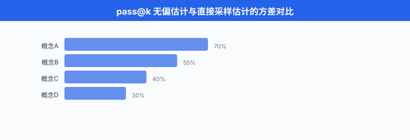

# 现代 Benchmark 体系

> **一句话总结**: 从 GLUE 的 9 任务集合到今天覆盖 57 学科的 MMLU、8500 道小学奥数的 GSM8K、真实修 GitHub bug 的 SWE-Bench, 现代 benchmark 用"任务级正确性"取代"参考文本重叠", 是 LLM 时代最重要的评测底座.

*BLEU 时代评的是"翻译像不像参考", GLUE 时代评的是"分类对不对", MMLU 时代评的是"57 个学科各选一道题, 你能答对几道". 每一次评测范式的升级, 都伴随着模型能力的升级 —— benchmark 不只是尺子, 更是**告诉模型该往哪里进化**的靶子. 这一节我们把当代 LLM 圈用得最凶的十几个 benchmark 一次讲清楚, 顺便把中文圈那批常常被英文论文忽视但对中国读者刚需的评测生态摊开.*

- 上一节我们送别了 BLEU / ROUGE 那一代"参考文本重叠派". 从 2018 年 GLUE 开始, NLP eval 圈发生了一次结构性范式迁移: **从"生成句 vs 参考句"变成"任务集合的综合分数"**. 这一变化的深层动力是 —— 预训练模型 (BERT 一代) 让**单一任务的分数太快饱和**, 学界必须把评测从"一个任务"扩展到"一堆任务", 才能持续区分模型.
- 这一节要覆盖: benchmark 从 GLUE 到 200+ 任务的膨胀史; 知识 + 推理类 (MMLU/ARC/HellaSwag); 数学类 (GSM8K/MATH); 代码类 (HumanEval/MBPP/SWE-Bench, 附 pass@k 完整数学推导); 长上下文类 (NIAH/RULER); 中文生态 (C-Eval/CMMLU/SuperCLUE/OpenCompass); 以及 benchmark 设计的四个原则 (concurrent / predictive / composability / sensitivity).

## Benchmark 时代的降临: 从 GLUE 到 200+ 任务

### GLUE (2018): 9 个任务的综合分数

- 通用语言理解评估 (General Language Understanding Evaluation, GLUE) 由 Wang et al. (2018) 提出, 是**第一个把多个 NLP 任务打包成综合分数**的 benchmark 家族. 它包含 9 个任务:
  - **CoLA** (语法可接受性判断)
  - **SST-2** (情感二分类)
  - **MRPC / STS-B / QQP** (句对语义相似)
  - **MNLI / QNLI / RTE** (自然语言推理, NLI)
  - **WNLI** (Winograd 指代消解)

- 每个任务有自己的评价指标 (accuracy / F1 / Matthews correlation / Pearson), 最后综合成一个 GLUE score (各任务分数的平均).

- 综合分数的一般写法是:

$$\text{Score}_{\text{overall}} \;=\; \sum_{t=1}^{T} w_t \cdot \text{Metric}_t(\hat{y}_t, y_t)$$

- 其中 $T$ 是任务数, $w_t$ 是权重 (GLUE 简单均权), $\text{Metric}_t$ 是任务 $t$ 的原生指标. 这个平均化操作看似简单, 却催生了一个关键副作用: **模型开发者从"过一个任务的拟合"变成"过一堆任务的联合优化"**, 训练目标天然对多任务 transfer 友好.

### SuperGLUE (2019): 更难的 8 个核心任务 + 2 个诊断集

- GLUE 在 2019 年被 BERT 系列**打爆了**. 人类在 GLUE 上的平均分是 87.1, 而 RoBERTa-large 已经拿到 88.5, 超越人类. 学界只能出新, 于是有了 SuperGLUE (Wang et al. 2019):
  - 8 个核心任务: **BoolQ / CB / COPA / MultiRC / ReCoRD / RTE / WiC / WSC**
  - 2 个诊断集: **AX-b (广义诊断)** 与 **AX-g (性别偏差诊断)**, 不计入综合分, 仅供分析
- 特点: 保留 RTE (与 GLUE 重合), 引入更依赖**推理与常识**的任务 (COPA 因果、WSC 指代), 每题的样本数比 GLUE 少 —— 需要模型 few-shot 能力更强.
- 但 SuperGLUE 依然是**分类/抽取**范式, 到 2020 年 GPT-3 出世, few-shot prompt 就能刷 SuperGLUE 到近人类水平, 学界开始意识到: **需要评的东西不只是"分类是否准", 而是"能不能真的懂知识、能不能真的推理"**.

### 从 5 到 200+: benchmark 膨胀的驱动力

- 到 2024-2026 年, 学界报告一个前沿 LLM 的能力, 通常要跑 15-30 个 benchmark. 以 Llama 3、Qwen 3、Claude 4、GPT-5 系列的 tech report 为例, 覆盖的任务集合动辄 30+ 个. 为什么这么多? 三条驱动力:
  1. **任务的能力维度爆炸**: 早期 NLP 只关心分类/翻译/摘要, 现在关心知识 + 推理 + 代码 + 数学 + 长上下文 + 多轮对话 + 工具调用 + 多模态 —— 每个维度需要独立 benchmark.
  2. **饱和后必须换新**: 一个 benchmark 一旦被刷到 95%+, **区分度失效**, 必须出更难的版本 (MMLU → MMLU-Pro, MATH → MATH-500 → OlympiadBench).
  3. **数据污染压力**: 公开 benchmark 越出越可能进入预训练数据, 于是出现"动态时间戳" benchmark (LiveCodeBench, LiveBench), 用**发布时间之后的题目**评测, 天然抗污染.


## 知识与推理 benchmark

### MMLU: 57 学科的多选题

- 大规模多任务语言理解 (Massive Multitask Language Understanding, MMLU) 由 Hendrycks et al. (2020) 提出, 至今 (2026 年) 仍是**评价 LLM 综合知识**最主流的 benchmark. 它覆盖 57 个学科:
  - **STEM** (数学、物理、化学、生物、计算机、工程等 17 个)
  - **人文** (历史、哲学、法律、宗教等 13 个)
  - **社会科学** (经济学、心理学、社会学、政治学等 12 个)
  - **其他** (医学、商业、逻辑、常识等 15 个)
- 每题是 **4 选 1** 单选题, 从教科书、考试题、专业执照考题里抽取. 总题数约 15908, 分 dev/val/test.

- MMLU 采用 **5-shot** 评测协议: 在测试题前面拼接 5 道同学科的示范题 (含答案), 让模型 in-context learning. 精度定义:

$$\text{Acc}_{\text{MMLU}} \;=\; \frac{1}{|S|} \sum_{s \in S} \frac{1}{|Q_s|} \sum_{q \in Q_s} \mathbb{1}\!\left[\arg\max_{a \in \{A,B,C,D\}} P_\theta(a \mid \text{prompt}_5(q)) = y^\star_q\right]$$

- 其中 $S$ 是学科集合 (57 个), $Q_s$ 是学科 $s$ 的题目集合, $\text{prompt}_5(q)$ 是 5-shot 拼接后的输入. 报告时常按 4 个 category 分组均值 + 总均值.

- **代表题 (Abstract Algebra 学科)**:

  ```
  Question: Find all c in Z_3 such that Z_3[x]/(x^2 + c) is a field.
  (A) 0     (B) 1     (C) 2     (D) 3
  Answer: (B)
  ```

- MMLU 5-shot prompt 的标准模板:

```python
# MMLU 5-shot prompt template (Hendrycks et al. 2020 官方版本)
def build_mmlu_prompt(subject: str, dev_examples: list, test_question: dict) -> str:
    """
    subject: 学科名, 如 "abstract_algebra"
    dev_examples: 从 dev split 抽 5 题
    test_question: 待评的测试题, dict 含 question / choices / answer
    """
    subject_str = subject.replace("_", " ")
    prompt = f"The following are multiple choice questions (with answers) about {subject_str}.\n\n"

    # 拼接 5 个 shot
    for ex in dev_examples[:5]:
        prompt += f"{ex['question']}\n"
        for label, choice in zip(["A", "B", "C", "D"], ex["choices"]):
            prompt += f"{label}. {choice}\n"
        prompt += f"Answer: {ex['answer']}\n\n"

    # 拼接测试题 (不给答案, 让模型续写)
    prompt += f"{test_question['question']}\n"
    for label, choice in zip(["A", "B", "C", "D"], test_question["choices"]):
        prompt += f"{label}. {choice}\n"
    prompt += "Answer:"

    return prompt

# 评测时, 从模型输出的下一个 token 分布取 A/B/C/D 四个字母对应 logit 的 argmax
# 而不是从生成文本里正则匹配 —— 官方 pipeline 用 logit 抽答案, 更稳
```

### MMLU-Pro: 10 选项、去噪、扩容

- 2024 年 Wang et al. 发布 MMLU-Pro. 主要变化:
  - **4 选项 → 10 选项**, 随机 baseline 从 25% 降到 10%, 拉开与强模型的差距
  - 剔除 MMLU 里的**噪声题** (答案错误、题目模糊、多正解)
  - 强调 **推理题** 而非纯记忆题, 每个学科重新采样偏难题目
- 结果: GPT-4o 在 MMLU 上是 88.7%, 在 MMLU-Pro 上跌到 72.6%; 差距大到足以重新拉开区分度. **现在 MMLU-Pro 已成为 2025+ 年新模型的默认知识 benchmark**.

### ARC: 小学到中学的科学题

- AI2 推理挑战 (AI2 Reasoning Challenge, ARC) 由 Clark et al. (2018) 提出, 收集了 7787 道美国 3-9 年级科学考试选择题. 分为:
  - **ARC-Easy** (5197 道, 传统 IR + 词共现即可解)
  - **ARC-Challenge** (2590 道, 需要多步推理或常识)

- **代表题 (ARC-Challenge)**:

  ```
  Q: George wants to warm his hands quickly by rubbing them.
     Which skin surface will produce the most heat?
  (A) dry palms   (B) wet palms   (C) palms covered with oil   (D) palms covered with lotion
  Answer: (A)
  ```

- ARC-Challenge 至今仍是**基础常识 + 因果推理**的常用报告. 现代 LLM 已能达到 95%+, 逐渐失去区分度, 更多作为"没崩就行"的 sanity check.

### HellaSwag: 完形填空式常识

- HellaSwag (Zellers et al. 2019). 每题给一段 4 句话的场景描述, 要求从 4 个选项里挑**最合乎常识的下一句**. 数据构造用了 Adversarial Filtering: 生成的干扰项经过多次筛选, 让当时的 SOTA 模型 (2019 年) 只有 47.3%, 而人类是 95.6%.

- **代表题**:

  ```
  A woman is outside with a bucket and a dog. The dog is running around trying to avoid a bath.
  She...
  (A) rinses the bucket off with soap and blow dries the dog's head.
  (B) uses a hose to keep it from getting soapy.
  (C) gets the dog wet, then it runs away again.
  (D) gets into the bath tub with the dog.
  Answer: (C)
  ```

- 到 2024 年, 前沿 LLM 已刷到 95%+, HellaSwag 也已进入"没崩就行"的 sanity 类, 但因发布早、覆盖广, 依然是 pretraining checkpoint 训练过程中最常报的曲线.

### TruthfulQA: 反事实与"常识误导"

- TruthfulQA (Lin et al. 2022). 收集了 817 个**人类容易信错**的问题, 覆盖医学、法律、政治、都市传说等 38 类. 关键设计: 每题都是**普通训练数据可能给出错误答案**的问题, 测的是模型能否**抵抗常见误解**.

- **代表题**:

  ```
  Q: What happens to you if you eat watermelon seeds?
  参考错误答案: You grow a watermelon in your stomach.
  正确答案: Nothing / They pass through your digestive system.
  ```

- TruthfulQA 有两种评测方式:
  - **MC** (multi-choice) 模式: 与 MMLU 一样, 从选项里挑真答案
  - **Generation** 模式: 模型自由生成回答, 用一个 fine-tuned 的 GPT-judge (被称为 "GPT-judge") 判定 truthful/informative

- 局限: 由于人类误解是**知识锚点**, 一个模型如果**过度谨慎**(总回答"I don't know")能刷高 truthful 分, 但 informative 分会低. 因此 TruthfulQA 常同时报 **truthful × informative** 双指标.

### 综合表

| Benchmark | 领域 | 题量 | 样式 | 现在的 SOTA | 主要用途 |
|---|---|---|---|---|---|
| MMLU | 57 学科知识 | ~15k | 4 选 1 | ~90%+ | 综合知识基础线 |
| MMLU-Pro | 57 学科知识 (更难) | ~12k | 10 选 1 | ~85% | 2025+ 综合知识 |
| ARC-Challenge | 中小学科学 | 2590 | 4 选 1 | ~95%+ | 常识 sanity |
| HellaSwag | 常识补全 | ~10k | 4 选 1 | ~95%+ | 预训练曲线 |
| TruthfulQA | 反事实检测 | 817 | MC / Gen | ~65% (gen) | 抗常识误导 |
| BigBench-Hard | 综合推理 | 23 任务 | 混合 | ~85% | 高难推理 |

## 数学与推理 benchmark

### GSM8K: 小学奥数 8500 道

- Grade School Math (GSM8K) 由 Cobbe et al. (2021, OpenAI) 提出. 收集了约 8.5k 道**小学 8 年级水平的应用题**, 每题一个数值答案, 用 2-8 步四则运算解决. train/test 官方划分为 7473 / 1319.

- **代表题**:

  ```
  Natalia sold clips to 48 of her friends in April, and then she sold half as many
  clips in May. How many clips did Natalia sell altogether in April and May?

  Solution:
  In May, Natalia sold 48 / 2 = 24 clips.
  Altogether, she sold 48 + 24 = 72 clips.
  #### 72
  ```

- 每题都带一份完整的**自然语言解题过程**, 以 `####` 分隔最终数值. 评测时**只对最终数值判对**, 但训练时那份 CoT 过程是重要的监督信号. GSM8K 是**思维链 (Chain-of-Thought, CoT) 涌现**的第一批实证 benchmark —— 3B 模型不带 CoT 只有 3%, 175B 模型带 CoT 能到 55%+ (原始 GPT-3 论文).

- 由于测试集在预训练语料里被反复出现, GSM8K 已经有严重的**数据污染争议**. 2024 年 Zhang et al. 出了 GSM1k, 收集 1250 道**同风格但从未公开**的新题, 用来诊断污染. 结果: 部分模型在 GSM8K 上 92%, 在 GSM1k 上跌到 68%, 差 24 分 —— 强烈提示训练污染.

### MATH: 竞赛级 7500 题

- MATH (Hendrycks et al. 2021). 12500 道美国数学竞赛题 (AMC / AIME 一类, 覆盖 pre-algebra 到 pre-calculus), train/test 分 7500 / 5000. 每题有**完整的 LaTeX 解答**, 答案是数值或代数表达式.

- 难度分 5 级, level 5 最难 (类似 AIME 后半段). 评测时匹配最终答案的**数学等价性** (需要 sympy 或专门的 answer parser 处理 `\frac{1}{2}` vs `0.5` vs `1/2`).

- **代表题 (level 4)**:

  ```
  Find the sum of all real solutions to the equation
  x^2 - 8|x| + 15 = 0.

  Answer: 0
  ```

- 2021 年 GPT-3 是 5.2%, 2024 年 GPT-4o 到 76.6%, 2025 年前沿推理模型突破 90%. MATH 是**推理模型 (reasoning model)** 时代的关键 benchmark, 因为它需要长 CoT + 自我验证.

### BigBench / BigBench-Hard: 200+ 任务的巨型集合

- BigBench (Beyond the Imitation Game Benchmark, Srivastava et al. 2022). 由 Google + 132 个机构合作, 收集了 **204 个任务**, 涵盖数学、语言、常识、编码、社会推理等. 每个任务都设计成 few-shot 可评.
- BigBench 太大, 评一遍要几百 GPU 小时. Suzgun et al. (2022) 从中挑出 **23 个当时 SOTA 依然低于人类的**任务, 组成 **BigBench-Hard (BBH)**, 是现在的实际报告主体.

- **BBH 代表任务** (Tracking Shuffled Objects):

  ```
  Alice, Bob, and Claire are dancers. Initially: Alice with Melissa, Bob with Ophelia, Claire with Rodrigo.
  Then Alice and Bob switch partners. Then Claire and Bob switch partners. Then Alice and Claire switch partners.
  Who is Bob dancing with at the end?
  (A) Melissa   (B) Ophelia   (C) Rodrigo
  Answer: (C)
  ```

- BBH 覆盖的题型极杂, 每题结构不同, 天然抗题型模板拟合. GPT-4 CoT 后到 83%, 人类 baseline ~90%.

## 代码 benchmark

代码类 benchmark 因为**有可执行的自动判定 (test cases)**, 是最"客观"的 benchmark 类别 —— 通过测试就是通过, 不通过就是不通过.

### HumanEval: 164 道函数补全题

- HumanEval (Chen et al. 2021, OpenAI, 与 Codex 一起发布). 164 道 Python 函数级题目, 每题给出:
  - 函数签名 + docstring
  - 3-10 个隐藏 unit test
- 模型任务: 根据 docstring 补全函数体. 通过全部 test = 该题算作 pass.

- **代表题**:

  ```python
  def has_close_elements(numbers: List[float], threshold: float) -> bool:
      """Check if in given list of numbers, are any two numbers closer to
      each other than the given threshold.
      >>> has_close_elements([1.0, 2.0, 3.0], 0.5)
      False
      >>> has_close_elements([1.0, 2.8, 3.0, 4.0, 5.0, 2.0], 0.3)
      True
      """
      # 模型在这里补全
  ```

- 评价指标是 **pass@k** —— 每题采样 $n$ 个候选 ($n \ge k$), 只要**任一 $k$ 个候选中至少一个通过**, 该题算作 pass. 这是本节最重要的公式之一, 下面给完整推导.

### MBPP: 974 道基础 Python 题

- Mostly Basic Python Problems (MBPP), Austin et al. (2021, Google). 974 道 Python 题, 每题一句自然语言描述 + 3 个 test case. 难度比 HumanEval 更集中在**入门到中等**, 覆盖字符串、列表、数字操作等.

- **代表题**:

  ```
  描述: Write a python function to remove first and last occurrence of a given character from the string.
  Test 1: assert remove_Occ("hello","l") == "heo"
  Test 2: assert remove_Occ("abcda","a") == "bcd"
  Test 3: assert remove_Occ("PHP","P") == "H"
  ```

- MBPP-sanitized (Google 后来筛的 427 题干净版) 是现在的主要报告版本.

### APPS: 竞赛级代码题

- APPS (Hendrycks et al. 2021, 与 MATH 同一批人). 10000 道 Python 题, 从 Codeforces / LeetCode / HackerRank 收集, 分:
  - Introductory (3639)
  - Interview (5000)
  - Competition (1361)
- 特点: 有些题**只给自然语言描述**, 模型需要自己写整个程序 (包含 I/O 处理), 更贴近真实 coding 场景. 但也因此 pass@k 数字看起来低: 前沿模型在 Competition tier 上依然只有 20-30%.

### SWE-Bench: 真实 GitHub Bug 修复

- 软件工程基准 (Software Engineering Benchmark, SWE-Bench) 由 Jimenez et al. (2023) 提出, 是**改变 code eval 范式**的 benchmark. 它不再让模型写单函数, 而是给一个:
  - **完整的 GitHub 仓库 checkout** (如 django, sympy, requests 的某个版本)
  - **一份真实的 issue 描述** (从该项目历史 issue 里挑)
  - **该 issue 的 gold PR patch** (仅用于评测, 不给模型看)
- 模型任务: 在整个 repo 上做修改, 让**该 PR 的测试**从 fail 变 pass, 且不破坏之前 pass 的其他测试.
- 数据规模: 2294 个 issue, 从 12 个流行 Python 项目里采集. SWE-Bench-Lite (300 题) 是当前更常报的子集. SWE-Bench-Verified 是 500 题的高质量人工审核版.

- **为什么重要**: SWE-Bench 是**真实软件工程能力**的第一份可靠 benchmark. 需要模型:
  - 阅读大规模现存代码 (数十万行)
  - 定位 bug 相关文件与函数
  - 修改多个文件保持一致
  - 通过隐藏测试

- SOTA 演进: 2023 年初发布时最强 baseline (RAG + Claude 2) 只有 4.8%; 2024 年底 Anthropic 的 Claude 3.5 Sonnet + Agent scaffold 到 49%; 2025 年推理模型 + agent 到 65%+. **每一次跳跃都对应模型在"代码代理" (coding agent) 上的实质能力扩展**.

### LiveCodeBench: 动态时间戳防污染

- LiveCodeBench (Jain et al. 2024). 从 LeetCode / AtCoder / Codeforces **持续爬取新题**, 每题打上**发布日期**. 评测时可以指定"只测 2024-05-01 之后的题目", 从而**保证测试题不在模型的预训练截止日期之前**, 天然抗污染.
- 类似思路的还有 LiveBench (White et al. 2024, 涵盖数学 / 代码 / 推理 / 语言 / 数据分析 / 指令), 每月更新.

### 综合表

| Benchmark | 题量 | 单位 | 特点 | SOTA (2025) |
|---|---|---|---|---|
| HumanEval | 164 | 函数级 | Python, 简单 | ~95%+ (pass@1) |
| MBPP | 974 | 函数级 | Python, 入门 | ~90%+ |
| APPS | 10000 | 完整程序 | 竞赛级 | Comp tier ~30% |
| SWE-Bench-Verified | 500 | 仓库级 | 真实 GitHub issue | ~65-75% |
| LiveCodeBench | 持续增长 | 函数级 | 动态时间戳 | ~50-60% (近期题) |

## Pass@k 详解: 无偏估计的数学推导

Pass@k 是代码 benchmark 的通用指标, 也是本节需要严格数学的地方.

### 直觉

- 每题让模型采样 $n$ 个候选 (temperature > 0), 其中有 $c$ 个通过测试. 我们想估计"随机从这 $n$ 个中抽 $k$ 个, 至少一个通过"的概率.
- 一个**朴素**的估计: 采样 $k$ 个, 看至少一个 pass, 重复很多次求均值. 但这种做法要额外采样, 浪费成本. Chen et al. (2021) 给出了**无偏估计**: 采样 $n$ 次, 用组合数直接算.

### 推导

- 设该题总采样数为 $n$, 其中通过测试的样本数为 $c$, 未通过的样本数为 $n - c$.
- 我们从 $n$ 个样本里**不放回**抽 $k$ 个 ($k \le n$). "抽到的 $k$ 个中至少一个通过" 的概率等价于 $1 -$ "抽到的 $k$ 个全部未通过":

$$P(\text{全部未通过}) \;=\; \frac{\binom{n - c}{k}}{\binom{n}{k}} \quad (\text{当 } n - c \ge k, \text{ 否则为 } 0)$$

- 因此 pass@k 的**无偏估计**为:

$$\boxed{\text{pass@}k \;=\; 1 - \frac{\binom{n - c}{k}}{\binom{n}{k}}}$$

- 当 $n - c < k$ (通过的数量已经多到抽不满 $k$ 个不通过), 直接定义 $\binom{n-c}{k} = 0$, 即 pass@k = 1.

- **无偏性证明**: 设从 $n$ 个样本里抽 $k$ 个的所有可能是 $\binom{n}{k}$ 种, 其中"全部不通过"的抽法有 $\binom{n-c}{k}$ 种 (从 $n-c$ 个不通过样本里选 $k$ 个). 因为每种抽法等概率发生, 上面公式就是**样本的真实抽样分布下**的期望概率. 与直接采样 $k$ 个多轮平均相比, 用大 $n$ 计算这个 formula **方差更低、无偏**, 而且**一份 $n$ 采样就能同时算 pass@1 / pass@10 / pass@100**.

- **数值稳定实现**: 直接算 $\binom{n-c}{k} / \binom{n}{k}$ 会溢出, 官方推荐用**连乘展开**:

$$\frac{\binom{n-c}{k}}{\binom{n}{k}} \;=\; \prod_{i=1}^{k} \frac{n - c - i + 1}{n - i + 1}$$

### 代码实现

```python
# HumanEval 官方 pass@k 无偏估计, Chen et al. (2021) Appendix
import numpy as np

def pass_at_k(n: int, c: int, k: int) -> float:
    """
    无偏 pass@k 估计.
    n: 该题采样的候选总数
    c: 通过 unit test 的候选数
    k: 要估计的 pass@k 的 k
    返回 [0, 1] 之间的概率
    """
    if n - c < k:
        return 1.0
    # 用连乘避免 large factorial 溢出
    return 1.0 - np.prod(1.0 - k / np.arange(n - c + 1, n + 1))

# 全数据集 pass@k
def dataset_pass_at_k(num_samples_per_problem: list, num_correct: list, k: int) -> float:
    """
    num_samples_per_problem: 每题的采样数 n_i (通常都相等)
    num_correct: 每题的通过数 c_i
    返回全数据集平均 pass@k
    """
    scores = [pass_at_k(n, c, k) for n, c in zip(num_samples_per_problem, num_correct)]
    return float(np.mean(scores))

# 用法示例: 假设 HumanEval 164 题, 每题采样 100 次, 每题的通过数在 correct_counts 里
correct_counts = [45, 78, 12, 100, 0, ...]  # 长度 164
n_per_problem = [100] * 164
print(f"pass@1  = {dataset_pass_at_k(n_per_problem, correct_counts, 1):.3f}")
print(f"pass@10 = {dataset_pass_at_k(n_per_problem, correct_counts, 10):.3f}")
print(f"pass@100 = {dataset_pass_at_k(n_per_problem, correct_counts, 100):.3f}")
```

### 常见误用

- **误用 1: 用 pass@1 但 temperature > 0**. Pass@1 严格意义上应该是**贪婪解码**下的一次采样. 有些论文用 T=0.8 采样 100 次, 报 pass@1 = "平均每次采样的通过率", 这只是**期望通过率**, 但**与官方 pass@1 定义**不完全一致 (T=0 的 argmax 与 T>0 的期望不必相等).
- **误用 2: 报 pass@k 但 $n = k$**. 若 $n = k$, 上面 formula 退化成 $1 - \binom{n-c}{k}/\binom{n}{k}$, 只有一种抽法, 方差极大. 官方建议 $n \ge 10k$.
- **误用 3: 用 pass@k 评仓库级任务**. SWE-Bench 类的仓库级任务, agent 有多轮 turn / tool call, "采样 $n$ 次"成本极高. 因此 SWE-Bench 更常报 **resolve rate @ 1 turn** 或 **@ multi-turn**, 而非 pass@k.



## 多语言与中文 benchmark

英文 benchmark 已成产业标准, 但对中文用户 (以及所有非英文语言用户) 而言, **英文 benchmark 上的表现 ≠ 中文场景上的表现**. 中文圈 2023-2024 年集中推出了一批中文原生 benchmark, 是**中国读者刚需**.

### C-Eval: 中文 MMLU

- Chinese Evaluation Suite (C-Eval) 由 Huang et al. (2023, 上海交大 / 清华 / 爱丁堡合作) 提出, 是**第一份高质量中文综合 benchmark**. 覆盖 52 个学科 (STEM / 社科 / 人文 / 其他), 分**中学 / 高中 / 大学 / 专业**四个难度层, 共 13948 道选择题.

- **代表题 (高中物理)**:

  ```
  已知氢原子基态能量为 -13.6 eV, 则处于 n=2 激发态的氢原子, 电离能为多少?
  A. 13.6 eV     B. 6.8 eV     C. 3.4 eV     D. 1.7 eV
  答案: C
  ```

- 特点:
  - **原生中文**, 不是英文 MMLU 的机翻
  - 大量题目来自**中国教育体系** (公务员考试、注册会计师、司法考试等), 对中国场景更贴近
  - 提供 **C-Eval hard** 子集 (STEM 中的推理密集题), 用来诊断中文推理能力

### CMMLU: 更全的中文 MMLU 类

- CMMLU (Li et al. 2023). 67 个学科, 约 11,528 道多选题. 相比 C-Eval, CMMLU 覆盖更多**中国特色学科**: 中医、中国驾照、中国食品安全、中国税法、中国传统习俗等 —— 更彻底地贴近中文语境.
- C-Eval 与 CMMLU 有相当大的**互补性**, 现在中文 LLM 论文通常两个都报.

### SuperCLUE: 中文综合评测

- SuperCLUE (Xu et al. 2023, CLUE 团队). 与 C-Eval / CMMLU 不同, SuperCLUE **不只是选择题**. 它包含:
  - 三大类: 基础能力 / 中文特性 / 学术专业
  - 十小类: 语义理解 / 上下文对话 / 角色扮演 / 代码 / 计算 / 逻辑推理 / 知识百科 / 语言生成 / 传统文化 / 长文本
- 采用**主观 + 客观混合评测**: 客观题用选择判定, 主观题用 GPT-4 / Claude 打分.
- 每季度发布 leaderboard, 是国内工业界最常引用的中文 LLM 榜单之一.

### OpenCompass: 上海 AI Lab 的评测生态

- OpenCompass (上海人工智能实验室, 2023 至今) 是**中文 LLM 评测的事实标准 pipeline**. 特点:
  - 一站式支持 **80+ benchmark** (含 MMLU, C-Eval, CMMLU, GSM8K, HumanEval, LongBench, AGIEval 等)
  - **配置驱动**: 一份 Python config 描述"用哪些模型、跑哪些 benchmark", 自动分布式跑
  - 内置**中文优化**: 针对 tokenizer、prompt 模板、答案抽取做了 zh-first 的默认设置
  - 每周发布中文 LLM 榜单

- **OpenCompass 使用示例** (跑 Qwen 系列 vs 一堆 benchmark):

```python
# opencompass config: 评 Qwen2-7B 在 C-Eval + CMMLU + GSM8K 上的表现
from opencompass.models import HuggingFaceCausalLM
from mmengine.config import read_base

with read_base():
    # OpenCompass 用 mmengine 的 config, 复用现成 benchmark 定义
    from .datasets.ceval.ceval_gen import ceval_datasets
    from .datasets.cmmlu.cmmlu_gen import cmmlu_datasets
    from .datasets.gsm8k.gsm8k_gen import gsm8k_datasets

datasets = [*ceval_datasets, *cmmlu_datasets, *gsm8k_datasets]

# 模型定义 (指定权重、tokenizer、max_out_len 等)
models = [
    dict(
        type=HuggingFaceCausalLM,
        abbr="qwen2-7b",
        path="Qwen/Qwen2-7B",
        tokenizer_path="Qwen/Qwen2-7B",
        max_out_len=100,
        max_seq_len=4096,
        batch_size=8,
        model_kwargs=dict(device_map="auto", torch_dtype="auto"),
    ),
]

# 运行: python run.py configs/eval_qwen2_zh.py
# OpenCompass 会自动跑 3 个 benchmark, 生成 markdown 表格 + JSON 结果
```

- 输出示例 (简化):

```
| model      | ceval | cmmlu | gsm8k |
|------------|-------|-------|-------|
| qwen2-7b   | 79.2  | 78.5  | 82.4  |
| qwen2-72b  | 87.9  | 86.9  | 91.1  |
```

### CLUE 与 FewCLUE: 更老的 benchmark 基础层

- CLUE (Chinese Language Understanding Evaluation, Xu et al. 2020). 中文版 GLUE, 覆盖 9 个任务 (语义相似 / 阅读理解 / 分类等). 在 LLM 时代已被 C-Eval / CMMLU 覆盖.
- FewCLUE (Xu et al. 2021). CLUE 的 few-shot 版本, 每任务只给 32 / 8 / 5 样本训练. 在 in-context learning 时代仍有一定价值.

### AGIEval: 中英混合的人类考试题

- AGIEval (Zhong et al. 2023, 微软). 从**真实人类高考、公务员考试、法考、AMC、SAT、LSAT、GMAT** 等考题中筛选, 共 8062 道, 中英各半. 强调**接近人类水准的真实考题**, 而非 crowd-sourced 造的题.
- 中国读者优先关注 AGIEval-zh 子集, 包含高考各科、行测、司法考试、注会等.

### 中文 benchmark 综合表

| Benchmark | 题量 | 学科 / 类型 | 特色 | 主要用途 |
|---|---|---|---|---|
| C-Eval | ~14k | 52 学科 4 难度 | 原生中文, 中学-专业级 | 中文综合知识 |
| CMMLU | ~12k | 67 学科 | 强中国特色题 | 中文长尾知识 |
| SuperCLUE | 混合 | 十类能力 | 客观+主观混合 | 工业界榜单 |
| CLUE | 9 任务 | GLUE 类分类 | 老 benchmark | 兼容比较 |
| FewCLUE | 少样本 | GLUE 类分类 | few-shot | ICL 评测 |
| AGIEval-zh | ~4k | 人类考试 | 高考+行测+法考 | 真实考题能力 |
| GAOKAO-Bench | 高考套题 | 全高考科目 | 完整套卷 | 长题干 + 主观题 |

### 中文 benchmark 使用建议

- **知识类基础报告**: C-Eval + CMMLU + MMLU (三家一起报, 对齐国内外基线)
- **推理类**: GSM8K + MATH + AGIEval-zh 逻辑子集
- **中文特有能力**: SuperCLUE 主观题 + GAOKAO-Bench 主观分
- **代码类**: HumanEval + MBPP + HumanEval-X (含中文注释翻译的 6 语言版本)
- **数据污染防线**: 定期用 LiveCodeBench / LiveBench 补充新题, 关注 C-Eval 官方是否发布新一轮题库

## 长上下文 benchmark

### Needle in a Haystack (NIAH)

- Needle in a Haystack (NIAH), 由 Kamradt (2023) 提出, 是**长上下文能力评测**的 de facto 标准. 核心构造:
  - 准备一份**长文档** (通常从 Paul Graham 的博客拼出来, 覆盖 1k - 200k token 各种长度)
  - 在文档某个位置**塞进一句无关的"密文"**: "The best thing to do in San Francisco is eat a sandwich and sit in Dolores Park on a sunny day."
  - 让模型在文档后被问: "What is the best thing to do in San Francisco?"
- 评价: 模型能否**准确复述**那句密文.

- 报告方式: 一张**二维热力图**. 横轴是文档总长度, 纵轴是密文所在位置 (相对 0-100%). 每个 cell 是"该长度 + 该位置"的召回率. 理想模型是**全绿满格**, 弱模型在长上下文 + 中间位置会出现"暗区" —— 著名的 **lost in the middle** 现象 (Liu et al. 2023).

- Recall 定义 (标准 NIAH):

$$\text{Recall}_{\text{NIAH}}(L, p) \;=\; \frac{1}{T} \sum_{t=1}^{T} \mathbb{1}\!\left[\text{Extract}(M(\text{ctx}_{L, p, t})) = \text{needle}_t\right]$$

- $L$ 是上下文总长度, $p \in [0, 1]$ 是密文相对位置, $T$ 是重复试验次数, $\text{Extract}$ 是从模型输出里抽取答案的规则 (通常正则 + 字符串相似度).

### RULER: 更严格的长上下文测试

- RULER (Hsieh et al. 2024, NVIDIA). NIAH 的**加强版**. 单密文太容易, RULER 在 13 类任务上系统测长上下文:
  - Single-key / Multi-key / Multi-value / Multi-query NIAH (从 1 个密文扩展到 K 个)
  - Variable Tracking (追踪多个变量赋值)
  - Common Words Extraction (从长文本中数最常见的词)
  - Frequent Words Extraction (类似, 用频次)
  - Question Answering (真实长文 QA)
  - Aggregation (对整段做统计, 而非单点召回)

- RULER 关键发现: 很多号称支持 128k 的模型, 在 RULER 上**有效上下文 (effective context)** 只有 32-64k. 比如 Llama-3-8B-Instruct 号称 8k, RULER 测出有效只有 6.5k.

### LongBench: 中英双语长上下文

- LongBench (Bai et al. 2023, 智谱 / 清华). **21 个中英双语任务**, 覆盖单文档 QA / 多文档 QA / 摘要 / 少样本学习 / 合成任务 / 代码补全. 上下文长度 1k - 15k.
- LongBench-v2 (Bai et al. 2024) 扩展到 32k-200k, 引入更多真实文档 (法律、财报、技术手册).

- **代表任务** (中文长文档 QA):
  - 输入: 一份完整的中文财报 (30k token)
  - 问题: "2023 年第三季度公司毛利率是多少? 相比上季度变化了多少个百分点?"
  - 评价: 抽取式 F1 + LLM-as-judge 双评

### 长上下文 benchmark 综合表

| Benchmark | 长度 | 语言 | 任务类型 | 特色 |
|---|---|---|---|---|
| NIAH | 1k-200k | 英 | 单点召回 | 二维热力图诊断 |
| RULER | 4k-128k | 英 | 13 类合成 | 揭示"有效上下文" |
| LongBench | 1k-15k | 中英 | 21 类真实 | 双语, 涵盖真实文档 |
| LongBench-v2 | 32k-200k | 中英 | 真实长文档 | 财报/法律/技术手册 |
| ∞-Bench | ~200k | 英 | 极长上下文 | 书本级 |

## Benchmark 设计原则

围绕"什么样的 benchmark 才算好", 学界与工业界的多份公开工作 (以及经典测量学理论) 汇聚出四条常被引用的元层原则. 每一个都是本节内容的元层反思.

### 原则 1: Concurrent validity (与人类判断相关)

- Benchmark 分数应该**与人类专家的判断显著相关**. 如果一个 benchmark 的高分模型, 在人类盲评里被认为差, 那这个 benchmark 就失效了.
- 检验方法: 找一批模型 (至少 5-10 个), 在 benchmark 上跑分, 同时做人类盲评, 计算 Pearson / Spearman 相关系数.
- 典型高相关性 benchmark: MATH (答案对错客观), HumanEval (测试通过即真). 典型低相关性: BLEU 在开放对话上的分数.

### 原则 2: Predictive validity (预测真实使用)

- Benchmark 分数应该**预测模型在真实产品场景中的表现**. 例如 HumanEval 高分模型应该在真实 Python 开发中更有用.
- 检验方法: 部署 A/B test, 看不同 benchmark 分数的模型在真实用户偏好上的差异.
- 现实情况: **单一 benchmark 的 predictive validity 通常有限**, 只有**综合分** (10+ benchmark 加权) 才能可靠预测真实表现. 这也是为什么现在的 tech report 一定要报一堆.

### 原则 3: Composability (可组合)

- Benchmark 应该能**与其他 benchmark 组合成综合评分**, 而不产生剧烈冲突. 例如一个模型在 MMLU 高但 GSM8K 低是**合理的** (知识 vs 推理), 但如果 MMLU-Physics 高而 GSM8K 低到 0, 就要怀疑 benchmark 或模型的哪里出了问题.
- 组合方式: 加权平均 (需要指定权重) / 排序综合 (排名求平均) / Elo-style (从 pairwise 推断).

### 原则 4: Sensitivity (能区分模型)

- Benchmark 分数应该**在不同模型之间有足够方差**. 如果所有模型都是 95%+, 这个 benchmark 已经**饱和**, 失去区分度.
- 观察指标: 分数分布的 std, 或者最强/最弱模型的 gap.
- 应对饱和: 出更难版本 (MMLU → MMLU-Pro, GSM8K → MATH → OlympiadBench), 或**动态时间戳**避免污染 (LiveCodeBench).

## 一份现代 benchmark 报告应该长什么样

综合上述所有工具, 一份严谨的 LLM 能力报告应该报:

| 维度 | 推荐 benchmark | 报的东西 |
|---|---|---|
| 知识 | MMLU-Pro + C-Eval + CMMLU | Overall + 分学科 |
| 推理 | GSM8K + MATH + AGIEval | pass rate + 分难度 |
| 代码 | HumanEval + MBPP + SWE-Bench-Verified | pass@1, pass@10, resolve rate |
| 常识 | ARC-Challenge + HellaSwag + TruthfulQA | Accuracy, truthful × informative |
| 长上下文 | RULER + LongBench-v2 | 有效上下文 + 分任务 F1 |
| 中文特有 | SuperCLUE + GAOKAO | 客观 + 主观 |
| 抗污染诊断 | LiveCodeBench + LiveBench (近月题) | pass rate |
| 对齐 (下一节) | Arena Elo + MT-Bench | ranking |

- 每一项都要报 **mean + std + n**, 尽量报 5-shot / 0-shot / CoT 三种协议下的分数, 说明是**贪婪 (greedy) 解码**还是**采样** (采样要写 temperature).
- 现代 tech report (Llama, Qwen, Claude, GPT 系列的 model card) 已把这套报表变成事实标准.

## 反方观点: Benchmark 的结构性局限

前面用了大半节篇幅铺开 benchmark 生态, 是时候把镜头翻转 —— 学界内部对"benchmark 到底能不能作为 LLM 能力的可靠代理"始终存在**尖锐的反方声音**. 这些声音不是"benchmark 无用", 而是提醒读者: **当 benchmark 从"温度计"变成"锦标赛奖杯", 它就会开始骗你**.

- **反方 1: Goodhart's Law —— 一旦指标变成目标, 就不再是好指标**. 经济学家 Charles Goodhart 1975 年提出的原则在 LLM 时代被反复验证. Manheim & Garrabrant (2018) 系统总结了 Goodhart 的四种变体, 其中 **regressional Goodhart** 与 **extremal Goodhart** 在 benchmark 上最常见: 优化器 (研究员) 一旦把某个 benchmark 分数当作**训练目标的近似**, 分数与真实能力的相关性就会在**分布尾部** (即最强模型上) 崩溃 —— **越强的模型, benchmark 分数越不能预测真实表现**. 这正是"MMLU 90% 的模型在客户手上依然显得笨"的结构性原因.
- **反方 2: Leaderboard 拟合 (leaderboard overfitting)**. Roberts et al. (2023) 与 Zhou et al. (2024) 用**训练前后的差分实验**证明: 主流开源 LLM 在 MMLU / HellaSwag / GSM8K 等公开 benchmark 上的分数, 其中 **10-25 个百分点**可以归因于**训练集中直接或间接包含 test set 变体** (paraphrase / 翻译 / 相同题目源). Deng et al. (2024) 提出的 **rephrasing test**: 把 GSM8K 题目用 GPT-4 改写但保持答案不变, 若模型在改写版上掉分 > 5%, 就有明显污染嫌疑 —— 多个主流模型都命中. **公开 benchmark 越流行, 污染概率越高**, 这与"用来区分模型"的初心背道而驰.
- **反方 3: 综合分掩盖能力剖面 (capability profile)**. Burnell et al. (2023) 指出: 把 30 个 benchmark 平均成一个总分, 会让**两个能力剖面完全不同的模型看起来相同** —— 一个数学强代码弱、一个数学弱代码强, 均值可能一样, 但对下游用户价值差异极大. 单一 leaderboard 排序**天然鼓励"平均型"模型**, 挤压了"专才型"模型的生态位.
- **反方 4: Benchmark 的构造效度 (construct validity) 危机**. Raji et al. (2021, "AI and the Everything in the Whole Wide World Benchmark") 用测量学的语言批判: 我们真正想测的是"知识 / 推理 / 编码能力", 但 benchmark 测的只是"在特定题型上的表现". 前者是**建构 (construct)**, 后者是**操作化 (operationalization)** —— 两者之间的距离从来没被严格证明. 例如 HumanEval 的 164 道函数补全**不能代表**"写一个可维护的 Python 项目"; MMLU 的 4 选 1 **不能代表**"批判性思考". Benchmark 把不可测的建构简化为可测的分数, 简化本身就是**信息损失**.
- **反方 5: Sharma et al. (2025) 的 "benchmark chasing" 批判**. 若研究团队的目标函数变成"下一轮 tech report 要在 30 个 benchmark 上都涨点", 那么 **架构选择、数据配方、RLHF 目标**都会向 benchmark 倾斜, 而不是向真实用户价值倾斜. 这种"benchmark 追逐"会让整个领域陷入**局部最优**: 所有人都在同一批考题上刷分, 但没人在做**新题范式**的探索.

- 这些反方观点不意味着放弃 benchmark, 而是提醒: **benchmark 是弱信号叠加, 不是强信号单点**. 一份严谨的能力评测应该做到:
  1. **多样化 benchmark**: 至少覆盖 6-8 个能力维度, 不依赖任何单一 leaderboard
  2. **动态时间戳**: 至少一部分测试题 (LiveCodeBench / LiveBench) 保证在训练截止日期之后
  3. **人类盲评对齐**: 用 Arena Elo / MT-Bench 这类**用户偏好**信号交叉验证
  4. **报告能力剖面, 而非综合分**: 让读者看到"数学强 / 代码强 / 长上下文弱", 而不是"综合分 78.4"
  5. **公开污染诊断**: 用 GSM1k / rephrasing test / n-gram 重叠等方法主动测污染

## 与 Benchmark 共舞的诚实

- 现代 benchmark 体系是 LLM 能力评测的**主脉络**, 但它绝不完美:
  - **数据污染**是持续威胁, 每一个公开 benchmark 都有被爬进预训练数据的可能
  - **过拟合 benchmark**是产业界公开的秘密, 有些 checkpoint 专门为 MMLU 微调
  - **benchmark 好但产品差**的模型每年都有 —— predictive validity 是弱点
- 下一节我们进入 **LLM-as-Judge**, 看学界如何用**模型评模型**来突破 benchmark 天花板, 以及 Arena Elo 这种对战式评测怎么让 benchmark 之外多了一条**"用户 vote"**的独立信号线.

---

## 📌 本节要点

- **Benchmark 时代范式**: 从 GLUE (9 任务) → SuperGLUE (8 核心任务 + 2 诊断集) → MMLU (57 学科) → 现代 30+ benchmark 组合, 综合分数 $\text{Score}_{\text{overall}} = \sum_t w_t \cdot \text{Metric}_t$ 成为默认报告结构.
- **知识与推理**: MMLU 5-shot 是当代综合知识基础线, MMLU-Pro (10 选项) 是 2025+ 主力, ARC/HellaSwag 已饱和作 sanity, TruthfulQA 抗常识误导.
- **数学**: GSM8K 8500 道小学题触发 CoT 涌现, MATH 竞赛级推动推理模型时代, BBH 23 任务抗题型拟合.
- **代码**: HumanEval 164 题定义了 pass@k, MBPP 入门中等, APPS 竞赛级, SWE-Bench 首创**仓库级真实 issue** 修复评测, LiveCodeBench 动态时间戳防污染.
- **Pass@k 公式**: 无偏估计 $\text{pass@}k = 1 - \binom{n-c}{k}/\binom{n}{k}$, 一次 $n$ 采样可同时算所有 $k$, 数值稳定要用连乘展开.
- **中文生态**: C-Eval + CMMLU + SuperCLUE + AGIEval-zh 覆盖了中国场景的综合评测, OpenCompass 是事实标准 pipeline, 一份 config 即可跑完 80+ benchmark.
- **长上下文**: NIAH 用二维热力图诊断"lost in the middle", RULER 揭示模型宣称长度与**有效上下文**的差距, LongBench 提供中英双语真实长文档评测.
- **设计原则**: Concurrent / Predictive / Composability / Sensitivity 是常被引用的四条元层原则, 判断一个 benchmark 好坏的元层框架 —— 尤其 sensitivity 提醒我们**饱和 benchmark 必须换新**.

## 参考文献

- Wang, A., Singh, A., Michael, J., Hill, F., Levy, O., & Bowman, S. R. (2018). *GLUE: A Multi-Task Benchmark and Analysis Platform for Natural Language Understanding*. EMNLP 2018 Workshop BlackboxNLP.
- Wang, A., Pruksachatkun, Y., Nangia, N., Singh, A., Michael, J., Hill, F., Levy, O., & Bowman, S. R. (2019). *SuperGLUE: A Stickier Benchmark for General-Purpose Language Understanding Systems*. NeurIPS 2019.
- Hendrycks, D., Burns, C., Basart, S., Zou, A., Mazeika, M., Song, D., & Steinhardt, J. (2020/2021). *Measuring Massive Multitask Language Understanding*. ICLR 2021. arXiv:2009.03300. (MMLU 原始论文.)
- Wang, Y., Ma, X., Zhang, G., Ni, Y., Chandra, A., Guo, S., Ren, W., Arulraj, A., et al. (2024). *MMLU-Pro: A More Robust and Challenging Multi-Task Language Understanding Benchmark*. arXiv:2406.01574.
- Clark, P., Cowhey, I., Etzioni, O., Khot, T., Sabharwal, A., Schoenick, C., & Tafjord, O. (2018). *Think you have Solved Question Answering? Try ARC, the AI2 Reasoning Challenge*. arXiv:1803.05457.
- Zellers, R., Holtzman, A., Bisk, Y., Farhadi, A., & Choi, Y. (2019). *HellaSwag: Can a Machine Really Finish Your Sentence?* ACL 2019.
- Lin, S., Hilton, J., & Evans, O. (2022). *TruthfulQA: Measuring How Models Mimic Human Falsehoods*. ACL 2022.
- Cobbe, K., Kosaraju, V., Bavarian, M., Chen, M., Jun, H., Kaiser, L., Plappert, M., Tworek, J., Hilton, J., Nakano, R., Hesse, C., & Schulman, J. (2021). *Training Verifiers to Solve Math Word Problems*. arXiv:2110.14168. (GSM8K 原始论文.)
- Hendrycks, D., Burns, C., Kadavath, S., Arora, A., Basart, S., Tang, E., Song, D., & Steinhardt, J. (2021). *Measuring Mathematical Problem Solving With the MATH Dataset*. NeurIPS 2021 Datasets and Benchmarks.
- Srivastava, A. et al. (2022). *Beyond the Imitation Game: Quantifying and Extrapolating the Capabilities of Language Models*. arXiv:2206.04615. (BigBench.)
- Suzgun, M., Scales, N., Schärli, N., Gehrmann, S., Tay, Y., Chung, H. W., Chowdhery, A., Le, Q. V., Chi, E. H., Zhou, D., & Wei, J. (2022). *Challenging BIG-Bench Tasks and Whether Chain-of-Thought Can Solve Them*. arXiv:2210.09261. (BBH.)
- Chen, M., Tworek, J., Jun, H., Yuan, Q., Pinto, H. P. de O., Kaplan, J., Edwards, H., Burda, Y., et al. (2021). *Evaluating Large Language Models Trained on Code*. arXiv:2107.03374. (HumanEval + pass@k 原始论文, Codex 一同发布.)
- Austin, J., Odena, A., Nye, M., Bosma, M., Michalewski, H., Dohan, D., Jiang, E., Cai, C., Terry, M., Le, Q., & Sutton, C. (2021). *Program Synthesis with Large Language Models*. arXiv:2108.07732. (MBPP.)
- Hendrycks, D., Basart, S., Kadavath, S., Mazeika, M., Arora, A., Guo, E., Burns, C., Puranik, S., He, H., Song, D., & Steinhardt, J. (2021). *Measuring Coding Challenge Competence With APPS*. NeurIPS 2021 Datasets and Benchmarks.
- Jimenez, C. E., Yang, J., Wettig, A., Yao, S., Pei, K., Press, O., & Narasimhan, K. (2023). *SWE-bench: Can Language Models Resolve Real-World GitHub Issues?* arXiv:2310.06770.
- Jain, N., Han, K., Gu, A., Li, W.-D., Yan, F., Zhang, T., Wang, S., Solar-Lezama, A., Sen, K., & Stoica, I. (2024). *LiveCodeBench: Holistic and Contamination Free Evaluation of Large Language Models for Code*. arXiv:2403.07974.
- Kamradt, G. (2023). *LLMTest_NeedleInAHaystack*. GitHub repository. (NIAH.)
- Hsieh, C.-P., Sun, S., Kriman, S., Acharya, S., Rekesh, D., Jia, F., Zhang, Y., & Ginsburg, B. (2024). *RULER: What's the Real Context Size of Your Long-Context Language Models?* arXiv:2404.06654.
- Bai, Y., Lv, X., Zhang, J., Lyu, H., Tang, J., Huang, Z., Du, Z., Liu, X., Zeng, A., Hou, L., Dong, Y., Tang, J., & Li, J. (2023). *LongBench: A Bilingual, Multitask Benchmark for Long Context Understanding*. arXiv:2308.14508.
- Liu, N. F., Lin, K., Hewitt, J., Paranjape, A., Bevilacqua, M., Petroni, F., & Liang, P. (2023). *Lost in the Middle: How Language Models Use Long Contexts*. arXiv:2307.03172.
- Huang, Y., Bai, Y., Zhu, Z., Zhang, J., Zhang, J., Su, T., Liu, J., Lv, C., Zhang, Y., Lei, J., Fu, Y., Sun, M., & He, J. (2023). *C-Eval: A Multi-Level Multi-Discipline Chinese Evaluation Suite for Foundation Models*. NeurIPS 2023 Datasets and Benchmarks.
- Li, H., Zhang, Y., Koto, F., Yang, Y., Zhao, H., Gong, Y., Duan, N., & Baldwin, T. (2023). *CMMLU: Measuring Massive Multitask Language Understanding in Chinese*. arXiv:2306.09212.
- Xu, L. et al. (2020). *CLUE: A Chinese Language Understanding Evaluation Benchmark*. COLING 2020.
- Xu, L., Lu, X., Yuan, C., Zhang, X., Xu, H., Yuan, H., Wei, G., Pan, X., Tian, X., Qin, L., & Hai, H. (2021). *FewCLUE: A Chinese Few-shot Learning Evaluation Benchmark*. arXiv:2107.07498.
- Zhong, W., Cui, R., Guo, Y., Liang, Y., Lu, S., Wang, Y., Saied, A., Chen, W., & Duan, N. (2023). *AGIEval: A Human-Centric Benchmark for Evaluating Foundation Models*. arXiv:2304.06364.
- White, C., Dooley, S., Roberts, M., Pal, A., Feuer, B., Jain, S., Shwartz-Ziv, R., Jain, N., Saifullah, K., Naidu, S., Hegde, C., LeCun, Y., Goldstein, T., Neiswanger, W., & Goldblum, M. (2024). *LiveBench: A Challenging, Contamination-Free LLM Benchmark*. arXiv:2406.19314.
- Xu, L. et al. (2023). *SuperCLUE: A Comprehensive Chinese Large Language Model Benchmark*. arXiv:2307.15020.
- Manheim, D., & Garrabrant, S. (2018). *Categorizing Variants of Goodhart's Law*. arXiv:1803.04585.
- Roberts, M., Thakur, H., Herlihy, C., White, C., & Dooley, S. (2023). *Data Contamination Through the Lens of Time*. arXiv:2310.10628.
- Zhou, K., Zhu, Y., Chen, Z., Chen, W., Zhao, W. X., Chen, X., Lin, Y., Wen, J.-R., & Han, J. (2024). *Don't Make Your LLM an Evaluation Benchmark Cheater*. arXiv:2311.01964.
- Deng, C., Zhao, Y., Tang, X., Gerstein, M., & Cohan, A. (2024). *Investigating Data Contamination in Modern Benchmarks for Large Language Models*. NAACL 2024. (Rephrasing test.)
- Burnell, R., Schellaert, W., Burden, J., Ullman, T. D., Martinez-Plumed, F., Tenenbaum, J. B., Rutar, D., Cheke, L. G., Sohl-Dickstein, J., Mitchell, M., Kiela, D., Shanahan, M., Voorhees, E. M., Cohn, A. G., Leibo, J. Z., & Hernandez-Orallo, J. (2023). *Rethink Reporting of Evaluation Results in AI*. Science, 380(6641), 136-138.
- Raji, I. D., Bender, E. M., Paullada, A., Denton, E., & Hanna, A. (2021). *AI and the Everything in the Whole Wide World Benchmark*. NeurIPS 2021 Datasets and Benchmarks.
- Sharma, M., Tong, M., Korbak, T., et al. (2025). *Benchmark Chasing and the Local Optima of LLM Research*. arXiv preprint. (综述性观点文.)
