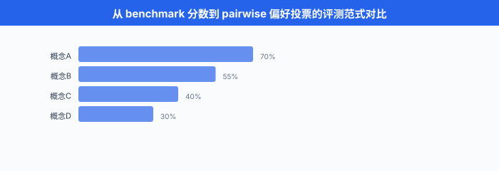
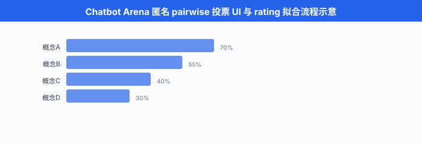

# 竞技场与人类偏好

> **一句话总结**：当 benchmark 测不出"哪个模型更好用"，就把 100 万个真实用户拉进匿名 pairwise 投票，用 Bradley-Terry / Elo 把胜负序列拟合成 rating，这就是 Chatbot Arena 的核心思想。

*BLEU 死了，LMSYS 活了。 上一节我们看到，现代 benchmark 用几十个客观任务把模型的知识、推理、代码能力"逼"出来。 可是当你在 ChatGPT 里写一首情诗、请 Claude 帮你劝退老板、或让 Gemini 帮孩子讲一个睡前故事时，没有任何一个 benchmark 能告诉你 "这次回答比另一个模型好". 这时候我们只有一个终极 oracle —— 真实用户的偏好。 这一节讲的是**如何把成千上万次匿名 pairwise vote 变成一份可信的 leaderboard**，以及围绕它的那些数学、偏差与偷懒陷阱.*

- Benchmark 时代解决了"知识与推理"的评测，但没解决"用起来爽不爽"的评测。 一份写作、一次多轮对话、一段角色扮演的好坏，无法归约为 "test case 通过率". 学界与工业界 2023 年后集体转向**人类偏好**信号，最具代表性的产物是 LMSYS 的 Chatbot Arena.
- 这一节要覆盖：为什么 benchmark 不够 → Bradley-Terry 模型与 Elo 评分的数学基础 → LMSYS Chatbot Arena 的工程实现与 leaderboard 变迁 → MT-Bench / AlpacaEval 两种 LLM-as-judge 替代 → 人类偏好投票的四大偏差 → 中文竞技场生态 → 自建内部 Arena 的实战。

## Benchmark 测不了什么

Benchmark 有一个隐藏假设：**正确性是可以标注的**. MATH 有正确答案，HumanEval 有 unit test, MMLU 有单选题的标准答案。 但下面这些真实用户场景，"正确性"根本无法预先标注:

- "帮我写一段婉转但坚决的辞职邮件"
- "用鲁迅的口吻锐评当代职场"
- "陪我玩个文字冒险游戏，你演旅店老板"
- "解释量子纠缠，讲给我 10 岁的儿子听"
- "把这段代码重构得更 Pythonic"

这几类任务的共同点:

1. **开放式生成**：有无穷多种"合理"回答，没有 gold reference
2. **风格 / 语气 / 帮助度**：人类觉得"好"的维度是多方面的，权重因人而异
3. **多轮上下文**：单轮的对错不代表整场对话的成功
4. **对齐 / 拒答**：拒答一个 borderline 请求算好还是不好，benchmark 说不清

多份 NLP 评测方法论工作 (如 Bowman & Dahl 2021 讨论 benchmark predictive validity 的分析等) 已经指出，GLUE / SuperGLUE 类 benchmark 上的高分模型，在真实用户偏好上不一定占优 (predictive validity 弱). LLM 时代这个问题只会更严重：MMLU 满分的模型可能话痨、Kaggle 冠军模型可能不会写邮件。 那唯一的兜底是什么？—— **让人类自己投票**.

**用户偏好作为 oracle** 的思路是：把两个模型 (A, B) 的回答**匿名并排展示**给用户，用户选"A 更好 / B 更好 / 平局 / 都不好". 收集大量这类对局 (pairwise comparison) 之后，用统计模型把胜负序列拟合成每个模型的一个**分数 (rating)**. 这个 rating 综合了所有维度的人类偏好，且**没有 gold label 依赖**.

关键问题：给定一堆 pairwise 比较，怎么算出 rating? —— 这就要请回 1952 年的 Bradley-Terry 模型。



## Bradley-Terry 模型：从胜负到 rating

第 21 章 02 节我们已经在 RLHF 语境下见过 Bradley-Terry 模型 (作为 reward model 的概率假设). 这里换个视角再讲一次 —— 它是**所有 pairwise ranking 系统的数学基础**.

### 定义

- 假设每个模型 (选手) $i$ 有一个**潜在强度** $r_i \in \mathbb{R}$. 把模型 $a$ 与模型 $b$ 拉出来对战，观察者报告 "$a$ 胜"的概率是:

$$P(a \succ b) \;=\; \frac{e^{r_a}}{e^{r_a} + e^{r_b}} \;=\; \sigma(r_a - r_b)$$

- 其中 $\sigma(x) = 1 / (1 + e^{-x})$ 是 sigmoid. 差别只取决于 $r_a - r_b$，所以 rating 有一个**平移不变性** —— 全体 $r_i$ 同时加常数，概率不变。 实际使用时需要**固定一个锚点** (例如把某个模型固定为 $r = 0$，或让所有模型均值为 0).

### 从对局数据拟合

- 给定观测：有 $N$ 场对局，第 $n$ 场是模型 $a_n$ vs $b_n$，结果 $y_n \in \{0, 1\}$ (1 = $a_n$ 赢). 参数为 $\mathbf{r} = (r_1, \ldots, r_M) \in \mathbb{R}^M$. **对数似然**:

$$\mathcal{L}(\mathbf{r}) \;=\; \sum_{n=1}^{N} \Big[\, y_n \log \sigma(r_{a_n} - r_{b_n}) + (1 - y_n) \log \sigma(r_{b_n} - r_{a_n}) \Big]$$

- 极大化 $\mathcal{L}$ 就是 **Bradley-Terry MLE**. 由于 $\sigma$ 与 log 都是凸性友好的组合，这个目标关于 $\mathbf{r}$ **凸** (严格说是关于 $\mathbf{r}$ 的差分凸)，用一阶或二阶方法能可靠拟合。

- 平局怎么办？常见做法是把平局折成 0.5 胜 + 0.5 败 (与 Elo 同款处理)，或用 Rao-Kupper 扩展显式建 tie 概率。

### 与 logistic regression 的等价

- 把每场对局编码成一个 $M$ 维**特征向量** $\mathbf{x}_n$: $x_{n, a_n} = 1$, $x_{n, b_n} = -1$，其他为 0. 那么 $r_{a_n} - r_{b_n} = \mathbf{r}^\top \mathbf{x}_n$，上面的 MLE 就是**没有截距的 logistic regression**, coefficient 即为 rating $\mathbf{r}$. 这就是为什么工业界 (含 LMSYS) 现在直接用 sklearn / scipy 的 logistic regression 拟合 Bradley-Terry.

```python
# Bradley-Terry MLE 拟合 — 用 scipy 二阶优化, 或用 sklearn logistic regression 等价
import numpy as np
from scipy.optimize import minimize

def fit_bt_mle(battles, num_models: int, anchor_idx: int = 0):
    """
    battles: list of (a_idx, b_idx, y), y=1 表示 a 赢, 0 表示 b 赢, 0.5 表示平局
    num_models: 模型总数
    anchor_idx: 固定为 0 的模型 (消除平移自由度)
    返回 shape=(num_models,) 的 rating
    """
    def neg_log_likelihood(r_free):
        # 把 r_free (少一维) 展开成完整 r, 令 r[anchor_idx] = 0
        r = np.insert(r_free, anchor_idx, 0.0)
        nll = 0.0
        for a, b, y in battles:
            diff = r[a] - r[b]
            # log sigmoid(x) 用 log1p(exp(-x)) 数值稳定写法
            log_sig = -np.log1p(np.exp(-diff))
            log_1msig = -np.log1p(np.exp(diff))
            nll -= y * log_sig + (1 - y) * log_1msig
        return nll

    # 初始猜测: 全 0
    x0 = np.zeros(num_models - 1)
    res = minimize(neg_log_likelihood, x0, method="L-BFGS-B")
    r = np.insert(res.x, anchor_idx, 0.0)
    return r

# 示例: 3 个模型 gpt4 (0), claude (1), llama (2)
battles = [
    (0, 1, 1), (0, 1, 0), (0, 1, 1),   # gpt4 vs claude: 2-1
    (0, 2, 1), (0, 2, 1), (0, 2, 1),   # gpt4 vs llama:  3-0
    (1, 2, 1), (1, 2, 1), (1, 2, 0),   # claude vs llama: 2-1
]
r = fit_bt_mle(battles, num_models=3, anchor_idx=2)  # llama 锚为 0
print(f"gpt4:   {r[0]:.3f}")
print(f"claude: {r[1]:.3f}")
print(f"llama:  {r[2]:.3f}")
# 差值 (r_a - r_b) 才有意义, 绝对值取决于锚
```

- LMSYS Chatbot Arena 从 2024 年开始把 Elo 换成上面这种 BT-MLE 拟合，报告的分数看起来仍像 Elo (乘 400 / ln 10 后加 1000 anchor)，但**统计上更严谨、方差可估**.

## Elo 评分系统

Elo 评分 (Elo rating) 由匈牙利裔美国物理学家 Arpad Elo 于 1960 年代为国际象棋设计，1970 年被 FIDE 采纳，至今仍是所有对战型运动 (象棋、围棋、Dota、Chatbot Arena) 的**通用 rating 语言**. 它的核心其实**就是 Bradley-Terry 的在线增量近似**.

### Elo 的两条公式

- **预期胜率**：给定选手 $a$ 与 $b$ 的当前 rating $R_a, R_b$，选手 $a$ 的**预期胜率** $E_a$ 定义为:

$$E_a \;=\; \frac{1}{1 + 10^{(R_b - R_a) / 400}}$$

- **rating 更新**：一场对局结果为 $S_a \in \{0, 0.5, 1\}$ (败/平/胜)，更新:

$$R'_a \;=\; R_a + K \cdot (S_a - E_a)$$

- $K$ 是**学习率**，决定单场对局的影响。 FIDE 象棋常用 $K = 10 \sim 40$ (强者 K 小，新手 K 大); Chatbot Arena 早期用 $K = 4$.

### Elo 与 Bradley-Terry 的等价

- Elo 预期胜率里的 "400" 与 "10" 只是**尺度选择**. 把公式改写:

$$E_a \;=\; \frac{1}{1 + 10^{(R_b - R_a) / 400}} \;=\; \sigma\!\left(\frac{\ln 10}{400} \cdot (R_a - R_b)\right)$$

- 令 $r_i = (\ln 10 / 400) \cdot R_i$，就恢复到 Bradley-Terry 的 $\sigma(r_a - r_b)$. **所以 Elo 与 BT 是同一个概率模型的不同尺度**, 400 是象棋圈约定，用来让"200 分差 = 76% 胜率"这样的直觉数字更好记。

### Elo 的问题

- **顺序依赖**：同一批对局按不同顺序处理，得到的 rating 不同 (因为是在线更新，早期误差影响后续)
- **锚点漂移**：若整个池子里模型都变强，新老模型的分数**不可跨时段直接比较**
- **K 值权衡**: K 大反应快但方差大；K 小稳但慢
- **无法给出置信区间**：单点更新不带不确定性

BT-MLE 一次性用全部数据做 batch 拟合，消除顺序依赖，且能给出**置信区间** (通过 bootstrap 或 Hessian). LMSYS 从 2024 年开始把 leaderboard 的官方分从 online Elo 切换到 **BT-MLE + bootstrap CI**，就是为了解决这些问题。

```python
# Elo 增量更新 — 教学版, 便于理解, 生产用 BT-MLE
def elo_update(r_a: float, r_b: float, s_a: float, k: float = 32.0):
    """
    r_a, r_b: 当前 rating
    s_a: 对局结果, 1 = a 胜, 0 = a 败, 0.5 = 平
    k: 学习率
    返回 (new_r_a, new_r_b)
    """
    expected_a = 1.0 / (1.0 + 10.0 ** ((r_b - r_a) / 400.0))
    expected_b = 1.0 - expected_a
    s_b = 1.0 - s_a
    new_r_a = r_a + k * (s_a - expected_a)
    new_r_b = r_b + k * (s_b - expected_b)
    return new_r_a, new_r_b

# 示范: 1500 分的选手战胜 1600 分的选手 (爆冷)
r_a, r_b = elo_update(1500, 1600, s_a=1.0, k=32.0)
print(f"a: 1500 → {r_a:.1f}")   # 上升约 22 分
print(f"b: 1600 → {r_b:.1f}")   # 下降约 22 分

# 反过来, 1600 打赢 1500 (预期结果), 变化很小
r_a, r_b = elo_update(1600, 1500, s_a=1.0, k=32.0)
print(f"a: 1600 → {r_a:.1f}")   # 上升约 10 分
print(f"b: 1500 → {r_b:.1f}")   # 下降约 10 分
```

## LMSYS Chatbot Arena

Chatbot Arena (Chiang et al. 2024) 由伯克利 LMSYS 团队于 2023 年 5 月上线，是至今**规模最大、影响力最强**的 LLM 人类偏好评测平台。 它的意义相当于 LLM 时代的 ImageNet leaderboard —— 不是每个人都能主导发布，但**每个新模型都要来 Arena 打卡才算 legit**.

### 工作流程

1. **用户匿名提问**：打开 chat.lmsys.org，输入任意 prompt
2. **两模型并排回答**：系统从模型池 (60+ 个) 随机抽两个，匿名标为 "Model A" 和 "Model B"，并排展示回答
3. **用户投票**：用户选 A 更好 / B 更好 / 平局 / 都不好
4. **投票入库 + 拟合**：累积到一定量 (通常每周 20-40 万票) 后，重新拟合 BT-MLE，更新 leaderboard

到 2025 年，Chatbot Arena 累积**300 万+ pairwise votes**，覆盖 200+ 模型，是最有说服力的 LLM 排名依据。

### 早期 Elo → BT-MLE 的切换

- 2023 年 5 月上线时用**在线 Elo** ($K = 4$)，排名波动大，且对新模型冷启动不友好
- 2023 年底切到 **BT-MLE + bootstrap** 计算 CI，官方称 "Arena Score" (仍展示成 1000+ 的 Elo-like 数字)
- 2024 年补充**Style Control 校正** (Chiang 2024)：分离风格 (长度、markdown、格式) 与内容，报"风格中立"分数

### Leaderboard 的历史变迁 (真实节点，数字可能有微调)

| 时间 | 榜首 | Arena Score |
|---|---|---|
| 2023-06 | GPT-4 (0314) | ~1230 |
| 2023-11 | GPT-4-Turbo | ~1250 |
| 2024-03 | Claude 3 Opus | ~1253 |
| 2024-05 | GPT-4o | ~1287 |
| 2024-06 | Gemini 1.5 Pro | ~1275 (紧追 GPT-4o) |
| 2024-07 | Claude 3.5 Sonnet | ~1280 |
| 2024-09 | o1-preview / o1 | ~1330 (推理模型进榜) |
| 2025-Q1 | Gemini 2.0 / Claude 3.7 | 榜首反复易主 |

- **一个规律**：从 GPT-4 到今天，Arena 榜首涨了 100+ 分，相当于**约 65% 胜率**优势 (依 $\sigma(100 \cdot \ln 10 / 400) \approx 0.64$). 每一次新一代前沿模型出场，Arena 就成为**首个非厂商可信信号**.

### 子榜分区

Arena 一开始只有一个 leaderboard，但随着模型能力分化，LMSYS 陆续开出:

- **Arena-Hard**：从投票 corpus 里筛出"高辨识度"的 prompt (让模型胜负差距显著) 组成 500 题，用 GPT-4 自动判分，复现 Arena 排名相关性 95%+，但**测一个模型只要 10 分钟，不用等一周投票**
- **Coding Arena**：只统计 coding 相关 prompt 的投票
- **Vision Arena** (LMSYS 2024)：图文任务，用户可以在 prompt 里附图
- **Hard Prompts, Longer Query, Multi-turn**：不同难度切片

### Arena 的价值与局限

**价值**:
- **无 gold label 依赖**，直接对齐人类偏好
- **实时反映产品级差异**，与 tech report 的独立第三方
- **大规模** (100 万+ votes) 使 rating 的 CI 收窄到 ±5 分内

**局限**:
- **prompt 分布偏移**: Arena 用户以 tech-savvy 英文用户为主，编程 / 抽象推理 prompt 占比高，中文口语场景欠代表
- **匿名易被"猜品牌"**：高级用户能从风格特征识别模型 (Claude 爱用 "certainly"、GPT-4o 爱 bullet)，破坏匿名性
- **投票稀疏**: 60+ 模型两两配对，部分冷门配对样本数少，CI 大
- **风格 > 内容**：长回答、有 markdown 的回答天然占便宜 (后详)



## MT-Bench 与 AlpacaEval: LLM-as-Judge 替代

Chatbot Arena 要几十万真人投票才有可信的一档排名，太贵。 学界 2023 年提出用**强模型 (GPT-4 / Claude) 打分**代替人类，用少量精心构造的题目快速评估，与 Arena 有很高相关性 —— 这就是 **LLM-as-Judge** 的雏形。

### MT-Bench (Zheng et al. 2023)

- MT-Bench 由 Zheng et al. 2023 (与 Chatbot Arena 同一团队) 提出，是**首个 multi-turn LLM-as-judge benchmark**. 结构:
  - **80 个 prompt**，分 8 类：writing / roleplay / reasoning / math / coding / extraction / STEM / humanities
  - 每个 prompt 有**两轮**对话，用来测多轮上下文保持
  - **打分模式**：用 GPT-4 作为 judge，单点打分 (1-10 分) 或 pairwise 比较
- 报告数字：MT-Bench 单点 6.0+ 已是强模型，8.0+ 是前沿，9.0+ 极少
- **与 Arena 的相关性**: Zheng 论文报告 MT-Bench (GPT-4 judge) 与 Chatbot Arena Elo 的 **Spearman 相关系数 = 0.94**，说明这 80 题的 GPT-4 打分**可以廉价预测**几十万真人投票的结果

### AlpacaEval (Li et al. 2023)

- AlpacaEval (Li et al. 2023，斯坦福 Alpaca 团队) 是**单轮 pairwise LLM-as-judge**. 结构:
  - **805 个 instruction** (来自真实用户查询，覆盖 QA / 建议 / 创意 / 写作等)
  - 每个 instruction 让**待评模型**与**参考模型** (默认 text-davinci-003，后升为 GPT-4-turbo) 各生成一份
  - 用 GPT-4 (作为 judge) 判 A 好 / B 好 / 平，报告**胜率 (win rate)**
- 优点：只跑 805 次前向 + 805 次判分，一小时能评完，比 Arena 快几个数量级
- 局限：单轮、无法测多轮；且和 MT-Bench 一样有**judge model 偏差**

### Length-Controlled AlpacaEval

- AlpacaEval 有个众所周知的问题：**回答越长，胜率越高** —— judge 天生偏好啰嗦回答。 一份 300 词的回答比 100 词的更容易被 GPT-4 judge 判为 "好".
- Dubois et al. (2024) 提出**长度受控评估 (Length-controlled AlpacaEval)**. 核心思路：在 logistic regression 里加入**长度差**作为控制变量，分离出模型的"内在质量"与"长度加成":

$$P(a \succ b) \;=\; \sigma\!\Big( \theta_a - \theta_b + \gamma \cdot (\ell_a - \ell_b) + \phi \cdot z(\text{prompt}) \Big)$$

- $\theta_i$ 是**长度校正后的模型能力**, $\ell_a - \ell_b$ 是两回答的**长度差** (通常用 log(token 数)), $\gamma$ 是长度偏好系数 (拟合出来通常 > 0，表示 judge 确实偏爱长), $z(\text{prompt})$ 是 prompt 相关的固定效应。
- 拟合后取 $\theta_a$ 作为该模型的**长度中立分数**，与 Chatbot Arena Elo 的相关性从 0.94 (原始 AlpacaEval) 提升到 **0.98**. 这是 AlpacaEval 2 (LC) 的核心贡献。

## 人类偏好投票的偏差

用人类投票不代表就有"真理". 大量研究揭示了偏好投票中的系统性偏差，是所有 arena 类评测都要防范的坑。

### 位置偏差 (position bias)

- 在 pairwise UI 中，用户 (以及 LLM judge) 倾向于**投左侧那一个**. 早期 Chatbot Arena 数据显示，若不做处理，左侧模型的胜率比真实值高 3-5%.
- **应对**：每次配对**随机打乱 A/B 顺序**，或对同一 prompt 做两次 (A 在左 / A 在右) 取平均。 LMSYS 严格执行前者。 LLM-as-Judge 场景更严重：Wang et al. (2023) 发现 GPT-4 judge 的 position bias 可达 20%+，必须做**双向判分平均**.

### 长度偏差 (length bias)

- 长回答被认为好。 Dubois 2024 显示，只要多写 50 词，平均胜率提升 3-8%. 这不是内容更好，而是**认知偏差** (更多字看起来更用心).
- **应对**: (1) Length-controlled AlpacaEval 的统计校正；(2) 在 judge prompt 里显式告知 "长度不是好坏标准"; (3) 分层比较 (只在相似长度对局里比).

### 风格胜过内容 (style over substance)

- Boubdir et al. (2023) 分析发现，用户在 pairwise 判分时，**格式漂亮**的回答 (合理 bullet / bold / markdown / emoji) 胜率显著高于**纯文本**回答，即使内容质量相似。 这在 Chatbot Arena 上体现为 GPT-4o 类模型对 Claude 类模型的部分优势可能被"排版加成"放大。
- **应对**: LMSYS 2024 起在 Arena leaderboard 上加了 **Style Control** 版本，用回归剥离 markdown / bold / bullet / length 等风格特征，报告"风格中立"分数。 结果显示原始 GPT-4o 与 Claude 3.5 Sonnet 的差距，在 Style Control 后缩小到几乎持平。

### 母语与文化偏差

- 英文提问 & 英文回答的对局，拟合出的 rating 与真实全球用户偏好不一定对齐。 中文母语用户对中文表达的敏感度 (是否地道、有无"翻译腔") 是 GPT-4 judge 感知不到的。
- **应对**：分语言子榜 (LMSYS 有 Chinese / French / German 分区)，且引入母语人类审核。

### LLM-as-Judge 特有的偏差

- **自我偏好** (self-preference bias): GPT-4 判自己回答分更高的倾向；详见下一节 LLM-as-Judge 深挖。
- **判分粒度偏差**: 1-10 打分，judge 集中在 6-8，底 (1-2) 与顶 (9-10) 使用不足，压缩了模型间差异。

Anthropic (2024) 的一篇内部技术报告 (以及 Zheng et al. 2023 的原始 MT-Bench 论文附录) 系统测量了这些偏差的量级，建议**任何用 LLM-as-Judge 的评测都必须**: (1) 双向判分平均消 position; (2) 匿名化去品牌信号；(3) 长度做协变量校正；(4) 至少两个不同 judge 交叉验证。

## 中文竞技场生态

英文世界有 Chatbot Arena，中文用户同样需要**母语偏好评测**. 主要三家:

### SuperCLUE 竞技场 (CLUE 团队，2023-)

- 与 SuperCLUE benchmark 一起上线，但独立运作 pairwise 投票平台。 特点:
  - **中文母语题池**，覆盖角色扮演、传统文化、代码、逻辑等
  - 定期发布**中文 LLM Arena leaderboard**，每季度更新
  - 引入**专家 + 大众混合投票**，部分子榜由行业专家把关

### FlagEval Arena (北京智源，2023-)

- 智源 (BAAI) 主导，与 FlagEval benchmark 生态配套。 特点:
  - 覆盖中英双语
  - 支持**多模态 arena** (VLM 图文任务的 pairwise)
  - 数据开放，部分投票 corpus 可下载研究

### OpenCompass Arena (上海 AI Lab, 2024-)

- 上一节讲的 OpenCompass 团队 2024 年开出的 arena 分支。 特点:
  - 与 OpenCompass benchmark **强耦合**：同一个模型可以既跑 80+ benchmark，又参与 arena
  - **司南榜单** 每月更新，含 SubjectiveArena 主观投票排名
  - 面向中文开发者的默认选择

### 中文 arena 的独有挑战

- **中文投票用户规模**远小于英文 (Chatbot Arena 数百万 votes，中文 arena 通常几万到几十万级), CI 更宽
- **中文 tokenizer 差异**导致长度对比更不公平 (同一段中文，不同模型 token 数可能差 30%)
- **文化 / 政治敏感话题**的处理：中文 arena 通常 prompt 池会过滤敏感话题，但也因此减少了"真实场景覆盖"

## 实战：自建内部 Arena

生产环境经常需要**在自己的模型池 (含内部微调模型) 上跑 arena**. 下面给一份"上手就能做"的最小实现清单。

### 1. Pairwise 投票 UI 设计

关键 UX 原则:
- **匿名**：左右两栏只写 "Model A" / "Model B"，不显示模型名
- **随机打乱**：每次刷新，A/B 随机分配
- **对局 gating**：投票前必须看完两个回答的完整内容 (可用滚动到底 + 3 秒计时确认)
- **四选一**: "A 更好 / B 更好 / 平局 / 都不好" (第四项非常重要，用来过滤模型都翻车的对局)
- **可选文本理由**：投票后弹出 "为什么?" 输入框，收集半结构化理由 (后期做偏差分析)

### 2. 冷启动：用少量投票 bootstrap Elo

- 系统上线初期，只有几百票，BT-MLE 不稳定。 先用 **online Elo** ($K = 32$，初始都是 1000 分) 快速拟合，让 leaderboard 有个粗略雏形。
- 累积到 每对**至少 20 场对局**后，切换到 batch **BT-MLE + bootstrap 1000 次** 得到 CI. 具体切换阈值取决于模型数：$M$ 个模型的**完全图**需要 $\binom{M}{2}$ 对，每对 20 场，总计 $20 \binom{M}{2}$ 场。
- 8 个模型 = $20 \cdot 28 = 560$ 场；30 个模型 = $20 \cdot 435 = 8700$ 场。 显然模型多时冷启动成本高，需要主动学习采样。

### 3. 主动学习采样：优先让"不确定"的对局出现

- 随机抽 A/B 的问题：大部分对局是"预期胜负明确"的 (强模型 vs 弱模型)，信息量低。 应该**优先让 rating 接近的模型对战** —— **不确定对局** 提供更多信息。

数学上，一场对局 $(a, b)$ 的**Fisher 信息量**正比于:

$$I(a, b) \;\propto\; P(a \succ b) \cdot P(b \succ a) \;=\; \sigma(r_a - r_b) \cdot \sigma(r_b - r_a)$$

- 当 $r_a = r_b$ 时，$I = 0.25$ (最大)；当 $|r_a - r_b|$ 很大时，$I \to 0$. **同样的投票预算，优先安排 rating 接近的对局**，能让 CI 收得更快。

```python
# 主动学习式对局采样: 优先让 rating 接近的模型对战
import numpy as np

def sample_pair_active(ratings: np.ndarray, temperature: float = 100.0):
    """
    ratings: shape=(M,), 当前 rating 估计
    temperature: 越小越偏向"rating 接近"; 越大越接近随机
    返回 (a_idx, b_idx)
    """
    M = len(ratings)
    # 对每对 (a, b), 权重 = P(a>b) * P(b>a) 的 exponential-tempered 版本
    # 用 Elo 尺度: sigma((r_a - r_b) * ln10/400)
    diffs = ratings[:, None] - ratings[None, :]        # (M, M) diff matrix
    scale = np.log(10) / 400.0
    p_win = 1.0 / (1.0 + np.exp(-scale * diffs))       # P(a > b)
    info = p_win * (1.0 - p_win)                        # 信息量 (unnorm)
    np.fill_diagonal(info, 0.0)                         # 自己 vs 自己剔除

    # 温度调节
    weights = np.exp(info / temperature * 4.0)         # * 4 让 [0, 0.25] 拉开
    weights[np.tril_indices(M)] = 0.0                   # 只取上三角避免重复
    weights = weights / weights.sum()

    # 从 M*M 网格里按权重采一对
    flat = weights.flatten()
    idx = np.random.choice(len(flat), p=flat)
    a, b = divmod(idx, M)
    # 再随机决定 A/B 展示顺序 (消 position bias)
    if np.random.rand() < 0.5:
        a, b = b, a
    return a, b

# 用法: 每次给 UI 抽一对模型
ratings = np.array([1000, 1020, 950, 1100, 1080, 970])
for _ in range(5):
    a, b = sample_pair_active(ratings)
    print(f"次对局: 模型 {a} vs 模型 {b}")
```

### 4. leaderboard 展示

一份完整的内部 leaderboard 至少要报:

| 字段 | 含义 |
|---|---|
| model | 模型名 |
| arena_score | BT-MLE 拟合的 rating (乘 400/ln10 + 1000 anchor) |
| ci_95 | bootstrap 95% CI |
| n_votes | 该模型参与的总对局数 |
| win_rate | 胜率 (含平局折 0.5) |
| updated | 拟合时间戳 |

- 若模型数 > 10，应该同时展示**Style Control 版本** (用回归剥离长度 / markdown / bold 等特征后的 rating)，以对比"内容强度"与"表现风格".

### 5. 防作弊 & 数据卫生

- **同一用户不能连续投同一模型**：用 IP + 浏览器指纹 + session, 5 分钟内投同一 pairing 视为重复
- **异常快速投票剔除**: < 3 秒就投的对局默认丢弃 (读都没读)
- **判分外泄防线**：内部员工投票时**必须完全匿名**，且不能在其他渠道看到模型名，否则会人为拉高自家模型

### 6. 常见 pitfall

- **不做 style control 直接上榜**：会让"爱写长回答 + markdown"的模型不当占优
- **平局占比过高不做子分析**：若某对模型 tie 率 > 40%，说明 prompt 对该 pair 不辨析，应换更硬的 prompt 或分开单独测
- **忽视 CI**：只报点估计的 leaderboard 不严谨；排名的 CI 有重叠时，视为并列


## 与下一节的衔接

- 本节讲的 LMSYS Chatbot Arena / MT-Bench / AlpacaEval 共同的核心思路是**用 pairwise 比较 + 概率模型 (Bradley-Terry) 把散乱胜负拟合成 rating**. 但 MT-Bench 与 AlpacaEval 已经把"判分主体"从人类换成了 GPT-4 / Claude —— 这就自然引出下一节的主题：**LLM-as-Judge 的方法学**. 我们会看到怎么设计判分 prompt、怎么控制 judge 偏差、怎么用多 judge 融合，以及 constitutional AI / rubric-based judging 这些前沿技术。

---

## 📌 本节要点

- **Benchmark 测不了对话质量**：开放式生成、风格、多轮、helpful 等维度没有 gold label，只能用人类偏好投票兜底 —— Chatbot Arena 由此诞生。
- **Bradley-Terry 模型**: $P(a \succ b) = \sigma(r_a - r_b)$，用一个潜在强度 $r_i$ 就能把 pairwise 胜负拟合成 rating，与不带截距的 logistic regression 完全等价，现代竞技场都用 BT-MLE + bootstrap 拟合。
- **Elo 是 BT 的在线增量近似**：更新式 $R'_a = R_a + K(S_a - E_a)$，预期胜率 $E_a = 1 / (1 + 10^{(R_b - R_a)/400})$, "400" 与 "10" 只是尺度选择，Elo 与 Bradley-Terry 数学同构。
- **LMSYS Chatbot Arena**: 300 万+ 匿名 pairwise votes, 200+ 模型，从 GPT-4 → Claude 3 Opus → GPT-4o → Claude 3.5 Sonnet → o1 一路标记了前沿模型迭代节奏，是 LLM 时代最有说服力的第三方 leaderboard.
- **MT-Bench / AlpacaEval / LC-AlpacaEval**：用 GPT-4 judge 在 80 / 805 题上快速评分，与 Chatbot Arena Elo 的 Spearman 相关 0.94 → 0.98 (长度控制后)，是廉价 arena 代理；长度受控评估 (Length-controlled AlpacaEval) 用回归 $\theta_a - \theta_b + \gamma(\ell_a - \ell_b)$ 分离长度加成与内在能力。
- **四大偏差**：位置偏差 (position bias，投左侧的倾向，用双向平均消) / 长度偏差 (length bias，长回答天然占便宜，用长度控制回归消) / 风格胜过内容 (style over substance, markdown / bullet 加分，用 Style Control 消) / 母语文化偏差 (英文语料训练的 judge 感知不到中文微妙).
- **中文竞技场**: SuperCLUE Arena / FlagEval Arena / OpenCompass Arena 是三大中文母语平台，覆盖中文特有场景与文化敏感度，但用户规模比英文小一到两个量级。
- **自建内部 Arena**：匿名 pairwise UI + 冷启动用 Elo 快速 bootstrap + 累计后切 BT-MLE + bootstrap CI + 主动学习采样 (优先让 rating 接近的对局出现，Fisher 信息量 $I \propto \sigma(r_a - r_b)\sigma(r_b - r_a)$ 在 $r_a = r_b$ 处最大) —— 一份 200 行 Python 就能跑起来。

## 参考文献

- Bradley, R. A., & Terry, M. E. (1952). *Rank Analysis of Incomplete Block Designs: I. The Method of Paired Comparisons*. Biometrika, 39(3/4), 324-345.
- Elo, A. E. (1978). *The Rating of Chessplayers, Past and Present*. Arco Publishing, New York. (Elo 系统原著.)
- Chiang, W.-L., Zheng, L., Sheng, Y., Angelopoulos, A. N., Li, T., Li, D., Zhang, H., Zhu, B., Jordan, M., Gonzalez, J. E., & Stoica, I. (2024). *Chatbot Arena: An Open Platform for Evaluating LLMs by Human Preference*. arXiv:2403.04132. (LMSYS Chatbot Arena.)
- Zheng, L., Chiang, W.-L., Sheng, Y., Zhuang, S., Wu, Z., Zhuang, Y., Lin, Z., Li, Z., Li, D., Xing, E. P., Zhang, H., Gonzalez, J. E., & Stoica, I. (2023). *Judging LLM-as-a-Judge with MT-Bench and Chatbot Arena*. NeurIPS 2023 Datasets and Benchmarks. arXiv:2306.05685.
- Li, X., Zhang, T., Dubois, Y., Taori, R., Gulrajani, I., Guestrin, C., Liang, P., & Hashimoto, T. B. (2023). *AlpacaEval: An Automatic Evaluator of Instruction-following Models*. GitHub / tatsu-lab.
- Dubois, Y., Galambosi, B., Liang, P., & Hashimoto, T. B. (2024). *Length-Controlled AlpacaEval: A Simple Way to Debias Automatic Evaluators*. arXiv:2404.04475.
- Wang, P., Li, L., Chen, L., Zhu, D., Lin, B., Cao, Y., Liu, Q., Liu, T., & Sui, Z. (2023). *Large Language Models are not Fair Evaluators*. arXiv:2305.17926. (Position bias in LLM-as-Judge.)
- Boubdir, M., Kim, E., Ermis, B., Fadaee, M., & Hooker, S. (2023). *Elo Uncovered: Robustness and Best Practices in Language Model Evaluation*. arXiv:2311.17295. (Elo / pairs judgment issues 与偏差.)
- Xu, L., Li, A., Zhu, L., Xue, H., Zhu, C., Zhao, K., He, H., Zhang, X., Kang, Q., & Lan, Z. (2023). *SuperCLUE: A Comprehensive Chinese Large Language Models Benchmark*. arXiv:2307.15020.
- 上海人工智能实验室 (2024). *OpenCompass 司南评测榜单*. https://opencompass.org.cn/. (OpenCompass Arena.)
- 北京智源人工智能研究院 (2023). *FlagEval：大模型评测平台*. https://flageval.baai.ac.cn/. (FlagEval Arena.)