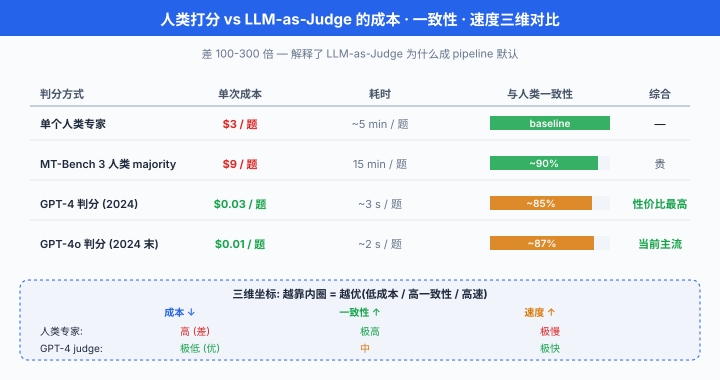
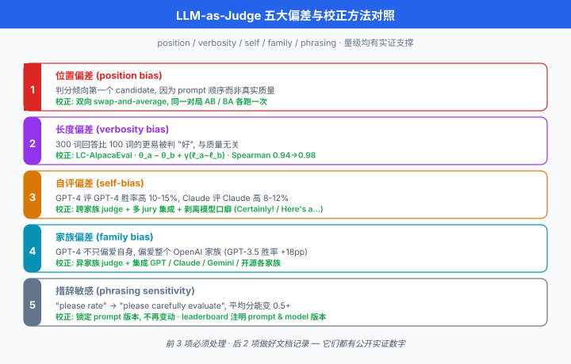
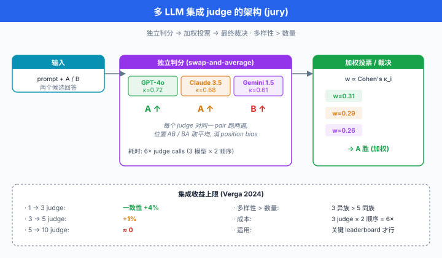

# LLM-as-Judge · 用模型评模型

> **一句话总结**: 让顶级 LLM 作为 judge, 用 prompt 化的 rubric 快速大规模评分, 相比人类标注便宜 100 倍且相关性 > 80%, 但必须系统性纠正位置、冗长、自我、家族等偏差.

*上一节我们看到, Chatbot Arena 用 300 万+ 真人 pairwise 投票拟合 rating, 是"人类偏好"这条路线的最强代表. 但真人投票有个致命问题: **贵、慢、噪**. 一场 MT-Bench 全量人评要 20 位标注员干 2 周, 一人一小时 30 美元. 于是 2023 年学界与工业界几乎同时找到同一条捷径 —— **让另一个 LLM (通常是 GPT-4) 当 judge**. 这一节讲的是 LLM 作为评判者 (LLM-as-Judge) 这条路线的完整方法学: 打分模式、prompt 设计、偏差与去偏、多 judge 融合, 以及如何从零建一条能落地的 judge pipeline.*

- 上节结尾我们把话题从"人类打分"引到了"LLM 打分". 本节要覆盖: 为什么 LLM 判分与人类高度相关 → 三种主流 judge 形式 (score / pairwise / reference-based) → 完整可复用的 judge prompt 模板 → 系统性偏差与校正公式 → 奖励模型基准 (RewardBench) 与 Ch21 RLHF 的联通 → 多 judge 集成 → judge 选型 → 自评 (self-evaluation) 的坑 → 从零建 pipeline 的工程实战.

## 为什么用 LLM 打分

人类打分作为评测终极 oracle 无可争议, 但它有三个绕不开的问题:

1. **贵**: MT-Bench 每题人评成本 2-5 美元 (打 A/B/tie/理由), 全量 80 题 × 20+ 模型 = 数千题, 单次评估 8000-2 万美元
2. **慢**: 标注员协调、培训、复核, 一轮走完至少 1-2 周; 而模型迭代节奏是**每周新版本**
3. **噪**: 人类标注员之间 Cohen's $\kappa$ 通常在 0.4-0.6 (中等一致性), 需要多人 majority vote 才能压噪

Zheng et al. (2023) 在 MT-Bench 论文里做了一个关键实验: 让 GPT-4 与人类专家对 80 题的 6 个模型回答分别打分, 计算**GPT-4 与人类的一致性 (agreement rate)**. 结果:

- **GPT-4 与人类专家的一致性 = 85%** (pairwise 判断)
- **人类专家彼此之间的一致性 = 81%**
- 也就是说, GPT-4 与人类的一致度**已经追平人类间自身的一致度**

这个数字是 LLM-as-Judge 之所以站得住脚的核心证据. 它意味着: **用 GPT-4 判分, 引入的额外误差不比换一位人类标注员更大**. 而成本呢?

| 判分方式 | 单次成本 | 时间 | 一致性 (与人类) |
|---|---|---|---|
| 一位人类专家 | ~$3/题 | 5 min/题 | (baseline) |
| MT-Bench 3 人 majority | ~$9/题 | 15 min/题 | ~90% |
| GPT-4 判分 (2024 价格) | ~$0.03/题 | 3 s/题 | ~85% |
| GPT-4o 判分 (2024 后期) | ~$0.01/题 | 2 s/题 | ~87% |

**差 100-300 倍**. 这就是为什么 2023 年之后**几乎每一个新 benchmark / arena 都内建 LLM-as-Judge**: MT-Bench, AlpacaEval, WildBench, Arena-Hard, MixEval, FLASK ... 全都靠 GPT-4 (或后来的 Claude 3.5) 判分.

**一致性也不是万能护身符**: 85% 是**平均**一致性, 但在某些子集 (数学、代码、有争议话题) 上 GPT-4 与人类分歧显著; 更严重的是, GPT-4 与人类共同的偏差 (都爱长回答、都被 markdown 迷惑) 无法通过"提升一致性"解决. 后面讲偏差会详细拆解.



## 三种 Judge 形式

LLM-as-Judge 在实践中有三种主流形式, 各自适用不同场景.

### Score-based (单点打分)

- **形式**: 给 judge 展示一个 (prompt, response), 让它按 rubric 打**1-10 分**
- **优点**: 单次评估只跑一份 response, 便宜; 结果是绝对数字, 可直接排序 leaderboard
- **缺点**: judge 的绝对尺度不稳 (今天觉得 8, 明天觉得 7), 且**分布集中** —— 大多数分数落在 6-8, 底 (1-2) 与顶 (9-10) 使用不足
- **典型场景**: MT-Bench single-score 模式, FLASK 分维度打分

### Pairwise (二选一)

- **形式**: 展示 (prompt, response A, response B), judge 判 "A 更好 / B 更好 / 平局"
- **优点**: **相对判断比绝对打分更可靠** (与 Chatbot Arena 同理), 心理学研究反复证明人类对"相对好坏"敏感度远高于"绝对分数"
- **缺点**: 需要 $\binom{M}{2}$ 对局才能完全覆盖 $M$ 个模型, 对局数呈 $O(M^2)$
- **典型场景**: AlpacaEval 2 (与参考模型 pairwise), Arena-Hard, Chatbot Arena 的 LLM-judge 替身

### Reference-based (与参考答案对比)

- **形式**: 展示 (prompt, gold reference, candidate response), judge 判 candidate 与 reference 的**语义等价 / 覆盖度 / 遗漏项**
- **优点**: 引入 gold answer 后 judge 更稳, 相当于**半监督**; 能处理"事实核查"类任务
- **缺点**: 需要预先准备 gold reference, 对开放式任务 (创作、角色扮演) 不适用
- **典型场景**: 长文事实性问答 (LongBench), RAG 输出核对, 教学题批改

三种形式并非互斥, 现代 pipeline 常混用: 客观题走 reference-based (最稳), 主观开放题走 pairwise (最公平), 需要绝对分数上榜时走 score-based + 校准 (最快).

## Prompt Engineering for Judge

Judge 的质量 90% 决定于 prompt. 一个模糊的 "please rate this response 1-10" 得到的分数完全没用. 好的 judge prompt 有四个要素:

1. **明确的 rubric**: 分维度写出评分标准 (accuracy, fluency, helpfulness, safety), 每个维度给出锚点描述 (1 分是什么样, 5 分是什么样, 10 分是什么样)
2. **Chain-of-thought before verdict**: 先要求 judge **写理由 (reasoning)**, 再给分. 直接问分数, judge 会拍脑袋
3. **结构化输出**: JSON / XML 格式约束, 便于程序解析
4. **Self-consistency**: 同一 prompt 采样 $n$ 次, 取**多数**分数, 消除采样噪声

下面是 MT-Bench 官方 pairwise judge prompt 的完整中文版重构 (原文英文, 结构一模一样, 可直接换语言用):

```python
# 完整可复用的 MT-Bench-style pairwise judge prompt
# 论文出处: Zheng et al. (2023) 附录 A.2

MT_BENCH_PAIRWISE_JUDGE_PROMPT = """\
[System]
你是一位公正的评审, 需要评估两位 AI 助手对同一用户问题的回答质量. \
请从**帮助度 (helpfulness)**、**相关性 (relevance)**、**准确性 (accuracy)**、\
**深度 (depth)**、**创造性 (creativity)** 与**详细度 (level of detail)** 六个维度综合判断. \

在判断时, 请遵循以下原则:
1. 避免任何**位置偏差 (position bias)**, 回答呈现的顺序不应影响你的判断.
2. 避免任何**长度偏差**: 回答的长度不应成为质量的代理指标, 简洁而正确的回答不应低于冗长而空洞的回答.
3. 避免任何**风格偏差**: 不要因为一方使用了 markdown、bullet、emoji 而给它加分.
4. 不要偏向任何一位助手的**身份或品牌**: 你不知道两位助手是谁.
5. 尽量**客观**. 请先给出你的**详细理由 (reasoning)**, 再给出最终裁决.

请严格按以下 JSON 格式输出:
{{
  "reasoning": "<你对两份回答的逐维度分析, 至少 100 字>",
  "verdict": "A" | "B" | "tie"
}}

[User Question]
{user_prompt}

[Assistant A's Response]
{response_a}

[Assistant B's Response]
{response_b}
"""

import json
from typing import Literal

def judge_pairwise(
    user_prompt: str,
    response_a: str,
    response_b: str,
    judge_model: str = "gpt-4o",
    temperature: float = 0.0,
) -> dict:
    """
    调 judge model 判断 A / B / tie.
    返回 dict: {"reasoning": str, "verdict": "A" | "B" | "tie"}
    """
    from openai import OpenAI
    client = OpenAI()
    filled = MT_BENCH_PAIRWISE_JUDGE_PROMPT.format(
        user_prompt=user_prompt,
        response_a=response_a,
        response_b=response_b,
    )
    resp = client.chat.completions.create(
        model=judge_model,
        messages=[{"role": "user", "content": filled}],
        temperature=temperature,
        response_format={"type": "json_object"},
    )
    return json.loads(resp.choices[0].message.content)

# 示例
result = judge_pairwise(
    user_prompt="用一句话解释量子纠缠",
    response_a="量子纠缠是两个粒子共享同一个量子态, 一个的测量瞬间决定另一个的结果.",
    response_b="就是两个粒子搞在一起了.",
)
print(result)
# {"reasoning": "回答 A 准确描述了量子纠缠的核心特征...",
#  "verdict": "A"}
```

Prompt 里的每一条约束都有对应的实证支撑: MT-Bench 论文附录 B 显示, **去掉 "先给理由再给裁决" 这一条**, GPT-4 judge 与人类的一致性从 85% 跌到 72%. **去掉位置偏差警告**, 位置偏差从 5% 涨到 20%+.

### Score-based 版本

Pairwise 之外, score-based 需要在 rubric 里给出**锚点** (anchor description), 否则不同 judge run 之间尺度会漂移:

```python
MT_BENCH_SCORE_JUDGE_PROMPT = """\
[System]
你是一位公正的评审. 请为以下 AI 助手的回答按 1-10 分打分. \
评分标准:
- 10 分: 完美, 内容准确、逻辑严密、表达清晰、覆盖用户所有需求且有深度洞见
- 8 分: 优秀, 内容正确且完整, 但缺少 "wow moment"; 或有微小可改进处
- 6 分: 合格, 大方向正确, 有部分内容缺失、错误或表述模糊
- 4 分: 部分错误, 存在明显的事实错误、逻辑漏洞或严重遗漏
- 2 分: 大部分错误, 只有零星正确内容
- 1 分: 完全错误 / 有害 / 拒答但不合理

请先分析回答的优缺点, 再给分. 严格按 JSON 输出:
{{
  "reasoning": "<至少 80 字的分析, 分优点与缺点>",
  "score": <1-10 的整数>
}}

[User Question]
{user_prompt}

[Assistant's Response]
{response}
"""
```

- 锚点里**10 / 8 / 6 / 4 / 2** 都给了描述, judge 生成分数时会向锚点靠拢, 减少尺度漂移.
- 温度设 0.0 但仍有噪声? 用 self-consistency: 采样 3-5 次, **取中位数** (对数值 rating 更稳, 均值容易被极端值拉偏).

## Judge 偏差与去偏

LLM judge 与人类共享一些偏差, 也有自己独有的坑. Zheng 2023, Wang 2023, Panickssery 2024 等系统研究了以下五大偏差, 每一种都对应有校正方法.

### 位置偏差 (position bias)

- **现象**: 上一节讲过, 04 节的 Chatbot Arena 人类投票有 3-5% 位置偏差; LLM judge 更严重. Wang et al. (2023) *Large Language Models are not Fair Evaluators* 报告的核心数字: 在 GPT-4 判 GPT-3.5 vs Vicuna 的对局里, **只把 A/B 位置互换, 胜率翻转 20+ 个百分点** (原来 A 胜 70%, 换位置后 A 只胜 45%).
- **成因**: LLM 有 recency / primacy 偏好, 具体哪端偏好因模型而异. GPT-4 早期版本明显偏 A (第一个位置), Claude 2 偏 B, Llama 系列不稳定.
- **校正: swap-and-average**. 对同一 (prompt, response_a, response_b) 三元组, 用 A 在前和 B 在前**各判一次**, 只有**两次结果一致**才计入结果, 否则视为 tie:

$$\text{verdict}(a, b) \;=\;
\begin{cases}
a, & \text{if } j(a, b) = a \wedge j(b, a) = a \\
b, & \text{if } j(a, b) = b \wedge j(b, a) = b \\
\text{tie}, & \text{otherwise}
\end{cases}$$

- 这样定义的一致性率 $\rho$ (两次判决相同的比例) 是**位置无关性**的直接度量; Wang 2023 论文里 GPT-4 的 $\rho$ 只有 62%, 加了明确 prompt 提示后升到 84%.

```python
# Swap-and-average: 消位置偏差的标准做法
def judge_pairwise_debiased(user_prompt, resp_a, resp_b, judge_model="gpt-4o"):
    """
    对同一对 response 判两次 (A 在前 / B 在前), 只有一致才计, 否则 tie.
    """
    fwd = judge_pairwise(user_prompt, resp_a, resp_b, judge_model)["verdict"]
    rev = judge_pairwise(user_prompt, resp_b, resp_a, judge_model)["verdict"]

    # 注意 rev 视角里 A/B 已经调换, 需要翻译回原视角
    rev_translated = {"A": "B", "B": "A", "tie": "tie"}[rev]

    if fwd == rev_translated:
        return fwd            # 两次一致, 认可
    else:
        return "tie"          # 不一致, 保守判 tie

# 示例
final = judge_pairwise_debiased(
    "解释量子纠缠",
    "量子纠缠是两个粒子共享同一个量子态...",
    "就是两个粒子搞在一起了.",
)
print(f"去偏后裁决: {final}")
```

- **权衡**: swap-and-average 让 judge 调用次数**翻倍**, 成本翻倍. 生产上通常只对**关键排名节点**做, 普通 sampling 单向判即可.

### 冗长偏差 (verbosity bias)

- **现象**: judge 系统性偏爱长回答. Dubois 2024 (上节 AlpacaEval 2 论文) 测得: **回答从 100 词加到 300 词, judge 胜率提升约 8-15 个百分点**, 与内容质量无关.
- **成因**: (a) 长回答"看起来更用心", judge 把长度当质量代理; (b) 长回答提供更多"信号面", judge 更容易找到理由说 "detailed"
- **校正: 长度归一化 (length normalization)**. 用回归剥离长度影响, 保留内在质量. 上节公式:

$$P(a \succ b) \;=\; \sigma\!\Big( \theta_a - \theta_b + \gamma \cdot (\ell_a - \ell_b) \Big)$$

- $\ell_i$ 是 log token 数, $\gamma > 0$ 是拟合出的长度系数. 校正后模型能力用 $\theta_i$, 剥离了长度加成.
- 实践中还可用**"长度惩罚"**: 直接在 score 上减去 log length 的一个函数:

$$\tilde{s}_i \;=\; s_i - \lambda \cdot \max(0, \log \ell_i - \log \ell^*)$$

- $\ell^*$ 是"合理长度"阈值 (如 200 tokens), $\lambda$ 是惩罚强度. 超过阈值才罚, 短回答不奖励. 这个公式简单粗暴但对生产 pipeline 好用.

### 自我偏差 / 自恋偏差 (self-bias / narcissism bias)

- **现象**: 模型评自己家族的回答分数偏高. Panickssery et al. (2024) *LLM Evaluators Recognize and Favor Their Own Generations* 系统测得:
  - GPT-4 判 GPT-4 vs Claude 时, GPT-4 系列胜率比中立 judge 判决**高 10-15%**
  - Claude 3 判 Claude 3 vs GPT-4 时, Claude 3 家族胜率高 8-12%
  - Llama 3 判自己 vs 其他, 差距较小 (约 3-5%), 但仍存在
- **成因**: 训练分布相似导致 judge 天然认可"自己的表达风格"; 且模型能从字里行间识别出"这是我写的"信号 (self-recognition), 潜意识加分
- **校正**:
  - **异家族 judge**: 判 GPT 家族时用 Claude / Gemini, 判 Claude 时用 GPT, 交叉
  - **多 judge 集成**: 用 3+ 个不同家族的 judge 投票, 稀释单一家族偏好
  - **匿名化 response**: 剥离模型标志性的"口癖" (Claude 爱说 "Certainly!", GPT 爱说 "Here's a...")

### 家族偏差 (family bias)

- **现象**: 与 self-bias 相关但更广. GPT-4 不只偏爱 GPT-4 自身, 还偏爱**整个 OpenAI 家族** (GPT-3.5, GPT-4-Turbo 等), 因为家族内共享训练风格.
- **数据**: Zheng 2023 附录测得, GPT-4 judge 判 GPT-3.5 vs Vicuna-13B, 在中立 baseline (人类判 55% GPT-3.5 胜) 下, GPT-4 报**73% GPT-3.5 胜** —— 18 个百分点的家族加成.
- **校正**: 与 self-bias 一样, **换 judge 家族 + 多 judge 集成**.

### 敏感度到 prompt 措辞 (sensitivity to phrasing)

- **现象**: 同一个 rubric 换个说法, 分数分布完全不同. 把 "please rate the response" 换成 "please carefully evaluate the response", 平均分能变 0.5+ 分.
- **校正**: **锁定 prompt 版本**, 一旦定稿不改; 报告 leaderboard 时**说明 judge prompt 与 judge model 版本**.

以上五大偏差的量级都有实证数字支撑, 建 pipeline 时至少要处理前三种 (position / verbosity / self-bias), 后两种做好文档记录即可.



## Judge 一致性: Cohen's Kappa

评价 judge 好不好, 最直接的指标是**与人类金标的一致性**. 单纯 accuracy 不够, 因为随机猜也能有 50% 一致 (在二分类 pairwise 里). 标准做法用 **Cohen's kappa $\kappa$**, 它剔除了"偶然一致"的部分:

$$\kappa \;=\; \frac{p_o - p_e}{1 - p_e}$$

- $p_o$: 观测一致率 (judge 与人类都判 A 或都判 B 的比例)
- $p_e$: 偶然一致率, 即在两方边际分布下**独立**时的期望一致率
- $\kappa = 1$: 完美一致; $\kappa = 0$: 与偶然一致度无区别; $\kappa < 0$: 比随机还差

经验阈值 (Landis-Koch 1977):

| $\kappa$ 区间 | 一致性等级 |
|---|---|
| < 0.00 | 差 (poor) |
| 0.00 - 0.20 | 轻微 (slight) |
| 0.21 - 0.40 | 一般 (fair) |
| 0.41 - 0.60 | 中等 (moderate) |
| 0.61 - 0.80 | 显著 (substantial) |
| 0.81 - 1.00 | 几乎完美 (almost perfect) |

- MT-Bench 报告 GPT-4 vs 人类专家的 $\kappa \approx 0.72$ (substantial, 接近人类间自身水平)
- Wang 2024 *Direct Judge* 论文用 constitutional 优化过的 judge, $\kappa$ 达 0.78
- 人类标注员间平均 $\kappa \approx 0.6-0.7$

**报 judge 质量时必须报 $\kappa$**, 不能只报 accuracy —— 后者会掩盖偶然一致的水分.

## Reward Model Eval: RewardBench 与 PPE

Ch21/02 讲 RLHF 时我们看到, **奖励模型 (reward model, RM)** 是 alignment 的核心组件, 它把 human preferences 编译成一个能反向传播的标量. RM 本质上就是**一种特殊的 pairwise judge** (给两个 response 打分, 谁分高谁赢). 所以评 RM 就是评 judge, 而**评 judge 也需要一个标准 benchmark**.

### RewardBench (Lambert et al. 2024)

- Allen AI 的 Nathan Lambert 团队 2024 年发布, 是**第一个系统的 reward model benchmark**
- 结构: 收集 2985 个 (prompt, chosen, rejected) 三元组, 覆盖:
  - **Chat**: 通用聊天偏好
  - **Chat-Hard**: 有微妙差别的对局
  - **Safety**: 拒绝有害请求 vs 越狱回答
  - **Reasoning**: 数学与代码正确性
- 度量: **accuracy = RM 给 chosen 高于 rejected 的比例** (per category & overall)
- 意义: 之前所有 RM 论文各自造评测集, RewardBench 统一了标准. 也让**LLM-as-Judge 与 RM 直接可比** (把 judge 当分类器, chosen 判 A 就得 1 分)

RewardBench 2024 榜单结果:

| 模型 (作为 RM / Judge) | 总体 accuracy | Chat-Hard | Safety | Reasoning |
|---|---|---|---|---|
| GPT-4 (as judge) | 84.7 | 74.1 | 89.5 | 85.8 |
| Claude 3 Opus (as judge) | 80.1 | 66.3 | 87.3 | 85.7 |
| Skywork-Reward-8B (specialized RM) | 93.6 | 85.0 | 91.4 | 96.2 |
| Nemotron-4-340B-Reward (专用 RM) | 92.0 | 87.1 | 93.5 | 86.5 |

- **关键发现**: **专门训练的 RM 在 RewardBench 上大幅超过通用 LLM-as-Judge**. 一个 8B 的 Skywork Reward 模型能打过 GPT-4 judge, 因为它在偏好数据上专门训练过.
- 但 RewardBench 只是"合成/精选的偏好数据集", 在真实分布上 (WildBench, Arena-Hard) 通用 LLM judge 反而更稳 (泛化好). 所以 **RM 与 LLM-as-Judge 是互补的**, 不是替代.

### PPE (Preference Proxy Evaluations, Frick et al. 2024)

- LMSYS Arena 团队 2024 年发布, 补 RewardBench 的短板: PPE 把 **Chatbot Arena 里的真实 pairwise 数据**作为 RM 评测集, 避免"合成数据"的分布偏移.
- 找到的问题: 在 RewardBench 上刷分高的 RM, 未必在真实用户偏好上更准. Nemotron 340B RM 在 RewardBench 92% acc, 在 PPE 上只有 68%.
- **启示**: RM 的"过拟合到 benchmark"问题严重, 生产 alignment 必须用**多个 RM benchmark 交叉验证**, 且最终要看下游 RLHF / DPO 后模型的 Arena 排名, 而不是 RM 单点分数.

### RM-Bench (Liu et al. 2024)

- 清华与智源 2024 年发布, 专注**中文 RM 评测**, 是 RewardBench 的中文版
- 结构类似, 但 prompt 全中文, 特别关注中文语境的礼貌、含蓄、上下文依赖

## 多模型集成 Judge

单 judge 天然有 self-bias / family bias. 一个自然的思路: **用多个 LLM 投票**, 稀释单一 judge 的偏见. 相关工作:

- **Zeng et al. (2023)** *Evaluating Large Language Models at Evaluating Instruction Following*: 用 3-5 个 judge (GPT-4, Claude, PaLM 2, GPT-3.5) 投票, 与人类一致性从单 judge 的 85% 升到 89%
- **Ma et al. (2023)** *Judging LLMs Judgment*: 提出**分级评审团 (jury)**, 用弱-强模型分层投票
- **Verga et al. (2024)** *Replacing Judges with Juries*: 系统验证 3 个中等模型 (Llama 3-70B, Mixtral, Gemma) 组成的 jury 能匹敌单个 GPT-4 judge, 且成本更低

### 投票聚合方式

对 $K$ 个 judge 的裁决 $v_1, \ldots, v_K \in \{A, B, \text{tie}\}$, 常见聚合:

1. **Majority vote (硬多数)**: 超过 $\lceil K/2 \rceil$ 个 judge 同意则采纳, 否则 tie
2. **Weighted vote**: 给每个 judge 一个可信度权重 (基于该 judge 在验证集的 $\kappa$)
3. **Bayesian aggregation**: 把每个 judge 的裁决看成噪声观测, 用贝叶斯把真实偏好后验推出来

一个实用的 weighted aggregation:

```python
# 多 judge 加权投票聚合 — 权重由 judge 在验证集的 kappa 决定
import numpy as np
from typing import Callable

def judge_ensemble(
    user_prompt: str,
    resp_a: str,
    resp_b: str,
    judges: dict[str, Callable],   # {judge_name: judge_fn}
    weights: dict[str, float],     # {judge_name: kappa-based weight}
) -> str:
    """
    多 judge 加权投票, 返回最终裁决 A / B / tie.
    每个 judge_fn: (prompt, a, b) -> "A" | "B" | "tie"
    """
    scores = {"A": 0.0, "B": 0.0, "tie": 0.0}
    for name, judge_fn in judges.items():
        w = weights.get(name, 1.0)
        # 用 swap-and-average 去位置偏差
        fwd = judge_fn(user_prompt, resp_a, resp_b)
        rev = judge_fn(user_prompt, resp_b, resp_a)
        rev_t = {"A": "B", "B": "A", "tie": "tie"}[rev]
        if fwd == rev_t:
            scores[fwd] += w
        else:
            scores["tie"] += w * 0.5     # 不一致算半票给 tie

    # 采纳分数最高的裁决, 若最高两项差距 < margin 则 tie
    ranked = sorted(scores.items(), key=lambda kv: -kv[1])
    (top, top_s), (second, second_s) = ranked[0], ranked[1]
    if top_s - second_s < 0.3 * sum(scores.values()):
        return "tie"       # 分歧太大, 保守判 tie
    return top

# 示例: GPT-4o, Claude 3.5 Sonnet, Gemini 1.5 Pro 三家 judge
judges = {
    "gpt4o":     lambda p, a, b: judge_pairwise(p, a, b, "gpt-4o")["verdict"],
    "claude35":  lambda p, a, b: judge_pairwise(p, a, b, "claude-3-5-sonnet")["verdict"],
    "gemini15":  lambda p, a, b: judge_pairwise(p, a, b, "gemini-1.5-pro")["verdict"],
}
weights = {
    "gpt4o":    0.72,    # 假设 kappa = 0.72
    "claude35": 0.68,
    "gemini15": 0.61,
}

final = judge_ensemble(
    "写一段解释相对论的诗",
    response_a="时空弯曲光影迷, 引力如舞舞太极...",
    response_b="相对论是爱因斯坦的理论, 讲时空关系.",
    judges=judges,
    weights=weights,
)
print(f"集成裁决: {final}")
```

### 集成 judge 的收益上限

- **不是加越多越好**. Verga 2024 论文的关键消融: 从 1 judge 加到 3 judge 一致性升 4%, 从 3 加到 5 只升 1%, 从 5 加到 10 几乎不升.
- **多样性比数量重要**: 3 个不同家族的 judge > 5 个同家族 judge. 集成里加 GPT-3.5 除了 GPT-4 意义不大 (都是 OpenAI 家族), 但加 Claude / Gemini / 开源大模型能显著降 family bias.
- **成本考量**: 集成 3 judge 意味着 3× 调用成本, 加上 swap-and-average 就是 6×. 是否值得看下游用途 —— 关键 leaderboard 值, 日常 sampling 不值.



## 判官选型指南

现实中要选 judge 时, 面对 GPT-4o / Claude 3.5 / Gemini 1.5 / Llama 3.1 405B / 开源专用 RM 一堆选项. 简要选型建议 (基于 2024-2025 年公开数据):

| Judge 模型 | 优势 | 劣势 | 适用场景 |
|---|---|---|---|
| **GPT-4o** | 一致性最强, 全球 benchmark 最多验证 | 有 GPT 家族偏差; 商用付费 | 通用判分默认首选; 判非 OpenAI 模型 |
| **Claude 3.5 Sonnet** | 长文本、创意、多轮特别稳; 便宜 | 有 Anthropic 家族偏差 | 长文档、写作类判分 |
| **Gemini 1.5 Pro** | 超长 context (1M+ tokens); 多模态强 | 判分粒度较粗 (爱给 tie) | 多模态、超长上下文判分 |
| **Llama 3.1 405B** | 开源, 可自托管避审计问题 | 通用一致性略低 (~80%) | 数据隐私敏感 / 大规模 offline |
| **Skywork-Reward-8B** | 专门 RM, RewardBench 榜首 | 只判 pairwise, 无理由输出 | RLHF 训练用 RM |
| **Nemotron-340B-Reward** | RewardBench 顶尖 | 340B 部署重 | 大厂 alignment pipeline |

**决策树**:

1. 数据能出去 (无隐私顾虑)? → GPT-4o (默认) or Claude 3.5 Sonnet (长文本时)
2. 需要多样性 / 集成? → GPT-4o + Claude 3.5 + Gemini 1.5 三 judge jury
3. 数据必须本地? → Llama 3.1 405B or 微调过的 open RM
4. 只需要 RM 训信号 (无需理由)? → Skywork / Nemotron 专用 RM
5. 中文场景? → Qwen2.5-72B 或 DeepSeek-V2 (中文语料训过) + GPT-4o 交叉

## 自评 (Self-Evaluation) 问题

一个特殊 case: 让模型评自己. 常见于:
- 模型内部**结果打分** (self-verify): 生成后自己检查
- **训练时 reward hacking**: 模型学会"讨好" reward model
- **自我改进 (self-refine)**: 迭代改进自己回答

三个已知问题:

### 自评分数系统性偏高

Panickssery 2024 直接证据: 让 GPT-4 给自己的回答与人类的回答打分, GPT-4 自评分**平均比人类打给它的高 1.2 分** (10 分制). 也就是**模型自认为的质量比外部感知高 12%**.

### 自我识别 (self-recognition)

模型能识别出"这是我写的" —— 通过风格、词汇、句式特征. Panickssery 2024 里, GPT-4 判"这段是不是自己写的"准确率达 80%+. 一旦识别成功, 加分几乎是自动的.

### Meta-evaluation: 评价评价者

要防止自评偏差, 需要**评估评估者本身**. 方法:

- **Held-out human gold**: 保留一个 5-10% 的人类金标集, 定期抽检 judge 的判决与人类是否一致
- **Contradiction rate**: 同一 judge 对相似 prompt 的判决是否自相矛盾? 高矛盾率 = 不稳
- **Cross-judge agreement**: 与其他 judge 的一致率若骤降 = 有 bias

**核心原则**: **不用 A 自评 A**. 训练 A 时, 用 B 当 judge; 训练 B 时, 用 A 当 judge. 交叉起来减少 self-bias.

## 实战: 从零建 LLM Judge Pipeline

综合本节所有内容, 建一个可落地的 LLM Judge pipeline 分五步.

### Step 1: Prompt 设计

- 选定 pairwise / score / reference-based 中的一种 (推荐**pairwise 起步**, 最稳)
- 从 MT-Bench 或 AlpacaEval 的官方 prompt 起改, **不要从零发明**
- 在 rubric 里显式包含: (a) 分维度打分标准, (b) 位置 / 长度 / 风格偏差警告, (c) chain-of-thought 前置, (d) JSON 输出约束

### Step 2: 采样与去偏

- 每个 (prompt, a, b) 三元组: **swap-and-average 两次判决**, 不一致 → tie
- Self-consistency: 温度 0 但仍采样 3 次, 取多数. 或用温度 0.3 采 5 次
- **匿名化**: 用正则或 regex 剥离模型标志性口癖 ("Certainly!", "Absolutely!", "Here's a..."), 减少 self-recognition

### Step 3: 聚合与拟合

- Pairwise 结果聚合成 Bradley-Terry rating (上节公式), 用 sklearn logistic regression 拟合
- Score 结果直接平均或取中位数, 报告标准差
- Bootstrap 1000 次给 95% CI

### Step 4: 校准与偏差修正

- 用 length-controlled regression 剥离冗长偏差, 报**风格中立分数**
- 若发现 family bias (同家族分显著高), 上多 judge jury
- 用 Cohen's $\kappa$ 与 held-out 人类金标对齐, 目标 $\kappa \geq 0.6$

### Step 5: 人类金标 anchor 抽检

- 每次评估随机抽 5-10% (至少 50 题) 送人类标注员判决
- 计算 judge 与人类的 $\kappa$; 若 $\kappa$ 下滑 > 0.1, 触发 alert
- 定期审计 judge prompt 是否需要更新 (随着模型能力提升, rubric 锚点也会漂移)

以下是端到端 pipeline 的伪代码骨架:

```python
# 端到端 LLM Judge Pipeline 骨架
from dataclasses import dataclass
from typing import List

@dataclass
class Battle:
    prompt: str
    model_a: str
    model_b: str
    resp_a: str
    resp_b: str
    verdict: str = ""     # A / B / tie
    judge_reasoning: str = ""
    length_a: int = 0
    length_b: int = 0

def run_judge_pipeline(
    battles: List[Battle],
    judges: dict,
    weights: dict,
    human_gold_ratio: float = 0.05,
) -> dict:
    # Step 1-2: 每场对局用集成 judge + swap-and-average
    for b in battles:
        b.length_a = len(b.resp_a.split())
        b.length_b = len(b.resp_b.split())
        b.verdict = judge_ensemble(b.prompt, b.resp_a, b.resp_b, judges, weights)

    # Step 3: BT-MLE 聚合
    from sklearn.linear_model import LogisticRegression
    # ... 构造 (X, y) 矩阵, y=1 表示 model_a 胜
    # ratings = fit_bt_mle_via_logistic_regression(battles)

    # Step 4: 长度控制
    # theta = fit_length_controlled_regression(battles, ratings)

    # Step 5: 人类金标抽检
    import random
    audit_sample = random.sample(battles, int(len(battles) * human_gold_ratio))
    # human_verdicts = send_to_human_annotators(audit_sample)
    # kappa = cohen_kappa(judge_verdicts=[b.verdict for b in audit_sample],
    #                    human_verdicts=human_verdicts)

    return {
        # "ratings": ratings,
        # "style_neutral_ratings": theta,
        # "kappa_vs_human": kappa,
        "n_battles": len(battles),
    }
```

Pipeline 的每一步都不是"锦上添花" —— 少了 swap-and-average, position bias 掉 20 点; 少了长度控制, 冗长模型上榜; 少了人类金标抽检, judge 漂了都不知道. 生产 LLM Judge 就是"一堆看似不必要的谨慎堆起来的信任".

## 与下一节的衔接

- 上一节和本节讲了两条评测路线: **人类偏好 (Arena)** 与 **LLM-as-Judge**. 但这两条都是**主观**评测. 下一节我们回到**客观**评测的一个特殊难题 —— **代码与数学的自动评估**: unit test 通过率、Pass@k、pass@1 vs pass@n 的采样统计、数学题的答案匹配与 chain-of-thought 校验. 客观评测看似简单但坑最多, 后面见.

---

## 📌 本节要点

- **为什么用 LLM 打分**: 人类标注贵 (~$3/题) 慢 (2 周) 噪 ($\kappa = 0.5$), GPT-4 与人类专家 $\kappa \approx 0.72$ 达人类间水平, 单题成本降到 $0.01-0.03, 快 100 倍, 是规模化 eval 的必备工具.
- **三种 Judge 形式**: score-based (单点 1-10 分, 快但尺度不稳) / pairwise (二选一, 更可靠, 是主流) / reference-based (与 gold 对比, 客观题最稳), 现代 pipeline 常混用.
- **Prompt Engineering for Judge**: 明确 rubric (分维度锚点) + chain-of-thought before verdict + JSON 结构化输出 + self-consistency 采样, 缺一不可; 完整可复用的 MT-Bench pairwise / score prompt 已给出.
- **五大偏差与校正**: 位置偏差 (position bias, Wang 2023 报 20% swap, 用 swap-and-average 消) / 冗长偏差 (verbosity bias, 300 词比 100 词胜率+10%, 用 length regression 消) / 自我偏差 (self-bias, 判自己回答分 +12%, 用异家族 judge 消) / 家族偏差 (family bias, GPT-4 判 GPT-3.5 vs Vicuna 家族+18%) / 措辞敏感度.
- **Cohen's Kappa**: $\kappa = (p_o - p_e)/(1 - p_e)$ 剔除偶然一致, 是 judge 质量的标准指标; $\kappa \geq 0.6$ (substantial) 是可用底线, MT-Bench GPT-4 judge $\kappa \approx 0.72$.
- **Reward Model Eval**: RewardBench (Lambert 2024) 是首个 RM 标准基准, 覆盖 chat / safety / reasoning / hard 四类; PPE (Frick 2024) 用真实 Arena 数据补合成集短板; RM 与 LLM-as-Judge 互补: 前者训练用, 后者 eval 用.
- **多 judge 集成**: 3-5 个不同家族的 judge 投票, 一致性从单 judge 85% 升到 89%, 收益递减快, 3 judge jury 是甜点; 多样性 > 数量, 加同家族 judge 无效.
- **判官选型**: GPT-4o (通用默认) / Claude 3.5 (长文本创意) / Gemini 1.5 (超长 context) / Llama 3.1 405B (数据本地) / Skywork / Nemotron 专用 RM (RLHF 训练); 中文场景加 Qwen / DeepSeek 交叉.
- **自评偏差**: 模型自评分平均 +12%; 自我识别 (self-recognition) 准确率 80%+; 铁律"不用 A 自评 A", 交叉 judge + held-out human gold 抽检是必备防线.

## 参考文献

- Zheng, L., Chiang, W.-L., Sheng, Y., Zhuang, S., Wu, Z., Zhuang, Y., Lin, Z., Li, Z., Li, D., Xing, E. P., Zhang, H., Gonzalez, J. E., & Stoica, I. (2023). *Judging LLM-as-a-Judge with MT-Bench and Chatbot Arena*. NeurIPS 2023 Datasets and Benchmarks. arXiv:2306.05685.
- Wang, P., Li, L., Chen, L., Zhu, D., Lin, B., Cao, Y., Liu, Q., Liu, T., & Sui, Z. (2023). *Large Language Models are not Fair Evaluators*. arXiv:2305.17926.
- Zeng, Z., Yu, J., Gao, T., Meng, Y., Goyal, T., & Chen, D. (2023). *Evaluating Large Language Models at Evaluating Instruction Following*. arXiv:2310.07641.
- Ma, C., Zhang, Z., Wu, B., Fung, Y., Ji, H., & Chen, W. (2023). *At Which Training Stage Does Code Data Help LLMs Reasoning?* / related judgment-of-judgment work; see also Yuan et al. 2024 hierarchical jury.
- Dubois, Y., Galambosi, B., Liang, P., & Hashimoto, T. B. (2024). *Length-Controlled AlpacaEval: A Simple Way to Debias Automatic Evaluators*. arXiv:2404.04475.
- Panickssery, A., Bowman, S. R., & Feng, S. (2024). *LLM Evaluators Recognize and Favor Their Own Generations*. arXiv:2404.13076.
- Lambert, N., Pyatkin, V., Morrison, J., Miranda, L. J. V., Lin, B. Y., Chandu, K., Dziri, N., Kumar, S., Zick, T., Choi, Y., Smith, N. A., & Hajishirzi, H. (2024). *RewardBench: Evaluating Reward Models for Language Modeling*. arXiv:2403.13787.
- Frick, E., Li, T., Chen, C., Chiang, W.-L., Angelopoulos, A. N., Jiao, J., Zhu, B., Gonzalez, J. E., & Stoica, I. (2024). *How to Evaluate Reward Models for RLHF* (Preference Proxy Evaluations, PPE). arXiv:2410.14872.
- Verga, P., Hofstatter, S., Althammer, S., Su, Y., Piktus, A., Arkhangorodsky, A., Xu, M., White, N., & Lewis, P. (2024). *Replacing Judges with Juries: Evaluating LLM Generations with a Panel of Diverse Models*. arXiv:2404.18796.
- Wang, T., Kulikov, I., Golovneva, O., Yu, P., Yuan, W., Dwivedi-Yu, J., Pang, R. Y., Fazel-Zarandi, M., Weston, J., & Li, X. (2024). *Self-Taught Evaluators*. arXiv:2408.02666. (直接判分 self-improvement.)
- Chen, D., Chen, R., Zhang, S., Liu, Y., Wang, Y., Zhou, H., Zhang, Q., Wan, Y., Zhou, P., & Sun, L. (2024). *Humans or LLMs as the Judge? A Study on Judgement Bias*. EMNLP 2024. arXiv:2402.10669.
- Liu, Y. et al. (2024). *RM-Bench: Benchmarking Reward Models with Subtlety and Style*. arXiv:2410.16184.
- Landis, J. R., & Koch, G. G. (1977). *The Measurement of Observer Agreement for Categorical Data*. Biometrics, 33(1), 159-174. (Cohen's kappa 阈值来源.)
