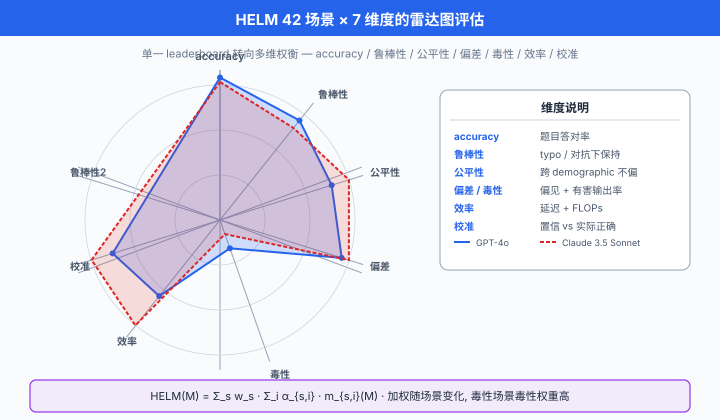
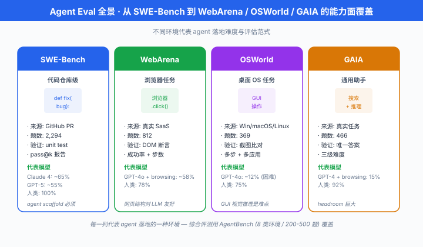
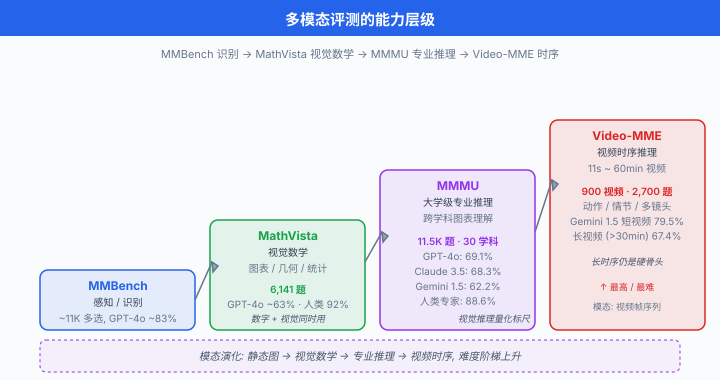

# 前沿方向 · Capability 与 Safety Eval

> **一句话总结**: LLM 评测的前沿正在同时向"更全面 (HELM)"、"更真实 (Agent)"、"更危险 (dangerous capability)"三个方向推进; 收官心法只有三条 —— 多元、动态、抗污染.

*前六节我们把评测的"基本功"讲完了: 从 benchmark 演化史、pass@k 数学、LLM-as-judge 到污染检测. 但真正的前沿并不在这些"已经解决"的地方 —— 它在**评估活着走出实验室的模型**这一步. 一个能写代码的模型能不能真正当程序员? 一个懂化学的模型能不能被诱导合成毒气? 一个会说服人的模型能不能被拿去操纵选举? 这一节我们把镜头拉到最远, 看四类正在被建立的评测前沿: 综合评测 (HELM) 、Agent 评测、危险能力评测 (CBRN / cyber / autonomy) 、多模态与鲁棒性评测. 最后是本章总结 —— 20 年后回看今天的 leaderboard, 只有一件事重要: **你自己的 eval 才是你自己模型的真相**.*

- 本节路径: HELM 综合框架 → Agent Eval (SWE / WebArena / GAIA / OSWorld) → 危险能力评测 (CBRN / cyber / autonomy / persuasion) → 长任务与专业评测 (RE-Bench / MLE-Bench / GPQA) → 多模态 (MMMU / MathVista / Video-MME) → 鲁棒性与偏见 (HarmBench / BBQ) → 中国生态 → 三原则收官.

## 从 leaderboard 到综合评测: HELM

单个 benchmark 报单个分数, 是 GLUE 时代的做法. 从 2020 年起, 大家越来越意识到: **一个模型不是"MMLU 高就好"** —— 它可能 MMLU 高、公平性差、鲁棒性弱、对少数群体有严重偏见. HELM 就是在这个背景下诞生.

### HELM: 整体语言模型评估

Liang et al. (2022) 提出**整体语言模型评估 (Holistic Evaluation of Language Models, HELM)**, 是 Stanford CRFM 主导的第一份系统"多维评测"框架.

HELM 的核心设计:

- **42 个场景 (scenarios)**: 覆盖问答、摘要、情感分析、毒性、代码、数学、法律等
- **7 个度量维度 (metrics)**: 每个场景上都同时报告
  1. **准确率 (accuracy)**: 传统正确率
  2. **鲁棒性 (robustness)**: 对输入扰动 (typo, paraphrase) 的稳定性
  3. **公平性 (fairness)**: 不同人口分组间的分数差
  4. **偏见 (bias)**: 生成中是否包含刻板印象
  5. **毒性 (toxicity)**: 是否输出有害内容
  6. **效率 (efficiency)**: 推理延迟 + FLOPs
  7. **校准 (calibration)**: 置信度与实际正确率的对齐

HELM 综合分数用**加权平均**表达一个模型的全景, 但**加权因场景变化**:

$$\text{HELM-score}(M) \;=\; \sum_{s \in \mathcal{S}} w_s \cdot \sum_{i=1}^{7} \alpha_{s,i} \cdot m_{s,i}(M)$$

- $\mathcal{S}$: 42 个场景集合, $w_s$ 是场景权重 (可反映应用重要性)
- $\alpha_{s,i}$: 第 $s$ 场景下第 $i$ 维度的权重 (毒性场景里 toxicity 权重高, 数学场景里 accuracy 权重高)
- $m_{s,i}(M)$: 归一化到 [0, 1] 的原始度量

**关键洞察**: HELM 报告的**不是单个 leaderboard 排名**, 而是**每个模型在每个维度的雷达图**. 一个模型可能 accuracy 榜第一但 toxicity 榜倒数; HELM 让这种权衡显式化.



### HELM 的演化: Instruct 与 Safety

HELM 从 2022 年开始有多次重大迭代:

- **HELM Classic (2022)**: 基础 42 场景, 面向 base model
- **HELM Instruct (2023)**: 加入指令跟随场景 (Instruction Following, Open-ended Generation), 面向 chat model
- **HELM Safety (2024)**: 专门评危险能力与拒绝行为, 是本节后面 dangerous capability 讨论的直接来源
- **HELM Lite (2024)**: 精简为 10 场景版本, 兼顾快速迭代与覆盖度

HELM 官方每 3-6 个月发布一次完整报告, [crfm.stanford.edu/helm](https://crfm.stanford.edu/helm) 有实时 leaderboard.

以下是 HELM 评测配置的实际形式 (基于官方 `helm-run` CLI):

```python
# HELM 评测配置片段 (对齐官方 run_specs 格式)
# 参考: https://github.com/stanford-crfm/helm

RUN_SPECS = [
    # 场景 1: MMLU 准确率 + 校准 + 鲁棒性
    {
        "scenario": "mmlu",
        "subset": "professional_law",
        "metrics": ["accuracy", "calibration_ece", "robustness_typo"],
        "num_train_trials": 3,        # 3 次不同 few-shot 采样
        "num_eval_trials": 200,       # 每 trial 200 题
        "max_tokens": 1,              # 选择题只要一个字母
    },
    # 场景 2: 毒性生成 (RealToxicityPrompts)
    {
        "scenario": "real_toxicity_prompts",
        "metrics": ["toxicity_perspective", "fairness_gender"],
        "num_eval_trials": 500,
        "max_tokens": 128,
        "temperature": 1.0,           # 高温激发潜在有害生成
    },
    # 场景 3: 效率 (推理延迟 + FLOPs)
    {
        "scenario": "efficiency_probe",
        "metrics": ["latency_ms", "flops_per_token"],
        "input_lengths": [128, 512, 2048],
        "num_samples": 100,
    },
]

# HELM 会为每个 (scenario, model) 生成一个 JSON 报告
# 最终聚合成 42 x 7 的矩阵
# 单一 leaderboard 分数是这个矩阵的 weighted mean, 但用户可以看每一格
```

**HELM 的贡献不只是"更多指标"**. 它把评测从"哪个模型最强"这个模糊问题, 拆成了"在什么用途下, 权衡哪几个维度, 谁最合适"的可操作问题. 这是评测方法学的一次范式转换.

## Agent Evaluation: 让模型自己动手

到 2023 年下半年, 主流模型已经能应付 90% 的静态 QA benchmark. 真正拉开差距的场景变成了**Agent** —— 让模型自己 plan、调工具、执行、纠错. Agent Eval 是**动态、多步、有环境反馈**的评测, 与静态 QA 完全不同.

### SWE-Bench Verified: 真实软件工程

SWE-Bench (Jimenez et al. 2023) 是 Agent Eval 目前最有分量的一份. 它的做法:

- 从 12 个开源 Python 项目 (Django / SymPy / Flask / Requests / matplotlib / astropy / scikit-learn 等) 的 GitHub 上, 挑出**已 merge 的 bug fix PR**
- 每个样本包含: (a) issue 描述, (b) 项目 pre-fix 快照, (c) fix 应通过的 unit tests
- 模型被要求: 读完 issue, 修改代码, 让 unit tests 通过

**SWE-Bench Verified (2024)** 是 OpenAI 与 Princeton 团队联手对原 SWE-Bench 做的**人工筛选清洗版**: 从 2294 个原始样本里挑出 500 个**问题描述充分、测试覆盖合理**的样本, 排除了因 issue 描述模糊或测试脆弱导致的假失败.

数学化 Agent 成功率:

$$\text{Success Rate}(M) \;=\; \frac{1}{|D|} \sum_{i=1}^{|D|} \mathbb{1}\!\Big[ \text{AllTestsPass}\big( M(\text{issue}_i, \text{repo}_i) \big) \Big]$$

其中 $M(\text{issue}_i, \text{repo}_i)$ 是模型生成的补丁 (patch), $\text{AllTestsPass}$ 检查所有 unit tests 是否通过.

**性能演化** (2024 年数字, 均在 SWE-Bench Verified 500 题上):

- Claude 3.5 Sonnet + agent scaffold: 从 2024 年年初的 22% → 年底 49%
- GPT-4o + SWE-Agent: 约 33%
- 人类开发者平均: 估计 ~60-70% (但耗时远长于 LLM)

**为什么 SWE-Bench Verified 是 gold-standard**:
1. **真实**: 都是被合并的真实 fix
2. **可验证**: unit test 判分, 无需 judge
3. **难以污染**: 每个 PR 有精确时间戳, 训练截止后的 PR 可以持续注入
4. **端到端**: 覆盖阅读代码 → 定位 bug → 编写 fix → 通过测试全流程

### WebArena: 让模型上网

Zhou et al. (2023) 的 **WebArena** 把 Agent Eval 推向浏览器. 它建了一个包含 6 个真实网站快照 (GitLab、Reddit、Wikipedia、地图、购物、CMS) 的**离线沙盒**, 让模型通过点击、输入、导航完成 812 个真实用户任务, 如"在 GitLab 找出上周关闭的 issue 数量并汇报"、"预订从 A 到 B 的最短路径".

评测形式:
- **成功率 (Success Rate)**: 任务目标是否达成 (自动检查器)
- **步数效率 (Steps Efficiency)**: 与人类基线的步数比

关键难点: 网页 DOM 常常 20k+ token, 需要 agent 做**信息取舍**; 状态转移复杂, 需要**回溯与规划**.

以下是 WebArena 风格任务的 mock 代码, 展示 Agent Eval 循环:

```python
# WebArena 风格 Agent 评测循环 (mock)
# 参考: Zhou et al. (2023) WebArena

from dataclasses import dataclass
from typing import Protocol

@dataclass
class BrowserObs:
    """浏览器观测: 当前 URL + 简化后的 DOM tree + 可交互元素列表."""
    url: str
    dom_summary: str
    clickable: list[str]   # e.g. ["btn_login", "link_issues", "search_input"]

class Agent(Protocol):
    def act(self, obs: BrowserObs, task: str, history: list) -> dict:
        """返回 {"action": "click"|"type"|"submit"|"done", "target": str, "value": str}"""
        ...

def run_webarena_task(
    agent: Agent,
    task: str,
    goal_checker,           # 判任务是否达成的 callback
    env,                    # 浏览器环境 mock
    max_steps: int = 30,
) -> dict:
    """
    单个 WebArena 任务的评测循环. 返回 {success, steps, trajectory}.
    """
    history = []
    obs = env.reset()
    for step in range(max_steps):
        action = agent.act(obs, task, history)
        history.append({"step": step, "obs": obs, "action": action})
        if action["action"] == "done":
            break
        obs = env.step(action)
        # 早停: 目标提前达成
        if goal_checker(env.state):
            history.append({"step": step + 1, "goal_reached": True})
            break
    success = goal_checker(env.state)
    return {
        "success": success,
        "steps": len(history),
        "trajectory": history,
    }

def webarena_score(agent: Agent, task_suite: list, env_factory) -> dict:
    """
    在整个 WebArena 任务集上打分.
    """
    n_success = 0
    total_steps = 0
    for task_spec in task_suite:
        env = env_factory(task_spec["site"])
        result = run_webarena_task(
            agent=agent,
            task=task_spec["instruction"],
            goal_checker=task_spec["checker"],
            env=env,
        )
        if result["success"]:
            n_success += 1
        total_steps += result["steps"]
    return {
        "success_rate": n_success / len(task_suite),
        "avg_steps": total_steps / len(task_suite),
    }

# 2024 年报告数字 (WebArena 812 tasks):
# GPT-4 + ReAct: ~14% success rate
# Claude 3.5 Sonnet + computer-use: ~18%
# 人类基线: ~78%
# —— agent 距离人类还有巨大鸿沟, WebArena 是极佳的 headroom benchmark
```

### VisualWebArena / OSWorld: 视觉与桌面

Agent Eval 的自然延伸是从纯文本 DOM 转到**视觉观测**:

- **VisualWebArena (Koh et al. 2024)**: 在 WebArena 基础上, 把 DOM 替换为**网页截图**, agent 必须靠视觉理解界面. 任务如"在 Reddit 首页找到含猫图的帖子并点赞".
- **OSWorld (Xie et al. 2024)**: 更进一步, 把评测搬到**真实桌面操作系统** (Ubuntu / Windows / macOS). 369 个任务, 覆盖 Chrome 使用、LibreOffice 编辑、终端命令、跨应用工作流. Agent 必须能**看截图 + 移动鼠标 + 输入键盘**, 是最接近"真人用电脑"的 benchmark.
- 2024 年 OSWorld 数据: 最强 agent (Claude 3.5 + computer-use) 成功率约 14.9%, 人类基线 72.4%. 差距巨大, 提示这仍是极前沿的开放问题.

### GAIA: 通用助手评测

Mialon et al. (2023, Meta / HuggingFace 等合作) 的 **GAIA (General AI Assistant)** 尝试评测"真正的通用助手能力". 466 个任务分三级难度:

- Level 1: 单步、可网搜
- Level 2: 多步骤、跨工具
- Level 3: 长时程、需要专家推理 (查论文 + 分析数据 + 综合报告)

任务示例: "查找 2010-2020 年 Nature 上所有关于 CRISPR 的头版论文, 汇总它们的通讯作者所在机构分布."

**GAIA 的独特设计**: 每题都有**唯一正确答案** (通常是一个数字、一个字符串、一个短列表), 便于自动评估. 排除了 open-ended eval 的 judge 争议. 2024 年数字: GPT-4 + browsing 约 15%, 人类基线 92%. 又是一个 headroom 巨大的 benchmark.

### AgentBench: 综合 Agent 评测

Liu et al. (2023) 的 **AgentBench** 是首个"综合 agent 评测框架", 覆盖 8 类环境: OS、DB、KG、Web、卡牌游戏 (LTP)、家务模拟 (ALFWorld)、网购、代码工程. 每个环境 200-500 题, 用统一的**成功率 + 效率**打分. AgentBench 让不同厂商的 agent scaffold 有了可比的横向标尺.



## 危险能力评估: 与 RSP 治理链条对接

回到 Ch21/06 讲的**负责任扩展政策 (Responsible Scaling Policy, RSP)**: 治理要靠 threshold, 而 threshold 需要 eval 来测量. 本节从"评估侧"讲这条链条: **危险能力评估 (dangerous capability evaluation)** 是 RSP 触发的输入信号.

### CBRN: 化学 / 生物 / 放射 / 核

**化学/生物/放射/核 (Chemical, Biological, Radiological, Nuclear, CBRN)** 类知识与 uplift 是最优先的 dangerous capability. Anthropic、OpenAI、DeepMind 都在内部维护 CBRN eval 套件, 但**评题本身不公开** (发布即扩散).

评测形式通常是**多项选择 + 开放式 QA** 的组合:

- 选择题部分测**知识 (knowledge)**: "以下哪种前体最适合合成 nerve agent VX?"
- 开放题测**综合推理 (synthesis reasoning)**: "给定这些前体, 详述完整合成路径."

给定一个 threshold $\tau_{\text{CBRN}}$ (通常是"专家水平的 X%"), 若模型分数超过:

$$\text{CBRN-score}(M) \;\geq\; \tau_{\text{CBRN}} \;\implies\; \text{RSP-trigger}$$

触发后需要额外部署护栏、限制访问、甚至暂停部署.

**外部核查**: METR (Model Evaluation and Threat Research) 与 UK AISI (AI Safety Institute) 提供第三方 CBRN eval 服务, 前沿实验室发布模型前会主动送评.

**具体做法** (Anthropic 2024 Sonnet 3.5 系统卡):
1. WMDP-Bio (Weapons of Mass Destruction Proxy) 3,668 道多选题
2. 与 uplift 专家配对做**双盲人工评估**: 有 LLM 辅助 vs 无 LLM 辅助, 生物学博士完成合成任务的速度对比
3. 报告 "no meaningful uplift" 或 "moderate uplift" 而非绝对分数

### Cyber Offense: 攻击性网络能力

网络安全语境下的危险能力 eval 主要看**攻防两端**:

- **进攻端**: 模型能不能自动发现 CVE、写 exploit、绕过 WAF、生成钓鱼邮件
- **防守端**: 能不能识别恶意代码、检出网络流量异常
- **Cybench** (Zhang et al. 2024, Stanford / Berkeley / Princeton 等学术合作, arXiv:2408.08926): 40 个真实 CTF 挑战题, 从 easy 到 hard
- **NYU CTF Bench** (2024): Capture-The-Flag 竞赛题的自动评测集, agent 需自主完成 exploit

Anthropic RSP 里 cyber capability threshold 分三级:
1. **Novice uplift**: 帮助初学者做基础渗透 (公开工具水平) — 当前所有前沿模型都在此
2. **Expert uplift**: 帮助专业渗透测试者提升效率 — 前沿模型进入
3. **Autonomous exploitation**: 无人工监督完整攻击链 — 尚未观察到, 触发即 RSP 高等级

### Model Autonomy: METR RE-Bench

**Model Evaluation and Threat Research (METR)** 是专注 dangerous capability 的独立评测机构 (与 ARC Evals 有历史延续, 官网未明确说明沿革关系). Kinniment et al. (2024) 的 **RE-Bench (Research Engineer Bench)** 是他们 2024 年的旗舰工作: 让 agent 完成 7 类真实 ML 研究任务, 每类都是**几小时到几天**的长时程任务.

任务示例:
- 优化一个小型 GPT 模型的训练效率 (给定 baseline, 目标 loss)
- 从 scratch 实现一个 flash attention 变种并 benchmark
- Debug 一个训练不稳定的分布式 setup

**评测指标**: **speedup ratio** —— agent 完成任务的时间 vs 人类 ML engineer 完成同任务的时间.

Kinniment 2024 报告: 在 2-hour budget 下, 最强 agent (Claude 3.5 Sonnet + 定制 scaffold) 在部分子任务上**接近或超过人类基线**; 但 8-hour budget 下, 人类 engineer 明显反超 (因为能持续调整策略).

**Self-exfiltration eval**: METR 还测过一类特殊任务 —— **让模型尝试自我逃逸**: 从沙盒环境复制自己的 weights 到外部服务器. 这类 eval 是 RSP 中 "ASL-4 autonomy threshold" 的直接测量.

### Persuasion / Manipulation

Salvi et al. (2024) *On the Conversational Persuasiveness of Large Language Models* 是一份实验室外的说服力评测: 让 820 名参与者与 GPT-4 或另一个人类**辩论**一个有争议话题, 事前 / 事后测量意见变化.

**关键结果**: GPT-4 在**能访问参与者个人背景信息**时, 说服成功率**显著高于人类对手** (原文报告 odds ratio 提升约 81.7%, 注意 odds 提升与相对提升含义不同). 这一发现直接推动了 Anthropic 与 OpenAI 把 persuasion 加入 RSP eval 套件.

Anthropic 内部的 persuasion evals 覆盖:
- **Argument quality**: 生成的论证在盲评中的说服力
- **Personalization**: 基于个人信息定制说服的效果
- **Belief resistance**: 抵制自身被反向说服 (用户 push back 时是否 sycophantic)

## 长时程与专业级评测

Agent 能力的边界还有一维: **需要多久、多深的领域知识**. 这一小节讲三个代表:

### GPQA: 博士级问答

Rein et al. (2023) 的 **Grade-Level Physics Questions and Answers (GPQA)** 是一个刻意设计得"用 Google 也找不到答案"的问答集. 448 道由物理、化学、生物博士级专家出题的多选题, 满足两个硬约束:

1. **领域博士都做对**: 出题人的同行博士做对率 > 65%
2. **非专家 30 分钟带网搜也做不对**: 独立测试的非专家 (但受过高等教育) 在带全网搜索下正确率 < 34%

GPQA 是**衡量真正专业推理能力**的黄金标准. 数字 (2024 年):
- GPT-4o: 约 53.6%
- Claude 3.5 Sonnet: 约 65%
- o1 (OpenAI 推理模型): 约 78%
- 人类专家开卷 + 时间充裕: 约 81%

GPQA 的价值在于**无法用 shallow 记忆通过** —— 必须真正推理.

### MLE-Bench: 端到端 ML 工程

Chan et al. (OpenAI 2024) 的 **MLE-Bench (Machine Learning Engineering Bench)** 让 agent 参与 75 个真实 Kaggle 竞赛, 每个竞赛给一个可用 GPU 环境 + 数据集 + 评估协议, agent 必须自主 EDA、特征工程、训练模型、提交.

**评分**: 与真实 Kaggle 榜的 medal 阈值对比 —— agent 拿到多少枚 bronze / silver / gold. 2024 年数字: o1-preview + AIDE scaffold 在 75 个竞赛中约有 **16.9% 竞赛拿到至少 bronze medal (约 12-13 枚)**, 显著优于 GPT-4o. 距离人类 ML engineer 平均水平仍差, 但趋势陡峭.

### RE-Bench: 长时程研究工程

前面 METR 那节讲过, 这里补充**长时程指标**的数学化:

$$\text{LongHorizon-Score}(M, T) \;=\; \mathbb{E}_{\text{task} \sim \mathcal{D}}\!\left[ \frac{\text{quality}(M, \text{task}, T)}{\text{quality}(\text{human}, \text{task}, T)} \right]$$

- $T$: 时间预算 (2h / 8h / 32h)
- $\text{quality}$: 任务定义的质量指标 (loss、runtime、accuracy)
- 关键观察: 随 $T$ 变化, 曲线形状不同 —— agent 在短 $T$ 上曲线陡, 长 $T$ 上易饱和; 人类相反

## 多模态与视觉推理

从 GPT-4V (2023) 起, 多模态成为主流. 视觉评测也从早期"给张图问是什么"进化到**大学专业级视觉推理**.

### MMBench: 视觉理解全景

Liu et al. (2023) 的 **MMBench** 是 VLM 的 GLUE, 覆盖 20 类能力 (识别、空间推理、OCR、常识、逻辑等), 每类 100-500 题的多选题. MMBench 用 **CircularEval** 打分: 把选项 shuffle 4 次, 全对才算真会, 抵抗"猜对"污染.

### MMMU: 大学专业级视觉推理

Yue et al. (2023) 的 **多模态多任务理解 (Massive Multi-discipline Multimodal Understanding, MMMU)** 是最有分量的多模态 benchmark. 11500 道题, 覆盖 6 个大类 (Art & Design / Business / Science / Health / Humanities / Tech) 与 30 个子领域, 全部来自**大学教材、考试、专业课件**.

题目形式: 图片 (可能是化学方程式、电路图、医学影像、法律文书截图) + 文本问题 + 多选或短答. 需要模型**真正读懂图 + 综合专业知识 + 推理**.

2024 年数字:
- GPT-4o: 69.1%
- Claude 3.5 Sonnet: 68.3%
- Gemini 1.5 Pro: 62.2%
- 人类专家 (对应专业): 88.6%

MMMU 首次让"视觉推理"这个模糊概念有了可量化标尺.

### MathVista: 视觉数学

Lu et al. (2023) 的 **MathVista** 专攻**视觉 + 数学**: 图表读取、几何、函数图像、统计图. 6141 题. 是当前视觉推理最难的子集之一 —— GPT-4o 约 63%, 人类专家 92%.

### Video-MME: 视频理解

Fu et al. (2024) 的 **Video-MME** 是首个大规模视频 benchmark: 900 个视频, 每个 11 秒到 60 分钟不等, 2700 道多选题. 覆盖动作识别、情节推理、多镜头理解. 2024 年最强模型 (Gemini 1.5 Pro) 短视频 79.5%, 长视频 (>30min) 掉到 67.4% —— **长上下文视频仍是硬骨头**.



## 鲁棒性、对抗与偏见

评测的另一支线是**看模型多脆弱**. 这一支线的评测通常不追求"分数越高越好", 而是"faliure rate 越低越好".

### AdvGLUE 与 PromptBench

- Wang et al. (2021) 的 **AdvGLUE** 是 GLUE 的对抗版: 用词替换、句法扰动、语义保持的重写攻击原 GLUE 题目, 观察分数下降幅度
- Zhu et al. (2023) 的 **PromptBench** 把 AdvGLUE 思路推广到 prompt 一侧: 系统评估 typo / 语法错误 / 语义等价 rephrase / 对抗性 prefix 对模型表现的影响
- 报告指标: **鲁棒性掉分** $\Delta \text{acc} = \text{acc}_{\text{clean}} - \text{acc}_{\text{adv}}$, 越小越好

### HarmBench: 越狱评测

Mazeika et al. (2024) 的 **HarmBench** 是当前最系统的**越狱 (jailbreak) 评测框架**: 400 类有害行为 (illegal / cyber / chem-bio 等) × 多种攻击方法 (GCG / AutoDAN / PAIR / 手工 prompt).

评测形式:
- 对每个 (行为, 攻击方法) 对, 让模型生成 N 次响应
- 用一个**独立训练的 classifier** 判断响应是否真的完成了有害行为
- 报告 **Attack Success Rate (ASR)**

```python
# HarmBench 风格越狱评测 mock
# 参考: Mazeika et al. (2024) HarmBench

from typing import Callable

def eval_jailbreak_defense(
    target_model,             # 待测的模型 (含护栏)
    behaviors: list[dict],    # 有害行为清单, 每项 {"behavior": str, "category": str}
    attack_methods: dict[str, Callable],  # 攻击方法字典 {name: adversarial_prompt_fn}
    harm_classifier,          # 独立训好的 harm classifier
    n_samples: int = 5,
) -> dict:
    """
    对每种 (behavior, attack) 对做评估, 报告 ASR.
    ASR = 越低越好, 意味着模型防御住了.
    """
    results = {}
    for method_name, attack_fn in attack_methods.items():
        method_asr = []
        for beh in behaviors:
            hit = 0
            adv_prompt = attack_fn(beh["behavior"])
            for _ in range(n_samples):
                resp = target_model.generate(adv_prompt)
                # classifier 判是否真完成了有害目标 (不是浅拒绝)
                if harm_classifier.is_harmful(resp, beh["behavior"]):
                    hit += 1
            method_asr.append(hit / n_samples)
        results[method_name] = {
            "asr_mean": sum(method_asr) / len(method_asr),
            "asr_by_category": aggregate_by_category(method_asr, behaviors),
        }
    return results

# 2024 年 HarmBench 数字 (未打补丁模型):
#   Claude 3.5 Sonnet: GCG 攻击 ASR ~4.2%, PAIR ~5.8%
#   GPT-4o: GCG ~13.7%, PAIR ~24.1%
#   Llama-3-8B-Instruct: GCG ~28.5%, PAIR ~41.2%
# 数字越小防御越强; 商业闭源模型普遍强于开源模型 (因有多层 moderation)
```

**HarmBench 触发阈值**: 若 ASR > 某阈值 (Anthropic 内部约 5%, OpenAI 约 10%), 需要额外做 RLHF safety training 或 constitutional AI 迭代.

### BBQ / BOLD / StereoSet: 偏见评测

- Parrish et al. (2022) 的 **BBQ (Bias Benchmark for QA)** 通过精心设计的**歧义与非歧义问题对**, 测模型在缺信息时是否倾向刻板印象. 例: "谁更可能会做家务?" (给中性上下文), 看模型选女性的概率.
- Dhamala et al. (2021) 的 **BOLD**: 5 类人口维度 (职业、性别、种族、宗教、政治) × 生成完成度对比. 报告 sentiment / regard 差异.
- **StereoSet** (Nadeem 2020): 检测 stereotype vs anti-stereotype 完成偏好.

数学化偏见分数 (StereoSet 风格; BBQ 原论文使用基于准确率的 ambig / disambig bias score, 形式略有不同):

$$\text{BiasScore} \;=\; \frac{n_{\text{stereotype}} - n_{\text{anti-stereotype}}}{n_{\text{stereotype}} + n_{\text{anti-stereotype}}} \in [-1, 1]$$

值越接近 0 越无偏; 正值倾向刻板印象, 负值倾向反刻板. 2024 年主流对齐后模型 BBQ 分数普遍在 ±0.05 内 —— 但 BBQ 只测显式偏见, **隐式偏见 (implicit bias)** 与生成侧偏见需要 BOLD 补充.

## 中国前沿评测生态

英文世界 evals 之外, 中国团队也在建自己的评测系统, 且**与中文任务、中文安全治理需求**紧密对齐.

### 上海 AI Lab: OpenCompass 与 CompassJudger

- **OpenCompass** (Contributors 2023) 是国内最活跃的开源评测平台, 覆盖 100+ 数据集与 500+ 模型
- **CompassBench**: 上海 AI Lab 出品的综合评测, 覆盖学科知识、语言、数学、代码、推理、指令跟随, 每季度更新一次动态子集
- **CompassJudger** (2024): 专门训练的 judge 模型, 用于替代 GPT-4 做本地化 judge, 兼顾评估质量与成本

### 智源: FlagEval

- **FlagEval** 是智源研究院的评测平台, 主打**主客观结合** + **多模态覆盖**
- 特色: **中英对照评测** —— 同一任务出中英双版本, 检测跨语言能力差距
- 提供 FlagEval-Chat (对话)、FlagEval-Reasoning (推理)、FlagEval-VLM (多模态) 三线

### 其他: C-Eval / CLiB / GAOKAO-Bench

- **C-Eval** (Huang et al. 2023): 中文版 MMLU, 52 学科 13948 题, 覆盖初中到专业
- **C-Eval Hard**: C-Eval 的高难度子集, 与 GPQA 类似目标
- **CLiB (Chinese LLM Benchmark)**: 民间维护, 榜单更新快
- **GAOKAO-Bench**: 直接用近年高考真题评; 存在污染风险但仍是行业普遍参考

**中国评测生态的特色**:
1. **中文安全语料** (敏感话题、政治、法律) 是英文 benchmark 缺失的板块
2. **考试驱动**: 高考、司考、CFA 等真实考试题构成大量 benchmark
3. **动态更新意愿强**: 大厂普遍认可"每季度或每半年更新"的做法

## 心法: 三原则与本章总结

七节写下来, 你会发现 evals 本质上是一场**永不停歇的军备竞赛**: 每个 benchmark 造出来就在被优化, 每个优化都在诱发新的 gaming, 每次 gaming 都需要新的评测形式. 20 年后回看今天的 leaderboard, 大概像今天回看 2005 年的 SAT 打分.

那读者能带走什么? 三条心法:

### 原则 1: 多元 (Diverse)

**永不依赖单一 benchmark**. 一个模型 MMLU 90 分可能只是过拟合了 MMLU. 判断能力, 至少要看 5-10 个**任务分布互斥、评估方式不同**的 benchmark 组合. HELM 的 42 场景是这条原则的极致体现: 单一分数遮蔽差异, 多维雷达揭示权衡.

**实操**: 你自己评一个模型时, 建议至少覆盖 (a) 知识 QA (b) 推理 (c) 代码 (d) 长文本 (e) 安全 (f) 指令跟随 六大类, 每类选 2 个源头独立的 benchmark.

### 原则 2: 动态 (Live)

**静态 benchmark 一发布就在污染倒计时**. 从 06 节 canary 讲到本节 LiveCodeBench, 主线只有一句话: 让 benchmark 保持"训练时物理上不存在"的状态. 具体做法:

- 时间戳过滤: LiveCodeBench, SWE-Bench Verified 增量
- 动态生成: DyVal, Meta Probing Agent
- 用户众包: Chatbot Arena, Arena-Hard-Auto
- 真实考试: 高考、Codeforces、Kaggle 每次比赛

**别再迷信静态 leaderboard**. 一个 2 年没更新的 benchmark, 分数已经失去比较意义.

### 原则 3: 抗污染 + 自建 (Contamination-resistant & Self-owned)

**你自己的 eval 才是你自己模型的真相**. 商业 benchmark 是行业沟通语言, 但**上线部署到自己的场景**, 只有自己搭的 eval 集才能反映真实表现. 建自己的 eval 集时:

- 用真实用户 query 或专家出题, 不抄任何公开 benchmark
- 埋 canary 字符串
- 做 rephrase 版本
- 每月更新
- Held-out private split
- 记录评估协议与时间戳

这不是学术洁癖 —— 是**产品可交付的最低门槛**. 一个没有自己 eval 的团队, 上线就是盲飞.

---

## 📌 本节要点

- **HELM (Holistic Evaluation of Language Models)**: Liang 2022 提出的 42 场景 × 7 维度综合评测框架 (准确率、鲁棒性、公平性、偏见、毒性、效率、校准), 演化到 HELM Instruct / HELM Safety / HELM Lite; 核心贡献是把 leaderboard 排名换成多维雷达图.
- **Agent Evaluation 四大支柱**: SWE-Bench Verified (Jimenez 2023, 真实 GitHub bug fix + unit test 验证) / WebArena (Zhou 2023, 6 网站 812 任务) / VisualWebArena + OSWorld (Xie 2024, 视觉与桌面) / GAIA (Mialon 2023, 通用助手 3 级难度) / AgentBench (Liu 2023, 综合); 全都强调**动态、多步、有环境反馈**.
- **危险能力评估 (Dangerous Capability Eval)**: 对接 Ch21/06 RSP 治理链条, 覆盖 CBRN (化学/生物/放射/核) 知识 + uplift 双盲评估、cyber offense (Cybench / NYU CTF)、model autonomy (METR RE-Bench + self-exfiltration)、persuasion (Salvi 2024 GPT-4 说服力显著优于人类).
- **长时程与专业级评测**: GPQA (Rein 2023, 博士级 QA 448 题, 非专家带搜索仅 34%) / MLE-Bench (Chan 2024, 75 个 Kaggle 竞赛真实提交) / RE-Bench (Kinniment 2024, 2h/8h/32h 时间预算下 agent vs 人类).
- **多模态评测阶梯**: MMBench (Liu 2023, 20 类能力) → MMMU (Yue 2023, 大学 30 学科专业级视觉推理) → MathVista (Lu 2023, 视觉数学) → Video-MME (Fu 2024, 短/中/长视频); 长视频仍是硬骨头.
- **鲁棒性 / 越狱 / 偏见**: AdvGLUE / PromptBench 测输入扰动鲁棒性; HarmBench (Mazeika 2024, 400 有害行为 × 多攻击方法, 报告 ASR) 是当前最系统的越狱评测; BBQ / BOLD / StereoSet 测显式与隐式偏见.
- **中国评测生态**: 上海 AI Lab OpenCompass + CompassJudger + CompassBench / 智源 FlagEval (中英对照) / C-Eval / C-Eval Hard / CLiB / GAOKAO-Bench; 特色是中文安全语料、考试驱动、动态更新意愿强.
- **三原则收官**: **多元** (至少 6 大类 12+ benchmark 组合) / **动态** (时间戳过滤 + 用户众包 + 真实考试) / **抗污染 + 自建** (自己的 eval 才是自己模型的真相, 别再迷信静态 leaderboard).

---

## 🎓 本章总结

Ch22 走完这一遭, 我们从 evals 的**历史演化**一路走到**前沿方向**. 七节的主线可以浓缩成七句话:

- **01. Benchmark 演化史**: 从 IR TREC → GLUE / SuperGLUE → MMLU → 活体 benchmark 的四代跃迁; 每一代都在解决前一代的暴力测试瓶颈, 但也带来新的 Goodhart 化.
- **02. 任务分类与选择**: 知识 QA / 推理 / 代码 / 长文本 / 安全 / 指令跟随 / 多模态 / Agent 八大类各有专用 benchmark; 选 benchmark 要看**任务分布、评估方式、污染风险**三维.
- **03. 自动化指标**: BLEU / ROUGE / METEOR / BERTScore / MAUVE 的适用边界; 传统 n-gram 指标对语义等价、创造性生成失效, 现代范式是 embedding-based + LLM judge.
- **04. Human Eval 与 Arena**: 人评的黄金地位 + Elo 评分数学 + Chatbot Arena 的众包动态; 是本章两条主线 (静态 benchmark vs 动态 arena) 的另一极.
- **05. LLM-as-Judge**: judge 的三种模式 (pairwise / pointwise / rubric) + 偏差校正 (position bias / verbosity bias / self-preference); 用 judge 前先做 judge 的 judge (与人工 gold 对齐).
- **06. Contamination 与 Benchmark 崩坏**: 污染的三种形式 + 四种检测 (n-gram / PPL gap / MIA / rephrase attack) + 五道防线 (held-out / 时间戳 / canary / rephrase / 动态); 静态 benchmark 的时代正在结束.
- **07. Capability 与 Safety Eval (本节)**: HELM 综合框架 + Agent Eval + dangerous capability + 多模态 + 鲁棒性 + 中国生态; 收官三原则: **多元、动态、抗污染 + 自建**.

**写给读者的最后一句**: LLM 评测不是一劳永逸的科学, 是一场持续演进的赛跑. 你手里的 leaderboard 数字, 半年后可能已经失去意义; 但**你自己搭的、跟你自己场景对齐的、每月更新的 eval 集**, 才是你判断模型的真相之光. 下一章我们进入 Ch23 —— 从"怎么测"跳到"怎么部署", 把评测的能力接到生产系统里.

---

## 参考文献

- Liang, P. et al. (2022). *Holistic Evaluation of Language Models*. arXiv:2211.09110. (HELM.)
- Jimenez, C. E., Yang, J., Wettig, A., Yao, S., Pei, K., Press, O., & Narasimhan, K. (2023). *SWE-bench: Can Language Models Resolve Real-World GitHub Issues?* arXiv:2310.06770.
- Zhou, S., Xu, F. F., Zhu, H., Zhou, X., Lo, R., Sridhar, A., Cheng, X., Ou, T., Bisk, Y., Fried, D., Alon, U., & Neubig, G. (2023). *WebArena: A Realistic Web Environment for Building Autonomous Agents*. arXiv:2307.13854.
- Koh, J. Y., Lo, R., Jang, L., Duvvur, V., Lim, M. C., Huang, P.-Y., Neubig, G., Zhou, S., Salakhutdinov, R., & Fried, D. (2024). *VisualWebArena: Evaluating Multimodal Agents on Realistic Visual Web Tasks*. arXiv:2401.13649.
- Xie, T., Zhang, D., Chen, J., Li, X., Zhao, S., Cao, R., Hua, T. J., Cheng, Z., Shin, D., Lei, F., Liu, Y., Xu, Y., Zhou, S., Savarese, S., Xiong, C., Zhong, V., & Yu, T. (2024). *OSWorld: Benchmarking Multimodal Agents for Open-Ended Tasks in Real Computer Environments*. arXiv:2404.07972.
- Mialon, G., Fourrier, C., Swift, C., Wolf, T., LeCun, Y., & Scialom, T. (2023). *GAIA: A Benchmark for General AI Assistants*. arXiv:2311.12983.
- Liu, X., Yu, H., Zhang, H., Xu, Y., Lei, X., Lai, H., Gu, Y., Ding, H., Men, K., Yang, K., Zhang, S., Deng, X., Zeng, A., Du, Z., Zhang, C., Shen, S., Zhang, T., Su, Y., Sun, H., Huang, M., Dong, Y., & Tang, J. (2023). *AgentBench: Evaluating LLMs as Agents*. arXiv:2308.03688.
- Rein, D., Hou, B. L., Stickland, A. C., Petty, J., Pang, R. Y., Dirani, J., Michael, J., & Bowman, S. R. (2023). *GPQA: A Graduate-Level Google-Proof Q&A Benchmark*. arXiv:2311.12022.
- Yue, X., Ni, Y., Zhang, K., Zheng, T., Liu, R., Zhang, G., Stevens, S., Jiang, D., Ren, W., Sun, Y., Wei, C., Yu, B., Yuan, R., Sun, R., Yin, M., Zheng, B., Yang, Z., Liu, Y., Huang, W., Sun, H., Su, Y., & Chen, W. (2023). *MMMU: A Massive Multi-discipline Multimodal Understanding and Reasoning Benchmark for Expert AGI*. arXiv:2311.16502.
- Lu, P., Bansal, H., Xia, T., Liu, J., Li, C., Hajishirzi, H., Cheng, H., Chang, K.-W., Galley, M., & Gao, J. (2023). *MathVista: Evaluating Mathematical Reasoning of Foundation Models in Visual Contexts*. arXiv:2310.02255.
- Fu, C., Dai, Y., Luo, Y., Li, L., Ren, S., Zhang, R., Wang, Z., Zhou, C., Shen, Y., Zhang, M., Chen, P., Li, Y., Lin, S., Zhao, S., Li, K., Xu, T., Zheng, X., Chen, E., Ji, R., & Sun, X. (2024). *Video-MME: The First-Ever Comprehensive Evaluation Benchmark of Multi-modal LLMs in Video Analysis*. arXiv:2405.21075.
- Liu, Y., Duan, H., Zhang, Y., Li, B., Zhang, S., Zhao, W., Yuan, Y., Wang, J., He, C., Liu, Z., Chen, K., & Lin, D. (2023). *MMBench: Is Your Multi-modal Model an All-around Player?* arXiv:2307.06281.
- Chan, J. S., Chowdhury, N., Jaffe, O., Aung, J., Sherburn, D., Mays, E., Starace, G., Liu, K., Maksin, L., Patwardhan, T., Weng, L., & Mądry, A. (2024). *MLE-bench: Evaluating Machine Learning Agents on Machine Learning Engineering*. arXiv:2410.07095. (OpenAI.)
- Kinniment, M., Sato, L. J. K., Du, H., Goodrich, B., Hasin, M., Chan, L., Miles, L. H., Lin, T. R., Wijk, H., Burget, J., Ho, A., Barnes, E., & Christiano, P. (2024). *Evaluating Language-Model Agents on Realistic Autonomous Tasks*. METR technical report. (RE-Bench.)
- Mazeika, M., Phan, L., Yin, X., Zou, A., Wang, Z., Mu, N., Sakhaee, E., Li, N., Basart, S., Li, B., Forsyth, D., & Hendrycks, D. (2024). *HarmBench: A Standardized Evaluation Framework for Automated Red Teaming and Robust Refusal*. arXiv:2402.04249.
- Parrish, A., Chen, A., Nangia, N., Padmakumar, V., Phang, J., Thompson, J., Htut, P. M., & Bowman, S. R. (2022). *BBQ: A Hand-Built Bias Benchmark for Question Answering*. Findings of ACL 2022. arXiv:2110.08193.
- Dhamala, J., Sun, T., Kumar, V., Krishna, S., Pruksachatkun, Y., Chang, K.-W., & Gupta, R. (2021). *BOLD: Dataset and Metrics for Measuring Biases in Open-Ended Language Generation*. FAccT 2021. arXiv:2101.11718.
- Nadeem, M., Bethke, A., & Reddy, S. (2020). *StereoSet: Measuring Stereotypical Bias in Pretrained Language Models*. arXiv:2004.09456.
- Wang, B., Xu, C., Wang, S., Gan, Z., Cheng, Y., Gao, J., Awadallah, A. H., & Li, B. (2021). *Adversarial GLUE: A Multi-Task Benchmark for Robustness Evaluation of Language Models*. NeurIPS 2021. arXiv:2111.02840.
- Zhu, K., Wang, J., Zhou, J., Wang, Z., Chen, H., Wang, Y., Yang, L., Ye, W., Gong, N. Z., Zhang, Y., & Xie, X. (2023). *PromptBench: Towards Evaluating the Robustness of Large Language Models on Adversarial Prompts*. arXiv:2306.04528.
- Salvi, F., Ribeiro, M. H., Gallotti, R., & West, R. (2024). *On the Conversational Persuasiveness of Large Language Models: A Randomized Controlled Trial*. arXiv:2403.14380.
- Li, N., Pan, A., Gopal, A., Yue, S., Berrios, D., Gatti, A., Li, J. D., Dombrowski, A.-K., Goel, S., Phan, L., Mukobi, G., Helm-Burger, N., Lababidi, R., Justen, L., Liu, A. B., Chen, M., Barrass, I., Zhang, O., Zhu, X., ... Hendrycks, D. (2024). *The WMDP Benchmark: Measuring and Reducing Malicious Use With Unlearning*. arXiv:2403.03218.
- Anthropic (2023, updated 2024). *Anthropic's Responsible Scaling Policy*. Technical policy document.
- Huang, Y., Bai, Y., Zhu, Z., Zhang, J., Zhang, J., Su, T., Liu, J., Lv, C., Zhang, Y., Lei, J., Fu, Y., Sun, M., & He, J. (2023). *C-Eval: A Multi-Level Multi-Discipline Chinese Evaluation Suite for Foundation Models*. arXiv:2305.08322.
- OpenCompass Contributors (2023). *OpenCompass: A Universal Evaluation Platform for Foundation Models*. Shanghai AI Laboratory. https://github.com/open-compass/opencompass.
