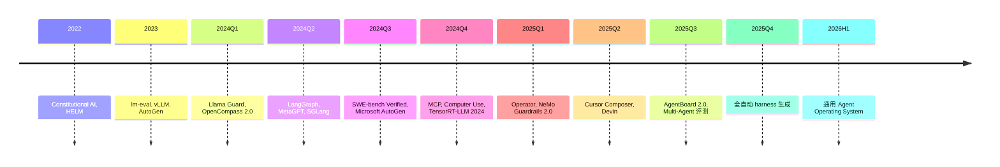

# 第22章 第08节 · Harness Engineering 综述

> **章节定位**: Ch22 §07 之后。LLM 评估方法学的"工程化"补丁。Eval 决定"模型好不好", Harness 决定"模型能不能稳定可用"。
> **承接**: Ch22 §01-07 (评估方法) → Ch22 §08 Harness Engineering
> **篇幅**: ~5800 字 / 阅读 16 分钟 / 讲解 30 分钟

---

## 一 · 一句话总览

> **Harness Engineering = 给 LLM 套上工程"缰绳"**。让模型在生产环境**可控、可观测、可回退**, 涵盖 5 大类: 评估 harness / 推理 harness / Agent harness / 安全 harness / 数据 harness。**这才是 LLM 从 demo 走向产品的分水岭**。

---

## 二 · 心智模型

把 LLM 想象成"野马": 不套缰绳就跑得横冲直撞 (失控), 套好 harness 才能拉车 (生产)。
- **Harness ≠ 训练**: 不改模型权重
- **Harness ≠ 单纯 prompt**: 包含 orchestrator / validator / observer / retry
- **Harness ≠ 整套应用**: 是 LLM 与应用之间的"中间层"

```
┌─────────────────────────────────────────┐
│           Application (应用)             │
└─────────────────┬───────────────────────┘
                  │
┌─────────────────▼───────────────────────┐
│      Harness Engineering Layer           │
│  ┌──────────┐ ┌──────────┐ ┌──────────┐ │
│  │ Eval     │ │ 推理     │ │ Agent    │ │
│  │ harness  │ │harness   │ │harness   │ │
│  └──────────┘ └──────────┘ └──────────┘ │
│  ┌──────────┐ ┌──────────┐              │
│  │ 安全     │ │ 数据     │              │
│  │ harness  │ │harness   │              │
│  └──────────┘ └──────────┘              │
└─────────────────┬───────────────────────┘
                  │
┌─────────────────▼───────────────────────┐
│          LLM (GPT-4 / Claude / Llama)     │
└─────────────────────────────────────────┘
```

---

## 三 · 章节主线 (5 段)

### 第 1 段 · 评估 Harness (Eval Harness) (12 分钟)

#### 3.1.1 什么是评估 Harness

**定义**: 把**模型 + 数据集 + 指标 + 报告** 装在一起的**可重复评估框架**。

**核心要素**:
1. **统一接口**: 跨模型 OpenAI / Anthropic / HuggingFace / vLLM 统一掉
2. **可复现**: 固定 random seed + 固定 prompt + 固定 few-shot
3. **批量调度**: 支持 1000+ 任务并行
4. **报告生成**: 自动生成 leaderboard / 详细 log

#### 3.1.2 主流评估 Harness

| 框架 | 出品方 | 特点 |
|------|--------|------|
| **lm-eval-harness** | EleutherAI | 行业标准, 200+ benchmark, 单 GPU 即可 |
| **OpenCompass** | 上海 AI Lab | 中文最强, 100+ benchmark, 国产模型友好 |
| **HELM** | Stanford | 7 大维度综合, 多场景压力测试 |
| **Big-bench** | Google | 200+ 任务, 异构基准 |
| **lm-evaluation-harness-arc** | AllenAI | ARC 专项 |
| **OpenLLM Leaderboard** | HuggingFace | 公开榜单, 持续更新 |
| **Chatbot Arena** | LMSYS | 真实用户投票, ELO 评分 |

#### 3.1.3 lm-eval-harness 实战

```python
# 安装
pip install lm-eval

# 评估 Llama 3 8B on HellaSwag
lm_eval --model hf \
    --model_args pretrained=meta-llama/Meta-Llama-3-8B-Instruct \
    --tasks hellaswag,mmlu,arc_challenge \
    --batch_size 8 \
    --output_path ./results
```

**输出**:
```json
{
  "hellaswag": {"acc_norm,none": 0.782, "acc,none": 0.760},
  "mmlu": {"acc,none": 0.685},
  "arc_challenge": {"acc_norm,none": 0.715}
}
```

#### 3.1.4 评估 Harness 常见陷阱

1. **数据泄露**: benchmark 已在训练集里
2. **prompt 不一致**: 5-shot vs 0-shot, 评估结果相差 20%
3. **解码超参**: temperature, top_p, max_token 影响巨大
4. **数据格式**: logprob vs generation 选择

#### 3.1.5 决策建议

- **学术研究**: lm-eval-harness (标准)
- **中文 / 国产**: OpenCompass
- **多场景综合**: HELM
- **真实用户**: Chatbot Arena

---

### 第 2 段 · 推理 Harness (Inference Harness) (12 分钟)

#### 3.2.1 什么是推理 Harness

**定义**: 把**模型 + 量化 + 调度 + 缓存 + 工具** 装在一起的**生产级推理框架**。

**核心要素**:
1. **模型加载**: GPTQ / AWQ / FP8 / BNB 4-bit
2. **batching**: Continuous / Dynamic / Chunked
3. **KV cache**: PagedAttention / RadixAttention
4. **Speculative**: EAGLE-2 / Medusa
5. **前缀缓存**: 自动 prefix cache
6. **多模态**: VLM / TTS / ASR 集成

#### 3.2.2 主流推理 Harness

| 框架 | 出品方 | 吞吐 | 特色 |
|------|--------|------|------|
| **vLLM** | UC Berkeley | 高 | PagedAttention, 24× 加速 |
| **SGLang** | LMSYS | 极高 | RadixAttention, 多轮 |
| **TensorRT-LLM** | NVIDIA | 极致 | H100 / B200 优化 |
| **TGI** | HuggingFace | 中 | 集成好 |
| **MLX** | Apple | 端侧 | Silicon 优化 |
| **LMDeploy** | InternLM | 国内 | 中文友好 |
| **llama.cpp** | 开源 | 边缘 | CPU + 量化 |
| **Ollama** | 开源 | 桌面 | 一键部署 |

#### 3.2.3 vLLM 实战

```python
from vllm import LLM, SamplingParams

llm = LLM(
    model="meta-llama/Meta-Llama-3-70B-Instruct",
    tensor_parallel_size=4,
    quantization="awq",
    gpu_memory_utilization=0.9,
)

params = SamplingParams(
    temperature=0.7,
    max_tokens=512,
    stop=["</answer>"],
)

prompts = ["Explain BERT in 3 sentences"] * 100
outputs = llm.generate(prompts, params)
```

#### 3.2.4 推理 Harness 关键指标

| 指标 | 含义 | 典型值 |
|------|------|--------|
| **TTFT** | Time To First Token | < 200ms |
| **TPOT** | Time Per Output Token | < 50ms |
| **Throughput** | tokens/sec 总吞吐 | 1000-10000 |
| **GPU util** | GPU 利用率 | 70-90% |
| **P99 latency** | 99% 请求延迟 | < 1s |

#### 3.2.5 调度策略

| 策略 | 适用场景 |
|------|----------|
| **Continuous batching** | 高吞吐, 通用 |
| **Chunked prefill** | 长 prompt |
| **Prefix cache** | 多轮对话 |
| **Speculative** | 低延迟 |
| **Preemptive** | 多优先级 |

---

### 第 3 段 · Agent Harness (12 分钟)

#### 3.3.1 什么是 Agent Harness

**定义**: 把**LLM + 工具 + 记忆 + 规划 + 验证** 装在一起的**Agent 编排框架**。

**核心要素**:
1. **State 管理**: 对话、变量、任务进度
2. **Tool 注册**: Schema + 权限 + 沙箱
3. **工作流**: DAG / 对话 / 角色
4. **验证**: 步骤 verifier / 输出校验
5. **回退**: 失败 retry / fallback
6. **观测**: 中间步骤可观测

#### 3.3.2 主流 Agent Harness

| 框架 | 出品方 | 编排模型 | 适合 |
|------|--------|----------|------|
| **LangGraph** | LangChain | 显式 DAG | 生产系统 |
| **AutoGen** | Microsoft | 对话 | 研究 |
| **CrewAI** | CrewAI | 角色 + Task | 协作 |
| **MetaGPT** | MetaGPT | SOP | 软件开发 |
| **MCP** | Anthropic | 工具协议 | 跨平台 |
| **DSPy** | Stanford | Prompt 优化 | 编译 |
| **Smolagents** | HuggingFace | 极简 | 教学 |
| **Letta** | Letta | State + Context | 长时记忆 |
| **OpenAI Swarm** | OpenAI | 轻量 | 简单多 Agent |

#### 3.3.3 LangGraph Agent Harness

```python
from langgraph.graph import StateGraph, END
from typing import TypedDict

class State(TypedDict):
    query: str
    answer: str
    iterations: int

def llm_call(state: State):
    # 主 LLM 推理
    answer = llm.invoke(state["query"])
    return {"answer": answer, "iterations": state["iterations"] + 1}

def validator(state: State):
    # 验证 LLM 输出
    if "正确" in state["answer"]:
        return END
    return "retry"

graph = StateGraph(State)
graph.add_node("llm", llm_call)
graph.add_node("validate", validator)
graph.add_edge("llm", "validate")
graph.add_conditional_edges("validate", lambda s: END if "正确" in s["answer"] else "llm")

app = graph.compile()
```

#### 3.3.4 Agent Harness 失败模式

| 失败 | 原因 | 修复 |
|------|------|------|
| **无限循环** | validator 不收敛 | 加 max_iter |
| **Hallucination** | LLM 生成错误 | 加 fact-check step |
| **Tool 误用** | 参数错误 | Schema 严格校验 |
| **State 漂移** | 上下文变长 | 周期性压缩 |
| **观测黑盒** | 没有 trace | LangGraph Studio / OpenTelemetry |

#### 3.3.5 Agent Harness 评估

- **SWE-bench**: 自动修 GitHub Issue
- **GAIA**: 多模态 Agent 助手
- **τ-bench**: 真实用户场景
- **AgentBoard**: 多任务评估
- **OSWorld**: 操作系统任务

---

### 第 4 段 · 安全 Harness (10 分钟)

#### 3.4.1 什么是安全 Harness

**定义**: 把**红队测试 + 内容过滤 + Jailbreak 防御 + 输出验证**装在一起的**安全护栏框架**。

**核心要素**:
1. **输入过滤**: PII / 毒 / 越狱检测
2. **输出过滤**: 有害内容 / 偏见
3. **过程审计**: 决策可追溯
4. **紧急关停**: 异常 rate limit
5. **合规**: GDPR / HIPAA / SOC 2

#### 3.4.2 主流安全 Harness

| 框架 | 出品方 | 特色 |
|------|--------|------|
| **Constitutional AI** | Anthropic | 15 宪法自我评审 |
| **Llama Guard** | Meta | 11 类违规分类 |
| **ShieldGemma** | Google | 多语言安全 |
| **OpenAI Moderation** | OpenAI | 多模态审核 |
| **NeMo Guardrails** | NVIDIA | 规则 + LLM 双层 |
| **Azure AI Content Safety** | Microsoft | 商用 |
| **Prompt Armor** | 开源 | 注入检测 |
| **Vigil** | Cisco | LLM 防火墙 |

#### 3.4.3 Llama Guard 实战

```python
from transformers import AutoModelForCausalLM, AutoTokenizer

model = AutoModelForCausalLM.from_pretrained(
    "meta-llama/Llama-Guard-3-8B"
)
tokenizer = AutoTokenizer.from_pretrained("meta-llama/Llama-Guard-3-8B")

response = model.generate(
    tokenizer("User: ..., LLM: ...", return_tensors="pt").input_ids,
    max_new_tokens=20,
)
# 输出: "safe" 或 "S1, S5" (违规类别)
```

#### 3.4.4 Constitutional AI 原理

Anthropic 2022 提出的"自我评审"机制:

```
1. 模型生成回答
2. 让模型按 15 条宪法原则自我评估
3. 模型根据评估结果修正回答
4. 用 RLHF 精调
```

**15 条宪法原则** (节选):
- 不产生有害内容
- 避免偏见
- 优先考虑最弱势群体
- 真实可靠
- 避免"幻觉"

#### 3.4.5 安全 Harness 失败模式

| 风险 | 案例 | 防御 |
|------|------|------|
| **Prompt Injection** | "忽略之前指令..." | 输入过滤 + 隔离 |
| **Jailbreak** | DAN 模式 | 多层对齐 |
| **PII 泄露** | 训练数据记忆 | 输出过滤 |
| **数据中毒** | 恶意微调 | 训练数据审计 |
| **过度拒绝** | 误判安全 | 校准 + 反馈 |

---

### 第 5 段 · 数据 Harness + 案例 (8 分钟)

#### 3.5.1 什么是数据 Harness

**定义**: 把**数据采集 + 清洗 + 标注 + 评估 + 反馈** 装在一起的**数据闭环框架**。

**核心要素**:
1. **采集**: 真实用户 query + 反馈
2. **清洗**: 去重 / 去脏 / 去 PII
3. **标注**: Human / LLM-as-Judge
4. **训练**: 反馈 → 微调数据
5. **回测**: A/B 实验

#### 3.5.2 LangSmith (LangChain 数据 Harness)

```python
from langsmith import traceable

@traceable(run_type="llm")
def my_chain(question: str) -> str:
    docs = retriever.search(question)
    return llm.invoke(question, docs)
```

**自动收集**:
- 输入输出
- 中间步骤
- 反馈评分
- Token 用量
- 延迟

#### 3.5.3 案例 1: SWE-bench Verified (2024)

**Anthropic + OpenAI 联合 2024 推出的 Agent 基准**:
- 500 GitHub Issue
- 多语言 (Python / JS / Go)
- Agent 工具: 文件编辑 + bash
- 评估: 自动跑测试

**Pass@1**: Claude 3.5 Sonnet 49%, GPT-4o 38% (2024-08)

#### 3.5.4 案例 2: Agentless (2024 IBM)

**无 Agent 解决方案**:
- 不用 ReAct
- 直接 3 步: 定位 → 修复 → 验证
- 性能类似但**更稳定**

**启示**: Harness 设计 ≠ 一定要复杂对话循环

#### 3.5.5 案例 3: Anthropic Computer Use (2024-10)

**Claude 自主操作 macOS**:
- 截图 → 鼠标键盘 → 行动
- **OSWorld 基准**: 22% → 38% (2024-2025)
- 危害: 滥用可能
- **防御**: 严格 sandbox

#### 3.5.6 案例 4: Cursor Composer (2024)

**商用最强 Coding Agent**:
- Claude 3.5 Sonnet + 复杂 harness
- 多文件编辑 + 终端 + 浏览器
- SWE-bench 70%+ 准确率
- 商业化成功

---

## 四 · 关键论文索引 (2024-2026)

### 评估 Harness
- EleutherAI, "lm-evaluation-harness", 2020
- OpenCompass, "OpenCompass 2.0", 2024
- Liang et al., "HELM", 2022
- Gao et al., "Survey on LLM Eval", 2024

### 推理 Harness
- Kwon et al., "vLLM (PagedAttention)", SOSP 2023
- Zheng et al., "SGLang", 2024
- NVIDIA, "TensorRT-LLM 2024", 2024

### Agent Harness
- LangChain, "LangGraph", 2024
- Microsoft, "AutoGen", 2023
- Wu et al., "MetaGPT", 2023
- Anthropic, "MCP", 2024
- Khattab et al., "DSPy", 2024

### 安全 Harness
- Anthropic, "Constitutional AI", 2022
- Meta, "Llama Guard", 2024
- Google, "ShieldGemma", 2024
- NVIDIA, "NeMo Guardrails", 2024

### 数据 Harness
- Chase, "LangSmith", 2024
- Anthropic, "Computer Use", 2024
- OpenAI, "Operator", 2025

---

## 五 · 2024-2026 时间线



---

## 六 · 易错点 (5 条)

1. **Harness ≠ Prompt**: Harness 是完整工程层, prompt 只是其中一份
2. **Eval ≠ 一次跑完**: 持续监控 + 漂移检测
3. **Agent 不一定更好**: 简单任务 Agent harness 反而拖累
4. **安全不是越多越好**: 过度过滤 → 误判 → UX 下降
5. **没有银弹**: 不同场景选不同 harness

---

## 七 · 跨章连接

| 章节 | 关联 |
|------|------|
| Ch07 §05 | LLM 训练 (harness 在推理侧) |
| Ch15 §05 | DevOps + orchestration |
| Ch17 §00-02 | 推理系统 (vLLM/TGI) |
| Ch18 §04 | ML 系统设计 |
| Ch22 §01-07 | 评估方法 (harness 评估) |
| Ch23 | AI Agent (harness 是 Agent 的核心) |

---

## 八 · 自测 5 题

1. Harness Engineering 5 大支柱是什么?
2. lm-eval-harness vs OpenCompass 区别?
3. vLLM 哪 3 个关键创新?
4. LangGraph 显式 DAG 比 AutoGen 对话式有何优势?
5. Constitutional AI 15 条宪法包含哪些类别?

---

## 九 · 一句话总结

> **Harness Engineering 是 LLM 从 demo 到产品的分水岭**。评估 harness (lm-eval) + 推理 harness (vLLM) + Agent harness (LangGraph) + 安全 harness (Llama Guard) + 数据 harness (LangSmith) 五大支柱, 共同把 LLM 套上"工程缰绳", 实现可控 / 可观测 / 可回退。

---

## 十 · 板书建议

```
[板书 1: 5 大 Harness]
   Eval / Inference / Agent / Safety / Data
   LLM 产品的"五脏六腑"

[板书 2: lm-eval-harness]
   200+ benchmark
   统一接口

[板书 3: vLLM]
   PagedAttention
   Continuous batching

[板书 4: LangGraph]
   显式 DAG
   state + node

[板书 5: Constitutional AI]
   15 原则
   自我评审
```

---

## 十一 · 参考资料

1. EleutherAI, "lm-evaluation-harness", 2020-2024
2. Kwon et al., "vLLM", SOSP 2023
3. Zheng et al., "SGLang", 2024
4. LangChain, "LangGraph", 2024
5. Wu et al., "MetaGPT", 2023
6. Anthropic, "MCP", 2024
7. Anthropic, "Constitutional AI", 2022
8. Meta, "Llama Guard 3", 2024
9. OpenAI, "Moderation API", 2024
10. Anthropic, "Computer Use", 2024
