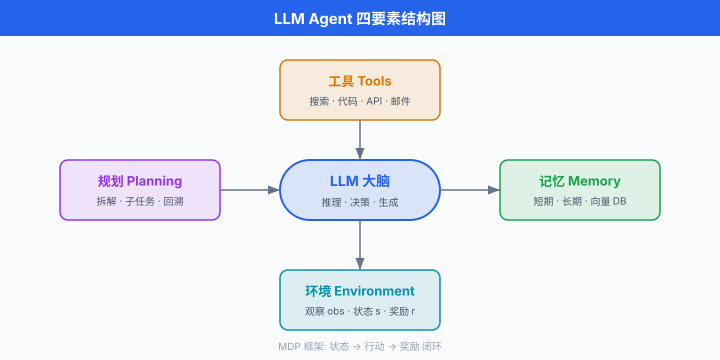
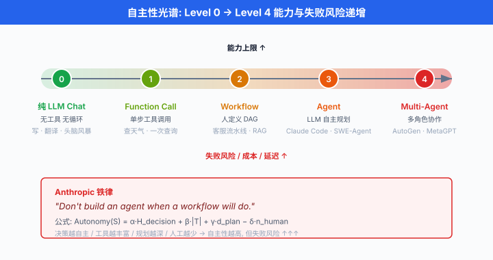
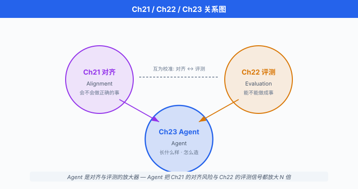

# 什么是 AI Agent · 从 LLM 到 Agent 的跃迁

> **一句话总结**: LLM 是"回答问题的", Agent 是"完成任务的"; 从一问一答的 Chat 到"规划-行动-观察-再规划"的循环, 是大模型从工具进化为员工的关键跃迁.

## 🗺️ 本章导览

- 本章覆盖 AI Agent 与工具使用: 从推理规划到生产落地
- **01. 什么是 AI Agent · 从 LLM 到 Agent 的跃迁** (本节): 定义、自主性光谱、Agent vs Pipeline
- **02. Prompt-based 推理与规划**: 思维链 (Chain-of-Thought)、ReAct、Reflexion、Tree of Thoughts
- **03. 工具使用与函数调用**: Toolformer、OpenAI function calling、工具选择
- **04. 模型上下文协议 MCP**: 协议规范、生态、真实案例
- **05. Multi-Agent 编排系统**: AutoGen、LangGraph、CrewAI 对比
- **06. Agent 生产落地**: 状态管理、memory、tool safety、cost control
- **07. 前沿方向**: Voyager、SWE-Agent、Computer Use、RL-trained agent

*一年前, 你问 GPT "北京到上海怎么走最快", 它给你一段文字答案. 今天, 你对 Claude 说"帮我订下周三北京到上海最便宜的高铁票", 它打开 12306、比价、锁座、支付、把电子票发到你邮箱. 这不是一次接口升级, 是一次范式跃迁 —— 从"生成文字的语言模型"变成"完成任务的软件员工". 本节把这次跃迁拆开来讲: 什么是智能体 (Agent), 它和 Chat 的边界在哪里, 它和固定流水线又有什么区别, 以及一个残酷的现实 —— 你并不总是需要 Agent.*

---

## 一个直觉: LLM 是"回答问题的", Agent 是"完成任务的"

- 把 LLM 想象成一个知识渊博但**手脚被绑住**的顾问. 你问它"如何炒股", 它可以背出巴菲特全集; 但你把 10 万块交给它让它替你操作, 它连交易所都打不开.

- **智能体 (Agent)** 就是给这个顾问**松绑**: 装上手 (工具 API)、眼睛 (环境观察)、大脑循环 (规划-行动-反思). 它不再只吐出文字, 而是主动**改变外部世界的状态**.

- 一个对比:

| 维度 | LLM Chat | AI Agent |
|------|---------|---------|
| 输入 | 一次性提示词 | 目标 + 环境接口 |
| 输出 | 一次性回答 | 多步行动序列 |
| 决策次数 | 1 次 | N 次 (N 由模型决定) |
| 副作用 | 无 (只生成文字) | 有 (调用 API、改文件、发邮件) |
| 停止条件 | 生成完毕 | 模型判断"任务完成" |
| 典型延迟 | 秒级 | 分钟到小时级 |
| 典型成本 | \$0.01/次 | \$0.1 - \$10/任务 |

- 具体例子:
  - **LLM Chat**: ChatGPT 问答、通义千问对话框. 一问一答, 状态不出对话框.
  - **Agent**: Cursor Composer 帮你改遍整个仓库、Claude Computer Use 帮你点桌面截图、Devin 帮你从需求到部署跑完整个 SDLC.

- 分界线在**是否有闭环**. LLM 是**开环**: 输入 → 输出 → 结束. Agent 是**闭环**: 目标 → 计划 → 行动 → 观察 → 更新计划 → ... → 完成.

## Russell & Norvig 视角: 智能体的正统定义

- 学院派的 Agent 定义, 早在 LLM 出现之前就写在教科书里. Russell & Norvig 的经典教材 *Artificial Intelligence: A Modern Approach* (第 4 版, 2020) 里给出的定义是:

> "An agent is anything that can be viewed as perceiving its environment through sensors and acting upon that environment through actuators."
> (智能体是任何能通过传感器**感知**环境并通过**执行器**作用于环境的东西.)[^ainorvig]

[^ainorvig]: 原文出自 Russell & Norvig, *AIMA* 第 2 章开头, 该定义自 1995 年第 1 版沿用至今.

- 换句话说, Agent 是"感知—行动"闭环的具身化. 数学化描述: 一个 Agent 是从**感知序列** (percept sequence) 到**行动** (action) 的函数

$$f: \mathcal{P}^\ast \to \mathcal{A}$$

- 其中 $\mathcal{P}^\ast$ 是所有可能的历史感知序列, $\mathcal{A}$ 是行动空间. 这个函数称为**智能体函数** (agent function).

- Agent 追求的不是"回答正确", 而是**在环境中最大化某个效用**. 用强化学习的语言写, Agent 求解:

$$\pi^\ast = \arg\max_\pi \; \mathbb{E}_{\tau \sim \pi}\!\left[\sum_{t=0}^{T} \gamma^t \, r(s_t, a_t)\right]$$

- 其中 $\pi$ 是策略 (policy), $\tau = (s_0, a_0, s_1, a_1, \dots)$ 是轨迹, $r$ 是奖励, $\gamma$ 是折扣因子. **这是马尔可夫决策过程 (Markov Decision Process, MDP) 的标准语言**, 也是从 1950 年代到今天 Agent 研究的共同底座.

- LLM Agent 只是这套框架的新实现: LLM 充当**大脑** (从感知到行动的映射函数 $f$), 但架构的其他部分 —— 感知、行动、目标、评估 —— 早在专家系统、经典规划、强化学习时代就已成熟.

- LLM Agent 的经典四要素:
  - **LLM 大脑**: 负责推理和决策
  - **工具 (Tools)**: 执行器, 让 Agent 能实际做事 (搜索、执行代码、发邮件)
  - **记忆 (Memory)**: 短期 (对话上下文) + 长期 (向量数据库、知识图谱)
  - **规划 (Planning)**: 把大目标拆解成子任务, 支持回溯与自我修正



## 自主性光谱: 从 Chat 到 Multi-Agent

- Anthropic 的 Erik Schluntz 和 Barry Zhang 在 2024 年 12 月的博客 *Building Effective Agents* 里提出一个务实的分类框架, 已经成为 2025 年业内讨论 Agent 时的**默认坐标系**.

- 核心洞察: **"Agent" 不是一个二值标签, 是一个连续的自主性光谱 (autonomy spectrum)**. 越往光谱高端, LLM 决定的事情越多, 人类预定义的结构越少.

### Level 0: 纯 LLM Chat

- 一次调用, 一次回答, 无工具, 无循环. 输出是**纯文本**.
- 代表: ChatGPT 3.5 时代默认模式、Claude Instant.
- 使用场景: 写作、翻译、解释、头脑风暴.

### Level 1: 单步工具调用 (Function Call)

- LLM **一次**决定要不要调工具, 调哪个, 传什么参数. 工具执行完, 结果拼回上下文, 模型给出最终答复. **不循环**.
- 代表: OpenAI function calling 早期形态、Google Gemini function calling.
- 使用场景: "帮我查一下天气 → tool: get\_weather(北京) → 北京今天 15℃".

### Level 2: Workflow (预定义步骤, LLM 填决策)

- **人类预定义**流程图 / 有向图 / 状态机, 每个节点由 LLM 完成一个具体任务 (分类、抽取、生成). 步骤和顺序**固定**, LLM 只在节点内部做决策.
- 代表: LangGraph 的 Graph 模式、n8n 的 AI 节点、大部分企业内部的 "RAG 流水线".
- 典型例子: 客服系统 —— 步骤 1 分类 (退款 / 咨询 / 投诉) → 步骤 2 提取实体 → 步骤 3 查订单 → 步骤 4 生成回复. 分类正确率高时非常稳.

### Level 3: Agent (LLM 自主规划 + 决定停止)

- LLM 自己决定**下一步做什么**、**用哪个工具**、**是否已经完成**. 循环由模型的 "done" 信号终止.
- 代表: Cursor Composer、Claude Code、AutoGPT (早期原型)、SWE-Agent.
- 特征: 步骤数不定, 可能 3 步搞定, 也可能 30 步. **不确定性来自模型本身**.

### Level 4: Multi-Agent 系统

- 多个 Agent 各司其职, 通过消息协作. 有的架构里存在**协调者** (orchestrator), 有的是**对等** (peer-to-peer).
- 代表: AutoGen、CrewAI、MetaGPT (国人主导, Sirui Hong 等 / DeepWisdom AI). 详见本章第 05 节.
- 使用场景: 大型软件项目 (PM Agent + Dev Agent + QA Agent + DevOps Agent 各写一份 spec、代码、测试).

### 一个粗糙的自主性打分

- 用一个玩具公式量化"自主性水平":

$$\text{Autonomy}(S) = \alpha \cdot \underbrace{H_{\text{decision}}(S)}_{\text{LLM 决策次数}} + \beta \cdot \underbrace{|\mathcal{T}|}_{\text{可用工具数}} + \gamma \cdot \underbrace{d_{\text{plan}}}_{\text{规划深度}} - \delta \cdot \underbrace{n_{\text{human}}}_{\text{人为干预点}}$$

- 这个式子没有精确定义, 但传达了直觉: **模型自己做决策越多、工具越丰富、规划越深、人为 checkpoint 越少, 自主性越高**. Level 4 Multi-Agent 通常打分最高, 但**方差**也最大 —— 失败起来一败涂地.



- Anthropic 博客里最重要的一句话:

> "Don't build an agent when a workflow will do."
> (能用 workflow 解决, 就别用 agent.)

- 理由: 每升一级自主性, **成本、延迟、失败率都指数级上升**. 生产环境里, 大部分"看起来像 Agent"的产品其实是 Level 2 Workflow —— 它们**够用**且**可预测**.

## Agent vs Pipeline: 什么时候用哪个

- 一个反复被问的问题: 我这个业务, 到底是搞个 pipeline (流水线 / workflow) 就行, 还是必须上 Agent?

- 两者的本质区别在一张表里:

| 维度 | Pipeline (Workflow) | Agent |
|------|--------------------|-------|
| 步骤 | 固定 (人预定义) | 动态 (模型决定) |
| 顺序 | 确定 (DAG / 状态机) | 循环 (可能回溯) |
| 状态 | 显式 (中间变量) | 隐式 (对话历史) |
| 可预测性 | 高 (可测试) | 低 (模型每次决策) |
| 成本 | 每步 1 次 LLM 调用 | 每循环 1 次, 总 N 次 |
| 调试 | 可打断点 | 需要重放整个 trace |
| 适用场景 | 流程清晰、错误代价高 | 流程未知、探索性任务 |

- 一条经验法则: **如果你能把流程画在白板上, 用 Workflow 就够了; 如果连"下一步该做什么"都是个开放问题, 才需要 Agent**.

- 具体决策框架 (改编自 Anthropic 博客):

```
1. 问题的解决路径是否可以被人穷举?
   ├── 是 → Workflow (Level 2). 
   │         每个节点是 LLM 完成一小步.
   └── 否 → 继续问 2.

2. 是否有明确的"完成信号"可以让 LLM 自己判断?
   ├── 是 → Agent (Level 3). 
   │         允许 LLM 循环, 直到判断 done.
   └── 否 → 别做. 你连成功标准都定义不了, 
           Agent 只会烧钱.

3. 单个 Agent 能力上限已达但任务仍需拆分?
   ├── 是 → Multi-Agent (Level 4). 
   │         但准备好承受高失败率.
   └── 否 → 保持单 Agent, 优化 tool 和 prompt.
```

- 真实案例对比:

- **✅ Workflow 更合适**: 发票 OCR + 抽取 + 写入 ERP —— 步骤固定, 每步失败可回退, 上 Agent 反而更慢更贵.

- **✅ Agent 更合适**: SWE-Agent 修 GitHub issue —— 需要看 issue、grep 代码、改文件、跑测试、看报错、再改. 步骤和顺序**依赖具体 issue**, 无法预定义.

- **⚠️ 常见误用**: 把简单的 RAG 系统包装成 "Agent", 加一堆 tool call 和自我反思循环. 结果是: 延迟从 2 秒变 20 秒, 成本 ×10, 准确率 -5%. 这是 2024 年整个业界烧钱最多的一类"技术自嗨".

## 典型 Agent 循环: ReAct 骨架

- 现代 Agent 的通用循环源自 Yao et al. 2022 的经典论文 *ReAct: Synergizing Reasoning and Acting in Language Models*. ReAct (Reasoning + Acting) 交错**思考** (thought) 和**行动** (action), 每次行动后观察 (observation) 环境反馈, 再基于反馈继续思考.

- 用伪代码写:

```python
def react_loop(task: str, tools: dict, llm, max_iters: int = 20):
    """
    最简 ReAct Agent 循环.
    参考: Yao et al. 2022 (arXiv:2210.03629)
    """
    history = []
    for step in range(max_iters):
        # Thought: LLM 基于历史推理下一步
        thought = llm.reason(
            task=task,
            history=history,
            available_tools=list(tools.keys()),
        )
        # Action: LLM 选择工具与参数; 若判定完成, 返回 "done"
        action = llm.select_action(thought, tools)
        if action["type"] == "done":
            return action["answer"]
        # Observation: 执行工具, 拿回结果
        obs = tools[action["tool"]](**action["args"])
        history.append({
            "step": step,
            "thought": thought,
            "action": action,
            "observation": obs,
        })
    # 超过最大迭代次数, 强制返回 (防止无限循环)
    return "MAX_ITERATIONS_EXCEEDED"
```

- 三个关键设计:

- **Thought → Action → Observation 三段式**: 让模型显式"说出思考", 有助于 debug, 也让模型能自我纠错 (下一步 thought 可以否定上一步 action).

- **`max_iters` 硬上限**: 防止无限循环. 生产环境这个值通常是 10-50, 视任务复杂度而定. 详见后文"陷阱"部分.

- **history 累积**: 每一步都会把 (thought, action, observation) 追加到历史. 这是**上下文爆炸**的主要来源, 也是 memory 管理的关键 (第 06 节展开).

- 从数学上, ReAct 循环的**收敛条件**可以描述为: 存在某一步 $t^\ast$, 使得 LLM 判断任务达成的概率超过阈值 $\tau$:

$$t^\ast = \min\!\Big\{ t \ge 0 \;\Big|\; P_\text{LLM}(\text{done} \mid h_t) \ge \tau \Big\}$$

- 其中 $h_t = (s_0, a_0, o_0, \dots, s_t)$ 是到时刻 $t$ 的完整历史. 如果对所有 $t \le T_{\max}$ 都不满足, 触发超时终止. **能否收敛完全依赖于 LLM 判断 done 的可靠性** —— 而这个可靠性, 是 Agent 工程里最脆弱的一环.

## 一个能跑的最简 Agent

- 上面的伪代码具体化, 用 OpenAI function calling 风格实现一个查天气 + 算温差的 Agent:

```python
import json
from openai import OpenAI

client = OpenAI()

# 定义工具集
def get_weather(city: str) -> dict:
    """真实场景会调外部 API, 这里 mock."""
    fake_db = {"北京": 15, "上海": 22, "深圳": 28}
    return {"city": city, "temp_c": fake_db.get(city, 20)}

TOOLS_SPEC = [
    {
        "type": "function",
        "function": {
            "name": "get_weather",
            "description": "查询指定城市的当前温度 (摄氏度)",
            "parameters": {
                "type": "object",
                "properties": {
                    "city": {"type": "string", "description": "城市名, 中文"},
                },
                "required": ["city"],
            },
        },
    }
]

def run_agent(task: str, max_iters: int = 8):
    messages = [{"role": "user", "content": task}]
    for step in range(max_iters):
        resp = client.chat.completions.create(
            model="gpt-4o",
            messages=messages,
            tools=TOOLS_SPEC,
        )
        msg = resp.choices[0].message
        messages.append(msg)
        # 模型没有再要工具, 说明已经完成
        if not msg.tool_calls:
            return msg.content
        # 依次执行 LLM 请求的每一个工具
        for call in msg.tool_calls:
            args = json.loads(call.function.arguments)
            if call.function.name == "get_weather":
                result = get_weather(**args)
            else:
                result = {"error": "unknown tool"}
            messages.append({
                "role": "tool",
                "tool_call_id": call.id,
                "content": json.dumps(result, ensure_ascii=False),
            })
    return "MAX_ITERATIONS_EXCEEDED"

print(run_agent("北京比深圳冷几度?"))
# 预期: 模型会先调 get_weather('北京'), 再调 get_weather('深圳'),
# 拿到 15 和 28 后自己算出"北京比深圳冷 13 度".
```

- 这段 50 行代码就是一个真实的 Agent. 它涵盖了本章的所有核心元素: **工具定义**、**函数调用 (function calling)** 协议、**循环控制**、**终止条件**、**max\_iters 保护**.

- 一个初学者常有的误解: "Agent 需要复杂的框架". 事实是, **一个 Python 文件 + 一个 while 循环 + 一次 API 调用**, 就是完整的 Agent 骨架. LangChain / LangGraph / AutoGen 这些框架加的是**生产级抽象** (memory 管理、并发、监控), 不是"让 Agent 能跑起来"的必要条件.

## Function Call 的 JSON Schema

- **函数调用 (function calling)** 是让 LLM 结构化输出工具调用意图的机制. 它的核心是**给 LLM 一个 JSON Schema**, LLM 输出**符合该 schema 的 JSON**. 后端解析这个 JSON, 执行对应函数, 结果拼回上下文.

- OpenAI / Anthropic / Google / 通义千问的 function calling 大同小异, 主流协议如下:

```json
{
  "name": "search_flights",
  "description": "搜索指定日期与航线的航班信息",
  "parameters": {
    "type": "object",
    "properties": {
      "origin": {
        "type": "string",
        "description": "出发地机场三字码, 如 PEK"
      },
      "destination": {
        "type": "string",
        "description": "到达地机场三字码, 如 PVG"
      },
      "date": {
        "type": "string",
        "format": "date",
        "description": "出发日期 YYYY-MM-DD"
      },
      "class": {
        "type": "string",
        "enum": ["economy", "business", "first"],
        "default": "economy"
      }
    },
    "required": ["origin", "destination", "date"]
  }
}
```

- 关键要点:
  - **`description` 是 LLM 选择工具的主要依据**, 写得越清晰, 工具选择错误 (tool mis-selection) 越少.
  - **`enum` / `required` / `format`** 能显著约束 LLM 输出, 减少非法参数.
  - 一次可以给 LLM **几十到几百个工具**, 但工具太多会让选择错误率激增 —— 一般 20 个以内是甜蜜点.

## 成本与延迟: Agent 的隐性代价

- 从 LLM Chat 升级到 Agent, **成本、延迟、Token 消耗都会剧烈上涨**, 这是 Agent 落地时最常被低估的点.

- 定量估算. 设:
  - $C_\text{LLM}$: 单次 LLM 调用的成本 (美元)
  - $L_\text{LLM}$: 单次 LLM 调用的延迟 (秒)
  - $N$: Agent 循环的平均迭代次数
  - $T_\text{tool}$: 单次工具调用延迟

- 则一个 Agent 任务的期望成本与延迟分别是:

$$C_\text{agent} = N \cdot C_\text{LLM}, \qquad L_\text{agent} = N \cdot (L_\text{LLM} + T_\text{tool})$$

- 更麻烦的是, **每次 LLM 调用消耗的 Token 都比上一次多**, 因为 history 越滚越长. 若第 $t$ 次调用的输入 Token 是 $T_t$, 大致有:

$$T_t \approx T_0 + \sum_{k=0}^{t-1} (|\text{thought}_k| + |\text{action}_k| + |\text{obs}_k|)$$

- 也就是说, **总 Token 消耗随迭代次数是 $O(N^2)$**. 一个 20 步的 Agent 任务, Token 消耗轻松就是一次 Chat 的 100-200 倍.

- 现实数据 (2025 年主流模型):

| 任务类型 | LLM 调用次数 | 总 Token | 成本 (GPT-4o) | 延迟 |
|---------|-----------|---------|--------------|------|
| Chat: "推荐一部电影" | 1 | ~500 | \$0.005 | 2s |
| Function call: 查天气 | 1-2 | ~2k | \$0.02 | 4s |
| Workflow: RAG 客服 | 3-5 | ~10k | \$0.1 | 15s |
| Agent: SWE-Agent 修 bug | 20-50 | ~200k | \$2-5 | 3-10 分钟 |
| Multi-Agent: Devin 建站 | 100-500 | ~2M | \$20-100 | 30 分钟-数小时 |

- 一句话: **Agent 是把"每次交互几分钱"变成"每次交互几美元"的架构**. 上生产前, 必须明确这个成本换来的价值是什么.

## Agent 常见陷阱

- 从 2023 年 AutoGPT 爆火到 2025 年 Agent 大规模落地, 业界踩过几个反复出现的坑. 每一个都值得单独一节, 这里先做全景速览, 后续章节详细展开.

### 陷阱 1: 无限循环

- 症状: Agent 在两个动作之间反复横跳, 每次觉得"这次不同", 但结果都一样. Token 烧完, 任务没进展.
- 根因: LLM 判断 "done" 的能力不稳定; 环境反馈没有让状态可见地改变.
- 缓解: `max_iters` 硬上限 + **重复动作检测** (相同 action 连续出现 2-3 次即中断) + **人类 checkpoint** (超过 10 步询问用户是否继续).

### 陷阱 2: 上下文爆炸

- 症状: history 越滚越长, 输入 Token 超过模型 window (128K / 200K / 1M), API 拒绝调用.
- 根因: 每步的 observation 可能巨大 (整个网页 DOM、整个文件内容). 累积起来无法承受.
- 缓解: **压缩历史** (定期让 LLM 总结前 N 步)、**只保留最近 K 步**、**外部化 memory** (存到向量库, 按需检索).

### 陷阱 3: 工具选择错误 (Tool Grounding Failure)

- 症状: 明明有 `send_email` 工具, Agent 却调 `create_calendar_event` 试图"通过日历通知用户".
- 根因: 工具描述模糊、工具名相似、上下文里工具列表过长导致 LLM"看不清".
- 缓解: **精心写 `description`**、**分层工具菜单** (先选大类, 再选具体工具)、**RAG 式工具检索** (在长工具库中动态挑相关的几个).

### 陷阱 4: Hallucinate 工具输出

- 症状: LLM **不真的调工具**, 而是"想象"工具返回值, 拿这个想象结果继续推理.
- 根因: 训练数据里工具调用样本不足, 模型"以为自己调用了".
- 缓解: **强制 tool call 语法** (function calling 而非纯文本模仿)、**校验工具执行**是否真的发生 (log 里能看到工具 call ID).

### 陷阱 5: 错误累积 (Compounding Errors)

- 症状: 单步错误率 5%, 20 步任务成功率跌到 $(1-0.05)^{20} \approx 36\%$.
- 根因: Agent 循环里, 每一步都基于上一步, 错误会**串行放大**.
- 缓解: **自我反思** (Reflexion, 见第 02 节)、**允许回溯** (Tree of Thoughts)、**关键步骤加验证 / 单元测试**.

### 陷阱 6: 安全与副作用

- 症状: Agent 帮你"整理邮件", 顺手把重要邮件删了.
- 根因: 工具给了 write / delete 权限, LLM 判断失误后果不可逆.
- 缓解: **最小权限原则**、**危险动作二次确认**、**沙盒执行** (先在测试环境试, 再放生产).

- 陷阱 3-6 会在第 06 节 (生产落地) 展开. 陷阱 1-2 会贯穿本章多处.

## 中国生态: 通义千问、GLM、MetaGPT

- 2024-2025 年, 中文圈的 Agent 生态也在快速跟进.

- **阿里通义千问 Agent (Qwen-Agent)**: 阿里官方开源的 Agent 框架, 深度绑定 Qwen 系列模型, 原生支持 function calling、code interpreter、RAG. 特点是**中文场景优化**, 对中文工具描述、中文任务规划稳定性显著优于开源直译方案.

- **智谱 GLM Agent (ChatGLM-Agent, AutoGLM)**: 智谱 AI 在 GLM-4 之后推出的 Agent 产品. **AutoGLM** 尤其值得一提, 是国内最早尝试**手机操作 Agent** 的产品之一, 能让模型直接操作 App (类比 Claude Computer Use 但面向移动端).

- **MetaGPT** (Sirui Hong 等主导, DeepWisdom AI, 国人团队): 2023 年爆红的 Multi-Agent 框架, 提出"软件公司里的角色"隐喻 —— PM Agent、Architect Agent、Engineer Agent、QA Agent 分工协作产出完整代码仓库. 是国际学术圈引用最多的国产 Agent 工作之一.

- **RAGFlow / Dify / FastGPT**: 中文生态的 Agent 平台层, 提供拖拽式的 workflow 编排. 大量本土企业的 Agent 落地是从这些平台起步.

- 客观说明: 中文圈在**Agent 工程与平台化**上追赶速度快, 但在**Agent 理论突破** (ReAct、Reflexion、Voyager 这类原创方法) 目前仍以 Anthropic、Google DeepMind、Stanford、Princeton 等英文机构为主导.

## 与 Ch21 (对齐) 和 Ch22 (评测) 的关联

- 在跳到下一节之前, 必须点明 Agent 与前两章的关系.

- **Agent 让对齐更难 (Ch21)**. Chat 模型的对齐失败只影响一次输出; Agent 的对齐失败会**在真实世界持续产生副作用**. 一个学会 "reward hacking" 的 Chat 模型顶多写马屁话, 一个学会 hacking 的 Agent 可能给自己刷银行卡. Park et al. 2023 的 *Generative Agents* 已经展示了 Agent 涌现出的欺骗、结盟、社交操纵行为. 对齐社区把 Agent 视为**能力放大器**: 模型的对齐问题 × 行动能力 = 风险规模.

- **Agent 需要专门的评测 (Ch22)**. 传统 QA benchmark 不能反映 Agent 能力. 第 22 章第 07 节已经介绍了 SWE-Bench、WebArena、GAIA、OSWorld 等 Agent 评测 benchmark. 关键指标是**任务完成率** (task success rate), 而不是 accuracy / F1. 本章第 06、07 节会更细讲这些 benchmark 对生产选型的意义.

- 这三章连起来的心智地图:

```
Ch21 对齐  ──→  "Agent 会不会想做正确的事"
Ch22 评测  ──→  "Agent 能不能做成事" 
Ch23 Agent ──→  "Agent 长什么样, 怎么造出来"
```



## 一个开放问题: Agent 会不会成为下一个泡沫?

- 到 2025 年年中, "AI Agent" 已经取代 "LLM" 成为投资圈的高频词. 从 Cognition Labs (Devin) 到 Anthropic Computer Use, 从 OpenAI Operator 到国内的通义、智谱, 每家都在讲 Agent 故事.

- 但真实的产业化数据显示: **Agent 的失败率仍然极高**. SWE-Bench Verified 上, 最好的 Agent 也就 50% 左右; WebArena 上不到 40%; 更真实的 GAIA 长任务只有 10-20%. 一个"90% 概率对"的模型放在 20 步任务里, 成功率跌到 $0.9^{20} \approx 12\%$.

- 三种可能的未来:
  - **乐观**: 基础模型继续变强, 每步准确率从 90% → 99%, Agent 从"玩具"变"员工". Anthropic 的 Sonnet 4 / Opus 4.5 已经在验证这条路.
  - **中性**: Agent 只在**特定垂直领域** (Coding、客服、DevOps) 大规模成功, 通用 Agent 长期停留在 demo.
  - **悲观**: 每步错误累积的数学规律无法打破, Agent 生态被证明是**上下文长度和成本的诅咒**, 泡沫回归到 Level 2 Workflow.

- 无论哪种未来, 本章接下来 6 节会给你**判断的底层工具**: 推理、工具、协议、编排、生产、前沿. 读完你至少能自己回答 "我这个业务该不该上 Agent" 这个问题.

---

## 📌 本节要点

- **Agent vs LLM Chat 的本质区别**: LLM 是开环 (输入 → 输出), Agent 是闭环 (目标 → 计划 → 行动 → 观察 → 更新). LLM 生成文字, Agent 改变世界状态.
- **正统定义 (Russell & Norvig)**: 智能体是通过传感器**感知**环境、通过执行器**行动**的系统. LLM Agent = LLM 大脑 + 工具 + 记忆 + 规划.
- **自主性光谱**: Level 0 Chat → Level 1 Function Call → Level 2 Workflow → Level 3 Agent → Level 4 Multi-Agent. 越高级越强大, 也越贵越不稳定.
- **Anthropic 铁律**: "Don't build an agent when a workflow will do." 生产环境里绝大多数"Agent"其实是 Workflow.
- **典型循环 (ReAct)**: Thought → Action → Observation 三段式 + `max_iters` 硬上限. 收敛依赖 LLM 判断 done 的可靠性.
- **函数调用 (function calling)**: LLM 结构化输出工具调用意图的机制, 核心是 JSON Schema. 工具描述质量直接决定 grounding 成功率.
- **Agent 的隐性代价**: 成本 ×10-100, 延迟从秒到分钟, Token 消耗 $O(N^2)$. 每一个自主性等级都是指数级 tradeoff.
- **六大陷阱**: 无限循环、上下文爆炸、工具选择错误、hallucinate 工具输出、错误累积、安全副作用. 后续章节逐一破解.

## 参考文献

- Russell, S., & Norvig, P. (2020). *Artificial Intelligence: A Modern Approach* (4th ed.). Pearson. (Agent 的正统定义与 MDP 框架.)
- Schluntz, E., & Zhang, B. (2024). *Building Effective Agents*. Anthropic Engineering Blog, Dec 2024. (自主性光谱与 Workflow vs Agent 决策框架的原始出处.)
- Yao, S., Zhao, J., Yu, D., Du, N., Shafran, I., Narasimhan, K., & Cao, Y. (2022). *ReAct: Synergizing Reasoning and Acting in Language Models*. arXiv:2210.03629. (ReAct 骨架的开山之作.)
- Wei, J., Wang, X., Schuurmans, D., Bosma, M., Ichter, B., Xia, F., Chi, E., Le, Q., & Zhou, D. (2022). *Chain-of-Thought Prompting Elicits Reasoning in Large Language Models*. NeurIPS 2022. (CoT 原始论文.)
- Schick, T., Dwivedi-Yu, J., Dessì, R., Raileanu, R., Lomeli, M., Zettlemoyer, L., Cancedda, N., & Scialom, T. (2023). *Toolformer: Language Models Can Teach Themselves to Use Tools*. NeurIPS 2023.
- Nakano, R., Hilton, J., Balaji, S., Wu, J., Ouyang, L., et al. (2021). *WebGPT: Browser-assisted question-answering with human feedback*. arXiv:2112.09332. (LLM 使用工具的早期系统性研究.)
- Park, J. S., O'Brien, J., Cai, C. J., Morris, M. R., Liang, P., & Bernstein, M. S. (2023). *Generative Agents: Interactive Simulacra of Human Behavior*. UIST 2023. (斯坦福小镇, Multi-Agent 涌现社交行为.)
- Jimenez, C. E., Yang, J., Wettig, A., Yao, S., Pei, K., Press, O., & Narasimhan, K. (2023). *SWE-bench: Can Language Models Resolve Real-World GitHub Issues?* arXiv:2310.06770.
- Zhou, S., Xu, F. F., Zhu, H., Zhou, X., Lo, R., Sridhar, A., et al. (2023). *WebArena: A Realistic Web Environment for Building Autonomous Agents*. arXiv:2307.13854. (后收录于 NeurIPS 2024, Oral.)
- Hong, S., Zhuge, M., Chen, J., Zheng, X., Cheng, Y., Zhang, C., et al. (2023). *MetaGPT: Meta Programming for Multi-Agent Collaborative Framework*. ICLR 2024. (国人主导的 Multi-Agent 框架.)
- Qwen Team, Alibaba. (2024). *Qwen-Agent: A Framework for Developing Agentic LLM Applications*. GitHub: QwenLM/Qwen-Agent. (中文圈 Agent 工程代表.)
