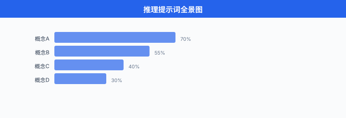
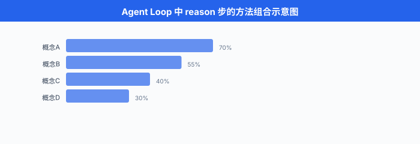

# Prompt-based 推理与规划

> **一句话总结**：只靠精心设计提示词，就能让 LLM 从"一口气蒙答案"变成"分步思考、多路验证、失败反思、树上搜索"；这些方法填的正是 Agent 循环里 "reason" 那一段。

*第 01 节讲了 Agent 是一个 `Thought → Action → Observation` 的闭环。 循环骨架有了，里面的 "Thought" 具体怎么想？一个大模型面对复杂任务，如果只是"直接给答案"，数学题错一半、编程题只看第一眼、多步规划走两步就迷路。 本节讲的一整套方法 —— 从思维链到思维树 —— 全都是在**不改模型权重**、**只改提示词**的前提下，把模型的推理能力榨到极限。 它们是 Agent 的"大脑思考模式"，是从 2022 年 Wei et al. 那篇 CoT 论文之后，整个 LLM 领域被反复迭代打磨、最终收敛到工业界的十来种模板.*

---

## 为什么需要"推理提示词"

- 一个直觉先摆出来：直接问 LLM "13 × 27 = ?", GPT-3 时代大概率答错。 但改成 "13 × 27 = ? Let's think step by step. 首先，13 × 20 = 260, 13 × 7 = 91, 260 + 91 = 351." —— 同一个模型，准确率从 17% 跳到 78% (Wei et al. 2022 在 GSM8K 上以 **LaMDA 137B** 为例的数字；在 PaLM 540B 上则是从 56% 提到 74%).

- 差别不在模型，在**推理的显式化**. LLM 是自回归生成器，每一个 Token 都基于前面所有 Token 采样。 当中间推理步骤被"写出来"，模型有了更多可以条件化的中间状态，也就更有机会走到正确答案。

- 用概率语言描述。 令 $x$ 是问题，$y$ 是最终答案，$z$ 是中间推理链 (rationale). 直接回答等价于:

$$P(y \mid x) \approx P_\text{LLM}(y \mid x)$$

- 引入推理链 $z$ 后，我们边缘化 (marginalize) 掉 $z$:

$$P(y \mid x) = \sum_{z} P(y \mid z, x) \, P(z \mid x)$$

- 这个式子告诉我们两件事:
  - 好答案往往由**多个中间链**共同支持 —— 只跑一次拿到的答案是从这个混合分布里的**一个样本**，不是期望值。
  - 让模型显式生成 $z$，相当于把 $P(y \mid x)$ 拆成 $P(y \mid z, x)$ 与 $P(z \mid x)$ 两步。 每一步都是 LLM 更"自信"的短距离预测，累积起来比一步登天更准。

- 这一节讲的所有方法，本质上都是在**如何构造与利用 $z$** 上做文章:
  - 让模型自己写 $z$ (CoT, PoT)
  - 采样多条 $z$ 再投票 (Self-Consistency)
  - 把 $z$ 与外部工具穿插 (ReAct)
  - 失败后加"反思" $r$ 存下来 (Reflexion)
  - 把 $z$ 展开成树 / 图，允许回溯与合并 (ToT, GoT)
  - 把大任务 $x$ 递归拆成小 $x_i$ (Least-to-Most)
  - 迭代自我修正 (Self-Refine)



## 思维链 (Chain-of-Thought, CoT)

- **思维链 (Chain-of-Thought, CoT)** 由 Wei et al. 2022 提出 (*Chain-of-Thought Prompting Elicits Reasoning in Large Language Models*, NeurIPS 2022). 核心一句话：**示例里把推理过程写出来，模型就会跟着写**.

### Few-shot CoT

- 原始 CoT 是 few-shot 形式。 提示词里放几个"问题 + 分步推理 + 答案"三元组，让模型模仿这个模式:

```text
Q: 罗杰有 5 个网球. 他又买了 2 罐, 每罐有 3 个. 现在他有多少个?
A: 罗杰一开始有 5 个球. 2 罐, 每罐 3 个, 共 2 × 3 = 6 个新球. 5 + 6 = 11.
   答案是 11.

Q: 咖啡厅有 23 个苹果. 他们用掉 20 个做午饭, 又买了 6 个. 现在有多少?
A: 咖啡厅一开始有 23 个. 用掉 20, 剩 23 - 20 = 3. 又买 6 个, 3 + 6 = 9.
   答案是 9.

Q: <你要问的新问题>
A: (模型会像上面两个示例一样, 先写推理再给答案)
```

- 关键设计：**示例里的 "A:" 必须包含中间步骤**. 只写答案的 few-shot 反而不如 zero-shot.

- Wei et al. 在 8 个推理 benchmark 上测试，大模型 (PaLM 540B) 上 CoT 相比标准 prompt 提升普遍 20-40 个点。 但**小模型 (< 100B) 上 CoT 反而变差**，因为小模型写不出有意义的推理链。 CoT 是**涌现能力 (emergent ability)** 的经典证据之一。

### Zero-shot CoT

- Kojima et al. 2022 (*Large Language Models are Zero-Shot Reasoners*, NeurIPS 2022) 发现了一个几乎作弊的技巧：**只加一句 "Let's think step by step."** 就能触发 CoT，不需要任何示例。

```text
Q: 一个魔术师表演了两场秀, 每场卖出 5 张票, 每张 3 美元.
   他一共赚了多少?
A: Let's think step by step.
   第一场卖 5 张, 每张 3 美元, 收入 5 × 3 = 15 美元.
   第二场同样 15 美元.
   两场合计 15 + 15 = 30 美元.
   答案是 30 美元.
```

- 这个简单到令人怀疑的技巧，在 MultiArith 上把 GPT-3 (text-davinci-002) 从 17.7% 拉到 78.7%，在 GSM8K 从 10.4% 拉到 40.7%. 中文里等价的引导语是 **"让我们一步一步思考."** 或 **"我们分步分析."**.

- 后续大量工作发现更强的引导语："Let's think step by step and be careful.", "Take a deep breath and work on this problem step-by-step." (Google DeepMind, 2023, *Large Language Models as Optimizers*). 提示词工程的黑色幽默 —— 一句"深呼吸"能提点几分。

### CoT 的数学表达

- 用 $z = (z_1, z_2, \dots, z_L)$ 表示推理链的 $L$ 个中间步骤，CoT 就是让模型自回归生成这个链，最后一步是答案:

$$P_\text{LLM}(z, y \mid x) = P_\text{LLM}(y \mid z, x) \prod_{i=1}^{L} P_\text{LLM}(z_i \mid z_{<i}, x)$$

- 相比直接生成 $y$，引入 $z$ 增加了模型可条件化的信息量。 但**只跑一次采样**，拿到的是从这个联合分布里的**单点样本** —— 只要中间某一步走偏，后面步步偏。

### CoT 的局限

- **单链无回溯**：一条链走到底，中间发现错了不能重来。
- **贪心解码陷阱**：温度设为 0 时，遇到"边缘概率相近"的分岔点，走错就一条道走到黑。
- **小模型不会**：需要 ~100B 参数以上模型才能稳定生成有意义的推理链。
- **算术上限**：对于超出训练分布的多位数运算，CoT 仍会 hallucinate 中间步骤。

- 这些局限催生了后面的 Self-Consistency, ToT 等方法。

## 自洽性 (Self-Consistency)

- **自洽性 (Self-Consistency)** 由 Wang et al. 2022 提出 (*Self-Consistency Improves Chain of Thought Reasoning in Language Models*, ICLR 2023). 想法极简：**不要只跑一次，多采样几条推理链，让答案投票**.

- 直觉：如果一个问题真有唯一正解，那么"多条不同推理链最终收敛到同一答案"的概率，应该比"多条链都错得一模一样"的概率高得多。 换句话说，**对的答案是收敛点，错的答案是分散点**.

### 数学表达

- 给定问题 $x$，从 CoT prompt 采样 $N$ 条独立链 $(z^{(i)}, y^{(i)})_{i=1}^N$ (通常温度 $T = 0.5 \sim 0.9$)，最终答案通过**多数投票**决定:

$$\hat{y}_\text{SC} = \arg\max_{y} \sum_{i=1}^{N} \mathbb{1}\!\left[y^{(i)} = y\right]$$

- 从贝叶斯视角，这是在近似 $\arg\max_y P(y \mid x)$：直接采一次得到的是从 $P(y \mid x)$ 的一个样本，采 $N$ 次投票得到的是 $\arg\max$ 的蒙特卡罗估计。

- 相比贪心解码 (greedy decoding) 只走概率最高的一条链，Self-Consistency 在 GSM8K 上把 PaLM-540B 从 56.5% 推到 74.4%，提升近 18 个点。

### 代码骨架

```python
from collections import Counter

def self_consistency(llm, prompt: str, n_samples: int = 20,
                     temperature: float = 0.7) -> str:
    """
    Self-Consistency: 采样 N 条 CoT 链, 抽答案, 多数投票.
    参考: Wang et al. 2022 (ICLR 2023).
    """
    answers = []
    for _ in range(n_samples):
        # 每次高温采样, 得到不同的推理链
        resp = llm.generate(prompt, temperature=temperature)
        # 从响应里抽出最终答案 (例如末尾的 "答案是 X")
        ans = extract_final_answer(resp)
        answers.append(ans)
    # 多数投票
    return Counter(answers).most_common(1)[0][0]
```

- 关键参数:
  - `n_samples`: 5-40 之间，收益边际递减；原论文默认 40，工程实践里 20 也是常见甜蜜点。
  - `temperature`：太低多样性不够 (全部收敛到贪心解)，太高噪声大。 0.5-0.7 是主流。
  - `extract_final_answer`：用正则 / 规则从"XXX. 答案是 42." 里抽 42，是工程细节但极其影响准确率。

### 局限

- 成本随 $N$ 线性增长：$N=20$ 意味着**成本 ×20，延迟 ×20** (若不并行).
- 只在**答案空间有限且可比对**的任务上适用 (数学题、多选题). 对"写一段代码"这种开放答案，投票没意义 —— 后来的方法用 verifier 或 rank 而不是投票。

## ReAct：推理 + 行动交织

- **ReAct (Reasoning + Acting)** 由 Yao et al. 2022 提出 (*ReAct: Synergizing Reasoning and Acting in Language Models*, ICLR 2023, arXiv:2210.03629). 第 01 节已经展示过它的循环骨架，这里详解它作为一种**提示词模式**的价值。

### 核心洞察

- 纯 CoT 只能靠模型**已经学到的知识**推理，遇到需要**外部信息**的问题 (查天气、算复杂数学、查最新新闻)，只能瞎编 —— hallucination.
- 纯 Action (只调工具，不显式推理) 让模型"手快脑子慢"，常常调错工具或传错参数。
- ReAct 让 **Thought 与 Action 交织**：想一步，做一步，看结果，再想。 每次 action 拿到的 observation 都作为下一次 thought 的上下文。

### Prompt 模板 (完整示例)

```text
你是一个能使用工具的助手. 可用工具:
- Search[query]: 网页搜索, 返回摘要.
- Calculator[expr]: 数学表达式求值.
- Lookup[keyword]: 在最近的搜索结果里查关键词.

回答问题时按下面格式循环:
Thought: <你的推理>
Action: <工具名>[<参数>]
Observation: <工具返回, 由系统填入>
... (重复若干次) ...
Thought: 我已经知道答案.
Action: Finish[<最终答案>]

===
Question: 科罗拉多造山运动东段延伸到的区域, 其海拔范围是多少?

Thought: 我需要先查什么是科罗拉多造山运动, 再看它东段延伸到哪.
Action: Search[Colorado orogeny eastern sector]
Observation: 科罗拉多造山运动是科罗拉多和周边地区一次山脉形成期.
            东段延伸至 High Plains (北美大平原西部).

Thought: 现在要查 High Plains 的海拔范围.
Action: Search[High Plains elevation range]
Observation: High Plains 是 Great Plains 西部的高地, 海拔约 1,800 - 7,000 英尺.

Thought: 已经拿到答案.
Action: Finish[1,800 - 7,000 英尺]
```

- 这个 prompt 就是 ReAct 的完整模板。 Yao et al. 在 HotpotQA (多跳问答) 和 Fever (事实核查) 上，ReAct 相比纯 CoT 提升 5-10 个点；更重要的是，ReAct 允许 Agent 在**没见过的知识**上工作 —— 只要工具能查，Agent 就能答。

### ReAct vs CoT 的数学对比

- CoT: $y \sim P_\text{LLM}(y \mid x, z)$, $z$ 完全来自模型内部。
- ReAct：引入外部环境 $\mathcal{E}$ 与工具集 $\mathcal{T}$，推理链变成 $(z_1, a_1, o_1, z_2, a_2, o_2, \dots)$，其中 $o_i = \mathcal{E}(a_i)$ 来自环境:

$$P(y \mid x) = \sum_{(z, a, o)} P_\text{LLM}(y \mid z, a, o, x) \cdot \prod_i P_\text{LLM}(z_i, a_i \mid z_{<i}, a_{<i}, o_{<i}, x)$$

- 关键差别：**$o_i$ 不是模型采样出来的，是环境给的确定性信号**. 这是 ReAct 对抗 hallucination 的根本机制。

### 与 Agent 循环的关系

- 上一节的 `react_loop` 函数骨架里，`thought`, `action`, `obs` 三件套完全对应这里的 prompt 模板。 ReAct 是**Agent 推理层的默认基础方法**，后面的 Reflexion, ToT 都在此之上加东西。

## 反思机制 (Reflexion)：失败后写检讨

- **反思机制 (Reflexion)** 由 Shinn et al. 2023 提出 (*Reflexion: Language Agents with Verbal Reinforcement Learning*, NeurIPS 2023). 目标是让 Agent 在**多次尝试同一任务**时能从失败中学习。

### 核心机制

- 传统 Agent：失败一次，下次仍然会犯同样错误 (模型权重没更新).
- Reflexion：失败后，让模型**用自然语言写一段"反思"** (reflection)，存到一个 memory buffer. 下次执行任务时，反思作为额外上下文喂给模型。

- 三个角色:
  - **Actor**：用 ReAct 风格执行任务，产生轨迹 $\tau$.
  - **Evaluator**：评估轨迹是否成功 (可以是规则、单元测试、外部 verifier).
  - **Self-Reflection**：若失败，生成一段反思文本 $r$，说明"这次为什么错，下次应该怎么做".

### 数学化

- Agent 状态可以写成三元组:

$$s_t = (\text{task}, \tau_t, \mathcal{R}_t)$$

- 其中 $\tau_t = (a_0, o_0, \dots, a_t, o_t)$ 是当前轨迹，$\mathcal{R}_t = \{r_1, r_2, \dots, r_{k}\}$ 是历史反思 buffer.

- 每次任务失败后，反思生成:

$$r_{k+1} = f_\text{reflect}(\text{task}, \tau_\text{failed}, \mathcal{R}_k)$$

- 下次尝试时，策略变成:

$$a_t \sim \pi_\text{LLM}(a_t \mid s_t) = \pi_\text{LLM}(a_t \mid \text{task}, \tau_t, \mathcal{R}_t)$$

- 反思 buffer $\mathcal{R}_t$ 起到"文字版参数更新"的作用。 Shinn 等人把这称为 **verbal reinforcement learning** (语言强化学习)：不改权重，靠自然语言反馈迭代改进。

### Reflexion prompt 示例

```text
你上一次尝试解决这道题失败了. 下面是你的完整轨迹:

<轨迹粘贴>

评估结果: 单元测试 3/5 通过, 失败的测试报错:
  IndexError: list index out of range on line 12.

请写一段简短的反思 (2-3 句), 说明你上次犯了什么错, 下次应该注意什么.
不要重写代码, 只写反思.
```

模型可能回答:

```text
我上次错在没有处理空列表边界情况. 循环里用了 lst[i+1] 但没检查 i 是不是最后一个元素. 下次实现前应该先想清楚边界条件, 特别是 i == len(lst) - 1 时的处理.
```

- 这段反思会拼到下一次尝试的 prompt 前，模型就能"记住"教训。

### 与 RL 的类比

| 强化学习 | Reflexion |
|---------|-----------|
| 环境奖励 $r_t$ | Evaluator 判定 (pass/fail) |
| 梯度更新参数 $\theta$ | 生成反思 $r$，追加到 buffer |
| 优化目标 $\max_\theta \mathbb{E}[R]$ | 优化 $\pi_\text{LLM}$ 条件化的 $\mathcal{R}$ |
| 训练周期 (epoch) | 尝试轮次 (trial) |

- Reflexion 在 HumanEval (代码) 上把 GPT-4 的 pass@1 从约 76-80% (基线依 prompt 有 ±5% 浮动) 推到约 91%；在 ALFWorld (家务模拟) 上，单次尝试成功率约 71%，累积 12 轮 Reflexion 后可达约 97%.

### 局限

- 需要**外部 Evaluator**判定成败 —— 没有客观标准的任务 (写作、闲聊) 无法用 Reflexion.
- 反思质量取决于模型对自己错误的**自我诊断能力**. 弱模型的反思常常是空话。
- Buffer 会越滚越大，需要压缩或选择性保留。

## 思维树 (Tree of Thoughts, ToT)

- **思维树 (Tree of Thoughts, ToT)** 由 Yao et al. 2023 提出 (*Tree of Thoughts: Deliberate Problem Solving with Large Language Models*, NeurIPS 2023). 思路：把 CoT 的"单条推理链"扩展成"推理树"，每个节点是一个部分推理状态，允许**分岔、评估、回溯**.

### 核心思想

- CoT 是从 root 走到 leaf 的一条链。 ToT 把链变成树:
  - **节点** $s$ = 一个部分推理状态 (从起点到当前的所有思考)
  - **分支**：在每个节点，LLM 生成 $k$ 个候选下一步 (thoughts)
  - **评估**：用另一次 LLM 调用给每个候选打分 $V(s')$
  - **搜索**：用 BFS / DFS / Beam Search 沿高分节点扩展

- 与经典搜索算法的**类比**:

| 经典搜索 | ToT |
|---------|-----|
| 状态 $s$ | 部分推理链 |
| 后继函数 $\text{succ}(s)$ | LLM 生成 $k$ 个 next thoughts |
| 启发式 $h(s)$ | LLM 评分 $V(s)$ |
| 目标测试 $\text{isGoal}(s)$ | LLM 判断"是否已解决" |
| A* / Best-First Search | BFS / DFS + 剪枝 |

- 数学表达。 令价值函数由 LLM 实现:

$$V(s) = \mathbb{E}_\text{LLM}\!\left[\text{score}(s) \mid \text{prompt}_\text{eval}\right] \in [0, 1]$$

- 搜索过程等价于求最优 leaf:

$$s^\ast = \arg\max_{s \in \text{leaves}(\mathcal{T})} V(s), \quad \text{subject to } |\mathcal{T}| \le B$$

- 其中 $B$ 是搜索预算 (节点扩展次数上限).

### BFS 骨架

```python
def tot_bfs(llm, task: str, k: int = 5, T: int = 3, b: int = 5):
    """
    Tree of Thoughts, BFS 版本.
    参数:
      k: 每步扩展的候选数
      T: 树的最大深度
      b: 每层保留的 top-b 节点 (beam width)
    参考: Yao et al. 2023 (NeurIPS 2023).
    """
    # 初始状态: 空推理链
    frontier = [{"thoughts": [], "score": 1.0}]
    for step in range(T):
        candidates = []
        for state in frontier:
            # 1. 生成 k 个候选下一步 thought
            next_thoughts = llm.propose(task, state["thoughts"], k=k)
            for t in next_thoughts:
                new_state = {
                    "thoughts": state["thoughts"] + [t],
                    "score": None,
                }
                # 2. LLM 评估该部分推理的价值
                new_state["score"] = llm.evaluate(task, new_state["thoughts"])
                candidates.append(new_state)
        # 3. 保留 top-b (beam pruning)
        candidates.sort(key=lambda s: s["score"], reverse=True)
        frontier = candidates[:b]
        # 4. 若某个候选被判定为完成, 提前返回
        for s in frontier:
            if llm.is_solution(task, s["thoughts"]):
                return s["thoughts"]
    # 用最高分 leaf 作为答案
    return max(frontier, key=lambda s: s["score"])["thoughts"]
```

- DFS 版本类似，只是把 `frontier` 换成栈，遇到低分节点回溯到父节点。

### 24 game 案例

- ToT 论文的招牌 demo: **24 点**. 给 4 个数字 (如 4, 9, 10, 13)，用 +, -, ×, ÷ 和括号凑出 24.

- 直接 CoT 让 GPT-4 做，只有 4% 成功率。 ToT (k=5, T=3, b=5) 把成功率推到 **74%**.

- 树的样子:

```
root
├── 13 - 9 = 4  (state: 4, 4, 10)
│   ├── 4 + 4 = 8  (state: 8, 10)  → score 0.1
│   ├── 4 × 4 = 16 (state: 16, 10) → score 0.2
│   └── 10 - 4 = 6 (state: 6, 4)   → score 0.7 ✓
│       └── 6 × 4 = 24  ✓ 找到解!
├── 10 - 4 = 6  (state: 6, 9, 13)  → score 0.5
│   └── ...
└── 9 + 4 = 13  (state: 13, 13, 10) → score 0.3
    └── ...
```


### ToT vs A* 的差别

- A* 用启发式 $h(s) \ge 0$ 且**允许原则上被证明最优** (若 $h$ 是 admissible).
- ToT 的 $V(s)$ 由 LLM 生成，**无理论保证** (LLM 会误评估). 实践中依赖 beam pruning 控制成本，依赖多次采样降低单点偏差。

### 局限

- 每个节点扩展要 $k$ 次 LLM 调用，评估又要一次。 总成本 $O(k \cdot T \cdot b)$ —— 对 24 点这种任务已经是几十倍 CoT 的成本。
- 只在**能定义节点评估函数**的任务上适用。 开放写作类任务，"写到一半" 的评估很主观。

## 思维图 (Graph of Thoughts, GoT)

- **思维图 (Graph of Thoughts, GoT)** 由 Besta et al. 2023 提出 (*Graph of Thoughts: Solving Elaborate Problems with Large Language Models*, AAAI 2024, arXiv:2308.09687). 把 ToT 的树进一步推广到**任意有向图**：允许分支的**合并** (aggregation) 与 **反馈边** (refinement).

- ToT 只能扩展 (fork)，不能合并两条分支的中间结果。 GoT 允许把多个部分解**聚合**成新节点，或让某个节点**refine 之前的节点** (自环 / 反向边).

- 三类关键操作:
  - **Generate**：从节点扩展新节点 (同 ToT)
  - **Aggregate**：把 $n$ 个节点合并成一个 (取交集 / 求并 / 融合观点)
  - **Improve/Refine**：对一个节点原地修改，产生新节点

- 典型场景：**排序列表**. GoT 把长列表分块 → 每块并行排序 → 归并各块 —— 这正是归并排序的 DAG 结构。

- 相比 ToT, GoT 在排序 / 集合运算 / 关键词提取这类**有可组合结构**的任务上，成本相同下准确率高 20-40%.

- 但代价是**编排复杂度**. GoT 需要开发者手工设计 DAG 结构，不像 CoT / ToT 那样纯 prompt.

## Least-to-Most 提示：递归拆分

- **Least-to-Most 提示** 由 Zhou et al. 2022 提出 (*Least-to-Most Prompting Enables Complex Reasoning in Large Language Models*, ICLR 2023). 思路：复杂问题先**拆成一系列递增难度的子问题**，每个子问题的答案作为下一个的上下文。

### 两阶段流程

1. **分解阶段** (Decomposition)：让 LLM 把原问题 $x$ 拆成子问题序列 $(x_1, x_2, \dots, x_m)$，且 $x_i$ 应当比 $x_{i+1}$ 简单。
2. **求解阶段** (Solving)：依次解 $x_1 \to x_2 \to \dots \to x_m$，每一步 prompt 包含前面所有子问题的答案。

- 数学化。 令 $y_i$ 是子问题 $x_i$ 的答案，递归定义:

$$y_i = \arg\max_{y} P_\text{LLM}(y \mid x_i, \{(x_j, y_j)\}_{j < i}, x)$$

- 最终 $y_m$ 就是原问题的答案。

### Prompt 模板

```text
[分解阶段]
问题: 阿曼达和莎莉每人有 5 个饼干, 她们平均分给 4 个朋友.
     每个朋友能分到多少?

要解决这个问题, 我们要先回答:
1. 阿曼达和莎莉一共有多少饼干?
2. 一共有多少人 (含她们自己)?
3. 每个朋友能分到多少?

[求解阶段]
Q1: 阿曼达和莎莉一共有多少饼干?
A1: 每人 5 个, 共 5 × 2 = 10 个.

Q2: 一共有多少人?
A2: 阿曼达 + 莎莉 + 4 个朋友 = 6 人.
    (注意: 但题目说 "平均分给 4 个朋友", 所以只除以 4)

Q3: 每个朋友能分到多少?
A3: 10 ÷ 4 = 2.5 个.

答: 每个朋友能分到 2.5 个饼干.
```

- Least-to-Most 在 SCAN benchmark (组合泛化) 上把 GPT-3 从 16% 推到 99.7% —— 极大的提升发生在**训练分布外**的长任务上。 直觉：短子问题都在分布内，组合起来自然解出分布外的整体。

### 与 CoT / ToT 的关系

- CoT：一次生成整个推理链，步骤间是自回归的。
- Least-to-Most：先**列大纲**，再逐条填空。 大纲显式化，更适合长任务。
- ToT：每步分岔搜索，而 Least-to-Most 是**线性序列**，无搜索。

- 三者可组合。 一个复杂 Agent 任务可以：用 Least-to-Most 拆成 5 个子任务，每个子任务内用 ReAct 循环，每次 Action 前用 Self-Consistency 选参数。

## 思维程序 (Program-of-Thoughts, PoT)

- **思维程序 (Program-of-Thoughts, PoT)** 由 Chen et al. 2022 提出 (*Program of Thoughts Prompting: Disentangling Computation from Reasoning for Numerical Reasoning Tasks*, TMLR 2023, arXiv:2211.12588). 核心思想：**把推理链写成可执行代码，而不是自然语言**.

### 为什么代码更好

- CoT 让模型自己算 $147 \times 259$，经常错。 因为 LLM 的算术是"背下来的近似"，不是真正做加法。
- PoT 让模型写 Python: `147 * 259` —— 交给 Python 解释器算，结果一定对。 模型只需要负责**逻辑**，计算外包。

### PoT prompt 示例

```text
Q: 一家咖啡厅一天卖 24 杯咖啡, 每杯 4.5 美元, 成本每杯 1.2 美元.
   每周开 6 天, 每周利润多少?

A: 我来用代码解.
```python
cups_per_day = 24
price_per_cup = 4.5
cost_per_cup = 1.2
days_per_week = 6

daily_revenue = cups_per_day * price_per_cup
daily_cost = cups_per_day * cost_per_cup
daily_profit = daily_revenue - daily_cost
weekly_profit = daily_profit * days_per_week

print(weekly_profit)
```
执行结果: 475.2

答: 每周利润 475.2 美元.
```

- 关键：模型只输出代码，**真实计算由 Python 完成**. 数学错误率骤降。

### PoT vs CoT 对比

- 在 GSM8K (小学数学题) 上，GPT-3.5 用 CoT 是 57%，用 PoT 是 72%.
- 在 SVAMP (更难的应用题) 上，PoT 优势更大 (66% vs 79%).
- 但在**非数值的逻辑推理**上 (常识、伦理判断), PoT 无优势甚至更差 —— 代码不适合表达那些。

### 与 Code Interpreter / Tool Use 的关系

- PoT 是**工具使用**的一个特例：工具 = Python 解释器。 现代 Agent 的 Code Interpreter (OpenAI Advanced Data Analysis, Claude Code Execution) 本质都是 PoT 的工程化。
- PoT 也是 ReAct 的一种 Action 类型：`Action: Execute[<代码>]`.

## 迭代自我修正：Self-Refine

- **Self-Refine** 由 Madaan et al. 2023 提出 (*Self-Refine: Iterative Refinement with Self-Feedback*, NeurIPS 2023). 三步循环：**生成 → 反馈 → 修正**，反复迭代直到满意。

### 循环骨架

```text
1. Generate: y_0 ← LLM(task, prompt_gen)
2. Feedback: f_t ← LLM(y_t, prompt_fb)      # 让模型评自己的答案
3. Refine:   y_{t+1} ← LLM(y_t, f_t, prompt_refine)  # 基于反馈改写
4. 若 f_t 判定 "已满意" 或达到 max_iter, 停止.
```

- 与 Reflexion 的区别:
  - Reflexion 面向**多次尝试同一任务** (每次跑一遍完整 ReAct 循环，失败后写反思).
  - Self-Refine 面向**单次任务的输出优化** (生成一段文字/代码，反复改直到好).

### 数学表达

- 令 $y_t$ 为第 $t$ 次迭代输出，$f_t$ 为对应反馈:

$$y_{t+1} = \text{Refine}(y_t, f_t), \quad f_t = \text{Feedback}(y_t, \text{task})$$

- 停止准则：$f_t$ 判 "无更多改进空间" 或 $t \ge T_\text{max}$.

### 应用场景

- **代码优化**：让模型评自己的代码可读性 / 效率，迭代重构。
- **文案润色**：生成 → 评价 → 改进 → 评价 → ...
- **数学证明**：写证明 → 检查逻辑漏洞 → 补充。

- Madaan et al. 报告在 7 个任务上 (代码优化、约束生成、数学推理等) 平均提升 20%. 但需要**任务本身有可评估的输出维度** —— 让模型评"这段代码好不好"比评"这段闲聊好不好"靠谱得多。

- **注意**：后续工作 (Huang et al. 2023, *Large Language Models Cannot Self-Correct Reasoning Yet*) 指出，Self-Refine 在**推理任务**上收益有限，有时反而变差。 LLM 的自我评估在客观正确性上不如在风格 / 格式上可靠。

## 组合使用：决策矩阵

- 上述十来种方法不是相互替代，而是可以**堆叠**. 一个成熟的 Agent 系统，底层是 ReAct，每次 Action 前跑 Self-Consistency，遇到规划难点开 ToT，失败后加 Reflexion，长任务顶层用 Least-to-Most 拆分，数学计算走 PoT.

- 一份工程决策矩阵:

| 场景 | 首选方法 | 增强 | 何时不用 |
|-----|--------|-----|--------|
| 简单问答 | Zero-shot CoT | — | 一次调用够，别加 |
| 数学 / 逻辑推理 | CoT + Self-Consistency | PoT (若含计算) | 非数值任务 |
| 需要外部知识 | ReAct | 工具 RAG | 纯常识题 |
| 需要多步规划 | ReAct + ToT | Least-to-Most 顶层拆分 | 一步任务 |
| 代码生成 / bug 修复 | ReAct + Reflexion | 单元测试作 Evaluator | 没测试标准 |
| 长文写作 | Least-to-Most + Self-Refine | — | 短句改写 |
| 组合优化 (24 点、排序) | ToT / GoT | — | 无中间可评估状态 |
| 开放创作 (写小说) | 迭代 Self-Refine | — | 一次成稿场景 |

- 一条经验：**能用简单方法达标就用简单的**. 每加一层，成本至少 2-5 倍。 从 zero-shot 到"CoT + Self-Consistency + ToT + Reflexion" 组合，成本可能是 100 倍。

## 与 Ch23/01 Agent Loop 的呼应

- 回到第 01 节的 ReAct 循环:

```python
def react_loop(task, tools, llm, max_iters=20):
    history = []
    for step in range(max_iters):
        thought = llm.reason(task, history, tools)   # ← 这里
        action = llm.select_action(thought, tools)   # ← 这里
        if action["type"] == "done":
            return action["answer"]
        obs = tools[action["tool"]](**action["args"])
        history.append(...)
```

- 本节讲的所有方法，**本质都是在填 `llm.reason(...)` 与 `llm.select_action(...)` 两行的实现**:
  - `llm.reason` 内部可以是 CoT，或 Self-Consistency 采样多条，或 ToT 展开。
  - 遇到子问题，可以先跑 Least-to-Most 分解。
  - `llm.select_action` 若出错，循环外面套一层 Reflexion 累积反思。
  - 计算类 action，直接用 PoT 交给 Python.

- Agent 工程的"神秘参数"其实是**这个 reason 步的组合策略**. 顶级 Agent 团队 (Cognition Devin, Cursor, Claude Code) 的差距，主要就在这里的调优 —— 也是为什么"同一个 GPT-4，不同 Agent 表现差 3 倍" 的真正原因。



---

## 📌 本节要点

- **推理提示词的核心思想**：引入中间推理链 $z$，把 $P(y \mid x)$ 拆成 $\sum_z P(y \mid z, x) P(z \mid x)$，让模型条件化于更多中间状态，显式化"思考"过程。
- **CoT (思维链)**: Few-shot 里放示例推理；Zero-shot 加 "Let's think step by step". 是所有推理方法的起点，但单链无回溯，需要 100B+ 参数才涌现。
- **Self-Consistency (自洽性)**：采样 $N$ 条 CoT 链，多数投票选答案。 用蒙特卡罗近似 $\arg\max_y P(y \mid x)$，稳定性远超贪心解码，但成本 ×$N$.
- **ReAct**: Thought → Action → Observation 交织，允许 Agent 用工具获取外部信息，是对抗 hallucination 的根本机制，也是所有 LLM Agent 的默认推理骨架。
- **Reflexion (反思机制)**：失败后写自然语言反思存入 buffer，下次任务时作为上下文。 是"文字版强化学习" (verbal reinforcement)，依赖外部 Evaluator.
- **Tree of Thoughts (思维树)**：把 CoT 单链扩展成树，每节点 LLM 生成候选 + LLM 评分，BFS/DFS/Beam 搜索。 类比 A*，在 24 点上从 4% 冲到 74%.
- **Graph of Thoughts (思维图)**：允许分支合并 + 节点 refine, DAG 结构。 适合有可组合结构的任务 (排序、集合运算).
- **Least-to-Most 提示**：先拆子问题，再线性求解。 组合泛化任务 (SCAN) 上从 16% 冲到 99%.
- **Program-of-Thoughts (思维程序)**：用代码表达推理，计算外包给 Python. 数学任务上碾压 CoT，但非数值任务无优势。
- **Self-Refine**：生成 → 反馈 → 修正 循环。 面向单次任务的输出迭代优化，与 Reflexion (跨任务学习) 互补。
- **组合使用**: Agent 中 `reason` 步的方法组合，才是顶级 Agent 团队真正的护城河。 ReAct 是底座，其他方法按需堆叠。

## 参考文献

- Wei, J., Wang, X., Schuurmans, D., Bosma, M., Ichter, B., Xia, F., Chi, E., Le, Q., & Zhou, D. (2022). *Chain-of-Thought Prompting Elicits Reasoning in Large Language Models*. NeurIPS 2022. arXiv:2201.11903. (CoT 开山之作.)
- Kojima, T., Gu, S. S., Reid, M., Matsuo, Y., & Iwasawa, Y. (2022). *Large Language Models are Zero-Shot Reasoners*. NeurIPS 2022. arXiv:2205.11916. ("Let's think step by step" 的出处.)
- Wang, X., Wei, J., Schuurmans, D., Le, Q., Chi, E., Narang, S., Chowdhery, A., & Zhou, D. (2022). *Self-Consistency Improves Chain of Thought Reasoning in Language Models*. ICLR 2023. arXiv:2203.11171.
- Yao, S., Zhao, J., Yu, D., Du, N., Shafran, I., Narasimhan, K., & Cao, Y. (2022). *ReAct: Synergizing Reasoning and Acting in Language Models*. ICLR 2023. arXiv:2210.03629.
- Shinn, N., Cassano, F., Berman, E., Gopinath, A., Narasimhan, K., & Yao, S. (2023). *Reflexion: Language Agents with Verbal Reinforcement Learning*. NeurIPS 2023. arXiv:2303.11366.
- Yao, S., Yu, D., Zhao, J., Shafran, I., Griffiths, T., Cao, Y., & Narasimhan, K. (2023). *Tree of Thoughts: Deliberate Problem Solving with Large Language Models*. NeurIPS 2023. arXiv:2305.10601.
- Besta, M., Blach, N., Kubicek, A., Gerstenberger, R., Podstawski, M., Gianinazzi, L., et al. (2023). *Graph of Thoughts: Solving Elaborate Problems with Large Language Models*. AAAI 2024. arXiv:2308.09687.
- Zhou, D., Schärli, N., Hou, L., Wei, J., Scales, N., Wang, X., Schuurmans, D., Cui, C., Bousquet, O., Le, Q., & Chi, E. (2022). *Least-to-Most Prompting Enables Complex Reasoning in Large Language Models*. ICLR 2023. arXiv:2205.10625.
- Chen, W., Ma, X., Wang, X., & Cohen, W. W. (2022). *Program of Thoughts Prompting: Disentangling Computation from Reasoning for Numerical Reasoning Tasks*. TMLR 2023. arXiv:2211.12588.
- Madaan, A., Tandon, N., Gupta, P., Hallinan, S., Gao, L., Wiegreffe, S., et al. (2023). *Self-Refine: Iterative Refinement with Self-Feedback*. NeurIPS 2023. arXiv:2303.17651.
- Huang, J., Chen, X., Mishra, S., Zheng, H. S., Yu, A. W., Song, X., & Zhou, D. (2023). *Large Language Models Cannot Self-Correct Reasoning Yet*. arXiv:2310.01798. (对 Self-Refine 在推理任务上局限的批判性研究.)
- Yang, C., Wang, X., Lu, Y., Liu, H., Le, Q. V., Zhou, D., & Chen, X. (2023). *Large Language Models as Optimizers*. arXiv:2309.03409. ("Take a deep breath" 提示词的出处.)