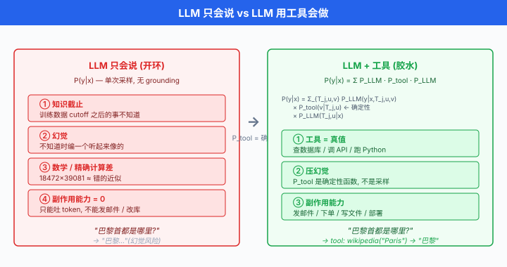
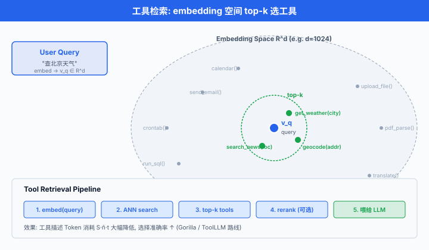

# 工具使用与函数调用

> **一句话总结**: 工具使用把 LLM 从"只会说"变成"会做"—— 通过 JSON Schema 声明工具、约束解码保证格式、检索选工具, 让模型的每一次输出都能触发真实世界的 API 调用.

*上一节讲了如何让 LLM 更会"想". 但一个只会想不会做的 Agent, 顶多是个高级聊天机器人. 真正把 Agent 推入生产环境的, 是**工具使用 (tool use)**: 让 LLM 调用外部 API, 查天气、算数学、发邮件、下订单. 从 Toolformer 让模型自学何时调工具, 到 OpenAI Function Calling 用 JSON Schema 把工具标准化, 再到 RAG 把检索当作特殊工具 —— 这一节讲清楚 Agent 手上"那把锤子"是怎么造出来的.*

---

## 为什么 LLM 必须使用工具

- 一个 LLM, 无论多大, 有几个**天生的短板**:

  - **知识截止**: 训练数据有 cutoff. GPT-4 不知道 2024 年之后的事, Claude 不知道你昨晚发的推文. 靠模型内部权重永远追不上现实.
  - **幻觉**: 遇到不知道的事实, 模型不会说"我不知道", 会**编一个听起来很像的**. Nakano et al. 2021 的 *WebGPT* 论文里, 明确指出"grounding on retrieved evidence"是压幻觉的关键.
  - **数学与精确计算**: LLM 的算术是"背下来的近似". 让 GPT-4 心算 $18{,}472 \times 39{,}081$, 大概率答错. 但让它写一行 `18472 * 39081` 交给 Python, 一定对.
  - **副作用能力为零**: 模型只能吐 Token, 不能发邮件、不能修改数据库、不能订机票. 想让 Agent 真正"动手", 必须给它接口.

- 一句话总结这四条: **LLM 只会说, 工具让它会做**. 工具是 Agent 与真实世界之间的一层薄薄的胶水 —— 一头是模型生成的结构化调用意图, 另一头是被执行的确定性代码.

- 数学化: 令 $\mathcal{T} = \{T_1, T_2, \dots, T_m\}$ 是可用工具集, 每个工具 $T_j: \mathcal{X}_j \to \mathcal{Y}_j$ 是一个从参数空间到返回空间的确定性函数. 引入工具后, Agent 的联合分布变成:

$$P(y \mid x) = \sum_{(T_j, u, v)} P_\text{LLM}(y \mid x, T_j, u, v) \cdot P_\text{tool}(v \mid T_j, u) \cdot P_\text{LLM}(T_j, u \mid x)$$

其中 $u \in \mathcal{X}_j$ 是模型选择的参数, $v = T_j(u) \in \mathcal{Y}_j$ 是工具返回. 关键: **$P_\text{tool}$ 是确定性的**, 不是模型采样出来的 —— 这就是工具压幻觉的数学根源.



## Toolformer: 让模型自学何时调工具

- **Toolformer** 由 Schick et al. 2023 提出 (*Toolformer: Language Models Can Teach Themselves to Use Tools*, arXiv:2302.04761). 核心贡献: **不需要人工标注**, LLM 自监督地学会"哪句话该在哪个位置插入哪个 API 调用".

### 完整流程

Toolformer 的训练流程分三步, 对每一个训练文档 $x = (t_1, t_2, \dots, t_n)$:

1. **采样候选 API 调用**: 用 few-shot prompt 让 LLM 在每个位置 $i$ 提议若干 API 调用 (如 `[Calculator(3 * 4)]`, Toolformer 原文用方括号标记). 每个位置采样 $k$ 个候选.

2. **执行并过滤**: 真实执行每个 API 调用, 拿到返回 $r$. 只保留能"降低后续 Token perplexity" 的调用 —— 也就是**真正对预测下文有帮助**的.

3. **微调**: 用带 API 调用标记的自增强数据继续预训练模型. 微调后, 模型自发在推理时插入 `[Calculator(...)]` 这类调用标记.

### 有用性打分公式

- 第 2 步的过滤准则是核心. 令 $c_i = (\text{API name}, \text{args}) \to r$ 是位置 $i$ 的候选调用及其返回. 令 $L_i(z)$ 表示"在位置 $i$ 前面拼接 $z$" 时模型对后续 Token 的**加权交叉熵**:

$$L_i(z) = -\sum_{j=i}^{n} w_{j-i} \cdot \log P_\text{LLM}(t_j \mid t_{<j}, z)$$

其中 $w_{j-i}$ 是随距离衰减的权重 (远处 Token 影响力小).

- 定义"工具有用性" (utility) 为**加了工具调用之后 loss 降低的量**:

$$U(c_i) = \min\!\big(L_i(\varnothing), L_i(c_i \text{ prefix only})\big) - L_i(c_i \text{ prefix + result } r)$$

- 直觉: 如果**看到调用 + 结果**比**只看到调用**或**啥都没看到**都要预测得更准, 说明这个工具调用对建模有用. 只保留 $U(c_i) > \tau$ (阈值) 的样本进入训练集.

- 这套 perplexity 驱动的过滤让 Toolformer 无需人工标注, 就能筛出高质量"何时该用什么工具" 的示范样本. Schick et al. 用 GPT-J-6B 微调, 在 5 类工具 (calculator, calendar, search, translator, QA) 上打平甚至超过 GPT-3-175B 的 zero-shot 表现.

### 局限与后续

- Toolformer 每个 API 一次只能被调用一次 (无嵌套、无循环).
- 参数生成靠模型采样, 复杂 API 会失败.
- 工具集固定在训练时, 加新工具需重训.
- 这些局限催生了后续的 **ToolLLM / ToolBench** (Qin et al. 2023) 与 **Gorilla LLM** (Patil et al. 2023) —— 用更大的工具库 + 检索式选工具.

## OpenAI Function Calling: 工业界的事实标准

- 2023 年 6 月, OpenAI 发布 GPT-4 与 GPT-3.5-turbo 的 **函数调用 (function calling)** 能力. 关键动作: 用 **JSON Schema** 声明可用函数, 让模型输出**结构化 JSON**, 而不是自然语言.

- 从 API 层面, 这一步把"提示工程调工具"从**玄学**变成了**工程**: 开发者不需要再写 few-shot 示例祈祷模型输出正确格式, 只要给出 schema, 模型就会保证输出符合 schema.

### 完整可跑示例

```python
import json
from openai import OpenAI

client = OpenAI()

# 1. 用 JSON Schema 声明工具
tools = [
    {
        "type": "function",
        "function": {
            "name": "get_current_weather",
            "description": "获取某个城市的实时天气",
            "parameters": {
                "type": "object",
                "properties": {
                    "city": {
                        "type": "string",
                        "description": "城市名, 如 '北京' 或 'San Francisco'",
                    },
                    "unit": {
                        "type": "string",
                        "enum": ["celsius", "fahrenheit"],
                        "description": "温度单位",
                    },
                },
                "required": ["city"],
            },
        },
    }
]

# 2. 真实工具实现
def get_current_weather(city: str, unit: str = "celsius") -> dict:
    # 假装调用天气 API
    return {"city": city, "temperature": 22, "unit": unit, "condition": "晴"}

# 3. 让模型看到工具, 并给它一个用户问题
messages = [{"role": "user", "content": "上海现在多少度?"}]

resp = client.chat.completions.create(
    model="gpt-4",
    messages=messages,
    tools=tools,
    tool_choice="auto",   # 让模型自己决定要不要调用
)

msg = resp.choices[0].message
messages.append(msg)

# 4. 若模型选择调用工具, 解析参数并执行
if msg.tool_calls:
    for call in msg.tool_calls:
        fn_name = call.function.name
        fn_args = json.loads(call.function.arguments)  # ← 由模型输出的 JSON
        result = get_current_weather(**fn_args)
        # 把执行结果作为一条 tool message 回喂给模型
        messages.append({
            "role": "tool",
            "tool_call_id": call.id,
            "content": json.dumps(result, ensure_ascii=False),
        })

# 5. 让模型基于工具结果给最终回答
final = client.chat.completions.create(
    model="gpt-4",
    messages=messages,
)
print(final.choices[0].message.content)
# 输出: "上海现在 22°C, 天气晴朗."
```

- 五个环节缺一不可: **声明 → 调用 → 解析 → 执行 → 回喂**. 这正是第 01 节 `react_loop` 骨架里 "one step" 的完整实现.

### 关键设计选择

- `tool_choice`: `"auto"` (模型决定), `"none"` (强制不用工具), 或 `{"type": "function", "function": {"name": "..."}}` (强制用特定工具).
- `description` 字段是**关键**: 模型靠它判断何时调用. 描述越准确, 命中率越高. 常见坑: 描述写太笼统 → 模型什么都往这里调.
- `required` 字段限制必填参数. 缺失时模型会尝试"补上" —— 有时会瞎编, 需要在描述里明确"如果用户没说, 请先反问".

## JSON Schema 深入

- JSON Schema 是工具声明的通用语言, 支持完整的类型系统. 常用类型:

```json
{
  "type": "object",
  "properties": {
    "count":     {"type": "integer", "minimum": 1, "maximum": 100},
    "score":     {"type": "number",  "minimum": 0, "maximum": 1},
    "name":      {"type": "string",  "pattern": "^[a-zA-Z]+$"},
    "active":    {"type": "boolean"},
    "tags":      {"type": "array", "items": {"type": "string"}, "maxItems": 10},
    "priority":  {"type": "string", "enum": ["low", "medium", "high"]},
    "metadata":  {
      "type": "object",
      "properties": {
        "author": {"type": "string"},
        "version": {"type": "integer"}
      },
      "required": ["author"]
    }
  },
  "required": ["count", "name"]
}
```

### Anthropic Tool Use vs OpenAI Function Calling

- 语法略有不同, 但概念一致. 对比表:

| 维度 | OpenAI Function Calling | Anthropic Tool Use |
|-----|------------------------|-------------------|
| 顶层字段 | `tools: [...]` | `tools: [...]` |
| 每个工具的结构 | `{type: "function", function: {name, description, parameters}}` | `{name, description, input_schema}` |
| 参数字段名 | `parameters` (JSON Schema) | `input_schema` (JSON Schema) |
| 模型输出的调用 | `message.tool_calls[]` | `content` 里的 `{type: "tool_use", ...}` block |
| 参数编码 | `arguments: "<JSON string>"` (需 `json.loads`) | `input: <JSON object>` (已解析) |
| 结果回喂 | `role: "tool"` message, 带 `tool_call_id` | `role: "user"`, `content` 里 `{type: "tool_result", tool_use_id, content}` |
| 强制选择 | `tool_choice: {"type": "function", "function": {"name": ...}}` | `tool_choice: {"type": "tool", "name": "..."}` |
| 并行调用 | 默认支持 | 默认支持 |

Anthropic 版本的示例:

```python
import anthropic

client = anthropic.Anthropic()

tools = [{
    "name": "get_current_weather",
    "description": "获取某个城市的实时天气",
    "input_schema": {   # 注意字段名不同
        "type": "object",
        "properties": {
            "city": {"type": "string"},
            "unit": {"type": "string", "enum": ["celsius", "fahrenheit"]},
        },
        "required": ["city"],
    },
}]

resp = client.messages.create(
    model="claude-3-5-sonnet-latest",
    max_tokens=1024,
    tools=tools,
    messages=[{"role": "user", "content": "上海现在多少度?"}],
)

# 找到 tool_use block
for block in resp.content:
    if block.type == "tool_use":
        print(block.name, block.input)  # ← input 已是 dict, 无需 json.loads
```

### 常见坑

- **嵌套 schema 深度**: 超过 3 层嵌套时, 模型经常忘记某个内部字段. 尽量扁平化.
- **数组 of objects**: `{"type": "array", "items": {"type": "object", ...}}` 是常见踩坑点, 模型有时会把 array 输出成单个 object. 描述里明确"哪怕只有一项也要用数组".
- **枚举 vs 自由字符串**: `enum` 会**极大提升准确率**. 能列出候选就用 enum.
- **模型偏爱 snake_case**: 参数名 `getUserById` 不如 `get_user_by_id`, 且 `user_id` 好于 `userId`. 与训练数据分布有关.
- **描述里加示例**: `"description": "日期, 格式 YYYY-MM-DD, 例如 '2024-01-15'"` 比只写 "日期" 命中率显著提升 (经验值, 具体幅度视模型与任务而定).

## Tool Grounding: 约束解码保证格式

- 就算有 JSON Schema, 模型仍然可能:
  - 编一个不存在的工具名
  - 用错误的参数类型 (把 `int` 输出为 `"3"`)
  - 输出格式错误的 JSON (多逗号、字符串未闭合)

- 靠 API provider 自己保证格式 (如 OpenAI 的 `response_format={"type": "json_object"}`) 是一种做法. 更硬核的做法是 **约束解码 (constrained decoding)**: **修改 Token 采样过程**, 让每一步只在"符合 schema"的 Token 上采样.

### 原理

- 在标准解码里, 每步的 Token 分布是 $P(t_i \mid t_{<i})$, 从整个词表采样.
- 约束解码在每一步计算**允许的 Token 集合** $\mathcal{V}_\text{allow}(t_{<i}, \text{grammar})$, 只在其上归一化:

$$P_\text{constrained}(t_i \mid t_{<i}) = \frac{P_\text{LLM}(t_i \mid t_{<i}) \cdot \mathbb{1}[t_i \in \mathcal{V}_\text{allow}]}{\sum_{t' \in \mathcal{V}_\text{allow}} P_\text{LLM}(t' \mid t_{<i})}$$

- 只要 $\mathcal{V}_\text{allow}$ 是根据 schema / grammar 计算的, 生成结果**必然合法** —— 不需要事后修复.

### 三个主流实现

- **Outlines** (Willard et al. 2023, *Efficient Guided Generation for Large Language Models*, arXiv:2307.09702): 把正则表达式或 JSON Schema 编译成有限状态机 (FSM), 每一步查 FSM 允许哪些 Token.

```python
import outlines

model = outlines.models.transformers("mistralai/Mistral-7B-v0.1")

schema = """
{
  "type": "object",
  "properties": {
    "name": {"type": "string"},
    "age":  {"type": "integer", "minimum": 0, "maximum": 150}
  },
  "required": ["name", "age"]
}
"""

# 生成必然符合 schema 的 JSON
generator = outlines.generate.json(model, schema)
result = generator("给我描述一个名叫爱因斯坦的物理学家.")
# result = {"name": "Albert Einstein", "age": 76}  ← 一定合法
```

- **GBNF grammar in llama.cpp**: 用 GGML 版 BNF 语法约束. 常用于本地 LLM.
- **JSON mode / structured outputs**: OpenAI (2024-08 起) 与 Anthropic 都支持"保证输出符合 schema"的模式, 底层就是约束解码.

- **LMQL** (Beurer-Kellner et al. 2023) 与 **guidance** (Microsoft) 库更进一步, 允许**在生成中间插入条件**, 例如"这个字段必须是候选列表中的一个", 类似 SQL 查询的方式约束 LLM.

### 约束解码 vs 事后校验

| 维度 | 约束解码 | 事后校验 (JSON schema validate) |
|-----|---------|--------------------------------|
| 输出合法性 | 保证 | 需重试或人工修复 |
| 性能开销 | 每步查表, 有少量额外延迟 (经验值) | 无 |
| 灵活性 | 需接入模型 logits (本地 / 特定 API) | 任何 API 都能用 |
| 语义正确性 | 只保证格式, 不保证内容对 | 同 |

- 结论: 生产系统里 **两者叠加** —— 用约束解码保格式合法, 用业务规则做二次校验保语义合理.

## Tool 选择策略: 从工具海里挑对的

- 简单场景 5-10 个工具, 全部塞进 prompt 里就够. 但一个成熟 Agent 可能挂着**几百上千**个工具 (每个 REST endpoint 都可以是工具). 全塞进 context, 光工具描述就占几万 Token, 成本爆炸.

### Top-k 检索式选工具

- 思路: 把每个工具的 (name + description) 用 embedding 模型向量化, 用户问题也向量化, 检索相似度最高的 top-$k$ 塞进 prompt.

- 相似度用余弦:

$$\text{sim}(q, T_j) = \frac{\mathbf{e}_q \cdot \mathbf{e}_{T_j}}{\|\mathbf{e}_q\| \, \|\mathbf{e}_{T_j}\|}, \quad \text{Top-}k(q) = \arg\text{top-}k_{j} \, \text{sim}(q, T_j)$$

其中 $\mathbf{e}_q, \mathbf{e}_{T_j} \in \mathbb{R}^d$ 是 embedding 向量.

- 关键工程细节:
  - **工具描述必须写得像用户会问的话**. 描述"CRUD 用户表" 不如 "创建、查询、修改、删除用户信息". 后者更贴近用户 query.
  - **加合成 query**: 用 LLM 从每个工具生成 5-10 个"用户可能会这么问"的示例, 一起进 embedding 库. 这是 ToolBench 的经典技巧.
  - $k$ 一般设 5-20. 太小可能漏, 太大又回到 context 爆炸.

### Hierarchical 分层选工具

- 工具数量再大 (5000+), Top-k 也会退化. 分层做法: 先把工具分成大类 (`旅行`, `财务`, `办公`, ...), 用户 query 先走**分类模型 / LLM 分类**选类别, 再在类别内做 Top-k.

### ToolLLM / ToolBench

- Qin et al. 2023 (*ToolLLM: Facilitating Large Language Models to Master 16000+ Real-world APIs*, ICLR 2024, arXiv:2307.16789) 构建了 **ToolBench**: 从 RapidAPI Hub 收集了 16000+ 个真实 API, 覆盖数千个工具. 训练 ToolLLaMA 模型能在这个巨型工具库上做多步调用. (具体拆分请以原论文最新版为准.)

- 关键技术:
  - **DFSDT (Depth-First Search-based Decision Tree)**: 类似上一节的 ToT, 在工具选择上做搜索, 允许回溯.
  - **API Retriever**: 从 16K+ API 中检索 top-5 候选给 LLM.
  - **数据合成**: 用 ChatGPT 生成 (query, API 调用序列) 的大规模指令训练数据 (原文数据集为 ToolBench, 规模约十万条量级).

- 一段简化的检索 + 调用骨架:

```python
def toolllm_step(query, tool_retriever, llm, k=5):
    """
    ToolLLM 风格: 先检索工具, 再让 LLM 从候选里选并调用.
    """
    # 1. 向量检索 top-k 候选工具
    candidates = tool_retriever.search(query, k=k)
    # 2. 把候选工具的 schema 塞进 prompt
    tools_desc = "\n".join(f"- {t.name}: {t.description}" for t in candidates)
    prompt = f"""你可以调用下面 {k} 个工具:
{tools_desc}

请选择一个工具并给出参数. 用 JSON 输出:
{{"tool": "<name>", "args": {{...}}}}

用户问题: {query}
"""
    # 3. 让 LLM 输出选择
    resp = llm.generate(prompt, response_format="json")
    choice = json.loads(resp)
    # 4. 执行工具
    tool = next(t for t in candidates if t.name == choice["tool"])
    return tool(**choice["args"])
```

- 相关工作 **Gorilla LLM** (Patil et al. 2023, *Gorilla: Large Language Model Connected with Massive APIs*, arXiv:2305.15334) 走另一条路: 直接微调一个 LLaMA 让它记住 HuggingFace + TensorHub + TorchHub 三大 model zoo 的 API. 论文报告了在 API 调用准确率与幻觉率两个维度上相对 GPT-4 zero-shot 的显著改进 (具体数字见原文表格).



## RAG 作为一种特殊工具

- **检索增强生成 (Retrieval-Augmented Generation, RAG)** 由 Lewis et al. 2020 提出 (*Retrieval-Augmented Generation for Knowledge-Intensive NLP Tasks*, NeurIPS 2020). 本质是: **调用"搜索"这一个工具, 把结果作为上下文注入回 prompt**.

- 从 Agent 视角, RAG 就是最流行的一种 tool. 它有两个特殊之处让人愿意单独讨论:

  1. 返回内容是**自然语言 chunk 序列**, 而不是结构化数据. 需要"塞回 prompt 让模型读"这一步.
  2. 通常是**pipeline** 而非单一 API call: `chunk → embed → retrieve → rerank → generate`.

### RAG 的数学定义

- 令 $x$ 是用户问题, $\mathcal{D}$ 是文档库. RAG 生成答案的概率:

$$P(y \mid x) = \sum_{C \subseteq \mathcal{D}, |C| = k} P_\text{gen}(y \mid x, C) \cdot P_\text{ret}(C \mid x)$$

其中:

- $P_\text{ret}(C \mid x)$: 检索模型给出的 top-$k$ 上下文分布.
- $P_\text{gen}(y \mid x, C)$: 生成模型在**看到 $x$ 和检索到的 $C$** 后的答案分布.

- 实践中不做完整边缘化, 而是 $C^* = \arg\max_C P_\text{ret}(C \mid x)$, 然后 $y \sim P_\text{gen}(y \mid x, C^*)$.

### 完整 pipeline

- 五步流水线:

  1. **Chunk**: 把长文档切成 200-1000 Token 的块 (常用 recursive character splitter, semantic splitter).
  2. **Embed**: 每块过 embedding 模型 (`text-embedding-3-small`, `bge-large`, `nomic-embed-text` 等), 存入向量数据库 (Chroma, Qdrant, Milvus, pgvector).
  3. **Retrieve**: 用户 query 也 embed, ANN 检索 top-$k$ (通常 $k = 5 \sim 20$).
  4. **Rerank** (可选但强烈推荐): 用 cross-encoder (如 `bge-reranker-large`, Cohere Rerank) 精排 top-$k$, 只保留 top-$n < k$. Cross-encoder 比 bi-encoder 准很多, 但慢, 只在 top-$k$ 内排.
  5. **Generate**: 把 top-$n$ chunk 拼进 prompt, 让 LLM 生成答案. 关键是**明确告诉模型"只用上下文里的内容, 上下文没有就说不知道"**, 否则模型会跳出上下文自由发挥.

- 简化代码:

```python
def rag_pipeline(query: str, docs: list, embedder, reranker, llm, k=20, n=5):
    """
    Retrieval-Augmented Generation 五步 pipeline.
    参考: Lewis et al. 2020 (NeurIPS 2020).
    """
    # 1. Chunk (假设 docs 已经切好, 每个 doc 一个 chunk)
    # 2. Embed + 存库 (离线, 这里假设已经建好)
    #    vector_store 已有所有 chunk 的 embedding
    # 3. Retrieve
    q_emb = embedder.embed(query)
    top_k = vector_store.search(q_emb, k=k)  # 返回 k 个 chunk

    # 4. Rerank (cross-encoder 精排)
    scored = reranker.rank(query, top_k)
    top_n = scored[:n]

    # 5. Generate
    context = "\n\n".join(f"[{i}] {c.text}" for i, c in enumerate(top_n))
    prompt = f"""基于下面的上下文回答问题. 如果上下文没有相关信息, 直接说 "不知道".

上下文:
{context}

问题: {query}

答:"""
    return llm.generate(prompt)
```

### RAG vs 普通 Tool Call 的区别

| 维度 | 普通 Tool Call | RAG |
|-----|---------------|-----|
| 输入 | 结构化参数 (JSON) | 自然语言 query |
| 输出 | 结构化返回 (JSON) | 自然语言 chunk 序列 |
| 触发方式 | LLM 显式选择工具 | 通常在 prompt 前**无条件预检索** |
| 集成方式 | ReAct 循环里的一次 Action | 通常是 prompt 构造的一部分 |
| 用途 | 执行副作用 / 精确计算 / 查特定字段 | 补充背景知识 |

- 现代 Agent 里 RAG 与 tool call 往往**并存**: RAG 提供背景, tool call 执行动作.

## 多工具组合的三种模式

- 真实任务往往需要**多个工具协同**. 常见三种组合模式:

### 顺序 (Sequential)

- 先做 A 再做 B, B 依赖 A 的结果.
- 例: "订下周去东京最便宜的机票" → `查天气 → 查签证要求 → 查机票 → 订机票`.
- ReAct 循环天然处理这种模式: 每一次 Action 的 Observation 作为下一次 Thought 的输入.

### 并行 (Parallel)

- 同时调用多个不依赖彼此的工具.
- 例: "同时查北京、上海、深圳今天的天气" → 三次 `get_weather` 并行发出.
- OpenAI Function Calling 与 Anthropic Tool Use 都原生支持: 模型可以在一次输出里返回多个 `tool_calls`, 客户端并行执行 (`asyncio.gather` 或线程池).

```python
import asyncio

async def run_tool_call(call):
    fn = TOOL_REGISTRY[call.function.name]
    args = json.loads(call.function.arguments)
    return await fn(**args)

# 模型输出多个 tool_calls
results = await asyncio.gather(*[run_tool_call(c) for c in msg.tool_calls])
```

- 延迟从 $N \cdot t$ 降到 $\max(t_i)$. 对多城市查询这种任务, 加速比明显 (经验值, 具体倍数取决于 API 数量与延迟分布).

### 条件 (Conditional)

- 根据前一步结果分支.
- 例: `查库存` → 若 > 0 则 `下订单`, 若 = 0 则 `发缺货通知`.
- 用 ReAct + CoT 就能自然处理: 模型在 Thought 里判断分支, 在 Action 里执行. 不需要专门的编排框架.
- 复杂条件流可以用 LangGraph / DAG 显式化, 减少循环深度失控.

## 实战陷阱

- 工程落地时最容易踩的坑:

- **Token 消耗**: 每个工具的 schema + description 都占 context. 20 个工具描述可能占 3-5K Token —— 且每次调用都要重传. 解法: 只把 top-k 相关工具塞进 prompt (见前文 Tool 选择策略).

- **延迟叠加**: 每次 tool call 有 1-3 秒 API 延迟 + 模型思考 1-3 秒. 一次任务 5 步就是 10-30 秒. 解法: 并行调用 + 流式返回 + 后台执行长任务.

- **Error handling**: 外部 API 会挂、超时、返回格式错误. 必须:
  - 每个 tool 包一层 try/catch, 把异常转成结构化错误信息回给 LLM.
  - LLM 看到 error 应该能自己决定 retry 或换工具 (需要在 prompt 里给示例).
  - 设**总步数上限** (`max_iters`) 防死循环.

- **Recursion limits**: 如果工具本身触发另一个 Agent, 可能无限递归. 解法: 每层 Agent 加深度 counter, 超过阈值强制返回.

- **权限泄漏**: 给 Agent 挂 `delete_all_users` 工具, 一个 prompt injection 就能删库. 解法: **最小权限原则**, 敏感 tool 需二次确认, 用 whitelist 而非 blacklist.

- **参数注入**: 用户 query "把用户 ID = '; DROP TABLE users;--' 的记录删了" —— 模型可能直接把恶意 SQL 输出到工具. 解法: 工具层做严格参数校验 + 参数化查询, **永远不信任 LLM 输出**.

## 中国生态

- 中国主流大模型都跟进了 function calling:

- **通义千问 (Qwen)**: `qwen-plus`, `qwen-max` 支持 OpenAI-compatible function calling, DashScope SDK 直接兼容. Qwen-Agent 框架 (阿里开源) 是 ReAct + 工具调用的完整实现.

- **智谱 GLM-4**: 从 GLM-4 起原生支持 function calling, 用法与 OpenAI 兼容. GLM-4-9B 开源版本也支持, 是本地部署跑工具调用的常见选择.

- **月之暗面 Kimi Chat**: Kimi API 从 2024 开始支持 tool use, 兼容 OpenAI 格式. 特色是**超长 context** (128K 起, 内测 1M+), 适合把大量工具描述都塞进 prompt.

- **豆包 (Doubao)**: 火山方舟提供 doubao-pro 系列的 function calling API, 已上线搜索、浏览器、代码解释器等一站式内置工具.

- **DeepSeek**: DeepSeek-V2/V3 支持 function calling, API 兼容 OpenAI 格式. DeepSeek-Coder 系列在代码工具调用上表现突出.

- 一个跨模型的注意点: **schema 兼容, 行为不兼容**. 各家在"工具描述如何触发选择"、"并行调用是否稳定"、"参数类型推断"上都有微妙差异. 生产切换模型时必须重跑一遍工具集成测试.

---

## 📌 本节要点

- **LLM 需要工具的四个理由**: 知识截止、幻觉、算术不准、无副作用能力. 工具把 LLM 从"只会说"变成"会做", 数学根源是引入了确定性的 $P_\text{tool}$ 打破模型的自由采样.
- **Toolformer**: LLM 自监督学何时调工具, 用"加了工具调用是否降低后续 Token perplexity"作为有用性打分, 无需人工标注就能筛出高质量示范.
- **OpenAI Function Calling**: 用 JSON Schema 声明工具, 模型输出结构化 JSON. 五步流程 `声明 → 调用 → 解析 → 执行 → 回喂` 是所有 Agent tool loop 的标配.
- **JSON Schema 深入**: `type`, `required`, `enum` 三件套. Anthropic Tool Use 与 OpenAI 概念一致但字段名 (`input_schema` vs `parameters`) 与调用格式 (`tool_use` block vs `tool_calls`) 不同.
- **约束解码 (Outlines / GBNF / JSON mode)**: 在解码每一步只允许合法 Token, 保证输出符合 schema. 是压 LLM"编工具名 / 参数格式错"的最硬手段.
- **工具选择策略**: Top-k embedding 检索 (相似度 $\text{sim}(q, T_j)$) → hierarchical 分层 → ToolLLM / Gorilla 直接微调. 描述质量是命中率关键.
- **RAG 作为特殊工具**: 五步 pipeline `chunk → embed → retrieve → rerank → generate`. 与普通 tool call 的区别是输入自然语言、输出 chunk 序列、通常无条件预检索.
- **多工具组合**: Sequential (依赖链), Parallel (`asyncio.gather` 并行加速), Conditional (LLM 自己分支). 生产 Agent 三种都会用.
- **实战陷阱**: Token 爆炸靠 top-k 选工具, 延迟靠并行 + 流式, 错误靠 try/catch + retry, 安全靠最小权限 + 参数校验.

## 参考文献

- Schick, T., Dwivedi-Yu, J., Dessì, R., Raileanu, R., Lomeli, M., Hambro, E., Zettlemoyer, L., Cancedda, N., & Scialom, T. (2023). *Toolformer: Language Models Can Teach Themselves to Use Tools*. arXiv:2302.04761.
- OpenAI. (2023). *Function calling and other API updates*. OpenAI Blog, June 13, 2023. (Function Calling 首次发布.)
- OpenAI. (2024). *Introducing Structured Outputs in the API*. OpenAI Blog, August 6, 2024. (基于约束解码的 JSON schema 保证.)
- Anthropic. (2024). *Tool use with Claude*. Anthropic API Docs. (Claude 工具使用官方文档.)
- Qin, Y., Liang, S., Ye, Y., Zhu, K., Yan, L., Lu, Y., Lin, Y., Cong, X., Tang, X., Qian, B., Zhao, S., Hong, L., Tian, R., Xie, R., Zhou, J., Gerstein, M., Li, D., Liu, Z., & Sun, M. (2023). *ToolLLM: Facilitating Large Language Models to Master 16000+ Real-world APIs*. ICLR 2024. arXiv:2307.16789.
- Patil, S. G., Zhang, T., Wang, X., & Gonzalez, J. E. (2023). *Gorilla: Large Language Model Connected with Massive APIs*. arXiv:2305.15334.
- Willard, B. T., & Louf, R. (2023). *Efficient Guided Generation for Large Language Models*. arXiv:2307.09702. (Outlines 库的理论基础.)
- Beurer-Kellner, L., Fischer, M., & Vechev, M. (2023). *Prompting Is Programming: A Query Language for Large Language Models*. PLDI 2023. (LMQL.)
- Lewis, P., Perez, E., Piktus, A., Petroni, F., Karpukhin, V., Goyal, N., Küttler, H., Lewis, M., Yih, W., Rocktäschel, T., Riedel, S., & Kiela, D. (2020). *Retrieval-Augmented Generation for Knowledge-Intensive NLP Tasks*. NeurIPS 2020. arXiv:2005.11401.
- Nakano, R., Hilton, J., Balaji, S., Wu, J., Ouyang, L., Kim, C., Hesse, C., Jain, S., Kosaraju, V., Saunders, W., Jiang, X., Cobbe, K., Eloundou, T., Krueger, G., Button, K., Knight, M., Chess, B., & Schulman, J. (2021). *WebGPT: Browser-assisted question-answering with human feedback*. arXiv:2112.09332.
- Karpukhin, V., Oğuz, B., Min, S., Lewis, P., Wu, L., Edunov, S., Chen, D., & Yih, W. (2020). *Dense Passage Retrieval for Open-Domain Question Answering*. EMNLP 2020. arXiv:2004.04906. (DPR, 密集检索的基础.)
