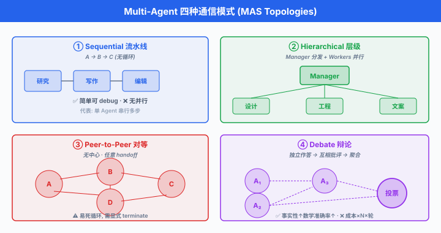

# Multi-Agent 编排系统

> **一句话总结**: 当单个 Agent 塞不下所有工具、需要多角色协作、或想并行加速时, 就该把系统拆成多个 Agent, 用 AutoGen / LangGraph / CrewAI / MetaGPT 等框架把它们编排起来.

*上一节讲了 MCP, 让一个 Agent 能标准化地接一切工具. 但很快你会撞到另一堵墙: 一个 Agent 什么都能干, 意味着它什么都干不好 —— 系统提示塞满几十种角色指令, 工具列表膨胀到 50+, 上下文窗口全被描述占满, 真正的对话被挤到边角. 更麻烦的是, 有些任务本质上就是**协作性**的: 产品经理写需求, 架构师画图, 工程师写代码, QA 测试 —— 你让一个 Agent 同时扮演四个角色, 它会精神分裂. 于是**多智能体系统 (Multi-Agent System, MAS)** 登场: 把工作拆给多个专业化 Agent, 让它们之间通过消息或结构化 workflow 协作. 这一节讲清楚什么时候该上 MAS、几种主流通信模式、以及 2023-2026 年最有代表性的四个框架 (AutoGen, LangGraph, CrewAI, MetaGPT), 附带一份横向对比与实战陷阱清单.*

---

## 何时需要 Multi-Agent

单 Agent 是好东西, 能不上多 Agent 就不上. 但下列情形出现时, 单 Agent 会撞墙:

- **上下文塞不下**: 一个 Agent 系统提示里塞 40 个工具、8 段 few-shot 示例、5 份文档, 光工具描述就吃掉 15K Token. 后续对话预算被压得所剩无几. 拆成多个 Agent, 每个只带自己领域的工具, 描述量按需加载.
- **角色冲突**: 让同一个 Agent 既做"激进的创意生成者"又做"保守的事实核查者", 两种系统提示互相打架. 分离成两个 Agent, 各写各的系统提示, 结果反而更好. Du 等 (2023) 的多智能体辩论工作直接观察到: 让不同 Agent 独立生成再交叉批评, 在事实性与数学推理任务上相比单 Agent 基线有显著提升.
- **并行加速**: 5 篇论文要分别总结, 单 Agent 串行读要 5 分钟. 起 5 个 worker Agent 并行, 加上一个 aggregator 汇总, 1 分钟完成. 这是纯 map-reduce, 天然多 Agent.
- **复杂 workflow 拆分**: "写一个 web app" 涉及需求分析 → 架构设计 → 代码实现 → 测试 → 文档, 每一步的输入输出不同、评估标准不同. 把每一步做成一个 Agent, workflow 显式画出来, 调试与替换单点都容易.
- **权限隔离**: 面向用户的 Agent 只能读, 管理数据库的 Agent 才有写权限. 单 Agent 拿到 root 权限, 一次 prompt injection 就翻盘; 多 Agent 各持最小权限, 攻击面小很多.

反过来, **不要**上 MAS 的信号:

- 任务能被一句 Chain-of-Thought (CoT) 提示解决 —— 别为了炫技上 5 个 Agent, 单 Agent + CoT 更快更便宜.
- 各 Agent 之间需要来回传大量上下文 (每次 handoff 都要重复几 K Token 的背景), 通信开销超过分工收益.
- 系统只有一个用户、一次性对话, 不需要长期分工.

## 通信模式

MAS 的**编排结构**决定了系统的性格. 四种最常见的模式:

### Sequential (流水线)

- 结构: $A \to B \to C$, 每个 Agent 处理前一个的输出.
- 例: 研究员 Agent 收集资料 → 写作 Agent 起草 → 编辑 Agent 润色.
- 优点: 极简, debug 容易 (谁的锅一目了然).
- 缺点: 无并行, 中间某步错则后续全废.

### Hierarchical (层级)

- 结构: 一个 **manager Agent** 分发子任务, 多个 **worker Agent** 执行, 结果回到 manager 汇总. 与**参与者模型 (Actor Model)**天然贴合.
- 例: PM Agent 收到"写个 landing page"需求, 分发给 designer Agent 画图、engineer Agent 写代码、copywriter Agent 写文案.
- 优点: 并行, manager 集中协调.
- 缺点: manager 是单点瓶颈, 一旦 manager 决策错误全盘错.

### Peer-to-Peer (对等)

- 结构: 无中心, Agents 互相调用. 每个 Agent 可以决定"把这个问题转给谁".
- 例: Anthropic 2024 的 Swarm 风格 handoff —— Agent A 判断"这问题该 Agent B 处理", 直接把上下文转移给 B.
- 优点: 灵活, 无单点.
- 缺点: 易死循环 (A 转给 B, B 又转回 A), 需要显式**terminate** 条件.

### Debate (辩论)

- 结构: 多个同类 Agent 就同一问题**各自作答**, 再互相**批评**, 最后聚合.
- 例: Du 等 (2023) 让 3 个 Agent 分别解答同一道数学题, 每轮把其他 Agent 的答案作为 context 让当前 Agent 修订, 3 轮后取多数.
- 优点: 显著提升事实性 / 数学准确率.
- 缺点: 成本 $\times$ Agent 数 $\times$ 辩论轮数, 贵.



## AutoGen: 对话作为一等公民

**AutoGen** 由 Microsoft Research (Wu 等, 2023) 提出, 是最早也是最有影响力的 MAS 框架之一. 核心抽象是 **ConversableAgent** —— 每个 Agent 都能说话、能听话、能被 human 打断.

### 核心概念

- **ConversableAgent**: 通用抽象基类, 有 `send` / `receive` / `generate_reply` 三个原语.
- **AssistantAgent**: 内置 LLM, 收到消息后调模型生成回复. 相当于"AI 员工".
- **UserProxyAgent**: 代理用户, 可执行代码、调工具、请求 human 输入. 相当于"人类接口".
- **GroupChat**: 多个 Agent 加入同一房间, 由 **GroupChatManager** 决定下一个说话的是谁 (可用 round-robin, 也可让 LLM 挑).
- **Human-in-the-loop**: `human_input_mode="ALWAYS" | "TERMINATE" | "NEVER"`, 决定何时让人类介入.

### 完整示例: 两 Agent 写代码 + 执行

```python
# pip install pyautogen
from autogen import AssistantAgent, UserProxyAgent, config_list_from_json

config_list = config_list_from_json("OAI_CONFIG_LIST.json")

# AI 工程师: 只负责写代码
engineer = AssistantAgent(
    name="engineer",
    llm_config={"config_list": config_list, "temperature": 0},
    system_message="你是资深 Python 工程师. 用户提需求, 你返回可执行代码. "
                   "代码用 ```python``` 代码块包裹. 任务完成后回复 TERMINATE."
)

# 用户代理: 执行代码, 汇报结果
executor = UserProxyAgent(
    name="executor",
    human_input_mode="NEVER",              # 全自动, 不问人类
    max_consecutive_auto_reply=5,
    is_termination_msg=lambda m: "TERMINATE" in m.get("content", ""),
    code_execution_config={"work_dir": "sandbox", "use_docker": False},
)

# 发起对话: executor 把任务发给 engineer, engineer 回代码, executor 执行并回喂结果
executor.initiate_chat(
    engineer,
    message="写一个函数, 输入 n, 返回前 n 个斐波那契数. 用 n=10 测试并打印结果."
)
```

- 运行时你会看到:
  1. `executor → engineer`: "写个函数...".
  2. `engineer`: 返回代码块.
  3. `executor`: 把代码写进 `sandbox/tmp_code_xxx.py`, `python` 执行, 抓 stdout.
  4. `executor → engineer`: "输出是 [0,1,1,2,3,5,8,13,21,34]".
  5. `engineer`: "看起来正确, TERMINATE."

- 这一切**不需要写循环**, AutoGen 内部的 `generate_reply` 已包含"收消息 → 决定回复 → 送消息"的循环, 直到 `is_termination_msg` 命中.

### GroupChat: 多 Agent 圆桌

```python
from autogen import GroupChat, GroupChatManager

pm = AssistantAgent("pm", system_message="你是产品经理, 负责澄清需求.", llm_config=llm_config)
architect = AssistantAgent("architect", system_message="你是架构师, 画出模块划分.", llm_config=llm_config)
engineer = AssistantAgent("engineer", system_message="你写代码.", llm_config=llm_config)
reviewer = AssistantAgent("reviewer", system_message="你 review 代码, 找 bug.", llm_config=llm_config)

group = GroupChat(
    agents=[pm, architect, engineer, reviewer],
    messages=[],
    max_round=15,
    speaker_selection_method="auto",  # LLM 自己决定下一个发言者, 也可 "round_robin"
)
manager = GroupChatManager(groupchat=group, llm_config=llm_config)

user_proxy = UserProxyAgent("user", human_input_mode="TERMINATE")
user_proxy.initiate_chat(manager, message="帮我实现一个 TODO List CLI, 支持增删查改, 数据存 JSON.")
```

- **AutoGen Studio** 是官方 UI, 拖拽定义 Agent 与 workflow, 一键运行. 适合非工程师做原型.
- 官方还提供 **AutoGen v0.4** (2025 年重写为异步 Actor 架构), API 与 v0.2 差异较大, 团队宜锁定版本.

## LangGraph: 显式 DAG 才是编排的正道

**LangGraph** 由 LangChain 团队 2024 年推出, 主张 "对话式编排太隐式, 你需要**有向无环图 (Directed Acyclic Graph, DAG)**". 每个 Agent / 步骤是一个 **node**, 边是控制流, state 是类型化 dict.

### 核心概念

- **StateGraph**: 图对象. 需先声明 state schema (Python `TypedDict`).
- **Node**: 一个函数, 签名 `(state) -> partial_state`, 返回要合并进 state 的字段.
- **Edge**: 普通边 `add_edge(a, b)`; **conditional edge** `add_conditional_edges(a, router_fn, {label: node})` 根据 state 决定下一步.
- **Checkpointing**: 每次 node 执行完自动持久化 state (SQLite / Postgres / Redis). 崩了可从上一个 checkpoint 恢复.
- **Interrupt / Resume**: 显式挂起等 human input, 后续 `.invoke(..., resume=...)` 续跑. Human-in-the-loop 的原语级支持.

### 完整示例: 研究员-写作者-评审 三节点 workflow

```python
# pip install langgraph langchain langchain-openai
from typing import TypedDict, Annotated
from operator import add
from langgraph.graph import StateGraph, END
from langgraph.checkpoint.memory import MemorySaver
from langchain_openai import ChatOpenAI

class ResearchState(TypedDict):
    topic: str
    notes: Annotated[list[str], add]   # 用 reducer 合并多 node 写入
    draft: str
    review: str
    approved: bool

llm = ChatOpenAI(model="gpt-4o", temperature=0)

def researcher(state: ResearchState) -> dict:
    resp = llm.invoke(f"给出关于 '{state['topic']}' 的 5 条关键事实, 每行一条.")
    return {"notes": resp.content.split("\n")}

def writer(state: ResearchState) -> dict:
    notes = "\n".join(state["notes"])
    resp = llm.invoke(f"根据以下笔记写一段 200 字文章:\n{notes}")
    return {"draft": resp.content}

def reviewer(state: ResearchState) -> dict:
    resp = llm.invoke(f"评审这段文字, 如通过输出 APPROVE, 否则给出修改建议:\n{state['draft']}")
    approved = "APPROVE" in resp.content
    return {"review": resp.content, "approved": approved}

def router(state: ResearchState) -> str:
    return "end" if state["approved"] else "rewrite"

graph = StateGraph(ResearchState)
graph.add_node("researcher", researcher)
graph.add_node("writer", writer)
graph.add_node("reviewer", reviewer)

graph.set_entry_point("researcher")
graph.add_edge("researcher", "writer")
graph.add_edge("writer", "reviewer")
graph.add_conditional_edges("reviewer", router, {"end": END, "rewrite": "writer"})

# Checkpoint: 用 SQLite 存进度, 支持恢复
checkpointer = MemorySaver()
app = graph.compile(checkpointer=checkpointer)

config = {"configurable": {"thread_id": "session-42"}}
result = app.invoke({"topic": "MoE 架构的负载均衡损失", "notes": []}, config=config)
print(result["draft"])
```

- **conditional edge** 让 workflow 支持"若不通过则回炉重写"这种循环控制, 但整体仍是可分析的图.
- **checkpointer + thread_id** 让同一会话跨进程恢复: 服务重启后, 传同一个 `thread_id`, LangGraph 从上次挂起处继续.
- **可视化**: `app.get_graph().draw_mermaid()` 输出 Mermaid 图, 直接贴 Notion / GitHub.

LangGraph 的哲学非常明确: **agentic workflow 是可视化的、可测试的、可回放的**. 相比 AutoGen 的对话式黑箱, LangGraph 让每一次执行都可以还原, 生产系统更容易 debug.

## CrewAI: 用"公司组织架构"讲多智能体

**CrewAI** (João Moura, 2024) 主打**角色驱动**. 每个 Agent 有 `role` / `goal` / `backstory`, 每个 `Task` 分配给某个 Agent, 由 `Crew` 组合成团队, 用 `Process.sequential` / `Process.hierarchical` 决定协作方式.

### 完整示例: 市场调研 Crew

```python
# pip install crewai crewai-tools
from crewai import Agent, Task, Crew, Process
from crewai_tools import SerperDevTool, WebsiteSearchTool

search = SerperDevTool()
web = WebsiteSearchTool()

researcher = Agent(
    role="资深行业研究员",
    goal="找到 {topic} 领域 2026 年最重要的 5 个趋势",
    backstory="你在麦肯锡做过 10 年行业分析, 擅长从公开信息里挖洞察.",
    tools=[search, web],
    verbose=True,
)

analyst = Agent(
    role="战略分析师",
    goal="把研究结果整理成对 CEO 有用的战略建议",
    backstory="你曾在 BCG 帮 CEO 起草战略, 语言精炼, 只讲结论.",
    verbose=True,
)

writer = Agent(
    role="商业写作专家",
    goal="把战略建议写成 800 字可发布的分析文章",
    backstory="你为 The Economist 撰稿, 熟悉商业读者的胃口.",
    verbose=True,
)

task_research = Task(
    description="调研 {topic} 领域的最新趋势, 输出 5 条要点, 每条附来源.",
    expected_output="Markdown 列表, 5 项, 每项 3 句话.",
    agent=researcher,
)

task_analyze = Task(
    description="根据研究员的产出, 提炼 3 条 CEO 应立即采取的行动.",
    expected_output="3 条行动建议, 每条附理由.",
    agent=analyst,
    context=[task_research],   # 显式依赖: 拿到 task_research 的输出
)

task_write = Task(
    description="把战略建议扩写成 800 字文章.",
    expected_output="Markdown 文档, 有小标题.",
    agent=writer,
    context=[task_analyze],
    output_file="report.md",
)

crew = Crew(
    agents=[researcher, analyst, writer],
    tasks=[task_research, task_analyze, task_write],
    process=Process.sequential,  # 或 Process.hierarchical (需 manager LLM)
    verbose=True,
)

result = crew.kickoff(inputs={"topic": "AI Agent"})
print(result)
```

- CrewAI 的**心智模型是"公司组织"**: role / goal / backstory 让 Agent 表现更稳定, 类似给员工发岗位说明书.
- `Process.hierarchical` 时需要指定 `manager_llm`, CrewAI 自动创建一个 manager Agent 分派任务, 类似 AutoGen GroupChat.
- 学习曲线是四个框架里最平的 —— 从零到跑通一个 3-Agent workflow, 一个下午够.
- 短板: 缺 checkpoint, 长跑任务崩了得重跑; 内部状态管理不透明, debug 只能靠 `verbose=True` 看日志.

## MetaGPT: 用 SOP 让 AI 变成一家软件公司

**MetaGPT** 由中国团队 (Hong 等, 2023, DeepWisdom) 提出, 是华人 AI 圈影响力最大的 MAS 项目之一 (GitHub 40K+ star). 核心思想: 把**软件工程标准操作流程 (Standard Operating Procedure, SOP)**编码进 Agent 系统 —— PM 写 PRD, 架构师画系统设计, 工程师写代码, QA 写测试, 每个环节的**输入输出都是结构化文档** (PRD.md, design.md, task_list.json).

### 核心概念

- **Role**: 类比员工. 每个 Role 有 `name` / `profile` / `goal` / `constraints`, 以及 `_act` 方法定义如何执行任务.
- **Action**: Role 能做的具体动作, 如 `WritePRD` / `WriteDesign` / `WriteCode` / `WriteTest`. Action 内部是一段 LLM prompt + 输出解析.
- **Message**: Role 之间的通信单元, 有 `content` / `role` / `cause_by` / `sent_from` 字段.
- **Environment**: 所有 Role 共享的**发布-订阅消息总线 (Publish-Subscribe message bus)**. Role 声明自己关心哪些 Action 产生的 Message, 就自动被唤醒.
- **SOP 驱动**: 与 CrewAI 显式 `context=[...]` 不同, MetaGPT 的协作靠 message 类型自动路由, 更松耦合.

### Role 定义示例

```python
# pip install metagpt
from metagpt.roles import Role
from metagpt.actions import Action
from metagpt.schema import Message

class WritePythonCode(Action):
    PROMPT = """
你是资深 Python 工程师. 根据以下架构设计写完整代码:
{design}
要求: 单文件、可运行、含 __main__ 入口, 中文注释.
只返回代码块, 不加解释.
"""
    async def run(self, design: str) -> str:
        prompt = self.PROMPT.format(design=design)
        return await self._aask(prompt)

class Engineer(Role):
    name = "Alex"
    profile = "Python Engineer"
    goal = "写出可运行、遵循架构的高质量代码"
    constraints = "保持 PEP8, 无 TODO, 无占位符"

    def __init__(self, **kwargs):
        super().__init__(**kwargs)
        self._init_actions([WritePythonCode])
        self._watch([WriteDesign])   # 订阅: 一旦 Architect 发布了 WriteDesign 结果, 就被唤醒

    async def _act(self) -> Message:
        design = self.rc.memory.get_by_action(WriteDesign)[-1].content
        code = await self.todo.run(design=design)
        return Message(content=code, role=self.profile, cause_by=WritePythonCode)
```

- 运行整个"软件公司":

```python
from metagpt.team import Team
from metagpt.roles import ProductManager, Architect, ProjectManager, Engineer, QaEngineer

async def startup(idea: str):
    company = Team()
    company.hire([
        ProductManager(),
        Architect(),
        ProjectManager(),
        Engineer(n_borg=2),   # 起 2 个工程师并行
        QaEngineer(),
    ])
    company.invest(investment=3.0)   # 预算, 单位 USD
    company.run_project(idea)
    await company.run(n_round=10)

# 用 asyncio 启动
import asyncio
asyncio.run(startup("做一个五子棋游戏, 命令行版, 双人对战."))
```

- 输出会写到 `workspace/五子棋_xxx/`: `docs/prd.md` / `docs/system_design.md` / `docs/tasks.md` / `game.py` / `tests/test_game.py`. 一个完整的**软件项目文件树**.
- **中文文档丰富**是 MetaGPT 相对海外框架的显著优势 —— 官方 README 有中英双语版, 且核心开发者活跃在国内社区.
- 局限: SOP 是软件开发场景高度定制, 换到"客服 workflow"或"内容生产"需要重写大量 Action; 而 LangGraph / CrewAI 更通用.

## 框架横向对比

| 维度 | AutoGen | LangGraph | CrewAI | MetaGPT |
|------|---------|-----------|--------|---------|
| **编排模型** | 对话 (ConversableAgent) | 显式 DAG (StateGraph) | 角色 + 任务 (Role/Task) | SOP + 消息总线 |
| **状态管理** | 隐式 (消息历史) | 类型化 dict (TypedDict) | Crew context | Message + memory |
| **Checkpointing** | ❌ | ✅ (Memory/SQLite/Postgres) | ❌ | 部分 (workspace 落盘) |
| **Human-in-the-loop** | UserProxyAgent, 原生 | interrupt/resume 原语 | 需自建 | 需自建 |
| **并行执行** | GroupChat 内可并发 | 图内 fan-out | Task 依赖树 | n_borg 多员工 |
| **可视化** | AutoGen Studio | Mermaid / LangGraph Studio | 无官方 UI | 项目文件树 |
| **学习曲线** | 中 | 中偏高 (需懂 DAG) | 低 | 中 |
| **场景** | 通用对话 / code exec | 生产级 workflow / RAG | 快速原型 / 内容工作流 | 软件开发 SOP |
| **中文文档** | 一般 (社区补齐) | 差 (官方英文) | 差 | 优 (国内团队) |
| **GitHub Star (截至 2025 年中)** | ~30K | ~10K | ~20K | ~40K |
| **首发年份** | 2023 | 2024 | 2024 | 2023 |

- 选择建议:
  - **要生产、要可 debug、要恢复**: LangGraph. 状态显式、图可视化、checkpoint 是杀手锏.
  - **要快速原型、非工程师能改**: CrewAI. YAML 化配置很快.
  - **要研究、要玩对话式 emergence**: AutoGen. 学界 baseline 多用它.
  - **要中文文档、场景就是软件开发**: MetaGPT. 开箱即用.

## Actor Model 理论基础

MAS 的数学根源可以追溯到 Hewitt (1973) 的**参与者模型 (Actor Model)**. 一个 Actor 是**并发计算的基本单元**, 由三部分组成:

$$\text{Actor} = (\text{State}, \text{Mailbox}, \text{Behavior})$$

- **State**: Actor 私有, 外部不可直接访问 (与 OOP 的 "encapsulation" 类似, 但更强).
- **Mailbox**: 先进先出消息队列, 其他 Actor 通过发消息与之交互.
- **Behavior**: 收到消息 $m$ 后, Actor 可以: (1) 修改自身状态; (2) 发送有限条消息给已知 Actors; (3) 创建有限个新 Actors; (4) 更新自身 behavior 用于处理下一条消息.

状态转移可以写成:

$$\text{Actor}_{t+1} = f(\text{State}_t, m_t), \quad m_t \sim \text{Mailbox}_t$$

其中 $f$ 就是 behavior 函数, $m_t$ 是本轮处理的消息.

与 LLM MAS 的类比:

| Actor Model | LLM MAS |
|-------------|---------|
| State | Agent memory / context |
| Mailbox | 消息队列 (AutoGen inbox, MetaGPT env) |
| Behavior | 系统提示 + LLM |
| 消息 asynchronously | send/receive tool call |
| Location transparency | Agent 不关心对方在哪台机 |

- Hewitt 的原设计**避免共享内存**, 强调消息不可变 + 异步. 这与今天分布式 MAS (跨机 Agent) 的挑战完全一致. Erlang / Akka / Elixir 都是 Actor Model 在编程语言层面的实现, 而 AutoGen v0.4 明确采用 Actor 架构重写.

## Coordination 挑战

多 Agent 一多, 分布式系统的所有痛都会显现:

### Deadlock (死锁)

- Agent A 等 B 的回复, B 等 A 的补充数据, 双方都不动.
- 缓解: 设**超时**; workflow 里画 DAG 避环 (LangGraph 天然强制无环, 只能通过 conditional edge 回跳有限次数).

### Message loss / duplication

- 网络抖动导致消息丢或重复. LLM 调用本身不确定, 同一 prompt 触发两次可能副作用翻倍 (下单两次).
- 缓解: **幂等 (Idempotency)** —— 每条消息带唯一 ID, Agent 处理前查是否已见过.

### Consistency (状态不一致)

- Agent A 认为 "订单已支付", Agent B 认为 "订单还在待付". 各自看到的世界快照不同.
- 缓解: 单一 source of truth (共享 store), 或用消息序号严格排序.

### Cost explosion (成本爆炸)

- 每次 handoff 都要重传上下文. 令一次 LLM 调用成本 $c$, 上下文 Token 数 $T$, 单价 $p$ 每 Token, Agent 数 $N$, 平均 handoff 次数 $H$:

$$C_\text{total} = N \cdot H \cdot (T \cdot p_\text{in} + T_\text{out} \cdot p_\text{out})$$

- 一个粗糙估算: $N=5, H=10, T=4000, T_\text{out}=500$, GPT-4o 单价 $p_\text{in}=2.5, p_\text{out}=10$ USD 每 M Token, 一次任务成本约 $0.75 USD. 一天跑 1000 次, 每月 22.5K USD, 比人力还贵.

- 优化方向: 只在必要时传上下文摘要, 不传全量; 缓存 tool schema; 复用 KV cache (若同一 Agent 连续多轮).

## 辩论型 Multi-Agent

Du 等 (2023) 在 *"Improving Factuality and Reasoning in Language Models through Multiagent Debate"* 中提出: 让 $M$ 个 Agent 各自回答同一问题, 每轮把其他 Agent 的答案作为 context 让当前 Agent 修订, 经过 $R$ 轮后取多数. 数学模型:

- 记 Agent $i$ 在第 $r$ 轮的答案为 $a_i^{(r)}$, 初始 $a_i^{(0)} = \text{LLM}(q)$.
- 第 $r$ 轮更新:

$$a_i^{(r+1)} = \text{LLM}\left(q,\ \{a_j^{(r)}\}_{j \neq i}\right)$$

- 最终答案由聚合函数决定, 最简单的是投票:

$$a^* = \arg\max_a \sum_{i=1}^{M} \mathbb{1}[a_i^{(R)} = a]$$

也可用分数加权 (每个 Agent 附一个置信度 $s_i$):

$$a^* = \arg\max_a \sum_{i=1}^{M} s_i \cdot \mathbb{1}[a_i^{(R)} = a]$$

Liang 等 (2023) 进一步在 *"Encouraging Divergent Thinking in Large Language Models"* 中给不同 Agent 分配**对抗性人设** ("怀疑者" vs "支持者"), 强化辩论深度.

### 辩论骨架代码

```python
from openai import OpenAI
client = OpenAI()

def ask(prompt: str) -> str:
    return client.chat.completions.create(
        model="gpt-4o-mini",
        messages=[{"role": "user", "content": prompt}],
        temperature=0.7,
    ).choices[0].message.content

def debate(question: str, n_agents: int = 3, n_rounds: int = 2) -> str:
    # 初始回答
    answers = [ask(f"回答问题: {question}\n请给出你的最终答案.") for _ in range(n_agents)]

    # R 轮辩论
    for r in range(n_rounds):
        new_answers = []
        for i in range(n_agents):
            peers = "\n".join(f"Agent {j+1}: {a}" for j, a in enumerate(answers) if j != i)
            prompt = f"""问题: {question}

其他 Agent 的回答:
{peers}

你之前的回答: {answers[i]}

请参考其他 Agent 的观点, 检查是否需要修改你的答案. 若他们提出的证据有说服力, 请采纳; 若你坚持原答案, 请给出理由. 输出最终答案."""
            new_answers.append(ask(prompt))
        answers = new_answers

    # 多数投票 (简化: 用 LLM 抽取关键结论后计数)
    consensus = ask(f"以下是 {n_agents} 个 Agent 对问题 '{question}' 的回答:\n" +
                    "\n".join(f"- {a}" for a in answers) +
                    "\n请综合给出最可能正确的答案.")
    return consensus

print(debate("25 * 34 = ?", n_agents=3, n_rounds=2))
```

- 实验结果 (Du 2023): 在 GSM8K 数学题、MMLU 常识推理与 Biographies 事实性任务上, 3-Agent 多轮辩论相比单 Agent CoT 基线均带来显著提升 (原文表 1 报告了在多个基准上准确率的可观增益, 具体数字请参见原论文).
- 代价: 成本 $\times 6$ (3 Agent, 每 Agent 说 2 轮). 除非任务对正确率极敏感 (医疗诊断、金融决策), 否则单 Agent CoT + self-consistency 更划算.

## 实战陷阱

从 2024-2026 生产落地反馈汇总, 最常见的坑:

- **"Agent inflation" (Agent 通货膨胀)**: 上 5 个 Agent 效果不如 1 个 CoT. 拆分本身没解决问题, 只是把复杂度从 prompt 内挪到 orchestration 层, 而后者更难 debug. 只在真有并行 / 隔离需求时才拆.
- **Handoff 成本**: 每次 Agent 之间传递都要重复上下文, 5 Agent × 10 轮 handoff × 4K Token = 200K Token, 一次任务几美元. 生产系统需**摘要压缩**每次传递的上下文, 而非全文丢过去.
- **Debug 难度**: 出错时, 是 PM Agent 的锅、Architect 的锅还是 Engineer 的锅? 每 Agent 的 prompt 都要单独 traceable. LangGraph 的 checkpoint 与 LangSmith 观测, 是这方面最成熟的组合.
- **Idempotency (幂等性)**: 若 workflow 中途崩溃重跑, "发邮件"这类外部副作用不能重复触发. 每个 tool call 需要**唯一 request ID** + 服务端去重.
- **权限爆炸**: 每加一个 Agent, 就要问"它能读什么写什么". 简单起见常常给所有 Agent 全部权限, 一次 prompt injection 全盘失守. 最小权限原则在 MAS 里比单 Agent 更重要.
- **测试策略缺失**: 单元测试 → 集成测试都能做, 但 workflow 级别的 e2e 测试没标准做法. LangGraph 支持 replay 一段历史, CrewAI / AutoGen 都没.

Park 等 (2023) 的 *"Generative Agents: Interactive Simulacra of Human Behavior"* (斯坦福小镇) 展示了 25 个 Agent 长时演化的可能, 但也暴露了同样的痛点: 上下文爆炸、记忆管理、成本失控. 他们最终用**记忆检索 + reflection + planning** 三层结构缓解, 是长跑 MAS 的重要范式.

---

## 📌 本节要点

- **何时上 MAS**: 单 Agent 上下文塞不下、角色冲突、可并行、复杂 workflow、权限隔离. 反之能用 CoT 解决就别拆.
- **四种通信模式**: Sequential (流水线) / Hierarchical (层级 manager+worker) / Peer-to-Peer (去中心) / Debate (辩论投票), 各有适用场景.
- **AutoGen**: Microsoft 出品, ConversableAgent 抽象, 对话为一等公民, GroupChat + Studio UI 适合快速原型与研究.
- **LangGraph**: LangChain 出品, StateGraph 显式 DAG + 类型化 state + checkpointing, 生产级 workflow 首选.
- **CrewAI**: 角色驱动 (role/goal/backstory) + 任务依赖, 学习曲线最平, 内容 / 咨询工作流的快速原型利器.
- **MetaGPT**: 中国团队作品, SOP 驱动的软件公司类比, 发布-订阅消息总线, 中文文档最好, 场景高度定制在软件开发.
- **Actor Model**: Hewitt 1973 提出 Actor = State + Mailbox + Behavior, 是 MAS 的理论根源, AutoGen v0.4 直接采用 Actor 架构.
- **辩论型 MAS 数学**: $a_i^{(r+1)} = \text{LLM}(q, \{a_j^{(r)}\}_{j \neq i})$, 最后投票聚合. 在 GSM8K / MMLU / Biographies 等基准上相比单 Agent CoT 均有显著提升, 代价是成本 ×(Agent 数 × 轮数).
- **主要陷阱**: Agent inflation (拆了反而慢)、handoff 成本 (上下文重传)、debug 归因难、幂等性、权限最小化.

## 参考文献

- Wu, Q., Bansal, G., Zhang, J., Wu, Y., Li, B., Zhang, S., Liu, J., Wang, X., Wang, C., et al. (2023). *AutoGen: Enabling Next-Gen LLM Applications via Multi-Agent Conversation*. arXiv:2308.08155. (AutoGen 官方论文.)
- Hong, S., Zhuge, M., Chen, J., Zheng, X., Cheng, Y., Zhang, C., Wang, J., Wang, Z., Yau, S. K. S., Lin, Z., Zhou, L., Ran, C., Xiao, L., Wu, C., & Schmidhuber, J. (2023). *MetaGPT: Meta Programming for A Multi-Agent Collaborative Framework*. arXiv:2308.00352. (MetaGPT 官方论文, DeepWisdom 团队.)
- Du, Y., Li, S., Torralba, A., Tenenbaum, J. B., & Mordatch, I. (2023). *Improving Factuality and Reasoning in Language Models through Multiagent Debate*. arXiv:2305.14325. (辩论型 MAS 首篇代表性工作.)
- Liang, T., He, Z., Jiao, W., Wang, X., Wang, Y., Wang, R., Yang, Y., Tu, Z., & Shi, S. (2023). *Encouraging Divergent Thinking in Large Language Models through Multi-Agent Debate*. arXiv:2305.19118. (辩论 + 对抗人设.)
- Hewitt, C., Bishop, P., & Steiger, R. (1973). *A Universal Modular ACTOR Formalism for Artificial Intelligence*. IJCAI 1973. (Actor Model 原始论文.)
- Park, J. S., O'Brien, J. C., Cai, C. J., Morris, M. R., Liang, P., & Bernstein, M. S. (2023). *Generative Agents: Interactive Simulacra of Human Behavior*. UIST 2023. (斯坦福小镇, 25 Agent 长时模拟.)
- Talebirad, Y., & Nadiri, A. (2023). *Multi-Agent Collaboration: Harnessing the Power of Intelligent LLM Agents*. arXiv:2306.03314. (多 Agent 协作早期短文.)
- LangChain, Inc. (2024). *LangGraph Documentation*. [https://langchain-ai.github.io/langgraph/](https://langchain-ai.github.io/langgraph/). (官方文档.)
- Moura, J. (2024). *CrewAI: Framework for Orchestrating Role-playing Autonomous AI Agents*. [https://github.com/joaomdmoura/crewAI](https://github.com/joaomdmoura/crewAI). (CrewAI 官方仓库.)
- Microsoft. (2023-present). *AutoGen*. [https://github.com/microsoft/autogen](https://github.com/microsoft/autogen). (AutoGen 官方仓库.)
- DeepWisdom. (2023-present). *MetaGPT*. [https://github.com/geekan/MetaGPT](https://github.com/geekan/MetaGPT). (MetaGPT 官方仓库, 中文 README.)
