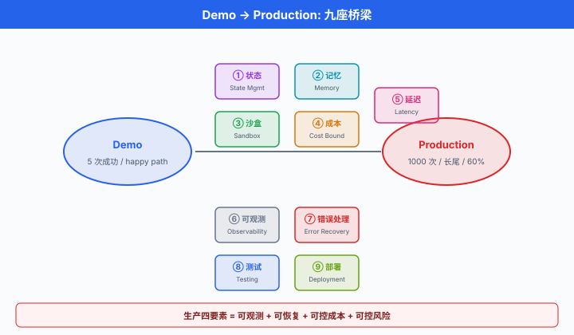
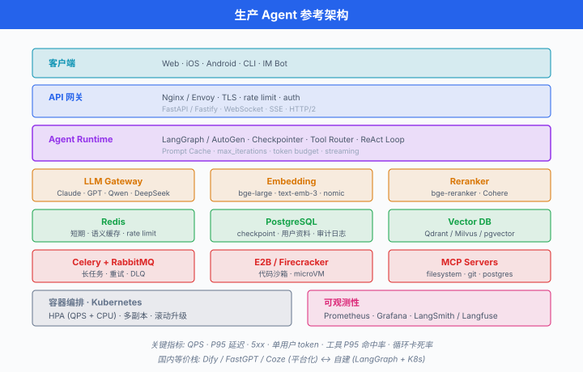

# Agent 生产落地

> **一句话总结**: 从 demo 到 production 隔着一条深渊, 越过它靠的不是更大的模型, 而是**状态管理 / Memory / 沙盒 / 成本控制 / 可观测性 / 错误恢复 / 测试评估**这套完整的工程栈.

*前五节讲了 Agent 的原理、ReAct 循环、工具接入、MCP 标准化、多 Agent 编排. 这些放到 Jupyter Notebook 里跑, demo 效果通常都不错 —— 一杯咖啡, 5 次都成功. 但你把它上线, 让 1000 个真实用户去用, 事情就完全不同了: 有人的问题连续调 30 轮工具超预算; 有人一个越狱 prompt 让 Agent 把 `.env` 泄漏; 有人的对话跨了三天需要恢复上下文; 有人的 tool call 因外部 API 抖动失败但重试造成了重复下单. Demo 只需要"能跑", 生产要"能扛" —— 可观测、可恢复、可控成本、可控风险. 这一节就是那本"从 demo 到 production"的求生手册, 全是坑与实操, 中国生态 (Dify / FastGPT / Coze) 一并覆盖.*

---

## 从 Demo 到 Production 的深渊

一个真实的观察: 同一个 Agent, 内部演示 5 次成功率 100%, 上生产跑 1000 次, 成功率掉到 60%. 为什么?

Demo 与 Production 的差距不在算法, 在**长尾**:

- Demo 的输入是精心设计的 happy path; Production 的输入包含 emoji 满屏、代码片段、prompt injection、10 种语言混杂、乱码.
- Demo 的外部 API 从没挂过; Production 里 OpenAI 429、Bing Search 503、内网数据库慢查询, 每天都有.
- Demo 的对话跑 5 轮就结束; Production 有用户跑 200 轮, 上下文早就爆了.
- Demo 崩了直接重启; Production 用户对话到第 8 轮崩了, 你得从第 8 轮恢复, 不能让他重问一遍.
- Demo 不看账单; Production 一天 10 万次调用, 一个循环 bug 一天烧掉 5000 美元.

**生产 Agent 的四个硬要求**:

1. **可观测 (observable)**: 每一步在哪、耗时多少、花了多少 token, 全都有 trace.
2. **可恢复 (recoverable)**: 崩了从 checkpoint 续跑, 用户无感.
3. **可控成本 (cost-bounded)**: 单次会话 / 单用户 / 单天有硬上限, 超了报警.
4. **可控风险 (risk-bounded)**: 破坏性动作有 human-in-the-loop, 沙盒隔离, 权限最小化, 审计日志.

后面每一小节, 都是把这四个要求拆开来讲清楚"怎么做".



## 状态管理: Ephemeral vs Persistent

**状态管理 (state management)** 是生产 Agent 的第一根支柱. 状态分三层:

- **Ephemeral state (瞬时状态)**: 当前请求生命周期内的东西, 进程死了就丢, 例如 ReAct 循环里当前的 scratchpad.
- **Persistent state (持久状态)**: 存到数据库的 checkpoint, 服务重启后能恢复. LangGraph 的 SqliteSaver / PostgresSaver 就干这个.
- **Long-term memory (长期记忆)**: 跨会话的知识, 通常存到**向量数据库 (vector database, vector DB)** 或**知识图谱 (Knowledge Graph, KG)**.

第一次上生产的团队最常犯的错: 把所有状态放内存. 服务一重启, 用户对话全丢. 正确的做法是**每一步 tool call 完成后落盘一次**, 让 workflow 天然可恢复.

### LangGraph Checkpointing 实操

```python
# pip install langgraph langgraph-checkpoint-sqlite
import sqlite3
from langgraph.graph import StateGraph, END
from langgraph.checkpoint.sqlite import SqliteSaver
from typing import TypedDict

class ChatState(TypedDict):
    messages: list
    step: int

def call_llm(state: ChatState) -> dict:
    # 简化: 真实场景这里会调 LLM + 工具
    return {"messages": state["messages"] + [f"reply-{state['step']}"],
            "step": state["step"] + 1}

def should_continue(state: ChatState) -> str:
    return "loop" if state["step"] < 5 else "end"

graph = StateGraph(ChatState)
graph.add_node("agent", call_llm)
graph.set_entry_point("agent")
graph.add_conditional_edges("agent", should_continue, {"loop": "agent", "end": END})

# 关键: 用 SQLite 持久化, 每一步自动写盘
conn = sqlite3.connect("agent_checkpoints.db", check_same_thread=False)
checkpointer = SqliteSaver(conn)
app = graph.compile(checkpointer=checkpointer)

# 用户 A 的会话, thread_id 就是他的 session_id
config = {"configurable": {"thread_id": "user-a-session-42"}}

# 第一次调用: 跑到第 3 步时假设进程崩了
try:
    result = app.invoke({"messages": [], "step": 0}, config=config)
except KeyboardInterrupt:
    pass

# 服务重启后, 传同一个 thread_id, 从 checkpoint 恢复
# LangGraph 自动读取最新 checkpoint, 从上次断点继续
result = app.invoke(None, config=config)   # None = 用已有 state
print(result)
```

要点:

- `thread_id` 是恢复的钥匙, 通常等于用户 session ID.
- Checkpoint 频率是每个 node 完成后一次, 粒度足够细.
- 生产用 `PostgresSaver`, SQLite 只适合单机 demo.

## Memory 架构: 短期 / 长期 / 反思

单纯的 checkpoint 只解决"当前对话不丢", 没解决"跨会话记住用户". 完整的 Agent memory 架构分三层:

- **短期记忆 (Short-term memory)**: 当前 context window 里的 system + user + assistant 消息. 生命周期 = 一次对话.
- **长期记忆 (Long-term memory)**: 跨会话保存, 又细分为三种:
  - **语义记忆 (Semantic memory)**: 事实. "用户是糖尿病患者". 存向量 DB 或 KG.
  - **情景记忆 (Episodic memory)**: 时间点上发生的事件. "2026-07-25 用户预约了口腔科". 存时序数据库或加时间戳的向量 DB.
  - **程序记忆 (Procedural memory)**: 会做什么, 不写 prompt 里 —— 已经**微调进模型权重**. 例如用户 Agent 的说话风格被 fine-tune 进 LoRA 权重.
- **工作记忆 (Working memory)**: 短期 + 当前从长期检索来的相关片段, 拼起来送给 LLM 的最终 prompt.

**反思 (Reflection) 机制**由 Park 等 (2023) 的 *Generative Agents* 提出: Agent 定期把最近的一批 observation 用 LLM 总结成更高层的 "insight", 存回长期记忆. 这样长期记忆不是 raw log, 而是**分层压缩**的知识.

数学上, 记忆检索的相关度打分通常混合三个因素: 语义相似度 $s_i$、时效衰减 $e^{-\lambda \Delta t_i}$、重要性 $w_i$:

$$\text{score}(m_i) = \alpha \cdot s_i + \beta \cdot e^{-\lambda \Delta t_i} + \gamma \cdot w_i$$

其中 $\Delta t_i$ 是记忆的年龄 (小时), $\lambda$ 是遗忘率. Park 等给的经验值: $\alpha = \beta = \gamma = 1$; 原文对时效项直接采用 $0.99^{\Delta t}$ (每小时衰减到上一小时的 99%), 换算到 $e^{-\lambda \Delta t}$ 形式即 $\lambda \approx 0.01$. 落地时按具体业务调.

**实用建议**:

- 起手别搞得太复杂. 90% 场景, 短期 (对话历史) + 语义长期 (向量 DB 存事实) 就够.
- Reflection 只在真需要长跑的 Agent (陪伴机器人、虚拟角色) 才上. 普通客服 Agent 不需要.
- 长期记忆写入前**LLM 抽取事实**, 别把整段对话原样存. 存的是 "用户对海鲜过敏", 不是 "用户说他上次吃虾之后..."

## Tool Safety: 沙盒 + 权限 + 审计

Agent 能调工具是它的力量, 也是它的危险. 生产环境的三道防线:

**沙盒 (sandbox) 隔离**. 当 Agent 需要执行代码 / shell / 文件操作时, 一律在沙盒里跑, 别在生产机器上跑:

- **E2B** (2024 起流行): 云上 Firecracker microVM, 秒级启动, SDK 一行调用.
- **Modal**: 云函数, 天生隔离, 适合长任务.
- **Firecracker** (AWS 开源): 自己搭沙盒集群的底层.
- **Docker + gVisor**: 便宜方案, 但启动慢, 逃逸风险高于 microVM.

```python
# pip install e2b-code-interpreter
from e2b_code_interpreter import Sandbox

def run_code_tool(code: str) -> dict:
    """给 Agent 用的代码执行工具: 隔离在 E2B 沙盒里"""
    with Sandbox(timeout=30) as sbx:            # 30 秒超时, 到时强杀
        execution = sbx.run_code(code)
        return {
            "stdout": execution.logs.stdout,
            "stderr": execution.logs.stderr,
            "error": str(execution.error) if execution.error else None,
            "results": [r.text for r in execution.results if r.text],
        }

# 集成到 Agent 的 tool schema
tool_schema = {
    "type": "function",
    "function": {
        "name": "run_python",
        "description": "在隔离沙盒里执行 Python 代码, 30 秒超时",
        "parameters": {
            "type": "object",
            "properties": {"code": {"type": "string"}},
            "required": ["code"],
        },
    },
}

# 使用示例
result = run_code_tool("import pandas as pd; print(pd.__version__)")
print(result["stdout"])
```

**Human-in-the-loop (人类介入)**. 破坏性动作 —— 发邮件、下单、写数据库、删文件 —— 必须停下等人类确认. LangGraph 的 `interrupt` 原语就是干这个:

```python
from langgraph.types import interrupt, Command

def send_email_node(state):
    # 关键动作前挂起, 等人类审批
    approval = interrupt({
        "action": "send_email",
        "to": state["recipient"],
        "subject": state["subject"],
        "body": state["body"],
    })
    if approval == "approve":
        send_actual_email(state)
        return {"status": "sent"}
    return {"status": "cancelled"}

# 前端拿到 interrupt payload 后展示给用户, 用户点"批准", 后端调:
app.invoke(Command(resume="approve"), config={"configurable": {"thread_id": "..."}})
```

**权限模型 (per-tool allow-list)**. 不是每个 Agent 都该拿到全部工具. 给每个 Agent 显式声明白名单:

```python
AGENT_TOOL_PERMISSIONS = {
    "customer-support": ["search_kb", "read_order", "escalate_to_human"],
    "sales-assistant":  ["search_kb", "read_order", "read_pricing"],
    "internal-admin":   ["*"],   # 只有可信内部 Agent 拿全权
}

def get_tools_for(agent_id: str, all_tools: dict) -> dict:
    perms = AGENT_TOOL_PERMISSIONS[agent_id]
    if "*" in perms:
        return all_tools
    return {name: fn for name, fn in all_tools.items() if name in perms}
```

**审计日志 (audit log)**. 每次 tool call 落一条不可篡改的记录: `(timestamp, agent_id, user_id, tool_name, params_hash, result_hash)`. 出事时能回溯到"谁在什么时候让哪个 Agent 调了什么工具".

## Cost Control: 让账单可预测

Agent 是 token 的大户. 一个粗略的成本公式:

$$C_\text{user} = N_\text{turns} \cdot \Big[ T_\text{ctx} \cdot \big( p_\text{in} \cdot (1 - r_\text{cache}) + p_\text{cache} \cdot r_\text{cache} \big) + T_\text{out} \cdot p_\text{out} \Big]$$

其中:

- $N_\text{turns}$: 单用户平均轮数.
- $T_\text{ctx}$: 平均输入上下文 token 数 (含系统 prompt + 历史 + 工具描述).
- $T_\text{out}$: 平均输出 token 数.
- $p_\text{in}, p_\text{out}, p_\text{cache}$: 输入 / 输出 / 缓存读取的单价.
- $r_\text{cache} \in [0, 1]$: prompt 缓存命中率.

**Anthropic 2024 的 Prompt caching** 把 $r_\text{cache}$ 的价值放大到极致: 命中部分收 0.1× 输入价 (Claude Sonnet 4), 90% 折扣. 长系统提示 + 工具描述 + few-shot 例子 (通常占输入的 80% 以上, 但每次调用一样), 全塞进缓存, 命中一次的成本降到几乎为零.

**Prompt caching 实操 (Anthropic API)**:

```python
# pip install anthropic
from anthropic import Anthropic

client = Anthropic()

SYSTEM_PROMPT = """
你是资深客服 Agent, 遵循以下规则:
1. 只用中文回答
2. 涉及退款超过 500 元必须转人工
3. ... (以下为 5000 字详细规则 + 工具描述 + 20 条 few-shot 示例)
"""   # 假设整段 15K token

def chat_with_cache(user_msg: str, history: list[dict]) -> str:
    resp = client.messages.create(
        model="claude-sonnet-4-5-20250929",
        max_tokens=1024,
        system=[
            {
                "type": "text",
                "text": SYSTEM_PROMPT,
                # 关键: cache_control 标记这一段可缓存, TTL 默认 5 分钟, 可用 "1h" 延长
                "cache_control": {"type": "ephemeral"},
            }
        ],
        messages=history + [{"role": "user", "content": user_msg}],
    )
    # 从响应元数据看命中情况
    usage = resp.usage
    print(f"cache_creation_input_tokens: {usage.cache_creation_input_tokens}")
    print(f"cache_read_input_tokens:     {usage.cache_read_input_tokens}")
    return resp.content[0].text
```

第一次调用是 `cache_creation`, 按 1.25× 输入价; 之后 5 分钟内 (延长到 1 小时可在 `cache_control` 块中加 `"ttl": "1h"` 字段), 全部走 `cache_read`, 0.1× 输入价. 一个 15K token 的系统 prompt, 1000 次调用节省的钱能覆盖一个月的服务器成本.

**其他成本手段**:

- **短路 (early stop)**: 达成目标就立即结束, 别让 Agent "客气一句" 多花一轮.
- **小模型粗筛 + 大模型终判**: 简单意图分类用 `gpt-4o-mini` / `claude-haiku`, 复杂推理才上 `gpt-4o` / `claude-sonnet`. 一个开源实践: Semantic Router 库.
- **Max iterations 上限**: `max_iterations=10`, 到 10 强制停, 让降级路径处理.
- **上下文摘要**: 超过 20 轮的对话, 用 LLM 把前 15 轮总结成 200 token, 后 5 轮保留原文.

## Latency 优化

用户能忍多久? 客服场景首字延迟 (Time To First Token, TTFT) > 3 秒就掉转化. 优化四板斧:

**Streaming**. 别等模型说完再返回, 用 SSE 或 WebSocket 一 token 一 token 推. `stream=True` 一行事.

**Parallel tool calls**. OpenAI 从 2024 开始支持一次响应里返回多个 tool_call, 让 Agent 同时调 3 个 API 而不是串行:

```python
# Agent 一次输出 3 个 tool_call, 并行执行
import asyncio

async def dispatch_tools(tool_calls):
    tasks = [execute_tool(tc) for tc in tool_calls]
    return await asyncio.gather(*tasks)   # 并发, 总耗时 = max(单个耗时)
```

3 个独立的 API 调用, 串行 300 ms × 3 = 900 ms, 并行 300 ms. 收益立竿见影.

**Speculative execution (推测执行)**. 猜下一步 Agent 会调哪个工具, 提前发起. 若猜对省一轮延迟, 猜错扔掉. 适合工具集小且分布明显的场景.

**语义缓存 (semantic cache)**. 用户问 "怎么退款", 上周有人问过 "如何申请退货", embedding 相似度 0.92, 直接返回缓存的答案:

```python
# 用 Redis + embedding 做语义缓存
from openai import OpenAI
import redis, json, numpy as np

client = OpenAI()
r = redis.Redis(decode_responses=True)

def embed(text: str) -> list[float]:
    return client.embeddings.create(
        model="text-embedding-3-small", input=text
    ).data[0].embedding

def cache_lookup(query: str, threshold: float = 0.9) -> str | None:
    q_vec = np.array(embed(query))
    # 简化: 遍历所有缓存 key. 生产用 Redis Vector Search / Qdrant / Milvus
    for key in r.scan_iter("cache:*"):
        entry = json.loads(r.get(key))
        c_vec = np.array(entry["embedding"])
        sim = q_vec @ c_vec / (np.linalg.norm(q_vec) * np.linalg.norm(c_vec))
        if sim > threshold:
            return entry["answer"]
    return None

def cache_store(query: str, answer: str, ttl: int = 3600):
    r.setex(
        f"cache:{hash(query)}", ttl,
        json.dumps({"embedding": embed(query), "answer": answer}),
    )
```

命中率 20-40% 的 FAQ 型 Agent, 语义缓存直接把 P50 延迟从 1.5 秒降到 30 ms.

## Observability: 你看不见的东西治不了

**可观测性 (observability)** 是生产 Agent 与 demo Agent 最本质的差别. Trace 一整条对话链 (每次工具调用是一个 span), 关键指标:

- **每步耗时** (LLM call / tool call): P50, P95, P99.
- **工具成功率** (per-tool): 低于 95% 的工具马上查.
- **Token 消耗** (per-user, per-day, per-session).
- **错误分布** (超时 / 429 / 5xx / 工具失败 / LLM refuse).
- **对话轮数分布**: 长尾用户是不是陷入循环?

生态选型 (2026 年):

- **LangSmith** (LangChain 官方, 收费): 与 LangChain / LangGraph 无缝, trace UI 精美, 支持数据集回放.
- **Langfuse** (开源自托管): 数据不出内网, 国内合规友好, 中文文档不错.
- **Helicone**: 代理模式, 一行改 base_url 即可接入, 语言无关.
- **Arize AI / Phoenix**: 更偏 ML 指标, 支持数据漂移检测.
- **国内**: 阿里 ARMS-Prompt / 火山引擎 APMPlus 都开始上 LLM trace 能力.

### LangSmith 集成

```python
# pip install langsmith
import os
os.environ["LANGSMITH_TRACING"] = "true"
os.environ["LANGSMITH_API_KEY"] = "lsv2_..."
os.environ["LANGSMITH_PROJECT"] = "prod-customer-support"

from langsmith import traceable
from openai import OpenAI

client = OpenAI()

@traceable(name="search_kb", run_type="tool")
def search_kb(query: str) -> list[dict]:
    # 你的知识库检索
    return [{"id": "kb-42", "title": "退款流程", "score": 0.87}]

@traceable(name="chat_turn", run_type="chain")
def chat_turn(user_msg: str, history: list[dict]) -> str:
    docs = search_kb(user_msg)          # 自动成为子 span
    resp = client.chat.completions.create(
        model="gpt-4o",
        messages=history + [{"role": "user", "content": user_msg}],
    )
    return resp.choices[0].message.content

# 调用一次, LangSmith Dashboard 立刻看到:
# chat_turn (350 ms)
#  ├── search_kb (12 ms)
#  └── openai.chat.completions.create (338 ms, 1240 in tokens, 89 out tokens, $0.0031)
answer = chat_turn("如何退款", history=[])
```

生产 checklist:

- 每个用户对话有唯一 `session_id`, 全链路透传.
- 每个 tool call 记 `(input, output, latency, error)`.
- 每周跑一次 trace 采样人工评估 (10 条 / 周, 覆盖低满意度 case).

## Error Handling: 假设一切都会挂

生产环境, 每一个外部依赖都会挂. 处理原则:

**Retry with exponential backoff (指数退避重试)**. OpenAI 429 是常态, 别拿到就崩:

```python
import time, random
from functools import wraps

def retry_with_backoff(max_retries=3, base_delay=1.0, max_delay=30.0,
                       retryable=(TimeoutError, ConnectionError)):
    def decorator(fn):
        @wraps(fn)
        def wrapper(*args, **kwargs):
            for attempt in range(max_retries):
                try:
                    return fn(*args, **kwargs)
                except retryable as e:
                    if attempt == max_retries - 1:
                        raise
                    # 指数退避 + jitter, 避免多个 client 同步重试打爆下游
                    delay = min(base_delay * (2 ** attempt), max_delay)
                    delay = delay * (0.5 + random.random())   # jitter
                    time.sleep(delay)
            return None
        return wrapper
    return decorator

@retry_with_backoff(max_retries=4, base_delay=0.5)
def call_external_api(payload: dict) -> dict:
    # 有几率 raise TimeoutError
    ...
```

指数退避后的期望总延迟 $E[T]$:

$$E[T] = \sum_{k=0}^{K-1} \left( 1 - P(\text{success})^{k+1} \right) \cdot d \cdot 2^k$$

其中 $K$ 是最大重试次数, $d$ 是基础延迟, $P(\text{success})$ 是每次调用独立成功率. 例如 $K = 4, d = 0.5, P = 0.9$, $E[T] \approx 0.94$ 秒 —— 用户几乎无感.

**Fallback tools (降级工具)**. 主 API 挂了走备份: 主 `search_google`, 备 `search_bing`, 再备 `search_local_kb`. LangChain 有 `RunnableWithFallbacks`, LangGraph 用 conditional edge.

**断路器 (circuit breaker)**. 一个外部服务连续失败 5 次, 30 秒内直接短路返回, 不再尝试, 免得雪崩. Python 用 `pybreaker`:

```python
import pybreaker
breaker = pybreaker.CircuitBreaker(fail_max=5, reset_timeout=30)

@breaker
def flaky_api_call(x):
    ...
```

**Graceful degradation (优雅降级)**. 检索工具挂了, Agent 应该说 "抱歉当前查不到实时数据, 根据我了解...", 而不是抛异常给用户. 系统提示里显式指导 fallback 行为.

**LLM refusal / hallucination fallback**. LLM 说 "我不能帮你办这个" 或胡编工具名, 都要 catch. 常规做法: 输出结构化 JSON, `pydantic` 校验, 校验失败重试或转人工.

## Testing & Eval: 回归 + A/B + LLM-as-judge

这块与 Ch22/07 Agent Eval 呼应, 生产落地视角补充三件事:

**回归套件 (regression suite)**. 每次改 prompt 前, 跑一遍固定的 100 条测试用例, 卡阈值. 用例覆盖:

- 已知会踩坑的 case (历史 bug).
- 每类典型意图 5-10 条.
- 边界 case (超长输入, 空输入, 多语言, 越狱).

**A/B 测试**. 上新 prompt 时, 分流 10% 流量, 一周后看核心指标 (满意度、CSAT、解决率) 有无显著差异, 再决定全量.

**LLM-as-judge**. 客服场景无法用 exact-match 打分, 用 GPT-4o 当裁判:

```python
JUDGE_PROMPT = """
你是客服质量评审员. 用户的问题是: {question}
Agent 的回答是: {answer}
参考答案 (若有): {reference}

请从三个维度打分 (1-5), 输出 JSON:
- correctness: 事实正确性
- helpfulness: 是否真的解决了用户问题
- tone: 语气是否符合客服规范
返回格式: {{"correctness": int, "helpfulness": int, "tone": int, "reason": str}}
"""

def judge(question, answer, reference=""):
    resp = client.chat.completions.create(
        model="gpt-4o",
        messages=[{"role": "user",
                   "content": JUDGE_PROMPT.format(**locals())}],
        response_format={"type": "json_object"},
    )
    return json.loads(resp.choices[0].message.content)
```

Judge 本身也要 eval —— 每月和人工标注对比一次, 相关系数 < 0.7 就要换 prompt 或换更强的 judge 模型.

## 部署架构参考

典型的生产 Agent 服务栈:

- **API 层**: FastAPI / Fastify, 处理 HTTP + WebSocket / SSE.
- **短期状态**: Redis (session, 语义缓存, rate limit).
- **持久状态**: PostgreSQL (checkpoint, 用户资料, 审计日志).
- **长期记忆**: 向量 DB (Qdrant / Milvus / Weaviate / pgvector).
- **长任务**: Celery + RabbitMQ / Redis, 或 Temporal.
- **容器编排**: Kubernetes, HPA 按 QPS 与 CPU 弹性扩容.
- **观测**: Prometheus + Grafana + LangSmith / Langfuse.
- **网关**: Nginx / Envoy, 处理 rate limit + auth + TLS.



**关键指标看板**:

- QPS, P95 延迟, 5xx 错误率.
- 单用户每日 token / 成本.
- Agent 平均对话轮数, 循环卡死率.
- 工具 P95 延迟 + 成功率 (per tool).
- Cache 命中率 (prompt cache, semantic cache).

## 中国生态: 平台化 Agent 部署

中国团队想快速做出可交付的 Agent 应用, 平台化路线通常比自建栈更划算. 主流四家:

**Dify (LangGenius)**. 开源, GitHub 100K+ star (截至 2026-07), 主打"提示词工程 + Agent + RAG"一站式. 界面拖拽画 workflow, 内置 30+ tool, 支持 OpenAI / Anthropic / 通义千问 / DeepSeek / 智谱 / 文心一言 等主流国内外模型. 私有部署 (Docker Compose 一键) 是国内金融 / 政府客户的心头好. 短板: 复杂逻辑 workflow 仍需写代码扩展, 内置监控偏弱.

**FastGPT (Labring)**. 开源, GitHub 30K+ star (截至 2026-07), 以**知识库 RAG** 为主线, "AI 客服"场景做得最深. 支持文档批量上传、切片策略、多路召回, 工作流编辑器强于 Dify 在细节上 (支持代码节点、HTTP 节点). 国内私有化部署 + 中文文档完善, 是很多创业公司做客服 Agent 的默认选择.

**Coze (扣子, 字节跳动)**. SaaS 平台 (国内版 coze.cn + 海外版 coze.com), 主打**零代码 Bot 搭建**, 强项是插件生态 (1000+ 官方插件, 天气 / 新闻 / 抖音数据 / 飞书 / 高德地图, 截至 2026-07) + 一键发布到抖音 / 飞书 / 微信 / Web. 适合运营主导的团队快速做 chatbot. 短板: 数据留在字节云上, 私有化商业版需商谈.

**阿里 PAI-Agent / 百度千帆 Agent / 腾讯元器**. 云厂商的 Agent 平台, 深度绑各家云服务 (存储 / 向量 DB / 大模型). 优势是弹性、合规、发票齐全; 劣势是被云锁定, 迁移成本高.

**选型决策树**:

- 需要私有化 + 通用 workflow → **Dify**.
- 场景是知识库客服 + 私有化 → **FastGPT**.
- 需要多渠道发布 + 快速上线 + 数据可放云 → **Coze**.
- 已经是阿里 / 百度 / 腾讯云的重度用户 → 对应云厂商平台.
- 需要极致定制 / 独家算法 → 自建 (LangGraph + FastAPI + K8s).

平台化的隐藏成本: 一旦深度绑定 Dify / Coze 的低代码流程, 大逻辑改动会被平台能力卡住. 建议**核心业务逻辑保留在自己的 API**, 平台只做 orchestration + UI, 这样迁移成本可控.

## 生产化 10 条 Checklist

上线前逐条打勾, 缺一条都是坑:

1. **状态持久化**: 每一步 checkpoint 落 PostgreSQL, `thread_id` 可恢复.
2. **Sandbox 代码执行**: 所有 `code_interpreter` / `shell` 走 E2B / Firecracker microVM.
3. **Human-in-the-loop**: 破坏性动作 (发邮件 / 下单 / 写库 / 删文件) 走 approval 队列.
4. **权限白名单**: 每个 Agent 有明确 tool allow-list, 默认拒绝.
5. **Prompt 缓存**: 系统提示 + 工具描述用 Anthropic `cache_control` 或 OpenAI prompt cache.
6. **成本硬上限**: 单会话 max_iterations + 单用户日预算, 超了熔断.
7. **可观测性**: LangSmith / Langfuse 接入, 每个 tool call 有 trace, 关键指标进 Grafana.
8. **Retry + 断路器**: 所有外部调用有指数退避 + 断路器保护.
9. **回归 + A/B**: 改 prompt 前跑回归 100 条, 上线走 10% 灰度.
10. **审计日志**: 所有 tool call 落不可篡改日志, 保留 90 天以上.

---

## 📌 本节要点

- **Demo → Production 深渊**: 单次成功率 100% 到大规模 60%, 差距在**长尾**; 生产四要素 = 可观测 + 可恢复 + 可控成本 + 可控风险.
- **三层状态**: Ephemeral (进程内) / Persistent (checkpoint 落 PG) / Long-term (向量 DB + KG); LangGraph checkpointer + `thread_id` 是恢复的钥匙.
- **Memory 分层**: 短期 (context window) + 长期 (语义 / 情景 / 程序) + 反思压缩 (Park 2023 Generative Agents), 检索打分 = 相似度 + 时效衰减 + 重要性.
- **Tool Safety 三防线**: E2B / Firecracker 沙盒 + human-in-the-loop 审批 + per-tool 白名单 + 审计日志.
- **成本控制核心武器**: Anthropic Prompt 缓存 (0.1× 输入价, 长 system prompt 场景省 90%), 短路 + 小模型粗筛 + max_iterations 硬上限.
- **Latency 四板斧**: streaming, parallel tool calls, speculative execution, 语义缓存 (相似 query embedding 命中, FAQ 场景延迟从 1.5 s 降到 30 ms).
- **可观测性生态**: LangSmith (SaaS) / Langfuse (自托管) / Helicone (代理) / Arize; 关键指标 = 每步耗时 + 工具成功率 + token 消耗 + 错误分布.
- **错误恢复**: 指数退避重试 (含 jitter), fallback tools, 断路器 (pybreaker), graceful degradation, LLM refusal 结构化校验.
- **中国生态**: Dify (通用私有化), FastGPT (RAG 客服), Coze (SaaS 多渠道), 云厂商 (PAI / 千帆 / 元器); 核心逻辑保留自建 API 避免平台锁定.
- **10 条 checklist**: checkpoint / sandbox / HITL / 权限 / prompt cache / 成本上限 / 观测 / retry / 回归 A/B / 审计日志, 缺一不可.

## 参考文献

- Anthropic. (2024). *Prompt caching with Claude*. [https://docs.anthropic.com/en/docs/build-with-claude/prompt-caching](https://docs.anthropic.com/en/docs/build-with-claude/prompt-caching). (官方 prompt cache 文档, cache_creation vs cache_read 定价.)
- Anthropic. (2024). *Building Effective Agents*. [https://www.anthropic.com/research/building-effective-agents](https://www.anthropic.com/research/building-effective-agents). (Anthropic 内部生产 Agent 经验总结.)
- Park, J. S., O'Brien, J. C., Cai, C. J., Morris, M. R., Liang, P., & Bernstein, M. S. (2023). *Generative Agents: Interactive Simulacra of Human Behavior*. UIST 2023. (斯坦福小镇, 反思机制 + memory 分层原创论文.)
- Wu, Q., Bansal, G., Zhang, J., et al. (2023). *AutoGen: Enabling Next-Gen LLM Applications via Multi-Agent Conversation*. arXiv:2308.08155. (含生产化考量与人机协作模式.)
- LangChain, Inc. (2024). *LangSmith Documentation*. [https://docs.smith.langchain.com/](https://docs.smith.langchain.com/). (Trace / Dataset / Eval 官方文档.)
- LangChain, Inc. (2024). *LangGraph Persistence*. [https://langchain-ai.github.io/langgraph/concepts/persistence/](https://langchain-ai.github.io/langgraph/concepts/persistence/). (Checkpointer 与 thread_id 官方文档.)
- E2B. (2024). *E2B Code Interpreter SDK*. [https://e2b.dev/docs](https://e2b.dev/docs). (Firecracker 沙盒 SDK.)
- Langfuse. (2024). *Langfuse Documentation*. [https://langfuse.com/docs](https://langfuse.com/docs). (开源 LLM Observability, 支持自托管.)
- OpenAI. (2024). *Parallel function calling*. [https://platform.openai.com/docs/guides/function-calling](https://platform.openai.com/docs/guides/function-calling). (并行工具调用官方文档.)
- LangGenius. (2023-present). *Dify*. [https://github.com/langgenius/dify](https://github.com/langgenius/dify). (开源 LLMOps 平台官方仓库.)
- Labring. (2023-present). *FastGPT*. [https://github.com/labring/FastGPT](https://github.com/labring/FastGPT). (国内知识库 Agent 平台官方仓库.)
- ByteDance. (2024-present). *Coze / 扣子*. [https://www.coze.cn/](https://www.coze.cn/). (国内 SaaS Bot 平台.)
