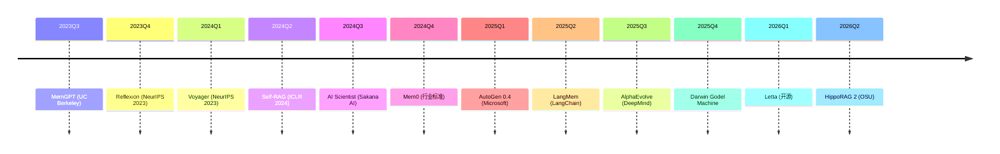

# P14 Agent 记忆与自进化专题 · 讲解稿

> **章节定位**: Ch23 §07 后补丁专题。系统化 Agent 记忆架构 + 自进化范式。
> **承接**: Ch23 §01-§07 Agent 基础 → P14 深度专题
> **篇幅**: ~6200 字 / 阅读 17 分钟 / 讲解 30 分钟

---

## 一 · 一句话总览

> **Agent 记忆 + 自进化 = LLM Agent 的"灵魂"**。记忆让 Agent 跨对话连续, 自进化让 Agent 不需要每条规则手写。5 大记忆架构 + 5 大自进化范式构成 2024-2026 最前沿。

---

## 二 · 心智模型

把 Agent 想象成"人":
- **短期记忆**: 当前对话 (Stack / Redis)
- **长期记忆**: 终身经验 (向量库 + 图)
- **情节记忆**: 特定事件 (时间序列)
- **语义记忆**: 知识 (RAG)
- **程序记忆**: 技能 (Voyager 风格技能库)

**自进化**: Agent 不用每次重新训练, 通过"反思→记录→复用"循环自我提升。

---

## 三 · 章节主线 (5 段)

### 第 1 段 · Agent 记忆架构 (10 分钟)

#### 3.1.1 5 大记忆类型

| 类型 | 含义 | 存储 | 容量 | 生命周期 |
|------|------|------|------|----------|
| **短期记忆** | 当前对话 | Stack / Redis | KB-MB | 会话 |
| **长期记忆** | 经验 / 偏好 | 向量 DB + 图 | GB-TB | 永久 |
| **情节记忆** | 事件序列 | 时序 DB | MB-GB | 永久 |
| **语义记忆** | 知识 | RAG + KG | TB | 永久 |
| **程序记忆** | 技能 | Code | MB | 永久 |

#### 3.1.2 记忆分层架构

```
┌─────────────────────────────────────┐
│  Episodic (情节)   │  Semantic (语义) │
│  - 时间序列        │  - RAG / KG      │
├─────────────────────┼─────────────────┤
│  Procedural (技能) │ Working (短期)   │
│  - 代码 / 工具      │  - Stack / Redis │
└─────────────────────────────────────┘
              ↓
┌─────────────────────────────────────┐
│         Long-term Memory             │
│    - 向量库 (Milvus / Qdrant)        │
│    - 时序 DB (TimescaleDB)          │
│    - 图 (Neo4j)                     │
└─────────────────────────────────────┘
```

#### 3.1.3 主流记忆框架

| 框架 | 厂商 | 特色 |
|------|------|------|
| **Mem0** | Mem0 Labs | 通用 LLM 记忆 |
| **Letta** | Letta | 长期 + 短期 |
| **MemGPT** | UC Berkeley | 虚拟上下文 |
| **LangMem** | LangChain | 长期记忆 |
| **Cognee** | Cognee | 知识图谱 |
| **Zep** | Zep | 长期记忆 SDK |
| **Cognee** | 开源 | KG + Vector |
| **HippoRAG** | OSU 2024 | 类海马体 RAG |

#### 3.1.4 Mem0 (2024 行业标准)

```python
from mem0 import Memory

m = Memory()

# 1. 添加记忆
m.add("用户喜欢用 Rust 写代码", user_id="alice")

# 2. 检索
relevant = m.search("alice 喜欢什么语言", user_id="alice")
# 返回: ["用户喜欢用 Rust 写代码"]

# 3. 提取 + 去重 + 总结
m.add("alice 今天学了 Python", user_id="alice")
# 自动合并到 "alice 喜欢 Rust 和 Python"
```

**Mem0 核心算法**:
- **Extract**: LLM 提取关键事实
- **Deduplicate**: 向量相似度去重
- **Update**: 更新已有记忆
- **Forget**: 衰减陈旧记忆

#### 3.1.5 MemGPT (UC Berkeley, 2023)

**核心思想**: 借鉴 OS 虚拟内存, Agent 内存分**主存 + 虚存**。

```
主存 (Context Window)  <--  虚存 (无限外部存储)
    ↑                              ↑
  Recall                Archival
  (检索最近)              (检索历史)
```

**机制**:
- **Recall**: 滑动窗口 + 检索
- **Archival**: 永久存储 + 检索
- **Core**: 关键信息保留

#### 3.1.6 HippoRAG (OSU NeurIPS 2024)

**类海马体索引**:
- 模仿人脑海马体索引理论
- RAG + KG + PageRank
- 比传统 RAG 准确率 +20%

```python
from hipporag import HippoRAG

hrag = HippoRAG()
hrag.index(docs)
result = hrag.retrieve("xxx 的核心观点")
```

### 第 2 段 · 长短期记忆工程 (8 分钟)

#### 3.2.1 短期记忆 (工作记忆)

**实现**:
```python
class ShortTermMemory:
    def __init__(self, max_tokens=8000):
        self.messages = []
        self.max_tokens = max_tokens

    def add(self, msg):
        self.messages.append(msg)
        self._trim()

    def _trim(self):
        # 保留 system + 摘要
        while self.token_count() > self.max_tokens:
            self.messages.pop(1)  # 移除最早对话
```

**模型**:
- 滑动窗口 (Mistral)
- Sliding Window Attention
- 摘要压缩 (Anthropic)

#### 3.2.2 长期记忆存储

**实现**:
```python
class LongTermMemory:
    def __init__(self, embedding_model="openai"):
        self.vector_db = Milvus()
        self.embedder = Embedder(embedding_model)

    def store(self, event):
        embedding = self.embedder.embed(event.text)
        self.vector_db.insert(embedding, event)

    def retrieve(self, query, top_k=5):
        query_emb = self.embedder.embed(query)
        return self.vector_db.search(query_emb, top_k)
```

**存储介质**:
- 向量 DB (Milvus, Qdrant, Weaviate)
- 知识图谱 (Neo4j, MemGraph)
- 时序 DB (TimescaleDB, InfluxDB)

#### 3.2.3 记忆分层缓存

**L1 → L2 → L3 → L4 内存**:
- L1: 短期 (Stack)
- L2: 中期 (Redis, 1-7 天)
- L3: 长期 (向量 DB)
- L4: 永久 (对象存储)

#### 3.2.4 记忆遗忘机制

**衰减策略**:
- **时间衰减**: 越老越容易忘
- **频率衰减**: 越少用越容易忘
- **重要性**: 关键事件不遗忘

**算法**:
```python
def forget_score(memory, current_time):
    age = current_time - memory.created_at
    last_used = current_time - memory.last_used
    importance = memory.importance

    # 衰减 = 年龄 × 频率 × 重要性
    return (age ** 0.5) * (last_used ** 0.5) / (importance + 1)
```

### 第 3 段 · 自进化 5 大范式 (12 分钟)

#### 3.3.1 Reflexion (NeurIPS 2023)

**核心思想**: Agent 在多次尝试中**反思 + 长期反思**。

```
尝试 → 失败 → 反思 "我哪里错了" → 长期记忆 → 再次尝试
```

**3 个组件**:
- **Actor**: 执行任务
- **Evaluator**: 评估结果
- **Self-Reflection**: 生成反思文本

```python
class Reflexion:
    def __init__(self):
        self.memory = []

    def act(self, task):
        for attempt in range(3):
            result = self.actor(task)
            score = self.evaluator(result)
            if score > 0.8:
                return result
            reflection = self.reflector(result, score)
            self.memory.append(reflection)
        return self.actor(task, context=self.memory)
```

#### 3.3.2 Voyager (NeurIPS 2023)

**Minecraft 终身学习 Agent**:
- **技能库**: 30+ 技能, 描述 + JS 代码
- **迭代提示**: 写入"成功经验"
- **自动课程**: 难度递进

**核心**: **技能积累 = 反复成功 = 自我提升**

**数据**:
- 200 步持续学习
- 3.3× 独特物品

#### 3.3.3 Self-RAG (ICLR 2024)

**核心**: LLM 决定**何时需要检索**。

```python
class SelfRAG:
    def answer(self, query):
        # 1. LLM 决定是否检索
        if self.should_retrieve(query):
            docs = self.retrieve(query)
        # 2. 生成 + 自我评估
        answer = self.generate(query, docs)
        if self.is_supported(answer, docs):
            return answer
        else:
            # 3. 重新生成
            return self.regenerate(query, docs)
```

**关键创新**:
- **Retrieve Token**: 决定是否需要 RAG
- **IsRel Token**: 检索结果是否相关
- **IsSup Token**: 生成是否支持
- **IsUse Token**: 是否有用

#### 3.3.4 Constitutional AI 自我迭代 (Anthropic)

**2 阶段**:
1. **RLAIF**: 模型根据宪法自我评估 + 修正
2. **RLHF**: 人类反馈精调

**20 条宪法** (Anthropic 2025 扩展):
- 不有害
- 不偏见
- 真实
- 有益
- 私密
- ...

#### 3.3.5 AlphaEvolve (DeepMind 2025)

**核心**: AI 自动改进算法 (self-improvement of algorithms)。

**机制**:
1. LLM 提出算法变体
2. 评估器 (慢但精确)
3. 选择最优
4. 迭代

**成果**:
- 改进了 Gemini 训练速度 +1%
- 发现矩阵乘法新算法
- 解决开源数学问题 50%

#### 3.3.6 Darwin Godel Machine (2025)

**核心思想**: AGI 自进化架构。

**机制**:
- 模型可以**修改自己的代码**
- 通过安全测试验证
- 持续自我改进

**意义**: 迈向真正自进化 AGI。

#### 3.3.7 AI Scientist (Sakana AI 2024)

**核心**: AI 自动做科研。

```python
class AIScientist:
    def research(self, idea):
        # 1. 文献调研
        papers = self.literature.search(idea)
        # 2. 实验设计
        hypotheses = self.hypothesize(papers)
        # 3. 实验
        results = self.experiment(hypotheses)
        # 4. 写作
        paper = self.write(results)
        # 5. 反思
        next_idea = self.reflect(paper)
        return next_idea
```

**首篇 AI 论文**: Sakana AI 自动写 ICLR 论文。

### 第 4 段 · 自进化评估与挑战 (8 分钟)

#### 3.4.1 评估指标

| 指标 | 含义 | 评估 |
|------|------|------|
| **任务成功率** | 任务完成率 | 0-100% |
| **学习曲线** | 任务成功率随时间 | 增长曲线 |
| **泛化能力** | 没见过任务的性能 | 测试集 |
| **效率** | 任务耗时 / 资源 | vs 人类 |
| **创新性** | 解决方案新颖度 | 专家评估 |

#### 3.4.2 5 大挑战

1. **长跨度规划**: 1000 步任务成功率 0.6%
2. **跨 Agent 记忆**: 共享 / 权限 / 冲突
3. **多模态融合**: 图像 + 文本 + 视频
4. **成本效率**: 每次反思 = 1 次 LLM 调用
5. **无监督自主学习**: 真正的 AGI 起点

#### 3.4.3 安全风险

- **失控**: 自进化 Agent 超出人类控制
- **奖励黑客**: 钻系统漏洞
- **数据中毒**: 训练数据被污染
- **社会风险**: 失业 + 武器化

### 第 5 段 · 实战案例 + 工具链 (8 分钟)

#### 3.5.1 案例 1: Mem0 智能助手

```python
from mem0 import Memory

# 1. 创建
m = Memory()

# 2. 持续学习
m.add("alice 喜欢咖啡", user_id="alice")
m.add("alice 经常加班到 10 点", user_id="alice")
m.add("alice 在北京工作", user_id="alice")

# 3. 智能检索
context = m.search("alice 的工作习惯", user_id="alice")
# 返回: ["alice 经常加班到 10 点", "alice 在北京工作"]

# 4. LLM 生成
response = llm.invoke(f"基于 {context} 推荐")
```

#### 3.5.2 案例 2: Voyager Minecraft Agent

```python
from voyager import Voyager

agent = Voyager(
    mc_port=25565,
    llm="gpt-4",
    skills_dir="./skills",
)

# 持续学习
for episode in range(100):
    task = agent.curriculum.next_task()
    result = agent.learn(task)
    if result.success:
        agent.skills.save(result.skill)
```

#### 3.5.3 案例 3: Self-RAG 客服

```python
class SelfRAGSupport:
    def answer(self, question):
        # 1. 决定是否检索
        if self.should_retrieve(question):
            docs = self.kb.search(question)
        # 2. 生成
        answer = self.llm.generate(question, docs)
        # 3. 自我评估
        if not self.is_supported(answer, docs):
            answer = self.regenerate(question, docs)
        return answer
```

#### 3.5.4 工具链矩阵

| 工具 | 用途 | 厂商 |
|------|------|------|
| **Mem0** | 通用记忆 | 开源 |
| **Letta** | 长期记忆 | 开源 |
| **MemGPT** | 虚拟内存 | UC Berkeley |
| **LangMem** | LangChain | LangChain |
| **HippoRAG** | 类海马体 | OSU |
| **Cognee** | 知识图谱 | 开源 |
| **Zep** | 长期记忆 | 开源 |
| **AutoGen** | 多 Agent | Microsoft |
| **CrewAI** | 协作 | CrewAI |
| **LangGraph** | 状态图 | LangChain |

#### 3.5.5 5 大记忆架构选型

| 场景 | 推荐 |
|------|------|
| **客服** | Mem0 + Zep |
| **编程** | LangMem + Letta |
| **科研** | HippoRAG + Cognee |
| **多 Agent** | LangGraph + AutoGen |
| **游戏** | Voyager (GitHub) |

---

## 四 · 2024-2026 时间线



---

## 五 · 关键论文索引

| 论文 | 会议 | 出品 |
|------|------|------|
| **Reflexion** | NeurIPS 2023 | Shinn et al. |
| **Voyager** | NeurIPS 2023 | NVIDIA + UT Austin |
| **Self-RAG** | ICLR 2024 | Asai et al. |
| **Constitutional AI** | 2022 | Anthropic |
| **AI Scientist** | 2024 | Sakana AI |
| **AlphaEvolve** | 2025 | DeepMind |
| **MemGPT** | 2023 | UC Berkeley |
| **HippoRAG** | NeurIPS 2024 | OSU |
| **Darwin Godel Machine** | 2025 | ? |
| **JARVIS-1** | 2023 | PKU + BUAA |

---

## 六 · 易错点 (5 条)

1. **记忆 ≠ 上下文**: 记忆是**外部存储**, 上下文是 **in-context**
2. **自进化 ≠ 自动训练**: 是**在部署中持续学习**
3. **Reflexion 是反思**, 不是"重新 prompt"
4. **Voyager 是 Minecraft 实验**, 不是通用 Agent
5. **AGI 自进化 ≠ Darwin Godel Machine**: 前者是概念, 后者是具体架构

---

## 七 · 跨章连接

| 章节 | 关联 |
|------|------|
| Ch06 §05 RL | 自进化基础 |
| Ch17 §02 | 记忆缓存 |
| Ch23 §01-07 | Agent 上下文 |
| Ch22 §05 | LLM-as-Judge (自评) |
| Ch19 §04 | Agent 应用 |

---

## 八 · 自测 5 题

1. 5 大记忆类型?
2. MemGPT 核心思想?
3. Reflexion 3 组件?
4. Voyager 3 创新?
5. AlphaEvolve 解决什么?

---

## 九 · 一句话总结

> **Agent 记忆 + 自进化是 LLM Agent 工业化的最后两块拼图**。Mem0 / Letta / MemGPT + Reflexion / Voyager / Self-RAG / AlphaEvolve 共同让 Agent 从"tool 用尽"变为"持续学习"。**LLM + Agent 记忆 + 自进化 = 现代 AI 助理**。

---

## 十 · 板书建议

```
[板书 1: 5 大记忆]
   短期 / 长期 / 情节 / 语义 / 程序
   5 层架构

[板书 2: Mem0]
   Extract + Dedupe + Update + Forget
   算法 4 步

[板书 3: Reflexion]
   Actor + Evaluator + Reflector
   3 组件

[板书 4: Voyager / RAG]
   技能库 + Auto-Curriculum
   终身学习

[板书 5: 进化范式]
   RAG / Voyager / Self-RAG / CAI / AlphaEvolve
   5 大范式
```

---

## 十一 · 参考资料

1. Shinn et al., "Reflexion", NeurIPS 2023
2. Wang et al., "Voyager", NeurIPS 2023
3. Asai et al., "Self-RAG", ICLR 2024
4. Packer et al., "MemGPT", 2023
5. Gutiérrez et al., "HippoRAG", NeurIPS 2024
6. Sakana AI, "AI Scientist", 2024
7. DeepMind, "AlphaEvolve", 2025
8. Anthropic, "Constitutional AI", 2022
9. mem0, "Mem0 Architecture", 2024
10. Letta, "Long-term Memory", 2025
