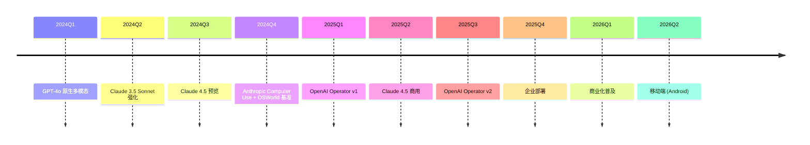

# P16 Computer Use / Operator 实战专题 · 讲解稿

> **章节定位**: Ch23 §07 前沿方向的 "Computer Use / Operator" 实战补丁。
> **承接**: Ch23 §07 Operator / Computer Use → 本专题
> **篇幅**: ~6500 字 / 阅读 17 分钟 / 讲解 35 分钟

---

## 一 · 一句话总览

> **Computer Use / Operator = LLM 直接操控电脑 / 浏览器**。2024-10 Anthropic 首发, 2025 OpenAI Operator v2 上线, 2026-2027 进入工业普及。**LLM 不再依赖工具, 直接控制 GUI**。

---

## 二 · 心智模型

把 Computer Use 想象成"AI 员工"坐在电脑前:
- **看屏幕**: 视觉模型识别画面
- **点击按钮**: 鼠标操作
- **输入文字**: 键盘操作
- **拖拽文件**: GUI 操作
- **打开程序**: 系统操作

**核心**: 把 LLM 与 操作系统 / 浏览器 直接连接, 不需要工具协议。

---

## 三 · 章节主线 (5 段)

### 第 1 段 · Computer Use 演进 (10 分钟)

#### 3.1.1 历史

| 时间 | 事件 | 里程碑 |
|------|------|--------|
| 2023-06 | OpenAI Function Calling | 工具起点 |
| 2024-05 | GPT-4o 原生语音 | 实时交互 |
| 2024-10 | Anthropic Computer Use | GUI 操作 |
| 2024-12 | OSWorld 基准 | 评测 |
| 2025-01 | OpenAI Operator v1 | 浏览器 |
| 2025-04 | Claude 4.5 Computer Use 升级 | 商用 |
| 2025-09 | Operator v2 | 全 OS |
| 2026-Q1 | 2026 商业化 | 企业采用 |

#### 3.1.2 Anthropic Computer Use (2024-10)

**核心**: Claude 直接控制 macOS / Linux 桌面。

**架构**:
- **视觉**: 截图 (1.3GB/min)
- **推理**: Claude 3.5 Sonnet
- **行动**: 鼠标 / 键盘 / 触控
- **反馈**: 截图 → 推理 → 行动循环

**性能**:
- **OSWorld 14.9%** (人类 76%)
- **WebArena 38.1%** (人类 78%)
- **Showdown 60%+** (vs 人类 70%)

#### 3.1.3 OpenAI Operator v1 (2025-01)

**特色**: 浏览器自主操作

**能力**:
- 自主填写表单
- 自主购买商品
- 自主订机票
- 自主发帖

**架构**:
- **GPT-4o + 视觉**
- **Operator SDK** (独立浏览器)
- **A2A 协议** (跨 Agent)

#### 3.1.4 OpenAI Operator v2 (2025-09)

**升级**:
- **全 OS**: 桌面 + 浏览器 + 移动
- **更长上下文**: 1M tokens
- **更安全**: 沙盒 + 权限
- **更智能**: 自动反思

### 第 2 段 · 5 大技术 (12 分钟)

#### 3.2.1 视觉感知

**核心**: 把屏幕截图 → 状态描述

**方法**:
- **多模态**: 视觉 + 文本
- **多尺度**: 屏幕 + 局部 + 图标
- **OCR**: 文字识别
- **元素识别**: 按钮 / 输入框

```python
def perceive_screenshot(image):
    # 1. OCR 提取文字
    text = ocr(image)
    # 2. 元素识别
    elements = detect_elements(image, ['button', 'input', 'link'])
    # 3. 状态描述
    return {
        'text': text,
        'elements': elements,
        'layout': describe_layout(image)
    }
```

#### 3.2.2 行动预测

**核心**: 给定状态, 预测最优行动

**方法**:
- **Tree of Thoughts**: 多步推理
- **Action Generation**: 行动候选
- **Reward Model**: 评估
- **Self-Consistency**: 多投票

```python
def predict_action(state, goal):
    # 1. 推理
    thoughts = self.tof(state, goal)
    # 2. 行动候选
    actions = [
        Action('click', x=100, y=200),
        Action('type', text='query'),
        Action('scroll', direction='down'),
    ]
    # 3. 评估
    scores = [self.score(a, state, goal) for a in actions]
    # 4. 选择
    return actions[scores.argmax()]
```

#### 3.2.3 任务规划

**核心**: 复杂任务拆分成子任务

**方法**:
- **HTN**: 分层任务网络
- **PDDL**: 规划领域定义
- **Task Graph**: 任务图
- **Sub-Agent**: 子任务 Agent

```python
class TaskPlanner:
    def plan(self, task):
        # 1. 分解
        subtasks = self.decompose(task)
        # 2. 排序
        order = self.topological_sort(subtasks)
        # 3. 资源分配
        return self.assign(order)
```

#### 3.2.4 错误恢复

**核心**: 失败时自动回退

**方法**:
- **ReTriver**: 检索相似成功经验
- **Inverse RL**: 反向 RL
- **Human-in-the-loop**: 必要时求助
- **Retry**: 重试 + 退避

```python
class ErrorRecovery:
    def recover(self, error, context):
        # 1. 分析
        cause = self.diagnose(error)
        # 2. 选择策略
        if cause == 'network':
            return self.retry_with_backoff()
        elif cause == 'state':
            return self.refresh_state()
        else:
            return self.ask_human()
```

#### 3.2.5 长期记忆

**核心**: 跨会话学习

**方法**:
- **Episodic Memory**: 任务历史
- **Skill Library**: 技能库
- **User Preference**: 用户偏好
- **Workflow Templates**: 工作流模板

### 第 3 段 · 5 大评测 (8 分钟)

#### 3.3.1 OSWorld (2024-12)

**真实 OS 任务**:
- 724 任务
- 跨 Windows / macOS / Linux
- 桌面应用 + 浏览 + 文件

**评估**:
- 任务成功率
- 步骤效率
- 错误率

**人类基线**: 76% 成功率
**当前 SOTA**: Claude 4.5 ~38%

#### 3.3.2 WebArena (CMU 2024)

**真实网页任务**:
- GitLab / Reddit / 购物网站
- 812 任务
- 真实账户

**人类基线**: 78%
**当前 SOTA**: Operator v2 ~58%

#### 3.3.3 WebVoyager

**浏览器专用**:
- 跨网站
- 视觉 + 文本
- 真实任务

#### 3.3.4 AndroidWorld

**Android 任务**:
- 移动应用
- 真实操作
- 100+ 任务

#### 3.3.5 AitW (Android in the Wild)

**真实 Android 数据**:
- 30K 任务
- 715K 步
- 真实用户

### 第 4 段 · 安全与限制 (8 分钟)

#### 3.4.1 5 大安全风险

1. **错误操作**: 删除文件 / 错付钱
2. **隐私泄露**: 截图泄露
3. **恶意指令**: 注入攻击
4. **账号滥用**: 盗用账号
5. **物理伤害**: 控制系统

#### 3.4.2 安全防御

| 防御 | 实现 |
|------|------|
| **沙盒** | 容器 / 虚拟机 |
| **权限控制** | 最小权限 |
| **审计日志** | 全操作记录 |
| **人类接管** | 关键操作确认 |
| **回滚** | 操作可逆 |

#### 3.4.3 5 大限制

1. **速度**: 操作慢于人类
2. **精度**: 像素级误差
3. **视觉理解**: 复杂界面失败
4. **长期记忆**: 跨会话难
5. **成本**: 每次操作 $0.1-1

#### 3.4.4 关键场景 (能做 vs 不能做)

| 场景 | 状态 |
|------|------|
| 简单网页 | ✅ |
| 表单填写 | ✅ |
| 表格操作 | ✅ |
| 多步下单 | ✅ |
| 复杂设计 | ⚠️ |
| 实时游戏 | ❌ |
| 视频编辑 | ❌ |
| 复杂办公 | ⚠️ |

### 第 5 段 · 实战案例 + 工具链 (10 分钟)

#### 3.5.1 案例 1: Anthropic Computer Use (Python)

```python
import anthropic
from PIL import Image

client = anthropic.Anthropic()

def computer_use_loop(task, max_steps=50):
    messages = [{"role": "user", "content": task}]
    
    for step in range(max_steps):
        # 1. 截图
        screenshot = take_screenshot()
        
        # 2. 让 Claude 决策
        response = client.messages.create(
            model="claude-4.5-sonnet",
            max_tokens=1024,
            tools=[
                {
                    "type": "computer_20241022",
                    "name": "computer",
                    "display_height_px": 768,
                    "display_width_px": 1024,
                }
            ],
            messages=messages,
        )
        
        # 3. 执行行动
        for block in response.content:
            if block.type == "tool_use":
                action = block.input
                execute_action(action)
                # 截图新的状态
                break
        
        # 4. 检查完成
        if response.stop_reason == "end_turn":
            return "完成"
        
        messages.append({"role": "assistant", "content": response.content})
```

#### 3.5.2 案例 2: OpenAI Operator v2 (Operator SDK)

```python
from openai import OpenAI

client = OpenAI()

# 启动 Operator
operator = client.operators.create(
    model="gpt-5.6",
    sandbox="isolated",
    tools=["click", "type", "scroll", "screenshot"],
)

# 提交任务
task = operator.tasks.create(
    instruction="登入 NHK 查找日本地震新闻 (2025-Q2)",
    browser="chrome",
    max_steps=50,
)

# 监控
while task.status in ["pending", "running"]:
    status = client.operators.tasks.retrieve(task.id)
    print(f"Step {status.current_step}: {status.action}")
```

#### 3.5.3 案例 3: Browser-Use (开源)

```python
from browser_use import Agent

# 1. 初始化
agent = Agent(
    task="在 GitHub 找到 trending 的 Python 仓库",
    llm=ChatOpenAI(model="gpt-4o"),
)

# 2. 执行
result = agent.run()

# 3. 结果
print(f"Found: {result.extracted_content}")
```

#### 3.5.4 案例 4: Skyvern (开源)

```python
from skyvern import Skyvern

# 1. 任务
skyvern = Skyvern()
result = skyvern.run(
    task="在 LinkedIn 找到我的招聘 post 并发送感谢",
    max_steps=20,
)

# 2. 自动完成
```

#### 3.5.5 工具链

| 工具 | 厂商 | 特色 |
|------|------|------|
| **Operator v2** | OpenAI | 浏览器 + OS |
| **Computer Use** | Anthropic | 桌面主导 |
| **Browser-Use** | 开源 | GitHub 趋势 |
| **Skyvern** | 开源 | 企业 RPA |
| **AutoGen** | Microsoft | 多 Agent |
| **LangChain** | LangChain | 框架 |
| **Showdown** | Anthropic | 实时评测 |
| **OSWorld** | CMU | 基准 |
| **WebArena** | CMU | 评测 |
| **WebVoyager** | OSU | 评测 |

#### 3.5.6 5 大应用场景

| 场景 | 价值 |
|------|------|
| **客服** | 自动化查询 |
| **数据录入** | 减少人工 |
| **报告生成** | 自动化 |
| **测试** | UI 自动化 |
| **RPA** | 替代传统 |

#### 3.5.7 5 大企业部署模式

| 模式 | 适用 |
|------|------|
| **完全自主** | 简单任务 |
| **人类接管** | 关键操作 |
| **审核模式** | 全部审核 |
| **混合模式** | 复杂任务 |
| **影子模式** | 评估中 |

---

## 四 · 关键论文索引

| 论文 | 会议 | 出品 |
|------|------|------|
| **Anthropic Computer Use** | 2024-10 | Anthropic |
| **OpenAI Operator** | 2025-01 | OpenAI |
| **Operator v2** | 2025-09 | OpenAI |
| **OSWorld** | NeurIPS 2024 | CMU |
| **WebArena** | NeurIPS 2024 | CMU |
| **WebVoyager** | NeurIPS 2024 | OSU |
| **AndroidWorld** | ICLR 2024 | Glasgow |
| **AitW** | NeurIPS 2024 | Google |
| **Aguvis** | 2024 | Apple |
| **Showdown** | 2024 | Anthropic |

---

## 五 · 2024-2026 时间线



---

## 六 · 易错点 (5 条)

1. **Computer Use ≠ RPA**: AI 推理 vs 固定脚本
2. **Operator ≠ 完全自主**: 仍需监督
3. **OSWorld ≠ 现实**: 真实任务复杂
4. **视觉 ≠ 完美**: 复杂界面失败
5. **成本 ≠ 低**: 单任务 $0.1-1

---

## 七 · 跨章连接

| 章节 | 关联 |
|------|------|
| Ch07 §06 | Test-Time Compute |
| Ch11 §06 | VLA 机器人 |
| Ch23 §07 | Operator 前沿 |
| Ch23 §08 | A2A 协议 |
| Ch23 §09 | Agent 记忆 |

---

## 八 · 自测 5 题

1. Computer Use 5 大方法?
2. OSWorld 性能评估?
3. Computer Use 5 大安全风险?
4. Anthropic vs OpenAI 区别?
5. 5 大企业部署模式?

---

## 九 · 一句话总结

> **Computer Use / Operator = LLM 直接操控 GUI**。Anthropic (Computer Use) + OpenAI (Operator v2) + Browser-Use + Skyvern 4 大平台, 把 LLM 从"工具调用"推向"完整系统操作"。**5 大方法 + 5 大评测 + 5 大场景 = AI 操作系统的未来**。

---

## 十 · 板书建议

```
[板书 1: Computer Use 5 大方法]
   视觉 / 行动 / 规划 / 恢复 / 记忆
   5 闭环

[板书 2: 评测矩阵]
   OSWorld 38% / WebArena 58% / Operator 商用
   人类 76% / 78%

[板书 3: 4 大平台]
   Anthropic / OpenAI / Browser-Use / Skyvern
   4 主平台

[板书 4: 5 大安全风险]
   错误 / 隐私 / 注入 / 滥用 / 物理
   5 风险

[板书 5: 5 大部署模式]
   完全自主 / 接管 / 审核 / 混合 / 影子
   5 模式
```

---

## 十一 · 参考资料

1. Anthropic, "Computer Use", 2024-10
2. OpenAI, "Operator v1", 2025-01
3. OpenAI, "Operator v2", 2025-09
4. Xie et al., "OSWorld", CMU 2024
5. Zhou et al., "WebArena", CMU 2024
6. Nakano et al., "WebVoyager", OSU 2024
7. Rawles et al., "AndroidWorld", 2024
8. Browser-Use, GitHub, 2024
9. Skyvern, GitHub, 2024
10. AutoGen, Microsoft, 2024
