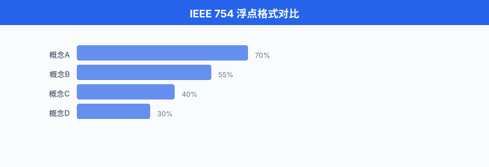
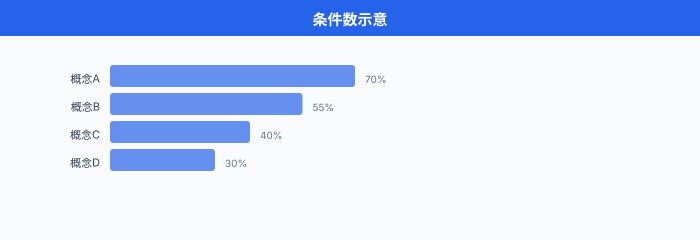

# 浮点与数值稳定性

> **一句话总结**：计算机里没有实数，只有近似的浮点数；每一次矩阵乘法都在悄悄丢有效数字，而条件数、稳定性和 mixed precision 就是我们与这层近似打交道的语言。

## 🗺️ 本章导览

- 本章覆盖数值分析与凸优化，是对第 03 章优化的深度补遗
- **01. 浮点与数值稳定性** (本节): IEEE 754、条件数、灾难性抵消、DL 数值实战
- **02. 迭代法与稀疏线代**: CG、GMRES、Krylov 子空间、稀疏矩阵存储
- **03. 凸集与凸函数**：凸性判定、保凸运算、强凸性、Lipschitz
- **04. 对偶与 KKT**：拉格朗日对偶、KKT 条件、SVM 对偶
- **05. 二阶方法**: Newton、BFGS/L-BFGS、K-FAC、Shampoo
- **06. 内点法与约束优化**：障碍法、primal-dual、CVXPY 实战
- **07. 分布式与随机优化**: SGD variants、ZeRO、adaptive method 收敛性

*把训练过程想成一场跨国长途接力赛。 每一次矩阵乘法是一次交棒，每一次交棒都有一层薄薄的"擦伤" —— 有效数字被磨掉一点点。 单看一次微不足道，累计几十亿次就可能让 loss 直接爆成 NaN. 这一节讲的就是这层擦伤到底长什么样，什么时候能忽略，什么时候会要命.*

- 假设你写了一个看起来毫无破绽的 Python 表达式：`0.1 + 0.2`. 你期待得到 `0.3`，但 Python 会告诉你 `0.30000000000000004`. 这不是解释器 bug，是**浮点数 (floating-point)** 的宿命。 计算机的内存是有限位数的，而 $\tfrac{1}{10}$ 在二进制下是无限循环小数 —— 一如 $\tfrac{1}{3}$ 在十进制里是 $0.333\ldots$

- 这种"看不见的近似"藏在你写的每一行数值代码里。 大部分时候它无关紧要，但在**大规模训练、病态矩阵、深度网络梯度累积**这三个场景，它会突然从背景音跳出来变成主角。 从 ResNet 训练梯度爆炸到 LLM 用 BF16 而不敢用 FP16，每一次工程决策背后都是数值稳定性问题。

- 更宽的一句话：**数值分析研究的是"用有限精度算连续数学"这件事本身**. 从 1947 年 Turing 的 rounding error 论文，到 1963 年 Wilkinson 的 backward error analysis，到 1985 年 IEEE 754 落地，再到 2018 年 mixed precision training 与 2022 年 FP8，这门学科每一次进化都是被硬件与工程需求推着走。 本节的目标是让你既能读懂 Higham 的经典教材，也能看懂 PyTorch AMP 的源码。

## IEEE 754：浮点数的通用语言

- 现代硬件几乎全部遵循 **IEEE 754** 标准 (最新版本是 IEEE 754-2019). 它规定了浮点数在内存里的比特布局、舍入规则、特殊值 (Inf / NaN) 的语义。 没有这个标准，你在 Nvidia GPU 上跑的模型换到 AMD 或 CPU 上，结果都可能对不上。

- 一个浮点数由三段比特组成:

$$x = (-1)^s \times 2^{e - \text{bias}} \times (1.m_{22} m_{21} \cdots m_0)_2$$

- 这个式子在说：一个符号位 $s$ 决定正负；$e$ 是**阶码 (biased exponent)** —— 存储值减去 bias 得到真实指数；$m$ 是尾数，前面还有一个**隐含 1 位** (implicit leading 1)，也就是尾数默认是 $1.\text{xxx}$ 而不是 $0.\text{xxx}$. 这一位不占内存但省了一 bit 精度。

### 主流精度格式对照

| 格式 | 总位数 | 符号位 | 阶码位 | 尾数位 | Bias | 动态范围 | 有效精度 (十进制) |
|------|-------|-------|-------|-------|------|---------|----------------|
| FP64 (double) | 64 | 1 | 11 | 52 | 1023 | $\sim 10^{\pm 308}$ | 约 15-17 位 |
| FP32 (single) | 32 | 1 | 8 | 23 | 127 | $\sim 10^{\pm 38}$ | 约 6-9 位 |
| FP16 (half) | 16 | 1 | 5 | 10 | 15 | $\sim 6.55 \times 10^4$ | 约 3-4 位 |
| BF16 (bfloat16) | 16 | 1 | 8 | 7 | 127 | $\sim 10^{\pm 38}$ | 约 2-3 位 |
| FP8 E4M3 | 8 | 1 | 4 | 3 | 7 | $\sim \pm 448$ | 约 1-2 位 |
| FP8 E5M2 | 8 | 1 | 5 | 2 | 15 | $\sim \pm 5.7 \times 10^4$ | 约 1 位 |

- 注意到 **BF16 与 FP32 阶码位数相同**，都是 8 位。 这意味着 BF16 保留了 FP32 的**动态范围**，只是牺牲尾数精度。 谷歌为 TPU 设计 BF16 时就是这个意图：深度学习梯度的分布跨越十几个数量级，动态范围比小数点后几位重要得多。

- **FP8 有两种变体**: **E4M3** (4 位阶码，3 位尾数) 用于前向和权重，因为需要更高精度；**E5M2** (5 位阶码，2 位尾数) 用于梯度，因为梯度跨的量级更大。 Nvidia H100 的 Transformer Engine 就是围绕这两种 FP8 设计的。

- 除了正常数，浮点标准还定义了三类特殊值:
  - **零 (zero)**：阶码全 0，尾数全 0. 有 `+0` 和 `-0` 两个 —— 它们参与比较时 `+0 == -0` 为真，但 `1/(+0) = +inf` 而 `1/(-0) = -inf`. 大部分场景不用管，但涉及取导数时能踩坑。
  - **次正规数 (denormal / subnormal)**：阶码全 0，尾数非零。 这时**隐含位变成 0** 而不是 1，表示的数非常接近 0. 好处是让 0 附近有更平滑的表示 (gradual underflow)；坏处是许多硬件对 denormal 计算慢十几倍 (所以 GPU 上常见的 flush-to-zero, FTZ 模式，直接把 denormal 舍入为 0 换取速度).
  - **无穷 (infinity)**：阶码全 1，尾数全 0. 出现在溢出时，例如 $\text{FP16}$ 里 $10^5$. `Inf` 参与运算的规则：`Inf + 1 = Inf`, `Inf - Inf = NaN`, `0 * Inf = NaN`.
  - **非数 (NaN)**：阶码全 1，尾数非零。 出现在 $0/0$, $\infty - \infty$, $\sqrt{-1}$. NaN 有个恶心的性质：**NaN != NaN**，也就是自己不等于自己。 这是检测 NaN 的常用技巧 (`x != x` 判 NaN，或 PyTorch 的 `torch.isnan`).

- **动态范围与"表示上限"的直觉**: FP16 的最大正常数约 $6.55 \times 10^4$，意味着如果你的激活值达到 $10^5$ (未归一化时很常见)，就会溢出成 Inf，一路传染到 loss 变 NaN. 这就是 FP16 需要 BatchNorm / LayerNorm 强制把激活拉回小范围的原因；用 BF16 就没这个问题，因为它能表示到 $10^{38}$.



## 舍入误差：每次运算的隐形税

- 浮点数的集合是**离散的**：相邻两个能被精确表示的数之间，有一段"表示不了"的空档。 任何落入空档的实数，硬件都要**舍入 (round)** 到最近的可表示数。 IEEE 754 默认的舍入规则是 **round-to-nearest-even** (最近偶数舍入)，目的是消除长期累积的偏移。

- 定义 $\text{fl}(x)$ 为"把实数 $x$ 舍入到浮点表示" 的操作。 那么对任意基础运算 (加减乘除、开方) $\odot$，都有:

$$\text{fl}(x \odot y) = (x \odot y)(1 + \delta), \quad |\delta| \le u$$

- 这个式子读作：硬件算出的 $x \odot y$ 相对真值的相对误差被 $u$ 控制。 这里的 $u$ 叫 **单位舍入 (unit roundoff)**，它等于**机器精度 (machine epsilon)** 的一半:

$$u = \tfrac{1}{2} \epsilon_M = 2^{-(p+1)}$$

- 其中 $p$ 是尾数位数 (含隐含 1 位). 对 FP32, $p = 24$，因此 $u = 2^{-24} \approx 5.96 \times 10^{-8}$. 对 FP64, $u = 2^{-53} \approx 1.11 \times 10^{-16}$. **一次运算的相对误差不超过 $u$** —— 这是浮点算术的基本承诺。

- **机器精度 $\epsilon_M$** 的另一种直观定义：满足 $1 + \epsilon_M > 1$ 在浮点数里成立的最小正数。 比 $\epsilon_M$ 更小的加数，加到 1 上根本"看不见".

```python
# Python 里查机器精度
import numpy as np

print(np.finfo(np.float32).eps)   # 1.1920929e-07  (这是 ε_M, 不是 u)
print(np.finfo(np.float64).eps)   # 2.220446049250313e-16
print(np.finfo(np.float16).eps)   # 0.000977 (~10^-3, 只有 3 位十进制精度)

# 直接观察
x = np.float32(1.0)
eps = np.float32(1e-8)
print(x + eps == x)  # True! 1e-8 加到 1 上被吞掉

eps2 = np.float32(1e-7)
print(x + eps2 == x)  # False, 这个能看见
```

- 单次 $u$ 级的误差看起来微不足道，但**积累**起来能变得吓人。 一个经典结果 (Higham 2002 定理 3.1): $n$ 个浮点数求和，累计相对误差有上界

$$\left| \frac{\text{fl}(\sum x_i) - \sum x_i}{\sum x_i} \right| \le \frac{(n-1) u}{1 - (n-1) u} \approx n \cdot u$$

- 也就是"最坏情况下，累加 $n$ 次误差线性增长". 对 FP32 而言，$n = 10^7$ 次累加就能让相对误差达到 $10^{-1}$ 量级。 这就是为什么大模型训练用 **Kahan 补偿求和** 或者干脆用 FP64 做梯度累加。

## 灾难性抵消：大数减大数的陷阱

- **灾难性抵消 (catastrophic cancellation)** 是数值计算里最出名的坑之一。 当两个近似相等的**大数**相减，结果的**有效位数**会突然坍缩，因为高位全部抵消掉，只留下低位 —— 而低位本来就是舍入误差最集中的地方。

- 举个经典例子：计算 $f(x) = \sqrt{x^2 + 1} - x$ 当 $x$ 很大时。 数学上 $x \to \infty$ 时 $f(x) \to 0$，但**用哪种数值形式**决定了你能不能算出正确的 0.

```python
# catastrophic cancellation demo
import numpy as np

def naive(x):
    return np.sqrt(x**2 + 1.0) - x

def stable(x):
    # 恒等变形: 分子有理化
    return 1.0 / (np.sqrt(x**2 + 1.0) + x)

for x in [1e3, 1e6, 1e8, 1e10]:
    n = naive(np.float32(x))
    s = stable(np.float32(x))
    print(f"x={x:.0e}   naive={n:.6e}   stable={s:.6e}   diff={abs(n-s):.2e}")

# 输出 (FP32):
# x=1e+03   naive=4.882812e-04   stable=5.000000e-04   diff=1.17e-05
# x=1e+06   naive=0.000000e+00   stable=5.000000e-07   diff=5.00e-07
# x=1e+08   naive=0.000000e+00   stable=5.000000e-09   diff=5.00e-09
# x=1e+10   naive=0.000000e+00   stable=5.000000e-11   diff=5.00e-11
```

- 分析：当 $x = 10^6$ 时，$x^2 + 1 \approx 10^{12}$，加个 1 在 FP32 下**完全被吞掉** ($10^{12} \times u \approx 6 \times 10^4$，远大于 1). 于是 $\sqrt{x^2+1} = x$ 精确成立，相减为 0. 稳定形式则通过 $\sqrt{x^2+1} + x \approx 2x$ 直接得到 $1/(2x) = 5 \times 10^{-7}$，完全正确。

- 一般的抵消误差公式：若我们计算 $c = a - b$ 且 $a, b$ 大致同号同量级，相对误差被放大为

$$\frac{|\Delta c|}{|c|} \le \frac{|a| + |b|}{|a - b|} u$$

- 分母 $|a - b|$ 越小 (即抵消越严重)，相对误差被放大得越厉害。 这就是"catastrophic"的来源。

- **DL 里的经典抵消场景**:
  - Softmax 分母 $\sum e^{z_i}$，当 $z_i$ 都很大时溢出到 $\infty$；都很小时下溢到 0. 稳定 softmax 就是解这个。
  - 计算方差 $\text{Var}(X) = \mathbb{E}[X^2] - (\mathbb{E}[X])^2$ 的"教科书公式"是抵消陷阱，Welford's online algorithm 才是数值稳的写法。
  - 训练中 $L_{\text{new}} - L_{\text{old}}$ 用 float 存的话，到后期 loss 平坦，这个差可能低于机器精度直接判 0.
  - RoPE (rotary position embedding) 里的 $\cos\theta$, $\sin\theta$，当序列极长 (100k tokens) 时 $\theta$ 会累积到很大，若不用 double 精度算三角函数，位置编码在长上下文上会失真。
  - Layer Normalisation 计算 $(x - \mu)^2$ 求方差，当 $\mu \approx x$ 时也是抵消场景 (故 PyTorch 官方实现用 Welford).

## 条件数：问题本身有多"敏感"

- 有些数值问题，**不管你用多好的算法，只要输入有一点扰动，输出就大幅度变**. 这不是算法的错，是问题本身"病态". 衡量这种敏感度的指标就是**条件数 (condition number)**.

- 对线性系统 $Ax = b$，条件数定义为:

$$\kappa(A) = \|A\| \cdot \|A^{-1}\|$$

- 用 2-范数 (最常见) 时，$\kappa_2(A) = \sigma_{\max}(A) / \sigma_{\min}(A)$ —— 最大与最小奇异值之比。 $\kappa = 1$ 时 (正交矩阵) 问题最"好", $\kappa \to \infty$ 时问题"奇异"，完全不能解。

- 条件数直接控制误差放大比例。 若右端项 $b$ 有扰动 $\Delta b$，解的相对误差满足:

$$\frac{\|\Delta x\|}{\|x\|} \le \kappa(A) \cdot \frac{\|\Delta b\|}{\|b\|}$$

- 这个式子读作：输入相对误差乘以 $\kappa$ 就是输出相对误差的上界。 若 $\kappa(A) = 10^8$，而你的 $b$ 只有 FP32 精度 ($10^{-7}$)，那么解 $x$ 的相对误差最坏可能到 $10^1$ —— 也就是**每一位有效数字都没了**.

- **一个法则速记**：用 FP32 (约 7 位十进制精度) 解线性系统，若 $\kappa(A) \approx 10^k$，那么解**最多**有 $7 - k$ 位有效数字。 $k > 7$ 时，你算了个寂寞。

### Hilbert 矩阵：病态之王

- Hilbert 矩阵 $H_n$ 定义为 $(H_n)_{ij} = 1/(i + j - 1)$，是数值分析里的"坏矩阵"教科书例子:

$$H_5 = \begin{pmatrix} 1 & 1/2 & 1/3 & 1/4 & 1/5 \\ 1/2 & 1/3 & 1/4 & 1/5 & 1/6 \\ 1/3 & 1/4 & 1/5 & 1/6 & 1/7 \\ 1/4 & 1/5 & 1/6 & 1/7 & 1/8 \\ 1/5 & 1/6 & 1/7 & 1/8 & 1/9 \end{pmatrix}$$

- 它长得温良无害，但条件数增长得像火箭:

```python
import numpy as np
from scipy.linalg import hilbert

for n in [4, 6, 8, 10, 12]:
    H = hilbert(n)
    kappa = np.linalg.cond(H)
    print(f"n={n:2d}   κ(H_n) = {kappa:.3e}")

# 输出:
# n= 4   κ(H_n) = 1.551e+04
# n= 6   κ(H_n) = 1.495e+07
# n= 8   κ(H_n) = 1.526e+10
# n=10   κ(H_n) = 1.602e+13
# n=12   κ(H_n) = 1.728e+16   ← 超过 FP64 精度上限了
```

- $n = 12$ 时 $\kappa \approx 10^{16}$，已经超过 FP64 的 $u \approx 10^{-16}$ —— 意思是即使你用 double 精度存 $H_{12}$，输入自身的舍入误差就足以让求解结果**完全无意义**.

- **DL 语境**：神经网络的 Hessian 常常极度病态 ($\kappa \gg 10^{10}$)，这也是二阶方法 (Newton, K-FAC) 需要各种正则化和低秩近似的原因；单纯直接算 $H^{-1}$ 会数值崩塌。



## 前向稳定 vs 后向稳定

- 一个算法把输入 $x$ 变成输出 $\hat y$，而真实答案是 $y = f(x)$. 有两个不同的"稳定"概念。

- **前向误差 (forward error)**：直接看 $\|\hat y - y\|$ —— 算出来的 vs 真的差多远。 越小越好。

- **后向误差 (backward error)**：找一个"扰动的输入" $\tilde x$，使得 $\hat y = f(\tilde x)$ 精确成立，然后看 $\|\tilde x - x\|$ —— 我算出的结果，**精确对应**哪个稍微改动过的输入？越小越好。

- 用符号：若存在 $\tilde x$ 满足 $\hat y = f(\tilde x)$ 且

$$\frac{\|\tilde x - x\|}{\|x\|} = O(u)$$

- 则算法叫 **后向稳定 (backward stable)**. 这意味着"我们没算错这个问题的答案，只是不小心把问题**微微改变**了一点点".

- **关键联系** (Wilkinson 1963 的核心洞见):

$$\underbrace{\text{前向误差}}_{\|\hat y - y\|/\|y\|} \; \lesssim \; \underbrace{\text{条件数}}_{\kappa(f, x)} \times \underbrace{\text{后向误差}}_{\|\tilde x - x\|/\|x\|}$$

- 用大白话讲：**一个后向稳定的算法，若问题条件数好，前向精度就好；若问题病态，后向稳定也救不了你**. 条件数是"翻译系数"，把后向误差翻译成前向误差。

- 这个观念上的转换在数值分析里非常重要。 大部分现代算法 (LU 分解、QR 分解、Householder 反射、Cholesky) 都能证明**后向稳定**. 拿到一个后向稳定的求解器，我们的注意力就应该从"算法有没有 bug"转向"问题本身好不好"—— 也就是 $\kappa(A)$ 大不大。

- **反例警示**: **Gaussian elimination without pivoting** (不选主元的高斯消元) 不是后向稳定的；加上 partial pivoting 才是。 LAPACK 的 `dgesv` 用的就是 partial pivoting.

- **一个具体例子**：求解 $$
\begin{pmatrix} 10^{-20} & 1 \\ 1 & 1 \end{pmatrix} x = \begin{pmatrix} 1 \\ 2 \end{pmatrix}
$$. 不选主元时消元产生 $1 - 10^{20}$ 这样的抵消，结果崩坏；交换两行后 (选主元 = 把最大主元放到当前位置)，消元产生 $1 - 10^{-20} \approx 1$，后向误差恢复到 $O(u)$.

- **实用启示**:
  - 拿到一个奇怪的数值结果，先问"问题的 $\kappa$ 是多少?" 而不是"算法有没有 bug?"
  - Deep learning 里的 Hessian、协方差矩阵、Fisher information 都是常常极度病态的对象。 直接求逆几乎注定失败，要用正则化 (加 $\lambda I$) 或者迭代方法 (下一节讲).
  - PyTorch 的 `torch.linalg.solve` / `torch.linalg.lstsq` 都是后向稳定的；但如果你的 $A$ 病态，后向稳定救不了你，需要用 `torch.linalg.lstsq(A, b, rcond=...)` 或 `torch.linalg.pinv(A, rcond=...)`，在奇异值截断处引入 regularisation.

## 深度学习里的数值坑

### 稳定 Softmax：减去最大值

- 教科书的 softmax 定义:

$$\text{softmax}(z)_i = \frac{e^{z_i}}{\sum_{j=1}^n e^{z_j}}$$

- 直接实现在 $z_i$ 稍大时立刻爆炸。 FP32 里 $e^{89}$ 已经溢出成 Inf；而 LLM logits 常常达到 20-30. 稳定的写法是先减掉最大值:

$$\text{softmax}(z)_i = \frac{e^{z_i - m}}{\sum_j e^{z_j - m}}, \quad m = \max_j z_j$$

- 数学上恒等 (分子分母同乘 $e^{-m}$)，但数值上大不同 —— 减完最大值后，所有指数的输入都 $\le 0$, $e^{z_i - m} \in (0, 1]$ 永不溢出。

```python
import numpy as np

def softmax_naive(z):
    e = np.exp(z)
    return e / e.sum()

def softmax_stable(z):
    m = np.max(z)
    e = np.exp(z - m)
    return e / e.sum()

z = np.array([1000.0, 1001.0, 1002.0], dtype=np.float32)

print(softmax_naive(z))   # [nan nan nan]  (exp(1000) 溢出)
print(softmax_stable(z))  # [0.09003057 0.24472848 0.66524094]  正确
```

### LogSumExp：稳定形式的兄弟

- 计算 $\log \sum_i e^{z_i}$ 是很多概率模型的核心 (partition function、NLL loss、logits marginalisation). 直接算依然会溢出。 稳定形式:

$$\text{LSE}(z) = \log \sum_i e^{z_i} = m + \log \sum_i e^{z_i - m}, \quad m = \max_i z_i$$

- 这个恒等式在说：把最大项 $m$ 提出去，剩下的指数都 $\le 1$，求和值介于 1 和 $n$ 之间，取 log 时永远良好定义。

```python
def logsumexp(z):
    m = np.max(z)
    return m + np.log(np.sum(np.exp(z - m)))

z = np.array([1000.0, 1001.0, 1002.0])
print(logsumexp(z))  # 1002.4076   ← 正确
print(np.log(np.sum(np.exp(z))))  # inf  ← 溢出

# 交叉熵 loss 用 logsumexp 就是等价形式:
# CE = -z_target + logsumexp(z)
```

- PyTorch 里的 `F.cross_entropy` 内部就是 `logsumexp` + `nll_loss` 组合，从来不显式算 softmax. 这是"数值稳定"作为设计原则的胜利。

### 梯度消失与梯度爆炸

- 深层网络反向传播时，梯度按链式法则连乘：$\nabla_{W_1} L = \prod_{k=1}^{L} J_k \cdot \nabla_z L$. 若每一层 Jacobian $J_k$ 的谱半径 $\rho$ 略大于 1, $L = 100$ 层后 $\rho^L$ 直接爆炸到 $10^{20}$；略小于 1，则塌陷到 $10^{-20}$.

- 这在 FP32 里已经很危险，在 FP16 里更是随时 NaN. Residual connections (ResNet)、Layer Normalisation、精心的初始化 (Kaiming, Xavier) 都是为了让谱半径尽量接近 1. 从数值角度看，深度网络训练**本质上就是在与病态雅可比作斗争**.

- **常见排查手段**:
  - `torch.autograd.set_detect_anomaly(True)`：首个 NaN 出现的 op 会立刻抛异常，附带反向图定位，但比正常训练慢 5-10 倍，只在 debug 时开。
  - Gradient clipping (`torch.nn.utils.clip_grad_norm_`)：反向后按 L2 范数把梯度裁剪到某上限 (常见 1.0). 是对付爆炸最简单粗暴又有效的一招，几乎所有 LLM 训练配方里都有。
  - Warmup + cosine schedule：学习率初期从小到大爬升，避开训练最不稳定的阶段。 这是"用调度绕过 numerics 陡崖"的智慧。

- **关于加法的非结合性**：一个反直觉的事实是，浮点加法**不满足结合律**: $(a + b) + c \ne a + (b + c)$ 在浮点下常成立。 这意味着**并行 reduce (求和)** 的结果依赖于加法顺序，也就是**不同 GPU 数量、不同 kernel 实现，同样的数据同样的模型，结果可能有 bit-level 差异**. 这不是 bug，是浮点的宿命。 严格 reproducibility 需要固定 batch 顺序 + 固定 reduce tree，代价是性能。

## Mixed Precision Training：又快又稳

- **混合精度训练 (mixed precision training)** 是当代深度学习的标配。 核心思想 (Micikevicius et al., 2018): **权重和梯度累积用 FP32，前向和反向计算用 FP16 或 BF16**. 前者保精度，后者省显存 + 加速矩阵乘。

- Nvidia GPU 的 Tensor Core 对 FP16/BF16 有 8-16 倍的吞吐加速，但直接把网络切到 FP16 有两个坑:
  1. **梯度下溢**：小梯度 (常见于 batch norm 后期) 落入 FP16 denormal 区间，直接归零，网络学不动。 用 FP16 训 ResNet-50 时，反向后 5%-10% 的梯度值会直接被 flush 到 0，不加防护，loss 曲线会莫名"塌陷成一条直线".
  2. **权重更新精度不够**：大权重加小梯度 $w - \eta g$，在 FP16 下 $\eta g$ 可能完全被 $w$ 吞掉。 例如 $w = 1.0$, $\eta g = 10^{-4}$，在 FP16 下 $w - \eta g$ 精确等于 $w$ (因 FP16 精度约 $10^{-3}$).

- **解药**:
  - **FP32 master weights**：权重维护 FP32 副本，每步 update 在 FP32 里做，完成后 cast 到 FP16 送去前向。
  - **Loss scaling**：反向前把 loss 乘一个大常数 $S$ (常见 $2^{15}$)，让梯度整体上移，避开 denormal 区；更新前再除回来。 这就是 `torch.cuda.amp.GradScaler` 干的事。

### BF16 vs FP16 的取舍

| 属性 | FP16 | BF16 |
|------|------|------|
| 动态范围 | $\sim 6.5 \times 10^4$ | $\sim 3.4 \times 10^{38}$ |
| 尾数精度 | 10 位 (约 3 位十进制) | 7 位 (约 2 位十进制) |
| 需要 loss scaling? | 是 | 否 |
| Nvidia 支持 | 全系 | Ampere 之后 (A100/H100) |
| Google TPU | 有限 | 原生首选 |

- 简单记：**FP16 精度高、范围窄，BF16 范围宽、精度低**. LLM 训练动辄梯度跨 20 个数量级 —— BF16 直接省掉 loss scaling 这个"额外流程"，因此从 GPT-3 时代起大模型基本全线转 BF16.

### FP8：更极端的赌博

- Nvidia H100 的 Transformer Engine 引入 FP8，但**不能全用一种**：权重和激活用 **E4M3** (精度优先)，梯度用 **E5M2** (范围优先). 论文 *FP8 Formats for Deep Learning* (Micikevicius et al., 2022) 记录了在 LLaMA-scale 训练里 FP8 相对 BF16 有 2 倍加速 + 40% 显存节省，且最终精度损失 < 1%.

- 但 FP8 需要**逐张量动态缩放** (per-tensor scaling)：每次计算前根据张量当前统计选缩放系数，让实际值落入 FP8 有效表达区。 这是软硬件协同的工程活儿，不是简单 cast 一下能实现的。

- 更极致的一个方向：**MX (Microscaling) 格式** (OCP 联盟 2023 提案)，支持 MXFP8/MXFP6/MXFP4，每 32 个元素共享一个 E8M0 缩放因子。 Blackwell (B200) 已经原生支持。 训练时可以做到 MXFP6 甚至 MXFP4 的等价精度。 **趋势非常明显：越低精度，越依赖细粒度动态 scaling**.

```python
# PyTorch 混合精度训练完整模板
import torch
from torch.cuda.amp import autocast, GradScaler

model = MyModel().cuda()
optimizer = torch.optim.AdamW(model.parameters(), lr=1e-4)
scaler = GradScaler()  # 只在 FP16 需要, BF16 可省略

for x, y in loader:
    x, y = x.cuda(), y.cuda()
    optimizer.zero_grad()

    # autocast 上下文里 op 自动选择 FP16 / FP32
    # 矩阵乘、卷积走 FP16; softmax、norm、loss 走 FP32 (稳定性关键 op)
    with autocast(dtype=torch.float16):   # 或 torch.bfloat16
        logits = model(x)
        loss = torch.nn.functional.cross_entropy(logits, y)

    # loss scaling: 放大梯度避免下溢
    scaler.scale(loss).backward()

    # 更新前 unscale + 梯度裁剪 (可选)
    scaler.unscale_(optimizer)
    torch.nn.utils.clip_grad_norm_(model.parameters(), max_norm=1.0)

    # step + 更新 scaler (若上一步 grad 有 inf/nan 自动 skip)
    scaler.step(optimizer)
    scaler.update()

# BF16 版本更简洁: 不用 GradScaler
# with autocast(dtype=torch.bfloat16):
#     loss = model(x).cross_entropy(y)
# loss.backward()
# optimizer.step()
```

- 几个关键 API:
  - `torch.autocast(device_type, dtype)`：上下文管理器，自动为每个 op 选精度。 **哪些 op 保 FP32**: LayerNorm, softmax, log_softmax，交叉熵，exp, log, pow. **哪些 op 用低精度**: `matmul`, `linear`, `conv`, `bmm`. 这个自动 opt-in / opt-out 名单 PyTorch 维护在 `torch/cuda/amp/autocast_mode.py` 里。
  - `GradScaler`: FP16 必须，BF16 不必。 它维护动态 scale factor，检测到 inf/nan 会自动 skip 这一步 optimizer.step 并把 scale 减半。
  - `torch.set_default_dtype(torch.bfloat16)`：全局默认 dtype. 慎用，一般还是在模型初始化时局部指定。

## 中文圈生态：昇腾与摩尔线程

- 华为 **昇腾 (Ascend)** NPU (910B / 910C) 有专门的 FP16 单元 (Cube 核心)，每个 chip 提供 320 TFLOPS FP16 算力。 因为面向端侧到数据中心统一软件栈，昇腾对 FP16 loss scaling 的默认支持比较完善；但 BF16 支持在早期版本 (910 / 910A) 较弱，到 910B 后才补齐。 MindSpore 框架的 `amp_level` 有 `O1 / O2 / O3` 三档，对应"部分 op FP16 / 全 FP16 加 loss scale / 全 FP16 无 loss scale"，与 PyTorch AMP 对应但细节不同。

- **摩尔线程 (Moore Threads)** MTT S4000 GPU 支持 FP32 / FP16, BF16 支持在近期驱动才逐步完善。 对于国产替代场景，**精度稳定性比峰值 TFLOPS 更值得关注** —— 一个训练不稳定的 GPU，峰值算力再高也用不起来。 中文圈用户在评测国产芯片时，一个务实的 protocol 是：相同随机种子 + BF16，跑 100 步看 loss 曲线与参考 (H100) 的最大偏差；若相对偏差 $> 10^{-3}$，说明 numerics 有问题。

- 另有几个国产实践值得一提：寒武纪 (Cambricon) 思元 590 支持 FP16 与 BF16，其 MLU-Core 对 BF16 GEMM 已优化；壁仞 BR100 号称支持 FP32/FP16/BF16/INT8/INT4 全精度，但生态仍在追赶 CUDA；燧原 T21 在推理场景主打 INT8. 对国内团队，**一个成熟的 mixed precision recipe 直接决定能否稳定复现 SOTA 训练**，这背后本质上就是本节讨论的这一堆问题。


## 参考文献

- IEEE. *IEEE Standard for Floating-Point Arithmetic* (IEEE 754-2019). IEEE, 2019.
- Higham, N. J. *Accuracy and Stability of Numerical Algorithms* (2nd ed.). SIAM, 2002. 数值稳定性圣经，每章都值得读。
- Trefethen, L. N., & Bau III, D. *Numerical Linear Algebra*. SIAM, 1997. 前向/后向稳定性最好的教学入门。
- Goldberg, D. "What Every Computer Scientist Should Know About Floating-Point Arithmetic". *ACM Computing Surveys*, 23(1), 1991. 浮点入门最有名的一篇科普。
- Micikevicius, P. et al. "Mixed Precision Training". *ICLR 2018*. FP16 训练开山之作，loss scaling 与 FP32 master weights 都出自这里。
- Kalamkar, D. et al. "A Study of BFLOAT16 for Deep Learning Training". arXiv:1905.12322, 2019. BF16 系统性评测。
- Micikevicius, P. et al. "FP8 Formats for Deep Learning". arXiv:2209.05433, 2022. FP8 E4M3 / E5M2 的官方设计文档。
- Wilkinson, J. H. *Rounding Errors in Algebraic Processes*. Prentice-Hall, 1963. 后向误差分析的开创性著作。
- PyTorch 团队。 *Automatic Mixed Precision package - torch.amp*. https://pytorch.org/docs/stable/amp.html. 官方 AMP 文档，上文代码模板的权威来源。

---

## 📌 本节要点

- **浮点近似无处不在**: `0.1 + 0.2 != 0.3` 不是 bug，是 IEEE 754 二进制表示的必然结果。 任何以为"再多算几遍就精确了"的想法都是错的。
- **BF16 vs FP16 核心区别在阶码**: BF16 有 8 位阶码 (与 FP32 同)，动态范围大；FP16 有 5 位，尾数多 3 位，精度略高但范围只有 $6.5 \times 10^4$. 训练首选 BF16，推理与图像任务可 FP16.
- **机器精度 $\epsilon_M$ 是相加不被吞的下限**: FP32 里约 $1.19 \times 10^{-7}$, FP64 约 $2.22 \times 10^{-16}$, FP16 约 $10^{-3}$. 大数加小数时低于 $\epsilon_M$ 的部分直接消失。
- **灾难性抵消由代数变形化解**: $\sqrt{x^2+1}-x$ 直接算等于 0，变成 $1/(\sqrt{x^2+1}+x)$ 就正确。 一切"大数减大数"都要警惕，常见于方差、softmax、logits 差。
- **条件数决定误差放大比**: $\kappa(A) = 10^k$ 意味着最多丢 $k$ 位有效数字。 Hilbert 矩阵 $n=12$ 就把 FP64 精度耗光。 NN 的 Hessian 常极度病态，是二阶方法需要正则化的原因。
- **后向稳定 $\ne$ 前向精确**：好算法 + 病态问题 = 依然烂结果。 条件数是"翻译系数"，把后向误差放大成前向误差。 现代算法几乎都后向稳定，精度不好时**先怀疑问题本身**.
- **稳定 softmax / LogSumExp 是 DL 数值稳定性的 hello world**：减最大值这个恒等变形，值 100 个训练小时。 PyTorch 的 `F.cross_entropy` 内部就是 logsumexp + nll_loss.
- **AMP = FP32 权重 + 低精度前向 + Loss Scaling**: FP16 必须 scale, BF16 可省；大模型基本已经迁到 BF16, H100 时代进一步走向 FP8 (E4M3 前向 + E5M2 梯度).
- **浮点加法不满足结合律**: $(a+b)+c \ne a+(b+c)$ 在浮点下常成立。 这直接决定了大规模并行训练的 bit-level reproducibility 是有代价的。

*下一节我们进入迭代法与稀疏线代 —— 当矩阵大到不能直接求逆时，该怎么办?*