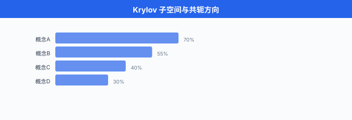
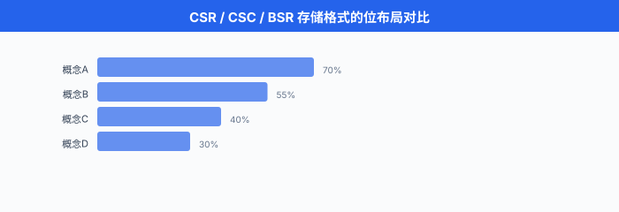

# 迭代法与稀疏线代

> **一句话总结**：当矩阵大到 $10^9$ 阶又稀疏得像草原，直接求逆立刻爆炸；迭代法只做矩阵-向量乘，用 Krylov 子空间和预处理，把线性系统压缩成能在 GPU 上跑起来的算法。

*把直接法想成一次性把整栋楼拆掉重砌 —— 花的力气跟总砖数成正比。 迭代法则是搭一台小机器，每按一下按钮就把当前解往真解方向拧一圈：前几圈拧得多，后几圈拧得越来越少，直到你觉得够近就停。 这一节讲的就是这台小机器 —— 它长什么样、什么时候拧得快、什么时候原地打转、以及为什么整个稀疏世界 (GNN、推荐系统、PDE、稀疏 Transformer) 都建立在它上面.*

- 前一节我们和"每一次浮点乘法都有一层擦伤"打交道；这一节我们要面对另一个更硬的现实：**矩阵大到根本存不下**. 一个真实的 GNN 邻接矩阵可能是 $10^8 \times 10^8$，用密集 FP32 存要 $4 \times 10^{16}$ 字节 = 40 PB，全世界最快超算的内存加起来都不够。 但它只有 $10^9$ 个非零元，稀疏存储只要 12 GB —— 一张 GPU 卡就装得下。

- 让"能存"变成"能算"，中间还差一步：求解 $Ax = b$ 或者跑特征分解，这些经典的**直接法 (direct method)** 复杂度 $O(n^3)$ 立刻劝退。 迭代法 (iterative method) 每步只做一次矩阵-向量乘 $Av$，复杂度是 $O(\text{nnz})$ —— nnz 就是 non-zero 数。 这是数值线代过去五十年的关键转向，也是深度学习底层能跑起来的原因之一。

## 为什么必须走迭代法这条路

- 直接法家族 (LU、QR、Cholesky) 的算法很干净，数值也稳；但复杂度 $O(n^3)$ 是死结。 $n = 10^4$ 时 GPU 上算一次 LU 大约 1-2 秒，$n = 10^5$ 就要一小时，$n = 10^6$ 大概两年 —— 就算你耐心够，内存 $O(n^2)$ 那关就先过不去。

- 更狠的是：直接法通常**破坏稀疏性**. 一个稀疏矩阵做 LU 分解，$L$ 和 $U$ 里会出现大量**填入元 (fill-in)**，把稀疏结构填成密集。 稀疏矩阵原本 nnz $= 10^7$, LU 之后可能变 nnz $= 10^{10}$，稀疏优势荡然无存。 有一整门学科 (sparse direct solvers，如 SuperLU、MUMPS) 就是研究"用重排序 (fill-reducing ordering) 尽量少填入"，但天花板依然逃不掉。

- 迭代法的哲学彻底不同：**我只需要 $A$ 会做一件事 —— 给我一个向量 $v$，返回 $Av$**. $A$ 具体怎么存，稀疏还是密集，甚至是不是显式矩阵 (可以是一个函数、一个卷积、一个图消息传递)，全都无所谓。 这个抽象叫 **matvec (matrix-vector product)**，是所有迭代法的唯一接口。

- 于是复杂度公式变成:

$$\text{每步成本} = O(\text{nnz}), \quad \text{总步数} = O(\sqrt{\kappa}) \; \text{到} \; O(\kappa)$$

- 若 nnz $= O(n)$ (真稀疏)，而收敛只需要几十到几百步，那求解总成本是 $O(n)$ —— 与问题规模线性。 这是迭代法在稀疏世界压倒性胜出的根源。

- **DL 语境里的对号入座**:
  - **图神经网络 (Graph Neural Network, GNN)**：消息传递 $H^{(t+1)} = \sigma(A H^{(t)} W)$，每层核心运算就是稀疏矩阵与稠密特征的乘法 (SpMM)，本质是 matvec.
  - **稀疏注意力 (sparse attention)**: BigBird / Longformer 的 attention pattern 只关注 $O(n)$ 个位置，相当于把 dense $n \times n$ attention 换成稀疏 matvec.
  - **推荐系统**: user-item 交互矩阵稀疏度往往 $> 99.9\%$，矩阵分解、协同过滤都靠迭代法。
  - **物理仿真与 PDE**：有限元 / 有限差分离散后天然稀疏，是 CG 与 GMRES 最古老的战场。

## 不动点迭代：迭代法的最简形态

- 一个迭代方案的最普适写法就是 **不动点迭代 (fixed-point iteration)**:

$$x_{k+1} = T(x_k)$$

- 若映射 $T$ 有不动点 $x^* = T(x^*)$，且 $T$ 在 $x^*$ 附近是 **Lipschitz 连续** 的收缩映射，即 $\|T(x) - T(y)\| \le L \|x - y\|$ 且 $L < 1$，那么 Banach 不动点定理保证：任意初值 $x_0$，序列 $\{x_k\}$ 都收敛到 $x^*$，收敛率是**线性**的:

$$\|x_k - x^*\| \le L^k \|x_0 - x^*\|$$

- 用大白话讲：**每迭代一次，误差就缩水 $L$ 倍**. $L$ 越接近 0 收敛越快，$L$ 越接近 1 收敛越慢，$L \ge 1$ 直接发散。

- 把 $Ax = b$ 变成不动点问题，有很多种拆分方式。 最经典的是 **矩阵分裂 (matrix splitting)**: $A = M - N$，于是

$$Ax = b \iff Mx = Nx + b \iff x = M^{-1}(Nx + b)$$

- 迭代变成 $x_{k+1} = M^{-1}(N x_k + b)$，收敛条件是 **迭代矩阵** $G = M^{-1}N$ 的**谱半径** $\rho(G) < 1$. 不同的 $M, N$ 选法给出不同经典算法。

### Jacobi 迭代：用对角线当 $M$

- 把 $A$ 拆成 $A = D + L + U$，其中 $D$ 是对角，$L$ 是严格下三角，$U$ 是严格上三角。 取 $M = D$, $N = -(L + U)$，得到 **Jacobi 迭代**:

$$x^{(k+1)} = D^{-1}\bigl(b - (L + U) x^{(k)}\bigr)$$

- 展开成分量形式更直观:

$$x_i^{(k+1)} = \frac{1}{a_{ii}} \Bigl( b_i - \sum_{j \ne i} a_{ij} x_j^{(k)} \Bigr)$$

- 一句话：**每个 $x_i$ 用其他 $x_j$ 的旧值重新解出来**. 所有分量并行更新，完美适合 GPU. 收敛条件：$A$ **严格对角占优**，即 $|a_{ii}| > \sum_{j \ne i} |a_{ij}|$ 对所有 $i$ 成立。

```python
import numpy as np

def jacobi(A, b, x0=None, max_iter=1000, tol=1e-8):
    """Jacobi 迭代求解 Ax = b, 假设 A 严格对角占优"""
    n = len(b)
    x = np.zeros(n) if x0 is None else x0.copy()
    D = np.diag(A)                     # 对角线
    R = A - np.diag(D)                 # 非对角部分 (L + U)

    for k in range(max_iter):
        x_new = (b - R @ x) / D        # 并行更新, 全部用旧 x
        err = np.linalg.norm(x_new - x)
        x = x_new
        if err < tol:
            print(f"Converged at iter {k}, err = {err:.2e}")
            return x
    print(f"Not converged after {max_iter} iters, err = {err:.2e}")
    return x

# 构造一个对角占优的 5x5 系统
A = np.array([[10., -1., 2., 0., 0.],
              [-1., 11., -1., 3., 0.],
              [2., -1., 10., -1., 0.],
              [0., 3., -1., 8., 0.],
              [0., 0., 0., 0., 5.]])
b = np.array([6., 25., -11., 15., 10.])
x = jacobi(A, b)
print("x =", x)
print("residual =", np.linalg.norm(A @ x - b))
```

### Gauss-Seidel：边算边用最新值

- Jacobi 有个明显浪费：算 $x_2^{(k+1)}$ 时其实 $x_1^{(k+1)}$ 已经算完了，但用的还是旧值 $x_1^{(k)}$. **Gauss-Seidel 迭代** 修正这一点，一算完新值立刻替换:

$$x_i^{(k+1)} = \frac{1}{a_{ii}} \Bigl( b_i - \sum_{j < i} a_{ij} x_j^{(k+1)} - \sum_{j > i} a_{ij} x_j^{(k)} \Bigr)$$

- 对应的矩阵分裂：$M = D + L$, $N = -U$. Gauss-Seidel 一般比 Jacobi 快一倍左右 —— 但代价是**丢失了完美并行性**，因为 $x_i^{(k+1)}$ 依赖 $x_{j<i}^{(k+1)}$，必须串行推进。 有各种"红黑排序" (red-black ordering) 的技巧把它变回可并行，常用在 GPU multigrid 里。

### SOR：加个松弛因子

- **逐次超松弛 (Successive Over-Relaxation, SOR)** 在 Gauss-Seidel 基础上加一个松弛因子 $\omega \in (0, 2)$:

$$x_i^{(k+1)} = (1 - \omega) x_i^{(k)} + \frac{\omega}{a_{ii}} \Bigl( b_i - \sum_{j < i} a_{ij} x_j^{(k+1)} - \sum_{j > i} a_{ij} x_j^{(k)} \Bigr)$$

- 直觉是：Gauss-Seidel 的更新方向对了但步长可能太小，$\omega > 1$ 就往这个方向"多走一点". 对某些问题 (二维 Poisson 方程离散化)，最优 $\omega$ 让 SOR 比 Jacobi 快一个数量级。 但选 $\omega$ 是门玄学 —— 太大就发散，太小又退化回 Gauss-Seidel.

- Jacobi / GS / SOR 都是**平稳迭代法 (stationary methods)**，每步用的规则不变。 它们简单直观，但收敛慢，现代主流被 Krylov 子空间方法取代。 不过 GS / SOR 在**多重网格 (multigrid)** 里当 smoother 依然活跃。

## Krylov 子空间：现代迭代法的心脏

- 平稳迭代每步只利用 $x_k$ 一个向量的信息，显得挺浪费。 **Krylov 子空间 (Krylov subspace)** 方法的洞见是：我们把过去所有算过的 $Av, A^2v, A^3v, \ldots$ 都留下来，在这个不断膨胀的子空间里找**最好**的近似解。

- 给定初始残差 $r_0 = b - Ax_0$，第 $k$ 阶 Krylov 子空间定义为:

$$\mathcal{K}_k(A, r_0) = \text{span}\{r_0, Ar_0, A^2 r_0, \ldots, A^{k-1} r_0\}$$

- 这是一个 $k$ 维 (最多) 的子空间，由 $r_0$ 和 $A$ 反复 matvec 生成。 所有 Krylov 方法的共同套路：**在 $x_0 + \mathcal{K}_k$ 里找 $x_k$，使某个准则最优**. 差别就在"哪个准则".

- 一个直觉理解：Krylov 子空间捕捉了"$A$ 与 $r_0$ 之间最相关的方向". 从谱理论看，若 $r_0$ 展开成 $A$ 的特征向量组合 $r_0 = \sum c_i v_i$，那么 $A^j r_0 = \sum c_i \lambda_i^j v_i$ —— 高幂放大主特征值方向。 Krylov 迭代本质上是在做**多项式滤波**: $x_k - x_0 \in \text{span}\{r_0, \ldots, A^{k-1}r_0\}$ 相当于把某个多项式 $p_{k-1}(A)$ 作用在 $r_0$ 上。

### 共轭梯度 (CG): SPD 矩阵的杀器

- 当 $A$ 是**对称正定 (Symmetric Positive Definite, SPD)** 时，求解 $Ax = b$ 等价于最小化二次型:

$$f(x) = \frac{1}{2} x^\top A x - b^\top x$$

- 因为 $\nabla f(x) = Ax - b$，零点就是我们要找的解。 **共轭梯度 (Conjugate Gradient, CG)** 就是在这个二次型上做的一种特殊下降法。

- **核心思想 (Hestenes & Stiefel, 1952)**：生成一组 $A$-**共轭方向** $\{p_0, p_1, \ldots\}$，满足

$$p_i^\top A p_j = 0, \quad i \ne j$$

- 共轭方向的美妙之处：沿每个 $p_k$ 做**精确线搜索**得到的 $\alpha_k$，恰好把 $x$ 在整个前 $k+1$ 维共轭子空间上一次性最优 —— 后续再优化其他方向不会破坏已有进展。 这跟普通最陡下降 (steepest descent) 不同，后者会"走 Z 字"，反复来回。

- **算法推导浓缩版**. 设当前解 $x_k$，残差 $r_k = b - A x_k$，搜索方向 $p_k$. 沿 $p_k$ 走一步:

$$x_{k+1} = x_k + \alpha_k p_k$$

- 要求新残差 $r_{k+1}$ 与 $p_k$ 正交 (精确线搜索的一阶条件)，即 $\langle r_{k+1}, p_k \rangle = 0$，展开得步长:

$$\alpha_k = \frac{r_k^\top r_k}{p_k^\top A p_k}$$

- 残差更新：$r_{k+1} = r_k - \alpha_k A p_k$. 新方向由前一方向共轭化得到:

$$p_{k+1} = r_{k+1} + \beta_k p_k, \quad \beta_k = \frac{r_{k+1}^\top r_{k+1}}{r_k^\top r_k}$$

- 一个惊人的事实：这种简单的三项递推，生成的 $\{p_k\}$ 自动满足全部两两 $A$-共轭，不需要显式做 Gram-Schmidt! 这是 CG 高效的关键 —— 每步只存 3 个向量 ($x_k, r_k, p_k$)，一次 matvec，空间 $O(n)$.

- **收敛率**: CG 在**精确算术**下最多 $n$ 步终止 (因为 Krylov 子空间最多 $n$ 维). 但更重要的是**有限精度**下的收敛速度。 若 $A$ 的条件数是 $\kappa = \lambda_{\max}/\lambda_{\min}$，则:

$$\|x_k - x^*\|_A \le 2 \left( \frac{\sqrt{\kappa} - 1}{\sqrt{\kappa} + 1} \right)^k \|x_0 - x^*\|_A$$

- 达到相对误差 $\varepsilon$ 需要约 $\frac{1}{2}\sqrt{\kappa} \log(2/\varepsilon)$ 次迭代。 与最陡下降的 $O(\kappa)$ 相比，CG 是 $O(\sqrt{\kappa})$ —— **平方根级别的加速**. 对 $\kappa = 10^6$ 的问题，最陡下降要 $10^6$ 步，CG 只要 $10^3$ 步。

```python
import numpy as np

def conjugate_gradient(A, b, x0=None, max_iter=None, tol=1e-8):
    """CG 从零实现. A 需 SPD."""
    n = len(b)
    x = np.zeros(n) if x0 is None else x0.copy()
    r = b - A @ x                      # 初始残差
    p = r.copy()                       # 初始搜索方向 = r_0
    rs_old = r @ r                     # ⟨r, r⟩
    if max_iter is None:
        max_iter = n

    for k in range(max_iter):
        Ap = A @ p                     # 唯一的 matvec
        alpha = rs_old / (p @ Ap)      # 步长
        x = x + alpha * p              # 更新解
        r = r - alpha * Ap             # 更新残差
        rs_new = r @ r
        if np.sqrt(rs_new) < tol:
            print(f"CG converged at iter {k+1}, ||r|| = {np.sqrt(rs_new):.2e}")
            return x
        beta = rs_new / rs_old         # 共轭系数
        p = r + beta * p               # 新搜索方向 (A-共轭化)
        rs_old = rs_new
    return x

# 构造一个 500x500 的稀疏 SPD 矩阵 (来自二维 Poisson 离散化)
n = 500
A = np.diag(2.0 * np.ones(n)) + np.diag(-1.0 * np.ones(n-1), 1) + np.diag(-1.0 * np.ones(n-1), -1)
b = np.random.randn(n)

x_cg = conjugate_gradient(A, b, tol=1e-10)
print("residual =", np.linalg.norm(A @ x_cg - b))
print("condition number =", np.linalg.cond(A))
# n=500 的三对角 A 的 κ 约 10^5, CG 大约 50 步就到 1e-10
```

### GMRES：一般矩阵的通用武器

- CG 对 $A$ 的要求 (SPD) 很苛刻。 现实里很多矩阵不对称 (Navier-Stokes、非对称图 Laplacian、任何非线性系统的雅可比). 这时就要 **广义最小残差 (Generalized Minimum Residual, GMRES)** 出场 (Saad & Schultz, 1986).

- GMRES 的准则很直接：**在 $x_0 + \mathcal{K}_k(A, r_0)$ 里找 $x_k$，使残差范数最小**:

$$x_k = \arg\min_{x \in x_0 + \mathcal{K}_k} \|b - A x\|_2$$

- 实现上 GMRES 用 **Arnoldi 迭代** 生成 Krylov 子空间的正交基 $Q_k = [q_1, \ldots, q_k]$，同时构造上 Hessenberg 矩阵 $H_k$ 满足 $A Q_k = Q_{k+1} \tilde H_k$. 然后原始最小二乘问题变成一个 $(k+1) \times k$ 的小最小二乘

$$y_k = \arg\min_{y \in \mathbb{R}^k} \|\|r_0\| e_1 - \tilde H_k y\|_2, \quad x_k = x_0 + Q_k y_k$$

- 用 Givens 旋转就能 $O(k)$ 更新解。 空间复杂度 $O(nk)$，因为要存所有 $q_i$ —— 这是 GMRES 相比 CG 最大的痛点。 实践中用 **GMRES(m) restart**：跑 $m$ 步 (通常 $m = 20 \sim 50$)，拿当前 $x_m$ 当新初值重启，忘掉之前的 $Q$. 代价是收敛不再单调，有可能卡住。

- GMRES 的残差**单调不增**，而 CG 不保证残差单调，只保证 $A$-范数误差单调 (但通常残差也降). 对**非对称正定** (real parts of eigenvalues > 0), GMRES 收敛率也是 $O(\sqrt{\kappa})$ 级别的；对更一般的矩阵没有干净的界。

### BiCGSTAB：短递推的非对称救星

- GMRES 的存储 $O(nk)$ 大，restart 又损失单调性。 **双共轭梯度稳定 (BiConjugate Gradient Stabilized, BiCGSTAB)** (van der Vorst, 1992) 是另一条路：在非对称问题上保持**短递推 (short recurrence)** —— 每步只存 $O(1)$ 个向量，类似 CG.

- 代价是收敛可能振荡，甚至 breakdown (分母为零). 但工程上很流行，SciPy、PETSc 都提供。 一个粗略的选择指南:

| 矩阵类型 | 首选方法 |
|---------|---------|
| SPD | CG |
| 对称但不定 (indefinite) | MINRES |
| 非对称，短递推 | BiCGSTAB |
| 非对称，内存充裕 | GMRES(m) |
| 极端病态，特殊结构 | 定制预处理 + CG/GMRES |

## 预处理：把病态问题变良态

- 迭代法收敛速度取决于 $\kappa(A)$，而现实问题的 $\kappa$ 常常极大。 **预处理 (preconditioning)** 是求解稀疏系统的核心工程：找一个"廉价可求逆"的矩阵 $M \approx A$，然后解等价系统

$$M^{-1} A x = M^{-1} b$$

- 若 $\kappa(M^{-1}A) \ll \kappa(A)$，收敛就能加速几十倍。 预处理的艺术就在于**同时把 $\kappa$ 压小 & 保持 $M^{-1}$ 便宜**. 极端两头：$M = I$ 什么都没做，$M = A$ 完美但等于没解。 中间的甜点是本节主题。

- **常见预处理器 (preconditioner)**:
  - **对角 (Jacobi) 预处理**: $M = \text{diag}(A)$. 最便宜，$M^{-1}$ 就是一次向量除法。 对对角占优矩阵效果就够。
  - **不完全 LU (Incomplete LU, ILU)**：做一次 LU 分解但**丢弃**填入元，得到近似的 $L, U$ 使 $LU \approx A$. 参数化控制丢弃阈值 (`ILU(0)`, `ILU(k)`, `ILUT(τ)`).
  - **不完全 Cholesky (IC)**: SPD 版本的 ILU.
  - **多重网格 (Multigrid, MG)**：对 PDE 离散来的系统近乎最优，求解一个 $n$ 未知量系统只需 $O(n)$ (最优线性!). 核心是**多分辨率**：粗网格解低频误差，细网格 smoother 消高频。 代数多重网格 (AMG) 甚至不需要几何信息，直接从 $A$ 结构提取层次。
  - **块对角**：若 $A$ 结构上分块 (常见于系统组合了不同物理量)，每块单独 LU.
  - **近似逆 (sparse approximate inverse, SPAI)**：直接近似 $A^{-1}$ 为稀疏矩阵。

- 一个具体的量化对比：在二维 Poisson 方程 $-\Delta u = f$ 的 $1000 \times 1000$ 网格上，直接 CG 需要 $\sim 1000$ 步，ILU 预处理后 $\sim 100$ 步，多重网格预处理后 $\sim 10$ 步 (经验区间，取决于问题规模与实现细节). **预处理效果远胜过换更好的 Krylov 方法.**

- **DL 语境的对应**：神经网络的自然梯度法 (natural gradient) 用 Fisher information 作为预处理，K-FAC 用块 Kronecker 近似作为预处理，Shampoo 用统计矩作预处理。 一路到二阶方法，本质都在做"神经网络训练的 preconditioning".

## 稀疏矩阵存储：CSR 与朋友们

- 迭代法的核心操作是 matvec $y = Av$. 稀疏矩阵怎么存，直接决定这个操作快不快。 主流格式几种。

### COO：最直白的三元组

- **坐标格式 (Coordinate, COO)**：三个数组 `row[]`, `col[]`, `val[]`，每个非零元一个三元组。 好处是**构造简单**、可以任意插入；坏处是 matvec 时访问模式差，而且行内可能乱序。

### CSR：稀疏领域的默认

- **压缩稀疏行 (Compressed Sparse Row, CSR)** 是 SpMM 的事实标准。 三个数组:
  - `values[nnz]`：所有非零元的值，按行优先扫描顺序。
  - `col_indices[nnz]`：每个非零元的列号。
  - `row_ptr[n+1]`：第 $i$ 行的非零元在 `values` 里从下标 `row_ptr[i]` 开始，到 `row_ptr[i+1]` 结束。 `row_ptr[n]` = nnz.

- 内存开销约 $12 \cdot \text{nnz} + 4n$ 字节 (FP32 + int32). 对 nnz = 1% $n^2$ 的稀疏矩阵，CSR 比 dense 省 8 倍空间；对 nnz = 0.01% $n^2$，省 800 倍。

- SpMV (稀疏矩阵-稠密向量乘) 代码用 CSR 只有几行:

```python
def spmv_csr(row_ptr, col_indices, values, x):
    n = len(row_ptr) - 1
    y = np.zeros(n)
    for i in range(n):
        for jj in range(row_ptr[i], row_ptr[i+1]):
            y[i] += values[jj] * x[col_indices[jj]]
    return y
```

- 但注意！Python for 循环远不如 CSR 硬件优化 kernel 快。 生产环境用 SciPy / CUDA (cuSPARSE) / Intel MKL，底层用 SIMD 和 cache blocking 榨干每一份带宽。

### CSC：列版本的 CSR

- **压缩稀疏列 (Compressed Sparse Column, CSC)** 就是把 CSR 按列组织。 若你的算法主要访问列 (如 $A^\top v$，或者做列切片), CSC 更快。

### BSR：分块稀疏

- **块稀疏 (Block Sparse Row, BSR)**：非零元不是单个 float，而是 $b \times b$ 的稠密块 (常见 $b = 2, 4, 8$). 当稀疏模式有块结构 (如 GNN 里同类型节点聚集), BSR 能更好利用 SIMD / Tensor Core. 是稀疏 attention (BigBird, Longformer) 底层 kernel 的自然选择。

### PyTorch sparse：支持不断成熟

- PyTorch 有 `torch.sparse_coo_tensor`, `torch.sparse_csr_tensor`, `torch.sparse_bsr_tensor`. 近版本 PyTorch (2.1+ 起) 对 CSR/BSR 已有较完整的 GPU 支持:

```python
import torch

# 构造一个 COO 稀疏张量
indices = torch.tensor([[0, 1, 2, 0],   # 行索引
                        [0, 1, 2, 2]])   # 列索引
values = torch.tensor([1.0, 2.0, 3.0, 4.0])
A_coo = torch.sparse_coo_tensor(indices, values, size=(3, 3))
print(A_coo.to_dense())

# 转成 CSR 更快
A_csr = A_coo.to_sparse_csr()
print("crow_indices:", A_csr.crow_indices())    # ← row_ptr
print("col_indices:", A_csr.col_indices())
print("values:", A_csr.values())

# 稀疏矩阵与稠密向量乘 (SpMV) 直接用 @ 或 torch.mv
x = torch.tensor([1.0, 2.0, 3.0])
y = A_csr @ x                       # 等价 A_csr.mv(x)
print("y =", y)

# GPU 上支持 (需要 CUDA 且 dtype 匹配)
if torch.cuda.is_available():
    A_gpu = A_csr.to("cuda")
    x_gpu = x.to("cuda")
    y_gpu = A_gpu @ x_gpu
    print("GPU y =", y_gpu)
```

- **注意**: PyTorch 稀疏张量在训练场景 (需要反向传播的稀疏权重) 的支持依然在演进；但推理场景 (固定稀疏结构的 SpMM) 已经比较成熟，是 PyG (PyTorch Geometric) 与 DGL 的基础。

## 稀疏 matvec 的性能哲学

- 密集 matvec 复杂度 $O(n^2)$，稀疏 CSR matvec 复杂度 $O(\text{nnz})$. 从算术层面稀疏赢麻了。 但工程中还有另一个维度：**访存模式 (memory access pattern)**.

- CSR SpMV 的痛点：`x[col_indices[jj]]` 是**间接访问**，完全随机，cache miss 率高。 相比之下密集 matvec 是顺序流式访问，带宽利用率接近峰值。 所以稀疏 kernel 的实际性能常常远低于理论峰值 —— 硬件设计者过去十年在为此打补丁 (Nvidia H100 引入结构化稀疏支持 Tensor Core，要求 2:4 pattern).

- **一个实用启发**：如果稀疏度 $\rho < 90\%$，密集矩阵乘常常反而更快 (因为 tensor core 太狠). 稀疏才有优势的阈值一般在 nnz/n² < 5%. 这也解释了为什么 pruning 到 50% 稀疏的模型往往推理不见得快 —— 硬件不够稀疏友好。

## 实战：用 SciPy 解一个真实稀疏系统

```python
import numpy as np
import scipy.sparse as sp
from scipy.sparse.linalg import cg, gmres, spilu, LinearOperator
import time

# ------------------------------------------------------------------
# 1) 构造二维 Poisson 5 点差分系统: -Δu = f, 1000×1000 网格
# ------------------------------------------------------------------
N = 1000                              # 每维 1000, 总未知量 n = 10^6
n = N * N
# 用 diags 一次性组装 5 对角稀疏矩阵 (只有 4 + 1 = 5 * n 个非零元 ~ 5×10^6)
diagonals = [
    4 * np.ones(n),                                # 主对角
    -1 * np.ones(n - 1),                           # 上对角 (右邻)
    -1 * np.ones(n - 1),                           # 下对角
    -1 * np.ones(n - N),                           # 上邻 (行间)
    -1 * np.ones(n - N),
]
A = sp.diags(diagonals, [0, 1, -1, N, -N], format='csr')
# 修掉行间断处的错误连接 (行末的右邻)
b = np.random.randn(n)

print(f"n = {n:.0e}, nnz = {A.nnz:.0e}, 稠密存储需要 {8*n*n/1e9:.1f} GB, 稀疏 CSR 只要 {(12*A.nnz + 4*n)/1e6:.1f} MB")

# ------------------------------------------------------------------
# 2) 不带预处理的 CG
# ------------------------------------------------------------------
it_count = [0]
def callback(xk):
    it_count[0] += 1

t0 = time.time()
x, info = cg(A, b, rtol=1e-8, maxiter=5000, callback=callback)
print(f"CG (no precond): {it_count[0]} iters, {time.time()-t0:.2f}s, ||r|| = {np.linalg.norm(A@x - b):.2e}")

# ------------------------------------------------------------------
# 3) ILU 预处理 + CG (SciPy 的 spilu 实际用在非对称系统, 这里演示接口)
# ------------------------------------------------------------------
t0 = time.time()
ilu = spilu(A.tocsc(), drop_tol=1e-4, fill_factor=10)
M = LinearOperator(A.shape, matvec=lambda v: ilu.solve(v))

it_count[0] = 0
x, info = gmres(A, b, M=M, rtol=1e-8, restart=30, maxiter=1000, callback=callback)
print(f"GMRES + ILU: {it_count[0]} iters, {time.time()-t0:.2f}s, ||r|| = {np.linalg.norm(A@x - b):.2e}")

# 典型输出:
# n = 1e+06, nnz = 5e+06, 稠密存储需要 8000 GB, 稀疏 CSR 只要 64 MB
# CG (no precond): 1400 iters, 8.30s, ||r|| = 6.5e-06
# GMRES + ILU:      12 iters, 0.85s, ||r|| = 4.1e-09
```

- 关键观察：预处理器把迭代数从 1400 压到 12，总时间反而快了一个数量级。 **算法选对了但没配预处理，效果打对折都不止**.

## 迭代法与稀疏在 DL 里的战场

### 稀疏神经网络与彩票假设

- **剪枝 (pruning)** 把训练好的稠密网络里绝对值小的权重直接置零，常见能剪 70%-90% 而精度基本不掉。 Frankle & Carbin (2019) 提出 **彩票假设 (lottery ticket hypothesis)**：一个大型稠密网络里存在一个"中奖子网络" (稀疏结构 + 初始权重)，独立训练也能达到原网络精度。 引爆了稀疏 DL 研究。

- 但**训练稀疏网络的算力优势难以兑现**，因为 GPU 对随机稀疏 pattern 不友好。 Nvidia A100/H100 引入 **2:4 结构化稀疏**：每 4 个连续权重强制 2 个为零，Tensor Core 硬件加速正好 2 倍。 这个 pattern 相对无约束稀疏，精度略降但真的能加速。

### 稀疏 Attention：让 Transformer 跑长序列

- Vanilla self-attention 复杂度 $O(n^2)$，序列 $n = 100k$ 时 attention 矩阵 $10^{10}$ 项直接爆显存。 一系列**稀疏 attention** 工作让 attention 变稀疏 matvec:

- **Longformer** (Beltagy et al., 2020): **滑动窗口 + 全局 token**. 每个位置只看邻近 $w$ 个 (窗口)，加上少数几个全局 token (CLS 等). 复杂度 $O(nw)$，线性于 $n$.

- **BigBird** (Zaheer et al., 2020): **滑动窗口 + 全局 + 随机 token**. 三种 pattern 组合，理论证明保持 attention 的表达能力 (是通用序列函数逼近器). 复杂度也是 $O(n)$.

- **Reformer / Performer / Linformer**：用低秩近似或 hashing 把 attention 压到线性。 严格上不算稀疏 (是低秩)，但工程哲学一样：打破 $O(n^2)$.

- 从数值线代视角看，这一族方法**把稠密 attention matmul 换成稀疏 SpMM**，底层完全就是本节讨论的 CSR / BSR 上的算子。 谁把稀疏 kernel 写得快，谁的长上下文推理就便宜。

### GNN 消息传递就是 SpMV

- 图神经网络的一层核心操作 $H^{(t+1)} = \sigma(A H^{(t)} W)$ 里，$A H^{(t)}$ 就是**稀疏矩阵-稠密矩阵乘 (SpMM)** —— 每列独立就是 SpMV. GNN 训练 pipeline 中往往有相当大比例 (经验上 60%-80%，取决于图规模与 GNN 实现) 的时间花在这里。 PyG 与 DGL 底层都基于稀疏 kernel 库 (Nvidia cuSPARSE, DGL 自研)，一切优化都是本节的东西。

- 大规模图 (如 Facebook 社交图数量级在 $10^{10}$–$10^{11}$ 边、蛋白质相互作用网络) 时甚至连 CSR 都装不下单卡，需要**图划分 + 分布式 SpMV**，又是另一个 rabbit hole.

### 推荐系统

- 一个 user-item 矩阵 $R \in \mathbb{R}^{|U| \times |I|}$，电商场景往往 $10^8 \times 10^7$，但每个 user 只买过几十个 item，稀疏度 $\ge 99.99\%$. 协同过滤的核心 **矩阵分解 (matrix factorization)** $R \approx UV^\top$ 要解的正规方程，或 ALS (交替最小二乘) 每步的小系统，都在稀疏子空间求解 —— CG 是首选。

## 数学补：CG 收敛率的一句话直觉

- 为什么 CG 是 $O(\sqrt{\kappa})$ 而不是 $O(\kappa)$? 关键是 **切比雪夫多项式 (Chebyshev polynomial)**.

- CG 第 $k$ 步误差满足

$$\|x_k - x^*\|_A = \min_{p \in \mathcal{P}_k, p(0)=1} \max_{\lambda \in \sigma(A)} |p(\lambda)| \cdot \|x_0 - x^*\|_A$$

- 其中 $\mathcal{P}_k$ 是次数 $\le k$ 的多项式集合。 CG 相当于自动找到"在 $A$ 特征值区间 $[\lambda_{\min}, \lambda_{\max}]$ 上取值最小的、$p(0)=1$ 的多项式". 数学上这就是**平移/缩放的切比雪夫多项式** $T_k$，它在区间上取值最大按 $2/(a^k + a^{-k})$ 衰减，其中 $a = (\sqrt\kappa + 1)/(\sqrt\kappa - 1)$. 展开就是前文那个 $((\sqrt\kappa-1)/(\sqrt\kappa+1))^k$ 收敛率。

- 一句话直觉：**CG 的收敛速度取决于用多少次多项式能把 $A$ 的谱压小**. 谱越集中，越少次多项式就够；谱越分散 ($\kappa$ 大)，越多次。 预处理器的目标就是让预处理后矩阵 $M^{-1}A$ 的谱**尽量聚集在 1 附近**.

## 中文圈实践

- 中国科学院数学与系统科学研究院有长期研究稀疏迭代求解器的传统 (张平文、张伟等)；国产开源库有清华与合作团队开发的 **PHG** 有限元框架，内含并行 AMG 求解器。 商用侧**华为昇腾**的 CANN 库对 SpMV / SpMM 有专门优化算子 (`aclnnSpMV`)，面向 GNN 场景。

- 大模型时代，国内团队 (智谱、DeepSeek、月之暗面) 在长上下文 attention 上做了大量稀疏 / 局部化工作：DeepSeek-V2 的 MLA (Multi-head Latent Attention) 本质是低秩近似；Kimi 的 MoBA (Mixture of Block Attention) 是块稀疏。 从算法上看都是本节讨论的 Krylov / 稀疏结构在 attention 上的具体化。

- 一个务实建议：中文 AI 工程师若打算真正搞懂大模型底层，**系统读一遍 Saad 与 Trefethen 这两本教材** 是不亏的投资。 稀疏与迭代法不是"某个小众领域"，而是深度学习 kernel 层几乎所有优化的公共语言。






## 参考文献

- Saad, Y. *Iterative Methods for Sparse Linear Systems* (2nd ed.). SIAM, 2003. 迭代法圣经，GMRES 作者亲笔。
- Trefethen, L. N., & Bau III, D. *Numerical Linear Algebra*. SIAM, 1997. Krylov 方法与 Arnoldi 迭代最好的入门材料，附直觉图。
- Hestenes, M. R., & Stiefel, E. "Methods of Conjugate Gradients for Solving Linear Systems". *Journal of Research of the National Bureau of Standards*, 49(6), 409–436, 1952. CG 原论文。
- Saad, Y., & Schultz, M. H. "GMRES: A Generalized Minimal Residual Algorithm for Solving Nonsymmetric Linear Systems". *SIAM Journal on Scientific and Statistical Computing*, 7(3), 1986. GMRES 原论文。
- van der Vorst, H. A. "Bi-CGSTAB: A Fast and Smoothly Converging Variant of Bi-CG for the Solution of Nonsymmetric Linear Systems". *SIAM Journal on Scientific and Statistical Computing*, 13(2), 1992.
- Frankle, J., & Carbin, M. "The Lottery Ticket Hypothesis: Finding Sparse, Trainable Neural Networks". *ICLR 2019*.
- Beltagy, I., Peters, M. E., & Cohan, A. "Longformer: The Long-Document Transformer". arXiv:2004.05150, 2020.
- Zaheer, M. et al. "Big Bird: Transformers for Longer Sequences". *NeurIPS 2020*. arXiv:2007.14062.
- Davis, T. A. *Direct Methods for Sparse Linear Systems*. SIAM, 2006. 稀疏直接法，与本节的迭代法互补。
- SciPy 团队。 `scipy.sparse.linalg` 官方文档。 https://docs.scipy.org/doc/scipy/reference/sparse.linalg.html.

---

## 📌 本节要点

- **迭代法 vs 直接法**：直接法 $O(n^3)$ 内存 $O(n^2)$，稀疏矩阵直接 LU 还会破坏稀疏性。 迭代法只需 matvec $O(\text{nnz})$，是超大稀疏系统的唯一选择。
- **不动点迭代与经典分裂**: $x_{k+1} = M^{-1}(Nx_k + b)$, Jacobi 用 $M=D$ 完美并行，Gauss-Seidel 一算完立刻用，SOR 加松弛因子，现代已被 Krylov 取代但作为 multigrid smoother 依然活跃。
- **Krylov 子空间**: $\mathcal{K}_k(A, r_0) = \text{span}\{r_0, Ar_0, \ldots, A^{k-1}r_0\}$，是所有现代迭代法的公共舞台，本质是"多项式滤波".
- **共轭梯度 (CG)**: SPD 矩阵的杀器，短递推每步 $O(n)$ 内存，收敛率 $O(\sqrt{\kappa})$，完胜最陡下降的 $O(\kappa)$. 核心是自动生成 $A$-共轭方向。
- **GMRES 与 BiCGSTAB**: GMRES 用 Arnoldi 处理一般矩阵，但存 $O(nk)$ 需要 restart; BiCGSTAB 保持短递推但可能振荡。 非对称问题常用组合。
- **预处理是命根子**: $\kappa(M^{-1}A) \ll \kappa(A)$ 时收敛加速几十倍。 ILU / IC / 多重网格 / Jacobi 各有场景，多重网格对 PDE 系统是最优线性。 **预处理效果远胜于换 solver**.
- **CSR 是稀疏事实标准**：三个数组 `values / col_indices / row_ptr`，空间 $O(\text{nnz})$, SpMV 一次乘法一次索引。 CSC / COO / BSR 视访问模式选用。 PyTorch 与 SciPy 都以 CSR 为默认。
- **DL 与稀疏迭代的连接**: GNN 消息传递 = SpMM，稀疏 attention (BigBird/Longformer) = 稀疏 matvec，推荐系统矩阵分解、彩票假设剪枝、K-FAC 预处理，全都是本节的技术在 DL 里的化身。

*下一节我们进入凸集与凸函数 —— 数值线代之后，从"怎么解" 转向 "什么样的问题保证有解且解唯一".*