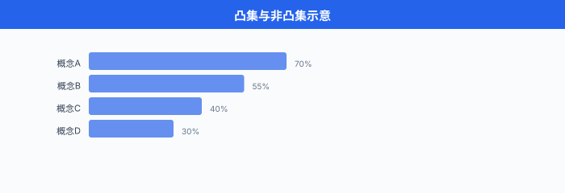
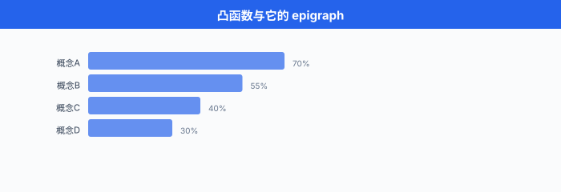

# 凸集与凸函数

> **一句话总结**：凸性是"局部最优 = 全局最优"的护身符；凸集封闭在两点连线上，凸函数把连线抬到图像之上，这两个几何条件让优化问题从一片混沌变得可以求解。

*把一般的优化问题想成在一片黑漆漆的山地里找最低点 —— 你只能感受脚下的坡度，谁也不敢保证走到的那个坑就是全世界最深。 凸性是一张地质证书：它保证整块地形只有一个最低洼，你但凡沿着下坡方向走，走到停下来的那一刻就是终点。 这一节我们讲这张证书的两条条款 —— 凸集与凸函数，以及它们在什么运算下会自动传染，什么时候会失效。 对深度学习的读者，这不是一段古老的数学历史课：SVM、ridge、LASSO 是凸的活教材，神经网络虽然整体非凸，但**局部凸近似 (over-parameterized regime、NTK、mean-field)** 是过去五年理解 DL 训练的主要工具.*

- 上一节我们把"怎么解"讲到底了 —— 迭代法把大稀疏系统拧到收敛。 这一节主题突然转向：**什么问题保证有解、且解全局唯一?** 答案是"凸的". 一个凸优化问题，只要你能爬下山，就一定爬到了地球上最深的谷底；一个非凸问题，你走到停下来的那一刻，世界上其他地方可能还有一个深得多的坑，你却永远不会知道。

- 这不是抽象的哲学问题。 现代机器学习的算法分层，本质就是**凸的部分与非凸的部分**的分界线:
  - **凸**：线性回归、岭回归 (ridge)、LASSO、SVM、逻辑回归、CRF 训练 —— 都保证全局最优。
  - **非凸**：神经网络训练、矩阵分解、字典学习、EM 算法收敛点、GAN 的鞍点问题 —— 只能给出局部保证。
  - **凸松弛**：组合优化 (整数规划) 与 NN robust verification 里的经典技巧，把非凸问题包在一个凸壳里，求解后再收紧。
  
- 所以读懂凸性，不只是为了 SVM 和 LASSO，而是**为了判断你手头这个 loss 到底会不会在训练时跟你玩阴的**.

## 凸集：两点连线不出格

- 一个集合 $C \subseteq \mathbb{R}^n$ 叫做**凸集 (convex set)**，若对任意两点及它们之间的线段，整条线段都还在集合里:

$$\forall x, y \in C, \; \forall \theta \in [0, 1]: \quad \theta x + (1 - \theta) y \in C$$

- 这条件很朴素：我拿走两个成员，把它们的加权平均 (走廊上任意一点) 塞回去，集合必须接得住。 直觉上凸集是"没有凹陷、没有洞、没有断层"的形状。

- **具体长什么样**:
  - **半空间 (halfspace)**: $\{x : a^\top x \le b\}$ —— 用一个超平面把 $\mathbb{R}^n$ 切两半，取一半。
  - **球 (ball)**: $\{x : \|x - x_0\| \le r\}$ —— 直觉上凸得最典型。
  - **多面体 (polyhedron)**：有限个半空间的交，即 $\{x : Ax \le b\}$. 线性规划的可行域就是这货。
  - **半正定锥 (positive semidefinite cone)**: $\mathbb{S}^n_+ = \{X \in \mathbb{S}^n : X \succeq 0\}$ —— 所有对称半正定矩阵组成的集合，半正定 (positive semidefinite, PSD) 是 SDP (半定规划) 的舞台。
  - **单纯形 (simplex)**: $\{x \in \mathbb{R}^n_+ : \sum x_i = 1\}$ —— 概率分布住的地方。

- **反例 (不是凸集)**:
  - **环 (annulus)** $\{x : 1 \le \|x\| \le 2\}$：直径两头连线穿过中心的洞，出格了。
  - **两个不相交圆盘的并集**：从一个圆盘到另一个圆盘的连线要经过空白区，挂了。
  - **整数集** $\mathbb{Z}^n$：从 $(0,0)$ 到 $(1,1)$ 的线段中点 $(0.5, 0.5)$ 不是整数，立刻破功。 这就是**整数规划为什么难** —— 它的可行域根本不是凸集。



## 凸集的保凸运算：你可以自由拼装

- 手上有几个凸集积木，如何生出更多凸集？记住四条**保凸运算**，剩下的可以现推。

### 1. 交集 (Intersection)

- 若 $C_1, C_2$ 都凸，则 $C_1 \cap C_2$ 也凸。 而且**任意多个** (甚至不可数无穷个) 凸集之交依然凸:

$$C = \bigcap_{i \in I} C_i \implies C \text{ 凸}$$

- 直觉：两个凸集的公共部分继承了两边"连线不出格"的性质。 这是**多面体是凸集**的根本理由 —— 多面体就是有限个半空间的交。

- **反例警告**：凸集的**并集通常不凸** (两个圆盘中间空白). 所以 union 不在保凸操作的清单里。

### 2. 仿射变换 (Affine Transformation)

- 若 $C \subseteq \mathbb{R}^n$ 凸，$f(x) = Ax + b$ 是仿射映射，则像集 $f(C) = \{Ax + b : x \in C\}$ 也凸。 反过来仿射的**原像**也保凸：$f^{-1}(D) = \{x : Ax + b \in D\}$ 若 $D$ 凸则 $f^{-1}(D)$ 凸。

- 这条给了我们大量组合套路。 比如**椭球** $\{x : (x - x_0)^\top P^{-1} (x - x_0) \le 1\}$ 是单位球在仿射变换 $x = P^{1/2} u + x_0$ 下的像，因此凸。

### 3. 透视变换 (Perspective)

- 透视函数 $P(x, t) = x/t$ 定义在 $\mathbb{R}^n \times \mathbb{R}_{++}$ (最后一个坐标严格正) 上。 它保凸：若 $C \subseteq \mathrm{dom}(P)$ 凸，$P(C)$ 凸。 直觉是"针孔相机模型"——把 $(x, t)$ 除以第 $n+1$ 维实现三维投影到二维，凸的物体投出的影子还是凸的。

### 4. 线性分式函数 (Linear-Fractional)

- 更一般的 $f(x) = \frac{Ax + b}{c^\top x + d}$ (分母保持正) 也保凸。 常出现在**概率对偶**与**几何规划**里。

- 有这四条，加上"半空间凸"这一枚种子，就能证明**几乎所有实际问题的可行域都是凸的**. 反过来一旦某个约束破坏这些结构 (如 $x^2 = 1$ 这种非线性等式)，凸性就崩了。

## 凸函数：三个等价定义

- **凸函数 (convex function)** 有三种等价的判据，一个比一个好用。 假设 $f: \mathbb{R}^n \to \mathbb{R}$，定义域 $\mathrm{dom}(f)$ 是凸集。

### 定义 1：连线抬起 (基本定义)

$$f(\theta x + (1 - \theta) y) \le \theta f(x) + (1 - \theta) f(y), \quad \forall x, y \in \mathrm{dom}(f), \; \theta \in [0, 1]$$

- 大白话：**函数值不高于线性插值**. 图像沿任意两点连线画一条弦，函数图像永远在弦的下方。 若不等号严格成立 ($x \ne y, \theta \in (0,1)$)，叫**严格凸 (strictly convex)**.

### 定义 2: epigraph 是凸集 (几何定义)

- 定义**epigraph (上境图)**:

$$\text{epi}(f) = \{(x, t) \in \mathbb{R}^n \times \mathbb{R} : f(x) \le t\}$$

- 也就是"函数图像及其上方所有点". 那么 $f$ 凸 $\iff$ $\text{epi}(f)$ 是 $\mathbb{R}^{n+1}$ 中的凸集。 这个视角把凸函数问题**几何化**了：一切凸函数命题都能翻译成对 epigraph 这个凸集的命题。



### 定义 3：一阶条件 (Gradient 判据)

- 若 $f$ 一次可微，则 $f$ 凸 $\iff$

$$f(y) \ge f(x) + \nabla f(x)^\top (y - x), \quad \forall x, y \in \mathrm{dom}(f)$$

- 大白话：**函数图像处处在切线的上方**. 或者说 $f$ 在 $x$ 处的一阶泰勒近似是一个**全局下界**. 这个性质极其有用 —— 它是所有一阶方法 (梯度下降、加速梯度法) 收敛证明的起点。

- 一阶条件还立刻推出一个魔法般的结论：**对凸函数，$\nabla f(x^*) = 0$ 蕴含 $x^*$ 是全局极小**. 因为对任意 $y$:

$$f(y) \ge f(x^*) + 0^\top (y - x^*) = f(x^*)$$

- 这就是"凸问题 = 局部最优 = 全局最优"的具体面目。

### 定义 4：二阶条件 (Hessian 判据)

- 若 $f$ 二次可微，则 $f$ 凸 $\iff$ Hessian 处处半正定:

$$\nabla^2 f(x) \succeq 0, \quad \forall x \in \mathrm{dom}(f)$$

- 严格凸对应 $\nabla^2 f(x) \succ 0$ (正定)；但反过来"处处正定"是充分不必要 (如 $f(x) = x^4$ 在原点二阶导为零，但仍严格凸). 实际写代码判定凸性，**二阶条件是最省事的一种**：计算 Hessian，检查特征值是否都非负。

## 凸函数的经典例子

- **仿射函数** $f(x) = a^\top x + b$：既凸又凹 (等式成立). 世界上唯一同时凸且凹的函数就是仿射。
- **二次函数** $f(x) = \frac{1}{2} x^\top P x + q^\top x + r$：凸 $\iff P \succeq 0$. 岭回归的目标函数是这货。
- **指数** $e^{ax}$：凸 (二阶导 $a^2 e^{ax} \ge 0$).
- **幂函数**: $x^p$ 在 $x > 0$ 上凸当 $p \ge 1$ 或 $p \le 0$；凹当 $0 \le p \le 1$.
- **负对数** $-\log x$ ($x > 0$)：凸 (熵、KL 散度、逻辑回归的常客).
- **仿射的最大值** $f(x) = \max_i (a_i^\top x + b_i)$：凸 (它是**分段线性凸函数**的一般形式).
- **所有范数** $\|x\|_p$ ($p \ge 1$)：凸 (三角不等式直接给出).
- **Log-Sum-Exp (LSE)**:

$$f(x) = \log \sum_{i=1}^n e^{x_i}$$

  - LSE 凸，是 Softmax 的父亲，也是逻辑回归 loss 的核心。

- **LSE 凸性的证明直觉** (不写全过程，但抓住关键). 计算 Hessian 得

$$\nabla^2 f(x) = \frac{1}{(\mathbf{1}^\top z)^2}\bigl((\mathbf{1}^\top z) \, \text{diag}(z) - z z^\top\bigr), \quad z_i = e^{x_i}$$

  - 验证 $v^\top \nabla^2 f(x) v \ge 0$ 归约成 Cauchy-Schwarz 不等式的一个变形。 那个不等式就是"某某平方和 $\ge$ 平方的某某和"的一次巧妙调用。 一句话：**LSE 的 Hessian 半正定，因为 Cauchy-Schwarz 兜底**.

- **Softmax 相关的 DL 连结**: Softmax 是 LSE 的梯度：$\sigma(x) = \nabla \mathrm{LSE}(x)$. 交叉熵损失 $\mathcal{L}(x, y) = \mathrm{LSE}(x) - y^\top x$ (one-hot label) 在 $x$ 上凸 —— 这就是逻辑回归凸的本质原因。 但当 $x$ 是**某个神经网络的输出**，神经网络关于权重不凸，整体损失也就非凸了。

```python
import numpy as np
import matplotlib.pyplot as plt

# 三种凸函数可视化: 二次 / 指数 / LSE(2维)
x = np.linspace(-3, 3, 300)

fig, axes = plt.subplots(1, 3, figsize=(15, 4))

# 1) 二次
axes[0].plot(x, x**2, 'b-', linewidth=2, label=r'$f(x) = x^2$')
# 连线抬起演示
axes[0].plot([-2, 2], [4, 4], 'r--', linewidth=1.5, label='chord')
axes[0].fill_between([-2, 2], [4, 4], [(-2)**2, 2**2], alpha=0.1, color='red')
axes[0].set_title('二次: 严格凸')
axes[0].legend()
axes[0].grid(alpha=0.3)

# 2) 指数
axes[1].plot(x, np.exp(0.8 * x), 'g-', linewidth=2, label=r'$f(x) = e^{0.8x}$')
axes[1].set_title('指数: 严格凸')
axes[1].legend()
axes[1].grid(alpha=0.3)

# 3) LSE (2D, 取 x2 = 0)
x_lse = np.linspace(-4, 4, 300)
lse_vals = np.log(np.exp(x_lse) + np.exp(0.0))
axes[2].plot(x_lse, lse_vals, 'm-', linewidth=2, label=r'$\mathrm{LSE}(x_1, 0)$')
axes[2].plot(x_lse, np.maximum(x_lse, 0.0), 'k--', linewidth=1, label=r'$\max(x_1, 0)$')
axes[2].set_title('LSE: max 的光滑上界')
axes[2].legend()
axes[2].grid(alpha=0.3)

plt.tight_layout()
plt.savefig('ch24_03_convex_functions.svg', bbox_inches='tight')
plt.show()
```

## 凸函数的保凸运算

- 与凸集同理，凸函数在一组操作下**自动传染**. 记住四条 + 一条陷阱，就能徒手判定绝大多数机器学习目标函数的凸性。

### 1. 非负加权和

- $f = \sum_i w_i f_i$，若所有 $f_i$ 凸且 $w_i \ge 0$，则 $f$ 凸。 **岭回归目标** $\|Ax - b\|^2 + \lambda \|x\|^2$ 就是两个凸函数的正加权和，立刻是凸的。

### 2. 与仿射的复合

- $g(x) = f(Ax + b)$，若 $f$ 凸则 $g$ 凸。 直觉：仿射变换保持凸集结构，复合过来 epigraph 还是凸集。

- **LASSO** 的目标 $\|Ax - b\|^2 + \lambda \|x\|_1$: $\|\cdot\|^2$ 是二次凸，$\|\cdot\|_1$ 是范数凸，与仿射复合仍凸，非负加权和仍凸。

### 3. Pointwise Maximum / Supremum

- $f(x) = \max\{f_1(x), \ldots, f_m(x)\}$：每个 $f_i$ 凸 $\Rightarrow f$ 凸。 更一般:

$$f(x) = \sup_{\alpha \in \mathcal{A}} f_\alpha(x)$$

  - 一族凸函数的上确界仍凸 (即使 $\mathcal{A}$ 无穷).

- 几何直觉：每个 $f_i$ 的 epigraph 是凸集，$\max$ 的 epigraph 是**所有 epigraph 的交** ($\{(x, t) : t \ge f_i(x), \forall i\}$)，凸集交仍凸。

- **SVM 的 hinge loss** $\max(0, 1 - y_i (w^\top x_i + b))$ 就是"两个仿射的 max"，立刻凸。

### 4. 与凸单调函数的复合

- $h$ 凸单调不减，$g$ 凸 $\Rightarrow f = h \circ g$ 凸。 例：$g$ 是任意凸的，$h(t) = e^t$ 凸单调不减，于是 $e^{g(x)}$ 凸。

- **陷阱**：反之不成立。 $h$ 凸但**不单调** (如 $t^2$ 在 $\mathbb{R}$ 上)，复合过来会破坏凸性。 比如 $(x^3)^2 = x^6$ 是凸的，但 $(-x)^2 = x^2$ 凸没错 —— 这里陷阱在方向搞对。

- 更靠谱的记忆：**凸凸凸复合的合法组合有严格的 $h$ 单调方向要求**，具体见 Boyd & Vandenberghe 第 3 章表 3.1.

## 强凸性：底部更陡

- 凸函数保证局部即全局，但收敛快慢还差一层。 **强凸 (strongly convex)** 加一个二次下界:

$$f(y) \ge f(x) + \nabla f(x)^\top (y - x) + \frac{m}{2} \|y - x\|^2, \quad m > 0$$

- 几何上：一阶泰勒的下界从**切平面**加强为**切抛物面** —— 底部不但凸，还有一个明显的曲率。 等价条件 (二次可微时):

$$\nabla^2 f(x) \succeq m I \iff \lambda_{\min}(\nabla^2 f(x)) \ge m$$

- 强凸的实际意义：**梯度下降在强凸函数上线性收敛**. 具体来说，迭代 $k$ 次后:

$$f(x_k) - f(x^*) \le \bigl(1 - m/L\bigr)^k \bigl(f(x_0) - f(x^*)\bigr)$$

  - 达到误差 $\varepsilon$ 只要 $O(\log(1/\varepsilon))$ 次迭代 —— 指数级快，与稀疏系统里 CG 的 $O(\log(1/\varepsilon))$ 是同一档。

- **岭回归**: $\|Ax - b\|^2 + \lambda \|x\|^2$ 的 Hessian 是 $2A^\top A + 2\lambda I$，天然强凸 (强凸模数 $m = 2\lambda$). 这是加正则化的一个**优化理论理由** —— 不只是防过拟合，也让训练收敛更快。

- **纯 LASSO** $\|Ax - b\|^2 + \lambda \|x\|_1$：凸但**未必强凸**，因为 $\ell_1$ 项不加曲率。 得靠特殊的稀疏性假设 (RIP) 才能推收敛率。

## L-Smooth：顶部不太陡

- 强凸给出**下界曲率**，与之对偶的是**上界曲率**，也叫 **Lipschitz 连续梯度 (L-smooth, L-光滑)**:

$$\|\nabla f(x) - \nabla f(y)\| \le L \|x - y\|, \quad \forall x, y$$

- 二次可微时等价于:

$$\nabla^2 f(x) \preceq L I \iff \lambda_{\max}(\nabla^2 f(x)) \le L$$

- 几何直觉：函数没有"陡崖" —— 梯度不能剧烈跳变。 等价的另一种形式 (更常用于证明):

$$f(y) \le f(x) + \nabla f(x)^\top (y - x) + \frac{L}{2} \|y - x\|^2$$

- 即"函数处处不高于一个宽度为 $1/L$ 的抛物面上界". 于是梯度下降 $x_{k+1} = x_k - \alpha \nabla f(x_k)$ 只要 $\alpha \le 1/L$ 就保证 $f$ 单调下降。

- **同时强凸 & L-光滑** 就是最舒服的一档。 此时定义**条件数**:

$$\kappa = L / m$$

- $\kappa$ 越接近 1 表明底部与顶部曲率差不多，优化最容易；$\kappa$ 极大表明目标函数是"细长的椭圆"，梯度下降会走 Z 字，很慢。 加速梯度法 (Nesterov 加速) 把强凸+光滑上的迭代复杂度从 $O(\kappa \log(1/\varepsilon))$ 降到 $O(\sqrt{\kappa} \log(1/\varepsilon))$ —— 这个平方根加速与上一节的 CG 收敛率是一个模子刻出来的。

## 凸优化问题的标准形式

- **凸优化 (convex optimization) 问题**长这样:

$$\begin{aligned}
\min_x \quad & f(x) \\
\text{s.t.} \quad & g_i(x) \le 0, \quad i = 1, \ldots, m \\
& h_j(x) = 0, \quad j = 1, \ldots, p
\end{aligned}$$

- 约束一栏三个条件:
  - $f$ 凸。
  - 每个 $g_i$ 凸 (不等式约束的可行域 $\{x : g_i(x) \le 0\}$ 是凸集 —— 凸函数的**次水平集** (sublevel set) 是凸的).
  - 每个 $h_j$ 是**仿射** (即 $h_j(x) = a_j^\top x - b_j$).

- **为什么等式约束必须是仿射?** 因为一个非仿射的等式 $h(x) = 0$ 定义的可行域一般不是凸集 (如 $\|x\| = 1$ 的球面). 只有仿射约束的等式可行域 $\{x : Ax = b\}$ 才是仿射子空间，天然凸。

- 满足这些条件的问题，有一整套完备理论：强对偶、KKT 条件、内点法多项式时间可解。 这就是**凸优化的圣杯**.

- 常见凸问题子类:
  - **线性规划 (LP)**: $f, g_i$ 都仿射，$h_j$ 仿射。
  - **二次规划 (QP)**: $f$ 二次凸，其余仿射。
  - **二阶锥规划 (SOCP)**：涉及范数约束。
  - **半定规划 (SDP)**：涉及矩阵变量与 $X \succeq 0$ 约束。
  - **几何规划 (GP)**：变量变换后化归凸问题。

## 实战：用 CVXPY 建模一个凸问题 (LASSO)

- CVXPY (Diamond & Boyd, 2016) 是**领域特定语言 (domain-specific language, DSL)**，让你像写数学一样写凸问题，后端自动求解。 核心 API 遵循 **disciplined convex programming (DCP)** 规则，只要建的表达式能被 DCP 判定凸，CVXPY 就自动把它转成 SOCP/SDP 后调 Mosek / SCS / ECOS 求解。

```python
import numpy as np
import cvxpy as cp

# ---- 生成 LASSO 测试数据 ----
np.random.seed(42)
m, n = 200, 500                          # 200 样本, 500 特征 (欠定)
A = np.random.randn(m, n)
x_true = np.zeros(n)
x_true[np.random.choice(n, 10, replace=False)] = np.random.randn(10)  # 10 个非零
b = A @ x_true + 0.1 * np.random.randn(m)

# ---- CVXPY 建模: 像写数学一样 ----
x = cp.Variable(n)
lam = 0.1
objective = cp.Minimize(0.5 * cp.sum_squares(A @ x - b) + lam * cp.norm1(x))
prob = cp.Problem(objective)

# ---- 自动求解: 后端会挑最合适的 solver ----
prob.solve()

print(f"求解状态: {prob.status}")
print(f"最优目标值: {prob.value:.4f}")
print(f"恢复到的非零特征数: {np.sum(np.abs(x.value) > 1e-3)}")
print(f"真值 vs 恢复相对误差: {np.linalg.norm(x.value - x_true) / np.linalg.norm(x_true):.4f}")

# CVXPY 也接受 DCP 检查: 目标函数是否满足凸规则
print(f"问题是凸的吗? {prob.is_dcp()}")
print(f"目标函数是否凸? {objective.expr.is_convex()}")
```

- 一个漂亮的细节：我们没有告诉 CVXPY 这是 LASSO，也没手写次梯度或近端算子。 **它靠 DCP 规则从表达式结构上判定凸性，自动化建问题、缩问题、调求解器**. 这是过去十年凸优化能被大规模落地的关键工具。

## 判定 Hessian 半正定的 NumPy 实战

- 手头有一个候选凸函数，想在数值上验证 Hessian 半正定？三行代码搞定:

```python
import numpy as np

def is_psd(H, tol=1e-8):
    """判定对称矩阵 H 是否半正定 (PSD).
    步骤: 
      1) 对称化 (兼容浮点误差引入的不对称)
      2) eigvalsh 计算特征值 (对称 → 用 eigvalsh 比 eig 稳定得多)
      3) 全部特征值 ≥ -tol 即 PSD
    """
    H_sym = 0.5 * (H + H.T)                        # 强制对称
    eigvals = np.linalg.eigvalsh(H_sym)            # 实对称专用
    return np.all(eigvals >= -tol), eigvals.min()

# 例 1: 二次型 f(x) = 0.5 x^T P x + q^T x, P = A^T A + λ I 显然 PSD
n = 10
A = np.random.randn(n, n)
lam = 0.1
P = A.T @ A + lam * np.eye(n)
psd, min_eig = is_psd(P)
print(f"岭回归 Hessian PSD? {psd}, 最小特征值 = {min_eig:.4e}")   # True, > 0

# 例 2: LSE 的 Hessian 是数值验证凸性的经典例题
def lse_hessian(x):
    z = np.exp(x - x.max())                        # 数值稳定
    s = z.sum()
    return (np.diag(z) * s - np.outer(z, z)) / (s ** 2)

x = np.random.randn(5)
H = lse_hessian(x)
psd, min_eig = is_psd(H)
print(f"LSE Hessian PSD? {psd}, 最小特征值 = {min_eig:.4e}")     # True, ≥ 0

# 例 3: 非凸函数 f(x) = -x^T x 的 Hessian 是 -2I, 全负
H_neg = -2 * np.eye(5)
psd, min_eig = is_psd(H_neg)
print(f"负二次 Hessian PSD? {psd}, 最小特征值 = {min_eig:.4e}")   # False, < 0
```

- 三个坑值得写出来:
  - **对称化**：浮点误差常让理论上对称的 Hessian 出现 $10^{-15}$ 量级的不对称，直接调 `eig` 会返回复数。 先 `0.5 * (H + H.T)` 强制对称。
  - **`eigvalsh` 优于 `eig`**：对实对称矩阵，`eigvalsh` 用的是 LAPACK 里的 `SYEVD` (专门针对对称阵)，精度与速度都比通用 `eig` 好。
  - **容差 `tol`**：严格 `≥ 0` 会被浮点误差挂掉，设一个 `1e-8` 的负容差是工程常识。

## 判定凸性的三种方法 (实战流程)

- 拿到一个未知函数，怎么判定它凸？有三种路径，按可行性排序:

- **方法 1：从基本凸函数 + 保凸运算构造 (最快)**. 若能把 $f$ 拆成"仿射 + 范数 + LSE + 指数 + $\log$" 加上非负加权、pointwise max、与凸单调复合，**不用算就是凸的**. 这就是 CVXPY 的 DCP 规则。 **优先选这条路**.

- **方法 2：直接从定义验证**. 挑两个具体点 $x, y$ 与 $\theta$，计算 $f(\theta x + (1-\theta)y) \le \theta f(x) + (1-\theta) f(y)$ 是否成立。 若能证明所有情况都行，完事。 通常只在 $n = 1$ 或对称性高的函数上可行。

- **方法 3：二阶条件 (Hessian 半正定)**. 求 $\nabla^2 f$，证明它对所有 $x$ 都 PSD. 常需要具体展开 Hessian，再证 $v^\top \nabla^2 f \, v \ge 0$ 归约为一个已知不等式 (Cauchy-Schwarz、AM-GM 等). LSE 凸性就是靠这条走过来的。

- **实战建议**: 90% 的 ML 目标函数都能用方法 1 一眼判定。 只有涉及自定义函数 (如某种自监督 loss) 时才需要方法 3.

## 在 ML/DL 里的具体应用

### 经典凸损失全家福

| 模型 | 目标函数 | 凸？|
|-----|---------|-----|
| 线性回归 | $\|Ax - b\|^2$ | 凸 (二次) |
| 岭回归 | $\|Ax - b\|^2 + \lambda \|x\|^2$ | 强凸 |
| LASSO | $\|Ax - b\|^2 + \lambda \|x\|_1$ | 凸 (非强凸) |
| 逻辑回归 | $\sum_i \log(1 + e^{-y_i x_i^\top w})$ | 凸 |
| SVM (软间隔) | $\frac{1}{2}\|w\|^2 + C \sum \max(0, 1 - y_i (w^\top x_i + b))$ | 凸 |
| 泊松回归 | $\sum_i (e^{x_i^\top w} - y_i x_i^\top w)$ | 凸 |
| 条件随机场 (CRF) | 归一化的对数似然 | 凸 |

- 全都是**仿射 + 凸函数**的组合。 这解释了为什么这些模型在业界如此稳：优化不会陷进局部最优，大规模 solver (LibLinear 处理线性 SVM/逻辑回归、Vowpal Wabbit 处理在线学习) 能数十亿样本训练。

### 为什么 NN 不凸

- 神经网络的每一层单独看是仿射，但**加了激活函数并层层复合**后:

$$f(w) = \ell(y, \sigma_L(W_L \sigma_{L-1}(\ldots \sigma_1(W_1 x)\ldots)))$$

  - 关于权重 $\{W_1, \ldots, W_L\}$ **不凸**. 具体来说:
    - 权重的**排列对称性**: $W_l$ 的行任意置换配上 $W_{l+1}$ 列相应置换，不改变函数值。 每个 permutation 都对应一个等价的极小值 —— 凸函数不可能有多个非连通极小。
    - 激活的非线性引入**多个局部最优**.
    - Loss landscape 图像分析显示存在**鞍点**远比局部极小多。

- 但故事没这么简单。 过去五年的一系列理论工作揭示：**在无穷宽度 (over-parameterized regime)** 下，神经网络的 loss landscape 有很多"良性"性质:
  - **NTK (Neural Tangent Kernel)** (Jacot et al., 2018)：宽度 $\to \infty$ 时，NN 训练动力学收敛到一个**核回归**，而核回归是凸的。
  - **Mean-field regime**：单隐层无限宽的 NN 训练动力学是概率分布上的 Wasserstein 梯度流，有全局收敛保证。
  - **Loss landscape connectivity**：实践中观察到，SGD 找到的多个"独立解"往往可以在权重空间用**低损失路径**相连 —— 局部最优其实是一个连通的低损失簇，不是孤立的坑。

- **一句话**: NN 严格上非凸，但在过参数化 & 合适初始化下，**训练动力学的行为像凸问题**. 这是理论界正在填补的空白。

### 凸松弛 (convex relaxation)

- 组合优化 (整数规划、图割、稀疏恢复) 通常 NP 难，但把整数约束松弛成凸约束就可以解。 经典例子:
  - **LASSO 是 $\ell_0$ 稀疏恢复的凸松弛**: $\min \|Ax-b\|^2 + \lambda \|x\|_0$ 是 NP 难的，换成 $\|x\|_1$ 就成凸问题。
  - **SDP 松弛 for MAX-CUT**: Goemans-Williamson 1995 用 SDP 松弛给出 0.878-近似算法，是理论计算机科学的里程碑。
  - **NN Robustness Verification**：验证"NN 在 $\varepsilon$-邻域内输出不变"是 NP 难的。 把 ReLU 松弛成**其上凸包 (triangle relaxation)** 就是 LP 问题。 更紧的 SDP 松弛也在活跃研究。

## 参考文献

- Boyd, S., & Vandenberghe, L. *Convex Optimization*. Cambridge University Press, 2004. 凸优化圣经，免费 PDF 在斯坦福官网。 本节所有基础理论的主要来源。
- Rockafellar, R. T. *Convex Analysis*. Princeton University Press, 1970. 凸分析开山之作，数学味重，但对凸集/凸函数的所有精细性质 (次微分、共轭函数) 是最全面的参考。
- Bubeck, S. "Convex Optimization: Algorithms and Complexity". *Foundations and Trends in Machine Learning*, 8(3-4), 2015. 现代凸优化算法的简洁教程，重点覆盖梯度法、加速、随机方法，复杂度证明清晰。
- Diamond, S., & Boyd, S. "CVXPY: A Python-Embedded Modeling Language for Convex Optimization". *Journal of Machine Learning Research*, 17(83), 2016. CVXPY 系统介绍与 DCP 规则。
- Jacot, A., Gabriel, F., & Hongler, C. "Neural Tangent Kernel: Convergence and Generalization in Neural Networks". *NeurIPS 2018*. NTK 原论文，首次证明无穷宽 NN 训练是凸的核回归。
- Goemans, M. X., & Williamson, D. P. "Improved Approximation Algorithms for Maximum Cut and Satisfiability Problems Using Semidefinite Programming". *Journal of the ACM*, 42(6), 1995. SDP 松弛的经典应用。
- Nesterov, Y. *Lectures on Convex Optimization* (2nd ed.). Springer, 2018. 加速梯度法的作者本人写的进阶教材。
- Beck, A. *First-Order Methods in Optimization*. SIAM, 2017. 一阶方法的现代综述，覆盖近端算子、镜像下降、Frank-Wolfe.

---

## 📌 本节要点

- **凸集**：两点连线不出格。 半空间、球、多面体、单纯形、半正定锥都凸；环、并集、整数集不凸。 交集与仿射变换保凸，但并集不保。
- **凸函数四条等价定义**: (1) 连线抬起 $f(\theta x + (1-\theta)y) \le \theta f(x) + (1-\theta) f(y)$; (2) epigraph 凸；(3) 一阶 $f(y) \ge f(x) + \nabla f(x)^\top(y-x)$; (4) 二阶 $\nabla^2 f \succeq 0$.
- **凸性的核心红利**：一阶极值条件 $\nabla f(x^*) = 0$ 直接推出全局极小。 这是"凸问题 = 局部即全局"的技术根源。
- **保凸运算**：非负加权和、与仿射复合、pointwise max/sup、与凸单调的复合。 90% 的 ML 目标函数靠这四条一眼判凸。
- **强凸 + L-光滑**：强凸给底部曲率 $\nabla^2 f \succeq m I$, L-光滑给顶部曲率 $\nabla^2 f \preceq L I$. 条件数 $\kappa = L/m$ 决定优化难度，加速梯度法把复杂度从 $O(\kappa)$ 压到 $O(\sqrt{\kappa})$.
- **凸优化标准形式**: $\min f(x)$ s.t. $g_i(x) \le 0$ (凸), $h_j(x) = 0$ (仿射). 完备理论保证内点法多项式时间可解。
- **ML 里的凸阵营**：线性回归、岭、LASSO、逻辑回归、SVM、CRF 全凸。 神经网络严格非凸，但过参数化 (NTK/mean-field) 下训练动力学近似凸。
- **CVXPY + DCP**：靠"从基本凸函数 + 保凸运算构造"来自动判凸，让凸建模像写数学一样直观。 是过去十年凸优化落地的关键工具。

*下一节我们进入梯度下降及其变体 —— 凸性打好地基之后，看具体怎么从任意初值一步一步找到那个最优点，以及为什么 SGD/Adam 在非凸的 DL 里也能跑起来.*