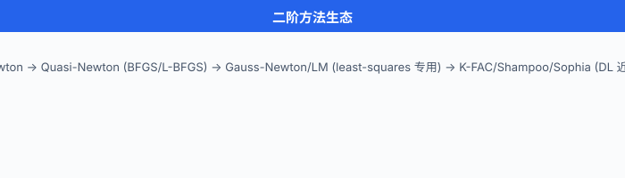

# 二阶方法

> **一句话总结**: 二阶方法把损失函数的曲率也算进来 —— 用 Hessian 把椭球局部圆化, Newton 一步跨到底; 参数一多 Hessian 存不下, 于是 BFGS/L-BFGS/K-FAC/Shampoo 各显神通做**近似**.

*一阶方法看得见坡度, 二阶方法看得见山型. 站在一个椭长的山谷里, 梯度只告诉你"最陡是哪个方向", 却不告诉你"沿这个方向该跨多大一步" —— 它对短轴敏感, 对长轴迟钝, 于是来回震荡. 而牛顿法 (Newton's method) 拿到 Hessian 后, 先把椭球在这一点的局部形状**圆化**, 再沿"圆化后的最陡方向"跨出去 —— 那一步几乎精确落在谷底. 这就是二阶方法的魔力. 代价也很直白: Hessian 是 $n \times n$ 的怪物, 存不下、求逆更慢. 于是有了信赖域 (trust region) 限制步长、拟牛顿 (quasi-Newton) 用梯度差分估 Hessian、L-BFGS 只存最近几步的历史、Gauss-Newton 与 Levenberg-Marquardt 专门吃 least-squares 结构、Kronecker-factored Approximate Curvature (K-FAC) 用 Kronecker 分解把 DL 里几十亿参数的曲率硬压成两个小矩阵的乘积. 这一节我们把这条从"教科书牛顿"到"现代 DL 优化器"的完整链路走一遍.*

- 上一节我们看到, 一阶方法用一阶泰勒展开——沿负梯度走小步. 它简单、便宜、几乎不占内存, 但**盯着坡度**不看**曲率**, 所以在病态问题 (条件数大) 上举步维艰.
- 二阶方法用二阶泰勒展开——多一项 Hessian, 收敛快到令人上瘾 (**局部二次收敛**: 每一步误差取平方), 但存储与求逆代价陡然升高.
- 现代大模型训练 (billions of params) 让完整 Hessian 彻底不可行, 于是 K-FAC / Shampoo / Sophia 用**结构化近似**把二阶信息重新塞回 DL —— 这是 2018 以后的一条重要战线.

## 一阶 vs 二阶: 直觉图解

- 一阶 gradient descent (GD):
$$x_{k+1} = x_k - \eta \, \nabla f(x_k)$$

- 二阶 Newton:
$$x_{k+1} = x_k - [\nabla^2 f(x_k)]^{-1} \, \nabla f(x_k)$$

- 差别就在中间那把"矩阵尺子" $[\nabla^2 f]^{-1}$. GD 用**同一个标量 $\eta$** 缩放梯度所有方向 —— 若不同方向的曲率相差 $10^3$ 倍, 就必须选一个折中步长, 结果沿曲率大的方向走小步、沿曲率小的方向走大步都不合适. Newton 则用 Hessian 的逆**分别**为每个方向选步长: 曲率大的方向 (峭壁) 步子小, 曲率小的方向 (缓坡) 步子大.

- **椭球圆化直觉**: 二次函数 $f(x) = \frac{1}{2} x^\top H x$ 的等高面是椭球. 做变量替换 $y = H^{1/2} x$, 椭球变成圆 —— 在这个圆化坐标里, 梯度下降**一步就到底** (因为圆内所有半径方向都对称). 而 $y$ 空间的一步梯度对应 $x$ 空间的 Newton 步. 所以 Newton = "先圆化再下降"; GD 在原椭球坐标里绕之字.

- **条件数视角**: 定义 $H$ 的**条件数 (condition number)** $\kappa = \lambda_{\max}(H) / \lambda_{\min}(H)$. GD 的迭代复杂度是 $O(\kappa \log(1/\epsilon))$ —— 条件数越差, 走得越慢, 病态问题 ($\kappa = 10^6$) 直接跪. Newton 的复杂度**与 $\kappa$ 无关** —— 因为 $H^{-1}$ 抵消了曲率差异. 这是二阶方法能在病态问题上碾压一阶的根本原因.


## 牛顿法完整推导

- 在当前点 $x_k$ 附近做二次逼近:

$$f(x_k + p) \approx f(x_k) + \nabla f(x_k)^\top p + \frac{1}{2} p^\top H_k p, \quad H_k = \nabla^2 f(x_k)$$

- 把这个**二次模型 $m_k(p)$** 对 $p$ 求极小, 令 $\nabla_p m_k = 0$:

$$\nabla f(x_k) + H_k p = 0 \implies p^* = -H_k^{-1} \nabla f(x_k)$$

- 于是 Newton 更新:

$$\boxed{x_{k+1} = x_k - H_k^{-1} \nabla f(x_k)}$$

- **局部二次收敛 (quadratic convergence)**: 若 $H(x^*)$ 正定且 Lipschitz 连续, 存在邻域 $B$ 使得从 $B$ 出发的 Newton 迭代满足
$$\|x_{k+1} - x^*\| \le C \|x_k - x^*\|^2$$
即每一步误差**平方式**缩小. 精度从 $10^{-2}$ 到 $10^{-16}$ 只需要约 4-5 步. 一阶 GD 的线性收敛 $\|x_{k+1} - x^*\| \le \rho \|x_k - x^*\|$ 要几百上千步, 差距惊人.

- **缺点很硬**:
  - Hessian 存储 $O(n^2)$: $n = 10^6$ 就要 $8 \times 10^{12}$ Byte $= 8$ TB. 对 DL 参数量彻底不可行.
  - Hessian 求逆 $O(n^3)$: 即使用共轭梯度求 $H p = g$, 每步也要 $O(n^2)$ 乘法 (若 Hessian 是稠密的).
  - **Hessian 未必正定**: 远离最优点时 $H$ 可能有负特征值, Newton 步可能不下降! 甚至跨到鞍点或发散. 这就要求信赖域或**阻尼 Newton (damped Newton)** —— 加线搜索保安全.

- **修正策略**: 遇到 $H$ 非正定, 常用 **修正 Cholesky (modified Cholesky)** 加一个最小对角修正 $\tau I$ 让 $H + \tau I \succ 0$; 或者用 $|H|$ (取特征值的绝对值) 代 $H$ —— 这在鞍点附近很关键 (deep learning 里的鞍点问题, Dauphin et al. 2014 就是靠这个思路提出 saddle-free Newton).

## 信赖域方法

- 信赖域 (trust region) 承认 "二次模型只在小邻域内可信". 于是每步在半径 $\Delta_k$ 的球内极小化模型:

$$\min_p \; m_k(p) = f(x_k) + \nabla f(x_k)^\top p + \frac{1}{2} p^\top H_k p \quad \text{s.t.} \quad \|p\| \le \Delta_k$$

- **半径自适应策略**: 定义"实际下降 / 模型预测下降"的比值
$$\rho_k = \frac{f(x_k) - f(x_k + p_k)}{m_k(0) - m_k(p_k)}$$
  - $\rho_k > 0.75$ 且 $\|p_k\| = \Delta_k$: 模型很准, **扩大** $\Delta_{k+1} = 2 \Delta_k$.
  - $\rho_k \in [0.25, 0.75]$: 保持 $\Delta_{k+1} = \Delta_k$.
  - $\rho_k < 0.25$: 模型不准, **收缩** $\Delta_{k+1} = \Delta_k / 4$.
  - $\rho_k < 0$ (根本没下降): 拒绝这一步, $x_{k+1} = x_k$, 继续收缩.

- **子问题的求解**: 带球约束的二次规划有闭式 KKT 条件 (Moré-Sorensen 1983), 但更实用的是 **Steihaug-CG** —— 从 0 出发跑共轭梯度求 $H_k p = -\nabla f$, 一旦步长超出球边界就沿最新方向找与球交点停下. 这样每步只用 Hessian-vector product (HVP), **不需要显式存 Hessian**.

- 信赖域在**非凸问题**上格外可靠, 是 SciPy `trust-ncg` / `trust-krylov` 的实现基础.

## 拟牛顿法: 用梯度差分估计 Hessian

- 存不下 $n \times n$ 的 Hessian? 那就**不显式算**它, 用连续两步梯度的差分**估**出来. 这就是拟牛顿 (quasi-Newton) 家族的核心思想.

- 定义步差 $s_k = x_{k+1} - x_k$, 梯度差 $y_k = \nabla f(x_{k+1}) - \nabla f(x_k)$. 由 Taylor:
$$\nabla f(x_{k+1}) \approx \nabla f(x_k) + H_k s_k \implies y_k \approx H_k s_k$$

- 我们希望**近似 Hessian** $B_{k+1}$ 满足 **secant equation (割线方程)**:

$$\boxed{B_{k+1} s_k = y_k}$$

- 这是 $n$ 个方程, 而 $B_{k+1}$ 有 $n(n+1)/2$ 个自由参数, 严重欠定. 于是选**低秩修正**: $B_{k+1} = B_k + (\text{rank-1 或 rank-2 项})$, 让 $B$ 尽量接近 $B_k$ 同时满足割线方程.

### BFGS 更新公式

- **BFGS (Broyden-Fletcher-Goldfarb-Shanno)** 用 rank-2 更新:

$$\boxed{B_{k+1} = B_k + \frac{y_k y_k^\top}{y_k^\top s_k} - \frac{B_k s_k s_k^\top B_k}{s_k^\top B_k s_k}}$$

- 逐项拆解:
  - 第一项 $\frac{y_k y_k^\top}{y_k^\top s_k}$: rank-1 项, 让新的 $B$ **满足割线方程**. 直接验证 $B_{k+1} s_k = B_k s_k + y_k \frac{y_k^\top s_k}{y_k^\top s_k} - B_k s_k \frac{s_k^\top B_k s_k}{s_k^\top B_k s_k} = y_k$. 完美对上.
  - 第二项 $-\frac{B_k s_k s_k^\top B_k}{s_k^\top B_k s_k}$: 减掉 $B_k$ 在 $s_k$ 方向的"旧"贡献 —— 因为割线方程已经指定这个方向的行为.
  - 正定性: 若 $y_k^\top s_k > 0$ (曲率条件, 严格凸下自动满足, 一般用 Wolfe 线搜索保证), 则 $B_{k+1}$ 也正定.

- 我们实际需要的是 $H_k^{-1}$ 而不是 $H_k$ 本身. **BFGS 的天赋**在于, 它可以直接维护逆 $M_k = B_k^{-1}$ 的更新公式 (Sherman-Morrison 一路推出):

$$M_{k+1} = \left(I - \frac{s_k y_k^\top}{y_k^\top s_k}\right) M_k \left(I - \frac{y_k s_k^\top}{y_k^\top s_k}\right) + \frac{s_k s_k^\top}{y_k^\top s_k}$$

- 每步只需 **两次矩阵-向量乘**, $O(n^2)$. 相比完整 Newton 的 $O(n^3)$ 求逆, 大幅便宜; 但仍存 $O(n^2)$ 矩阵, $n = 10^5$ 就吃不消.

### L-BFGS: 只记最近 m 组历史

- **L-BFGS (Limited-memory BFGS)** (Liu & Nocedal, 1989) 干脆**不存** $M_k$, 只保留最近 $m$ 组 $(s_i, y_i)$ (典型 $m = 5 \sim 20$). 内存降到 $O(mn)$, 对 $n = 10^7$ 也只要百兆量级.

- 计算 $M_k \nabla f_k$ 用著名的 **two-loop recursion** (双循环递归):

```
输入: g = ∇f(x_k), 历史 {(s_i, y_i, ρ_i = 1/(y_i^T s_i))}, i = k-1, ..., k-m
q = g
# 第一遍循环 (逆序):
for i = k-1, k-2, ..., k-m:
    α_i = ρ_i * s_i^T q
    q   = q - α_i * y_i
r = H_0 * q          # H_0 常取 γ_k I, γ_k = (s_{k-1}^T y_{k-1}) / (y_{k-1}^T y_{k-1})
# 第二遍循环 (顺序):
for i = k-m, ..., k-1:
    β = ρ_i * y_i^T r
    r = r + (α_i - β) * s_i
return r  # ≈ M_k g
```

- 每步 $O(mn)$ 计算 —— 对 $m = 10$, $n = 10^7$, 一步只要 $10^8$ 次浮点运算, 比完整 Newton 便宜 5 个量级. L-BFGS 是**中等规模凸优化的事实标准**: SciPy 提供 `method='L-BFGS-B'`, TensorFlow Probability 提供 `tfp.optimizer.bfgs_minimize`; MATLAB `fminunc` 中型问题默认用 quasi-Newton (BFGS), L-BFGS 是常见替代.

- **L-BFGS-B 中的 B**: 加一层 box 约束 $l \le x \le u$, 用 active-set 策略处理边界坐标, 是有约束优化的常见选择.

- **收敛速率**: L-BFGS 在强凸目标上是**超线性收敛 (superlinear)** —— 比线性收敛快, 但达不到完整 Newton 的二次. 直觉: 随着历史信息累积, $M_k$ 越接近真 $H^{-1}$, 收敛率不断改善.

## 从零手写 Newton for logistic regression

- 用一个真实小任务把 Newton 端到端写一遍. 逻辑回归的负对数似然
$$f(w) = \sum_{i=1}^n \Bigl[ -y_i (x_i^\top w) + \log(1 + e^{x_i^\top w}) \Bigr]$$
是**严格凸 + 二阶可导**, Hessian 有干净的解析式:
$$\nabla f(w) = X^\top (\sigma(Xw) - y), \quad \nabla^2 f(w) = X^\top D X, \quad D = \mathrm{diag}(\sigma_i (1 - \sigma_i))$$
其中 $\sigma(z) = 1/(1+e^{-z})$, $\sigma_i = \sigma(x_i^\top w)$.

```python
import numpy as np
from sklearn.datasets import make_classification

# ---- 生成数据 ----
X, y = make_classification(n_samples=500, n_features=20, random_state=0)
n, d = X.shape
X = np.hstack([X, np.ones((n, 1))])          # 加偏置列
w = np.zeros(d + 1)

def sigmoid(z):
    return 1 / (1 + np.exp(-z))

def loss(w):
    z = X @ w
    # 用 log-sum-exp 稳态形式: log(1+e^z) = softplus
    return np.sum(np.logaddexp(0, z) - y * z)

def grad(w):
    return X.T @ (sigmoid(X @ w) - y)

def hess(w):
    p = sigmoid(X @ w)
    D = p * (1 - p)                            # 对角 (n,)
    return (X * D[:, None]).T @ X              # (d+1, d+1)

# ---- Newton 迭代 ----
print(f"{'iter':>4} | {'loss':>10} | {'||grad||':>10}")
for k in range(15):
    g = grad(w)
    H = hess(w)
    p = np.linalg.solve(H + 1e-8 * np.eye(d + 1), g)   # 阻尼保证数值稳定
    w = w - p
    print(f"{k:>4} | {loss(w):>10.6f} | {np.linalg.norm(g):>10.2e}")
```

- 你会看到 loss 在 5-6 步内收敛到机器精度, $\|\nabla f\|$ 每步近似平方式下降 —— 这就是二次收敛的实证. 对比 SGD 跑 100 步都未必到这个精度.

- **注意 IRLS 联系**: 上面的 Newton 步 $p = (X^\top D X)^{-1} X^\top (\sigma(Xw) - y)$ 展开就是每步做**加权最小二乘 (Weighted Least Squares, WLS)**. 这就是**迭代重加权最小二乘 (Iteratively Reweighted Least Squares, IRLS)**, 广义线性模型 (GLM) 家族的标准求解器. `sklearn.linear_model.LogisticRegression(solver='newton-cg')` 底层就是这套. 换言之: 逻辑回归、泊松回归、Gamma 回归的经典训练算法, 都是 Newton 的直接产物.

### IRLS 三步推导: L1 与 Huber 的权重矩阵

- 上面逻辑回归的 IRLS 是你最熟悉的例子 —— 但 IRLS 远不止 GLM. 对任意光滑损失 $\sum_i \rho(r_i)$, 只要把最优化条件改写一下就得到加权最小二乘. 这里走一遍三步推导, 以 L1 和 Huber 做示范.

- **Step 1: 把梯度条件伪装成加权最小二乘的正规方程**

  - 对残差 $r_i(x)$ 和损失函数 $\rho(r)$, 目标 $f(x) = \sum_{i=1}^n \rho(r_i(x))$ 的梯度:
  $$\nabla f(x) = \sum_{i=1}^n \rho'(r_i) \cdot \nabla r_i(x)$$

  - 关键技巧: 定义**权重函数** $w(r) = \rho'(r) / r$ (当 $r \neq 0$). 于是 $\rho'(r_i) = w(r_i) \cdot r_i$, 代入梯度:
  $$\nabla f(x) = \sum_{i=1}^n w(r_i) \cdot r_i \cdot \nabla r_i(x)$$

  - 这恰好是**加权最小二乘**目标 $\frac{1}{2} \sum_i w_i r_i^2$ 的梯度! 也就是说, 若权重 $w_i$ 固定, 寻找 $\nabla f(x) = 0$ 等价于解加权最小二乘:
  $$x^* = \arg\min_x \frac{1}{2} \sum_{i=1}^n w_i \, r_i(x)^2$$

  - 对线性模型 $r_i = a_i^\top x - b_i$, 这就是正规方程 $A^\top W A x = A^\top W b$, 其中 $W = \mathrm{diag}(w_1, \dots, w_n)$.

- **Step 2: 代入 L1 和 Huber 的具体权重函数**

  - **L1 损失** $\rho(r) = |r|$:
    - $\rho'(r) = \mathrm{sign}(r)$
    - $w(r) = \frac{\mathrm{sign}(r)}{r} = \frac{1}{|r|}$ (对 $r \neq 0$)
    - 注意: $r = 0$ 时权重爆炸, 实际加一个小常数做 **regularized IRLS**: $w(r) = 1 / \sqrt{r^2 + \epsilon}$.
    - **直觉**: 残差大的点权重小 (可能是离群点), 残差小的点权重大 —— 自动"忽略离群点"正是 L1 比 L2 更鲁棒 (robust) 的根源.

  - **Huber 损失** (阈值 $\delta > 0$):
  $$\rho(r) = \begin{cases} \frac{1}{2} r^2, & |r| \le \delta \\ \delta |r| - \frac{1}{2} \delta^2, & |r| > \delta \end{cases}$$
    - 导数: $\rho'(r) = \begin{cases} r, & |r| \le \delta \\ \delta \cdot \mathrm{sign}(r), & |r| > \delta \end{cases}$
    - 权重: $w(r) = \begin{cases} 1, & |r| \le \delta \\ \delta / |r|, & |r| > \delta \end{cases}$
    - **直觉**: 小残差照常 L2 (权重 1), 大残差降权 (像 L1 那样压离群点的影响). 这就是 Huber 把 L2 的光滑与 L1 的鲁棒缝合在一起的方式.

- **Step 3: IRLS 迭代 —— 权重和参数交替更新**

  - 权重 $w_i$ 依赖残差 $r_i$, 残差又依赖参数 $x$ —— 鸡生蛋蛋生鸡. 那就**交替迭代**:
  $$
  \begin{aligned}
  & \text{给定 } x^{(k)}, \text{ 计算残差 } r_i^{(k)} = r_i(x^{(k)}) \\
  & \text{算权重 } w_i^{(k)} = w(r_i^{(k)}) \\
  & \text{解加权最小二乘: } x^{(k+1)} = \arg\min_x \frac{1}{2} \sum_i w_i^{(k)} r_i(x)^2
  \end{aligned}
  $$

  - 对线性模型 $r = Ax - b$, 第三步是闭式:
  $$x^{(k+1)} = (A^\top W^{(k)} A)^{-1} A^\top W^{(k)} b, \quad W^{(k)} = \mathrm{diag}(w_1^{(k)}, \dots, w_n^{(k)})$$

  - **与 Newton 的联系**: 若把 $\rho$ 的 Hessian 写成 $\nabla^2 f = A^\top W A + \sum_i \rho''(r_i) \nabla r_i \nabla r_i^\top$, IRLS 只保留第一项 $A^\top W A$, 等价于**忽略 Hessian 中 $\rho''$ 项**的近似 Newton. 当 $\rho$ 接近二次 (如 Huber 在小残差区域 $\rho'' = 1$), 这个近似很准; 对 L1 ($\rho'' = 0$ a.e.) 则完全等价.

  - **收敛性**: 只要 $\rho$ 是凸函数, 每步 IRLS 的目标值单调下降 (Green 1984). 对 L1, 收敛到唯一解 (若 $A$ 列满秩); 对 Huber, 收敛到凸优化的全局最优.

- **代码示例 —— IRLS 求解 L1 回归**:

```python
import numpy as np

def irls_l1(A, b, eps=1e-6, max_iter=200):
    """IRLS for L1 regression: min_x ||Ax - b||_1"""
    n, d = A.shape
    x = np.linalg.lstsq(A, b, rcond=None)[0]  # L2 解作初值
    for k in range(max_iter):
        r = A @ x - b
        w = 1.0 / np.sqrt(r**2 + 1e-6)          # 正则化权重
        W = np.diag(w)
        x_new = np.linalg.solve(A.T @ W @ A + 1e-10 * np.eye(d), A.T @ W @ b)
        if np.linalg.norm(x_new - x) < eps:
            break
        x = x_new
    return x

# 测试: 10% 离群点
np.random.seed(0)
A = np.random.randn(100, 5)
x_true = np.array([1.5, -2.0, 0.5, 3.0, -1.0])
b = A @ x_true + 0.1 * np.random.randn(100)
b[np.random.choice(100, 10)] += 50 * np.random.randn(10)  # 离群点

x_l1 = irls_l1(A, b)
x_l2 = np.linalg.lstsq(A, b, rcond=None)[0]
print(f"L1 解: {x_l1.round(4)}")
print(f"L2 解: {x_l2.round(4)}")
print(f"真值 : {x_true}")
```

- 这段代码清晰地展示了 IRLS 的核心结构: 每次迭代就是**用一个对角权重矩阵重新加权, 然后解一个线性方程组**. 计算量 $O(n d^2)$ 每步, 对 $d \ll n$ 的问题非常高效.

- **关键文献**: IRLS 的系统框架来自 Green (1984) "Iteratively Reweighted Least Squares for Maximum Likelihood Estimation", JRSS B; 鲁棒回归的权重视角详见 Holland & Welsch (1977) "Robust Regression Using Iteratively Reweighted Least-Squares"; L1 的 IRLS 收敛性分析见 Daubechies, DeVore, Fornasier & Gunturk (2010) "Iteratively Reweighted Least Squares Minimization for Sparse Recovery".

## Gauss-Newton 与 Levenberg-Marquardt

- 当目标是 **least-squares** 形式 $f(x) = \frac{1}{2} \|r(x)\|^2 = \frac{1}{2} \sum_i r_i(x)^2$ (回归、SLAM、光束平差), Hessian 有特殊结构:
$$\nabla f = J^\top r, \quad \nabla^2 f = J^\top J + \sum_i r_i \nabla^2 r_i$$
其中 $J$ 是残差 $r$ 关于 $x$ 的 Jacobian.

- **Gauss-Newton (GN)** 忽略第二项 (对小残差问题它接近 0):
$$H \approx J^\top J, \quad p_{GN} = -(J^\top J)^{-1} J^\top r$$
这本质是每步解一个**线性最小二乘** $\min_p \|J p + r\|^2$, 用 QR 或 SVD 求解, 数值稳定.

- **GN 的问题**: $J^\top J$ 可能奇异或病态, 尤其在初值远、rank-deficient 时步长爆炸.

- **Levenberg-Marquardt (LM)** (Levenberg 1944; Marquardt 1963) 加正则化 $\lambda I$:
$$\boxed{p_{LM} = -(J^\top J + \lambda I)^{-1} J^\top r}$$
- $\lambda \to 0$: 回到 GN, 快 (二次收敛).
- $\lambda \to \infty$: 步长变小, $p \approx -\frac{1}{\lambda} J^\top r$, 就是 gradient descent.
- LM 的 $\lambda$ 用信赖域策略自适应: 步不下降就升 $\lambda$, 下降就降 $\lambda$.

- **应用**: 3D 重建 / bundle adjustment / SLAM (Ceres solver, g2o) / PnP / camera calibration / 神经渲染的 pose refinement, 全用 LM. `scipy.optimize.least_squares(method='lm')` 是标准接口.

- **收敛性**: 对小残差问题 ($r(x^*) \approx 0$), GN/LM 都是**局部二次收敛**, 与完整 Newton 一样快; 对大残差问题, 忽略的二阶项非零, 只能保证线性收敛 —— 这时 LM 的 $\lambda I$ 拉回 GD 反而更稳.

- **代码示例**:

```python
from scipy.optimize import least_squares
import numpy as np

# 拟合 y = a * exp(-b * x) 到含噪声数据
np.random.seed(0)
x_data = np.linspace(0, 4, 50)
y_data = 2.5 * np.exp(-1.3 * x_data) + 0.05 * np.random.randn(50)

def residual(params, x, y):
    a, b = params
    return a * np.exp(-b * x) - y

# LM 求解
result = least_squares(residual, x0=[1.0, 1.0], args=(x_data, y_data), method='lm')
print(f"拟合参数: a = {result.x[0]:.4f}, b = {result.x[1]:.4f}")
print(f"残差平方和: {0.5 * np.sum(result.fun**2):.6f}")
print(f"迭代次数: {result.nfev}")
```

## 二阶方法在深度学习中的应用

- 完整 Newton 在 DL 里彻底没戏 —— GPT-3 有 175 B 参数, Hessian 就是 $(1.75 \times 10^{11})^2 \approx 3 \times 10^{22}$ 元素, 用 float64 存需 $\approx 2.5 \times 10^{23}$ Byte $= 2.5 \times 10^{11}$ TB. 只能**近似**.

### 为什么全 Hessian 不可行

- 存储 $O(n^2)$: 大模型 $n = 10^9 \sim 10^{12}$, Hessian $10^{18} \sim 10^{24}$ 元素.
- 求逆 $O(n^3)$: 天文数字.
- 就算能存能算, Hessian 在 mini-batch 上噪声极大, 二次模型信任度低.

- 现代 DL 二阶优化器的路线是: **要么低秩近似 (K-FAC/Shampoo), 要么只算对角 (Sophia/AdaHessian), 要么只算 HVP (Hessian-free/Krylov)**.

### K-FAC (Martens & Grosse, 2015)

- **Kronecker-factored Approximate Curvature (K-FAC)** 是 DL 二阶方法的里程碑. 关键洞察: **一层 FC 的 Fisher 矩阵 (natural gradient 需要) 可以近似分解成两个小矩阵的 Kronecker 积**.

- 设一层的输入激活 $a \in \mathbb{R}^{d_{in}}$, 输出梯度 $g \in \mathbb{R}^{d_{out}}$. 该层权重 $W \in \mathbb{R}^{d_{out} \times d_{in}}$ 的 Fisher 元素涉及 $\mathbb{E}[a a^\top \otimes g g^\top]$. K-FAC 近似为 $\mathbb{E}[a a^\top] \otimes \mathbb{E}[g g^\top]$ (独立性假设):

$$F_\ell \approx A_\ell \otimes G_\ell, \quad A_\ell = \mathbb{E}[a a^\top], \; G_\ell = \mathbb{E}[g g^\top]$$

- Kronecker 积的**神奇性质**: $(A \otimes G)^{-1} = A^{-1} \otimes G^{-1}$. 求逆一个 $d_{out} d_{in} \times d_{out} d_{in}$ 的大矩阵, 变成分别求逆两个 $d \times d$ 的小矩阵, 计算量从 $O((d_{out} d_{in})^3)$ 骤降到 $O(d_{out}^3 + d_{in}^3)$.

- 例: $W \in \mathbb{R}^{1024 \times 1024}$, 完整 Fisher $10^{12}$ 元素, K-FAC 只存 $2 \times 10^6$. 收益 $10^6$ 倍.

```python
# K-FAC 骨架 (伪代码, 每层每步)
def kfac_step(layer, lr):
    # 1) 前向: 缓存激活 a
    a = layer.input_activation                  # (B, d_in)
    # 2) 反向: 缓存输出梯度 g
    g = layer.output_grad                       # (B, d_out)
    # 3) 更新 Kronecker 因子 (指数滑动)
    A = ema * A + (1 - ema) * (a.T @ a) / B     # (d_in, d_in)
    G = ema * G + (1 - ema) * (g.T @ g) / B     # (d_out, d_out)
    # 4) 求逆 (每若干步一次, 加阻尼 damping)
    A_inv = np.linalg.inv(A + lam * np.eye(d_in))
    G_inv = np.linalg.inv(G + lam * np.eye(d_out))
    # 5) 预条件梯度: (A^-1 ⊗ G^-1) vec(∇W) = G_inv @ ∇W @ A_inv
    grad_W = layer.weight.grad
    nat_grad = G_inv @ grad_W @ A_inv
    # 6) 更新
    layer.weight -= lr * nat_grad
```

- K-FAC 在 CNN、RNN 上都有变体 (Grosse & Martens 2016), 是自然梯度在深度网络里的第一个实用化实现.

### Shampoo (Gupta et al., ICML 2018, Google)

- **Shampoo** 把 K-FAC 的思想推广到**张量结构**. 对 $r$ 阶张量参数 $W \in \mathbb{R}^{d_1 \times d_2 \times \cdots \times d_r}$, 沿每个模计算一个预条件矩阵 $L_i \in \mathbb{R}^{d_i \times d_i}$, 更新时用 $L_i^{-1/4}$ 依次乘参数. Google 在 2023 内部部署 Distributed Shampoo, 训练大规模 recommendation model 与部分 LLM 收益显著.

### Sophia (Liu et al., 2023, Stanford)

- **Sophia (Second-order Clipped Stochastic Optimization)** 只估**对角** Hessian, 每步用 Hutchinson 估计器 (随机向量点积) 更新:
$$\hat h_t = \beta_2 \hat h_{t-1} + (1 - \beta_2) \cdot \text{diag}(H \cdot v)|_v, \quad v \sim \mathcal{N}(0, I)$$
$$w_{t+1} = w_t - \eta \cdot \text{clip}\left(\frac{g_t}{\max(\hat h_t, \epsilon)}, \rho\right)$$
论文报 GPT-2 训练收敛速度比 Adam 快 2x. 关键卖点: **对角 Hessian 存储只 $O(n)$, 与 Adam 同量级**, 部署代价可接受.

### AdaHessian (Yao et al., AAAI 2021)

- 更早的对角 Hessian 优化器. 用 Hutchinson trace 估计器算 diag(H), 再类 Adam 地做二阶自适应. 已用于 BERT-scale 训练.

### Hessian-free / Krylov (Martens, 2010)

- 不存 Hessian, 只用 **HVP** $Hv$ 跑共轭梯度解 $Hp = -g$. 每次 HVP 用**反向自动微分**在 $O(n)$ 完成 (下节讲). 每步几十次 CG 迭代. 曾经是 DL 二阶的希望, 但被 Adam 抢了大众市场, 现在还活在 physics-informed NN 与部分 RL 里.

## 自然梯度

- **自然梯度 (natural gradient)** (Amari, 1998) 在参数空间引入信息几何: 概率分布之间的距离不是欧氏的, 而是 KL 散度. 与之相配的最陡下降方向不再是 $-\nabla f$, 而是
$$\nabla_\text{nat} f = F^{-1} \nabla f$$
其中 $F$ 是 **Fisher information matrix (Fisher 信息矩阵)**:
$$F = \mathbb{E}_{p(y|x, \theta)} \bigl[ \nabla_\theta \log p \cdot \nabla_\theta \log p^\top \bigr]$$

- 关键事实: 对交叉熵损失 + softmax 输出, **Fisher = Gauss-Newton 近似 Hessian**. 所以自然梯度、Gauss-Newton、二阶方法在这个语境下几乎是同一回事.

- 自然梯度的**参数化不变性**: 换一种参数化 (如 $\theta \to \theta / 2$), 普通梯度下降轨迹会变, 自然梯度不变. 这是它数学上的迷人之处.

- **与 K-FAC 的联系**: K-FAC 就是"Fisher 用 Kronecker 分解近似"的自然梯度, 是自然梯度进入深度网络的第一个可扩展实现. 后来的 KFRA / EKFAC / Shampoo 都是这条脉络的延伸.

## HVP: 反向自动微分下的 O(n) 二阶信息

- 大新闻: 即使 Hessian 存不下, **Hessian-vector product (HVP)** $Hv$ 可以在 $O(n)$ 时间内算出来 —— 无需构造 $H$! 关键是**反向模式的二阶自动微分**:
$$Hv = \nabla_x \bigl( \nabla f(x)^\top v \bigr)$$
即"$\nabla f$ 与 $v$ 内积后, 对 $x$ 再求一次梯度". PyTorch 里就是两次 backward.

```python
import torch

def rosenbrock(x):
    return (1 - x[0])**2 + 100 * (x[1] - x[0]**2)**2

x = torch.tensor([0.5, 0.5], requires_grad=True)
v = torch.tensor([1.0, 0.0])                          # 任意方向

# 方法 1: 手动两次 backward
f = rosenbrock(x)
g = torch.autograd.grad(f, x, create_graph=True)[0]   # ∇f, 保留计算图
gv = g @ v                                            # ∇f · v (标量)
Hv = torch.autograd.grad(gv, x)[0]                    # ∇(∇f · v) = Hv
print(f"Hv (手动) = {Hv}")

# 方法 2: 直接用 torch.autograd.functional.hvp
from torch.autograd.functional import hvp
val, Hv2 = hvp(rosenbrock, x.detach(), v)
print(f"Hv (API)  = {Hv2}")

# 对比: 显式 Hessian
from torch.autograd.functional import hessian
H = hessian(rosenbrock, x.detach())
print(f"Hessian   =\n{H}")
print(f"H @ v     = {H @ v}")
```

- 输出三种方式的 $Hv$ 应完全一致. 有了 HVP, **共轭梯度**求 $Hp = -g$ 每步只做 HVP, 总代价 $O(k n)$, $k$ 是 CG 步数 (通常 $\ll n$). 这就是 Hessian-free 优化的技术基石.

## 实战: SciPy L-BFGS 求解逻辑回归

- 中小数据 (数万样本), L-BFGS 通常比 SGD **收敛更快、精度更高**. SciPy 一行搞定:

```python
import numpy as np
from scipy.optimize import minimize
from sklearn.datasets import load_breast_cancer
from sklearn.preprocessing import StandardScaler

data = load_breast_cancer()
X = StandardScaler().fit_transform(data.data)
X = np.hstack([X, np.ones((X.shape[0], 1))])
y = data.target
n, d = X.shape

def neg_log_lik(w):
    z = X @ w
    return np.sum(np.logaddexp(0, z) - y * z)

def grad_nll(w):
    return X.T @ (1 / (1 + np.exp(-X @ w)) - y)

# ---- L-BFGS ----
res = minimize(neg_log_lik, np.zeros(d), jac=grad_nll,
               method='L-BFGS-B', options={'gtol': 1e-8})
print(f"L-BFGS: converged in {res.nit} iters, loss = {res.fun:.6f}")

# ---- 对比 SGD ----
w = np.zeros(d)
lr, n_epochs = 0.01, 100
for epoch in range(n_epochs):
    idx = np.random.permutation(n)
    for i in idx:
        w -= lr * (1 / (1 + np.exp(-X[i] @ w)) - y[i]) * X[i]
print(f"SGD   : {n_epochs * n} steps, loss = {neg_log_lik(w):.6f}")
```

- 你会看到 L-BFGS 用几十次迭代收敛到 loss ~ $10^{-5}$ 精度, 而 SGD 跑同样的浮点量只到 $10^{-2}$. 对**中等规模凸问题**, L-BFGS 是首选. 大规模 DL 上换 SGD/Adam 的原因是 batch 噪声 + 内存约束, 不是"L-BFGS 不好".

## 何时用二阶?

- **凸问题 + 参数不多 (< 10^5)**: 首选 Newton / L-BFGS. SciPy / MATLAB / R 里的 GLM 求解器全用 IRLS (本质就是 Newton).
- **Least-squares 结构** (曲线拟合、SLAM、bundle adjustment): 首选 LM. Ceres solver / g2o / MATLAB `lsqnonlin`.
- **非凸 + 中等规模**: Trust-region Newton (SciPy `trust-ncg`), 比线搜索 Newton 更稳健.
- **深度学习** (billions of params):
  - 大部分场景仍是 Adam / AdamW 一阶.
  - 想上二阶的选项: K-FAC (JAX-optax 有实现), Shampoo (Google-internal + JAX open-source), Sophia (Stanford 开源).
  - Physics-informed NN / small MLP: Hessian-free 或 L-BFGS 都可用.
- **不建议用二阶的场景**: 极大规模 (>10^10 params) 且 batch 噪声大、Hessian 极不稳定; 或参数含离散/不可微部分.



## 参考文献

- Nocedal, J., & Wright, S. J. *Numerical Optimization* (2nd ed.). Springer, 2006. 章节 6-10 覆盖 Newton、拟牛顿、L-BFGS、信赖域, 是本节主要来源.
- Byrd, R. H., Lu, P., Nocedal, J., & Zhu, C. "A Limited Memory Algorithm for Bound Constrained Optimization". *SIAM Journal on Scientific Computing*, 16(5): 1190-1208, 1995. L-BFGS-B 的原始论文.
- Liu, D. C., & Nocedal, J. "On the Limited Memory BFGS Method for Large Scale Optimization". *Mathematical Programming*, 45(1): 503-528, 1989. L-BFGS 首次系统提出.
- Levenberg, K. "A Method for the Solution of Certain Non-Linear Problems in Least Squares". *Quarterly of Applied Mathematics*, 2(2): 164-168, 1944. LM 中的 L.
- Marquardt, D. W. "An Algorithm for Least-Squares Estimation of Nonlinear Parameters". *Journal of the Society for Industrial and Applied Mathematics*, 11(2): 431-441, 1963. LM 中的 M.
- Amari, S. "Natural Gradient Works Efficiently in Learning". *Neural Computation*, 10(2): 251-276, 1998. 自然梯度的开山之作.
- Martens, J. "Deep Learning via Hessian-free Optimization". *ICML 2010*. HF 方法把 HVP + CG 组合搬进 DL.
- Martens, J., & Grosse, R. "Optimizing Neural Networks with Kronecker-factored Approximate Curvature". *ICML 2015*. K-FAC 首次提出.
- Grosse, R., & Martens, J. "A Kronecker-factored Approximate Fisher Matrix for Convolution Layers". *ICML 2016*. K-FAC 的 CNN 扩展.
- Gupta, V., Koren, T., & Singer, Y. "Shampoo: Preconditioned Stochastic Tensor Optimization". *ICML 2018* (arXiv 1802.09568). Shampoo 首次提出.
- Dauphin, Y., Pascanu, R., Gulcehre, C., Cho, K., Ganguli, S., & Bengio, Y. "Identifying and Attacking the Saddle Point Problem in High-Dimensional Non-Convex Optimization". *NeurIPS 2014* (arXiv 1406.2572). Saddle-free Newton 思路.
- Yao, Z., Gholami, A., Shen, S., Mustafa, M., Keutzer, K., & Mahoney, M. W. "AdaHessian: An Adaptive Second Order Optimizer for Machine Learning". *AAAI 2021*. 对角 Hessian + Adam-like 更新.
- Liu, H., Li, Z., Hall, D., Liang, P., & Ma, T. "Sophia: A Scalable Stochastic Second-order Optimizer for Language Model Pre-training". *ICLR 2024* (arXiv 2305.14342, 2023). Sophia 优化器.
- Moré, J. J., & Sorensen, D. C. "Computing a Trust Region Step". *SIAM Journal on Scientific and Statistical Computing*, 4(3): 553-572, 1983. 信赖域子问题的精确解.
- Steihaug, T. "The Conjugate Gradient Method and Trust Regions in Large Scale Optimization". *SIAM Journal on Numerical Analysis*, 20(3): 626-637, 1983. Steihaug-CG.
- Green, P. J. "Iteratively Reweighted Least Squares for Maximum Likelihood Estimation, and Some Robust and Resistant Alternatives". *Journal of the Royal Statistical Society, Series B*, 46(2): 149-192, 1984. IRLS 的系统统计框架.
- Holland, P. W., & Welsch, R. E. "Robust Regression Using Iteratively Reweighted Least-Squares". *Communications in Statistics: Theory and Methods*, 6(9): 813-827, 1977. 鲁棒回归中 IRLS 权重函数的经典论文.
- Daubechies, I., DeVore, R., Fornasier, M., & Güntürk, C. S. "Iteratively Reweighted Least Squares Minimization for Sparse Recovery". *Communications on Pure and Applied Mathematics*, 63(1): 1-38, 2010. L1 IRLS 收敛性分析.

---

## 📌 本节要点

- **Newton 更新 $x_{k+1} = x_k - H_k^{-1} \nabla f(x_k)$**: 直觉是"把椭球局部圆化再沿最陡方向", 局部**二次收敛** —— 每步误差平方式缩小. 缺点是 Hessian 存储 $O(n^2)$、求逆 $O(n^3)$, 且远离最优时可能不正定.
- **信赖域方法**: 在半径 $\Delta_k$ 球内极小化二次模型, 用 $\rho_k$ (实际下降 / 模型下降) 自适应调整 $\Delta$; Steihaug-CG 只用 HVP, 天然适合大规模.
- **拟牛顿 = 用梯度差分估 Hessian**: 割线方程 $B_{k+1} s_k = y_k$; BFGS 用 rank-2 修正保正定; **L-BFGS 只存最近 $m$ 组 $(s, y)$**, 内存 $O(mn)$, 是中等规模凸优化的默认工具.
- **Gauss-Newton / Levenberg-Marquardt**: 专治 least-squares. GN 用 $J^\top J$ 替 Hessian, LM 加 $\lambda I$ 结合 GD 的稳定性. SLAM、bundle adjustment、曲线拟合的看家算法.
- **DL 里全 Hessian 不可行**: $n$ 上亿 → $H$ 上 $10^{20}$ 元素. 只能低秩 / 对角 / HVP 近似.
- **K-FAC + Shampoo + Sophia + AdaHessian**: K-FAC 用 Kronecker 分解压 Fisher, Shampoo 推广到张量, Sophia 与 AdaHessian 只估**对角** Hessian —— 都是把二阶信息塞回大模型训练的实用招.
- **自然梯度 $F^{-1} \nabla f$**: Amari 1998; 参数化不变; 交叉熵下 Fisher = Gauss-Newton Hessian; K-FAC 就是可扩展的自然梯度.
- **HVP $O(n)$ 可算**: 反向自动微分两次即可, 无需构造 $H$. `torch.autograd.functional.hvp` 一行搞定, Hessian-free 与 Krylov 方法的技术基石.

*下一节我们进入投影与近端算法 —— 有了梯度、Hessian 与 KKT 的完整武器库, 我们来看如何优雅处理"目标不可微 + 约束/正则化"的现代 ML 三剑客: LASSO、投影梯度、ADMM.*
