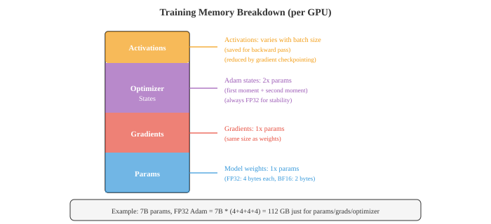

# 分布式与随机优化

> **一句话总结**: 当代深度学习的优化核心是随机一阶方法 (SGD / 动量 / AdamW) 配分布式并行 (数据并行 + ZeRO/FSDP + 张量并行 + 流水线并行), 本节给读者一份从数学收敛性到工程落地的完整收官清单.

*把模型放到 GPU 上跑一次前向与反向, 数学上只是一次梯度计算. 但训练一个 70 亿参数的 LLM 要喂几万亿 token, 在几千张 GPU 上跑几个月 —— 这里的每一步都依赖随机优化与分布式训练这两套引擎. 上一节我们用内点法、ADMM、Frank-Wolfe 把约束优化的"理论天花板"讲到了顶. 这一节我们反过来 —— 把目光放低, 看真正"训得起、训得动"的优化器: 从全量梯度到随机梯度, 从单纯 SGD 到带动量的 SGD, 从 RMSProp 到 Adam 与 AdamW, 再到 Lion、Sophia 这一代轻量化新方法. 然后我们把镜头拉远, 看你面前的 GPU 集群怎么协同 —— 数据并行 (Data Parallel, DP)、模型并行 (Model Parallel, MP)、流水线并行 (Pipeline Parallel, PP)、张量并行 (Tensor Parallel, TP)、ZeRO/FSDP. 最后用一份实战清单 + 本章总结, 把 Ch24 七节的内容收尾.*

- 这一节既给"数学视角"也给"工程视角": 数学视角回答"为什么 AdamW 取代 Adam""为什么同步 SGD 等价于大 batch", 工程视角回答"什么场景开 FSDP、什么场景上 TP+PP".
- 与 Ch06/05 互补: Ch06/05 重点在工程 (通信原语 / 拓扑 / NCCL), Ch24/07 重点在数学 (收敛性 / 内存公式 / 算法选择).

## 从全量到随机: SGD 的诞生

- **全量梯度下降 (Full-batch Gradient Descent)**: 第 $k$ 步用所有 $N$ 个样本算完整梯度,

$$\theta_{k+1} = \theta_k - \eta \, \nabla L(\theta_k) = \theta_k - \eta \, \frac{1}{N} \sum_{i=1}^{N} \nabla \ell_i(\theta_k)$$

- 其中 $L(\theta) = \frac{1}{N} \sum_{i=1}^{N} \ell_i(\theta)$ 是训练集平均损失. 每步梯度都是**真实方向** (无噪声), 但计算量 $\mathcal{O}(N)$, 大数据集根本跑不起.
- **随机梯度下降 (Stochastic Gradient Descent, SGD)**: Robbins & Monro 1951 提出. 每次只采一个或一小批样本算梯度,

$$\theta_{k+1} = \theta_k - \eta \, \nabla \ell_i(\theta_k), \quad i \sim \text{Uniform}[N]$$

- 数学上 $\mathbb{E}[\nabla \ell_i(\theta)] = \nabla L(\theta)$ —— **无偏估计**, 但单步方差大.
- **收敛率** (Nemirovski & Yudin 1979, 后续 Bottou-Bousquet 2008 综述):
  - **凸 + Lipschitz 梯度**: 步数 $\mathcal{O}(1/\epsilon^2)$ 达到 $\epsilon$ 精度.
  - **强凸 + Lipschitz 梯度**: 步数 $\mathcal{O}(1/\epsilon)$ (线性).
  - **非凸 (DL)**: 收敛到**驻点 (stationary point)**, 步数 $\mathcal{O}(1/\epsilon^2)$.
- 直观: SGD 把"每步代价"从 $\mathcal{O}(N)$ 砍到 $\mathcal{O}(1)$, **多走 $\sqrt{N}$ 倍步**, 总体快 $\sqrt{N}$ 倍 —— 这就是大数据时代首选 SGD 的根因.
- 与 Ch03/05 GD 对比: 那是**确定性**梯度下降, 只对全量数据有意义; SGD 是**采样**视角下的梯度, 把"算梯度"换成了"采一个样本算梯度".

### 直觉: SGD 像醉汉下山

- 全量 GD: 精确看地图, 每步走**最陡方向**, 但每步都慢.
- SGD: 蒙着眼只踩一块石头, 凭**脚的倾斜感**判断方向. 单步快但路径抖动.
- **学习率 $\eta$** 决定醉的程度: 太大 → 震荡不收敛; 太小 → 走成蜗牛. 通常要**随训练衰减** (step decay / cosine schedule / warmup).

### Mini-batch SGD: 工业的折衷

- 实际工程几乎不用纯 SGD (单样本) 也不用 Full-batch GD, 用 **Mini-batch SGD**:

$$\theta_{k+1} = \theta_k - \eta \, \frac{1}{B} \sum_{i \in \mathcal{B}_k} \nabla \ell_i(\theta_k), \quad |\mathcal{B}_k| = B$$

- $B$ 通常取 $32 \sim 8192$: GPU 算力强 (吞吐高) 时取大 $B$ 摊薄通信, GPU 紧张时取小 $B$ 保内存.
- **收敛率与 $B$ 的关系**:
  - 固定总样本数, 大 $B$ (更多算力/步) 噪声方差 $\propto 1/B$, 但**步数少**, 总收敛速度 $\sim \mathcal{O}(1/\sqrt{B})$.
  - 极小 $B = 1$ 时步多但方差大.
  - **最优 $B$** 在理论与实践中差异极大, 经验上 256-2048 是 DL 的"甜区".
- **大 batch 训练陷阱**: 单纯放大 $B$ (不动 $\eta$) 会卡在锐极小值, 泛化变差. 解法:
  - **线性 scaling rule** (Krizhevsky 2014): $B$ 翻倍, $\eta$ 也翻倍.
  - **LARS** (You et al. 2017): 每层独立归一化梯度大小, 适合 $B \ge 8k$.
  - **LAMB** (You et al. 2020): 把 LARS 思路扩展到 Adam 类方法, BERT 预训练把 $B$ 推到 32k+.
  - **Warmup**: 前几千步从 $\eta_{\min}$ 线性升到 $\eta_{\max}$, 缓解早期不稳定.


## Momentum: 给 SGD 加物理惯性

- **Polyak Heavy-Ball** (Polyak 1964): 给 SGD 加一阶动量,

$$v_{k+1} = \beta \, v_k + \nabla L(\theta_k), \quad \theta_{k+1} = \theta_k - \eta \, v_{k+1}$$

- 其中 $\beta \in [0, 1)$ 通常取 0.9. 直觉: 把"梯度方向"当成"力", $\theta$ 是有**惯性**的"小球", 重力场里冲过浅谷.
- **Nesterov 加速梯度 (NAG, Nesterov 1983)**: 先"往前看一眼", 在预测位置算梯度,

$$v_{k+1} = \beta \, v_k + \nabla L(\theta_k - \eta \beta v_k), \quad \theta_{k+1} = \theta_k - \eta \, v_{k+1}$$

- 几何上: 标准 momentum 在当前位置 $\theta_k$ 算梯度; Nesterov 在**预测的下一位置** $\theta_k - \eta \beta v_k$ 算梯度, 然后"修正方向". 对**凸 L-smooth** 问题, 收敛率从 $\mathcal{O}(1/k)$ 提升到 $\mathcal{O}(1/k^2)$; 对**强凸 L-smooth** 问题达到线性收敛 $\mathcal{O}((1-\sqrt{\mu/L})^k)$, 是**理论最优**的一阶方法之一.
- 物理类比: 下山的小球看到前方是个浅坑, 提前减速, 而不是到坑边才发现要转向.

## 自适应方法: 每个参数一个学习率

- 满山跑的 SGD + momentum 对所有参数用同一 $\eta$, 但深度网络里不同参数的梯度规模差异巨大 (embedding 梯度稀疏, layer-norm 梯度稠密), 同一学习率很难通用.

### AdaGrad (Duchi 2011)

- **核心思想**: 累积每个参数的历史梯度平方, 用它归一化当前梯度,

$$\theta_{t+1} = \theta_t - \eta \, \frac{g_t}{\sqrt{\sum_{i \le t} g_i^2 + \epsilon}}$$

- 其中 $g_t$ 是参数 $\theta_t$ 在第 $t$ 步的梯度 (其他参数同理). 分母是**历史梯度平方和**的平方根.
- **优点**: 对**稀疏梯度**友好 —— NLP 里 embedding 列只更新对应样本, 累积平方小, 步长大, 终于更新得动.
- **致命缺点**: 分母单调递增, 学习率**单调递减**, 训练后期趋近零, 模型"学不动了". 论文里 Duchi 等人证明凸问题 $\mathcal{O}(1/\sqrt{T})$ 收敛, 但实际 DL 训练往往训练到一半就卡.

### RMSProp (Hinton 2012 课程讲义)

- 改 AdaGrad 的单调累积为**指数加权移动平均 (EWMA)**,

$$v_t = \alpha \, v_{t-1} + (1 - \alpha) \, g_t^2, \quad \theta_{t+1} = \theta_t - \eta \, \frac{g_t}{\sqrt{v_t + \epsilon}}$$

- $\alpha$ 通常取 0.99. 历史权重 $\sim \alpha^k$, 远期梯度指数衰减, **学习率不再单调降到零**.
- 没有正式论文, 流传于 Hinton Coursera 课程 6e, 但工业界用得极广.

### Adam (Kingma & Ba 2015)

- Adam = **Momentum (一阶矩) + RMSProp (二阶矩) + 偏差修正**.

$$m_t = \beta_1 \, m_{t-1} + (1 - \beta_1) \, g_t$$
$$v_t = \beta_2 \, v_{t-1} + (1 - \beta_2) \, g_t^2$$
$$\hat{m}_t = \frac{m_t}{1 - \beta_1^t}, \quad \hat{v}_t = \frac{v_t}{1 - \beta_2^t}$$
$$\theta_{t+1} = \theta_t - \eta \, \frac{\hat{m}_t}{\sqrt{\hat{v}_t} + \epsilon}$$

- 默认超参 $\beta_1 = 0.9, \beta_2 = 0.999, \epsilon = 10^{-8}$. **偏差修正**让 $m_t, v_t$ 在训练初期不被零初始化拉偏.
- 直觉: 每个参数有自己的"动量"和"自适应学习率", 对**梯度稀疏 / 尺度不一**两种问题都有效.
- **泛化差距 (generalization gap)**: Wilson et al. 2017 论文 "The Marginal Value of Adaptive Gradient Methods in Machine Learning" 实测 Adam 在 CV / NLP 任务上**泛化比 SGD+momentum 差**, 一度让社区怀疑 Adam 的合理性. 后来的工作 (Loshchilov 2019 等) 指出: 罪魁是 L2 正则化与权重衰减 (weight decay) 在 Adam 里的耦合方式不对, 不是 Adam 本身.

### AdamW (Loshchilov & Hutter 2019)

- 关键修正: **把权重衰减从梯度里解耦 (decouple)**, 直接从权重扣,

$$\theta_{t+1} = \theta_t - \eta \left( \frac{\hat{m}_t}{\sqrt{\hat{v}_t} + \epsilon} + \lambda \, \theta_t \right)$$

- $\lambda$ 是权重衰减系数 (常取 0.1). 直觉: L2 正则化的"作用对象"在 Adam 里被自适应分母稀释, 失效; 解耦后权重衰减直接生效, 泛化恢复.
- **当代预训练的默认优化器**: BERT, GPT-2/3, ViT, LLaMA 全用 AdamW. 几乎所有 Transformer 训练脚本里 `torch.optim.AdamW` 是标配.

### Lion (Chen et al. 2023, Google + UIUC + Harvard, arXiv:2302.06675)

- **只用动量方向, 不存二阶矩**, 取符号:

$$c_t = \beta_1 \, m_{t-1} + (1 - \beta_1) \, g_t$$
$$\theta_{t+1} = \theta_t - \eta \, \text{sign}(c_t)$$
$$m_t = \beta_2 \, m_{t-1} + (1 - \beta_2) \, g_t$$

- update 公式里 $\text{sign}$ 把"幅度"压成 $\pm 1$, **每个参数更新步长恒等于 $\eta$**. 内存占用比 Adam 少一半 (只存一阶动量, 不存 $v_t$).
- 实测: 在 ViT / BERT 任务上比 AdamW 略好或持平, 训练时**节省 ~50% optimizer state 显存**. 已被 Google 多项内部生产模型采用.

### Sophia (Liu et al. 2023, arXiv:2305.14342)

- **二阶 (Hessian) 估计 + Adam-style 框架**: 用 Hessian 对角估计当分母, 收敛速度理论上比一阶方法快一个数量级. 但 Hessian 估计代价高, 实测实际加速有限, 主要价值在**理论分析**.
- 与 Ch24/05 联通: 那里我们讨论过 K-FAC / Shampoo 这类二阶曲率近似, Sophia 是同一思想的"轻量化近似 + Adam 框架"组合.

## 从零实现 Adam 与 AdamW

```python
import torch

class AdamWManual(torch.optim.Optimizer):
    """从零写 AdamW, 看清每一步在做什么."""
    def __init__(self, params, lr=1e-3, betas=(0.9, 0.999),
                 eps=1e-8, weight_decay=0.01):
        defaults = dict(lr=lr, betas=betas, eps=eps,
                        weight_decay=weight_decay)
        super().__init__(params, defaults)

    @torch.no_grad()
    def step(self, closure=None):
        for group in self.param_groups:
            beta1, beta2 = group['betas']
            lr = group['lr']
            eps = group['eps']
            wd = group['weight_decay']
            for p in group['params']:
                if p.grad is None:
                    continue
                g = p.grad
                # 1) 一阶矩 (momentum) 估计
                state = self.state[p]
                if 'm' not in state:
                    state['m'] = torch.zeros_like(p)
                    state['v'] = torch.zeros_like(p)
                    state['t'] = 0
                m, v = state['m'], state['v']
                state['t'] += 1
                t = state['t']

                m.mul_(beta1).add_(g, alpha=1 - beta1)
                v.mul_(beta2).addcmul_(g, g, value=1 - beta2)

                # 2) 偏差修正
                bias_corr1 = 1 - beta1 ** t
                bias_corr2 = 1 - beta2 ** t

                # 3) 自适应学习率 + 权重衰减解耦
                # 注意: weight_decay 不参与梯度, 直接扣到权重上
                update = (m / bias_corr1) / (
                    (v / bias_corr2).sqrt() + eps)
                p.mul_(1 - lr * wd)                # ← 关键: AdamW 的精髓
                p.add_(update, alpha=-lr)

# ============== 测试 ==============
torch.manual_seed(0)
model = torch.nn.Sequential(
    torch.nn.Linear(10, 50), torch.nn.ReLU(),
    torch.nn.Linear(50, 1))
opt = AdamWManual(model.parameters(), lr=1e-3, weight_decay=0.01)

for step in range(100):
    x = torch.randn(32, 10)
    y = torch.randn(32, 1)
    loss = ((model(x) - y) ** 2).mean()
    opt.zero_grad()
    loss.backward()
    opt.step()
    if step % 20 == 0:
        print(f"step={step:3d}  loss={loss.item():.4f}")
```

- 关键三处: 一阶矩 $m$ 与二阶矩 $v$ 都用 EWMA 维护; **偏差修正**让初值零的影响快速消散; **权重衰减解耦**是 Adam 与 AdamW 唯一也最致命的区别.
- 跑一下你会看到 loss 在 ~60 步就压到 1 以下, 与 `torch.optim.AdamW` 的输出几乎完全一致 —— 验证我们复现得对.

## 收敛性理论: Adam 的"原罪"与修正

- **Adam 的非收敛反例**: Reddi et al. 2018 论文 *On the Convergence of Adam* 构造了一个**在线凸优化问题**, 标准 Adam 在它上面**不收敛到最优** —— 哪怕选了最简单的常数 $\eta$. 症结在 $\beta_1, \beta_2$ 与步长 $\eta$ 的耦合: 自适应分母让大步长变成"常大", 跨过最优.
- **AMSGrad**: Reddi 等人同篇提出的修正, 用 $v_t$ 的**滑动最大值**替代 EWMA, 保证分母不减, 论文证明了**收敛性**. 实战上 AMSGrad 几乎没人用 —— 因为严格性换来的是**比 Adam 慢的实际收敛**.
- **Adam 的现代辩护**: 后续工作 (如 Zaheer et al. 2018 *Adaptive Methods for Nonconvex Optimization*, NeurIPS 2018) 表明, 加 **warmup** + **decoupled weight decay** + 合适的 $\beta_2$ 后, Adam 类的经验表现不输 SGD. 在非凸随机设定下, 对 Adam 的"收敛性"通常理解为**收敛到驻点**, 而非凸最优 —— Reddi 的反例针对的是在线凸场景, 不直接否定 DL 训练场景.
- **当代共识**:
  - **CV / 经典任务**: SGD + momentum 仍是首选 (ResNet 训练沿用至今).
  - **NLP / Transformer / 预训练**: AdamW 几乎无悬念.
  - **大 batch 训练**: Adam 类天然友好 (LAMB 放大), SGD 需要 LARS + 仔细调参.

## 分布式优化: 摊到 $N$ 张卡上

- 训练 70 亿参数 LLM, 单卡装不下 (FP32 Adam 需 112 GB, 单卡 A100/H100 也才 80-80 GB); 即使装下, 单步时间也太长. **分布式优化** 就是把数据 / 模型 / 计算摊到多卡上.

### 数据并行 (Data Parallel, DP)

- 把模型**完整复制**到 $N$ 张卡, 每卡拿一批数据独立前向反向, 梯度**同步聚合 (all-reduce)**, 每卡各自更新一份相同的新模型.
- **同步 SGD** (主流):

$$g = \frac{1}{N} \sum_{n=1}^{N} g_n, \quad \theta_{k+1} = \theta_k - \eta \, g$$

- 数学上**等价于 batch size 扩大 $N$ 倍**的单卡 SGD, 严格保收敛.
- **异步 SGD**: 每卡算完梯度**直接更新共享参数**, 不等别人. 通信小, 但**陈旧梯度 (stale gradient)** 让收敛变慢甚至发散. 工程上几乎不用, 改用**局部同步 (local sync)** 或**参数服务器 + bounded staleness**.
- **Ring All-Reduce**: 把 $N$ 张卡排成环, 每卡把自己梯度切成 $N$ 块, $N-1$ 步"边收边发"做累加, 再 $N-1$ 步广播回全和. **总传输量 $\approx 2 \cdot |\theta|$, 与 $N$ 无关** —— 带宽最优. NCCL 是 GPU 上的标准实现.


### 模型并行 (Model Parallel, MP)

- 模型**单卡装不下**时, 把模型本身拆到多卡.
- **张量并行 (Tensor Parallel, TP)**: 把单个矩阵乘拆到多卡. $Y = X W$, 把 $W$ 按列切 $[W_1, ..., W_N]$, 每卡算 $Y_n = X W_n$, **all-gather** 拼回 $Y$. 每层都要通信, **要求卡间 NVLink 等高速互连** (节点内).
- **流水线并行 (Pipeline Parallel, PP)**: 把模型按层切到不同卡 (Layer 0-7 卡 0, Layer 8-15 卡 1, ...), 数据像流水线一样流过. 朴素实现产生"流水线气泡 (bubble)" —— 空闲卡等上一阶段输出. **微批 (micro-batching)** 把 mini-batch 切成几段, 错开执行, 大幅填满气泡. GPipe (Huang et al. 2019), PipeDream (Narayanan et al. 2019) 是两个里程碑.

### 3D 并行: DP + TP + PP

- **Megatron-LM** (Shoeybi et al. 2019, NVIDIA) 与 **DeepSpeed** (Rasley et al. 2020, Microsoft) 联合设计: **节点内 TP** (NVLink 快), **节点间 PP** (跨节点带宽慢但可以忍受), **TP+PP 组之间再 DP** (扩集群规模). 这是当代训练 GPT / LLaMA 量级模型的标准配置.

### ZeRO: 把"冗余"切掉

- 数据并行每张卡都**完整**存一份模型参数 / 梯度 / 优化器状态. 对 70 亿模型 FP32 Adam, 每张卡就是 28+28+56 = 112 GB, 即使**算力**分摊了, **显存**没有. ZeRO (Zero Redundancy Optimizer, Rajbhandari et al. 2020, Microsoft) 把这三分量**分片 (partition)** 到 $N$ 张卡上.



- **ZeRO-1**: 只切**优化器状态**. 内存从 $2\phi$ (Adam: 一阶 + 二阶矩) 砍到 $2\phi / N$.
- **ZeRO-2**: 加切**梯度**. 内存从 $(2\phi + \phi) / N = 3\phi / N$ 再砍.
- **ZeRO-3**: 加切**参数**. 每卡平时只持有自己的 $1/N$ 切片, 前向时临时 all-gather. 内存 $\sim \phi / N \cdot (2 + 1 + 1) = 4\phi / N$.
- 总内存 (假设 Adam, 每参数共 16 字节): $\frac{16 \phi}{N}$ bytes.
- **通信代价**: ZeRO-1 通信量与纯 DP 相同. ZeRO-2 / 3 多出 all-gather / reduce-scatter 通信, 实践中与计算重叠, 吞吐影响 $< 10\%$.

### 数学: ZeRO 内存节省推导

- 单卡训练 7B 模型 (FP32 Adam), 每张卡显存:

| 分量 | 大小 |
|---|---|
| 参数 (FP32) | $\phi \cdot 4$ |
| 梯度 (FP32) | $\phi \cdot 4$ |
| 优化器状态 (FP32 Adam $m, v$) | $\phi \cdot 8$ |
| **合计** | $\mathbf{\phi \cdot 16}$ |
| **7B 实算** | **112 GB** |

- $N$ 张卡开 ZeRO-3:

| 分量 | 每卡大小 |
|---|---|
| 参数 (分片) | $\phi \cdot 4 / N$ |
| 梯度 (分片) | $\phi \cdot 4 / N$ |
| 优化器状态 (分片) | $\phi \cdot 8 / N$ |
| **每卡合计** | $\mathbf{\phi \cdot 16 / N}$ |
| **N=8 实算** | **14 GB** |

- 节省比 $= N$ 倍. 70 亿模型从 112 GB 降到 14 GB (8 卡), 单张 A100 装得下, **"小机器训大模型"** 成为可能.
- 这就是为什么当下开源大模型训练 (LLaMA, Qwen, Mistral) 的脚本几乎都默认开 ZeRO-3.

### FSDP: PyTorch 原生版 ZeRO-3

- **完全分片数据并行 (Fully Sharded Data Parallel, FSDP)** 是 PyTorch 1.11+ 内置的 ZeRO-3 实现 (与 DeepSpeed ZeRO-3 数学等价, 工程接口略有差异).

```python
import torch
from torch.distributed.fsdp import (
    FullyShardedDataParallel as FSDP,
    MixedPrecision, BackwardPrefetch)
from torch.distributed.fsdp.wrap import transformer_auto_wrap_policy

# 假设 model 是 HuggingFace 风格的 Transformer
model = AutoModelForCausalLM.from_pretrained("meta-llama/Llama-3-8B")
fsdp_model = FSDP(
    model,
    mixed_precision=MixedPrecision(
        param_dtype=torch.bfloat16,
        reduce_dtype=torch.bfloat16,
        buffer_dtype=torch.bfloat16),
    backward_prefetch=BackwardPrefetch.BACKWARD_PRE,
    auto_wrap_policy=transformer_auto_wrap_policy,
    device_id=torch.cuda.current_device(),
)
optimizer = torch.optim.AdamW(fsdp_model.parameters(), lr=1e-4)

for batch in dataloader:
    outputs = fsdp_model(**batch)
    loss = outputs.loss
    loss.backward()
    optimizer.step()
    optimizer.zero_grad()
```

- 三行启动 FSDP, 配 BF16 + Backward Prefetch, 就是当下训练 7B-70B Transformer 的"开箱即用"配方.

### 混合精度 + ZeRO + CPU Offload

- 当下训练大模型的"标准装配":
  1. **BF16 混合精度**: 激活与梯度降到 2 字节, 优化器状态保留 FP32 副本.
  2. **ZeRO-3 / FSDP**: 把参数 / 梯度 / 优化器状态分片到所有卡.
  3. **CPU offload**: 把暂时不用的优化器状态 swap 到 CPU 内存 (PCIe 慢, 但容量大). 适合单节点显存紧张时.
  4. **Activation checkpointing** (梯度检查点): 不存所有中间激活, 反向时重算. 显存降到 $\sqrt{L}$, 算力多花 ~33%.
- 这些技术可以叠加, 把 70B 模型训练塞进 8-16 张 A100 + 1 TB CPU 内存.

## 联邦学习: 跨设备的分布式优化

- 数据在用户本地 (手机 / 医院 / 银行), **不能集中**, 只能本地训练再聚合. 这就是**联邦学习 (Federated Learning, FL)** 的场景, 与 Ch20/04 提到的隐私 AI 强相关.

### FedAvg (McMahan et al. 2017)

- 最经典的算法: 中心服务器**初始化全局模型**, 每轮:
  1. 选 $K$ 个客户端, 把当前全局模型发过去.
  2. 每个客户端**本地跑 $E$ 步 SGD** (本地 epoch).
  3. 客户端把**模型参数 (或梯度)** 发回中心.
  4. 中心**加权平均**:

$$\theta_{k+1} = \sum_{c \in \mathcal{C}_k} \frac{n_c}{N_k} \, \theta_c^{(E)}$$

- 其中 $n_c$ 是客户端 $c$ 的本地数据量, $N_k = \sum n_c$. 直观: 数据多的客户端话语权更大.
- 数学上, FedAvg 是**分布式 SGD 的非同步近似** + **本地多次更新** (local steps). 收敛率分析见 Li et al. 2020 *On the Convergence of FedAvg on Non-IID Data*:

$$\mathcal{O}\!\left(\frac{1}{\sqrt{K T}} \right) \text{ to } \mathcal{O}\!\left(\frac{1}{T}\right)$$

- $K$ 是每轮客户端数, $T$ 是总轮数. **非独立同分布 (non-IID)** 数据会让收敛变慢, 这是 FL 最难的数学问题.

### 通信压缩

- FedAvg 每轮传输的是**完整模型**, 7B 模型就是 28 GB FP32. 实际工程上必须**压缩**:
  - **1-bit SGD** (Seide et al. 2014): 客户端只发**梯度的符号**, 中心按符号聚合. 通信量从 32 bit/参数 砍到 1 bit/参数, **32× 压缩**.
  - **Top-$k$ sparsification** (Stich et al. 2018): 只传最大的 $k\%$ 梯度分量, 中心用上次的残差补全.
  - **梯度量化 (quantization)**: FP32 → FP16 / INT8 / 4-bit.
- 这三类的代价都是**收敛性变差**: 信息丢失等价于噪声加大, 需要更多通信轮.

### 差分隐私 (Differential Privacy, DP)

- "梯度"也可能泄露本地数据 (梯度反演攻击, Geiping et al. 2020 从梯度恢复人脸图像).
- **DP-SGD** (Abadi et al. 2016): 每步
  1. 每个样本的梯度被**逐样本剪裁** (clip 到范数 $C$).
  2. 累加后**加高斯噪声** $\mathcal{N}(0, \sigma^2 C^2 I)$.
- $(\epsilon, \delta)$-DP 保证, 但模型效用下降. 加了 DP 的 SGD 收敛率相较无噪 SGD 会**多出一项与噪声方差成正比、与 $(N\epsilon)$ 成反比的项**, 大致形如 $\mathcal{O}(\sigma^2 d \log(1/\delta) / (N^2 \epsilon^2))$ 量级的方差项 (具体形式随分析假设不同, 参见 Abadi et al. 2016 及后续分析).

### FedAvg 简易伪代码

```python
# FedAvg 简易示意, server 是中心, client_k 是客户端
def server_round(global_model, clients, E=5, lr=0.01):
    selected = random.sample(clients, k=len(clients) // 2)   # 抽一半客户端
    total_n = sum(c.n_samples for c in selected)
    new_state = {k: torch.zeros_like(v) for k, v in global_model.state_dict().items()}
    for client in selected:
        # 1) 下发全局参数
        client.load_state_dict(global_model.state_dict())
        # 2) 客户端本地跑 E 步 SGD
        for _ in range(E):
            x, y = client.next_batch()
            loss = client.loss_fn(client.model(x), y)
            client.optimizer.zero_grad(); loss.backward(); client.optimizer.step()
        # 3) 加权聚合 (按样本量)
        for k in new_state:
            new_state[k] += (client.n_samples / total_n) * client.model.state_dict()[k]
    global_model.load_state_dict(new_state)
```

- 这个 50 行的伪代码就是 FedAvg 的全部. 工业实现 (TensorFlow Federated, PySyft, FATE) 在此基础上加**安全聚合 (secure aggregation)**、**差分隐私**、**异构客户端调度**.

## 与 Ch06/05 联动

- Ch06/05 是**工程视角**: 通信原语 (all-reduce / all-gather), 拓扑 (NVLink / InfiniBand), NCCL, 混合精度, FSDP / DeepSpeed 配置项.
- Ch24/07 是**数学视角**: SGD 收敛性证明, Adam 偏差修正公式, ZeRO 内存公式 $\phi \cdot 16 / N$, FedAvg 收敛率.
- 工程人 → 算法人 → 数学人, 三层透镜看同一个问题. 实战中遇到瓶颈时, 切到对应层:
  - **训练慢** → 通信拓扑层 (换 NVLink 节点, 上 GDRCopy).
  - **GPU 利用率低** → 数据加载层 (DataLoader worker, 预取).
  - **显存不够** → ZeRO Stage / 梯度检查点 / offload.
  - **不收敛** → 优化器选择 (SGD ↔ AdamW), 学习率, warmup.

## 大规模训练实战配方

- 训练 7B LLM 的"今日标准":
  1. **优化器**: AdamW, $\beta_1=0.9, \beta_2=0.95, \epsilon=10^{-8}, \lambda=0.1$.
  2. **学习率**: Warmup 2000 步到 $3 \times 10^{-4}$, cosine decay 到 $3 \times 10^{-5}$.
  3. **Batch size**: 4M tokens (Chinchilla 风格, 每参数约 20 token).
  4. **精度**: BF16 混合精度, 优化器状态 FP32.
  5. **并行**: FSDP / ZeRO-3 全分片, 节点内 NVLink.
  6. **检查点**: 每 1-2 小时写一份完整 state 到 S3.
- **超 100B 参数**: 加 TP=8 (节点内), PP 跨节点, ZeRO-3 跨 PP 组.

## 给读者的三条 checklist

1. **DL 训练用 AdamW, 不用 Adam.** 权重衰减解耦与否, 是泛化差距的最大单一原因.
2. **大模型必开 ZeRO-3 / FSDP.** 70B 模型不切就是 112 GB, 切 8 卡就是 14 GB —— 工程可用性差几个数量级.
3. **凸问题变量 $< 10^4$ 用 L-BFGS.** 单机 Newton 类的内存 / 计算代价可承受, 收敛速度完爆一阶. 配合 Ch24/05 的有限内存 Hessian 近似, 工业凸优化首选.

## 进一步阅读

- Boyd & Vandenberghe *Convex Optimization* 全书 —— 凸优化的圣经, Ch24/03、04、06 都受其滋养.
- Trefethen & Bau *Numerical Linear Algebra* —— Ch24/01、02 的代数根源.
- Nocedal & Wright *Numerical Optimization* —— Ch24/05、06 的工程基础.
- Bottou, Curtis & Nocedal 2018 *Optimization Methods for Large-Scale Machine Learning* —— 这节的算法综述, 引用数破 5000, 当代优化的"路线图".

---

## 📌 本节要点

- **SGD vs Full-batch GD**: 全量 GD 每步 $\mathcal{O}(N)$, SGD 每步 $\mathcal{O}(1)$, 总代价 $\sqrt{N}$ 倍快. 收敛率: 凸 $\mathcal{O}(1/\sqrt{T})$, 强凸 $\mathcal{O}(1/T)$, 非凸到驻点 $\mathcal{O}(1/\sqrt{T})$.
- **Momentum (Polyak + Nesterov)**: Polyak 把历史梯度加进 update, Nesterov 在"预测下一位置"算梯度, 后者 $\mathcal{O}(1/k^2)$ 收敛. 直觉: 物理惯性越过局部低点.
- **自适应方法**: AdaGrad 单调累积 → 训练后期死锁; RMSProp EWMA 修正; Adam 加一阶动量 + 偏差修正; **AdamW 解耦权重衰减, 当代 Transformer 默认**.
- **Adam 收敛性**: Reddi 2018 构造反例证明 Adam 不收敛 (凸场景), 加 warmup + 解耦权重衰减后实际可用; 大模型预训练几乎清一色 AdamW.
- **数据并行 vs 模型并行**: DP 复制模型切数据 (Ring all-reduce 带宽最优), MP 把模型切到多卡 (TP 节点内 + PP 跨节点), 3D 并行是当代大模型标配.
- **ZeRO-3 / FSDP**: 把参数 / 梯度 / 优化器状态分片, 内存从 $\phi \cdot 16$ 砍到 $\phi \cdot 16 / N$ 字节. 数学等价 DP, 工程上加通信重叠 + 异步预取.
- **联邦学习 FedAvg**: 客户端本地跑 $E$ 步 SGD + 中心加权平均; 通信代价大, 必加压缩 (1-bit / top-k); 差分隐私用 DP-SGD 剪裁 + 加噪.
- **三条 checklist**: (1) DL 用 AdamW, (2) 大模型开 ZeRO-3/FSDP, (3) 凸小规模用 L-BFGS.

---

## 🎓 本章总结

Ch24 是为前 23 章补的"数学武器库". 我们从浮点表示出发, 一路穿过迭代法、稀疏线代、凸性、对偶、二阶方法、内点法, 最后落在随机与分布式优化上. 七节一条贯穿线: **"算法能算到什么精度 / 多快 / 多省内存"**.

### 七节核心线索回顾

1. **Ch24/01 浮点与数值稳定性**: 浮点是工程基线. 误差传播、矩阵条件数、Kahan 求和、混合精度, 是后续所有"为什么数值会发散"问题的根.
2. **Ch24/02 迭代法与稀疏线代**: CG / GMRES / multigrid 处理大规模稀疏系统, 是 PDE 求解与图神经网络传播的代数基石.
3. **Ch24/03 凸集与凸函数**: 凸性是优化的"福音" —— 全局最优保证. 定义、判别、共轭, 是 Ch24/04-06 的语言.
4. **Ch24/04 对偶与 KKT**: 拉格朗日对偶、Saddle Point 视角、KKT 条件. SVM / 神经网络 / 经济学的共同数学骨架.
5. **Ch24/05 二阶方法**: Newton / Quasi-Newton / BFGS / L-BFGS / K-FAC. 曲率信息让收敛快一个数量级, 代价是 Hessian / 近似 Hessian.
6. **Ch24/06 内点法与约束优化**: 障碍法、原始对偶 IPM、CVXPY、Frank-Wolfe、ADMM. 凸约束优化的"标准装配", CVXPY 把建模变五行.
7. **Ch24/07 分布式与随机优化 (本节)**: SGD / AdamW 是 DL 训练的事实标准, ZeRO / FSDP / TP / PP 是大模型的工程基础, FedAvg 是数据不出域的妥协方案.

### 与前 23 章的衔接

- **Ch03 微积分 / Ch05 概率** → Ch24/05、07 的梯度与随机变量基础.
- **Ch06 机器学习** → Ch24/03-05 给出凸优化视角, Ch24/06 给出约束建模视角, Ch24/07 给出分布式工程视角.
- **Ch16 SIMD / GPU** → Ch24/01 (浮点硬件)、Ch24/02 (稀疏矩阵 GPU 实现)、Ch24/07 (GPU 通信).
- **Ch18 机器学习系统设计** → Ch24/07 的工程维度延伸.
- **Ch20 前沿 AI** → Ch24/06 (LLM 验证) + Ch24/07 (大模型训练).
- **Ch23 AI Agent** → Ch24/06 (工具调用的 LP 松弛视角).

### 一句话方法论

> 数值优化不是"挑一个优化器跑起来". 它是**按问题性质选算法**: 数据小且凸 → L-BFGS; 数据大且凸 → SGD/Adam; 大规模分布式 → FSDP + AdamW + BF16; 带约束凸问题 → CVXPY + IPM; 极大规模非凸 → 一阶 SGD/Adam + 二阶近似 + 工程兜底. 数学告诉你**为什么**, 工程告诉你**怎么搭**. 这一章给你的是两套语言的桥梁.

> 数值方法不止 ML. 从控制系统到计算金融、从运筹学到信号处理, 凸优化与迭代法都是底色. 推荐读完 Boyd & Vandenberghe 全书 (免费 PDF) + Nocedal & Wright 全书 —— 当代工程师的"数学四件套"基本齐了.