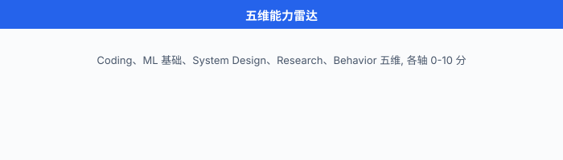

# 面试全景与准备心法

> **一句话总结**: 这一章不堆题库——把 AI 系统的面试拆成 5 维度 + 3 月路径 + 反脆弱心态, 用叙事而非题海的方式讲明白, 让你少走半年弯路.

## 🗺️ 本章导览

- 本章覆盖 AI 系统实战面试: 全景 + 系统设计 + 编程 + 行为面
- **01. 面试全景与准备心法** (本节): 5 维度、3 月路径、五维雷达、反脆弱
- **02. ML 系统设计 8 步框架**: 需求澄清到部署迭代的全流程
- **03. 典型题深度演练 · 推荐/搜索/排序**: YouTube/IG/Google/TikTok 完整 mock
- **04. 典型题深度演练 · 反欺诈/风控/异常检测**: 信用卡欺诈/spam 分类
- **05. 典型题深度演练 · 对话与 LLM 系统**: 客服机器人/RAG 系统
- **06. 算法与编程面试实战**: LeetCode 分组 + ML 编码题
- **07. 行为面 + 项目讲述 + Offer 谈判**: STAR、复盘、谈薪

*如果你正在翻"刷完 LeetCode 800 题就能拿 AI offer"的旧地图, 先把它撕了. 现在 AI 工厂招人的方式, 和 2018 年那个 LeetCode 一统天下的年代相比, 已经变了. 这一节先把地图更新到 2026.*

---

## 0. 撕掉旧地图: 为什么"刷 LeetCode 进 AI 厂"已过时

先把一个流传最广、误人最深的**过气建议**摆到台面上:

> "刷完 500 道 LeetCode + 背 ML 八股, 就能进大厂."

这条建议在 2015-2018 年的 SDE 招聘里也许半对——那时 FAANG 的标准流程就是 4-5 轮算法 coding, 外加一轮系统设计. 到了 2026 年, AI 相关岗位的考核维度已经横向扩张到 **5 个**, 任何一个轴塌掉, 整体就垮. 任何把它简化成"刷题"的指南, 都在用旧地图骗你走新路.

把视野拉高一点看全局:

1. **岗位在分叉**. 2018 年的"AI Engineer"基本等于"会调 PyTorch 的 SDE". 2026 年招聘 JD 里, **Data Scientist / ML Engineer / Research Engineer / ML Infrastructure (MLOps) / ML Solutions Engineer** 是五个不同的物种——简历长得不一样, 面试考的不一样, 入职后做的事不一样. 一份"通用 AI 八股"已经无法同时打穿五条路.
2. **ML System Design 从选修变成必修**. Ali Aminian 与 Alex Xu (ByteByteGo 创始人) 合著的 *Machine Learning System Design Interview* 上下两卷, 把 ML 系统设计 (ML System Design) 从"加分项"提到了"标配项"——Meta / Google / 字节 / OpenAI 的资深岗 (E5+/L5+/P5+) 几乎必考 ML System Design, 而且不再只考"如何搭一个推荐系统", 而是考 ML 服务的全链路: 训练-部署-监控-回滚 (Ch25/02 展开).
3. **行为面被严重低估**. 字节 / 阿里 / 腾讯 / 百度的 HR 终面和 VP 轮, 决定要不要发 offer 的最后一道关往往不在算法, 而在**项目讲述**——你能不能把一段经历讲成有数据、有决策、有取舍的故事. 很多人算法做对了, 行为面一句"遇到的最大困难"答得稀碎, 直接被降级.
4. **前沿知识从"加分"变"门槛"**. 2024 年之后, 不聊一聊 Transformer / RAG / Agent 的 AI 岗位面试, 基本只剩"老古董模型工厂"或内部工具岗位. arXiv 周报成为常态.

所以, 这一章把整个面试拆成 **5 维度**, 用 3 个月路径图、五维雷达图、反脆弱心态, 把准备策略重写到 2026.

---

## 1. AI 岗位的 5 种分类: 选路比刷题重要

投简历之前, 最重要的一件事是**搞清楚你要投的是哪条路**. 写一份"通用 ML 简历"海投, 等于把同一支箭射向五个不同的靶子. 下面这张表不是百科条目, 是过来人踩过的坑的总结——每个岗位的面试侧重点, 都不同:

| 岗位 | 英文 / 简称 | 核心工作 | 面试重点 | 适合人群 |
|---|---|---|---|---|
| 数据科学家 | Data Scientist (DS) | A/B 测试 (A/B Test)、业务分析、统计建模、可视化 | 统计、因果推断、SQL、商业 sense | 统计 / 经济 / 应数背景 |
| 机器学习工程师 | ML Engineer (MLE) | 训练-部署-监控全链路, 端到端交付 | 编码、系统设计、模型上线 | SDE 转 ML, 工程功底强 |
| 研究工程师 / 研究科学家 | Research Engineer / Research Scientist | 论文复现、提出新方法 | 论文阅读、实验设计、研究深度 | PhD / 顶会一作 / 强理论 |
| ML 基础设施工程师 | ML Infrastructure / MLOps | 平台工具 (Ray / vLLM / Triton / Kubeflow) | 分布式系统、GPU 优化、平台设计 | 分布式系统背景 |
| ML 解决方案工程师 | ML Solutions Engineer | 售前、客户对接、PoC 落地 | 沟通、需求翻译、行业 know-how | 喜欢跟人打交道 |

几个过来人的忠告:

- **DS ≠ MLE**. DS 在国内大厂 (字节 Data 团队 / 阿里商业分析部 / 美团策略) 普遍要求**统计+商业**, MLE 在同公司算法平台 / 推荐中台, 要求**工程+ML**. 简历如果写"我做实验也写代码", 投两边都失败——HR 看不出你的核心价值.
- **Research 在大厂只是少数岗位**. 字节 AI Lab / 阿里达摩院 / 百度研究院 / 腾讯 AI Lab 的 Research 岗竞争激烈 (PhD 起步), 不要把 Research 当成 MLE 的"高级版".
- **MLOps 缺口巨大**. 2026 年大厂最缺的不是"训模型的", 而是**能把模型塞进生产、扛住 1 万 QPS、监控告警不爆炸**的 MLOps. 学历门槛低于 MLE, 收入与 MLE 持平, 但需要扎实的分布式系统底子 (Ch14 算法 + Ch16 系统设计).
- **Solutions Engineer 是被忽视的"年包百万"路线**. 国内"AI 解决方案"岗在火山引擎 / 阿里云 / 腾讯云 / 百度智能云需求大, 主要看沟通和行业经验, 适合 PhD 不想写代码但想继续用 ML 的人. 缺点: 出差多, 节奏比 MLE 快.

---

## 2. 典型面试流程: 大厂怎么面你

不管是 Meta / Google / 字节 / 阿里, 大体流程都可以拆成 4 段. 下面以 Meta ML Engineer L5 / 字节 E5 / 阿里 P6 / 百度 T6 (资深工程师, 数字越大级别越高) 的标准 loop (面试轮次) 为基准 (Bar Raiser / Team Match 见下):

### 2.1 Recruiter Screen (30 min) — 简历 + 动机

- HR 或 Recruiter 视频, 看你的**简历真实性**和**动机匹配度**.
- 重点问题: "为什么换工作? 你的项目里最值得展开的是哪个? 你的级别预期? 期望 base?"
- **坑**: 别说"想学 AI"——理由太空. 要说"我在 X 场景下做了 Y, 想在更大规模上验证 Z 假设, 所以投你们".
- HR 会**同期判断你的 base 期望是否在 band (职级薪资带) 内**, 谈薪博弈从这一刻就开始 (Ch25/07 展开).

### 2.2 Tech Screen (60 min) — Coding + ML Basics

- 一轮 coding (通常 LeetCode Medium, 偶尔 Hard) + 一轮 ML basics (监督学习、模型评估、过拟合处理, 见 Ch06/01-04, Ch07/01-03).
- **coding 经典题型**: 双指针、滑动窗口、BFS/DFS、DP、回溯 (Ch14 已覆盖).
- **ML basics 经典题型**: 偏差-方差权衡 (Ch06/02)、正则化与泛化 (Ch06/03)、评价指标 (Ch06/04)、Transformer 注意力机制 (Ch07/02)、A/B 测试统计 (Ch18/02).

### 2.3 Onsite (5-6 轮) — 系统的核心战场

- **Coding 2 轮**: LeetCode Medium-Hard, 偶尔有 ML coding (写一个 softmax / 实现 mini-batch SGD).
- **System Design 1-2 轮**: 通用系统设计 + **ML 系统设计**. 这是本章 Ch25/02-Ch25/05 的全部内容.
- **Research / ML Depth 1 轮**: 论文讨论 / 实验设计 / 深度追问 (PhD 路径特供, 工业路径可能是 ML Coding 题).
- **Behavior 1 轮**: 项目讲述 + 团队协作 + 冲突处理 + 失败复盘.

### 2.4 Bar Raiser / Team Match — 最终关

- **Bar Raiser**: Meta / Google 特有, 由一个**不在你目标团队**的高级面试官把关, 看你是否"达到那个级别的 bar (门槛)". Bar Raiser 有**一票否决权**——他觉得你不够 senior, 整个 loop 就翻盘.
- **Team Match**: 面试都过了之后, 还要跟你未来的具体团队做匹配 (1-2 轮). 偏文化契合、实际项目匹配, 而不是技术.

**关键认知**: 这 4 段里, 最容易翻车的是 **Tech Screen 的 ML basics** 和 **Onsite 的 Behavior**——很多人栽在这两个看似"软"的地方, 因为不刷题. ML basics 不是死记硬背, 而是**把原理讲成故事**的能力 (后文 STAR 框架).

---

## 3. 3 个月复习路径: 三档配方

我看到过太多人**用同一种方式准备不同档位的面试**——零基础的去刷 Transformer paper, 资深者去刷 Two Sum. 下面分三档给具体配方, 每档都是 12 周 (3 个月):

### 3.1 零基础档 (在校生 / 转行者): 6+3+3 周

| 周次 | 重心 | 关键产出 |
|---|---|---|
| 1-6 | 数学基础 (Ch03-Ch05) + ML 基础 (Ch06-Ch07) + Python / NumPy 熟练 | 完成 Ch06-07 所有小节的练习, 写 3 个 toy 项目 |
| 7-9 | 系统设计入门 (Ch18 + Ch16) + LeetCode 100 题 (Easy+Medium 各半) | 能讲清推荐系统、广告 CTR、风控的基本组件 |
| 10-12 | 1 个端到端 ML 项目 + 5 次 mock + 简历 5 份定制 | 简历可投, mock 通过率 ≥ 50% |

零基础档**最重要的不是学得多深, 而是"能讲出来"**——12 周够你从零到入门, 但不够你"精通". 找 1 个深度项目 + 把它讲透, 远比 3 个浅尝辄止的项目有价值.

### 3.2 有 ML 基础档 (1-3 年 MLE / DS): 4+4+4 周

| 周次 | 重心 | 关键产出 |
|---|---|---|
| 1-4 | ML System Design 8 步框架 (Ch25/02) + LeetCode 100 题 (Medium 为主) | 3 个真实 ML 系统案例能完整跑完 8 步 |
| 5-8 | 1 个端到端 ML 项目改造 + 5 次 mock + 简历改造 | 项目讲述 5 分钟 STAR 版可流畅 |
| 9-12 | 投递 + 面试循环 + 复盘 | 30 家起步, mock 通过率 ≥ 60% |

这一档的核心是**把"做过"变成"讲清楚"**——很多 MLE 做了一两年, 项目讲述出来还是流水账. 强化 STAR 框架 (见 §6).

### 3.3 资深档 (5+ 年 / PhD): 3+3+3 周

| 周次 | 重心 | 关键产出 |
|---|---|---|
| 1-3 | 1 篇 arXiv 新 paper 精读 + 复现 + 1 轮 1v1 深度 mock | 能 30 分钟讲透 paper 的动机-方法-实验-局限 |
| 4-6 | ML System Design 高级话题 (LLM serving、Agent 编排、MLOps 平台) + 5 次 mock | 能面 L7+ 系统的设计题 |
| 7-12 | 投递 + Bar Raiser 准备 + Offer 谈判 | 谈判拿到 +20% 以上 package |

资深档最大的坑是**被年轻人用系统设计的扎实度反超**. 资深者对论文熟, 但对"如何在 60 分钟里把系统设计讲成 8 个清晰的步骤"反而生疏——这是 Ch25/02 帮你补救的核心.

把三档配方抽象成一个时间分配的最优化问题. 假设总预算 $T$ 周, 五维能力分别占 $t_1, t_2, t_3, t_4, t_5$ 周 ($\sum t_i = T$), 通过概率 $p$ 近似为各维度得分 $s_i(t_i)$ 的乘积:

$$p \approx \prod_{i=1}^{5} s_i(t_i), \quad s_i(t_i) = 1 - e^{-k_i \cdot t_i}$$

其中 $k_i$ 是各维度的学习效率 (例如: LeetCode 中 $k_\text{coding}$ 较高, ML 基础 $k_\text{ML}$ 因人而异). 边际收益递减意味着: 把时间从"已经很强"的轴挪到"明显短板"的轴, 期望通过率涨最快. 这也是为什么零基础档要把时间砸在 ML 基础而不是 coding——coding 题可以靠 mock 临时补救, ML 基础答不上来直接挂.

---

## 4. 五维能力雷达: 你现在站在哪?

把整个 AI 面试的考核维度抽象成 5 个轴, 每个轴 0-10 分, 画成雷达图就能看出形状:

```text
                   Coding 算法
                       10
                       /\
                      /  \
                     /    \
                    /      \
                   /        \
    Research 前沿 10----------10 ML 基础
                   \        /
                    \      /
                     \    /
                      \  /
                       \/
                       10
        Behavior/Comm----10----System Design
```

每个轴的具体定义:

| 维度 | 0 分是什么样子 | 10 分是什么样子 | 参考章节 |
|---|---|---|---|
| **Coding 算法** | Two Sum 写不出来 | LeetCode Medium 50 分钟能写完 + Hard 给出思路 | Ch14 |
| **ML 基础** | 解释不清偏差-方差 | 能推导 SVM / 解释 Transformer 注意力机制 | Ch06, Ch07 |
| **System Design** | 设计"购物车"无思路 | 60 分钟 ML 系统设计 8 步框架 (Ch25/02) 流畅走完 | Ch18, Ch16, Ch25/02-05 |
| **Research / 前沿** | 没读过 2024 年之后 paper | 30 分钟讲透 1 篇 arXiv 新 paper 动机-方法-实验-局限 | Ch20, Ch25/05 |
| **Behavior / 沟通** | "遇到的最大困难"答得泛泛 | 5 分钟 STAR 项目讲述, 数据 / 决策 / 取舍清晰 | Ch25/07 |



### 4.1 不同岗位的五维分布

不同岗位的形状不一样. 同样"P5 / L5 / E5"级别:

- **DS**: ML 基础 8、Behavior 8、Coding 5、System Design 4、Research 4 (偏统计/沟通)
- **MLE**: Coding 8、System Design 8、ML 基础 6、Behavior 5、Research 4 (偏工程)
- **Research**: Research 9、ML 基础 8、Coding 5、Behavior 5、System Design 3 (偏论文)
- **MLOps**: Coding 8、System Design 9、ML 基础 4、Behavior 5、Research 3 (偏分布式)
- **Solutions**: Behavior 9、ML 基础 6、System Design 6、Coding 4、Research 4 (偏客户)

投简历之前, 先画一张自己当前的雷达图, 再画一张目标岗位的"理想雷达图", 两张图一叠加, **差距最大的 1-2 个轴就是接下来 3 个月的火力集中点**. 不要试图把 5 个轴都拉到 8——时间不够, 也没必要.

### 4.2 五维雷达的"面积公式"

如果你把雷达图看成五边形, 5 个轴上各得分 $s_i$, 那么"能力面积"可以用一个加权公式近似:

$$A = \frac{1}{2} \sin(72°) \sum_{i=1}^{5} s_i \cdot s_{i+1}, \quad s_6 = s_1$$

面试的"通过率期望"大致和 $A$ 正相关. 但更准确的判断是: **任何一个轴低于 4, 整体面积就被短板拖垮**. 这是为什么"补短板"比"拔长板"在 3 个月准备期里更划算.

---

## 5. 大厂面试风格差异: 中文圈的本地化认知

北美 FAANG 的面试题偏向"通用 ML System Design + 编码 + 论文讨论"; 中文圈 (字节 / 阿里 / 腾讯 / 百度 / 美团 / 快手 / 拼多多) 普遍有**额外的本地化倾向**, 这里给一份过来人总结的"江湖地图":

### 5.1 字节跳动

- **算法轮偏难, 系统设计偏实战**. LeetCode Medium 是底线, 不少面试官会上 Hard. 系统设计题往往就是**他们团队正在做的东西**——你投抖音, 大概率被问到"短视频推荐怎么打", 而且是面试官当前正在解的真实问题.
- **Coding 风格**: 字节特爱"写一个完整模块", 比如"实现一个 LRU + 过期机制", 写完整 API 而不是只写核心算法.
- **Behavior**: 字节文化关键词之一是"始终创业" (语义上与 Amazon 的 "Day 1" 一脉相承, 但字节内部更常直接用"始终创业者"表述), 喜欢问"你做过最有 Owner 意识的事", 反感"我只是执行了 leader 安排的活".

### 5.2 阿里

- **P6 系统设计必考, P7+ 加 ML System Design**. P6 系统设计偏经典 (秒杀、短链、IM); P7+ 会加 ML 维度, 比如"淘宝首页个性化推荐的链路".
- **Coding 风格**: 阿里偏务实, LeetCode Medium 居多, 偶尔有"用 SQL 解决业务问题"的题.
- **Behavior**: 阿里"六脉神剑"价值观 (客户第一、团队协作、拥抱变化等), 终面会问"你如何理解客户第一"——别答"把用户当上帝"这种空话, 要讲具体场景.

### 5.3 腾讯

- **算法偏中等, 系统设计偏架构**. 腾讯的 ML 系统设计题比字节更"宏观", 经常问"微信视频号怎么设计一个 10 亿 DAU 的推荐系统".
- **Coding 风格**: 腾讯偏 LeetCode Medium, 时不时加一道"边界场景题"——比如"实现一个线程安全的队列" (Ch12 操作系统知识).
- **Behavior**: 腾讯 HR 终面较细, "你跟 leader 意见不一致怎么办" 这种"职场冲突"问题高发.

### 5.4 百度

- **Coding 偏经典 (LeetCode Medium)**, 系统设计偏基础 (经典分布式存储、消息队列、搜索引擎).
- **AI Lab 特殊**: 偏 Research, 读 paper + 复现 + 公式推导, 对 PhD 友好.
- **Behavior**: 百度 HR 终面会问"你为什么离开上一家公司", **不要吐槽老东家**, 要讲"成长曲线不匹配"或"想在新场景做新事".

### 5.5 美团 / 拼多多 / 快手

- **美团**: Coding 偏中等, 系统设计偏本地生活业务 ("外卖配送调度系统" 题型独有).
- **拼多多**: 性价比极高, 算法轮偏难 (Hard 出现率高于字节), 系统设计偏秒杀 / 库存扣减这类电商核心场景.
- **快手**: 短视频推荐几乎必问, 类似字节; 团队风格偏务实, "能不能干活" 比 "模型多 fancy" 更重要.

### 5.6 给国内求职者的"过来人"建议

1. **优先攻 LeetCode Medium**, 不要直接冲 Hard. Medium 200 题 + 每题 3 遍 (1 遍自己写、1 遍看最优解、1 遍讲给别人) > Hard 50 题死记硬背.
2. **准备一份"业务 + ML"双线版简历**. 不要只写"用了 XGBoost", 要写"在 X 业务场景下, 通过 XGBoost 把 Y 指标从 A 提升到 B, 同时 Z 指标没有下降".
3. **提前 mock 一轮, 拿到反馈再投**. 找朋友、内推、大厂内推群都行——10 次 mock 之后你才知道自己哪里"答得烂".

---

## 6. STAR 框架与项目讲述: 把经历变成故事

行为面 (behavioral interview) 是面试里**最被低估**、**最容易被训练**、**对最终结果影响最大**的一环. 字节 / 阿里 / 腾讯的 HR 终面决定"是否发 offer" 的权重里, 行为面占比往往 ≥ 40%. 掌握 STAR 框架 (Situation/Task/Action/Result), 你就已经赢了 80% 的候选人.

### 6.1 STAR 四要素

- **Situation (情境)**: 项目背景. 不要说"我做的是 X 项目", 要说"我们团队在 Q1 遇到了 Y 问题, 导致 Z 指标下滑".
- **Task (任务)**: 你的具体职责. "我作为 ML 工程师, 负责 X 子模块的设计和上线".
- **Action (行动)**: 你做了什么**决策**, 而不是流水账. "我对比了 3 种方案 (A/B/C), 因为 X 原因选了 A, 牺牲了 Y 指标换 Z 提升".
- **Result (结果)**: 用**数据**量化. "上线后点击率 +12%, GMV +5%, 模型推理耗时从 80 ms 降到 35 ms". 必带数字, 没数字等于没做.

### 6.2 STAR 模板代码

把项目讲述固化成一段 90 秒的开场白, 反复打磨. 下面给一个通用 Python 模板 (你不用写代码, 但要按这个结构填):

```python
def star_story(project: dict) -> str:
    """把项目素材转成 90 秒 STAR 讲述.

    Args:
        project: dict 包含 keys: bg (业务背景), task (你的职责),
                 actions (你做的关键决策, list of str),
                 results (量化结果, list of (metric, value))
    Returns:
        90 秒口述文本
    """
    parts = [
        f"【情境】{project['bg']}",                  # 20 秒
        f"【任务】{project['task']}",                 # 15 秒
        "【行动】",                                  # 35 秒
    ]
    for i, a in enumerate(project['actions'], 1):
        parts.append(f"  {i}. {a}")
    parts.append("【结果】")                         # 20 秒
    for metric, value in project['results']:
        parts.append(f"  - {metric}: {value}")
    return "\n".join(parts)

# 例: 给"推荐冷启动"项目准备的 90 秒版本
recsys_cold_start = {
    "bg": "新用户占比 30%, 个性化推荐模型没有行为数据, CTR 只有 0.8%.",
    "task": "我负责冷启动策略的方案设计与上线.",
    "actions": [
        "对比 3 种方案: 基于内容相似度 / 基于人口属性 / 探索-利用 (Bandit).",
        "选择 Bandit, 因为新用户行为会在 5-10 次互动后丰富, 冷启动窗口正好用.",
        "用 20% 流量 A/B 测 4 周, 同时保留 80% 兜底.",
    ],
    "results": [
        ("新用户 CTR", "0.8% → 1.6% (+100%)"),
        ("新用户 7 日留存", "+5 pp"),
        ("长尾物品曝光占比", "12% → 22%"),
    ],
}

print(star_story(recsys_cold_start))
```

口述版本 (90 秒版):

> 【情境】新用户占比 30%, 个性化推荐模型没有行为数据, CTR 只有 0.8%, 拖累了整体大盘. 【任务】我负责冷启动策略的方案设计与上线. 【行动】我对比了三种方案——基于内容相似度、人口属性、Bandit, 最终选了 Bandit, 因为新用户行为会在 5-10 次互动后丰富, 冷启动窗口正好用; 我用 20% 流量 A/B 跑了 4 周, 兜底保留 80%. 【结果】新用户 CTR 从 0.8% 涨到 1.6%, 翻了 1 倍; 新用户 7 日留存涨了 5 个百分点; 长尾物品曝光占比从 12% 涨到 22%.

90 秒里**每句话都有信息**——这就是 STAR 该有的密度. 没有一句是废话, 没有一句是"我学到了很多".

### 6.3 失败复盘题: "Tell me about a failure"

除了项目, 行为面高频题还有 **"Tell me about a failure"**. 中国语境里大多数人**害怕讲失败**, 但其实面试官要的不是"我没失败过", 而是**你怎么面对失败**. 三个关键:

1. **失败要具体**: 不要说"我做了一个错误决策"——要说"我选了 X 方案, 因为我没考虑 Y, 导致上线后 Z 指标掉了 30%".
2. **要承认责任**: 不要甩锅给同事 / leader. "我应该 X, 但当时 Y 让我忽略了, 这是我的失误".
3. **要讲复盘**: "事后我做了 ABC, 写下 SOP, 之后类似项目里我们再没犯过. 这件事让我学到了 D".

---

## 7. 反脆弱心态: 拒信是数据, 不是判决

最后一个核心话题——**心态**. 面试准备是技术题, 投递和等待是**统计学题**. 一次面试的通过, 是很多独立事件叠加的结果 (投递数 × 简历通过率 × 面试通过率). 即使你很优秀, 也需要**足够的样本量**才能命中目标.

### 7.1 期望投递公式

设 $p_\text{resume}$ 是简历通过率 (通常 5%-20%, 海投 5%, 内推 20%-40%), $p_\text{interview}$ 是单次面试通过率 (准备充分的资深者 40%-60%, 准备不足者 < 20%). 那么拿到至少一个 offer 的概率近似:

$$P(\text{offer} \mid N) = 1 - (1 - p_\text{resume} \cdot p_\text{interview})^N$$

举几个数字:
- 投 5 家, $p_\text{resume}=0.1$, $p_\text{interview}=0.3$: $P \approx 1 - (1 - 0.03)^5 \approx 14\%$.
- 投 30 家, 同样概率: $P \approx 1 - (1 - 0.03)^{30} \approx 60\%$.
- 投 100 家: $P \approx 1 - (1 - 0.03)^{100} \approx 95\%$.

这就是为什么 **"投 30 家公司起步"** 不是鸡汤, 是数学. 5 家就放弃, 等于把期望拉到 14%——失败 5 次就归因"运气不好", 是不尊重统计学. 资深者也一样, 我见过 PhD 出身、论文一作、面试答得 90% 满分的人, 因为"只投 3 家", 一样 offer 颗粒无收.

### 7.2 Rosenthal 效应: 面试官的偏见也是变量

你可能觉得"我答得对, 应该过". 但行为科学告诉你: 面试官的判断**会被预期污染**.

1968 年, 心理学家 **Robert Rosenthal** 在 *Pygmalion in the Classroom* 里做了一个经典实验: 他给一所小学的学生做智力测验, 然后**随机**告诉老师哪些学生是"潜力股 (bloomers)". 八个月后, 那批"潜力股"——其实是随机选的——**真的 IQ 和成绩涨得更猛**. 原因是老师对自己的期望变了: 给"潜力股"更多眼神、更多鼓励、更有挑战性的问题.

$$\text{Expectation} \xrightarrow{\text{反馈环}} \text{Behavior} \xrightarrow{\text{结果}} \text{Confirmation}$$

面试里也一样. 面试官拿到一份**清北 / MIT / 顶会一作**的简历, 会**不自觉地**给你更宽容的追问、更长的思考时间、更积极的引导. 反过来, 一份普通校的简历, 面试官可能因为一个小失误就扣分. 这是**纯粹的偏见**, 但它真实存在. 这和 Ch21/01 讲的"对齐里的内隐偏见"是一个道理——**人 (包括面试官) 都不是中立的评估器**.

这告诉我们两件事:

1. **简历要"打光"**: 写清学校名 / 公司名 / 顶会名, 把亮点前置. 这不是欺骗, 是给面试官一个"无意识公平起点".
2. **面试中要"引导"**: 答得稀烂的时候, 主动说"我换一种思路, 让我从头讲一遍"——**重新给面试官一个"好印象"的机会**, 远比"将错就错"有效.

### 7.3 Mock Interview: 在真面试之前先打几轮

最后, 也是最重要的一步: **mock**. 没 mock 过就上真战场, 等于没做过模拟卷就高考. 三个推荐渠道:

- **Pramp**: 免费 peer-to-peer mock, 双方互面. 优点是免费 + 实战感, 缺点是对方也是求职者, 反馈质量不稳定.
- **interviewing.io**: 付费配资深面试官. 优点是反馈专业, 缺点是要花钱 (具体定价随平台调整, 一般在 $150-300 / 场量级).
- **大厂内推群 / 朋友**: 最灵活, 但要找**真能给你硬反馈**的人 (而不是"鼓励式反馈"的熟人).

我自己的建议: **至少 mock 5 次再投**——3 次 coding + 1 次 ML system design + 1 次 behavior. 每次 mock 后写一份复盘表, 第二天再看一次. 这 5 次的成本不到 200 小时, 但能把"面试通过率"翻倍.

```python
# Mock Interview 评分表 (简易版)
import json

def score_mock_interview(transcript: list) -> dict:
    """简单的 mock 评分. transcript 是 list of {question, answer}.

    评分维度: 技术深度、表达清晰、应变能力、时间管理.
    每维度 1-5 分.
    """
    scores = {"技术深度": 0, "表达清晰": 0, "应变能力": 0, "时间管理": 0}
    n = len(transcript)
    for item in transcript:
        q, a = item["question"], item["answer"]
        # 启发式打分: 仅作演示, 真实评分需要真人
        scores["技术深度"] += len(a.split("而且")) // 2
        scores["表达清晰"] += 1 if "【结果】" in a or "结论" in a else 0
        scores["应变能力"] += 1 if q.startswith("追问") else 0
        scores["时间管理"] += 1 if len(a) < 300 else -1
    return {k: min(5, max(1, v // max(1, n // 2))) for k, v in scores.items()}

# 用法: 每次 mock 后跑一次, 看哪一维短板最严重
example = [
    {"question": "如何检测信用卡欺诈?", "answer": "我会用 XGBoost, 因为它..."},
    {"question": "追问: 为什么不用深度学习?", "answer": "因为表格数据 + 可解释性需求..."},
    {"question": "追问: 误报代价呢?", "answer": "【结果】误报成本 $5, 漏报 $500, 所以阈值往漏报偏..."},
]
print(json.dumps(score_mock_interview(example), ensure_ascii=False, indent=2))
```

---

## 8. 本章 7 节预告

最后, 用一段话讲清楚后面 6 节在做什么:

| 节 | 主题 | 适用岗位 | 关键能力 |
|---|---|---|---|
| 02 | ML 系统设计 8 步框架 | MLE / MLOps | 60 分钟内走完需求澄清→部署迭代 |
| 03 | 推荐/搜索/排序深度演练 | MLE (推荐方向) | YouTube / TikTok / Google 完整 mock |
| 04 | 反欺诈/风控/异常检测演练 | MLE (风控) / DS | 信用卡 fraud / spam / 内容审核 |
| 05 | 对话与 LLM 系统演练 | Research / MLE (LLM) | RAG / Agent / LLM serving |
| 06 | 算法与编程面试实战 | 全岗 | LeetCode 分组 + ML coding |
| 07 | 行为面 + 项目讲述 + Offer 谈判 | 全岗 | STAR / 复盘 / 谈薪 |

具体学法建议:

- **MLE / MLOps**: 02-04-06 是主轴, 03 选 1 个你感兴趣的深度演练.
- **Research**: 05-06 + 大量 paper 阅读, 03-04 作为"接地气"补充.
- **DS**: 04 (风控) + 06 + 07, 03 作为"了解 MLE 业务边界".
- **Solutions**: 02 + 03 + 04 + 07, 05 + 06 选学.

---

## 📌 本节要点

- **AI 岗位分 5 类** (DS / MLE / Research / MLOps / Solutions), 不同岗位面试侧重不同; 投简历之前, 先选路, 再选章.
- **3 月路径分 3 档**: 零基础 6+3+3 周, 有基础 4+4+4 周, 资深 3+3+3 周, 每档都有明确的"产出物"而不是"刷了多少题".
- **五维雷达图**: Coding、ML 基础、System Design、Research、Behavior 五轴, 任何一个轴低于 4 拖垮整体; 3 个月应集中补**最弱的 1-2 个轴**.
- **大厂面试流程**: Recruiter Screen → Tech Screen → Onsite (5-6 轮) → Bar Raiser / Team Match; 行为面是翻车重灾区.
- **STAR 框架**: 90 秒项目讲述 = Situation (20s) + Task (15s) + Action (35s) + Result (20s), 必有数字, 不容流水账.
- **Rosenthal 效应**: 面试官不是中立的——简历要打光, 面试中要给"重新展示"的机会.
- **反脆弱心态**: 拒信是数据, 不是判决; 30 家起步是数学 ($P(\text{offer}) \approx 1 - (1 - 0.03)^{30} \approx 60\%$).
- **Mock > 真面试**: 至少 5 次 mock (3 coding + 1 system design + 1 behavior) 再投, 反馈复盘表每天看一次.

---

## 参考文献

- Aminian, A., & Xu, A. *Machine Learning System Design Interview*. ByteByteGo, 2023 (Volume 1) / 2024 (Volume 2). (ML System Design 章节结构与题型主要参考.)
- Xu, A. *System Design Interview* (Volumes 1-2). ByteByteGo, 2020-2022. (通用系统设计题目原型.)
- McDowell, G. L. *Cracking the Coding Interview* (6th Edition). CareerCup, 2015. (编码面试的题型、沟通节奏参考.)
- Rosenthal, R., & Jacobson, L. (1968). *Pygmalion in the Classroom: Teacher Expectation and Pupils' Intellectual Development*. Holt, Rinehart and Winston. (本章 Rosenthal 效应引用的原始文献.)
- Kleppmann, M. (2017). *Designing Data-Intensive Applications*. O'Reilly Media. (Ch25/02 借鉴其数据系统设计语言.)
- Cialdini, R. B. *Influence: The Psychology of Persuasion* (Revised Edition). Harper Business, 2006. (Star 框架行为面背后的说服与影响力原则, 隐含参考.)
- Kruger, J., & Dunning, D. (1999). Unskilled and Unaware of It: How Difficulties in Recognizing One's Own Incompetence Lead to Inflated Self-Assessments. *Journal of Personality and Social Psychology*, 77(6), 1121-1134. (提醒"半瓶水"在 mock 里最难校正——自我评估偏差.)
- Harvard Business Review 系列文章. 涉及 STAR 方法在行为面试中的标准化写法 (相关公开报道较分散, 无单一权威文献).
- Pramp / interviewing.io 平台公开文档. (Mock 渠道建议.)