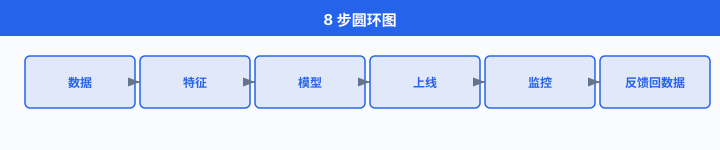
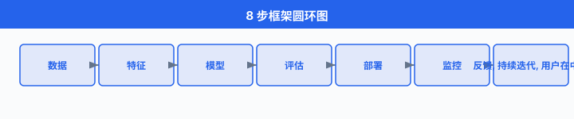
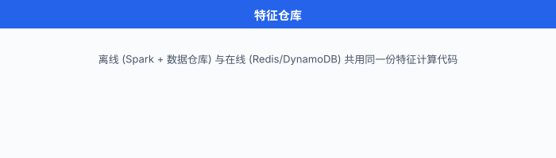
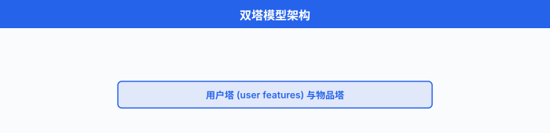
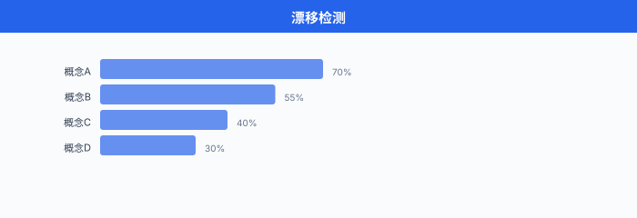

# ML 系统设计 8 步框架

> **一句话总结**: 把 ML 系统设计面试拆成 8 步可复用的脚手架——从澄清需求到部署监控迭代, 让你在 45 分钟白板时间里有清晰的时间盒、必问清单与每一步的"面试官想听什么".

*Facebook ML 系统设计 45 分钟的实战场景, 很少是"做个推荐算法"——而是"在白板上把整个链路讲清楚". 这一节给你一张能走通 60 分钟的脚手架: 8 步框架 + 每步的 checklist + 关键追问 + 一道完整例题 + 5 大常见误区 + 实战计时脚本.*

---

## 0. 开场: Facebook ML 系统设计 45 分钟, 到底面什么?

想象一下, 你刚坐到 Zoom 里, 屏幕共享打开 Google Docs 白板, 面试官 (前 Facebook ML Engineer, 现 Anthropic / OpenAI / 字节 7 年经验) 看完你简历, 说了一句:

> "好, 我们进入系统设计环节. 假设你加入我们团队, 我要你**从零设计一个短视频推荐系统的召回-粗排-精排模块**. 你是 PM、你是架构师、你是 MLE——45 分钟内把这个系统的核心组件讲清楚. 开始吧."

第一反应是不是想立刻开始画"召回用双塔, 排序用 DCN, 部署用 vLLM"? 别急. **这就是 80% 候选人踩的第一个坑——跳过需求澄清直接跳模型**. 等你画完模型才发现:
- 面试官原本想考的是冷启动
- 你的候选集大小应该是 100 万不是 1 亿
- 精排模型延迟预算只有 30 ms, 你选的 DCN 跑不动

ML 系统设计的本质, 是**和面试官共同定义问题**. 这一节给你 8 步框架, 让你从"被动答模型"切换到"主动控场".



---

## 1. 8 步框架总览

8 步框架不是 Alex Xu 原创——它是把 Ch18/04 那一节讲的 ML 生命周期 (Problem Framing → Data → Features → Training → Evaluation → Deployment → Monitoring → Iteration) **重新切成 8 个白板可讲的小段**, 每一段都明确时间预算、必问清单、关键产出. 下面这张表先给你全局视野, 后面逐步展开:

| Step | 名称 | 时间盒 (45 min) | 必答问题 | 关键产出 |
|---|---|---|---|---|
| 1 | Clarify (需求澄清) | 5 min | 给谁推？什么场景？多少候选？冷启动怎么办？ | 需求清单 + 业务指标 |
| 2 | Metrics (指标设计) | 5 min | online vs offline 是什么？AUC 提升 1% = CTR 提升 1% 吗？ | offline + online + 护栏指标 |
| 3 | Data (数据源) | 5 min | 用 impression log 还是 click log？label 怎么构造？ | 数据流图 + 标签方案 |
| 4 | Features (特征工程) | 5 min | online/offline 一致性怎么做？freshness 多高？ | 特征仓库设计 |
| 5 | Model (模型选择) | 8 min | 双塔 vs DNN vs 两阶段？baseline 怎么定？ | baseline → 进阶模型 |
| 6 | Training (训练) | 5 min | 类别不平衡怎么办？负采样比例？ | 训练方案 + 采样策略 |
| 7 | Deployment (部署) | 7 min | 在线推理 vs 离线召回？延迟预算？ | 服务架构 + 监控埋点 |
| 8 | Monitor (监控迭代) | 5 min | 漂移怎么检？公平性怎么监？反馈回路怎么破？ | 监控告警 + 迭代节奏 |

**关键认知**: 这 8 步**不是顺序的流水线**, 而是**带反馈回路的循环**——监控发现的问题会反过来推动 Step 2 重设指标、Step 3 改数据、Step 4 加特征、Step 5 换模型. 画白板时, **把 8 步画成圆环 (见上面那张图), 中心写"用户"**, 一眼能传达"这是闭环".



---

## 2. Step 1 — 需求澄清 (Clarify): 5 分钟问对 5 个问题

### 2.1 为什么第一步最容易被跳?

大多数候选人听到题目的瞬间, 大脑会"啪"地跳到模型——这是工程师的本能反应. 但 ML 系统设计的真正考点, 在于**你怎么把一个模糊业务问题变成一个可量化、可约束的 ML 问题**. 跳过这一步, 你后面所有的设计都是"空对空", 面试官会在第 15 分钟打断你: "等一下, 你的用户是谁? 候选池多大?"

### 2.2 5W1H + 业务指标 Checklist

把 Step 1 固化成 6 个必问问题, 1 个都不能省:

```python
# Step 1 Checklist (5 min)
clarify_checklist = {
    "What": "推荐什么? (短视频 / 商品 / 新闻 / 朋友)",
    "Who": "给谁推? (新用户 vs 老用户, 头部 vs 长尾, 国内 vs 海外)",
    "Where": "在什么场景推? (首页 Feed / 详情页相关推荐 / 推送通知)",
    "When": "实时性要求? (毫秒级 / 秒级 / 分钟级)",
    "Why": "业务目标? (CTR / 留存 / GMV / 多样性)",
    "How many": "候选池多大? (100 / 1万 / 100万 / 1亿)",
    # 加 1 个冷启动问题, 面试官一定会追问
    "Cold start": "新用户 / 新物品 / 新场景怎么处理? (无历史行为)",
}
```

### 2.3 面试官想听什么?

举一道真实题目: **"设计 YouTube 视频推荐"**. 候选人经常只问"推荐什么", 然后就开始画双塔. 面试官期待的是:

> "**给谁推**: 登录 vs 未登录用户 (影响特征可用性); 视频观看深度 vs 短视频刷 Feed (影响 session 模型). **推荐场景**: 首页推荐 (候选池 1000 万) vs 看完后的'下一个'推荐 (候选池 1 亿, 强相关性). **推荐数量**: 每屏 5 个, 总共滚动 10 屏 (影响 latency 预算). **冷启动**: 新用户没有行为, 用热门 + 人口属性 + Bandit. **业务指标**: 长期 watch time > 短期 CTR (YouTube 公开说过的). **基线**: 当前是热门 Top-N, 我必须证明 ML > Top-N 才有意义."

这一段话, 是 Step 1 的满分答案. 它把模糊题目变成了 6 个**可量化**的约束.

### 2.4 关键追问: 反例

❌ **反例 1**: "我们要设计一个推荐系统, 用深度学习." — 没说给谁推, 没说候选池, 等于没澄清.

❌ **反例 2**: "用户画像 + 物品画像 + 双塔召回." — 直接跳过澄清, 跳到模型. 面试官下一步就会问 "用户画像从哪来? 物品画像多久更新一次? 候选池多大?", 你会卡壳.

---

## 3. Step 2 — 指标设计 (Metrics): 离线 AUC 和在线 CTR 真的对应吗?

### 3.1 指标的三层结构

设计指标最容易踩的坑是**只看单一指标**. 一个成熟的 ML 系统, 指标分三层:

```python
# Step 2 三层指标 (5 min)
metrics = {
    "offline": {                          # 离线: 用历史数据评估
        "primary": "AUC / NDCG / MAP",    # 排序质量
        "secondary": "Recall@K / Hit Rate",  # 召回覆盖
        "calibration": "Brier Score",      # 校准
    },
    "online": {                            # 在线: 用 A/B 测试评估
        "primary": "CTR / watch time / GMV",  # 业务目标
        "guardrail": ["页面加载时间", "崩溃率", "多样性指标"],
    },
    "long_term": {                         # 长期: 滞后效应
        "retention": "7 日 / 30 日留存",
        "creator_health": "创作者发布频次 + 收入",
        "ecosystem": "长尾物品曝光占比",
    },
}
```

### 3.2 AUC 公式与 calibration

AUC (Area Under the ROC Curve) 度量的是模型把正样本排在负样本前面的概率. 数学定义是:

$$\text{AUC} = P(s(x^+) > s(x^-))$$

其中 $s(x)$ 是模型打分, $x^+, x^-$ 分别是正负样本. 完美的排序器 $\text{AUC} = 1$, 随机猜测 $\text{AUC} = 0.5$.

但 AUC 高的模型**不一定 calibration 好**. 校准 (calibration) 关心的是: 模型说 $P(\text{click}) = 0.7$ 时, 真实点击率是不是真的接近 0.7. Brier Score 度量 calibration:

$$\text{Brier} = \frac{1}{N} \sum_{i=1}^{N} (p_i - y_i)^2$$

其中 $p_i$ 是预测概率, $y_i \in \{0, 1\}$ 是真实标签. 推荐系统的 CTR 预估对 calibration 很敏感——CTR 用于广告定价、流量分配, 偏 1% 的 calibration 误差, 一年的营收误差可能上千万.

### 3.3 Offline-Online 偏移: 面试官必问

> **灵魂拷问**: "离线 AUC 提升 1%, 在线 CTR 一定提升 1% 吗?"

**答案**: **不一定, 通常高得多或低得多**. 这就是著名的 offline-online gap (离线-在线鸿沟). 常见原因:

1. **数据分布偏移**: 离线用历史日志训练, 在线面对的实时分布不一样 (Step 8 数据漂移).
2. **位置偏差 (position bias)**: 用户更倾向点排在第 1 位的, 离线 AUC 不会自动扣除这个偏差.
3. **曝光偏差 (exposure bias)**: 用户没曝光的物品 = 默认负样本, 但其实可能是用户没看到不是不喜欢.
4. **延迟反馈**: 离线评估是即时的, 在线指标 (watch time, 留存) 有滞后.

> 一句话: 离线看 ranking, 在线看 impact. **不要把 AUC 当唯一真理**.

### 3.4 面试官想听什么?

YouTube 推荐题的标准答案 (来自 Covington et al. 2016 论文, Deep Neural Networks for YouTube Recommendations):

> "**离线指标**: 选用 MAP (Mean Average Precision) 而不是 AUC, 因为 YouTube 关心的是排序质量而不是二分类. **在线指标**: watch time per session 是金标准, 因为 YouTube 的商业模式依赖总观看时长而不是点击. **护栏指标**: 页面加载时间 ≤ 200ms, 崩溃率不增长. **长期指标**: 用户 7 日留存 + 创作者上传视频数, 防止推荐走向'老视频越推越热'的封闭回路."

---

## 4. Step 3 — 数据源 (Data): impression log vs click log

### 4.1 三大数据源

数据是 ML 系统的"原料". 一个推荐系统的数据通常分三层:

```python
# Step 3 三大数据源 (5 min)
data_sources = {
    "行为日志": {
        "impression log": "曝光日志 (用户看到哪些物品)",  # 大, 含负样本
        "click log": "点击日志 (用户点了哪些)",          # 中, 强正样本
        "watch log": "观看日志 (看完 / 跳过 / 完播率)",  # 中, 反映兴趣深度
    },
    "内容数据": {
        "item metadata": "物品元信息 (标题 / 标签 / 时长 / 创作者)",
        "embedding": "预训练的内容嵌入 (来自 BERT / ViT / 多模态)",
    },
    "用户画像": {
        "demographic": "人口属性 (年龄 / 性别 / 地域)",
        "behavioral": "行为画像 (兴趣标签 / 长期偏好 / 短期 session)",
    },
}
```

### 4.2 标签怎么构造?

面试官必问: "**你用什么当正负样本?**"

- **二分类 (CTR)**: 点击 = 正样本, 曝光未点击 = 负样本. 简单, 但有 position bias.
- **多分类 (完播率)**: 完播 / 跳到 50% / 跳过 三分类. 更细, 但需要看视频 (延迟反馈).
- **回归 (watch time)**: 直接预测用户观看时长. YouTube 2016 论文用的就是这个——他们用 weighted logistic regression 把回归问题转成二分类.

### 4.3 关键追问: 反例

❌ **反例**: "我用 click log 当正样本, 剩下的当负样本." — 没有处理**位置偏差** (第 1 位的 CTR 天然高) 和**曝光偏差** (没曝光的物品被误当负样本).

✅ **正解**: "我对位置做 debias——用 `expected_ctr(position)` 当先验, 或者用 click model (如 PBM, Position-Based Model) 修正. 对未曝光样本做 negative sampling, 比例 1:5 到 1:20, 比例太低模型分不开正负, 太高训练太慢."

### 4.4 中文圈实战

字节豆包 / 抖音 Feed / 小红书 Feed 的训练数据, 都遵循这一套——但**字节会额外做'深度学习负采样'**: 用上一版模型的预测分数挑出"模型以为会点但用户没点"的样本作为 hard negative, 训练下一版. 这是普通公司和字节差距最大的细节之一.

---

## 5. Step 4 — 特征工程 (Features): 特征仓库与 online-offline 一致性

### 5.1 特征分类

特征是 ML 系统的"杠杆点". 一个推荐系统常见的特征分三类:

```python
# Step 4 特征工程 (5 min)
feature_taxonomy = {
    "用户特征": ["人口属性 (年龄/性别)", "长期偏好 (类目偏好)", "短期 session (最近 10 次动作)"],
    "物品特征": ["静态属性 (类目/标签)", "动态统计 (7 天 CTR)", "嵌入向量 (BERT/多模态)"],
    "上下文特征": ["时间 (小时/星期)", "设备 (iOS/Android)", "网络 (WiFi/4G)", "位置 (同城/全国)"],
}
```

### 5.2 特征仓库 (Feature Store) 设计

**特征存储 (Feature Store)** 是保证训练-上线一致性的核心基础设施. 同一份特征计算逻辑同时喂给离线仓 (训练用) 和在线仓 (推理用), 消除训练-上线偏差 (training-serving skew, 即在线-离线一致性 online-offline consistency 受损).



下面是特征仓库查询的典型代码:

```python
# 特征仓库查询 (Feature Store Query)
from feast import FeatureStore

fs = FeatureStore(repo_path="./feature_repo")

# 训练时: 从离线仓拉用户特征 (batch)
training_df = fs.get_historical_features(
    entity_df=user_ids_df,                       # 待预测的用户 ID
    features=[
        "user_profile:age",
        "user_profile:gender",
        "user_stats:ctr_7d",                     # 7 天 CTR
        "user_stats:favorite_category_embedding",
    ],
).to_df()

# 推理时: 从在线仓拉同一份特征 (online, 毫秒级)
online_features = fs.get_online_features(
    entity_rows=[{"user_id": "u_123"}],
    features=[
        "user_profile:age",
        "user_stats:ctr_7d",
    ],
).to_dict()
```

**关键**: `get_historical_features` 和 `get_online_features` 调用的是**同一份特征定义** (`feature_repo/` 里的 Python 配置), 这就消除了"训练时算的 CTR 和上线时算的 CTR 不一样"的问题.

### 5.3 特征鲜度 (Feature Freshness)

不同特征对实时性的要求不一样:

| 特征类型 | 鲜度需求 | 计算成本 | 例子 |
|---|---|---|---|
| 人口属性 | 天级 | 低 (离线批处理) | 年龄 / 性别 |
| 长期偏好 | 小时级 | 中 (Spark 聚合) | 7 天类目 CTR |
| 短期 session | 秒级 | 高 (流式计算) | 最近 10 次动作 |
| 实时上下文 | 毫秒级 | 极高 (直接传参) | 当前小时 / 当前位置 |

鲜度越高的特征, 服务成本越高. 反欺诈要毫秒级 (用户刚下完单这一笔是不是洗钱?), 推荐只要小时级 (用户喜欢什么类别不需要秒级变).

### 5.4 在线-离线一致性 (online-offline consistency) 的工程保证

这是 ML 系统的"魔鬼细节"——同样的特征, 离线用 Spark 算的是 0.73, 在线用 Flink 算的是 0.71, 差 2 个百分点. 模型预测就完全不可信.

工程上保证一致性的三招:

1. **统一特征定义**: 用 Feast / Tecton / Hopsworks 等 Feature Store, 一份代码两端共用.
2. **统一数据源**: 离线训练数据和在线日志**走同一个 Kafka topic**, 数据 schema 强校验.
3. **离线回灌 (backfill)**: 上线前用近 7 天线上数据回灌离线, 看 offline AUC 和 online AUC 差距.

> 一句话: online 和 offline 的特征**计算逻辑必须同源**, 否则下游一切都白做.

---

## 6. Step 5 — 模型选择 (Model): 简单到复杂, baseline 优先

### 6.1 模型选择的"简单到复杂"原则

ML 系统设计的常见误区是**上来就堆 SOTA 模型**. 正确顺序是: **baseline → 线性 → 树模型 → 深度模型 → 两阶段**. 每一步升级都要能解释"为什么需要更复杂":

```python
# Step 5 模型选择阶梯 (8 min)
model_progression = [
    "Baseline: 热门 Top-N (按 CTR 排序)",
    "线性: LR (逻辑回归) + 手工交叉特征",
    "树模型: XGBoost / LightGBM (工业界主流)",
    "深度: Wide & Deep / DCN / DeepFM (特征自动交叉)",
    "两阶段: 召回 (双塔) + 排序 (DCN) + 重排 (MMR/规则)",
]
```

每一步升级都是"用工程换精度". LR → XGBoost 提升大 (非线性 + 特征交叉), XGBoost → 深度学习提升小 (主要靠 embedding 捕捉稀疏特征), 但深度学习的**可扩展性** (新用户 / 新物品冷启动靠 embedding 泛化) 强于树模型.

### 6.2 双塔模型 (Two-Tower Model) 与召回

召回阶段的常见选择是**双塔模型 (two-tower model)**: 两侧分别用 DNN 把用户和物品编码成 embedding, 然后用内积算相似度. 优点: 物品 embedding 可以**离线预算好存到向量数据库**, 在线只算用户 embedding, 推理极快.



```python
# 双塔召回模型示意 (PyTorch)
import torch
import torch.nn as nn

class TwoTower(nn.Module):
    def __init__(self, user_dim, item_dim, embed_dim=64):
        super().__init__()
        self.user_tower = nn.Sequential(
            nn.Linear(user_dim, 256), nn.ReLU(),
            nn.Linear(256, embed_dim),                # 输出 user embedding
        )
        self.item_tower = nn.Sequential(
            nn.Linear(item_dim, 256), nn.ReLU(),
            nn.Linear(256, embed_dim),                # 输出 item embedding
        )

    def forward(self, user_feat, item_feat):
        u = self.user_tower(user_feat)                # (B, 64)
        v = self.item_tower(item_feat)                # (B, 64)
        # 训练: 内积 + 交叉熵
        logits = torch.matmul(u, v.T)                 # (B, B)
        return logits

    # 在线召回: 算 user embedding, 然后 ANN 检索
    def get_user_embedding(self, user_feat):
        return self.user_tower(user_feat)
```

### 6.3 排序阶段: Wide & Deep, DCN, DeepFM

精排 (ranking) 阶段, 2016 年之后的主流架构是 **Wide & Deep** (Google 2016, Cheng et al.): "Wide" 部分记忆 (memorization, 手工交叉特征), "Deep" 部分泛化 (generalization, 嵌入 + DNN). 后来的 **DCN** (Deep & Cross Network) 和 **DeepFM** 用网络结构自动学习特征交叉, 比手工更鲁棒.

但要警惕: **树模型 (XGBoost) 在中小规模表格数据上常常比深度学习更强**. 抖音 / 字节内部的很多排序模型都是 GBDT + LR 的组合, 而不是一上来就 DNN.

### 6.4 面试官想听什么?

YouTube 推荐 (Covington 2016) 的标准答案:

> "**召回**: 双塔模型, 用户侧用观看历史 + 人口属性, 物品侧用视频 embedding + 类目. 候选池 1000 万, 召回 1000 个. **排序**: 深度神经网络, 输入 = 用户特征 + 物品特征 + 交叉特征, 用 weighted logistic regression 把 watch time 转成二分类问题. **重排**: 多样性规则 (同一创作者不超过 3 个视频) + 探索 (Bandit / Thompson sampling)."

这一段, 把"模型选择"具体到**架构名 + 输入维度 + 输出维度**, 面试官很容易追问细节.

---

## 7. Step 6 — 训练 (Training): 数据不平衡与采样

### 7.1 类别不平衡

CTR 预估里, **正样本 (点击) 比例往往只有 1%-5%**, 这是严重的类别不平衡. 不处理的训练会让模型把所有样本都预测成负样本, AUC 看起来 0.5 但 recall 是 0.

四种常用应对:

| 方法 | 原理 | 优缺点 |
|---|---|---|
| **下采样 (downsample)** | 随机扔掉一部分负样本, 让正负比例 1:5 | 简单, 但丢失信息 |
| **上权重 (upweight)** | 损失函数里给正样本更高权重 | 简单, 不丢数据, 但需调权重 |
| **过采样 (oversample)** | 复制正样本, 1:1 | 易过拟合, 不推荐 |
| **Focal loss** | 难样本权重高, 易样本权重低 | 深度学习首选 |

**下采样 + class weight** 是工业界最常用组合. 代码示例:

```python
# 训练循环: 下采样 + class weight + Focal Loss
import torch
import torch.nn as nn
from torch.utils.data import DataLoader, WeightedRandomSampler

class FocalLoss(nn.Module):
    """Focal Loss: 解决类别不平衡, 让难样本权重更高."""
    def __init__(self, alpha=0.25, gamma=2.0):
        super().__init__()
        self.alpha, self.gamma = alpha, gamma

    def forward(self, logits, targets):
        # logits: (B,), targets: {0, 1}
        bce = nn.functional.binary_cross_entropy_with_logits(
            logits, targets.float(), reduction="none"
        )
        p = torch.sigmoid(logits)
        pt = p * targets + (1 - p) * (1 - targets)   # 预测对的概率
        alpha_t = self.alpha * targets + (1 - self.alpha) * (1 - targets)
        focal_weight = alpha_t * (1 - pt) ** self.gamma
        return (focal_weight * bce).mean()

# 训练时: 用 WeightedRandomSampler 给正样本更高采样权重
train_dataset = CTRDataset(X_train, y_train)
sample_weights = [5.0 if y == 1 else 1.0 for y in y_train]   # 正样本权重 5x
sampler = WeightedRandomSampler(sample_weights, num_samples=len(y_train), replacement=True)
train_loader = DataLoader(train_dataset, batch_size=1024, sampler=sampler)

model = CTRDNN(input_dim=128, hidden=256)
optimizer = torch.optim.Adam(model.parameters(), lr=1e-3)
criterion = FocalLoss(alpha=0.25, gamma=2.0)

for epoch in range(20):
    model.train()
    for x, y in train_loader:
        logits = model(x)
        loss = criterion(logits.squeeze(), y)
        optimizer.zero_grad(); loss.backward(); optimizer.step()
```

### 7.2 负采样比例

推荐系统训练时, **不可能用全量负样本** (1 亿物品 × 1 亿用户 = 1e16 样本). 实际只采样一小部分负样本, 常见比例 1:5 到 1:20.

关键点: **负采样要分层**, 不能只采随机负样本. YouTube 2016 论文的做法是: 负样本从"用户看过但没点"的集合里采, 加上"完全没曝光的随机物品". 后者保证 coverage, 前者提供 hard negative.

### 7.3 训练基础设施

工业级训练需要:

- **分布式**: 数据并行 (PyTorch DDP) + 模型并行 (DeepSpeed / Megatron)
- **混合精度**: FP16 + FP32 master weight, 省显存 50%
- **检查点**: 每 N 步存一次, 断点恢复
- **实验追踪**: W&B / MLflow, 记录超参 + 指标 + 数据版本
- **流水线编排**: Airflow / Kubeflow / Metaflow, 每天自动重训

面试官问"你怎么训练这个模型", 不要只答"用 PyTorch"——要答"用 PyTorch + DeepSpeed 在 8 卡 A100 上, 数据并行, 混合精度, 每天凌晨 4 点用过去 30 天数据重训, 训练日志在 W&B".

---

## 8. Step 7 — 部署 (Deployment): 在线学习 vs 离线训练 + Push

### 8.1 部署的三大策略

```python
# Step 7 部署策略 (7 min)
deployment_strategies = {
    "离线训练 + 推送 (offline + push)": {
        "节奏": "每天 / 每小时重训, 推送新模型",
        "延迟": "分钟级 (从用户行为到模型更新)",
        "适用": "推荐 / 广告 (用户兴趣相对稳定)",
    },
    "在线推理 (online inference)": {
        "节奏": "请求来了实时算",
        "延迟": "毫秒级 (VLLM 风格, KV cache 优化)",
        "适用": "搜索 / LLM / 反欺诈 (每次请求都要算)",
    },
    "在线学习 (online learning)": {
        "节奏": "模型参数持续更新 (FTRL / 在线 SGD)",
        "延迟": "秒级",
        "适用": "广告 CTR (实时性强, 但稳定性差)",
    },
}
```

### 8.2 在线推理 wrapper

```python
# 在线推理 wrapper (FastAPI + Triton)
from fastapi import FastAPI, Request
import numpy as np
import tritonclient.http as triton_http

app = FastAPI()

# 客户端连接 Triton Inference Server (gRPC / HTTP)
triton_client = triton_http.InferenceServerClient(url="triton:8000")

@app.post("/predict")
async def predict(request: Request):
    """在线推理: 单个用户 × 候选物品 → 点击概率."""
    body = await request.json()
    user_id = body["user_id"]
    item_ids = body["item_ids"]                           # 100 个候选

    # 1. 在线拉用户特征 (Redis, 毫秒级)
    user_feat = redis_client.hgetall(f"user:{user_id}")

    # 2. 拼 batch, 调 Triton
    batch_size = len(item_ids)
    input_features = np.stack([
        np.concatenate([
            np.frombuffer(user_feat[b"vec"]),
            np.frombuffer(redis_client.hgetall(f"item:{iid}")[b"vec"]),
        ]) for iid in item_ids
    ]).astype(np.float32)

    # 3. Triton 推理
    inputs = [triton_http.InferInput("features", input_features.shape, "FP32")]
    inputs[0].set_data_from_numpy(input_features)
    outputs = [triton_http.InferRequestedOutput("logits")]
    result = triton_client.infer(model_name="ctr_ranker", inputs=inputs, outputs=outputs)
    logits = result.as_numpy("logits")                    # (batch_size,)

    # 4. 返回 top-K
    scores = 1 / (1 + np.exp(-logits))                    # sigmoid
    top_k = np.argsort(-scores)[:10]
    return {"top_items": [item_ids[i] for i in top_k]}
```

### 8.3 在线推理 vs 离线召回

| 维度 | 在线推理 (Real-time) | 离线召回 (Pre-computed) |
|---|---|---|
| **延迟** | 10-100 ms | 0-5 ms (从缓存读) |
| **新鲜度** | 实时 (拿到当前 session) | 小时 / 天级 |
| **成本** | 高 (GPU 推理 / QPS) | 低 (一次预算, 反复用) |
| **适用** | LLM / 反欺诈 / 搜索排序 | 推荐召回 / 物品 embedding |

**大系统两者并用**: 离线召回预算好 80% 流量 (热门 / 老用户偏好稳定), 在线推理覆盖 20% 长尾 (新用户 / 新物品 / 实时 session).

### 8.4 上线策略: 灰度 + A/B

不要一上来就 100% 流量切到新模型. 标准流程:

```
影子部署 (5%) → 灰度发布 (10%) → A/B 测试 (50% / 50%) → 全量 (100%)
```

- **影子部署**: 新模型和旧模型并行, 但只返回旧模型结果. 比对差异, 抓 bug.
- **灰度发布**: 1% → 5% → 10%, 看核心指标 (错误率 / 延迟) 不爆炸.
- **A/B 测试**: 50% 对照 vs 50% 实验, 跑 1-2 周, 看显著性 (Ch18/02 详述).

---

## 9. Step 8 — 监控迭代 (Monitor): 数据漂移, 公平性, 反馈回路

### 9.1 ML 系统特有的三类监控

通用监控 (CPU / 内存 / QPS / 错误率) Ch15 已讲. ML 系统还要监控:

```python
# Step 8 监控三大类 (5 min)
ml_monitoring = {
    "数据漂移 (data drift)": {
        "PSI": "Population Stability Index > 0.25 告警",
        "KS 检验": "特征分布对比训练集",
        "embedding drift": "MMD 距离 / 质心距离",
    },
    "概念漂移 (concept drift)": {
        "代理指标": "CTR / watch time 持续下滑",
        "label 滞后": "等真实标签回流再校准",
    },
    "公平性 (fairness)": {
        "demographic parity": "各群体正预测率差距",
        "equal opportunity": "各群体真正例率差距",
        "calibration": "各群体校准误差",
    },
}
```

### 9.2 漂移检测示意图



PSI (Population Stability Index) 公式:

$$\text{PSI} = \sum_{i=1}^{k} (p_i^{\text{new}} - p_i^{\text{base}}) \cdot \ln \frac{p_i^{\text{new}}}{p_i^{\text{base}}}$$

其中 $p_i^{\text{base}}$ 是训练集分桶占比, $p_i^{\text{new}}$ 是当前入模数据分桶占比. PSI < 0.1 稳定, 0.1-0.25 中等偏移, > 0.25 显著偏移 (需要告警 + 重训).

### 9.3 监控告警代码

```python
# 漂移监控告警 (Prometheus + Grafana)
from prometheus_client import Gauge, Counter, Histogram
import numpy as np
from scipy.stats import ks_2samp

# Prometheus 指标
psi_gauge = Gauge("model_feature_psi", "PSI of feature", ["feature_name"])
ks_gauge = Gauge("model_feature_ks", "KS statistic of feature", ["feature_name"])
drift_alerts = Counter("model_drift_alerts_total", "Drift alerts", ["severity"])

def monitor_drift(feature_name: str, base_dist: np.ndarray, current_dist: np.ndarray):
    """监控单个特征的分布漂移, 写 Prometheus."""
    # 1. KS 检验
    ks_stat, p_value = ks_2samp(base_dist, current_dist)
    ks_gauge.labels(feature_name=feature_name).set(ks_stat)

    # 2. PSI (10 个等宽分桶)
    bins = np.linspace(0, 1, 11)
    base_hist, _ = np.histogram(base_dist, bins=bins, density=True)
    curr_hist, _ = np.histogram(current_dist, bins=bins, density=True)
    psi = np.sum((curr_hist - base_hist) * np.log(
        (curr_hist + 1e-6) / (base_hist + 1e-6)
    ))
    psi_gauge.labels(feature_name=feature_name).set(psi)

    # 3. 告警分级
    if psi > 0.25:
        drift_alerts.labels(severity="critical").inc()
        alert_pagerduty(f"PSI={psi:.3f} > 0.25 for {feature_name}")   # 紧急, 呼叫值班
    elif psi > 0.10:
        drift_alerts.labels(severity="warning").inc()
        alert_slack(f"PSI={psi:.3f} > 0.10 for {feature_name}")       # 警告, Slack 通知
```

### 9.4 反馈回路: 8 步闭环的核心

ML 系统最危险的不是模型差, 而是**反馈回路让模型越学越偏**:

- **正反馈 (热门越推越热)**: 推荐模型主要展示热门 → 用户只点热门 → 模型学到热门更好 → 多样性坍塌, 长尾物品消失.
- **负反馈 (反欺诈失效)**: 反欺诈抓光 A 类欺诈 → 训练数据没有 A 类 → 模型学不会识别 A 类 → A 类死灰复燃.

**缓解手段**:

1. **探索 (exploration)**: epsilon-greedy / Thompson 采样 / UCB, 主动展示一些不确定的物品.
2. **反事实日志 (counterfactual logging)**: 记录"如果模型给用户看了 B 而不是 A, 用户会不会点 B".
3. **保留集 (holdout)**: 5% 流量不做模型过滤, 拿来做无偏评估.
4. **多样性约束 (diversity constraint)**: 同一作者 / 类目不超过 N 个.

---

## 10. 完整例题: YouTube 视频推荐 8 步实战

把 8 步套到一道真实题上, 给你**模板化的话术**. 题目: **"设计 YouTube 首页视频推荐"**.

### Step 1: Clarify (5 min)

> "我先澄清几个问题: 
> 1. **给谁推**: 登录用户 (有行为历史) vs 未登录 (只有 IP 地域). 两种走不同模型.
> 2. **场景**: 首页推荐 (候选池大, 推荐给用户多个) vs '下一个视频' (看完一条后强相关性).
> 3. **数量**: 每屏 5 个, 总滚动 10 屏, 关注滚动到底的用户.
> 4. **冷启动**: 新用户 / 新视频怎么处理.
> 5. **业务指标**: watch time per session > CTR, 因为 YouTube 靠总观看时长变现.
> 6. **基线**: 当前是热门 Top-N, 我必须证明 ML > 热门."

### Step 2: Metrics (5 min)

> "**离线**: MAP (Mean Average Precision), 比 AUC 更贴排序质量.
> **在线**: watch time per session (金标准), CTR (辅助).
> **护栏**: 页面加载 ≤ 200ms, 崩溃率不增长, 推荐多样性 (同一创作者 ≤ 3).
> **长期**: 7 日 / 30 日留存, 创作者上传视频数 (防止'老视频越推越热'的死锁)."

### Step 3: Data (5 min)

> "**行为日志**: impression log (用户看到哪些) + watch log (看完 / 跳过的秒数).
> **标签**: watch time 作为软标签, 用 weighted logistic regression 转二分类.
> **负采样**: 用户看过但没看完的物品 + 随机未曝光物品 (保证 coverage), 比例 1:5.
> **位置偏差**: 用 PBM (Position-Based Model) 修正, 或者建模 `expected_ctr(position)` 当先验."

### Step 4: Features (5 min)

> "**用户特征**: 人口属性 + 长期类目偏好 (30 天聚合) + 短期 session (最近 10 个视频).
> **物品特征**: 视频 embedding (来自预训练多模态) + 创作者统计 (CTR / watch time / 7 天上传频次).
> **上下文**: 时间 / 设备 / 地理位置.
> **特征仓库**: 用 Feast, 离线训练和在线推理共用同一份特征定义, 保证 online-offline consistency."

### Step 5: Model (8 min)

> "**召回** (候选池 1000 万 → 1000): 双塔模型, 用户塔输入观看历史 + 人口属性, 物品塔输入视频 embedding + 类目. 物品 embedding 离线预算好存向量数据库 (FAISS), 在线只算用户侧 embedding, 用 ANN (Approximate Nearest Neighbor, 近似最近邻) 检索.
> **排序** (1000 → 100): Wide & Deep / DCN, 输入 = 用户 + 物品 + 交叉特征, 输出 watch time 预估.
> **重排**: 多样性规则 (同一创作者 ≤ 3) + 探索 (epsilon-greedy, 5% 流量给 Bandit)."

### Step 6: Training (5 min)

> "**类别不平衡**: watch time > 30s 当正样本, 比例约 5%. 用下采样让比例 1:3 + Focal Loss.
> **训练基础设施**: PyTorch + DeepSpeed, 8 卡 A100 数据并行, 混合精度. 每天凌晨 4 点用过去 30 天数据重训, W&B 记录日志.
> **冷启动**: 新视频用内容 embedding + 类目相似度兜底; 新用户用热门 + 人口属性 + Bandit."

### Step 7: Deployment (7 min)

> "**两阶段架构**: 离线召回预算好 80% 流量 (热门 + 老用户稳定偏好), 在线推理覆盖 20% 长尾 (新视频 / 新用户).
> **在线推理**: Triton Inference Server + KV cache 优化, P99 延迟 ≤ 50ms.
> **上线节奏**: 影子部署 1 天 → 灰度 5% / 10% / 25% (各 1 天) → A/B 测试 50% vs 50% (2 周) → 全量."

### Step 8: Monitor (5 min)

> "**数据漂移**: PSI > 0.25 告警, KS 检验每日跑.
> **概念漂移**: watch time per session 7 日滑动均值, 跌幅 > 5% 触发重训.
> **公平性**: 创作者切片, 长尾创作者 (上传视频 < 10) 曝光占比不低于 20%.
> **反馈回路**: 5% 保留集不做模型过滤, 用作无偏评估; epsilon-greedy 5% 流量做探索.
> **迭代节奏**: 每周评审离线指标, 每月评审在线指标, 每季度回归测试."

---

## 11. 常见误区: 5 大翻车点

| # | 误区 | 正确做法 |
|---|---|---|
| 1 | **直接跳到模型** (没澄清需求) | Step 1 必须问 6 个问题, 至少占 5 分钟 |
| 2 | **只看准确率不看延迟** (P99 延迟 200ms 还跑 50ms 预算) | Step 7 必须算 latency budget: 模型大小 × QPS × GPU 利用率 |
| 3 | **忽略冷启动** (新用户 / 新物品没设计) | Step 5 必须给出冷启动方案: 内容相似 / Bandit / 默认 embedding |
| 4 | **没有 offline-online 一致性思考** (AUC 涨 1% 但 CTR 没涨) | Step 2 + Step 4 必须给 calibration 指标 + 特征一致性保证 |
| 5 | **没有反馈回路思考** (模型自喂数据, 越学越偏) | Step 8 必须给探索 + 保留集 + 反事实日志 |

### 11.1 误区 1 的真实翻车场景

候选人听到 "YouTube 推荐" 后, 立刻开始画模型. 5 分钟画完双塔 + DCN + 重排, 漂亮极了. 然后面试官问: "等一下, 用户打开 App 时**还没登录**, 你怎么处理?" 候选人愣住——他刚才设计的是登录用户路径. **5 分钟的澄清 = 5 分钟的救命**.

---

## 12. 白板图技巧: 60 分钟画出清晰架构

### 12.1 圆环图: 8 步框架

画一个圆, 中心写"用户", 圆周上按顺序写 8 步. 圆心画双向箭头, 强调"闭环":

```
                Clarify
                  ↓
    Monitor ←────────────→ Metrics
      ↑                      ↓
      ↑                    Data
    Iteration              ↓
                  Features
                  ↓
                Model
                  ↓
               Training
                  ↓
             Deployment
```

### 12.2 数据流图: 训练和上线

画两条竖线, 左 "离线" (Spark + Airflow + 模型仓库), 右 "在线" (Kafka + Redis + Triton), 中间是"特征仓库" 共享. 训练数据从左下流到右上, 推理数据从右上流到右下.

### 12.3 关键路径: data → feature → model → serving

用粗箭头标出 4 个关键节点, 其它 (监控 / 反馈 / 评估) 用细箭头. 面试官扫一眼就知道你的**主链路**, 不会被你的细节淹没.

---

## 13. 实战计时 45 分钟演练脚本

下面是一份**真实可用的计时脚本**, 你可以照着练 5 次 mock:

| 时间 | 步骤 | 你要说什么 | 关键产出 |
|---|---|---|---|
| 0:00-0:05 | Step 1 Clarify | 6 个澄清问题, 拿笔写需求清单 | 5W1H + 冷启动方案 |
| 0:05-0:10 | Step 2 Metrics | offline + online + 护栏 + 长期 | 三层指标表 |
| 0:10-0:15 | Step 3 Data | 数据源 + 标签 + 负采样 | 数据流图 |
| 0:15-0:20 | Step 4 Features | 用户/物品/上下文特征 + 特征仓库 | 特征分类 + 一致性保证 |
| 0:20-0:28 | Step 5 Model | baseline → 树 → DNN → 两阶段, 画架构 | 模型选择阶梯 + 双塔图 |
| 0:28-0:33 | Step 6 Training | 数据不平衡 + 训练基础设施 | 训练方案 |
| 0:33-0:40 | Step 7 Deployment | 在线推理 + 灰度 + A/B | 服务架构 + 上线节奏 |
| 0:40-0:45 | Step 8 Monitor | 漂移 + 公平性 + 反馈回路 | 监控指标 + 迭代节奏 |
| 0:45-0:50 | 反问 + 总结 | "请问您最关心的指标是什么?" | 留 5 分钟给面试官追问 |

**核心原则**:
- **Step 1 一定不能省**, 即使面试官说"你自己假设"
- **Step 5 时间最长** (8 min), 因为模型是大部分候选人最熟的部分, 也是面试官追问最密的
- **留 5 分钟给反问**, 不要拖到 50 分钟才收尾

---

## 14. 关键追问 cheat sheet

下面这 20 个追问, 是 ML 系统设计面试**最常被问到**的. 8 步框架走完后, 面试官大概率从这 20 个里挑 3-5 个追问:

| Step | 高频追问 | 标准答案 |
|---|---|---|
| 1 | 候选池多大? 延迟预算多少? | 用业务规模倒推: 1 亿物品 × 50 ms 推理 → 必须两阶段 |
| 2 | AUC 涨 1% = CTR 涨 1% 吗? | 不一定, position bias / 数据漂移 / 反馈回路都会放大或缩小差距 |
| 3 | 用 click log 还是 watch log? | watch log 更贴业务, click log 简单但有偏差 |
| 4 | online-offline 一致性怎么保证? | 特征仓库统一计算逻辑 + backfill 验证 |
| 5 | 为什么不直接上 Transformer? | 候选池 1 亿跑不动; 双塔 + ANN 是工程妥协 |
| 6 | 类别不平衡怎么办? | 下采样 + class weight + Focal Loss |
| 7 | 怎么上线? | 影子 → 灰度 → A/B → 全量 |
| 8 | 数据漂移怎么检? | PSI / KS / MMD; PSI > 0.25 告警 |
| 综合 | 数据冷启动怎么办? | 内容 embedding + 人口属性 + Bandit |
| 综合 | 模型失败了怎么排查? | 监控 → 看哪个特征 PSI 异常 → 回滚 → 修复 → 重训 |

---

## 15. 参考文献与延伸阅读

- **Alex Xu. *Machine Learning System Design Interview*, Volumes 1-2.** ByteByteGo, 2023-2024. (8 步框架的结构主要参考, YouTube / TikTok 题型原型来源.)
- **Huyen, C. *Designing Machine Learning Systems* (2022), Chapter 7: Model Deployment and Prediction Service.** O'Reilly. (在线推理工程细节, latency / throughput 优化, batch vs online 权衡.)
- **Covington, P., Adams, J., & Sargin, E. (2016). *Deep Neural Networks for YouTube Recommendations*. RecSys 2016.** (YouTube 推荐召回 + 排序的经典论文, 8 步例题的主要素材.)
- **Cheng, H.-T., et al. (2016). *Wide & Deep Learning for Recommender Systems*. DLRS 2016 Workshop @ RecSys** (arXiv:1606.07792). (Wide & Deep 模型架构的原始论文.)
- **Sculley, D., et al. (2015). *Hidden Technical Debt in Machine Learning Systems*. NIPS 2015.** (ML 系统技术债的经典论文, 强调"ML 系统 > 模型".)
- **Breck, E., Polyzotis, N., et al. (2019). *Data Validation for Machine Learning*. SysML 2019.** (数据验证与漂移检测.)
- **Huyen, C. *Designing Machine Learning Systems* (2022), Chapter 8: Data Distribution Shifts and Monitoring.** (数据漂移与概念漂移的工程应对.)
- **Polyzotis, N., et al. (2018). *Data Lifecycle Challenges in Production Machine Learning: A Survey*. SIGMOD Record, Vol. 47, No. 2.** (数据生命周期与训练-上线偏差.)
- 特征仓库 / Feast / Tecton / Hopsworks 工程实践、LLM 推荐系统综述、反事实评估与无偏估计等主题, 业界报告较分散, 无单一权威文献, 建议直接参考各开源项目文档与 RecSys / SIGIR 等会议近年 tutorial.

---

## 📌 本节要点

- **8 步框架**: Clarify → Metrics → Data → Features → Model → Training → Deployment → Monitor, 闭环而非线性, 中心是"用户".
- **Step 1 必问 6 问**: What / Who / Where / When / Why / How many + 冷启动; 跳过这一步 = 大概率翻车.
- **offline ≠ online**: AUC 涨 1% 不等于 CTR 涨 1%; calibration 误差 1% 在广告业务可亏上千万.
- **特征仓库 (Feature Store)** 是 online-offline 一致性的工程保证; Feast / Tecton 等框架让两端共用同一份特征定义.
- **数据漂移**: PSI > 0.25 告警, KS 检验每日跑, 嵌入漂移用 MMD.
- **类别不平衡**: 下采样 + class weight + Focal Loss 是工业界首选; 负采样比例 1:5 到 1:20.
- **冷启动**: 新用户 = Bandit + 人口属性, 新物品 = 内容 embedding 相似度, 必须有兜底.
- **反馈回路**: 模型改变用户行为, 用户行为又喂模型; 用探索 / 保留集 / 反事实日志去偏.
- **45 分钟时间盒**: 5+5+5+5+8+5+7+5+5 (反问) = 50 分钟, 留 5 分钟缓冲.
- **5 大误区**: 跳到模型 / 只看准确率不看延迟 / 忽略冷启动 / 没有 online-offline 思考 / 没有反馈回路.