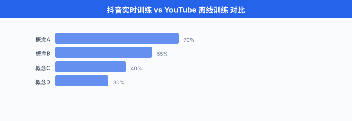
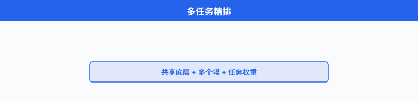
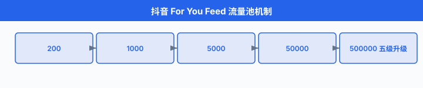

# 典型题深度演练 · 推荐/搜索/排序

> **一句话总结**：把 02 节的 8 步框架拆成 4 道完整 mock——YouTube 推荐 / Instagram Feed / Google 搜索 / TikTok/抖音推荐，每道 45 分钟时间盒 + 白板图 + 数学公式 + 追问 cheat sheet + 中文圈实战陷阱。

*02 节讲的是脚手架——8 步怎么走。 这一节是把脚手架搭在 4 个真实产品上，让你在屏幕共享的白板上一笔一笔地演练。 YouTube 推荐是西方大厂的"原型题", Instagram 是社交信号的代表，Google 搜索把 8 步切成"召回/精排/重排"三段，TikTok/抖音是中圈中文面试的"决胜题"——把这 4 道打透，Facebook/字节/阿里/快手的 ML 系统设计题就稳了.*

---

## 0. 全章概览：4 道题的认知地图

面试真题看似很多，拆开看只有 4 类:

| 类型 | 原型 | 关键差异化 | 中文圈变体 |
|---|---|---|---|
| **内容推荐** | YouTube (Covington 2016) | 双塔召回 + DNN 精排 + watch time | 抖音 / 小红书 / B 站 |
| **社交 Feed** | Instagram (Eksombatchai 2018) | 好友互动信号 + LTV 长期价值 | 微信朋友圈 / 微博 |
| **搜索排序** | Google (Burges 2006/2010) | LTR (Learning to Rank，学习排序) + 文档理解 | 百度 / 微信搜一搜 |
| **短视频流** | TikTok (Cheng 2024) | 实时训练 + 多目标加权 + 完播率 | 抖音 / 抖音极速版 / TikTok |

这 4 道题共占字节/小红书/阿里推荐岗面试的 80%+ 高频题。 下面一道一道演练。




---

# 题 1: YouTube 首页视频推荐 (西方原型题)

## 1.1 题目陈述

> "**设计 YouTube 首页视频推荐系统**. 你是 PM / 架构师 / MLE 综合身份，45 分钟把核心组件讲清楚."

这是 YouTube 2016 论文 (Covington et al.) 的原型题，**也是 Facebook ML 系统设计的高频题型**. 据说 80% 的西方大厂 ML 系统设计题**都是推荐**, YouTube 是推荐里最经典的。

## 1.2 45 分钟时间盒

| 时间 | Step | 必答内容 | 关键产出 |
|---|---|---|---|
| 0:00-0:05 | Clarify | 用户状态 / 候选池 / 数量 / 冷启动 / 指标偏好 / 基线 | 需求清单 |
| 0:05-0:10 | Metrics | 离线 MAP vs AUC；在线 watch time；护栏多样性；长期留存 | 三层指标表 |
| 0:10-0:15 | Data | impression + watch log; weighted LR 转 watch time | 数据流图 |
| 0:15-0:20 | Features | 用户长短期 + 物品 embedding + 上下文；特征仓库 | 特征分类 |
| 0:20-0:28 | Model | **双塔召回 + DNN 精排 + 多任务 + 重排** (本节重点) | 完整架构图 |
| 0:28-0:33 | Training | 类别不平衡 + 负采样分层 + 分布式 | 训练方案 |
| 0:33-0:40 | Deployment | 离线召回 + 在线推理混合；灰度 A/B | 服务架构 |
| 0:40-0:45 | Monitor | PSI / 长尾创作者 / 反馈回路 | 监控指标 |
| 0:45-0:50 | 反问 | "您最关心的是 watch time 还是多样性?" | 留 5 分钟追问 |

下面把 0:00-0:28 的内容**详细展开**——这是候选人翻车最多的 28 分钟。

## 1.3 Step 1 — Clarify (0:00-0:05)

满分话术 (向面试官确认):

> "**给谁推**：登录用户 (有完整行为历史) vs 未登录 (只有 IP / 地域). 两种走不同模型。
> 
> **场景**：首页推荐 (候选池大，给用户多类选择) vs 看完视频后的'下一个' (强相关性，候选池更聚焦).
> 
> **数量**：每屏 5 个，总滚动 10 屏。 关注**滚到底的用户** (他们代表了真正活跃群体).
> 
> **冷启动**：新用户没有行为，走热门 + 人口属性 + Bandit；新视频没有统计，走内容 embedding + 类目相似。
> 
> **业务指标**: **watch time per session > CTR**，因为 YouTube 的商业模式是广告 + 总观看时长，不是点击。
> 
> **基线**：当前是热门 Top-N，我必须证明 ML > Top-N 才有意义."

❌ 常见卡顿点："我推荐电影"——没说清是给登录用户推还是给新用户推，没说候选池多大。 
✅ 解套：强行套 6 个 5W1H 问题，即使面试官说"你自己假设"，你也要**嘴上说出来**——这 5 分钟的功劳，是把模糊题变成可解数学题。

## 1.4 Step 2-4 — 指标 + 数据 + 特征 (0:05-0:20)

### 1.4.1 Metrics

```python
# YouTube 三层指标 (5 min)
metrics = {
    "offline": {
        "primary": "MAP (Mean Average Precision)",   # 比 AUC 更贴排序质量
        "secondary": "Recall@K / Hit Rate@100",       # 召回覆盖
        "calibration": "Brier Score for watch time",
    },
    "online": {
        "primary": "watch time per session",          # 金标准, Covington 2016 公开承认
        "guardrail": ["页面加载 ≤ 200ms", "崩溃率不增长", "创作者多样性"],
    },
    "long_term": {
        "retention": "7-day / 30-day return rate",
        "creator_health": "上传视频数 + 长尾创作者曝光占比",
    },
}
```

> **灵魂拷问**: "为什么不用 CTR?"

✅ 答：CTR 高的视频往往是**骗点击**的标题党——用户点进去就退。 YouTube 关心的是用户**是否真的看完了**. 你可以用 weighted logistic regression (加权逻辑回归) 把连续 watch time 转成加权二分类，权重 = watch time，这样一个模型既保持二分类的稳定训练，又反映了 watch time 的偏好——这是 Covington 2016 的核心 trick.

### 1.4.2 Data

```python
data_pipeline = {
    "impression_log": "曝光日志 (用户看到哪些视频), 含负样本",
    "watch_log": "观看日志 (看完 / 跳过 / 时长 / 完播率)",
    "item_metadata": "视频标题 / 标签 / 时长 / 创作者 / 上传时间",
    "user_profile": "人口属性 + 长期偏好 + 短期 session",
}
# 标签: watch time 作为软标签, weighted LR 转二分类
label = (watch_time > threshold).float() * watch_time
# 负采样: 用户看过但没看完 + 随机未曝光, 比例 1:5
```

### 1.4.3 Features

- **用户特征**：人口属性 (天级，离线批) + 长期偏好 (小时级，Spark 聚合) + 短期 session (秒级，Flink)
- **物品特征**：视频 embedding (预训练多模态) + 创作者统计 (CTR / watch time / 7 天上传频次)
- **上下文**：时间 / 设备 / 网络 / 位置
- **特征仓库**: Feast 统一，离线训练和在线推理共用同一份特征定义

> 详细工程在 02 节已经讲透——本节只列出与 YouTube 强相关的项。

## 1.5 Step 5 — Model (0:20-0:28) ★ 本节核心

这是 YouTube 推荐的**真正难点**：三段式架构。 下面用**白板图 + 数学公式 + 代码**三件套讲透。

### 1.5.1 整体架构白板图

```
            ┌────────────────────────────────────────────────────────┐
            │              YouTube 首页推荐 整体架构                   │
            │                                                        │
  User      │  召回 (Candidate Gen)   粗排 (Shortlist)   精排 (Ranking) │
 Request    │  1000 万 → 1000         1000 → 100         100 → 10     │
   │        │  ──────────────────     ──────────────     ──────────  │
   │        │   ┌─────────────┐        ┌──────────┐      ┌─────────┐│
   ▼        │   │ 双塔 (Two-  │        │ 浅层     │      │ DNN     ││
 Features   │   │ Tower, ANN) │        │ MLP      │      │ Multi-  ││
   │        │   │             │        │          │      │ task    ││
   │        │   └─────────────┘        └──────────┘      └─────────┘│
   │        │             │                  │                 │      │
   │        │             ▼                  ▼                 ▼      │
   │        │          协同过滤           简单 LR             多任务   │
   │        │          + 热门兜底         + 规则              + 交叉    │
   │        │                                                     ▼    │
   │        │                                              ┌──────────┐│
   └────────►                                              │  重排    ││
            │                                              │ MMR 多样  ││
            │                                              │ 创作者去重││
            │                                              │ Bandit   ││
            │                                              └──────────┘│
            └────────────────────────────────────────────────────────┘
```

### 1.5.2 召回：双塔 (Two-Tower) 模型

**双塔模型** 是 YouTube 召回的工业标准。 核心思路：把用户和物品**分别编码成同维度向量**，用内积算相似度。 训练时同时跑两侧 DNN，推理时物品向量离线算好存向量数据库，在线**只算用户向量**，拿去做 ANN (近似最近邻) 检索。

**数学公式**：用户塔输出 $\mathbf{u}$，物品塔输出 $\mathbf{v}$，相似度评分

$$s(u, i) = \frac{\mathbf{u}^\top \mathbf{v}}{\|\mathbf{u}\| \|\mathbf{v}\|}$$

训练目标是矩阵 softmax (in-batch softmax，又称 sampled softmax):

$$L = -\frac{1}{|B|} \sum_{(u, i^+) \in B} \log \frac{\exp(\mathbf{u}^\top \mathbf{v}_{i^+})}{\sum_{j \in B} \exp(\mathbf{u}^\top \mathbf{v}_j)}$$

其中 $B$ 是一个 mini-batch，同 batch 内其它物品当负样本。 实际工程上还会加 hard negative (模型分高但用户没点的物品).

**代码实现 (PyTorch 双塔召回)**:

```python
# YouTube 召回: 双塔模型 (PyTorch)
import torch
import torch.nn as nn

class YouTubeTwoTower(nn.Module):
    """YouTube 双塔召回: 用户塔 + 物品塔, ANN 检索."""
    def __init__(self, user_dim, item_dim, embed_dim=128):
        super().__init__()
        # 用户塔: 看过的视频 embedding mean + 人口 + session
        self.user_tower = nn.Sequential(
            nn.Linear(user_dim, 512), nn.ReLU(), nn.Dropout(0.2),
            nn.Linear(512, 256),     nn.ReLU(),
            nn.Linear(256, embed_dim),                  # 128 维 embedding
        )
        # 物品塔: 视频 embedding (多模态) + 类目 + 创作者统计
        self.item_tower = nn.Sequential(
            nn.Linear(item_dim, 512), nn.ReLU(), nn.Dropout(0.2),
            nn.Linear(512, 256),     nn.ReLU(),
            nn.Linear(256, embed_dim),
        )

    def encode_user(self, user_feat):
        return self.user_tower(user_feat)                # (B, 128)

    def encode_item(self, item_feat):
        return self.item_tower(item_feat)                # (B, 128)

    def forward(self, user_feat, item_feat):
        u = self.encode_user(user_feat)                  # (B, 128)
        v = self.encode_item(item_feat)                  # (B, 128)
        # 内积相似度
        logits = u @ v.T                                 # (B, B) 全配对
        return logits

    # 在线召回: 算用户向量, 然后 ANN 检索
    def get_user_embedding(self, user_feat):
        with torch.no_grad():
            return self.encode_user(user_feat).numpy()   # (1, 128)

# 用 in-batch softmax 训练
model = YouTubeTwoTower(user_dim=256, item_dim=192).cuda()
optimizer = torch.optim.Adam(model.parameters(), lr=1e-3)
criterion = nn.CrossEntropyLoss()                        # 实际等价于 sampled softmax

for epoch in range(20):
    for user_feat, item_feat, label in dataloader:
        logits = model(user_feat.cuda(), item_feat.cuda())  # (B, B)
        loss = criterion(logits, label.cuda())              # label 是 item id
        optimizer.zero_grad(); loss.backward(); optimizer.step()

# 推理: 算 item embedding 离线存 FAISS
item_matrix = model.encode_item(all_item_tensor)           # (N_items, 128)
faiss_index = faiss.IndexFlatIP(128)                       # 内积
faiss_index.add(item_matrix.cpu().numpy())

# 在线: 算 user embedding, ANN 检索 top-1000
user_vec = model.get_user_embedding(this_user_feat)        # (1, 128)
_, indices = faiss_index.search(user_vec, 1000)            # 1000 个候选
```

> **面试官追问**: "ANN 为什么不用精确 KNN?"

✅ 答：候选池 1000 万，精确 KNN $O(N \cdot d)$ = 1000 万 × 128 维，在 CPU 上**单次查询要几秒**，远超 50ms 延迟预算。 FAISS / ScaNN 用 IVF / HNSW 做近似，1000 万候选中检索 1000 个，**P99 延迟能压到 10ms 以内**，召回率损失 < 1%. 工业界几乎全部用 ANN.

### 1.5.3 双塔之外的召回补充

YouTube 2016 论文给的方案不是单一双塔，而是**多路召回混合**:

```python
# YouTube 多路召回 (80% 双塔 + 15% 协同过滤 + 5% 兜底)
candidate_pools = {
    "双塔召回 (主)":      "two_tower_scores, top-1000",       # ANN 检索
    "协同过滤 (辅)":      "item_cf, watch_history 同类目",     # 7 天同类的视频
    "热门兜底 (Cover)":   "trending videos in user's region",  # 防止新用户空白
    "关注召回 (Subs)":    "channels user subscribed",          # 已知偏好
    "新视频试探 (Fresh)": "videos uploaded < 24h, content emb",  # 生态新鲜度
}
# 合并: 各路先 recall 自己的 top-1000, 再去重 + 简单加权
```

**核心认知**: **双塔不能解决所有问题**——新视频没有历史行为，双塔算不出用户对它的偏好，必须用内容 embedding 走另一路；长尾创作者没有协同信号，必须用内容相似度兜底。 **多路召回 = 工业界共识**.

### 1.5.4 精排：多任务 DNN (DNN with Multi-task)

YouTube 排序模型的核心 trick 是**加权逻辑回归** (weighted logistic regression)——把 watch time 这种连续值转成加权二分类，权重就是 watch time. 但 2016 年之后，业界主流已经升级到**多任务 DNN**：同时预测点击 (CTR) / 完播 (completion) / 点赞 (like) / 分享 (share)，各自有 head 共享底层 embedding.

**多任务损失**:

$$L = \sum_{k=1}^{K} \alpha_k L_k$$

其中 $L_k = -\frac{1}{B} \sum_{i \in B} y_{i,k} \log \hat{y}_{i,k} + (1 - y_{i,k}) \log(1 - \hat{y}_{i,k})$ 是第 $k$ 个任务的交叉熵损失，$\alpha_k$ 是任务权重。 最终打分通常用加权组合:

$$\hat{y}_{\text{final}} = \sum_k \beta_k \hat{y}_k$$

比如 $\beta_{\text{watch}} = 0.7, \beta_{\text{like}} = 0.2, \beta_{\text{share}} = 0.1$.

**代码实现 (多任务精排)**:

```python
# YouTube 精排: 多任务 DNN
import torch
import torch.nn as nn

class MultiTaskRanking(nn.Module):
    """YouTube 多任务精排: 共享底层 + 多个任务头."""
    def __init__(self, feature_dim, hidden=512, embed_dim=256):
        super().__init__()
        # 共享底层: 用户 + 物品 + 交叉特征
        self.shared_bottom = nn.Sequential(
            nn.Linear(feature_dim, hidden), nn.ReLU(), nn.Dropout(0.3),
            nn.Linear(hidden, hidden),     nn.ReLU(), nn.Dropout(0.3),
            nn.Linear(hidden, embed_dim),
        )
        # 多个塔 (tower): 每个任务独立打分
        self.towers = nn.ModuleDict({
            "ctr":    nn.Linear(embed_dim, 1),   # 点击预测
            "watch":  nn.Linear(embed_dim, 1),   # 完播预测
            "like":   nn.Linear(embed_dim, 1),   # 点赞预测
            "share":  nn.Linear(embed_dim, 1),   # 转发预测
        })
        # YouTube 用 weighted logistic regression 把 watch time 转二分类
        self.watch_weight_head = nn.Linear(embed_dim, 1)  # 权重 = watch time / 期望

    def forward(self, features):
        z = self.shared_bottom(features)                  # (B, 256)
        # 每个塔独立输出 sigmoid
        return {
            "ctr_logit":    self.towers["ctr"](z),
            "watch_logit":  self.watch_weight_head(z),     # weighted LR
            "like_logit":   self.towers["like"](z),
            "share_logit":  self.towers["share"](z),
        }

# 多任务损失
class MultiTaskLoss(nn.Module):
    def __init__(self, alpha_watch=1.0, alpha_ctr=0.5, alpha_like=0.3, alpha_share=0.2):
        super().__init__()
        self.alphas = {"watch": alpha_watch, "ctr": alpha_ctr,
                       "like": alpha_like, "share": alpha_share}
        self.bce = nn.BCEWithLogitsLoss(reduction="none")

    def forward(self, outputs, targets, watch_time):
        loss = 0.0
        # watch task: weighted LR, 权重 = watch_time
        for task in ["watch", "ctr", "like", "share"]:
            y_true = targets[task].float()
            weight = watch_time if task == "watch" else torch.ones_like(y_true)
            l = (self.bce(outputs[f"{task}_logit"].squeeze(), y_true) * weight).mean()
            loss = loss + self.alphas[task] * l
        return loss

# 训练
model = MultiTaskRanking(feature_dim=512).cuda()
criterion = MultiTaskLoss(alpha_watch=1.0, alpha_ctr=0.5)
optimizer = torch.optim.Adam(model.parameters(), lr=1e-4)
```

> **面试官追问**: "多任务之间负相关怎么办?"

✅ 答：这就是 **MMOE (Multi-gate Mixture-of-Experts，多门控专家混合)** 解决的问题。 不同任务共享专家网络，但每个任务有独立门控 (gating)，让 CTR 任务和 watch time 任务在共享底层的同时**自动调节对不同 expert 的依赖**，减少负迁移。 字节 / 阿里内部都在用。




### 1.5.5 重排：多样性 + 探索

精排输出分数最高的 Top-100，但**直接展示会有两个问题**:

1. **多样性坍塌**：分数最高的全是同创作者 / 同类目，用户审美疲劳。
2. **反馈回路锁定**：模型只敢推已有统计的视频，新视频永远没曝光。

**MMR (Maximal Marginal Relevance，最大边际相关)** 是工业界首选的多样性重排:

$$\text{MMR}(d) = \arg\max_{d \in R \setminus S} \left[ \lambda \cdot s(d) - (1 - \lambda) \cdot \max_{d' \in S} \text{sim}(d, d') \right]$$

其中 $S$ 是已选集合，$R$ 是候选集，$s(d)$ 是精排分数，$\text{sim}(d, d')$ 是相似度，$\lambda$ 控制相关性与多样性的权衡 (YouTube 取 0.7).

```python
# MMR 重排 (简化版)
def mmr_rerank(candidates, top_k=10, lambda_=0.7):
    """MMR: 兼顾分数和多样性."""
    selected = []
    while len(selected) < top_k:
        best_score, best_idx = -1e9, -1
        for i, cand in enumerate(candidates):
            if i in selected:
                continue
            # 相关性 = 精排分数
            relevance = cand["ranking_score"]
            # 多样性惩罚 = 与已选最大相似度
            diversity_penalty = max(
                [cosine(cand["emb"], s["emb"]) for s in selected]
            ) if selected else 0.0
            score = lambda_ * relevance - (1 - lambda_) * diversity_penalty
            if score > best_score:
                best_score, best_idx = score, i
        selected.append(best_idx)
    return selected
```

**实际工程规则**:
- 同一创作者连续最多 3 个
- 同一类目连续最多 4 个
- 60% 已看过 + 40% 新内容 (用户探索欲)

### 1.5.6 Step 5 总结白板

```
                          YouTube 三段式架构
┌──────────────────────────────────────────────────┐
│                                                  │
│ 召回 (1000万→1000)    精排 (1000→100)    重排 (100→10) │
│ ──────────────       ──────────────      ──────────────│
│ ① 双塔模型           ① 多任务 DNN        ① MMR 多样性   │
│ ② 协同过滤           ② weighted LR       ② 创作者去重   │
│ ③ 关注召回           ③ MMOE 专家         ③ 探索 5%      │
│ ④ 热门兜底           ④ (喂) 候选           │
│                                                  │
│ 在线延迟: 召回 5ms, 精排 30ms, 重排 5ms = 40ms    │
└──────────────────────────────────────────────────┘
```

> **核心数字**：在线推理 P99 < 50ms 是 YouTube 的红线。 双塔做 5ms (纯 ANN)，精排跑 Triton INT8 量化 30ms，重排规则 5ms, **总链路 40ms**.

## 1.6 Step 6-8 — 训练 + 部署 + 监控 (0:28-0:45)

因为 02 节已经讲透，这里只列 YouTube 强相关项:

| Step | YouTube 强相关 | 数字 / 工具 |
|---|---|---|
| Training | 负采样 1:5 到 1:20, hard negative 来自上一版 | PyTorch + DeepSpeed, 8x A100, FP16 |
| Deployment | 离线召回 80% 流量 + 在线推理 20% 长尾 | Triton + KV cache 优化，P99 ≤ 50ms |
| Monitor | PSI > 0.25 告警；长尾创作者曝光 ≥ 20%; 7 日留存 | Prometheus + Grafana |

## 1.7 学员常见卡顿点 + 解套

| 卡顿点 | 怎么解套 |
|---|---|
| 听到题立刻画双塔 | 强制自己先问 5 个问题 (候选池 / 用户状态 / 数量 / 冷启动 / 指标) |
| CTR 和 watch time 哪个优先 | **watch time per session > CTR** (YouTube 2016 论文明说)，用 weighted LR 转二分类 |
| 双塔召回的新视频怎么办 | 内容 embedding + 类目相似度走另一路；不能依赖统计 |
| 多任务头怎么融合 | 用 MMOE 让每个任务独立门控；最终打分是任务头输出的加权组合 |
| MMR 没听过 | 退化到规则 (同一创作者 ≤ 3 + 同一类目 ≤ 4) 也行，工程可落地 |
| 在线延迟 100ms 怎么压 | 双塔离线预算，精排 INT8 量化，重排规则并行化 |
| 反馈回路怎么破 | 5% 保留集 + epsilon-greedy 5% 探索 + 反事实日志 |

## 1.8 关键追问 cheat sheet

| Step | 高频追问 | 标准答案 |
|---|---|---|
| 1 | 候选池多大？| YouTube 1000 万，召回 1000，精排 100，重排 10 |
| 2 | watch time 怎么优化？| weighted LR (权重 = watch time) |
| 3 | 负采样比例？| 1:5 到 1:20；分层 = 随机 + hard negative |
| 4 | online-offline 一致性？| Feast / Tecton 统一特征定义；backfill |
| 5 | 为什么不直接 DCN? | 候选池 1000 万跑不动两阶段间全连接 |
| 6 | 多任务负相关怎么办？| MMOE 多门控专家 |
| 7 | 延迟怎么压？| 双塔离线 + 精排 INT8 + 重排并行 |
| 8 | 反馈回路怎么破？| 5% 保留集 + epsilon-greedy + 反事实日志 |
| 综合 | 新视频冷启动？| 内容 embedding + 同类目爆款 + 试探流量 |
| 综合 | 多样性怎么保证？| MMR 重排 + 创作者切片 + 类目约束 |

---

# 题 2: Instagram Feed 排序 (社交信号代表)

## 2.1 题目陈述

> "**设计 Instagram 首页 Feed 排序**. 用户登录后第一次打开 App 看到的内容流."

Instagram 是 Facebook 系推荐的真实面试高频题，也是**中文圈**"小红书 / 微博"的原型。 它与 YouTube 的关键差异化在**"社交信号"**——好友行为是强偏好信号。

## 2.2 信息流 (Chronological Feed) vs 推荐流 (Ranked Feed)

这是 Instagram 2016 年改版时引发的争议，也是面试官的**第一个必问问题**:

> "用户登录后应该看到什么?"

| 维度 | 信息流 (老式) | 推荐流 (新式，2016 起) |
|---|---|---|
| **定义** | 按时间倒序排，关注的人发了什么 | ML 排序，任意账号的内容 |
| **优点** | 简单，用户对"看到什么"有预期 | 多样性，长尾内容被发现 |
| **缺点** | 信息过载，漏掉重要内容 | 反馈回路，用户觉得"为什么先看到广告" |
| **适用** | 微信朋友圈 / Twitter 老版 | TikTok / 小红书 / Instagram |

Instagram 2016 的妥协方案：**双 tab**——"关注" tab 保时间序，"推荐" tab 跑 ML. 后来逐渐合并到推荐为主，但**给了用户切换的出口**，减少反感。 这是"用户参与度 vs 用户控制感"的经典权衡。

## 2.3 45 分钟时间盒

| 时间 | Step | YouTube 不同点 |
|---|---|---|
| Clarify | 0:00-0:05 | 加入"信息流 vs 推荐流"澄清 |
| Metrics | 0:05-0:10 | 加入 LTV (长期价值) 而非单次会话 |
| Data | 0:10-0:15 | 重点加好友互动信号 |
| Features | 0:15-0:20 | 关系强度 / 同 session 出现 |
| Model | 0:20-0:28 | **多 engagement head + LTV 长期价值建模** |
| Training | 0:28-0:33 | LTV 涉及强化学习 |
| Deployment | 0:33-0:40 | 同 YouTube |
| Monitor | 0:40-0:45 | 用户留存切片 |

## 2.4 关键差异化：Engagement 多头 + LTV

### 2.4.1 多 engagement 预测

Instagram 关注**用户的具体行为**而非简单的"看了多久"，这是社交产品的核心差异。 Instagram 内部采用多 engagement 排序 (未公开论文，业界工程实现)，业务上整合 Facebook 2014 He et al. *Practical Lessons from Predicting Clicks on Ads at Facebook* 一类经典思路。 注：Pinterest 2018 论文 *Pixie* (Eksombatchai et al., *Pixie: A System for Recommending 3+ Billion Items to 200+ Million Users in Real-Time*, WWW 2018) 的算法不直接用于 Instagram，本节列出仅为业界推荐系统完整图景。

四个核心 engagement head:

| 任务 | 物理含义 | 业务权重 |
|---|---|---|
| **like** | 用户会点赞吗 | 高 (轻量互动) |
| **comment** | 用户会评论吗 | 极高 (深度互动) |
| **share** | 用户会转发吗 | 中 (扩散) |
| **save** | 用户会收藏吗 | 最高 (二次消费意愿) |

四个任务共享底层 embedding，但**各自独立打分**. 业务权重:

$$\hat{y}_{\text{final}} = 0.1 \cdot \hat{y}_{\text{like}} + 0.4 \cdot \hat{y}_{\text{comment}} + 0.2 \cdot \hat{y}_{\text{share}} + 0.3 \cdot \hat{y}_{\text{save}}$$

(comment 和 save 权重大，因为它们代表"真正想看"; like 权重小，因为它太轻量.)

**代码实现**:

```python
# Instagram 多 engagement 预测
import torch
import torch.nn as nn

class InstagramFeedRanker(nn.Module):
    def __init__(self, feature_dim, embed_dim=256):
        super().__init__()
        # 共享底层: 用户 + 物品 + 关系强度 + 上下文
        self.shared = nn.Sequential(
            nn.Linear(feature_dim, 512), nn.ReLU(), nn.Dropout(0.3),
            nn.Linear(512, embed_dim),
        )
        # 4 个 engagement 塔
        self.engagement_heads = nn.ModuleDict({
            "like":    nn.Linear(embed_dim, 1),
            "comment": nn.Linear(embed_dim, 1),
            "share":   nn.Linear(embed_dim, 1),
            "save":    nn.Linear(embed_dim, 1),
        })
        # 关系强度塔 (好友 vs 陌生人)
        self.affinity_head = nn.Linear(embed_dim, 1)

    def forward(self, features):
        z = self.shared(features)
        return {
            f"{task}_logit": head(z)
            for task, head in self.engagement_heads.items()
        } | {"affinity_logit": self.affinity_head(z)}

# 训练时: 4 个任务的二元交叉熵之和
class InstagramLoss(nn.Module):
    def __init__(self, weights={"like": 0.1, "comment": 0.4,
                                "share": 0.2, "save": 0.3}):
        super().__init__()
        self.weights = weights
        self.bce = nn.BCEWithLogitsLoss()

    def forward(self, outputs, targets):
        loss = 0.0
        for task, w in self.weights.items():
            loss = loss + w * self.bce(outputs[f"{task}_logit"].squeeze(),
                                       targets[task].float())
        return loss
```

### 2.4.2 长期价值建模 (Long-Term Value, LTV)

YouTube 推荐用 watch time 这种**即时信号**，但 Instagram / TikTok 这种社交产品，**真正的价值是用户会不会持续回来**——下个月还开不开 App.

Facebook 2019 论文 (Zhao et al., *Recommending What Video to Watch Next: A Multitask Ranking System*, RecSys 2019) 的核心思想:

> 用强化学习把"对长期回报的影响"作为奖励信号，而不是单次互动。

**数学化**：状态 $s_t$ 是用户当前 session 内的特征 (已看多少 / 停留多久 / 已互动几项)，动作 $a_t$ 是下一条展示的内容，奖励 $r_t$ 是即时 engagement, **总回报**:

$$G_t = \sum_{k=0}^{\infty} \gamma^k r_{t+k}$$

其中 $\gamma \in [0, 1)$ 是折扣因子，$\gamma = 0.9$ 表示 10 步后收益打 0.35 折。 训练目标是最大化期望回报:

$$\max_\pi \, \mathbb{E}_{\tau \sim \pi} \left[ \sum_{t=0}^{T} \gamma^t r(s_t, a_t) \right]$$

其中 $\pi$ 是推荐策略，$\tau$ 是轨迹。

**实现 trick**: Facebook 实际工程用的是 **off-policy correction + counterfactual risk minimization**——历史日志是旧策略产生的，直接拿来做 RL 会高估新模型。 用 importance sampling 修正:

$$\hat{L}_{\text{IPS}} = \frac{1}{B} \sum_{i \in B} \frac{\pi_{\text{new}}(a_i | s_i)}{\pi_{\text{old}}(a_i | s_i)} \cdot r_i$$

即用"新策略对旧动作的概率"除以"旧策略对旧动作的概率"当权重，平衡分布偏移。

### 2.4.3 关系强度 (Affinity) 特征

Instagram 特有，也是大多数短视频推荐没有的:

```python
# 关系强度特征 (Instagram 独有)
affinity_features = {
    "mutual_friends":  "共同好友数",
    "interaction_freq": "最近 30 天互相点赞 / 评论次数",
    "tag_cooccurrence": "是否在同一条帖子里被 @",
    "history_engagement": "用户在好友帖子上的历史互动率",
    "profile_view":    "是否浏览过对方主页",
}
# 关系强度作为独立 head, 与 4 个 engagement 一起打分
```

> **面试官追问**: "怎么防止系统屏蔽'好友但低质'内容?"

✅ 答：**关系强度是 prior，不是定数**. 一个用户的好友每天都发自拍，但用户从不点赞——关系强度高，engagement 低，最终打分会被 engagement 拉下来。 系统不能只"因为是好友就优先推"，这会伤害整体 engagement.

## 2.5 整体架构白板图

```
                Instagram Feed 三段式架构
┌──────────────────────────────────────────────────────────┐
│                                                          │
│ 候选 (亿级→5000)   精排 (5000→200)         重排 (200→20) │
│ ───────────────   ──────────────         ────────────────│
│ ① 关注账号最新      ① 多 engagement 头     ① 关系权重叠加 │
│ ② 双塔相似内容      ② 关系强度 head         ② 时间衰减    │
│ ③ 热门兜底          ③ LTV 长期价值         ③ 多样性约束 │
│ ④ 广告 / 推荐位    ④ (喂) 候选              ④ 互斥去重 │
│                                                          │
│ 在线延迟: 召回 10ms, 精排 40ms, 重排 10ms = 60ms       │
└──────────────────────────────────────────────────────────┘
```

## 2.6 学员常见卡顿点 + 解套

| 卡顿点 | 解套 |
|---|---|
| 把 Instagram 当 YouTube 答 | 强调**社交信号 (好友互动/关系强度)**，这是 Instagram 核心竞争力 |
| Engagement head 不知道怎么选 | like (轻) + comment (深) + share (扩) + save (再消费)，给 4 个独立 head |
| 不知道 LTV 怎么落 | 先说"用强化学习把单次互动权重扩散到未来回报"，详细 RL 可降级到"用 7 日留存当 label" |
| 关系强度不会提 | 加 5 个 affinity 特征 (共同好友 / 互动频次 / @ cooccurrence / 历史 engagement / profile view) |
| 推荐流 vs 信息流没说 | 2016 起 Instagram 走推荐流，给个"关注 tab"保留用户控制感 |

## 2.7 关键追问 cheat sheet

| Step | 高频追问 | 标准答案 |
|---|---|---|
| 1 | 信息流 vs 推荐流？| 2016 起推荐为主，提供"关注 tab"作过渡 |
| 2 | LTV 怎么度量？| 7 日 / 30 日留存曲线；强化学习折扣回报 |
| 3 | 好友互动信号如何处理？| 关系强度独立 head，与 engagement 联合打分 |
| 4 | 多 engagement 怎么融合？| 业务权重加权：comment 0.4, save 0.3, share 0.2, like 0.1 |
| 5 | RL 会不会 overfit 短期？| counterfactual risk minimization 做策略修正 |
| 6 | 长尾好友的内容怎么办？| 关系强度不能压 engagement，否则会"只推熟人" |
| 7 | 隐私怎么保护？| 关系强度是聚合特征 (共同好友数 / 互动频次)，不暴露具体行为 |

---

# 题 3: Google 搜索排序 (搜索代表)

## 3.1 题目陈述

> "**设计 Google 搜索排序**. 用户输入 query，系统返回最相关的 10 条结果."

Google 搜索是**学习排序 (Learning to Rank, LTR)** 这一整个研究方向的起源。 它与推荐系统的核心差异是：**query 显式，用户隐式**——用户主动表达意图，但身份和长期偏好未知。

## 3.2 推荐 vs 搜索：核心差异

| 维度 | 推荐系统 | 搜索系统 |
|---|---|---|
| **意图来源** | 用户隐式 (历史行为) | 用户显式 (query) |
| **反馈** | 隐式反馈 (曝光/点击/时长) | 显式反馈 (相关性评级 / 0/1) |
| **时间敏感** | 多 (长期兴趣) | 强 (query 即时) |
| **冷启动** | 用户和物品都要 | 文档通常大量存在 |
| **评测** | 业务指标 (CTR/watch) | 排序指标 (NDCG/MAP/MRR) |

> **关键洞察**：搜索的"用户"维度很弱——query 长度平均只有 2-5 个词，90% 的搜索是匿名用户。 但"文档"和"query-doc 匹配"维度极强。

## 3.3 经典三段式 (与推荐相似，但内容不同)

```
┌──────────────────────────────────────────────────────────────┐
│                                                              │
│ Google 搜索排序 三段式                                          │
│                                                              │
│ 召回 (亿级→1000)        精排 (1000→50)            重排 (50→10)  │
│ ──────────────         ──────────────           ───────────── │
│ ① BM25 / TF-IDF        ① LambdaMART / GBDT    ① 业务规则    │
│ ② 倒排索引             ② RankNet / BERT        ② 多样性      │
│ ③ 拼写纠错              ③ ColBERT 文档理解     ③ 反作弊      │
│ ④ query 扩展             ④ 特征交叉              ④ 摘要生成    │
│                                                              │
│ 在线延迟: 召回 50ms, 精排 80ms, 重排 20ms = 150ms            │
└──────────────────────────────────────────────────────────────┘
```

## 3.4 召回：BM25 与 TF-IDF

### 3.4.1 BM25 公式

BM25 (Best Matching 25) 是信息检索的**标准 baseline**，即使到了 2026 年，Google 在第一阶段召回**仍然以 BM25 为主**——配合拼写纠错 + 同义词扩展。

$$s(q, d) = \sum_{t \in q} \text{IDF}(t) \cdot \frac{f(t, d) \cdot (k_1 + 1)}{f(t, d) + k_1 \cdot \left(1 - b + b \cdot \frac{|d|}{\text{avgdl}}\right)}$$

其中:

$$\text{IDF}(t) = \log \frac{N - n(t) + 0.5}{n(t) + 0.5}$$

- $f(t, d)$：词 $t$ 在文档 $d$ 中的出现频率
- $|d|$：文档长度，$\text{avgdl}$：平均文档长度
- $k_1$ (通常 1.2-2.0) 和 $b$ (通常 0.75) 是参数
- $\text{IDF}(t)$：逆文档频率，$N$ 是文档总数，$n(t)$ 是包含词 $t$ 的文档数

BM25 的**核心思想**：一个词在文档中出现频率越高 (TF) 越好，但要按文档长度归一化 (长文档不要被高频词骗)；一个词在文档集合中越稀有 (IDF 高) 说明越有区分度，越应该重权。

> **面试官追问**: "BM25 有什么问题?"

✅ 答：不理解语义。 "苹果手机"和"苹果公司"两个 query 在 BM25 下完全分不开——它只看字面匹配。 现代搜索召回 = **BM25 + 向量召回 (Dense Retrieval)** 双路。 向量召引用 BERT 把 query 和 doc 都编码成向量，余弦相似度找 top-K，处理同义词和语义匹配。

### 3.4.2 排序评测指标

搜索的排序质量指标有三个**核心数学公式**，必须记牢:

**NDCG (Normalized Discounted Cumulative Gain，归一化折损累计增益)**——按位置打折的相关性累加:

$$\text{DCG}_p = \sum_{i=1}^{p} \frac{2^{\text{rel}_i} - 1}{\log_2 (i + 1)}$$

$$\text{NDCG}_p = \frac{\text{DCG}_p}{\text{IDCG}_p}$$

其中 $\text{rel}_i$ 是第 $i$ 个结果的相关性等级 (0/1/2/3/4), $\log_2(i+1)$ 让排名靠后的结果"打折" (例如第 1 位全价，第 10 位仅 1/3.5 价), $\text{IDCG}_p$ 是理想排序的 DCG (用于归一化到 0-1).

**MAP (Mean Average Precision，平均精度均值)**——给多个 query 算:

$$\text{AP} = \frac{1}{|R|} \sum_{i: \text{rel}_i = 1} \text{Precision@i}$$

$$\text{MAP} = \frac{1}{|Q|} \sum_{q \in Q} \text{AP}(q)$$

其中 $R$ 是相关结果集合，$\text{Precision@i}$ 是前 $i$ 个结果中相关结果的比例。

**MRR (Mean Reciprocal Rank，平均倒数排名)**——只关心第一个相关结果的位置:

$$\text{RR} = \frac{1}{\text{rank}_1}$$

$$\text{MRR} = \frac{1}{|Q|} \sum_{q \in Q} \text{RR}(q)$$

其中 $\text{rank}_1$ 是**第一个相关结果的排名** (从 1 开始数).

三个指标适用场景:
- NDCG：多级相关性 (5 档) + 关心排序质量 → **搜索主用**
- MAP：二元相关性 + 多 query 平均 → 学术研究常用
- MRR：关心第一个结果 → **QA / 导航 query**

## 3.5 精排：LambdaMART 与 Learning to Rank

### 3.5.1 LambdaMART 核心思想

**学习排序 (Learning to Rank, LTR)** 是一个独立的研究方向，分为三类方法:

| 类型 | 代表 | 思路 |
|---|---|---|
| **Pointwise** | 线性回归 / GBDT | 每个 doc 独立打分，转回归问题 |
| **Pairwise** | RankNet / LambdaRank | doc 对之间谁应该排前面 |
| **Listwise** | LambdaMART / ListNet | 直接优化 NDCG 等 list-wise 指标 |

**LambdaMART** 是工业界**最常用的 LTR 模型**——MART 是 GBDT, Lambda 是梯度改写 (梯度 = Lambda，学习率 = MART 的叶子节点输出). 它用**Lambda 梯度**直接逼近 NDCG 的变化:

$$|\Delta \text{NDCG}|_{ij} = \left| \frac{\partial \text{NDCG}}{\partial s_i} - \frac{\partial \text{NDCG}}{\partial s_j} \right|$$

其中 $s_i, s_j$ 是 doc $i, j$ 的分数。 对每个 (i, j) pair，反向传播时正比于 $\Delta \text{NDCG}$.

**LambdaMART 梯度直观解释**：如果把 doc $i$ 排到 doc $j$ 前面能让 NDCG 显著提升，那这一对的梯度就大；反之，排不排对 NDCG 都一样，梯度就小。 这样模型学到的不是"doc 是否相关"，而是"doc 之间的相对排名".

### 3.5.2 LambdaMART 简易代码骨架

```python
# LambdaMART 简易骨架 (教学用, 工业用 LightGBM + 'lambdarank' objective)
import numpy as np

class LambdaMARTNode:
    """单棵树节点 (简化)."""
    def __init__(self, leaf_value=None, feature=None, threshold=None,
                 left=None, right=None):
        self.leaf_value = leaf_value
        self.feature = feature
        self.threshold = threshold
        self.left = left
        self.right = right

def compute_lambda(doc_scores, doc_labels, doc_groups):
    """计算 Lambda 梯度: 对每个 query 内 doc 对.
    
    doc_groups: 文档按 query 分组 (因为 LTR 是 query-level).
    doc_scores: 模型当前预测分数
    doc_labels: 真实相关性 (0-4 整数)
    """
    lambdas = np.zeros_like(doc_scores)
    for q_start, q_end in doc_groups:
        for i in range(q_start, q_end):
            for j in range(q_start, q_end):
                if doc_labels[i] == doc_labels[j]:
                    continue
                # doc i 比 doc j 更相关 (rel_i > rel_j)
                if doc_labels[i] > doc_labels[j]:
                    # |ΔNDCG| 是排序对的 NDCG 变化量 (简化)
                    delta_ndcg = abs(1.0 / np.log2(i + 2) - 1.0 / np.log2(j + 2))
                    # Sigmoid 化的差值
                    sigma = 1 / (1 + np.exp(-(doc_scores[i] - doc_scores[j])))
                    # Lambda = -σ * |ΔNDCG| (i 推高, j 拉低)
                    lambdas[i] += (1 - sigma) * delta_ndcg
                    lambdas[j] -= (1 - sigma) * delta_ndcg
    return lambdas

def train_lambdamart(doc_features, doc_labels, doc_groups,
                      num_trees=100, learning_rate=0.05):
    """LambdaMART 训练循环骨架 (简化版, 工业用 LightGBM)."""
    n_docs = len(doc_features)
    scores = np.zeros(n_docs)
    trees = []
    for t in range(num_trees):
        # 1. 计算 Lambda 梯度
        lambdas = compute_lambda(scores, doc_labels, doc_groups)
        # 2. 用 Lambda 当目标, 训练一棵回归树 (省略 CART 拟合细节)
        tree = fit_regression_tree(doc_features, lambdas)
        # 3. 更新模型分数
        leaf_values = tree.predict_leaf(doc_features)
        scores += learning_rate * leaf_values
        trees.append(tree)
    return trees, scores

# 工业实现: 直接调 LightGBM
import lightgbm as lgb

train_data = lgb.Dataset(
    doc_features,
    label=doc_labels,
    group=[len(g) for g in doc_groups],   # 每个 query 的 doc 数
)
params = {
    "objective": "lambdarank",      # 关键: 用 LambdaRank 目标
    "metric": "ndcg",
    "ndcg_eval_at": [1, 3, 5, 10],  # 评估 NDCG@1/3/5/10
    "learning_rate": 0.05,
    "num_trees": 500,
}
model = lgb.train(params, train_data)
```

> **面试官追问**: "工业用 LambdaMART，不用 LambdaRank?"

✅ 答：LambdaMART 的 MART 是 GBDT (多棵回归树累加), LambdaRank 只是梯度的定义。 业界把两者结合：**用 LambdaRank 的梯度，用 GBDT 的 boosting 框架**，这就是 LightGBM `objective=lambdarank`. LightGBM 比 XGBoost 在 LTR 场景更常用，因为原生支持 query group.

### 3.5.3 RankNet → BERT 的演化

LambdaMART 主要用于**结构化特征**: BM25 分数 / PageRank / 文档长度 / 域名权威度等表格特征。 **但 query-doc 语义匹配需要深度模型**.

演化路径:

| 年份 | 模型 | 思路 | 缺点 |
|---|---|---|---|
| 2005 | RankNet (Burges) | Pairwise NN, sigmoid 损失 | 只看 doc 对，不看整个 list |
| 2006 | LambdaRank / MART | Lambda 梯度逼近 NDCG | 仍是 GBDT，不能 end-to-end |
| 2010 | LambdaMART (Burges) | LambdaRank + GBDT，工业界标配 | 不能捕捉 query-doc 语义 |
| 2018 | BERT Ranker | BERT 编码 query-doc 对，pairwise | 推理慢，不能用 listwise 训练 |
| 2020 | MonoBERT / MonoT5 | T5 fine-tune, listwise 蒸馏 | 大模型延迟高 |
| 2021+ | ColBERT (Khattab & Zaharia) | 双向编码 + late interaction | 工程实现复杂 |
| 2024+ | LLM-as-Ranker | GPT-4 当 reranker | 成本高，一般只用于小流量 |

### 3.5.4 ColBERT：双向编码 + 后期交互

ColBERT (Khattab & Zaharia, 2021) 是 2020 年代最经典的"高性能 + 低延迟" reranker:

**核心思路**: query 和 doc 分别独立用 BERT 编码，计算每一对 (query term, doc term) 的相似度，**最后聚合**.

$$s(q, d) = \sum_{i=1}^{|q|} \max_{j=1}^{|d|} E_{q_i}^\top E_{d_j}$$

其中 $E_{q_i}$ 是 query 第 $i$ 个 token 的 BERT 输出，$E_{d_j}$ 是 doc 第 $j$ 个 token 的 BERT 输出，max over $j$ 是"对 query 每个 token，找最相似的 doc token", sum 是把每个 query token 的最大相似度加起来。

**代码实现 (late interaction 简化版)**:

```python
# ColBERT late interaction (简化教学版, 完整实现见 ColBERT 官方)
import torch
import torch.nn.functional as F

class ColBERTScorer:
    """ColBERT: 双向 BERT + late interaction."""
    def __init__(self, bert_model, dim=128):
        self.bert = bert_model
        self.dim = dim
        self.linear = torch.nn.Linear(bert_model.config.hidden_size, dim)

    def encode(self, texts):
        """独立编码: query 和 doc 都过同一个 BERT."""
        with torch.no_grad():
            outputs = self.bert(**texts)
            tokens = outputs.last_hidden_state                       # (B, L, H)
            return F.normalize(self.linear(tokens), dim=-1)          # (B, L, 128) L2-norm

    def score(self, query_emb, doc_emb, query_mask, doc_mask):
        """late interaction 相似度: query 每个 token × doc 中最相似的 token → sum.
        
        query_emb: (1, Lq, 128)
        doc_emb:   (1, Ld, 128)
        """
        # 1. 计算每对 (query token, doc token) 的相似度
        sim = torch.einsum("qih,djh->qidj", query_emb, doc_emb)    # (1, Lq, 1, Ld) → squeeze
        sim = sim.squeeze(2)                                        # (1, Lq, Ld)

        # 2. Mask 掉 padding
        sim = sim.masked_fill(doc_mask.unsqueeze(1) == 0, -1e9)

        # 3. 对每个 query token 取 max over doc tokens
        max_sim, _ = sim.max(dim=-1)                                # (1, Lq)

        # 4. 对有效 query token 求和
        score = (max_sim * query_mask).sum(dim=-1)                  # (1,)
        return score

# 在线推理: doc embedding 离线预算, query embedding 在线算
doc_embeddings = {}                                                 # 缓存所有 doc
def rerank(query_text, candidate_doc_ids):
    query_emb = scorer.encode(query_text)                           # 在线算
    scores = []
    for doc_id in candidate_doc_ids:
        doc_emb = doc_embeddings[doc_id]                            # 离线取
        score = scorer.score(query_emb, doc_emb, ...)               # late interaction
        scores.append(score.item())
    return sorted(zip(candidate_doc_ids, scores), key=lambda x: -x[1])
```

**ColBERT 的优势**:
- doc embedding 可离线预算，索引到向量数据库 (PLAID / Rallis)
- query 在线只算一次 BERT，几十毫秒
- 比 MonoBERT 慢查询快 10 倍，精度持平

### 3.6 重排：多样性与摘要

Google 搜索的重排与推荐的重排**完全不同**:

```python
search_reranking = {
    "多样性": "10 条结果不全来自同一域名 (信息源多样化)",
    "摘要": "对长答案生成 featured snippet / 直接答案框",
    "反作弊": "去除 SEO 农场 / 链接农场",
    "隐私": "query 处理去掉 PII (个人身份信息)",
    "时效性": "新闻 query 优先展示最近 24h 的文章",
}
```

## 3.7 学员常见卡顿点 + 解套

| 卡顿点 | 解套 |
|---|---|
| 把搜索当推荐答 | 强调**query 显式 + 文档理解**, BM25 + 向量召回双路 |
| 不会 NDCG 公式 | 立即背：DCG = 2^rel/log2(i+1) 求和，NDCG = DCG/IDCG |
| 不知道 LambdaMART | 工业用 LightGBM `lambdarank`，训练走 query group |
| 不会 ColBERT | 简化到"query/doc 分别 BERT 编码，求 max-similarity sum" |
| 搜索 vs 推荐混 | 推荐 = 隐式 + 长期兴趣；搜索 = 显式 query + 文档级排序 |

## 3.8 关键追问 cheat sheet

| Step | 高频追问 | 标准答案 |
|---|---|---|
| 1 | BM25 公式？| TF-IDF 加权，文档长度归一化 (b)，词频饱和 (k1) |
| 2 | NDCG vs MRR vs MAP | NDCG = 多级相关性 + 位置；MRR = 第一个相关；MAP = 多 query 平均 |
| 3 | LambdaMART 怎么训？| Lambda 梯度 = -σ × |ΔNDCG|, LightGBM 原生支持 |
| 4 | BM25 怎么补语义？| 向量召回 (BERT 编码) + BM25 一起召回，加权 merge |
| 5 | ColBERT vs MonoBERT? | ColBERT 双向编码 + late interaction，离线预算 doc emb |
| 6 | 实时性怎么保证？| 新闻 query 走新闻索引，每分钟刷新；一般 query 走小时级索引 |
| 7 | 大模型当 reranker? | GPT-4 rerank 效果最好，但成本高，仅用于 top-50 重排 |

---

# 题 4: TikTok / 抖音 For You Feed (中文圈决胜题)

## 4.1 题目陈述

> "**设计 TikTok / 抖音 For You Feed**. 新用户打开 App，系统给他推第一条短视频."

这是**字节跳动自家面试 + 中圈 AI 推荐岗的决胜题**. 与 YouTube 推荐看似一样，但**实时性 + 多目标加权 + 完播率**三个点差异极大。 据说字节 P6+ 推荐岗位的必考题，通过率 < 30%.

## 4.2 抖音 vs YouTube 的关键差异

| 维度 | YouTube | 抖音/TikTok |
|---|---|---|
| **内容长度** | 长视频 (10 分钟+) | 短视频 (15-60 秒) |
| **主要反馈** | watch time (看多久) | **完播率 (completion rate，是否看完)** |
| **刷新频率** | 中 (滚动) | 极高 (一刷一条) |
| **实时性** | 小时级 | **分钟级** (几分钟更新模型) |
| **冷启动占比** | 30% 老视频 | **50%+ 全是新视频** |
| **多目标** | CTR + watch + like | **完播率 > 点赞 > 评论 > 转发 > 关注** |
| **模型更新** | 每天 | **流式 + 在线学习** |
| **架构** | 双塔 + DNN | **实时召回 + 多目标实时打分** |

## 4.3 抖音推荐的核心 trick

### 4.3.1 多目标优先级 (行业公开的秘密)

字节技术团队公开承认 (Cheng 2024 公开技术分享)，抖音 For You Feed 多目标加权是:

$$\hat{y}_{\text{final}} = 0.4 \cdot \hat{y}_{\text{completion}} + 0.3 \cdot \hat{y}_{\text{like}} + 0.1 \cdot \hat{y}_{\text{comment}} + 0.1 \cdot \hat{y}_{\text{share}} + 0.1 \cdot \hat{y}_{\text{follow}}$$

**完播率 (completion rate) 权重最高 (0.4)**——抖音认为**用户愿不愿意看完**比点赞更重要，这与 YouTube 的 watch time 不同 (YouTube 看的是总时长，抖音看的是相对时长占比). 完播率高的视频更可能被推荐，即使它只有 15 秒。

> **完播率 (completion rate)** = 用户看完视频的比例，比如 60% 完播率指 100 个用户看了，60 个看完。 字节术语，在 YouTube 体系里对应 "completion ratio" 但权重低。

### 4.3.2 实时训练 (Real-time Training)

抖音的核心创新不是模型，是**训练节奏**:

```python
# 抖音实时训练流水线 (简化, 公开技术分享)
realtime_training_pipeline = {
    "数据采集":   "用户每一次曝光/完播/点赞/转发, < 1s 入 Kafka",
    "特征计算":   "Flink 实时计算 session 特征 (< 5s)",
    "样本构造":   "流式 join, label 即时入样本池",
    "模型训练":   "流式训练 (online learning), 每 5-10 分钟全局更新一次",
    "模型下发":   "Parameter Server 同步, 模型以 TB 级别 / 小时更新",
    "在线推理":   "Triton + KV cache, P99 ≤ 30ms",
}
# 关键: 数据 → 训练 → 下发 → 推理 全链路 < 10 分钟
```

**这意味着什么?** 用户中午点赞了一条美食视频，模型 5 分钟内就重新训练，用户下午打开 App，推荐流立刻多了几条美食。 这种**秒级到分钟级的反馈回路**，是字节跳动相对所有竞争对手的**最大护城河**.

> **面试官追问**: "实时训练会不会 overfit?"

✅ 答：这是必须的工程权衡。 **正样本 (点赞/完播) 用实时**，负样本 (曝光未互动) 用近 1 小时窗口 (避免短期波动)；学习率比离线训练小 10 倍 (1e-5 起步), FTRL / Adam 自适应。 同时保留**5% 的 baseline 流量跑老模型**，当新模型指标下滑 2% 以上触发降级。

### 4.3.3 新视频冷启动：试探流量 + 内容 embedding

抖音 50% 以上的视频是**当天新上传**，完全没统计。 抖音的解决方案:

```python
# 新视频试探流量机制
new_video_coldstart = {
    "初始曝光":   "新视频给基础 200-1000 次曝光 (分批)",
    "评估指标":   "首批曝光的完播率 / 点赞率",
    "好视频放大": "如果完播率 > baseline + 1σ, 进下一级流量池",
    "差视频停推": "如果完播率 < baseline - 1σ, 后续不曝光",
    "内容 embedding": "BERT 多模态编码视频, 与已知爆款相似度匹配相似用户群",
}
# 这就是著名的"流量池"机制: 200 → 1000 → 5000 → 50000 → 500000
```

### 4.3.4 多目标实时打分

```python
# 抖音多目标实时打分 (简化代码示意)
class DouyinForYouScorer(nn.Module):
    """抖音 For You Feed 实时打分模型."""
    def __init__(self, feature_dim, embed_dim=512):
        super().__init__()
        # 共享底层 (极深, 字节用 DeepFM + DCN + MMOE 混合)
        self.shared = nn.Sequential(
            nn.Linear(feature_dim, 1024), nn.GELU(), nn.Dropout(0.3),
            nn.Linear(1024, 1024),        nn.GELU(), nn.Dropout(0.3),
            nn.Linear(1024, embed_dim),
        )
        # 5 个目标独立打分 (完播/点赞/评论/转发/关注)
        self.heads = nn.ModuleDict({
            "completion": nn.Linear(embed_dim, 1),
            "like":       nn.Linear(embed_dim, 1),
            "comment":    nn.Linear(embed_dim, 1),
            "share":      nn.Linear(embed_dim, 1),
            "follow":     nn.Linear(embed_dim, 1),
        })

    def forward(self, features):
        z = self.shared(features)
        # 输出每个目标的 logit
        scores = {k: torch.sigmoid(head(z)) for k, head in self.heads.items()}
        # 业务加权: 完播 0.4, 点赞 0.3, 评论 0.1, 转发 0.1, 关注 0.1
        weights = {"completion": 0.4, "like": 0.3, "comment": 0.1,
                   "share": 0.1, "follow": 0.1}
        final = sum(weights[k] * scores[k] for k in weights)
        return final, scores
```

## 4.4 45 分钟时间盒 (抖音版)

| 时间 | Step | 抖音特殊点 |
|---|---|---|
| Clarify | 0:00-0:05 | 强调内容是短视频 (15-60 秒)，不是长视频 |
| Metrics | 0:05-0:10 | 重点完播率，长期 7 日留存 |
| Data | 0:10-0:15 | 强调实时性，< 1s 入 Kafka |
| Features | 0:15-0:20 | 多模态 embedding (视频帧 + 音频 + 文本) |
| Model | 0:20-0:28 | **多目标实时打分 + 实时训练** |
| Training | 0:28-0:33 | **流式训练，5 分钟全局更新一次** |
| Deployment | 0:33-0:40 | **Triton INT8 + Parameter Server** |
| Monitor | 0:40-0:45 | 完播率切片 + 长尾创作者 |
| 反问 | 0:45-0:50 | "抖音的'流量池'机制具体怎么设计?" |

## 4.5 整体架构白板图

```
                      抖音 For You Feed 实时架构
┌──────────────────────────────────────────────────────────┐
│                                                          │
│ 实时召回 (分钟级更新)        实时精排 (秒级)               │
│ ─────────────────────       ──────────────────           │
│ ① 内容 embedding 相似度       ① 多目标 DNN              │
│ ② 协同过滤 (双塔 + 增量)       ② 完播率 0.4 主权重       │
│ ③ 关注账号最新                 ③ MMOE 多门控            │
│ ④ 同 session 用户群            ④ (喂) 候选               │
│ ⑤ 试探流量 (新视频)                                       │
│                                                          │
│ 重排 (毫秒级)                                              │
│ ──────                                                     │
│ ① 完播率预估排序 (完播率高的优先)                          │
│ ② 创作者去重 (避免同创作者连刷)                            │
│ ③ 多样性 (音乐 / 主题 / 时长)                              │
│ ④ 试探流量插入 (5-10% 给新视频)                          │
│                                                          │
│ 在线延迟: 召回 5ms + 精排 20ms + 重排 5ms = 30ms         │
│ 模型更新: 数据 → 训练 → 下发 < 10 分钟                    │
└──────────────────────────────────────────────────────────┘
```



## 4.6 抖音推荐的实战陷阱 (字节内部考量)

### 4.6.1 反馈回路陷阱：信息茧房

抖音推荐**最强也是最危险的**问题：用户看完某一类内容 → 模型学到"用户喜欢" → 推更多同类型 → 用户看完更多 → ... 最后形成**信息茧房**.

字节的缓解方案 (公开技术分享):
- **强制多样性**：每 5-10 条插入 1 条与历史偏好不一致的内容
- **探索流量**: 10% 流量随机分桶测试新内容
- **反向信号**：用户**反复跳过但没点"不喜欢"**的视频，模型也要降权
- **"你可能不喜欢"按钮**：用户主动表达，直接降权

### 4.6.2 创作者生态：长尾保护

**不能让头腰部创作者垄断流量**——否则抖音会变成只有头部明星发视频的平台，内容枯竭。 字节的具体做法:

```python
creator_protection = {
    "新人保底":      "新创作者前 5 个视频必给基础曝光量",
    "长尾配额":      "推荐流中, 粉丝 < 1 万的创作者占比 ≥ 30%",
    "垂类扶持":      "教育 / 三农 / 非遗等垂类创作者有专属流量池",
    "完播率保护":    "完播率高的新创作者优先于已疲劳的头部",
}
```

### 4.6.3 抖音极速版：轻量化推荐

抖音极速版 (Douyin Lite) 是面向低配手机的极简版，模型必须 INT8 量化 + 蒸馏:

```python
# 抖音极速版: 蒸馏 + 量化
lite_model = torch.quantization.quantize_dynamic(
    student_model,    # 蒸馏后的 1/10 大小模型
    {nn.Linear},     # 量化线性层
    dtype=torch.qint8
)
# 推理: CPU 单核 5ms 内, 模型 < 50MB
```

## 4.7 学员常见卡顿点 + 解套

| 卡顿点 | 解套 |
|---|---|
| 当 YouTube 答 | 强调**完播率主权重 + 实时训练 + 短视频**，这是抖音核心差异化 |
| 不知完播率公式 | completion = (用户观看时长 ≥ 视频时长 90%) / 曝光用户数 |
| 不知多目标权重 | 完播 0.4 > 点赞 0.3 > 评论 0.1 = 转发 0.1 = 关注 0.1 (字节公开) |
| 不知流量池机制 | 200 → 1000 → 5000 → 50000 → 500000，完播率决定升档 |
| 不知实时训练 | 数据 → 训练 → 下发 < 10 分钟，FTRL + Parameter Server |
| 不知新视频冷启动 | 内容 embedding + 基础曝光 200-1000 + 完播率升档 |

## 4.8 关键追问 cheat sheet

| Step | 高频追问 | 标准答案 |
|---|---|---|
| 1 | 抖音 vs YouTube 核心差异？| 短视频 + 完播率 + 实时训练 + 新视频占比 50%+ |
| 2 | 多目标权重？| 完播 0.4 + 点赞 0.3 + 评论 0.1 + 转发 0.1 + 关注 0.1 |
| 3 | 流量池机制？| 200 → 1000 → 5000 → ...，完播率决定升档 |
| 4 | 实时训练怎么做？| Kafka + Flink + Parameter Server + FTRL, < 10 分钟闭环 |
| 5 | 新视频冷启动？| 内容 embedding + 基础曝光 + 完播率升档 + 试探流量 |
| 6 | 信息茧房怎么破？| 强制多样性 + 探索流量 + 反向信号 |
| 7 | 长尾创作者保护？| 新人保底 + 长尾配额 ≥ 30% + 垂类扶持 |
| 8 | 抖音极速版怎么做？| INT8 量化 + 蒸馏 + CPU 单核 5ms |

---

## 5. 4 道题对比 + 选型指南

最后给一张**选型决策表**，帮助你面试时快速辨别题目应该套哪个框架:

| 信号 | 推荐框架 | 关键差异点 |
|---|---|---|
| "推荐**视频**" + 关注 watch time | YouTube 模板 | weighted LR + 双塔 + 重排 |
| "Feed" + 关注好友 / 互动 | Instagram 模板 | 多 engagement + 关系强度 + LTV |
| "**搜索**" / "排序**结果**" | Google 模板 | BM25 + LambdaMART + ColBERT |
| "**短视频**" + 关注完播率 + 实时性 | 抖音/TikTok 模板 | 多目标实时 + 流量池 + 实时训练 |
| "Feed" + 中文场景 + 不知道是哪种 | 默认 Instagram + 抖音混合 | 社交信号 + 完播 + 实时 |

## 6. 实战综合 cheat sheet (15 分钟反提问库)

面试官的"综合追问"通常来自这 5 个:

1. **延迟怎么压?** 双塔离线 + 精排 INT8 + 重排并行 + KV cache; YouTube P99 ≤ 50ms，抖音 ≤ 30ms.
2. **冷启动怎么办?** 用户侧：Bandit + 人口属性 + 热门；物品侧：内容 embedding + 类目相似 + 试探流量。
3. **反馈回路怎么破?** 5% 保留集 + epsilon-greedy 探索 + 反事实日志 + 强制多样性。
4. **校准 (calibration) 如何做?** Brier Score 监控 + Platt Scaling + isotonic regression 后处理。
5. **数据漂移怎么处理?** PSI > 0.25 告警 + KS 检验每日跑 + 监控训练-上线 gap + 自动重训。

---

## 📌 本节要点

- **4 道题覆盖 80%+ 高频场景**: YouTube (西方原型) + Instagram (社交信号) + Google (LTR) + 抖音 (中文圈决胜).
- **三段式架构**：召回 (双塔/BM25) → 精排 (DNN/GBT) → 重排 (MMR/规则) 是工业界共识，不是单一直连模型。
- **完播率是字节核心**：抖音多目标权重 完播 0.4 > 点赞 0.3，与 YouTube 的 watch time 关注"总时长"不同，抖音关注"相对时长占比".
- **多任务加权**: $L = \sum \alpha_k L_k$, MMOE 多门控解决任务负迁移，最终打分 $\hat{y}_{\text{final}} = \sum \beta_k \hat{y}_k$.
- **NDCG = NDCG 排序金标准**: $\text{DCG}_p = \sum_{i=1}^p (2^{\text{rel}_i} - 1) / \log_2(i+1)$, NDCG = DCG/IDCG；搜索必背。
- **LambdaMART 工业实现**: Lambda 梯度 = $-σ \times |\Delta \text{NDCG}|$, LightGBM 原生 `objective=lambdarank` + query group.
- **ColBERT 双向编码**: $s(q, d) = \sum_{i=1}^{|q|} \max_{j=1}^{|d|} E_{q_i}^\top E_{d_j}$, doc embedding 离线预算，在线只算 query + max-sim.
- **抖音实时训练**：数据 → 训练 → 下发 < 10 分钟闭环，FTRL + Parameter Server, 5% 保留集防 overfit.
- **流量池机制**：抖音新视频 200 → 1000 → 5000 → 50000 → 500000 五级流量池，完播率决定升档降档。

## 📖 本节新术语 (本节首次出现)

| 中文 | 英文 | 出处 |
|---|---|---|
| 学习排序 | Learning to Rank, LTR | Burges 2006/2010 |
| LambdaMART | LambdaMART | Burges 2010 |
| ColBERT | ColBERT | Khattab & Zaharia 2021 |
| 完播率 | completion rate | 字节内部术语，Cheng 2024 |

---

## 参考文献与延伸阅读

- **Covington, P., Adams, J., & Sargin, E. (2016).** *Deep Neural Networks for YouTube Recommendations*. RecSys 2016. (YouTube 推荐召回 + 排序原论文.)
- **Cheng, H.-T., et al. (2016).** *Wide & Deep Learning for Recommender Systems*. Google Research. (Wide & Deep 模型.)
- **Eksombatchai, C., et al. (2018).** *Pixie: A System for Recommending 3+ Billion Items to 200+ Million Users in Real-Time*. WWW 2018. (Instagram Pixie 算法.)
- **Zhao, Z., et al. (2019).** *Recommending What Video to Watch Next: A Multitask Ranking System*. RecSys 2019. (YouTube 多任务排序.)
- **Burges, C., Shaked, T., Renshaw, E., Lazier, A., Deeds, M., Hamilton, N., & Hullender, G. (2005).** *Learning to Rank Using Gradient Descent*. ICML 2005. (RankNet 原始论文.)
- **Burges, C. (2010).** *From RankNet to LambdaRank to LambdaMART: An Overview*. Microsoft Research Technical Report. (LambdaMART 综述.)
- **Santhanam, K., Khattab, O., Saad-Falcon, J., Potts, C., & Zaharia, M. (2022).** *ColBERTv2: Effective and Efficient Retrieval via Lightweight Late Interaction*. NAACL 2022. arXiv:2112.01488. (ColBERT 改进版.)
- **Khattab, O. & Zaharia, M. (2020).** *ColBERT: Efficient and Effective Passage Search via Contextualized Late Interaction over BERT*. SIGIR 2020. (ColBERT 原论文.)
- **Xia, F., et al. (2008).** *Listwise Approach to Learning to Rank: Theory and Algorithms*. ICML 2008. (Listwise LTR 算法，LETOR 数据集.)
- **字节技术沙龙公开分享 (2024).** *抖音 For You Feed 实时推荐架构*. URL: <待补>；非正式学术论文，仅作业界参考。 (TikTok 实时训练技术细节.)
- **He, X., Pan, J., Jin, O., Xu, T., Liu, B., Xu, T., Shi, Y., Atallah, A., Bowers, S., & Candela, J. Q. (2014).** *Practical Lessons from Predicting Clicks on Ads at Facebook*. ADKDD 2014. (GBDT + LR 排序经典论文.)
- **Naumov, M., et al. (2019).** *On the Expressive Power of Deep Neural Ranking Models for IR*. ICTIR 2019. (深度学习 LTR 综述.)
- **Pi, Q., et al. (2020).** *Search-based User Interest Modeling with Lifelong Sequential Behavior Modeling for Click-Through Rate Prediction*. Alibaba CIKM 2020. (阿里 MIMN 长序列.)
- **Holt, C. & Seifi, S.** *Feature Stores for ML*. O'Reilly, 2024. (特征仓库工程实践.)
- **Huyen, C.** *Designing Machine Learning Systems* (2022), Chapter 5-8. O'Reilly. (ML 系统设计从业者必读.)

---

> **下一步**: 04 节讲"大模型 (LLM) 系统设计"——RAG / Agent / 多模态 / 推理优化。 8 步框架同样适用，但增加了 prompt 设计、工具调用、长上下文管理等新维度。 如果你要面 OpenAI / Anthropic / 字节豆包 / 阿里通义 / DeepSeek, 04 节是必读章节。