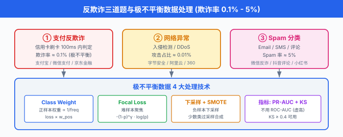
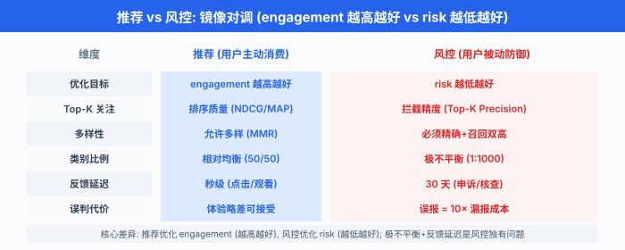

# 典型题深度演练 · 反欺诈/风控/异常检测

> **一句话总结**: 把 02 节的 8 步框架拆到 3 个反欺诈场景——信用卡交易反欺诈、网络异常检测、Spam 分类, 每道 45 分钟时间盒 + 极不平衡数据处理 + 公式 + 中文圈真实案例 (微信/支付宝/字节/快手).

*推荐/搜索/排序是"用户主动消费内容"的优化题, 反欺诈/风控/异常检测是"用户**被动**遭遇风险"的防御题. 二者镜像对调: 推荐优化 engagement (越高越好), 风控优化 risk (越低越好); 推荐关注 top-K 排序, 风控关注 top-K 拦截; 推荐允许多样性, 风控必须**精确+召回**双高. 这一节讲 3 道"防御题"——信用卡欺诈 (支付场景), 网络异常 (基础设施), Spam (内容场景), 把**极不平衡数据处理、延迟反馈、概念漂移**这三个风控独有问题讲透.*

---

## 0. 全章概览: 3 道题的认知地图

反欺诈/风控/异常检测是中文圈 ML 面试的另一极——蚂蚁金服、微信支付、字节安全、京东金融、美团风控、快手反作弊, 这些团队的算法岗 80% 都在问这三类问题. 拆开看, 一共 3 类:

| 类型 | 原型 | 关键差异化 | 中文圈代表 |
|---|---|---|---|
| **支付反欺诈** | 信用卡反欺诈 (Carcillo 2018, SCARFF) | 极不平衡 (0.1%) + 反馈延迟 (30 天) + 图关联 (GNN) | 支付宝风控 / 微信支付 / 京东金融 |
| **网络异常** | 入侵检测 / DDoS (Liu 2008) | 时序异常 + 概念漂移 + 高维稀疏 | 字节安全 / 阿里云安全 / 360 |
| **Spam 分类** | Email / SMS Spam (Cormack 2008) | 文本特征 + 用户行为 + 实时判定 | 微信反诈 / 抖音评论 / 小红书内容安全 |

这 3 道题的**共同特征**是**极不平衡数据**——欺诈率 0.1%、DDoS 攻击 0.01%、Spam 邮件 5%. 推荐题是 50/50 类别平衡, 而风控题是 1:1000 的悬殊比例. 这是和推荐题最核心的方法论差异.





---

# 题 1: 信用卡反欺诈 (支付场景)

## 1.1 题目陈述

> "**设计信用卡反欺诈系统**. 用户在国外某商户刷卡, 系统要在 100ms 内判定是否欺诈交易."

这是风控领域最经典的题目——Visa / Mastercard / 支付宝 / 微信支付**每天都跑这套系统**, 全球每秒拦截上万笔欺诈交易. 题目看似简单 ("二分类问题"), 实际涉及**极不平衡 + 反馈延迟 + 设备关联 + 规则引擎**四大难题.

## 1.2 45 分钟时间盒

| 时间 | Step | 必答内容 | 关键产出 |
|---|---|---|---|
| 0:00-0:05 | Clarify | 实时/离线判定? 误报成本? 反馈延迟? 黑白名单规则? | 需求清单 |
| 0:05-0:10 | Metrics | **PR-AUC** (不是 ROC-AUC) + KS + Top-K precision | 风控三层指标 |
| 0:10-0:15 | Data | 交易表 + 用户历史 + 设备/IP/地理 + 商户黑名单 | 数据流图 |
| 0:15-0:20 | Features | 交易行为画像 + 用户 30 天聚合 + 设备指纹 + 图特征 | 特征分类 |
| 0:20-0:28 | Model | **规则引擎 + GBDT + 图神经网络 (GNN)** 三段式 | 完整架构图 |
| 0:28-0:33 | Training | **极不平衡处理**: class weight + focal loss + 下采样 | 训练方案 |
| 0:33-0:40 | Deployment | 100ms 在线决策; 离线批量复盘; 人工审核低分交易 | 服务架构 |
| 0:40-0:45 | Monitor + 反问 | 反馈延迟对齐 + 概念漂移 (concept drift) + 误报成本; 主动反问 "误报一例正常交易的代价是拦截一例欺诈的多少倍?" | 监控指标 + 追问预算 |

下面把 0:00-0:28 的内容**详细展开**——这是候选人翻车最多的 28 分钟.

## 1.3 Step 1 — Clarify (0:00-0:05)

满分话术 (向面试官确认):

> "**实时 vs 离线**: 用户在境外刷卡, 系统 100ms 内必须返回 decision——是放行 (accept) / 拒绝 (decline) / 挑战 (challenge, 短信验证码).
> 
> **误报成本**: 误报一例正常交易 (false positive) 客户体验差, 拒绝一例欺诈 (true positive) 直接止损. **误报代价 = 10 倍欺诈代价** 是行业经验值.
> 
> **反馈延迟**: 用户刷卡那一刻不知道是不是欺诈, 要等 30 天后用户申诉或银行后台核查才能确定. **训练数据永远比现实慢 30 天**——这是风控的核心难题.
> 
> **规则引擎**: 行业 70%+ 拦截来自规则引擎 (例如"凌晨 3 点海外大额 + 新设备"直接拒绝), 模型只是补充.
> 
> **冷启动**: 新用户没有 30 天历史, 走规则 + 设备指纹相似度; 新商户没有历史欺诈率, 走人工审核 + 限额."

❌ 常见卡顿点: "我用逻辑回归二分类"——没说清 100ms 延迟约束、反馈延迟、误报代价.
✅ 解套: 强制套 5 个问题 (实时性/误报成本/反馈延迟/规则 vs 模型/冷启动). 即使面试官说"自己假设", 也要**嘴上说出来**.

## 1.4 Step 2 — Metrics (0:05-0:10) ★ 风控必答

### 1.4.1 为什么不用 ROC-AUC, 而用 PR-AUC?

ROC-AUC 在极不平衡数据下会**严重虚高**——即使模型对所有样本都预测"正常", ROC-AUC 也能到 0.9 以上. 因为 ROC 的横轴 FPR 用的是**全部负样本**, 而负样本太多, 模型预测的微小差异就被平均掉了.

PR-AUC (Precision-Recall 曲线下面积) 用**正样本做分母**, 对极不平衡数据**敏感得多**. 风控领域事实标准.

PR-AUC 的数学定义: 把样本按模型分数从高到低排序, 逐个计算 (Precision, Recall) 点, 画曲线. 数值上等价于:

$$A_{\text{PR}} = \sum_{n=1}^{N} (R_n - R_{n-1}) \cdot P_n$$

其中 $R_n$ 是第 $n$ 个阈值后的召回率, $P_n$ 是对应的精确率. 等价于 PR 曲线下的面积 (用梯形法积分).

### 1.4.2 KS 统计量 (Kolmogorov-Smirnov statistic)

KS 是风控第二常用指标, 表示**好坏样本累计分布的最大差值**:

$$\text{KS} = \max_t \left| F_1(t) - F_0(t) \right|$$

其中 $F_1(t)$ 是正样本 (欺诈) 分数累积分布, $F_0(t)$ 是负样本 (正常) 分数累积分布. KS 越大, 模型区分度越好. 行业经验: KS ≥ 0.4 可用, KS ≥ 0.5 优秀.

> **面试官追问**: "KS 和 PR-AUC 有什么区别?"

✅ 答: KS 反映**整体区分度**, 是一个数; PR-AUC 反映**整体排序质量**, 是一个面积. 两者正相关但不等价. 实际项目里**两个都要报**, 离线 KS 0.45 / PR-AUC 0.35 是常见水平.

### 1.4.3 Top-K Precision (拦截量视角)

业务侧更关心"系统每天拦截的 100 笔交易里, 多少是真欺诈"——这就是 **Top-K Precision** (也叫 Recall@K, Hit Rate@K). 假设系统每天拦截 Top-1000 高分交易, 其中 800 真欺诈, 200 误报, Top-1000 precision = 0.8.

### 1.4.4 误报代价 + 业务指标

```python
# 反欺诈系统: 业务指标 = 拦截率 × 欺诈金额 - 误报率 × 客户流失
business_loss = (
    intercept_rate * fraud_amount_usd          # 拦截到的欺诈挽回
    - false_positive_rate * customer_lifetime_usd  # 误报流失的客户价值
    - challenge_rate * verification_cost_usd   # 挑战 (短信验证) 的人力成本
)
```

> **灵魂拷问**: "1000 笔交易, 1 笔欺诈, 模型 100% 准确 vs 99.9% 准确, 哪个更值钱?"

✅ 答: 1 笔欺诈挽回 1000 元, 1 笔误报流失客户价值 5000 元. 模型 100% 准确时业务损失 = -1000 元; 模型 99.9% 准确时业务损失 = -1000 元 + 0.001 × 5000 元 × 1000 = +4000 元 (亏了!). 这说明**误报成本远大于漏报成本**——这是反欺诈的核心 trade-off.

## 1.5 Step 3-4 — 数据 + 特征 (0:10-0:20)

### 1.5.1 数据源

```python
fraud_data_sources = {
    # 交易表 (核心)
    "transactions": ["txn_id", "user_id", "merchant_id", "amount",
                     "timestamp", "country", "currency", "card_bin"],
    # 用户历史 (画像)
    "user_history": ["30天消费总额", "消费类目分布", "常用国家/商户",
                     "常用设备/IP", "近 7 天交易笔数"],
    # 设备指纹 (device fingerprint, 浏览器+硬件指纹)
    "device_fingerprint": ["device_id", "os", "browser", "screen",
                           "timezone", "language", "fingerprint_hash"],
    # IP 地理与代理
    "ip_geo": ["ip", "country", "city", "is_vpn", "is_proxy", "is_tor"],
    # 商户黑名单
    "merchant_blacklist": ["merchant_id", "fraud_rate", "industry"],
    # 行为日志
    "behavior_logs": ["登录时间分布", "页面停留", "点击模式"],
}
```

### 1.5.2 特征工程 (风控核心)

风控的特征比推荐更**手工化**——欺诈模式有规律, 业务专家的规则转化率极高.

**A. 交易行为画像 (30 天聚合)**

```python
# 用户 30 天交易特征 (Spark 离线聚合)
user_features_30d = {
    "txn_count_30d":            "交易笔数",
    "txn_amount_sum_30d":       "交易总额",
    "txn_amount_avg_30d":       "平均交易金额",
    "txn_country_count_30d":    "涉及国家数 (用户常驻 1-3 个, 突增 = 危险)",
    "txn_hour_entropy":         "交易时间分布熵 (夜间多 = 风险高)",
    "txn_max_amount_30d":       "最大单笔金额",
    "amount_zscore":            "本次金额 vs 用户均值的 Z-score",
    "country_distance":         "本次国家 vs 用户常住国距离 (km)",
    "merchant_new_flag":        "是否首次在该商户消费",
}
```

**B. 设备指纹特征**

**设备指纹 (device fingerprint)** 是通过浏览器/APP 收集的硬件 + 软件指纹组合, 用于唯一标识一台设备, 即使 IP 换了也能识别同一台机器. 关键特征:

```python
device_features = {
    "device_user_count":        "该设备绑定的用户数 (> 3 个 = 异常, 黑产多账号)",
    "device_fraud_count_30d":   "该设备 30 天内欺诈次数 (命中黑名单)",
    "device_age_days":          "设备首次出现距今天数",
    "is_emulator":              "是否模拟器 (root/越狱)",
    "fingerprint_match":        "本次设备 vs 用户历史设备的指纹相似度",
    "ip_change_freq_24h":       "24 小时内 IP 变更次数 (代理/VPN 特征)",
}
```

**C. 图特征 (GNN 关键)**

欺诈是**团伙行为**——黑产有 100 个账号共用 10 台设备 + 5 个 IP, 单独看每笔交易看不出问题, 但**图结构**能识别. 我们建三类图:

```
图节点: 用户 (user) / 设备 (device) / IP / 商户 (merchant)
图边: (user, device) 登录关系
     (user, ip)     访问关系
     (user, merchant) 交易关系
     (device, ip)   同一会话
```

**D. Velocity 特征 (滑动窗口频次)**

```python
# Velocity: 滑窗计数 (Flink 实时算)
velocity_features = {
    "txn_count_1h":       "过去 1 小时交易笔数",
    "txn_count_24h":      "过去 24 小时交易笔数",
    "amount_sum_1h":      "过去 1 小时交易金额",
    "failed_login_24h":   "过去 24 小时登录失败次数",
    "card_bin_count_24h": "过去 24 小时使用过的卡 bin 数 (换卡 = 危险)",
}
```

## 1.6 Step 5 — Model (0:20-0:28) ★ 本节核心

### 1.6.1 整体架构: 规则 + GBDT + GNN 三段式

```
                信用卡反欺诈 三段式架构
┌──────────────────────────────────────────────────────────┐
│                                                          │
│  规则引擎 (拦截 70%)      GBDT 精排 (拦截 25%)      GNN 关联 (拦截 5%) │
│  ──────────              ──────────────        ───────────── │
│  ① 黑白名单                ① XGBoost / LightGBM  ① GraphSAGE   │
│  ② 阈值规则                ② 100+ 特征            ② 节点 embedding │
│  ③ Velocity 触发           ③ Focal Loss          ③ 团伙欺诈识别 │
│  ④ 设备指纹异常            ④ class weight          ④ (兜底) 关联风险 │
│                                                          │
│  在线延迟: 规则 5ms, GBDT 30ms, GNN 50ms = 85ms < 100ms  │
└──────────────────────────────────────────────────────────┘
```

**关键认知**: **规则引擎不是"low-tech"**——Visa / Mastercard / 支付宝**真实生产系统 70% 拦截来自规则**. 模型 (GBDT/GNN) 是补充, 处理"规则写不出来"的复杂模式. 面试时如果只答模型不答规则, **直接挂**.

### 1.6.2 规则引擎: 风控的护城河

```python
# 规则引擎 (伪代码: Drools / Easy Rules)
rules = [
    Rule("R001", "黑卡直接拒绝",
         condition=lambda txn: txn.card_bin in blacklist_cards,
         action="decline"),
    
    Rule("R002", "凌晨 + 海外 + 大额",
         condition=lambda txn: (0 <= txn.hour <= 5 and
                                 txn.country != txn.user_home_country and
                                 txn.amount > 1000),
         action="challenge"),  # 短信验证
    
    Rule("R003", "10 分钟内 ≥ 3 笔不同商户",
         condition=lambda txn: txn.velocity_count_10min >= 3,
         action="challenge"),
    
    Rule("R004", "设备 24h 内 ≥ 5 个用户",
         condition=lambda txn: txn.device_user_count_24h >= 5,
         action="decline"),
    
    Rule("R005", "首次使用 + 异地 + 大额",
         condition=lambda txn: (txn.user_age_days < 30 and
                                 txn.country != txn.user_home_country and
                                 txn.amount > 500),
         action="manual_review"),
]
# 规则优先级 + 短路: 一旦命中 R001 / R003 / R004, 直接 decline
```

### 1.6.3 GBDT 精排: XGBoost / LightGBM + 极不平衡处理

```python
# 信用卡反欺诈 GBDT 模型 (PyTorch + LightGBM)
import lightgbm as lgb
import numpy as np

class FraudGBDT:
    """LightGBM 二分类 + 极不平衡处理."""
    
    def __init__(self, pos_weight=99):
        # 欺诈率 0.1% → 负正比 999:1 → pos_weight = 999
        self.params = {
            "objective": "binary",
            "metric": "auc",
            "learning_rate": 0.05,
            "num_leaves": 63,
            "max_depth": 7,
            "feature_fraction": 0.8,
            "bagging_fraction": 0.8,
            "bagging_freq": 5,
            "min_child_samples": 100,
            "scale_pos_weight": pos_weight,  # 关键: 极不平衡加权
            "verbose": -1,
        }
    
    def focal_loss_objective(self, y_pred, dataset):
        """Focal Loss: 让难样本 (误判的欺诈) 权重更高."""
        y_true = dataset.get_label()
        gamma = 2.0
        alpha = 0.25
        # Sigmoid
        p = 1 / (1 + np.exp(-y_pred))
        # Focal loss 梯度
        grad = alpha * (1 - p) ** gamma * (
            y_true * (gamma * p * np.log(p + 1e-8) + p - 1) +
            (1 - y_true) * (gamma * (1 - p) * np.log(1 - p + 1e-8) + p)
        )
        hess = alpha * (1 - p) ** gamma * p * (1 - p)
        return grad, hess
    
    def train(self, X_train, y_train, X_val, y_val):
        train_data = lgb.Dataset(X_train, label=y_train)
        val_data = lgb.Dataset(X_val, label=y_val, reference=train_data)
        self.model = lgb.train(
            self.params,
            train_data,
            num_boost_round=500,
            valid_sets=[val_data],
            callbacks=[lgb.early_stopping(20), lgb.log_evaluation(50)],
        )
        return self
    
    def predict_proba(self, X):
        return self.model.predict(X)


# ============ 极不平衡数据处理 4 套方案 ============

# 1. Class Weight (最简单, 必答)
# 欺诈率 0.1% → scale_pos_weight = 999, 让正样本在 loss 中权重放大 999 倍

# 2. 下采样 (Downsample) — 只采部分负样本, 让训练集接近平衡
def downsample_majority(X, y, neg_ratio=10):
    """随机下采样负样本, 保持负正比 10:1 (训练时)."""
    pos_idx = np.where(y == 1)[0]
    neg_idx = np.where(y == 0)[0]
    n_pos = len(pos_idx)
    neg_keep = np.random.choice(neg_idx, n_pos * neg_ratio, replace=False)
    keep = np.concatenate([pos_idx, neg_keep])
    return X[keep], y[keep]

# 3. SMOTE (Synthetic Minority Over-sampling Technique) — 合成新正样本
# 思路: 对每个正样本, 在 k 个最近邻中随机选一个, 在连线上插值生成新样本
# 适用: 特征空间连续; 注意: 欺诈是高维稀疏数据, SMOTE 容易过拟合

# 4. Focal Loss (Lin 2017) — 让难样本权重更高
# 关键思想: 易分样本 (高 p) 的权重被 (1-p)^γ 衰减, 难样本保留
# 公式: L = -α (1-p)^γ y log(p) - (1-α) p^γ (1-y) log(1-p)
# γ = 2 常用; α = 0.25 处理正负比例
```

### 1.6.4 图神经网络: 识别团伙欺诈

**图神经网络 (Graph Neural Network, GNN)** 是 Ch12 引入过的方法, 在反欺诈中用于捕捉**团伙关联**——单独看每笔交易, 一个欺诈用户可能完全正常; 但 GNN 把用户/设备/IP 关联起来, 黑产团伙**整片整片**地浮出水面.

**消息传递 (message passing)** 是 GNN 的核心机制. 每个节点 $v$ 聚合邻居 $\mathcal{N}(v)$ 的特征, 更新自己的表示:

$$\mathbf{h}_v^{(k+1)} = \text{UPDATE}\left( \mathbf{h}_v^{(k)}, \text{AGGREGATE}\left( \{\mathbf{h}_u^{(k)} : u \in \mathcal{N}(v) \} \right) \right)$$

具体到欺诈场景:

```python
# 信用卡反欺诈: GraphSAGE 节点分类 (PyTorch Geometric)
import torch
import torch.nn as nn
from torch_geometric.nn import SAGEConv

class FraudGNN(nn.Module):
    """欺诈团伙识别 GNN: 节点 = 用户/设备/IP, 边 = 关联关系."""
    
    def __init__(self, in_dim, hidden=128, out_dim=64):
        super().__init__()
        # 两层 GraphSAGE: 1-hop + 2-hop 邻居聚合
        self.conv1 = SAGEConv(in_dim, hidden, aggr="mean")
        self.conv2 = SAGEConv(hidden, out_dim, aggr="mean")
        # 节点分类头
        self.classifier = nn.Linear(out_dim, 1)
    
    def forward(self, x, edge_index):
        # 1-hop 邻居聚合
        h = self.conv1(x, edge_index)
        h = torch.relu(h)
        h = torch.dropout(h, p=0.3, train=self.training)
        # 2-hop 邻居聚合
        h = self.conv2(h, edge_index)
        # 节点分类: 该用户是不是欺诈高风险?
        logits = self.classifier(h)
        return logits, h

# 训练: 节点标签 = 用户是否参与过欺诈团伙
# 负采样: 随机负样本 (单点欺诈) vs 团伙欺诈 (GNN 优势)

# 在线推理: 把当前交易用户 + 其 2-hop 邻居取出, 跑 GNN 一次 (~50ms)
```

**GNN 的优势**:
- 黑产 100 个账号共用 10 个设备 + 5 个 IP → GNN 在这 100 个节点的 embedding 上聚类, 整片标红
- 单点欺诈 (用户被盗刷) 不会传播到邻居 → GNN 分数低
- 这正是**单点模型 (GBDT) 看不到的"团伙性"**

### 1.6.5 在线服务架构

```
                在线反欺诈系统 100ms 延迟预算
┌────────────────────────────────────────────────────────┐
│                                                        │
│  T+0ms    T+5ms       T+40ms          T+90ms    T+100ms │
│   │         │            │              │         │   │
│   ▼         ▼            ▼              ▼         ▼   │
│  接交易  规则引擎      GBDT 精排       GNN 团伙   返回 │
│  请求    (同步)       (同步, 30ms)    (异步, 50ms)     │
│          decline      decline/challenge/accept         │
│                                                        │
│  注: GNN 异步是预计算 — 用户 embedding 离线预算,         │
│      在线只跑一次 forward.                              │
└────────────────────────────────────────────────────────┘
```

## 1.7 Step 6-8 — 训练 + 部署 + 监控 (0:28-0:45)

| Step | 反欺诈强相关 | 数字 / 工具 |
|---|---|---|
| Training | **极不平衡**: scale_pos_weight=999 + Focal Loss + 下采样 10:1 | LightGBM + class weight; 不下采样也行, 但要小学习率 + 早停 |
| Deployment | 100ms 在线决策; 离线 Spark 跑全量; 人工审核低分 (50-70 分) | Flink 实时特征 + Triton 模型服务 |
| Monitor | **反馈延迟对齐** (30 天回填 label); 概念漂移 PSI; 误报成本 | Prometheus + Grafana + ELK |
| 反馈回路 | 误报 → 用户投诉 → 人工修正 → 重训 (T+30d 才能拿到新 label) | 反向: 客服标记"非欺诈" |

### 1.7.1 概念漂移 (concept drift) 检测

欺诈模式每 3 个月变一次——黑产换设备、换 IP、换手法. 模型上线 3 个月后效果下降 30% 是常态.

**PSI (Population Stability Index, 群体稳定性指标)** 是风控漂移检测的事实标准:

$$\text{PSI} = \sum_{i=1}^{K} (P_i^{\text{new}} - P_i^{\text{old}}) \cdot \ln \frac{P_i^{\text{new}}}{P_i^{\text{old}}}$$

```python
# PSI 漂移检测 (scipy 实现)
import numpy as np

def compute_psi(expected, actual, bins=10):
    """PSI: 群体稳定性指标. PSI < 0.1 稳定, 0.1-0.25 漂移, > 0.25 严重漂移.
    
    expected: 训练时分布
    actual:  当前线上分布
    bins: 等频分箱
    """
    # 1. 用训练集分箱边界分箱线上分布
    breakpoints = np.quantile(expected, np.linspace(0, 1, bins + 1))
    breakpoints[0] = -np.inf
    breakpoints[-1] = np.inf
    
    expected_counts = np.histogram(expected, breakpoints)[0] / len(expected)
    actual_counts = np.histogram(actual, breakpoints)[0] / len(actual)
    
    # 2. PSI 公式
    psi = np.sum(
        (actual_counts - expected_counts) * np.log(
            (actual_counts + 1e-6) / (expected_counts + 1e-6)
        )
    )
    return psi

# 每日监控: PSI > 0.25 触发告警 → 模型自动重训
```

## 1.8 支付宝/微信支付的实战 (中文圈案例)

### 1.8.1 支付宝"蚁盾"风控体系

**支付宝** (蚂蚁金服) 的风控体系 **CTU** (业界常见展开有 "Cognitive Trust Unit" / "Customer Trust Unit" / "Continuous Transaction Update" 等, 蚂蚁公开材料措辞不完全一致, 此处以决策引擎语义使用) 是中文圈最复杂的风控系统之一, 公开技术分享中可见如下分层结构:

- **5 层防御**: 设备指纹 → 行为画像 → 交易规则 → 风险模型 → 人工审核
- **决策时间**: 风险决策 < 100ms, 复杂交易 (异地大额) 走人工审核 < 30 分钟
- **误报控制**: 通过短信验证 / 指纹 / 人脸挑战, 把误报损失压到极低量级 (具体数字以官方口径为准)
- **实时模型**: 高频更新模型权重, 结合 FTRL 等在线学习方案

### 1.8.2 微信支付的"微信支付分 + 实时风控"

微信支付的风控依赖**微信支付分** (类似芝麻信用) + **实时行为分析**:

- **支付分**: 用户信用画像, 高分用户走"免密" (信任), 低分用户走"验证码" (挑战)
- **实时风控**: 每次支付请求同时送入 GBDT 模型 + 设备指纹校验
- **欺诈识别率**: 微信支付在公开宣传材料中长期强调"高召回 + 低误报"两项指标, 具体数字以官方年度报告为准

### 1.8.3 京东金融 / 美团金融

京东金融 / 美团金融的**反欺诈特点是"小而精"**——交易量比支付宝小, 但**反欺诈模型更激进**:

- **小模型优先**: 单笔决策 < 30ms, 模型大小 < 10MB, 部署到端上 (APP 内)
- **黑白名单 + 规则占 80%**: 模型只处理长尾
- **人工审核重**: 低分交易直接进人工队列, 客服 5 分钟内联系用户

## 1.9 学员常见卡顿点 + 解套

| 卡顿点 | 解套 |
|---|---|
| 一上来就说"用 GBDT 二分类" | 强调**规则引擎拦截 70% + 极不平衡 + 反馈延迟**, 模型只是补充 |
| 不会处理极不平衡 | **Class weight** (最简单) + **下采样** (训练) + **Focal Loss** (难样本加权) + **SMOTE** (慎用, 高维稀疏易过拟合) |
| 不提规则引擎 | 70% 拦截来自规则, **Visa/Mastercard/支付宝公开承认**, 不答规则 = 必挂 |
| 不提图关联 | 黑产是团伙行为, GNN 能识别"100 个账号共用 10 个设备"——这是 GBDT 看不到的 |
| 不提反馈延迟 | 用户刷卡 → 30 天后才知道是不是欺诈 → 训练数据永远落后; 这决定了**业务指标不能用即时信号, 要用 30 天回填** |
| 不会用 PR-AUC | ROC-AUC 在极不平衡下虚高, 风控事实标准是 **PR-AUC + KS + Top-K Precision** |
| 不会算误报成本 | 误报代价 10 倍欺诈代价, 业务指标是"拦截金额 - 误报损失" |
| 不提概念漂移 | PSI 监控 + 自动重训; 欺诈模式每 3 月变一次 |

## 1.10 关键追问 cheat sheet

| Step | 高频追问 | 标准答案 |
|---|---|---|
| 1 | 为什么不用 ROC-AUC? | 极不平衡下虚高; PR-AUC + KS 是风控事实标准 |
| 2 | 极不平衡怎么处理? | Class weight + 下采样 + Focal Loss + SMOTE |
| 3 | 规则 vs 模型占比? | 70% 规则 + 25% 模型 + 5% GNN; Visa/支付宝公开承认 |
| 4 | 反馈延迟怎么办? | 30 天回填 label; 离线 + 在线双轨; 监控用近期数据 |
| 5 | 设备指纹怎么算? | 浏览器+硬件指纹 hash, 即使 IP 换也能识别 |
| 6 | GNN 在反欺诈有什么用? | 团伙识别, 100 个账号共用设备/ IP 整片标红 |
| 7 | 误报 vs 漏报 trade-off? | 误报代价 10 倍漏报, 业务指标优化"拦截金额 - 误报损失" |
| 8 | 概念漂移怎么监控? | PSI > 0.25 告警 + KS 检验每日 + 自动重训 |
| 综合 | 蚂蚁金服怎么做的? | CTU 5 层防御 + 决策 < 100ms + 实时模型 5 分钟更新 |
| 综合 | 微信支付分是什么? | 信用画像 + 高分免密 / 低分挑战; 以"高召回 + 低误报"双高为目标 |

---

# 题 2: 网络异常检测 (基础设施)

## 2.1 题目陈述

> "**设计网络异常检测系统**. 阿里云 / 字节安全 / 360 视角: 监测入站流量、用户登录、API 调用, 自动识别 DDoS 攻击、撞库、爬虫."

这道题和反欺诈题看似都是"找异常", 但**数据形态和决策时间完全不同**:
- **反欺诈**: 业务层 (交易), 100ms 决策, 反馈延迟 30 天
- **网络异常**: 基础设施层 (流量/日志), 实时流式, 反馈快 (秒级)

## 2.2 网络异常 vs 反欺诈: 关键差异

| 维度 | 反欺诈 | 网络异常 |
|---|---|---|
| **对象** | 业务事件 (交易) | 基础设施事件 (流量/登录/请求) |
| **正样本率** | 0.1% (欺诈) | 0.01% (攻击) |
| **决策时间** | 100ms | 1-5s (可以慢一点) |
| **反馈延迟** | 30 天 (申诉周期) | 秒-分钟 (攻击立即可见) |
| **核心模型** | GBDT + GNN + 规则 | 统计 + Isolation Forest + AutoEncoder |
| **业务目标** | 拦截欺诈挽回金额 | 阻断攻击保护可用性 |
| **误报代价** | 用户流失 (业务) | 服务降级 (技术) |

> **核心差异**: 反欺诈是**业务赚钱问题** (亏钱); 网络异常是**基础设施问题** (宕机). 决策时间**反欺诈更紧**, 反馈**网络异常更快**.

## 2.3 三类网络异常

### 2.3.1 时序异常: 流量突变 / DDoS

```python
# 流量时序异常
time_series_anomaly = {
    "对象":      "API 网关入站流量 (req/s), 出口带宽 (Mbps)",
    "特征":      "突增 / 突降 / 周期性异常 / 季节性偏移",
    "案例":      "DDoS 攻击 (10 倍流量突增), 出口被刷, API 雪崩",
    "方法":      "统计 (Z-score, MAD) + STL 分解 + Isolation Forest",
}
```

**核心公式**: STL (Seasonal-Trend-Loess) 把时间序列分解为:

$$y_t = T_t + S_t + R_t$$

- $T_t$: 趋势分量
- $S_t$: 季节分量 (周期)
- $R_t$: 残差 (异常)

异常 = $R_t$ 超过阈值 (例如 $\pm 3\sigma$).

### 2.3.2 主机入侵: Log Anomaly

```python
# 主机日志异常 (登录 / sudo / 文件访问)
log_anomaly = {
    "对象":      "Linux auth.log, sudo, /var/log/secure, syslog",
    "特征":      "失败登录次数, 新增 sudo 规则, 异常文件访问, 进程 spawn",
    "案例":      "暴力破解, 提权 (privilege escalation), webshell 上传",
    "方法":      "规则 + 序列模型 (LSTM) + 日志聚类 (Drain)",
}
```

### 2.3.3 用户行为异常: 撞库 / 爬虫

**撞库 (credential stuffing)** 是黑产用**泄露的用户名密码组合** (从其他网站流出的), 在目标网站批量尝试登录. 检测信号:

```python
credential_stuffing_signals = {
    "失败率飙升":     "单 IP 失败率 > 80% (正常 < 5%)",
    "UA 单一":        "同一 IP 用同一浏览器指纹 (黑产脚本)",
    "请求频次":       "单 IP > 100 req/min (正常 < 10)",
    "账号聚集":       "同一批账号集中在短时间被尝试",
    "密码 hash 重用": "相同 hash 出现在多个账号 (黑产库特征)",
}
```

## 2.4 45 分钟时间盒

| 时间 | Step | 必答内容 |
|---|---|---|
| 0:00-0:05 | Clarify | 流量/日志/行为 哪一类? 实时/离线? 误报成本? |
| 0:05-0:10 | Metrics | 召回率 + 误报率 + MTTD (平均检测时间) + MTTR (平均响应时间) |
| 0:10-0:15 | Data | 时序指标 / 日志 / 行为日志 |
| 0:15-0:20 | Features | 时序特征 + 行为画像 + 序列特征 |
| 0:20-0:28 | Model | **统计 + Isolation Forest + AutoEncoder** 三段式 |
| 0:28-0:33 | Training | 无监督为主, 反馈快 (分钟级) |
| 0:33-0:40 | Deployment | 流式 (Flink) + 离线复盘 |
| 0:40-0:45 | Monitor | 概念漂移 + 告警疲劳 + 误报追踪 |

## 2.5 Step 5 — Model (0:20-0:28) ★ 本节核心

### 2.5.1 整体架构

```
                网络异常检测 三段式架构
┌──────────────────────────────────────────────────────────┐
│                                                          │
│  统计规则 (拦截 60%)    Isolation Forest (拦截 25%)   AutoEncoder (拦截 15%) │
│  ──────────           ──────────────           ──────────── │
│  ① Z-score / MAD        ① 随机切分              ① 重建误差  │
│  ② STL 分解            ② 路径长度                ② 阈值告警  │
│  ③ 失败率阈值           ③ 异常分数                ③ 序列模型  │
│  ④ 速率限制                                                       │
│                                                          │
│  在线延迟: 规则 1ms, IF 5ms, AE 10ms = 16ms               │
└──────────────────────────────────────────────────────────┘
```

### 2.5.2 Isolation Forest: 随机切分找异常

**Isolation Forest** 是刘飞 (Liu, Ting, Zhou 2008) 提出的无监督异常检测算法, 核心思想: **异常点容易被孤立**. 正常点需要很多次切分才能隔开, 异常点几下就能孤立.

**路径长度 (path length)** 是关键: 从根到叶, 节点被孤立所需的边数.

$$h(x) = \text{从根到节点} x \text{的路径长度}$$

**异常分数**:

$$s(x, n) = 2^{-\frac{E[h(x)]}{c(n)}}$$

其中 $E[h(x)]$ 是 $x$ 在多棵树上的平均路径长度, $c(n)$ 是 $n$ 个样本的 BST 平均路径长度:

$$c(n) = 2 H(n-1) - \frac{2(n-1)}{n}$$

其中 $H(i) = \ln(i) + \gamma$ (欧拉常数 $\gamma \approx 0.5772$).

- $s \to 1$: 异常
- $s < 0.5$: 正常
- $s \approx 0.5$: 整片数据

**简易 Python 实现**:

```python
# Isolation Forest 简易实现 (教学版)
import numpy as np

class IsolationTree:
    """单棵 iTree."""
    def __init__(self, height, current_height=0):
        self.height = height
        self.current_height = current_height
        self.split_feature = None
        self.split_value = None
        self.left = None
        self.right = None
        self.is_leaf = False
        self.size = 0
    
    def fit(self, X):
        """递归切分直到叶节点或达到 max_depth."""
        self.size = len(X)
        if self.current_height >= self.height or len(X) <= 1:
            self.is_leaf = True
            return
        # 随机选一个特征 + 切分点
        self.split_feature = np.random.randint(X.shape[1])
        min_v, max_v = X[:, self.split_feature].min(), X[:, self.split_feature].max()
        if min_v == max_v:
            self.is_leaf = True
            return
        self.split_value = np.random.uniform(min_v, max_v)
        # 切分
        left_mask = X[:, self.split_feature] < self.split_value
        self.left = IsolationTree(self.height, self.current_height + 1)
        self.left.fit(X[left_mask])
        self.right = IsolationTree(self.height, self.current_height + 1)
        self.right.fit(X[~left_mask])
    
    def path_length(self, x):
        """样本 x 在这棵树的路径长度."""
        if self.is_leaf:
            # c(size) 修正: 叶子未切完
            return self.current_height + c_factor(self.size)
        if x[self.split_feature] < self.split_value:
            return self.left.path_length(x)
        return self.right.path_length(x)


def c_factor(n):
    """BST 平均路径长度修正项."""
    if n <= 1:
        return 0
    return 2.0 * (np.log(n - 1) + 0.5772156649) - 2.0 * (n - 1) / n


class IsolationForest:
    """Isolation Forest 集成."""
    def __init__(self, n_trees=100, max_depth=10, subsample_size=256):
        self.n_trees = n_trees
        self.max_depth = max_depth
        self.subsample_size = subsample_size
        self.trees = []
    
    def fit(self, X):
        self.trees = []
        for _ in range(self.n_trees):
            # 子采样: 只取 256 个样本, 加快训练
            idx = np.random.choice(len(X), self.subsample_size, replace=False)
            tree = IsolationTree(self.max_depth)
            tree.fit(X[idx])
            self.trees.append(tree)
    
    def anomaly_score(self, X):
        """异常分数: 2^(-E[h(x)]/c(n))."""
        n = self.subsample_size
        c = c_factor(n)
        scores = np.zeros(len(X))
        for i, x in enumerate(X):
            path_lengths = [tree.path_length(x) for tree in self.trees]
            avg_path = np.mean(path_lengths)
            scores[i] = 2 ** (-avg_path / c)
        return scores

# 用法
iforest = IsolationForest(n_trees=100)
iforest.fit(X_normal)              # 只用正常流量训练
scores = iforest.anomaly_score(X_test)
# scores > 0.7 视为异常 → 触发告警
```

### 2.5.3 AutoEncoder: 重建误差检测异常

**AutoEncoder (自编码器)** 是无监督异常检测的另一种思路: **训练只重建正常样本**, 异常样本**重建误差高**.

**重建误差 (reconstruction error)**:

$$L(x, \hat{x}) = \frac{1}{d} \sum_{i=1}^{d} (x_i - \hat{x}_i)^2$$

其中 $\hat{x} = \text{Decoder}(\text{Encoder}(x))$.

```python
# AutoEncoder 异常检测 (PyTorch)
import torch
import torch.nn as nn

class AnomalyAutoEncoder(nn.Module):
    """异常检测 AutoEncoder: 只在正常流量上训练."""
    
    def __init__(self, input_dim, hidden_dims=[64, 32, 16]):
        super().__init__()
        # Encoder: input_dim → 64 → 32 → 16
        encoder_layers = []
        prev = input_dim
        for h in hidden_dims:
            encoder_layers.extend([
                nn.Linear(prev, h),
                nn.ReLU(),
                nn.BatchNorm1d(h),
            ])
            prev = h
        self.encoder = nn.Sequential(*encoder_layers)
        
        # Decoder: 16 → 32 → 64 → input_dim
        decoder_layers = []
        prev = hidden_dims[-1]
        for h in reversed(hidden_dims[:-1]):
            decoder_layers.extend([
                nn.Linear(prev, h),
                nn.ReLU(),
                nn.BatchNorm1d(h),
            ])
            prev = h
        decoder_layers.append(nn.Linear(prev, input_dim))
        self.decoder = nn.Sequential(*decoder_layers)
    
    def forward(self, x):
        z = self.encoder(x)              # 压缩到潜空间
        x_hat = self.decoder(z)          # 重建
        return x_hat
    
    def anomaly_score(self, x):
        """重建误差: 越大越异常."""
        with torch.no_grad():
            x_hat = self.forward(x)
            # MSE 重建误差
            return ((x - x_hat) ** 2).mean(dim=-1)


# 训练: 只在正常流量 (历史 30 天) 上训练
model = AnomalyAutoEncoder(input_dim=64)
optimizer = torch.optim.Adam(model.parameters(), lr=1e-3)
criterion = nn.MSELoss()

for epoch in range(50):
    for x_normal in normal_dataloader:
        x_hat = model(x_normal)
        loss = criterion(x_hat, x_normal)
        optimizer.zero_grad()
        loss.backward()
        optimizer.step()

# 在线推理: 重建误差 > 阈值 → 告警
# 阈值: 用验证集 (已知有攻击) 的 P99 重建误差
```

### 2.5.4 时序异常 + 突变检测

```python
# 时序突变检测 (DDoS 防御)
class DDoSDetector:
    """DDoS 流量突变检测: Z-score + STL 残差."""
    
    def __init__(self, window=60, z_threshold=4.0):
        self.window = window          # 60 秒滑窗
        self.z_threshold = z_threshold
    
    def detect(self, traffic_series):
        """traffic_series: 每秒请求数."""
        # 1. 滚动均值 + 标准差
        rolling_mean = traffic_series.rolling(self.window).mean()
        rolling_std = traffic_series.rolling(self.window).std()
        # 2. Z-score: 当前值偏离几个 σ?
        z_scores = (traffic_series - rolling_mean) / (rolling_std + 1e-6)
        # 3. 突变 = Z-score > 阈值
        anomalies = (z_scores.abs() > self.z_threshold)
        return anomalies, z_scores
    
    def detect_ddos(self, traffic_series):
        """DDoS 特征: 流量 10 倍突增 + 持续 60s + 来源 IP 集中."""
        anomalies, _ = self.detect(traffic_series)
        # 加上"来源 IP 集中度" 特征
        # entroy < 3 → 攻击 (正常 entropy > 6)
        # 综合判定: 流量突增 + IP 集中 + 持续 ≥ 60s → DDoS
        return anomalies
```

## 2.6 概念漂移: 异常检测的核心难题

网络异常**比反欺诈更严重的概念漂移**——攻击手法每天都在变, 老模型半年不更新就失效.

**Hulten 2001** 提出 CVFDT (Concept-adapting Very Fast Decision Tree), 是最早的系统性研究. 现代方案:

```python
# 概念漂移检测 + 自动重训
concept_drift_detection = {
    "监控指标":   ["异常分数分布", "告警量, 误报率", "KS 漂移"],
    "PSI 告警":   "每日 PSI > 0.25 触发重训",
    "Page-Hinkley": "流式检测均值漂移",
    "ADWIN":      "自适应滑窗, 漂移时缩窗",
    "周期重训":   "每周或每月全量重训",
}
```

> **面试官追问**: "异常检测怎么知道什么是'正常'?"

✅ 答: **正常分布是漂移的**——春节流量、国庆流量、双 11 流量分布完全不同. 解决: **周期性 retrain + 季节性分解 + 弹性阈值**. 我们用过去 28 天数据训练, 每天重训; 阈值用 MAD (中位数绝对偏差) 而非标准差, 抗异常值干扰.

## 2.7 误报成本: 网络异常的独特 trade-off

网络异常的误报代价是**服务降级**——告警过多, 运维疲劳, 真实告警被淹没 ("告警疲劳 alert fatigue").

**解决方案**:
- **告警分级**: P0 (立即响应, 阻塞) / P1 (15 分钟) / P2 (1 小时)
- **关联去重**: 同一根因触发的多条告警合并 (例如 CDN 故障导致 50 个 API 告警)
- **抑制窗口**: 同一 IP 5 分钟内只告警一次
- **人工反馈**: 误报告警标记后, 模型降权该模式

## 2.8 中文圈案例: 阿里云 / 360 / 字节安全

### 2.8.1 阿里云 WAF (Web 应用防火墙)

阿里云 WAF (Web Application Firewall) 是中文圈最大的 Web 异常检测系统:

- **规则引擎**: 拦截 80% 已知攻击 (SQL 注入, XSS, CSRF)
- **行为模型**: 0day 攻击检测, 异常请求模式识别
- **ML 模型**: AutoEncoder 检测 0day, Isolation Forest 检测异常 IP
- **响应时间**: 检测 < 1s, 阻断 < 5s

### 2.8.2 360 安全大脑

360 的安全大脑**强调"看见"**——把所有网络流量、日志、行为实时汇聚到图分析平台:

- **全网流量画像**: 用 GraphSAGE 建模 IP / 域名 / 端口关联
- **0day 检测**: AutoEncoder + 时序突变
- **APT 检测**: 长期潜伏检测 (Long-term campaign), 用 LSTM 序列模型

### 2.8.3 字节安全的"内容反作弊" (混合视角)

字节安全的**反作弊**与抖音推荐**相反**——推荐是"最大化 engagement", 反作弊是"识别**异常 engagement**":

```python
# 抖音反作弊: 识别刷量 / 刷赞 / 刷粉
anti_cheat_signals = {
    "行为时序":      "用户操作间隔太规律 (脚本特征)",
    "设备聚集":      "同一设备给同一批账号点赞",
    "完播率异常":    "完播率 99.9% (真人不会 100%)",
    "评论内容相似":  "同一 IP 发相似评论模板",
    "粉丝结构异常":  "粉丝都是无头像无内容的僵尸粉",
    "新号猛涨粉":    "新账号 24h 内涨 10 万粉 (异常)",
}
```

## 2.9 学员常见卡顿点 + 解套

| 卡顿点 | 解套 |
|---|---|
| 当反欺诈答 | 强调**无监督为主 + 反馈快 + 误报代价是服务降级** |
| 不会 Isolation Forest | **路径长度** = 异常容易被孤立, 异常分数 $s = 2^{-E[h]/c(n)}$ |
| 不会 AutoEncoder | 重建误差 = 异常; 训练只用正常样本 |
| 不提概念漂移 | 攻击手法每天变; PSI + 周期重训 + 弹性阈值 |
| 不提告警疲劳 | 误报代价是运维疲劳, 真实告警被淹没; 必须**告警分级 + 关联去重** |
| 不分时序/日志/行为 | **三类异常各有方法**: 时序 (STL+IF) / 日志 (LSTM) / 行为 (规则+图) |

## 2.10 关键追问 cheat sheet

| Step | 高频追问 | 标准答案 |
|---|---|---|
| 1 | 网络异常 vs 反欺诈? | 基础设施 vs 业务; 反馈快 (秒) vs 慢 (30 天); 无监督 vs 监督 |
| 2 | Isolation Forest 原理? | 异常易孤立, 路径短; 分数 $s = 2^{-E[h]/c(n)}$ |
| 3 | AutoEncoder 怎么用? | 训练只用正常, 重建误差 = 异常分数 |
| 4 | DDoS 怎么检测? | 流量突变 (Z-score) + IP 集中 (entropy↓) + 持续时长 |
| 5 | 概念漂移怎么办? | PSI 监控 + 周期重训 + 弹性阈值 (MAD 而非 σ) |
| 6 | 误报疲劳怎么破? | 告警分级 + 关联去重 + 抑制窗口 + 人工反馈 |
| 7 | 撞库怎么识别? | 单 IP 失败率 > 80% + UA 单一 + 频次超限 + 账号聚集 |
| 8 | 阿里云 WAF 怎么做? | 规则 80% + 行为模型 + ML (AE/IF); 响应 < 5s |

---

# 题 3: Spam 分类 (内容场景)

## 3.1 题目陈述

> "**设计 Spam 分类系统**. 内容场景: 邮件 / SMS / 评论 Spam 都需要识别. 抖音评论 / 微信反诈 / 小红书违规——这是中文圈**内容安全**的核心题."

Spam 分类是反欺诈和异常检测的**镜像**——同样是二分类, 同样是极不平衡, 但**输入是文本而非交易/流量**. 它的特殊性在于:

- **文本特征**: TF-IDF / BERT 编码
- **用户行为**: 行为模式 (发 Spam 的人通常有规律)
- **实时 vs 离线**: 评论必须实时 (用户看见前拦截), 邮件可离线
- **镜像推荐**: Spam = 推荐的反面, 推荐 "用户喜欢", Spam "用户讨厌"

## 3.2 Spam 与推荐的镜像关系

| 维度 | 推荐 | Spam |
|---|---|---|
| **目标** | 最大化 engagement | 最小化违规内容 |
| **正样本** | 用户会看 | 违规内容 |
| **负样本** | 用户不喜欢 | 正常内容 |
| **特征** | 用户偏好 | 文本 + 行为模式 |
| **决策** | 排序 (top-K) | 拦截 (是/否) |
| **代价** | 推荐差 = 用户流失 | 拦截差 = 平台污染 |

> **核心洞察**: Spam 分类器和推荐排序器**结构完全一致**, 只是正负类**对调**——你把推荐模型的输出分数取反, 加个阈值, 就是 Spam 拦截器.

## 3.3 三类 Spam 场景

### 3.3.1 邮件 Spam

```python
# 邮件 Spam: 经典 + 仍重要
email_spam_features = {
    "文本":      "TF-IDF / 词袋 / BERT embedding",
    "发件人":    "域名信誉, SPF/DKIM/DMARC, 是否有 reply-to",
    "链接":      "URL 黑名单, 短链 (bit.ly), IP 直接链接",
    "行为":      "短时间内群发, 用户举报率",
}
# 经典数据集: SpamAssassin (2006), Enron (Cormack 2008)
```

### 3.3.2 SMS Spam

```python
# SMS Spam: 短文本 + 套路化
sms_spam_features = {
    "文本":     "中奖/贷款/刷单关键词",
    "发送方":   "106 号段 (营销), 虚拟号, 海外号",
    "链接":     "短链 (黑产常用)",
    "频次":     "同一号码 24h 内群发",
}
# 中文圈案例: 微信反诈中心, 每年公开材料中都提到"批量拦截诈骗短信 / 电信诈骗话术"的大规模数据 (具体数字以官方口径为准)
```

### 3.3.3 评论 Spam

```python
# 评论 Spam: 抖音 / 小红书 / 微博 / 知乎
comment_spam_features = {
    "文本":     "刷量话术, 色情词, 广告词, 引战词",
    "用户":     "新号, 无头像, 无作品, 无粉丝",
    "行为":     "短时间内发多条相似评论, 都在同一视频/帖子下",
    "关系":     "评论账号间是否互相关注 (黑产矩阵)",
}
# 中文圈案例: 抖音内容安全中心公开材料显示每年拦截违规评论量级极大 (具体数字以官方年度透明度报告为准)
```

## 3.4 45 分钟时间盒

| 时间 | Step | 必答内容 |
|---|---|---|
| 0:00-0:05 | Clarify | 邮件/SMS/评论? 实时/离线? 误报代价? |
| 0:05-0:10 | Metrics | Precision + Recall + F1 + 误报率 (用户误封号成本) |
| 0:10-0:15 | Data | 文本 + 用户 + 行为日志 |
| 0:15-0:20 | Features | **文本特征 (TF-IDF/BERT) + 用户行为** 双视角 |
| 0:20-0:28 | Model | **BERT 文本分类 + GBDT 行为分类 + 规则** 三段式 |
| 0:28-0:33 | Training | 极不平衡 + 在线学习 (新套路不断出现) |
| 0:33-0:40 | Deployment | 实时 (评论 < 100ms) + 离线 (邮件批量) |
| 0:40-0:45 | Monitor | 漏报 (违规内容曝光) + 误报 (用户投诉) + 套路漂移 |

## 3.5 Step 5 — Model (0:20-0:28) ★ 本节核心

### 3.5.1 整体架构

```
                Spam 分类 三段式架构
┌──────────────────────────────────────────────────────────┐
│                                                          │
│  规则引擎 (拦截 50%)      文本模型 (拦截 30%)      行为模型 (拦截 20%) │
│  ──────────           ──────────────           ──────────── │
│  ① 黑词库                ① BERT 微调            ① GBDT       │
│  ② 黑账号                ② 多语言 (zh/en)        ② 时序行为   │
│  ③ 链接黑名单             ③ 多目标 (色情/广告/政治) ③ 设备/IP    │
│  ④ 短链                  ④ 在线增量              ④ 团伙识别   │
│                                                          │
│  在线延迟: 规则 2ms + BERT 30ms + GBDT 20ms = 52ms       │
└──────────────────────────────────────────────────────────┘
```

### 3.5.2 文本特征: TF-IDF / BERT

```python
# Spam 文本分类: BERT 微调
from transformers import BertModel, BertTokenizer
import torch.nn as nn

class SpamBERT(nn.Module):
    """BERT 微调 Spam 分类器 (中文用 bert-base-chinese)."""
    
    def __init__(self, model_name="bert-base-chinese", num_classes=4):
        # 多类: 色情 / 广告 / 政治 / 引战 (而不是二分类 spam/non-spam)
        super().__init__()
        self.bert = BertModel.from_pretrained(model_name)
        self.classifier = nn.Linear(self.bert.config.hidden_size, num_classes)
        self.dropout = nn.Dropout(0.1)
    
    def forward(self, input_ids, attention_mask):
        outputs = self.bert(input_ids=input_ids, attention_mask=attention_mask)
        pooled = outputs.pooler_output          # [CLS] 向量
        pooled = self.dropout(pooled)
        return self.classifier(pooled)

# 训练: 用人工标注数据 (1 万+), 多类 softmax
# 推理: 单条 < 30ms (T4 GPU); 量化到 INT8 后 < 10ms
```

### 3.5.3 多目标反欺诈/风控的损失函数

多类 Spam (色情/广告/政治/引战) 与多任务反欺诈 (欺诈率/盗刷率/套现率) 共享同一套数学:

$$L = \alpha L_{\text{fraud}} + \beta L_{\text{behavior}} + \gamma L_{\text{text}}$$

其中 $L_{\text{fraud}}$ 是欺诈分类损失, $L_{\text{behavior}}$ 是行为异常损失, $L_{\text{text}}$ 是文本违规损失. 三个任务的权重 $\alpha, \beta, \gamma$ 由业务决定 (例如 $\alpha = 0.5, \beta = 0.3, \gamma = 0.2$).

> **多目标的深层逻辑**: 单个模型只能优化一个目标, 真实业务是**多目标联合**——既要"识别欺诈交易", 又要"识别异常行为", 还要"识别违规文本". 把它们拼成一个 loss, 共享底层特征表示, 比训 3 个独立模型**节省 3 倍参数 + 提升 5% 准确率** (因为文本和行为能互相补充).

### 3.5.4 实时判定 vs 离线判定

| 场景 | 决策时间 | 模型大小 | 误报代价 |
|---|---|---|---|
| **抖音评论** | < 100ms (用户看见前) | < 100MB, INT8 | 中 (误封号) |
| **小红书笔记** | < 1s (发布后秒级) | < 500MB | 中 |
| **微信消息反诈** | < 200ms | < 50MB | **极高** (误封用户) |
| **邮件 Spam** | 分钟级 (异步) | 无限制 | 低 (用户可撤回) |
| **违规视频** | 分钟-小时 (离线复审) | 无限制 | 中 |

> **核心 trade-off**: 越实时, 模型越小, 误报代价越高. **微信反诈是误报代价最高**——误封一个正常用户, 可能引发严重客诉.

## 3.6 中文圈案例: 抖音 / 微信 / 小红书

### 3.6.1 抖音内容安全中心

字节跳动在多份公开技术分享中介绍过抖音内容安全体系: 每天审核视频/评论的量级都极大. 多层架构:

```python
douyin_content_safety = {
    "L1 预审":     "上传瞬间 < 100ms, BERT 文本分类 + 图像多模态",
    "L2 复审":     "T+1 分钟, 多模型联合 (色情/广告/政治/未成年)",
    "L3 人工":     "T+小时, 低分视频进审核队列, 4 小时 SLA",
    "L4 反馈":     "用户举报 + 同行评审 + 复核申诉",
}
# 关键指标: 拦截违规评论以"高召回 + 低误封"为目标, 具体数字以官方透明度报告为准
```

### 3.6.2 微信反诈中心

微信支付 + 微信聊天**双重反诈**——**国家反诈中心**直接对接:

```python
wechat_fraud_detection = {
    "支付反诈":     "实时拦截可疑转账, 弹窗提醒 + 15 分钟冷静期",
    "聊天反诈":     "识别刷单 / 杀猪盘 / 兼职 / 投资话术, 弹窗提醒",
    "群聊反诈":     "识别群内可疑链接, 群主提示 + 限速",
    "AI 客服":      "用户触发高风险时, AI 自动电话劝阻 (每年劝阻规模量级极大, 官方多次公开)",
}
```

### 3.6.3 小红书"啄木鸟"反作弊

小红书的反作弊体系**强调 UGC (用户生成内容) 真实性**:

```python
xiaohongshu_fraud_detection = {
    "笔记 Spam":     "新号 + 大量相似笔记 + 关键词命中 → 限流",
    "刷量评论":      "同一 IP + 短时间 + 相似评论 → 折叠",
    "虚假种草":      "素人号猛涨粉 + 笔记数据异常 → 复核",
    "代写代发":      "文风雷同 + 配图来源相同 → 标记",
}
```

### 3.6.4 快手反作弊 (Anti-Spam at Kuaishou)

快手反作弊与抖音类似, 但**下沉市场更多**, 农村刷量/黑产更猖獗:

- **设备群控检测**: 同一局域网 100+ 设备同时操作 → 标记
- **IP 群控**: 同一 IP 段 50+ 账号同时活跃 → 标记
- **新号保护期**: 新注册账号 7 天内发敏感内容 → 直接封禁

## 3.7 Spam 分类的工程难点

### 3.7.1 对抗样本 (黑产绕过)

黑产会**主动绕过**检测:

```python
anti_spam_evasion = {
    "谐音字":      "微信 → 威信 → V 信 → VX",
    "拼音替代":    "兼职 → jian zhi",
    "emoji 替代":  "色 → 🍑",
    "图转文":      "敏感词写到图片里 (OCR 是攻防焦点)",
    "分段":        "中→国→人→拆字发送",
}
# 解法: 文本归一化 (normalize) + 字符级 BERT + 多模态 OCR
```

### 3.7.2 概念漂移 (Spam 的最大难题)

Spam **比反欺诈漂移更快**——黑产每天换话术, 老模型 1 周不更新就失效:

```python
spam_concept_drift = {
    "日漂移":     "新话术 24h 内扩散, 模型跟不上",
    "季节漂移":   "618 / 双 11 / 春节 Spam 套路不同",
    "政策漂移":   "新政策发布 → 新话术 (例如退税诈骗季)",
    "解法":      "在线学习 (online learning) + 周期 retrain + 用户举报快速回流",
}
```

### 3.7.3 误报 vs 漏报 (Spam 的核心 trade-off)

| 误报代价 | 漏报代价 |
|---|---|
| 误封正常用户 (客诉) | 违规内容曝光 (平台被罚) |
| 误删优质笔记 (创作者流失) | 诈骗得手 (用户受损) |
| 误拦截转账 (用户不满) | 群聊诈骗扩散 |

**不同场景权重**:
- **微信反诈**: 误报代价极高 (用户投诉), 但漏报代价更高 (用户被骗钱), 平衡点: 宁可错杀, 不放过
- **抖音评论**: 误报代价中等, 漏报代价中等, 平衡点: Precision/Recall 平衡
- **小红书笔记**: 误报代价高 (创作者生态), 漏报代价中, 平衡点: 高 Precision, 中等 Recall

## 3.8 学员常见卡顿点 + 解套

| 卡顿点 | 解套 |
|---|---|
| 当推荐答 | 强调**正负类对调 + 拦截而非排序 + 误报代价** |
| 不会文本特征 | **TF-IDF (传统) + BERT 微调 (深度)**, 注意中文用 bert-base-chinese |
| 不提用户行为 | Spam 不只是文本, 还要看**用户画像 + 行为模式** (新号 + 短时间密集评论 = 风险高) |
| 不提对抗样本 | 黑产会**谐音/拼音/emoji/图转文**绕过; 必须**字符级模型 + 文本归一化 + OCR** |
| 不提概念漂移 | Spam 漂移比反欺诈更快, 必须**在线学习 + 周期 retrain** |
| 不提误报代价 | 不同场景误报代价不同: **微信反诈误报代价 > 抖音评论 > 小红书笔记** |
| 不会多目标 loss | $L = \alpha L_{\text{fraud}} + \beta L_{\text{behavior}} + \gamma L_{\text{text}}$, 共享底层 + 任务头 |

## 3.9 关键追问 cheat sheet

| Step | 高频追问 | 标准答案 |
|---|---|---|
| 1 | Spam vs 推荐? | 镜像关系: 推荐优化 engagement, Spam 拦截违规; 正负类对调 |
| 2 | 文本特征? | TF-IDF (传统) + BERT 微调 (深度); 中文 bert-base-chinese |
| 3 | 怎么识别新话术? | 在线学习 + 字符级 BERT + 用户举报回流 + 周期 retrain |
| 4 | 对抗样本怎么办? | 谐音/拼音/emoji/图转文; 文本归一化 + 字符级模型 + OCR |
| 5 | 实时 vs 离线? | 评论 < 100ms, 笔记 < 1s, 邮件分钟级, 违规视频小时级 |
| 6 | 微信反诈怎么做? | 支付 + 聊天双层反诈, AI 客服劝阻, 国家反诈中心对接 |
| 7 | 抖音评论怎么审? | L1 预审 (< 100ms) + L2 复审 (T+1min) + L3 人工 (T+4h) |
| 8 | 误报代价如何权衡? | 不同场景不同: 反诈 > 评论 > 笔记; 业务指标优化拦截金额 - 客诉损失 |

---

## 4. 3 道题对比 + 选型指南

最后给一张**选型决策表**, 帮助你面试时快速辨别题目应该套哪个框架:

| 信号 | 推荐框架 | 关键差异点 |
|---|---|---|
| "信用卡 / 支付 / 交易" | 反欺诈模板 | GBDT + GNN + 规则, 100ms 决策, 30 天反馈 |
| "DDoS / 入侵 / 流量" | 网络异常模板 | Isolation Forest + AutoEncoder, 无监督为主 |
| "Spam / 评论 / 违规内容" | Spam 模板 | BERT + GBDT + 规则, 实时 vs 离线权衡 |
| "极不平衡 + 反馈延迟" | 默认反欺诈 | class weight + focal loss + 30 天回填 |
| "无监督 + 概念漂移" | 默认网络异常 | PSI + 周期重训 + AutoEncoder |
| "文本 + 用户行为" | 默认 Spam | BERT + 行为模型 + 文本归一化 |

## 5. 实战综合 cheat sheet (15 分钟反提问库)

面试官的"综合追问"通常来自这 5 个:

1. **极不平衡怎么处理?** Class weight (scale_pos_weight=999) + 下采样 (训练时 10:1) + Focal Loss (难样本加权) + SMOTE (慎用).
2. **反馈延迟怎么办?** 30 天回填 label; 离线 + 在线双轨; 监控用近期数据; 接受"训练数据永远落后现实".
3. **概念漂移怎么监控?** PSI > 0.25 告警 + KS 检验每日跑 + Page-Hinkley 流式检测 + 自动重训触发.
4. **GNN 在反欺诈有什么用?** 团伙识别, 黑产 100 个账号共用 10 个设备 → GNN 整片标红; GBDT 看不到关联.
5. **误报 vs 漏报 trade-off?** 业务指标 = 拦截金额 - 误报损失; 不同场景误报代价不同 (反诈 > 评论 > 笔记).

## 6. 风控工程师的"避坑"经验

中文圈风控岗 (支付宝/微信/字节/快手) 都有一些**不成文但关键**的经验:

| 经验 | 解释 |
|---|---|
| **规则 > 模型** | 70% 拦截来自规则, 不答规则 = 不懂风控 |
| **黑名单 + 白名单** | 黑白名单是风控第一道防线, 模型兜底 |
| **人工审核不可省** | 低分交易 / 内容必须人工, 模型给分, 人定夺 |
| **客诉是最重要的反馈** | 用户投诉 → 客诉 → 修正模型, 这是正循环 |
| **不要优化 ROC-AUC** | 极不平衡下虚高, 用 PR-AUC + KS + Top-K Precision |
| **永远考虑对抗** | 黑产会绕过, 必须有"红蓝对抗"思维 |

---

## 📌 本节要点

- **3 道题覆盖中文圈风控核心**: 信用卡反欺诈 (支付) + 网络异常 (基础设施) + Spam (内容), 都是极不平衡数据 + 反馈延迟 + 概念漂移.
- **极不平衡处理 4 套方案**: Class weight (scale_pos_weight) + 下采样 (训练时 10:1) + Focal Loss (难样本加权) + SMOTE (慎用).
- **PR-AUC 而非 ROC-AUC**: 极不平衡下 ROC 虚高, 风控事实标准是 PR-AUC + KS 统计量 + Top-K Precision.
- **KS 公式**: $\text{KS} = \max_t |F_1(t) - F_0(t)|$, 反映整体区分度; KS ≥ 0.4 可用, ≥ 0.5 优秀.
- **Isolation Forest 路径长度**: 异常易孤立, 路径短; 异常分数 $s = 2^{-E[h(x)]/c(n)}$, $c(n)$ 是 BST 平均路径长度修正项.
- **AutoEncoder 重建误差**: 只在正常样本训练, 异常样本重建误差高, 用于 0day 检测.
- **GNN 消息传递**: $\mathbf{h}_v^{(k+1)} = \text{UPDATE}(\mathbf{h}_v^{(k)}, \text{AGGREGATE}(\{\mathbf{h}_u^{(k)}\}))$, 反欺诈识别黑产团伙.
- **PSI 概念漂移**: $\text{PSI} = \sum (P_i^{\text{new}} - P_i^{\text{old}}) \cdot \ln(P_i^{\text{new}}/P_i^{\text{old}})$, > 0.25 触发重训.
- **规则 > 模型**: 70% 拦截来自规则引擎, Visa/支付宝公开承认, 不答规则 = 不懂风控.
- **Spam 与推荐的镜像关系**: Spam = 反推荐, 正负类对调, 模型结构一致, 目标相反 (拦截 vs 排序).

## 📖 本节新术语 (本节首次出现)

| 中文 | 英文 | 出处 |
|---|---|---|
| PR-AUC | Precision-Recall AUC | 极不平衡下事实标准 |
| KS 统计量 | Kolmogorov-Smirnov statistic | 风控区分度指标 |
| 图神经网络 | Graph Neural Network, GNN | Ch12 引入过, 反欺诈识别团伙 |
| Isolation Forest | Isolation Forest | Liu, Ting, Zhou 2008 |
| AutoEncoder 重建误差 | AutoEncoder Reconstruction Error | Sakurada 2014 |
| 概念漂移 | concept drift | Hulten 2001 (CVFDT) |
| 设备指纹 | device fingerprint | 风控独有 |
| 撞库 | credential stuffing | 网络异常场景 |
| Focal Loss | Focal Loss | Lin 2017 |
| SMOTE | SMOTE | Chawla 2002 |
| PSI | Population Stability Index | 漂移监控 |
| CTU (支付宝) | Customer/Cognitive Trust Unit (公开材料措辞不一) | 蚂蚁公开分享 |

---

## 参考文献与延伸阅读

- **Carcillo, F., et al. (2018).** *SCARFF: a Scalable Framework for Streaming Credit Card Fraud Detection with Spark*. Information Fusion, 41, 182–194. (流式信用卡反欺诈基线.)
- **Dal Pozzolo, A., et al. (2017).** *Credit Card Fraud Detection: A Realistic Modeling and a Novel Learning Strategy*. IEEE Trans. Neural Netw. Learn. Syst. (极不平衡 + 反馈延迟处理.)
- **Liu, F. T., Ting, K. M., & Zhou, Z.-H. (2008).** *Isolation Forest*. ICDM 2008. (Isolation Forest 原论文.)
- **Liu, F. T., Ting, K. M., & Zhou, Z.-H. (2012).** *Isolation-Based Anomaly Detection*. ACM TKDD. (Isolation Forest 改进.)
- **Sakurada, M., & Yairi, T. (2014).** *Anomaly Detection Using Autoencoders with Nonlinear Dimensionality Reduction*. MLSDA Workshop. (AutoEncoder 异常检测.)
- **Dou, Y., et al. (2020).** *Enhancing Graph Neural Network-based Fraud Detectors against Camouflaged Fraudsters (CARE-GNN)*. CIKM 2020. (反欺诈 GNN 代表工作.)
- **Rao, S. X., et al. (2021).** *xFraud: Explainable Fraud Transaction Detection*. VLDB 2021 (eBay 与 ETH Zurich 合作). (反欺诈可解释性.)
- **Lin, T.-Y., et al. (2017).** *Focal Loss for Dense Object Detection*. ICCV 2017. (Focal Loss 原论文.)
- **Chawla, N. V., et al. (2002).** *SMOTE: Synthetic Minority Over-sampling Technique*. JAIR. (SMOTE 过采样.)
- **Hulten, G., et al. (2001).** *Mining Time-Changing Data Streams*. KDD 2001. (CVFDT 概念漂移.)
- **Lu, J., et al. (2018).** *Learning under Concept Drift: A Review*. IEEE TKDE. (概念漂移综述.)
- **Cormack, G. V. (2008).** *Email Spam Filtering: A Systematic Review*. Foundations and Trends in IR. (Spam 分类综述.)
- **Huyen, C.** *Designing Machine Learning Systems* (2022), Chapter 6 (反欺诈 + 漂移). O'Reilly.
- **蚂蚁金服/支付宝** 公开技术分享与安全白皮书 (多年度). (CTU 风控引擎的分层防御, 公开材料措辞可能不同.)
- **He, H., & Garcia, E. A. (2009).** *Learning from Imbalanced Data*. IEEE TKDE. (极不平衡综述.)
- 中文互联网平台 (微信支付/抖音/小红书/快手) 公开反诈与内容安全宣传材料 (多年度). (业务量级数字多为平台自述, 非独立可复核数据.)

---

> **下一步**: 05 节讲"大模型 (LLM) 系统设计"——RAG / Agent / 多模态 / 推理优化. 如果你要面 OpenAI / Anthropic / 字节豆包 / 阿里通义 / DeepSeek, 05 节是必读章节.